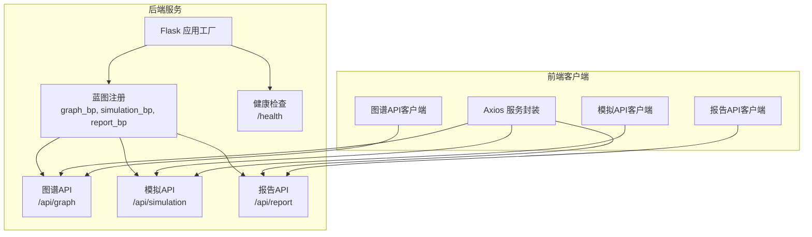
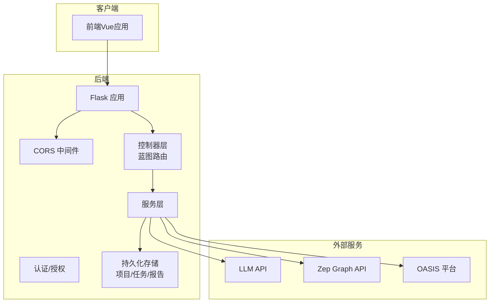
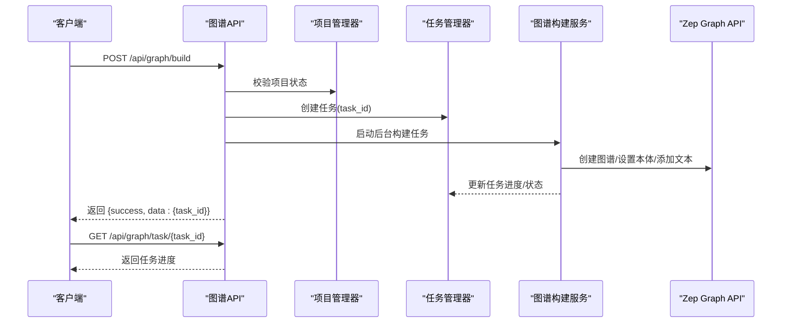
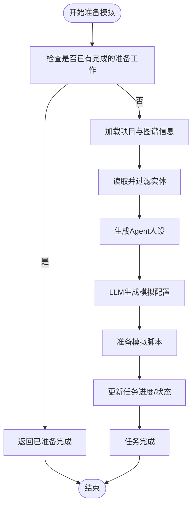
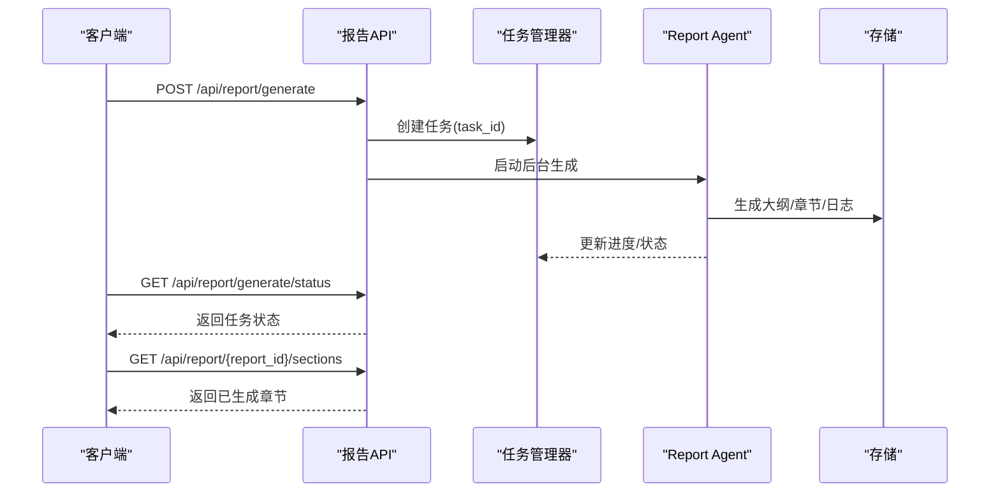
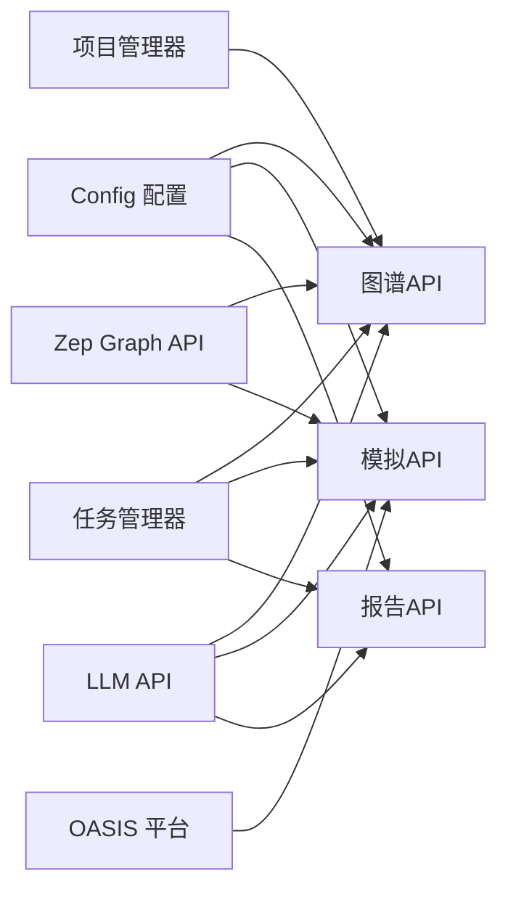

# API接口文档

<cite>
**本文档引用的文件**
- [backend/app/__init__.py](file://backend/app/__init__.py)
- [backend/run.py](file://backend/run.py)
- [backend/app/config.py](file://backend/app/config.py)
- [backend/app/api/__init__.py](file://backend/app/api/__init__.py)
- [backend/app/api/graph.py](file://backend/app/api/graph.py)
- [backend/app/api/simulation.py](file://backend/app/api/simulation.py)
- [backend/app/api/report.py](file://backend/app/api/report.py)
- [backend/app/models/project.py](file://backend/app/models/project.py)
- [backend/app/models/task.py](file://backend/app/models/task.py)
- [backend/app/services/report_agent.py](file://backend/app/services/report_agent.py)
- [backend/app/services/simulation_manager.py](file://backend/app/services/simulation_manager.py)
- [frontend/src/api/index.js](file://frontend/src/api/index.js)
- [frontend/src/api/graph.js](file://frontend/src/api/graph.js)
- [frontend/src/api/simulation.js](file://frontend/src/api/simulation.js)
- [frontend/src/api/report.js](file://frontend/src/api/report.js)
- [README.md](file://README.md)
</cite>

## 目录
1. [简介](#简介)
2. [项目结构](#项目结构)
3. [核心组件](#核心组件)
4. [架构概览](#架构概览)
5. [详细组件分析](#详细组件分析)
6. [依赖关系分析](#依赖关系分析)
7. [性能考虑](#性能考虑)
8. [故障排除指南](#故障排除指南)
9. [结论](#结论)
10. [附录](#附录)

## 简介
本文件为 MiroFish 的 RESTful API 接口完整技术参考，涵盖图谱 API、模拟 API 和报告 API 的全部端点规范。文档面向前端开发者与第三方集成商，提供详细的 URL 模式、请求方法、参数规范、响应格式、请求示例、响应示例、错误处理机制、认证方法、安全考虑、速率限制、客户端实现指南、最佳实践、API 版本管理与向后兼容性说明。

## 项目结构
后端基于 Flask 应用工厂模式，通过蓝图注册三个 API 命名空间：
- 图谱 API：/api/graph
- 模拟 API：/api/simulation  
- 报告 API：/api/report

应用启动时进行配置校验、CORS 允许跨域、注册蓝图并提供健康检查端点。

**图表来源**
- [backend/app/__init__.py](file://backend/app/__init__.py#L66-L69)
- [backend/app/api/__init__.py](file://backend/app/api/__init__.py#L7-L13)

**章节来源**
- [backend/app/__init__.py](file://backend/app/__init__.py#L19-L81)
- [backend/app/api/__init__.py](file://backend/app/api/__init__.py#L1-L15)
- [backend/run.py](file://backend/run.py#L25-L50)

## 核心组件
- 配置管理：集中管理 LLM、Zep、文件上传、OASIS 平台、Report Agent 等配置项，并提供配置校验。
- 项目上下文：以服务端持久化的方式管理项目状态，避免前端在接口间传递大量数据。
- 任务管理：线程安全的任务状态管理，支持异步任务进度跟踪与结果返回。
- 服务层：各 API 蓝图调用对应服务层（如图谱构建、模拟准备、报告生成），实现业务逻辑解耦。

**章节来源**
- [backend/app/config.py](file://backend/app/config.py#L20-L76)
- [backend/app/models/project.py](file://backend/app/models/project.py#L17-L98)
- [backend/app/models/task.py](file://backend/app/models/task.py#L14-L185)

## 架构概览
系统采用三层架构：前端客户端 → 后端 API 层 → 服务层与外部服务（LLM、Zep）。所有 API 响应遵循统一的 success/error 模式；异步任务通过任务 ID 查询进度；CORS 已启用以支持跨域访问。

**图表来源**
- [backend/app/__init__.py](file://backend/app/__init__.py#L42-L63)
- [backend/app/config.py](file://backend/app/config.py#L30-L64)

**章节来源**
- [backend/app/__init__.py](file://backend/app/__init__.py#L42-L63)
- [backend/app/config.py](file://backend/app/config.py#L30-L64)

## 详细组件分析

### 图谱 API（/api/graph）
提供项目管理、本体生成、图谱构建、任务查询与图谱数据获取等能力。

#### 1) 项目管理
- GET /api/graph/project/{project_id}
  - 功能：获取项目详情
  - 成功响应字段：success、data（包含项目完整信息）
  - 失败响应：404 且返回 error
- GET /api/graph/project/list?limit=N
  - 功能：列出项目
  - 成功响应：success、data（项目数组）、count
- DELETE /api/graph/project/{project_id}
  - 功能：删除项目
  - 成功响应：success、message
  - 失败响应：404 且返回 error
- POST /api/graph/project/{project_id}/reset
  - 功能：重置项目状态（用于重新构建图谱）
  - 成功响应：success、message、data（重置后的项目）

#### 2) 本体生成（上传文件并生成本体）
- POST /api/graph/ontology/generate
  - 请求类型：multipart/form-data
  - 表单字段：
    - files：上传文件（PDF/MD/TXT，可多个）
    - simulation_requirement：模拟需求描述（必填）
    - project_name：项目名称（可选）
    - additional_context：额外说明（可选）
  - 成功响应：success、data（包含 project_id、ontology、analysis_summary、files、total_text_length）
  - 失败响应：400/500 且返回 error

#### 3) 图谱构建
- POST /api/graph/build
  - 请求体 JSON：
    - project_id：项目ID（必填）
    - graph_name：图谱名称（可选）
    - chunk_size：文本分块大小（可选，默认值见配置）
    - chunk_overlap：文本重叠大小（可选，默认值见配置）
    - force：强制重建（可选，默认false）
  - 成功响应：success、data（包含 project_id、task_id、message）
  - 失败响应：400/404/500 且返回 error

#### 4) 任务查询
- GET /api/graph/task/{task_id}
  - 功能：查询任务状态
  - 成功响应：success、data（任务详情）
  - 失败响应：404 且返回 error
- GET /api/graph/tasks
  - 功能：列出所有任务
  - 成功响应：success、data（任务数组）、count

#### 5) 图谱数据
- GET /api/graph/data/{graph_id}
  - 功能：获取图谱数据（节点和边）
  - 成功响应：success、data（图谱数据）
  - 失败响应：500 且返回 error
- DELETE /api/graph/delete/{graph_id}
  - 功能：删除Zep图谱
  - 成功响应：success、message
  - 失败响应：500 且返回 error

**图表来源**
- [backend/app/api/graph.py](file://backend/app/api/graph.py#L259-L525)
- [backend/app/models/task.py](file://backend/app/models/task.py#L73-L99)

**章节来源**
- [backend/app/api/graph.py](file://backend/app/api/graph.py#L35-L117)
- [backend/app/api/graph.py](file://backend/app/api/graph.py#L121-L255)
- [backend/app/api/graph.py](file://backend/app/api/graph.py#L259-L525)
- [backend/app/api/graph.py](file://backend/app/api/graph.py#L529-L618)

### 模拟 API（/api/simulation）
提供实体读取、模拟创建与准备、运行状态查询、配置与资料获取、批量采访、环境管理等能力。

#### 1) 实体读取
- GET /api/simulation/entities/{graph_id}?entity_types=A,B&enrich=true
  - 功能：获取图谱中的所有实体（已过滤）
  - 成功响应：success、data（实体列表与边信息）
- GET /api/simulation/entities/{graph_id}/{entity_uuid}
  - 功能：获取单个实体的详细信息
  - 成功响应：success、data（实体详情）
- GET /api/simulation/entities/{graph_id}/by-type/{entity_type}?enrich=true
  - 功能：获取指定类型的所有实体
  - 成功响应：success、data（包含实体类型、数量、实体数组）

#### 2) 模拟管理
- POST /api/simulation/create
  - 请求体 JSON：project_id、graph_id（可选）、enable_twitter、enable_reddit
  - 成功响应：success、data（模拟状态）
- POST /api/simulation/prepare
  - 请求体 JSON：simulation_id、entity_types、use_llm_for_profiles、parallel_profile_count、force_regenerate
  - 成功响应：success、data（包含 task_id、status、message、already_prepared 等）
- POST /api/simulation/prepare/status
  - 请求体 JSON：task_id 或 simulation_id
  - 成功响应：success、data（任务状态或已准备完成信息）
- GET /api/simulation/{simulation_id}
  - 功能：获取模拟状态
  - 成功响应：success、data（模拟状态，若已准备好附加运行说明）
- GET /api/simulation/list?project_id=...
  - 功能：列出所有模拟（可按项目过滤）
  - 成功响应：success、data（模拟数组）、count

**图表来源**
- [backend/app/api/simulation.py](file://backend/app/api/simulation.py#L358-L635)
- [backend/app/services/simulation_manager.py](file://backend/app/services/simulation_manager.py#L193-L200)

**章节来源**
- [backend/app/api/simulation.py](file://backend/app/api/simulation.py#L47-L160)
- [backend/app/api/simulation.py](file://backend/app/api/simulation.py#L164-L237)
- [backend/app/api/simulation.py](file://backend/app/api/simulation.py#L358-L748)
- [backend/app/api/simulation.py](file://backend/app/api/simulation.py#L750-L800)

### 报告 API（/api/report）
提供报告生成、获取、对话、进度查询、章节分发、日志追踪等能力。

#### 1) 报告生成
- POST /api/report/generate
  - 请求体 JSON：simulation_id、force_regenerate
  - 成功响应：success、data（包含 task_id、status、message、already_generated 等）
- POST /api/report/generate/status
  - 请求体 JSON：task_id 或 simulation_id
  - 成功响应：success、data（任务状态）

#### 2) 报告获取
- GET /api/report/{report_id}
  - 功能：获取报告详情
  - 成功响应：success、data（报告内容）
- GET /api/report/by-simulation/{simulation_id}
  - 功能：根据模拟ID获取报告
  - 成功响应：success、data（报告详情）
- GET /api/report/list?simulation_id=...&limit=N
  - 功能：列出报告
  - 成功响应：success、data（报告数组）、count
- GET /api/report/{report_id}/download
  - 功能：下载报告（Markdown）
  - 成功响应：返回文件流
- DELETE /api/report/{report_id}
  - 功能：删除报告
  - 成功响应：success、message

#### 3) 报告对话与进度
- POST /api/report/chat
  - 请求体 JSON：simulation_id、message、chat_history
  - 成功响应：success、data（包含 response、tool_calls、sources）
- GET /api/report/{report_id}/progress
  - 功能：获取报告生成进度（实时）
  - 成功响应：success、data（包含 status、progress、message、当前章节等）
- GET /api/report/{report_id}/sections
  - 功能：获取已生成章节列表（分章节输出）
  - 成功响应：success、data（sections 数组、total_sections、is_complete）
- GET /api/report/{report_id}/section/{section_index}
  - 功能：获取单个章节内容
  - 成功响应：success、data（filename、content）
- GET /api/report/check/{simulation_id}
  - 功能：检查模拟是否有报告及报告状态（用于前端解锁 Interview）
  - 成功响应：success、data（包含 has_report、report_status、report_id、interview_unlocked）

#### 4) 日志追踪
- GET /api/report/{report_id}/agent-log?from_line=N
  - 功能：获取 Report Agent 的详细执行日志（增量）
  - 成功响应：success、data（包含 logs、total_lines、from_line、has_more）

**图表来源**
- [backend/app/api/report.py](file://backend/app/api/report.py#L24-L196)
- [backend/app/api/report.py](file://backend/app/api/report.py#L198-L268)
- [backend/app/api/report.py](file://backend/app/api/report.py#L272-L463)
- [backend/app/api/report.py](file://backend/app/api/report.py#L467-L560)
- [backend/app/api/report.py](file://backend/app/api/report.py#L564-L749)
- [backend/app/api/report.py](file://backend/app/api/report.py#L753-L800)
- [backend/app/services/report_agent.py](file://backend/app/services/report_agent.py#L35-L98)

**章节来源**
- [backend/app/api/report.py](file://backend/app/api/report.py#L24-L196)
- [backend/app/api/report.py](file://backend/app/api/report.py#L198-L268)
- [backend/app/api/report.py](file://backend/app/api/report.py#L272-L463)
- [backend/app/api/report.py](file://backend/app/api/report.py#L467-L560)
- [backend/app/api/report.py](file://backend/app/api/report.py#L564-L749)
- [backend/app/api/report.py](file://backend/app/api/report.py#L753-L800)
- [backend/app/services/report_agent.py](file://backend/app/services/report_agent.py#L35-L98)

## 依赖关系分析
- 配置依赖：所有 API 路由依赖 Config 类提供的 LLM、Zep、文件上传、OASIS、Report Agent 等配置。
- 数据模型：Project、Task 等模型负责服务端状态持久化与任务进度管理。
- 服务层：图谱构建、模拟准备、报告生成等均通过对应服务类实现，保持控制器层薄化。
- 外部服务：LLM API、Zep Graph API、OASIS 平台。

**图表来源**
- [backend/app/config.py](file://backend/app/config.py#L20-L76)
- [backend/app/models/project.py](file://backend/app/models/project.py#L101-L196)
- [backend/app/models/task.py](file://backend/app/models/task.py#L54-L185)
- [backend/app/api/graph.py](file://backend/app/api/graph.py#L285-L294)
- [backend/app/api/simulation.py](file://backend/app/api/simulation.py#L59-L63)
- [backend/app/api/report.py](file://backend/app/api/report.py#L12-L17)

**章节来源**
- [backend/app/config.py](file://backend/app/config.py#L20-L76)
- [backend/app/models/project.py](file://backend/app/models/project.py#L101-L196)
- [backend/app/models/task.py](file://backend/app/models/task.py#L54-L185)

## 性能考虑
- 异步任务：图谱构建、模拟准备、报告生成均为异步任务，通过任务 ID 查询进度，避免阻塞请求。
- 文本分块：图谱构建默认分块大小与重叠大小可配置，合理设置可平衡吞吐与精度。
- 并行生成：模拟准备支持并行生成 Agent 人设，提升大规模实体场景下的准备效率。
- 超时与重试：前端 Axios 默认 5 分钟超时，提供指数退避重试机制，建议客户端在长任务场景下配合轮询与重试策略。

[本节为通用指导，无需特定文件引用]

## 故障排除指南
- 常见错误码
  - 400：请求参数缺失或无效（如缺少 project_id、simulation_requirement）
  - 404：资源不存在（项目、任务、报告、图谱）
  - 500：服务端配置错误或内部异常（如 ZEP_API_KEY 未配置）
- 统一响应结构
  - 成功：{ success: true, data: ... }
  - 失败：{ success: false, error: "错误信息" }
- 建议排查步骤
  - 检查 .env 配置（LLM_API_KEY、ZEP_API_KEY）
  - 确认任务 ID 有效且未过期
  - 查看后端日志与任务进度详情
  - 前端 Axios 已内置错误拦截与重试，注意观察控制台输出

**章节来源**
- [backend/app/config.py](file://backend/app/config.py#L66-L76)
- [backend/app/api/graph.py](file://backend/app/api/graph.py#L285-L294)
- [frontend/src/api/index.js](file://frontend/src/api/index.js#L24-L51)

## 结论
本文档提供了 MiroFish RESTful API 的完整技术参考，覆盖图谱、模拟、报告三大领域，明确了端点规范、数据模型、异步任务机制与错误处理策略。建议在生产环境中结合任务轮询、重试与日志监控，确保长耗时任务的稳定性与可观测性。

[本节为总结性内容，无需特定文件引用]

## 附录

### A. 认证与安全
- 认证方式：后端未实现全局认证中间件，建议在网关或反向代理层增加鉴权策略。
- CORS：已启用，允许所有来源访问 /api/*。
- 安全建议：
  - 限制文件上传类型与大小（已在配置中设置）
  - 通过反向代理启用 HTTPS
  - 严格管理 LLM_API_KEY 与 ZEP_API_KEY

**章节来源**
- [backend/app/__init__.py](file://backend/app/__init__.py#L42-L43)
- [backend/app/config.py](file://backend/app/config.py#L38-L41)

### B. 速率限制
- 后端未实现全局速率限制。建议在网关或反向代理层配置限流策略，防止滥用。

[本节为通用指导，无需特定文件引用]

### C. 客户端实现指南与最佳实践
- 前端 Axios 封装
  - 基础 URL：VITE_API_BASE_URL（默认 http://localhost:5001）
  - 超时：5 分钟（适合本体生成等长任务）
  - 错误拦截：统一抛出 error，便于前端捕获
  - 重试：requestWithRetry 提供指数退避重试
- 图谱 API 客户端
  - multipart/form-data 上传文件
  - 通过 /api/graph/task/{task_id} 轮询任务进度
- 模拟 API 客户端
  - 先创建模拟，再准备环境，最后查询状态
  - 使用 /api/simulation/prepare/status 轮询准备进度
- 报告 API 客户端
  - 生成报告后通过 /api/report/generate/status 轮询
  - 使用 /api/report/{report_id}/sections 分批获取章节内容

**章节来源**
- [frontend/src/api/index.js](file://frontend/src/api/index.js#L4-L10)
- [frontend/src/api/index.js](file://frontend/src/api/index.js#L54-L65)
- [frontend/src/api/graph.js](file://frontend/src/api/graph.js#L8-L19)
- [frontend/src/api/simulation.js](file://frontend/src/api/simulation.js#L7-L25)
- [frontend/src/api/report.js](file://frontend/src/api/report.js#L7-L26)

### D. API 版本管理与向后兼容
- 当前版本：v0.1.0（见 README）
- 版本策略建议：
  - 语义化版本控制（MAJOR.MINOR.PATCH）
  - 向后兼容：新增字段时保持 success/error 结构不变
  - 废弃字段：在下一个 MINOR 版本中移除并在 PATCH 中标注废弃
  - 发布前：在 README 中记录变更日志与迁移指南

**章节来源**
- [README.md](file://README.md#L20-L21)