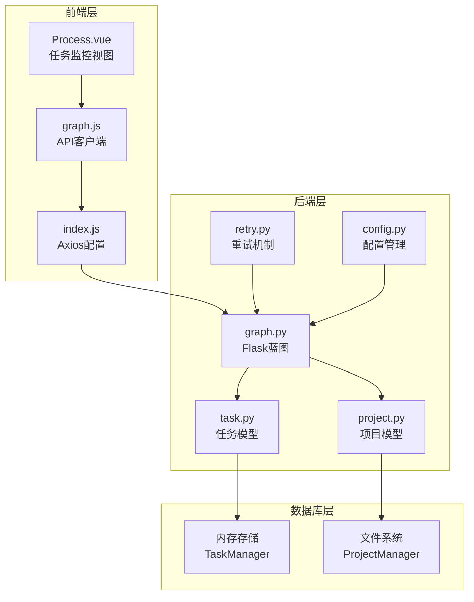
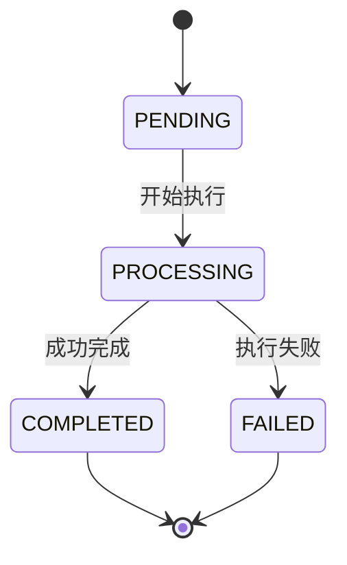
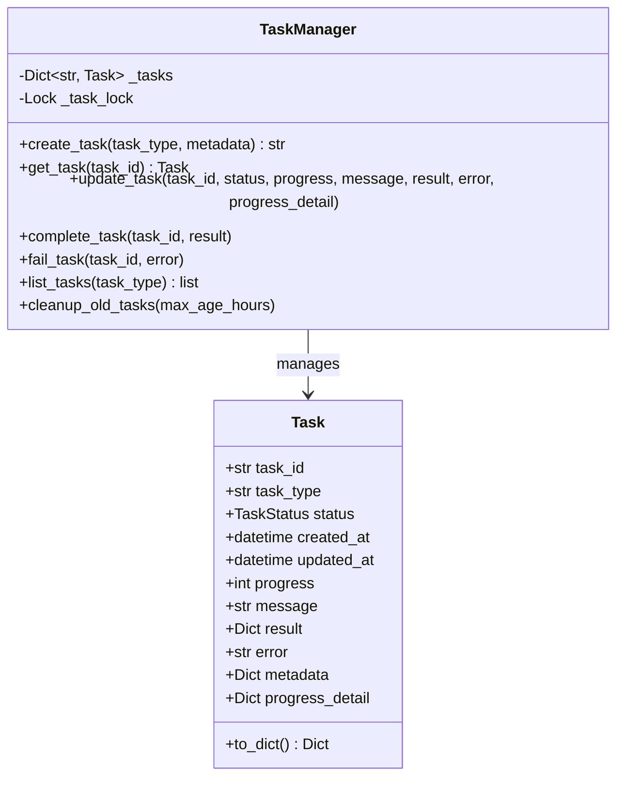
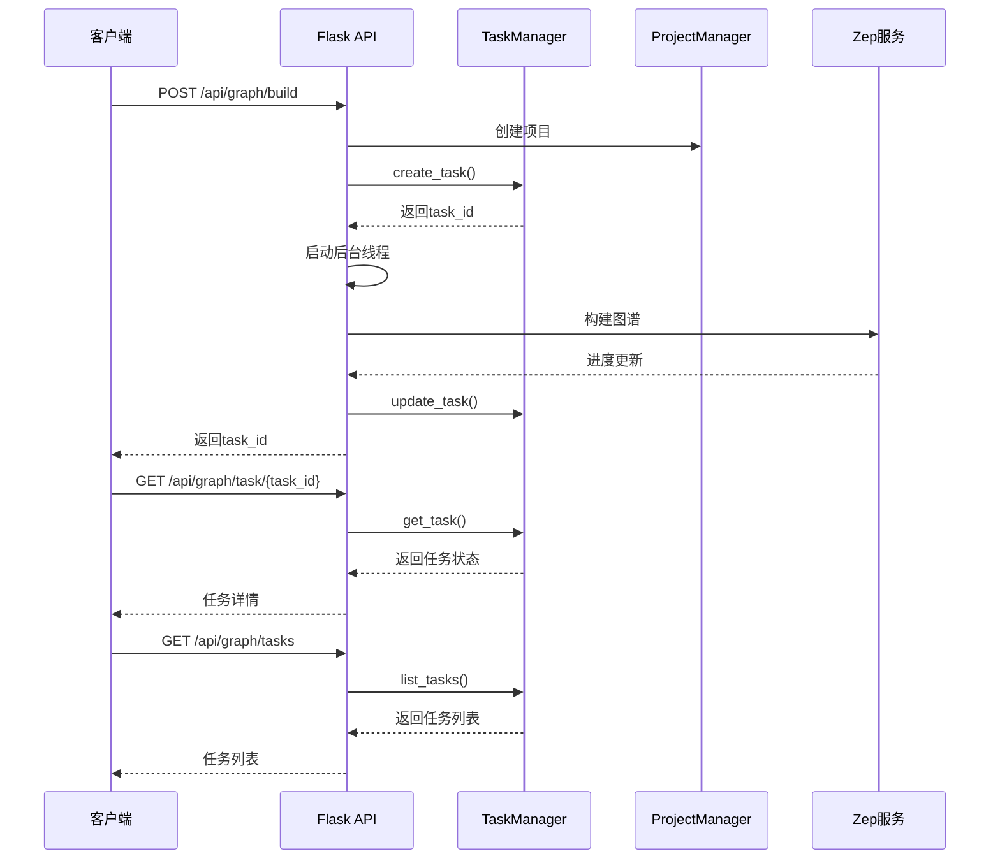
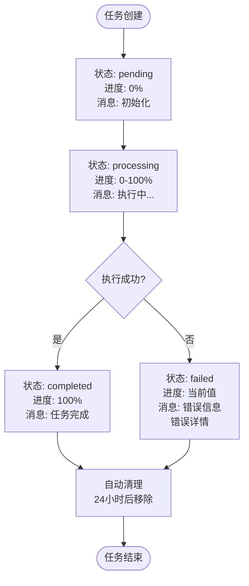
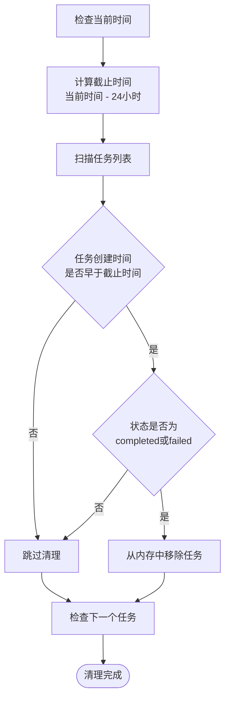
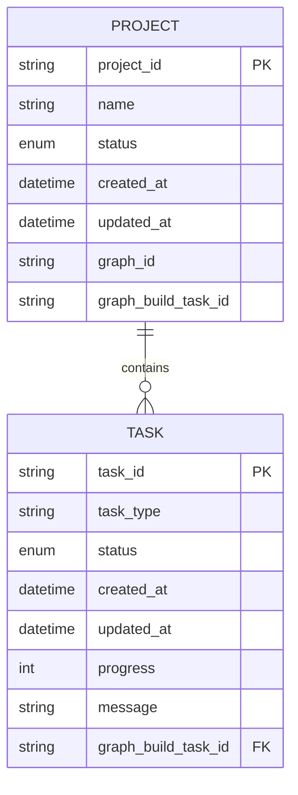
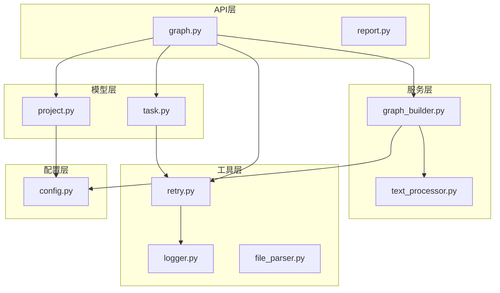
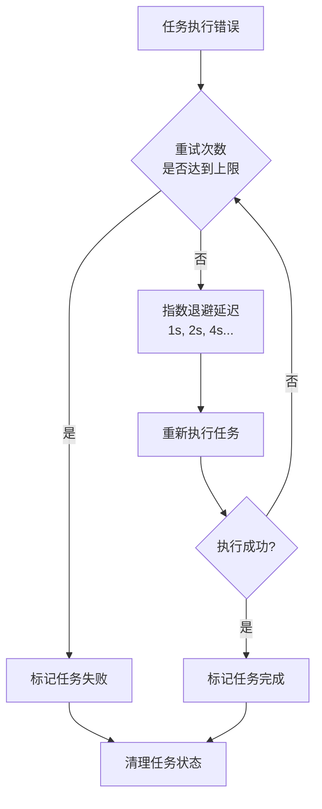

# 任务监控接口

<cite>
**本文档引用的文件**
- [backend/app/models/task.py](file://backend/app/models/task.py)
- [backend/app/api/graph.py](file://backend/app/api/graph.py)
- [backend/app/models/project.py](file://backend/app/models/project.py)
- [backend/app/utils/retry.py](file://backend/app/utils/retry.py)
- [backend/app/config.py](file://backend/app/config.py)
- [frontend/src/views/Process.vue](file://frontend/src/views/Process.vue)
- [frontend/src/api/index.js](file://frontend/src/api/index.js)
- [frontend/src/api/graph.js](file://frontend/src/api/graph.js)
</cite>

## 目录
1. [简介](#简介)
2. [项目结构](#项目结构)
3. [核心组件](#核心组件)
4. [架构概览](#架构概览)
5. [详细组件分析](#详细组件分析)
6. [依赖关系分析](#依赖关系分析)
7. [性能考虑](#性能考虑)
8. [故障排除指南](#故障排除指南)
9. [结论](#结论)

## 简介

MiroFish项目提供了完整的任务监控接口，用于跟踪长时间运行的任务状态。该系统基于Flask框架构建，采用内存中的任务管理器来跟踪任务状态，并通过RESTful API提供任务查询功能。

系统支持两种主要任务监控接口：
- 单个任务查询接口：GET /api/graph/task/{task_id}
- 任务列表查询接口：GET /api/graph/tasks

## 项目结构



**图表来源**
- [backend/app/api/graph.py](file://backend/app/api/graph.py#L1-L618)
- [backend/app/models/task.py](file://backend/app/models/task.py#L1-L185)
- [backend/app/models/project.py](file://backend/app/models/project.py#L1-L306)

## 核心组件

### 任务状态管理

系统定义了完整的任务状态枚举，支持四种状态：



**图表来源**
- [backend/app/models/task.py](file://backend/app/models/task.py#L14-L20)

### 任务数据模型

任务对象包含以下关键字段：
- `task_id`: 唯一任务标识符（UUID生成）
- `task_type`: 任务类型描述
- `status`: 当前任务状态
- `progress`: 进度百分比（0-100）
- `message`: 状态消息
- `result`: 任务执行结果
- `error`: 错误信息
- `metadata`: 额外元数据
- `progress_detail`: 详细进度信息

**章节来源**
- [backend/app/models/task.py](file://backend/app/models/task.py#L22-L51)

### 任务管理器

任务管理器提供线程安全的任务操作接口：



**图表来源**
- [backend/app/models/task.py](file://backend/app/models/task.py#L54-L184)

**章节来源**
- [backend/app/models/task.py](file://backend/app/models/task.py#L54-L184)

## 架构概览



**图表来源**
- [backend/app/api/graph.py](file://backend/app/api/graph.py#L259-L525)
- [backend/app/models/task.py](file://backend/app/models/task.py#L73-L104)

## 详细组件分析

### 任务监控API接口

#### 单个任务查询接口

**接口定义**
- 方法：GET
- 路径：/api/graph/task/{task_id}
- 功能：查询指定任务的详细状态

**请求参数**
- `task_id` (路径参数): 任务唯一标识符

**响应格式**
```json
{
  "success": true,
  "data": {
    "task_id": "string",
    "task_type": "string",
    "status": "pending|processing|completed|failed",
    "created_at": "datetime",
    "updated_at": "datetime",
    "progress": 0-100,
    "message": "string",
    "progress_detail": {},
    "result": {},
    "error": "string",
    "metadata": {}
  }
}
```

**状态码**
- 200: 成功获取任务状态
- 404: 任务不存在

**章节来源**
- [backend/app/api/graph.py](file://backend/app/api/graph.py#L529-L545)

#### 任务列表查询接口

**接口定义**
- 方法：GET
- 路径：/api/graph/tasks
- 功能：列出所有任务

**请求参数**
- 无

**响应格式**
```json
{
  "success": true,
  "data": [
    {
      "task_id": "string",
      "task_type": "string",
      "status": "pending|processing|completed|failed",
      "created_at": "datetime",
      "updated_at": "datetime",
      "progress": 0-100,
      "message": "string",
      "progress_detail": {},
      "result": {},
      "error": "string",
      "metadata": {}
    }
  ],
  "count": 0
}
```

**状态码**
- 200: 成功获取任务列表

**章节来源**
- [backend/app/api/graph.py](file://backend/app/api/graph.py#L548-L559)

### 任务生命周期管理



**图表来源**
- [backend/app/models/task.py](file://backend/app/models/task.py#L145-L162)

### 任务ID生成规则

任务ID采用UUID v4生成算法，确保全局唯一性：
- 基于随机数生成
- 128位长度
- 32个十六进制字符
- 包含连字符分隔符

**章节来源**
- [backend/app/models/task.py](file://backend/app/models/task.py#L84)

### 任务状态更新机制

系统支持多种状态更新方式：

1. **进度更新**：通过`update_task()`方法更新进度百分比
2. **状态变更**：通过`complete_task()`和`fail_task()`方法标记最终状态
3. **消息更新**：实时更新任务执行过程中的状态消息
4. **结果记录**：成功完成后记录执行结果

**章节来源**
- [backend/app/models/task.py](file://backend/app/models/task.py#L106-L162)

### 任务清理机制

系统提供自动清理功能，防止内存泄漏：



**图表来源**
- [backend/app/models/task.py](file://backend/app/models/task.py#L172-L183)

**章节来源**
- [backend/app/models/task.py](file://backend/app/models/task.py#L172-L183)

### 任务与项目状态关联

任务监控与项目状态紧密关联：



**图表来源**
- [backend/app/models/project.py](file://backend/app/models/project.py#L27-L98)
- [backend/app/models/task.py](file://backend/app/models/task.py#L22-L51)

**章节来源**
- [backend/app/models/project.py](file://backend/app/models/project.py#L43-L45)

## 依赖关系分析



**图表来源**
- [backend/app/api/graph.py](file://backend/app/api/graph.py#L1-L25)
- [backend/app/models/task.py](file://backend/app/models/task.py#L1-L12)
- [backend/app/models/project.py](file://backend/app/models/project.py#L1-L14)

**章节来源**
- [backend/app/api/graph.py](file://backend/app/api/graph.py#L1-L25)
- [backend/app/models/task.py](file://backend/app/models/task.py#L1-L12)

## 性能考虑

### 前端轮询策略

前端采用智能轮询机制：
- **轮询间隔**：2秒
- **条件判断**：仅在任务进行中时轮询
- **资源管理**：任务完成后自动停止轮询

### 后端性能优化

- **线程安全**：使用锁机制保证并发安全
- **内存管理**：定期清理已完成任务
- **异步处理**：长任务在后台线程执行

### 错误恢复机制

系统提供多重错误恢复策略：



**图表来源**
- [backend/app/utils/retry.py](file://backend/app/utils/retry.py#L15-L77)

**章节来源**
- [backend/app/utils/retry.py](file://backend/app/utils/retry.py#L15-L77)

## 故障排除指南

### 常见问题及解决方案

**问题1：任务状态查询返回404**
- 检查任务ID是否正确
- 确认任务是否已被清理
- 验证任务是否在有效时间内

**问题2：任务长时间处于pending状态**
- 检查系统资源是否充足
- 验证外部服务连接状态
- 查看任务创建时间确认是否超时

**问题3：前端轮询无响应**
- 检查网络连接状态
- 验证API服务器运行状态
- 确认浏览器控制台错误信息

### 调试建议

1. **后端调试**：查看任务管理器中的任务状态
2. **前端调试**：检查轮询逻辑和状态更新
3. **网络调试**：验证API响应时间和错误码

**章节来源**
- [frontend/src/views/Process.vue](file://frontend/src/views/Process.vue#L783-L837)

## 结论

MiroFish的任务监控接口提供了完整、可靠的任务状态跟踪机制。系统采用内存存储确保高性能，同时提供自动清理机制防止资源泄漏。前后端配合的轮询策略保证了实时状态更新，而多重错误恢复机制确保了系统的稳定性。

该接口设计简洁明了，易于集成和扩展，为MiroFish项目提供了强大的任务管理能力。