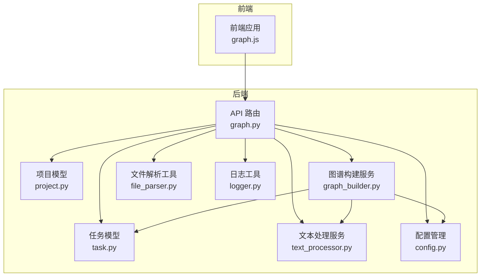
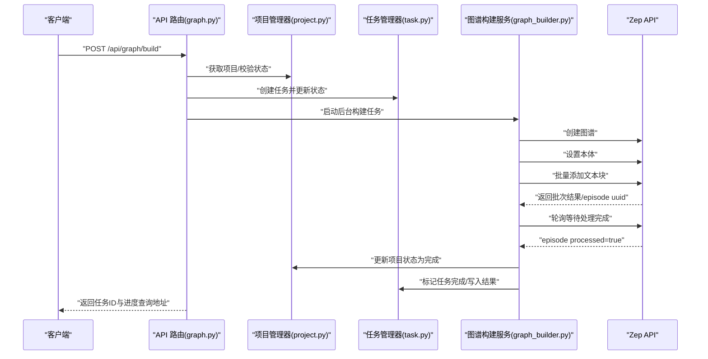
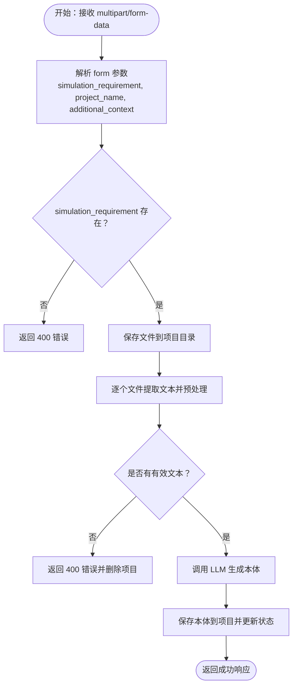
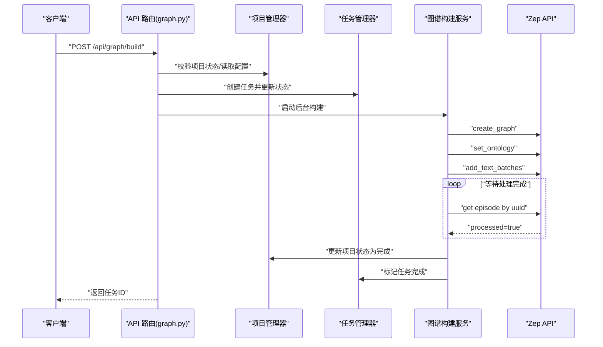
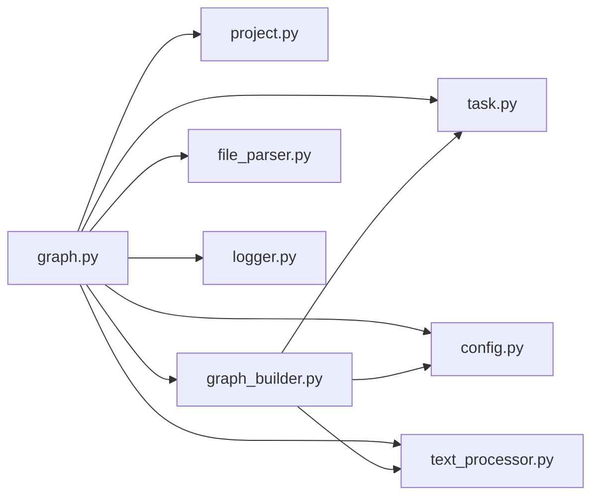

# 图谱API接口

<cite>
**本文引用的文件**
- [backend/app/api/graph.py](file://backend/app/api/graph.py)
- [backend/app/models/project.py](file://backend/app/models/project.py)
- [backend/app/models/task.py](file://backend/app/models/task.py)
- [backend/app/services/graph_builder.py](file://backend/app/services/graph_builder.py)
- [backend/app/config.py](file://backend/app/config.py)
- [backend/app/utils/file_parser.py](file://backend/app/utils/file_parser.py)
- [backend/app/utils/logger.py](file://backend/app/utils/logger.py)
- [backend/app/services/text_processor.py](file://backend/app/services/text_processor.py)
- [frontend/src/api/graph.js](file://frontend/src/api/graph.js)
- [README.md](file://README.md)
</cite>

## 目录
1. [简介](#简介)
2. [项目结构](#项目结构)
3. [核心组件](#核心组件)
4. [架构总览](#架构总览)
5. [详细组件分析](#详细组件分析)
6. [依赖关系分析](#依赖关系分析)
7. [性能考虑](#性能考虑)
8. [故障排除指南](#故障排除指南)
9. [结论](#结论)
10. [附录](#附录)

## 简介
本文件为 MiroFish 的图谱 API 接口详细文档，覆盖以下功能域：
- 项目管理接口：获取项目、列出项目、删除项目、重置项目
- 本体生成接口：上传文件生成本体
- 图谱构建接口：构建图谱、任务查询
- 图谱数据接口：获取图谱数据、删除图谱

文档包含每个端点的 HTTP 方法、URL 模式、请求参数、响应格式、错误处理、参数验证规则、状态码说明、常见错误解决方案，并提供完整的请求示例、响应示例与实际代码中的使用案例。同时解释项目状态管理、异步任务处理与 Zep 图谱集成的工作原理。

## 项目结构
后端采用 Flask Blueprint 组织 API，核心模块包括：
- API 层：路由与控制器，负责请求解析、参数校验、调用服务层与返回统一响应
- 模型层：项目状态与任务状态的数据模型与持久化
- 服务层：图谱构建、本体生成、文本处理、文件解析等业务逻辑
- 工具层：日志、文件解析、LLM 客户端等基础设施
- 配置层：统一读取 .env 并提供运行时配置

**图表来源**
- [backend/app/api/graph.py](file://backend/app/api/graph.py#L1-L618)
- [backend/app/models/project.py](file://backend/app/models/project.py#L1-L306)
- [backend/app/models/task.py](file://backend/app/models/task.py#L1-L185)
- [backend/app/services/graph_builder.py](file://backend/app/services/graph_builder.py#L1-L500)
- [backend/app/utils/file_parser.py](file://backend/app/utils/file_parser.py#L1-L190)
- [backend/app/services/text_processor.py](file://backend/app/services/text_processor.py#L1-L72)
- [backend/app/config.py](file://backend/app/config.py#L1-L76)
- [backend/app/utils/logger.py](file://backend/app/utils/logger.py#L1-L127)
- [frontend/src/api/graph.js](file://frontend/src/api/graph.js#L1-L71)

**章节来源**
- [backend/app/api/graph.py](file://backend/app/api/graph.py#L1-L618)
- [backend/app/models/project.py](file://backend/app/models/project.py#L1-L306)
- [backend/app/models/task.py](file://backend/app/models/task.py#L1-L185)
- [backend/app/services/graph_builder.py](file://backend/app/services/graph_builder.py#L1-L500)
- [backend/app/utils/file_parser.py](file://backend/app/utils/file_parser.py#L1-L190)
- [backend/app/services/text_processor.py](file://backend/app/services/text_processor.py#L1-L72)
- [backend/app/config.py](file://backend/app/config.py#L1-L76)
- [backend/app/utils/logger.py](file://backend/app/utils/logger.py#L1-L127)
- [frontend/src/api/graph.js](file://frontend/src/api/graph.js#L1-L71)

## 核心组件
- 项目管理器：负责项目元数据的创建、保存、读取、删除与文件存储；维护项目状态机
- 任务管理器：负责异步任务的创建、状态更新、查询与清理
- 图谱构建服务：封装 Zep API，实现图谱创建、本体设置、文本分块与批量添加、进度回调、等待处理完成、获取图谱数据与删除图谱
- 文件解析与文本处理：支持 PDF/MD/TXT 文本提取与分块
- 配置与日志：统一读取 .env，提供运行时配置与日志输出

**章节来源**
- [backend/app/models/project.py](file://backend/app/models/project.py#L101-L306)
- [backend/app/models/task.py](file://backend/app/models/task.py#L54-L185)
- [backend/app/services/graph_builder.py](file://backend/app/services/graph_builder.py#L38-L500)
- [backend/app/utils/file_parser.py](file://backend/app/utils/file_parser.py#L61-L190)
- [backend/app/services/text_processor.py](file://backend/app/services/text_processor.py#L9-L72)
- [backend/app/config.py](file://backend/app/config.py#L20-L76)
- [backend/app/utils/logger.py](file://backend/app/utils/logger.py#L30-L127)

## 架构总览
下图展示从客户端到后端各组件的交互流程，重点体现异步任务与 Zep 集成：

**图表来源**
- [backend/app/api/graph.py](file://backend/app/api/graph.py#L259-L525)
- [backend/app/models/project.py](file://backend/app/models/project.py#L101-L166)
- [backend/app/models/task.py](file://backend/app/models/task.py#L54-L185)
- [backend/app/services/graph_builder.py](file://backend/app/services/graph_builder.py#L38-L500)

## 详细组件分析

### 项目管理接口
- 获取项目
  - 方法与路径：GET /api/graph/project/{project_id}
  - 请求参数：路径参数 project_id
  - 成功响应：包含项目详情的 data 字段
  - 错误响应：404 项目不存在
- 列出项目
  - 方法与路径：GET /api/graph/project/list
  - 请求参数：limit（可选，默认 50）
  - 成功响应：包含项目数组与 count
- 删除项目
  - 方法与路径：DELETE /api/graph/project/{project_id}
  - 成功响应：删除成功消息；404 项目不存在或删除失败
- 重置项目
  - 方法与路径：POST /api/graph/project/{project_id}/reset
  - 行为：将项目状态重置为“本体已生成”或“已创建”，清空图谱相关字段

参数验证与状态约束：
- 项目状态机：created → ontology_generated → graph_building → graph_completed 或 failed
- 重置逻辑：若存在本体则回到 ontology_generated，否则回到 created

**章节来源**
- [backend/app/api/graph.py](file://backend/app/api/graph.py#L35-L117)
- [backend/app/models/project.py](file://backend/app/models/project.py#L17-L24)
- [backend/app/models/project.py](file://backend/app/models/project.py#L101-L239)

### 本体生成接口
- 接口：POST /api/graph/ontology/generate
- 请求方式：multipart/form-data
- 请求参数：
  - files：上传的文件（PDF/MD/TXT），可多个
  - simulation_requirement：模拟需求描述（必填）
  - project_name：项目名称（可选）
  - additional_context：额外说明（可选）
- 成功响应字段：
  - project_id：项目标识
  - project_name：项目名称
  - ontology：本体定义（实体类型、关系类型、分析摘要）
  - files：上传文件信息列表
  - total_text_length：提取文本总长度
- 错误响应：
  - 400 缺少必要参数或无有效文档
  - 500 内部异常（包含 traceback）

流程要点：
- 校验文件扩展名（ALLOWED_EXTENSIONS）
- 保存文件到项目目录，提取文本并预处理
- 调用 LLM 生成本体，保存到项目并更新状态为 ontology_generated

**图表来源**
- [backend/app/api/graph.py](file://backend/app/api/graph.py#L121-L255)
- [backend/app/utils/file_parser.py](file://backend/app/utils/file_parser.py#L61-L190)
- [backend/app/services/text_processor.py](file://backend/app/services/text_processor.py#L9-L72)
- [backend/app/config.py](file://backend/app/config.py#L38-L46)

**章节来源**
- [backend/app/api/graph.py](file://backend/app/api/graph.py#L121-L255)
- [backend/app/utils/file_parser.py](file://backend/app/utils/file_parser.py#L61-L190)
- [backend/app/services/text_processor.py](file://backend/app/services/text_processor.py#L9-L72)
- [backend/app/config.py](file://backend/app/config.py#L38-L46)

### 图谱构建接口
- 接口：POST /api/graph/build
- 请求体 JSON：
  - project_id：必填（来自本体生成接口）
  - graph_name：可选
  - chunk_size：可选（默认 500）
  - chunk_overlap：可选（默认 50）
  - force：可选（强制重建）
- 成功响应：包含 project_id、task_id 与提示信息
- 错误响应：
  - 400 缺少 project_id、项目状态不符合、未找到提取文本或本体
  - 404 项目不存在
  - 500 ZEP_API_KEY 未配置或内部异常

构建流程与状态迁移：
- 校验配置与项目状态
- 若处于 graph_building 且未 force，则拒绝重复提交
- 创建任务并更新项目状态为 graph_building
- 后台线程执行：
  - 文本分块
  - 创建 Zep 图谱并设置本体
  - 批量添加文本块并等待处理完成
  - 获取图谱数据，更新项目状态为 graph_completed
  - 任务标记完成并写入结果

任务查询接口：
- GET /api/graph/task/{task_id}：查询任务状态
- GET /api/graph/tasks：列出所有任务

**图表来源**
- [backend/app/api/graph.py](file://backend/app/api/graph.py#L259-L525)
- [backend/app/services/graph_builder.py](file://backend/app/services/graph_builder.py#L38-L500)
- [backend/app/models/task.py](file://backend/app/models/task.py#L54-L185)
- [backend/app/models/project.py](file://backend/app/models/project.py#L101-L166)

**章节来源**
- [backend/app/api/graph.py](file://backend/app/api/graph.py#L259-L525)
- [backend/app/models/task.py](file://backend/app/models/task.py#L54-L185)
- [backend/app/services/graph_builder.py](file://backend/app/services/graph_builder.py#L38-L500)

### 图谱数据接口
- 获取图谱数据
  - 方法与路径：GET /api/graph/data/{graph_id}
  - 成功响应：包含 nodes、edges、node_count、edge_count 等
  - 错误响应：500 ZEP_API_KEY 未配置或内部异常
- 删除图谱
  - 方法与路径：DELETE /api/graph/delete/{graph_id}
  - 成功响应：删除成功消息
  - 错误响应：500 ZEP_API_KEY 未配置或内部异常

**章节来源**
- [backend/app/api/graph.py](file://backend/app/api/graph.py#L564-L618)
- [backend/app/services/graph_builder.py](file://backend/app/services/graph_builder.py#L419-L500)

## 依赖关系分析
- API 层依赖模型层（项目与任务）、服务层（图谱构建、文本处理、文件解析）、配置层与日志工具
- 图谱构建服务依赖 Zep SDK、任务管理器与文本处理器
- 配置层统一读取 .env，提供 LLM 与 Zep 的密钥与默认参数

**图表来源**
- [backend/app/api/graph.py](file://backend/app/api/graph.py#L1-L618)
- [backend/app/models/project.py](file://backend/app/models/project.py#L1-L306)
- [backend/app/models/task.py](file://backend/app/models/task.py#L1-L185)
- [backend/app/services/graph_builder.py](file://backend/app/services/graph_builder.py#L1-L500)
- [backend/app/utils/file_parser.py](file://backend/app/utils/file_parser.py#L1-L190)
- [backend/app/services/text_processor.py](file://backend/app/services/text_processor.py#L1-L72)
- [backend/app/config.py](file://backend/app/config.py#L1-L76)
- [backend/app/utils/logger.py](file://backend/app/utils/logger.py#L1-L127)

**章节来源**
- [backend/app/api/graph.py](file://backend/app/api/graph.py#L1-L618)
- [backend/app/models/project.py](file://backend/app/models/project.py#L1-L306)
- [backend/app/models/task.py](file://backend/app/models/task.py#L1-L185)
- [backend/app/services/graph_builder.py](file://backend/app/services/graph_builder.py#L1-L500)
- [backend/app/utils/file_parser.py](file://backend/app/utils/file_parser.py#L1-L190)
- [backend/app/services/text_processor.py](file://backend/app/services/text_processor.py#L1-L72)
- [backend/app/config.py](file://backend/app/config.py#L1-L76)
- [backend/app/utils/logger.py](file://backend/app/utils/logger.py#L1-L127)

## 性能考虑
- 文本分块：默认 chunk_size=500，chunk_overlap=50，可根据数据规模调整以平衡召回与性能
- 批量添加：默认 batch_size=3，避免请求过快导致限流
- 异步任务：构建过程在后台线程执行，避免阻塞 API 响应
- 日志轮转：日志文件按天轮转，避免磁盘占用过大
- 文件上传：最大 50MB，建议对大文件进行压缩或拆分

[本节为通用指导，不直接分析具体文件]

## 故障排除指南
常见错误与解决步骤：
- 400 缺少 simulation_requirement 或 files
  - 确认 multipart/form-data 中包含 simulation_requirement 与 files
  - 检查文件扩展名是否在 ALLOWED_EXTENSIONS 中
- 400 项目尚未生成本体
  - 先调用本体生成接口，再调用构建图谱接口
- 400 图谱正在构建中
  - 等待当前任务完成，或使用 force=true 强制重建
- 404 项目不存在
  - 确认 project_id 正确，或先创建项目
- 500 ZEP_API_KEY 未配置
  - 在 .env 中设置 ZEP_API_KEY，并重启服务
- 500 内部异常
  - 查看后端日志文件定位具体错误堆栈

调试建议：
- 使用任务查询接口 /api/graph/task/{task_id} 实时跟踪进度
- 检查日志目录中的日志文件，定位异常发生阶段

**章节来源**
- [backend/app/api/graph.py](file://backend/app/api/graph.py#L160-L173)
- [backend/app/api/graph.py](file://backend/app/api/graph.py#L301-L330)
- [backend/app/config.py](file://backend/app/config.py#L66-L76)
- [backend/app/utils/logger.py](file://backend/app/utils/logger.py#L26-L88)

## 结论
本图谱 API 通过清晰的项目状态机与异步任务机制，实现了从“文档上传与本体生成”到“图谱构建与数据查询”的完整闭环。Zep 集成提供了稳定的图谱存储与检索能力，配合任务进度反馈，使复杂流程对客户端透明。建议在生产环境中合理配置 chunk_size 与 batch_size，并完善监控与告警以提升稳定性。

[本节为总结性内容，不直接分析具体文件]

## 附录

### API 端点一览与规范
- 项目管理
  - GET /api/graph/project/{project_id}
  - GET /api/graph/project/list?limit=N
  - DELETE /api/graph/project/{project_id}
  - POST /api/graph/project/{project_id}/reset
- 本体生成
  - POST /api/graph/ontology/generate（multipart/form-data）
- 图谱构建
  - POST /api/graph/build（JSON）
  - GET /api/graph/task/{task_id}
  - GET /api/graph/tasks
- 图谱数据
  - GET /api/graph/data/{graph_id}
  - DELETE /api/graph/delete/{graph_id}

请求与响应示例（路径参考）
- 本体生成请求示例：[请求体字段与示例](file://backend/app/api/graph.py#L121-L148)
- 本体生成响应示例：[成功响应结构](file://backend/app/api/graph.py#L237-L247)
- 构建图谱请求示例：[请求体字段与示例](file://backend/app/api/graph.py#L259-L281)
- 构建图谱响应示例：[成功响应结构](file://backend/app/api/graph.py#L510-L517)
- 任务查询响应示例：[任务状态结构](file://backend/app/models/task.py#L22-L51)
- 获取图谱数据响应示例：[图谱数据结构](file://backend/app/services/graph_builder.py#L419-L494)

### 参数验证规则
- 本体生成
  - simulation_requirement：必填
  - files：至少一个，且扩展名在 ALLOWED_EXTENSIONS 中
- 构建图谱
  - project_id：必填
  - graph_name：可选
  - chunk_size：默认 500，建议≥100
  - chunk_overlap：默认 50，建议<chunk_size
  - force：布尔值，强制重建时会重置项目状态

**章节来源**
- [backend/app/api/graph.py](file://backend/app/api/graph.py#L121-L255)
- [backend/app/api/graph.py](file://backend/app/api/graph.py#L259-L525)
- [backend/app/config.py](file://backend/app/config.py#L38-L46)

### 状态码说明
- 200：成功
- 400：请求参数错误或状态不满足
- 404：资源不存在
- 500：服务器内部错误（通常为配置缺失或异常）

**章节来源**
- [backend/app/api/graph.py](file://backend/app/api/graph.py#L40-L85)
- [backend/app/api/graph.py](file://backend/app/api/graph.py#L291-L294)
- [backend/app/api/graph.py](file://backend/app/api/graph.py#L569-L574)

### 实际使用案例（前端调用）
- 生成本体：[generateOntology](file://frontend/src/api/graph.js#L8-L19)
- 构建图谱：[buildGraph](file://frontend/src/api/graph.js#L26-L34)
- 查询任务：[getTaskStatus](file://frontend/src/api/graph.js#L41-L46)
- 获取图谱数据：[getGraphData](file://frontend/src/api/graph.js#L53-L58)
- 获取项目信息：[getProject](file://frontend/src/api/graph.js#L65-L70)

**章节来源**
- [frontend/src/api/graph.js](file://frontend/src/api/graph.js#L1-L71)

### 环境变量与配置
- 必需项：
  - LLM_API_KEY：用于本体生成的 LLM
  - ZEP_API_KEY：用于 Zep 图谱服务
- 可选项：
  - LLM_BASE_URL、LLM_MODEL_NAME：LLM 服务地址与模型
  - FLASK_DEBUG：调试模式
  - SECRET_KEY：Flask 密钥
  - MAX_CONTENT_LENGTH：上传大小限制
  - DEFAULT_CHUNK_SIZE、DEFAULT_CHUNK_OVERLAP：默认分块参数

**章节来源**
- [backend/app/config.py](file://backend/app/config.py#L20-L76)
- [README.md](file://README.md#L110-L123)