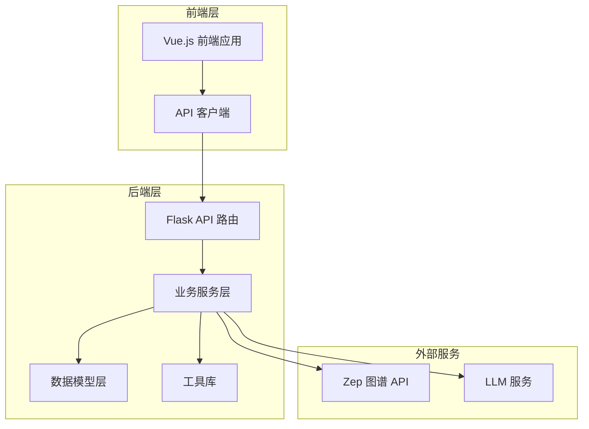
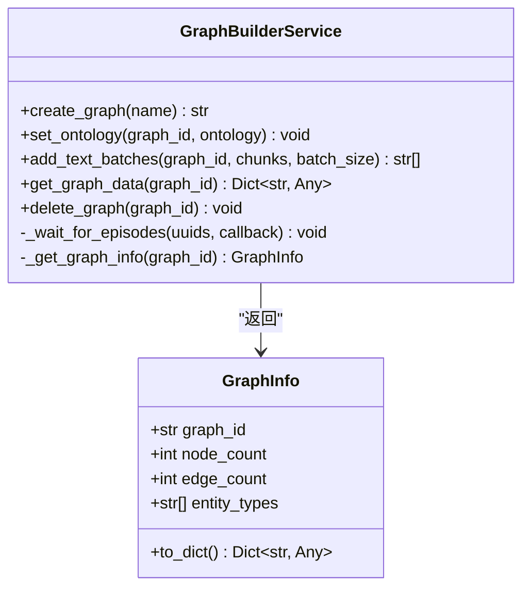
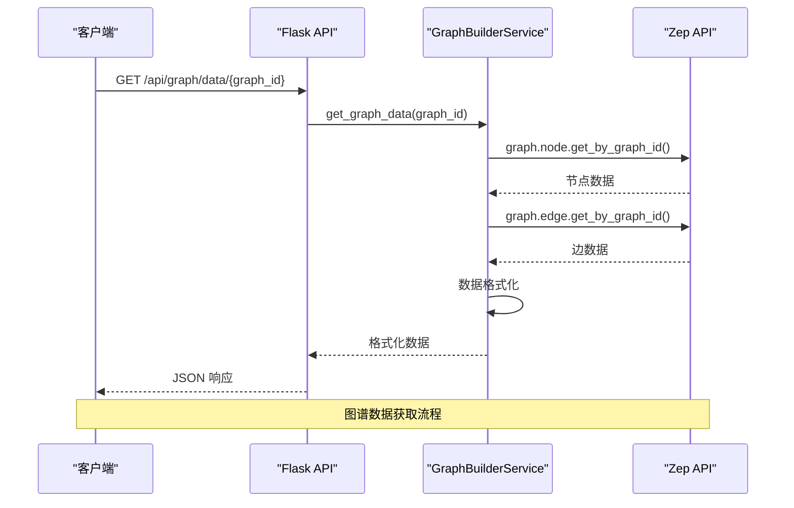
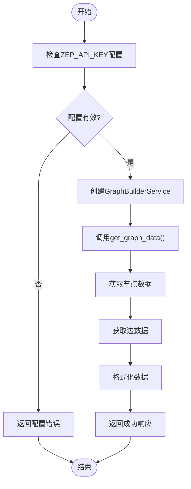
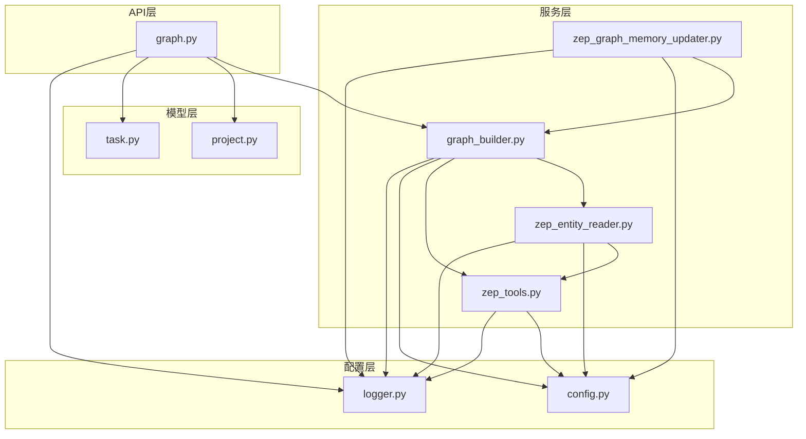
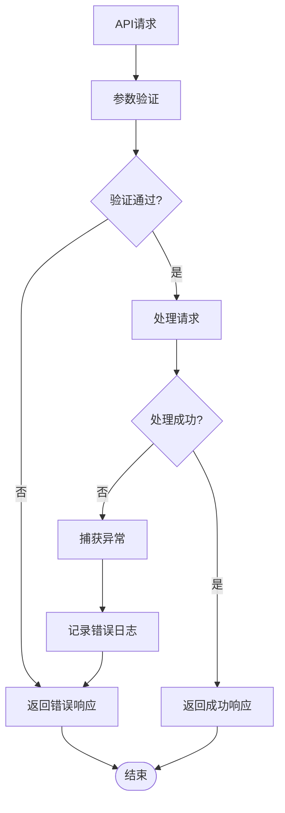

# 图谱数据接口

<cite>
**本文档引用的文件**
- [graph.py](file://backend/app/api/graph.py)
- [graph_builder.py](file://backend/app/services/graph_builder.py)
- [zep_graph_memory_updater.py](file://backend/app/services/zep_graph_memory_updater.py)
- [zep_entity_reader.py](file://backend/app/services/zep_entity_reader.py)
- [zep_tools.py](file://backend/app/services/zep_tools.py)
- [project.py](file://backend/app/models/project.py)
- [task.py](file://backend/app/models/task.py)
- [config.py](file://backend/app/config.py)
- [graph.js](file://frontend/src/api/graph.js)
- [logger.py](file://backend/app/utils/logger.py)
</cite>

## 目录
1. [简介](#简介)
2. [项目结构](#项目结构)
3. [核心组件](#核心组件)
4. [架构概览](#架构概览)
5. [详细组件分析](#详细组件分析)
6. [依赖关系分析](#依赖关系分析)
7. [性能考虑](#性能考虑)
8. [故障排除指南](#故障排除指南)
9. [结论](#结论)

## 简介

MiroFish是一个基于Zep图谱API的知识图谱构建和管理系统。本文档详细说明了图谱数据接口的设计和实现，包括获取图谱数据接口（GET /data/<graph_id>）和删除图谱接口（DELETE /delete/<graph_id>）。这些接口提供了完整的图谱数据访问能力，支持节点和边的详细信息获取，以及图谱的生命周期管理。

## 项目结构

MiroFish项目采用分层架构设计，主要分为以下层次：



**图表来源**
- [graph.py](file://backend/app/api/graph.py#L1-L618)
- [graph_builder.py](file://backend/app/services/graph_builder.py#L1-L500)

**章节来源**
- [graph.py](file://backend/app/api/graph.py#L1-L618)
- [config.py](file://backend/app/config.py#L1-L76)

## 核心组件

### 图谱数据接口

系统提供了两个核心的图谱数据接口：

1. **获取图谱数据接口** (`GET /api/graph/data/<graph_id>`)
2. **删除图谱接口** (`DELETE /api/graph/delete/<graph_id>`)

这两个接口都依赖于Zep图谱API进行实际的数据操作。

**章节来源**
- [graph.py](file://backend/app/api/graph.py#L564-L618)

### 图谱构建服务

图谱构建服务负责将文本数据转换为结构化的图谱数据：



**图表来源**
- [graph_builder.py](file://backend/app/services/graph_builder.py#L38-L500)

**章节来源**
- [graph_builder.py](file://backend/app/services/graph_builder.py#L1-L500)

## 架构概览

MiroFish的图谱数据接口架构采用了模块化设计，各个组件职责明确：



**图表来源**
- [graph.py](file://backend/app/api/graph.py#L564-L589)
- [graph_builder.py](file://backend/app/services/graph_builder.py#L419-L494)

**章节来源**
- [graph.py](file://backend/app/api/graph.py#L562-L590)

## 详细组件分析

### 图谱数据获取接口

#### 接口定义

**HTTP 方法**: `GET`
**路径**: `/api/graph/data/{graph_id}`
**认证**: 需要有效的ZEP_API_KEY配置

#### 请求参数

| 参数 | 类型 | 必需 | 描述 |
|------|------|------|------|
| graph_id | String | 是 | Zep图谱的唯一标识符 |

#### 响应格式

成功的响应返回包含完整图谱数据的JSON对象：

```json
{
  "success": true,
  "data": {
    "graph_id": "string",
    "nodes": [
      {
        "uuid": "string",
        "name": "string",
        "labels": ["string"],
        "summary": "string",
        "attributes": {},
        "created_at": "string"
      }
    ],
    "edges": [
      {
        "uuid": "string",
        "name": "string",
        "fact": "string",
        "fact_type": "string",
        "source_node_uuid": "string",
        "target_node_uuid": "string",
        "source_node_name": "string",
        "target_node_name": "string",
        "attributes": {},
        "created_at": "string",
        "valid_at": "string",
        "invalid_at": "string",
        "expired_at": "string",
        "episodes": ["string"]
      }
    ],
    "node_count": 0,
    "edge_count": 0
  }
}
```

#### 数据结构说明

**节点数据结构** (`Node`):
- `uuid`: 节点唯一标识符
- `name`: 节点名称
- `labels`: 节点标签数组
- `summary`: 节点摘要信息
- `attributes`: 节点属性字典
- `created_at`: 节点创建时间

**边数据结构** (`Edge`):
- `uuid`: 边唯一标识符
- `name`: 边名称
- `fact`: 边的事实描述
- `fact_type`: 事实类型
- `source_node_uuid`: 源节点UUID
- `target_node_uuid`: 目标节点UUID
- `source_node_name`: 源节点名称
- `target_node_name`: 目标节点名称
- `attributes`: 边属性字典
- `created_at`: 边创建时间
- `valid_at`: 有效开始时间
- `invalid_at`: 失效时间
- `expired_at`: 过期时间
- `episodes`: 关联的episode UUID列表

**统计信息**:
- `node_count`: 节点总数
- `edge_count`: 边总数

**章节来源**
- [graph.py](file://backend/app/api/graph.py#L564-L589)
- [graph_builder.py](file://backend/app/services/graph_builder.py#L419-L494)

### 图谱删除接口

#### 接口定义

**HTTP 方法**: `DELETE`
**路径**: `/api/graph/delete/{graph_id}`
**认证**: 需要有效的ZEP_API_KEY配置

#### 请求参数

| 参数 | 类型 | 必需 | 描述 |
|------|------|------|------|
| graph_id | String | 是 | Zep图谱的唯一标识符 |

#### 响应格式

成功的删除操作返回：
```json
{
  "success": true,
  "message": "图谱已删除: {graph_id}"
}
```

失败的删除操作返回：
```json
{
  "success": false,
  "error": "删除失败原因"
}
```

**章节来源**
- [graph.py](file://backend/app/api/graph.py#L592-L617)

### Zep图谱集成

系统通过GraphBuilderService类与Zep图谱API进行集成：



**图表来源**
- [graph.py](file://backend/app/api/graph.py#L569-L582)
- [graph_builder.py](file://backend/app/services/graph_builder.py#L419-L494)

**章节来源**
- [graph_builder.py](file://backend/app/services/graph_builder.py#L419-L494)

### 图谱数据结构规范

#### 节点标签规范

节点标签用于标识实体类型，遵循以下规则：
- 默认标签：`"Entity"` 和 `"Node"`
- 自定义标签：表示具体的实体类型（如 `"Person"`, `"Organization"`, `"Event"`）
- 过滤逻辑：只有包含除默认标签外的自定义标签的节点才被视为有效实体

#### 边类型规范

边代表实体之间的关系，包含以下属性：
- `name`: 关系名称（如 `"WORKS_AT"`, `"KNOWS"`, `"PARTICIPATED_IN"`）
- `fact`: 自然语言描述的关系事实
- `fact_type`: 事实类型分类
- 时间属性：`valid_at`, `invalid_at`, `expired_at`用于表示关系的有效性

#### 属性系统

节点和边都支持自定义属性：
- 节点属性：描述实体的特征和属性
- 边属性：描述关系的特征和约束
- 属性名称：遵循Zep API的命名规范，避免使用保留名称

**章节来源**
- [zep_entity_reader.py](file://backend/app/services/zep_entity_reader.py#L21-L68)
- [zep_tools.py](file://backend/app/services/zep_tools.py#L79-L134)

## 依赖关系分析

### 组件依赖图



**图表来源**
- [graph.py](file://backend/app/api/graph.py#L1-L618)
- [graph_builder.py](file://backend/app/services/graph_builder.py#L1-L500)
- [zep_entity_reader.py](file://backend/app/services/zep_entity_reader.py#L1-L445)
- [zep_graph_memory_updater.py](file://backend/app/services/zep_graph_memory_updater.py#L1-L549)
- [zep_tools.py](file://backend/app/services/zep_tools.py#L1-L800)
- [project.py](file://backend/app/models/project.py#L1-L306)
- [task.py](file://backend/app/models/task.py#L1-L185)
- [config.py](file://backend/app/config.py#L1-L76)
- [logger.py](file://backend/app/utils/logger.py#L1-L127)

### 外部依赖

系统依赖以下外部服务和库：

1. **Zep Cloud API**: 知识图谱存储和查询服务
2. **Flask**: Web框架，提供RESTful API接口
3. **Python dotenv**: 环境变量管理
4. **Logging**: Python标准库日志记录

**章节来源**
- [config.py](file://backend/app/config.py#L35-L41)

## 性能考虑

### 缓存策略

系统采用多层次的缓存策略来优化性能：

1. **内存缓存**: 模拟状态和项目数据在内存中缓存
2. **文件缓存**: 项目文件和生成的文本数据存储在本地文件系统
3. **API缓存**: 对频繁访问的图谱数据进行短期缓存

### 性能优化建议

1. **批量操作**: 使用批量API调用减少网络往返
2. **异步处理**: 图谱构建使用异步任务处理，避免阻塞主线程
3. **分页查询**: 对大量数据的查询使用分页机制
4. **连接池**: 合理管理数据库和外部API的连接

### 监控和日志

系统提供全面的日志记录功能：
- 详细的API调用日志
- 性能指标监控
- 错误追踪和调试信息

**章节来源**
- [logger.py](file://backend/app/utils/logger.py#L1-L127)
- [task.py](file://backend/app/models/task.py#L1-L185)

## 故障排除指南

### 常见问题和解决方案

#### ZEP_API_KEY配置错误

**症状**: 接口返回配置错误
**原因**: 环境变量未正确设置
**解决方案**: 
1. 检查`.env`文件中的`ZEP_API_KEY`配置
2. 确认API密钥有效且具有足够权限
3. 重启应用使配置生效

#### 图谱数据获取失败

**症状**: 获取图谱数据时出现异常
**可能原因**:
- 图谱ID不存在
- 网络连接问题
- Zep API服务不可用

**解决方案**:
1. 验证图谱ID的正确性
2. 检查网络连接状态
3. 查看Zep API的可用性状态

#### 删除操作失败

**症状**: 删除图谱时返回错误
**原因**:
- 图谱已被删除或不存在
- 权限不足
- 系统错误

**解决步骤**:
1. 确认图谱ID的正确性
2. 检查用户权限
3. 查看系统日志获取详细错误信息

**章节来源**
- [graph.py](file://backend/app/api/graph.py#L569-L617)
- [config.py](file://backend/app/config.py#L67-L74)

### 错误处理机制

系统实现了完善的错误处理机制：



**图表来源**
- [graph.py](file://backend/app/api/graph.py#L569-L617)

**章节来源**
- [graph.py](file://backend/app/api/graph.py#L569-L617)

## 结论

MiroFish的图谱数据接口提供了完整、可靠的图谱数据访问能力。通过清晰的接口设计、完善的错误处理机制和性能优化策略，系统能够满足各种知识图谱应用场景的需求。

主要特点包括：
- **标准化接口**: 提供RESTful API，易于集成和使用
- **完整数据模型**: 支持节点、边、属性的完整图谱数据结构
- **可靠的数据管理**: 包括数据获取、删除和生命周期管理
- **性能优化**: 采用多种优化策略确保高效的数据访问
- **错误处理**: 完善的错误处理和日志记录机制

这些接口为后续的模拟系统集成和数据分析提供了坚实的基础，支持复杂的社会模拟和知识发现应用。