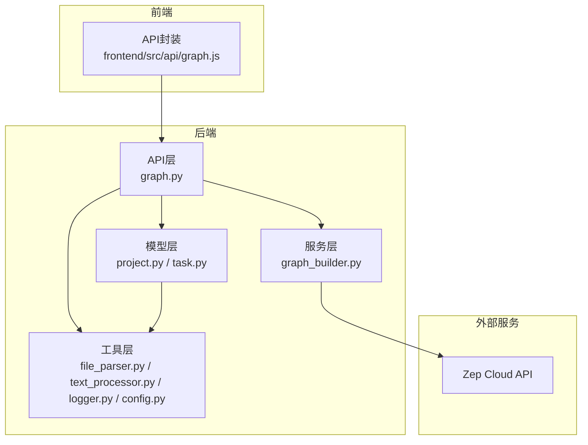
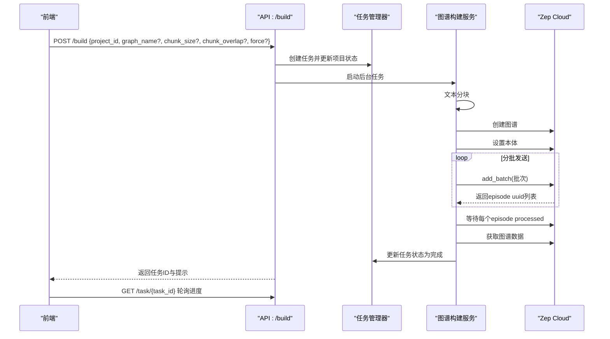
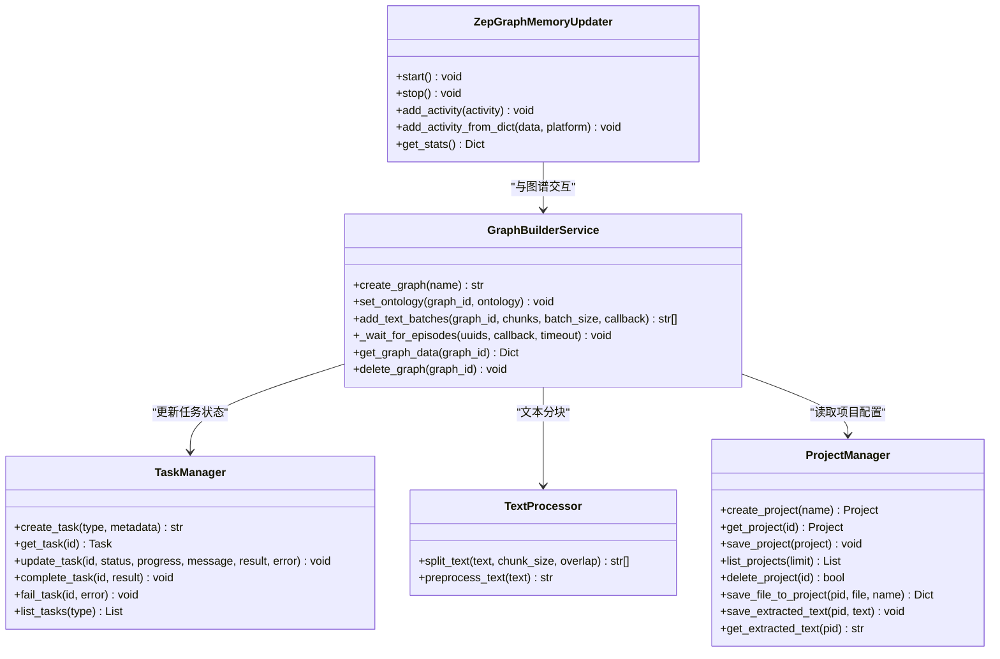
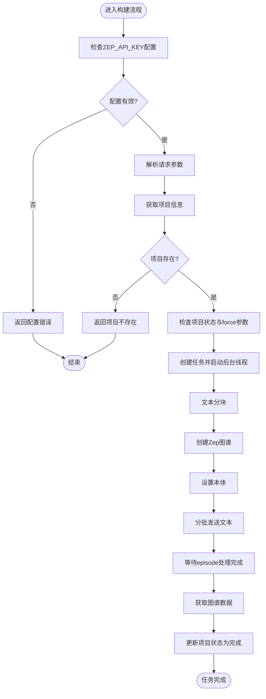

# 图谱构建接口

<cite>
**本文档引用的文件**
- [graph.py](file://backend/app/api/graph.py)
- [graph_builder.py](file://backend/app/services/graph_builder.py)
- [task.py](file://backend/app/models/task.py)
- [project.py](file://backend/app/models/project.py)
- [text_processor.py](file://backend/app/services/text_processor.py)
- [file_parser.py](file://backend/app/utils/file_parser.py)
- [config.py](file://backend/app/config.py)
- [logger.py](file://backend/app/utils/logger.py)
- [graph.js](file://frontend/src/api/graph.js)
- [zep_graph_memory_updater.py](file://backend/app/services/zep_graph_memory_updater.py)
- [zep_entity_reader.py](file://backend/app/services/zep_entity_reader.py)
</cite>

## 目录
1. [简介](#简介)
2. [项目结构](#项目结构)
3. [核心组件](#核心组件)
4. [架构总览](#架构总览)
5. [详细组件分析](#详细组件分析)
6. [依赖关系分析](#依赖关系分析)
7. [性能考量](#性能考量)
8. [故障排查指南](#故障排查指南)
9. [结论](#结论)
10. [附录](#附录)

## 简介
本文档面向MiroFish项目的图谱构建接口，重点说明POST /build接口的请求格式、参数含义、异步处理机制、任务状态管理与进度跟踪，并结合Zep图谱集成、文本分块策略、批处理机制与进度回调处理，给出完整的使用方法与最佳实践建议。读者无需深入技术背景即可理解如何正确调用接口并监控构建过程。

## 项目结构
后端采用Flask蓝图组织API，图谱构建相关逻辑集中在graph蓝图中；服务层负责与Zep交互、文本分块与批处理；模型层维护项目状态与任务状态；工具层提供日志、文件解析与文本处理能力。

图表来源
- [graph.py](file://backend/app/api/graph.py#L259-L525)
- [graph_builder.py](file://backend/app/services/graph_builder.py#L38-L500)
- [project.py](file://backend/app/models/project.py#L101-L306)
- [task.py](file://backend/app/models/task.py#L54-L185)
- [file_parser.py](file://backend/app/utils/file_parser.py#L61-L190)
- [text_processor.py](file://backend/app/services/text_processor.py#L9-L72)
- [logger.py](file://backend/app/utils/logger.py#L30-L127)
- [config.py](file://backend/app/config.py#L20-L76)
- [graph.js](file://frontend/src/api/graph.js#L1-L71)

章节来源
- [graph.py](file://backend/app/api/graph.py#L1-L618)
- [graph_builder.py](file://backend/app/services/graph_builder.py#L1-L500)
- [project.py](file://backend/app/models/project.py#L1-L306)
- [task.py](file://backend/app/models/task.py#L1-L185)
- [file_parser.py](file://backend/app/utils/file_parser.py#L1-L190)
- [text_processor.py](file://backend/app/services/text_processor.py#L1-L72)
- [logger.py](file://backend/app/utils/logger.py#L1-L127)
- [config.py](file://backend/app/config.py#L1-L76)
- [graph.js](file://frontend/src/api/graph.js#L1-L71)

## 核心组件
- 图谱构建API：接收JSON请求，启动异步任务，返回任务ID以便轮询进度。
- 图谱构建服务：封装Zep API调用，负责创建图谱、设置本体、文本分块、批处理发送、等待处理完成与获取图谱数据。
- 任务管理器：维护任务状态、进度、结果与错误信息，支持并发安全访问。
- 项目管理器：持久化项目状态（含本体、图谱ID、构建任务ID、分块参数等）。
- 文本处理与文件解析：提供文本预处理、分块策略与多格式文件解析能力。
- 日志与配置：统一日志输出与环境变量配置（含ZEP_API_KEY、默认分块参数等）。

章节来源
- [graph.py](file://backend/app/api/graph.py#L259-L525)
- [graph_builder.py](file://backend/app/services/graph_builder.py#L38-L500)
- [task.py](file://backend/app/models/task.py#L54-L185)
- [project.py](file://backend/app/models/project.py#L101-L306)
- [text_processor.py](file://backend/app/services/text_processor.py#L9-L72)
- [file_parser.py](file://backend/app/utils/file_parser.py#L61-L190)
- [config.py](file://backend/app/config.py#L20-L76)
- [logger.py](file://backend/app/utils/logger.py#L30-L127)

## 架构总览
POST /build接口的调用链路如下：
- 前端通过graph.js发起请求
- API层校验配置与参数，创建任务并启动后台线程
- 服务层进行文本分块、创建Zep图谱、设置本体、分批发送文本、等待处理完成
- 任务状态通过TaskManager更新，前端通过/get任务接口轮询进度
- 构建完成后可通过/data接口获取图谱数据

图表来源
- [graph.py](file://backend/app/api/graph.py#L259-L525)
- [graph_builder.py](file://backend/app/services/graph_builder.py#L287-L395)
- [task.py](file://backend/app/models/task.py#L101-L171)

## 详细组件分析

### 接口定义与请求格式
- 接口：POST /api/graph/build
- 请求体（JSON）：
  - project_id：必填，来自本体生成接口返回的项目ID
  - graph_name：可选，图谱名称，默认使用项目名称或“MiroFish Graph”
  - chunk_size：可选，默认值来自配置或项目设置
  - chunk_overlap：可选，默认值来自配置或项目设置
  - force：可选布尔值，强制重新构建（当处于构建中、失败或已完成状态时）
- 成功响应：包含project_id、task_id与提示信息
- 错误响应：包含错误原因与HTTP状态码

章节来源
- [graph.py](file://backend/app/api/graph.py#L259-L281)

### 参数说明与默认值
- project_id：项目标识，必须存在且已完成本体生成
- graph_name：图谱显示名称，影响Zep图谱创建时的名称
- chunk_size：文本分块大小（字符数），默认值来源于配置
- chunk_overlap：相邻分块之间的重叠字符数，有助于保持语义连贯性
- force：当项目处于构建中、失败或已完成状态时，可强制重置并重新构建

章节来源
- [graph.py](file://backend/app/api/graph.py#L338-L342)
- [config.py](file://backend/app/config.py#L44-L45)

### 异步处理机制与任务状态管理
- 任务创建：API层调用TaskManager创建任务，设置初始状态为PENDING
- 后台线程：API层启动守护线程执行实际构建流程
- 状态更新：服务层在关键阶段通过TaskManager更新状态、进度与消息
- 任务生命周期：PENDING → PROCESSING → COMPLETED 或 FAILED
- 进度范围：0%-100%，包含阶段性消息与详细进度信息字段

章节来源
- [graph.py](file://backend/app/api/graph.py#L363-L508)
- [task.py](file://backend/app/models/task.py#L101-L171)

### 图谱构建流程与Zep集成
- 创建图谱：调用Zep API创建独立图谱，返回graph_id
- 设置本体：将项目中的本体定义映射为Zep实体与关系类型
- 文本分块：使用TextProcessor.split_text进行分块，支持句号、感叹号、问号等断句
- 批处理发送：以固定批次大小（当前代码中为3）发送到Zep，期间通过回调更新进度
- 等待处理完成：轮询每个episode的processed状态，直到全部完成或超时
- 获取图谱数据：查询节点与边，返回详细信息（含时间戳、属性等）

章节来源
- [graph_builder.py](file://backend/app/services/graph_builder.py#L186-L494)
- [text_processor.py](file://backend/app/services/text_processor.py#L18-L34)

### 任务查询接口
- GET /api/graph/task/{task_id}：查询指定任务的当前状态、进度、消息与结果
- GET /api/graph/tasks：列出所有任务（按创建时间倒序）

章节来源
- [graph.py](file://backend/app/api/graph.py#L529-L559)
- [task.py](file://backend/app/models/task.py#L164-L171)

### 图谱数据接口
- GET /api/graph/data/{graph_id}：获取图谱节点与边的详细数据
- DELETE /api/graph/delete/{graph_id}：删除Zep图谱

章节来源
- [graph.py](file://backend/app/api/graph.py#L564-L617)

### 文本分块策略与批处理机制
- 分块策略：按字符数切分，优先在句子边界处断开，减少语义截断
- 重叠策略：相邻块之间保留一定重叠，提升跨块语义一致性
- 批处理：每次发送固定数量的文本块到Zep，避免请求过快导致限流
- 进度回调：分块与等待阶段均提供进度回调，便于UI展示实时状态

章节来源
- [file_parser.py](file://backend/app/utils/file_parser.py#L147-L189)
- [graph_builder.py](file://backend/app/services/graph_builder.py#L287-L338)
- [graph_builder.py](file://backend/app/services/graph_builder.py#L340-L394)

### 进度回调处理
- 分块阶段：回调函数接收消息与进度比例，计算当前阶段的进度区间（例如15%-55%）
- 等待阶段：回调函数接收消息与进度比例，计算当前阶段的进度区间（例如55%-90%）
- 任务完成：最终将任务状态置为COMPLETED，写入结果（包含节点数、边数、块数等）

章节来源
- [graph.py](file://backend/app/api/graph.py#L420-L427)
- [graph.py](file://backend/app/api/graph.py#L449-L455)
- [graph.py](file://backend/app/api/graph.py#L475-L488)

### 图谱构建状态转换与错误处理
- 状态转换：CREATED → ONTOLOGY_GENERATED → GRAPH_BUILDING → GRAPH_COMPLETED 或 FAILED
- 错误处理：捕获异常，更新项目状态为FAILED，记录错误信息与堆栈
- 重试机制：Zep相关操作在服务层通过回调与等待实现，前端可结合任务状态进行轮询

章节来源
- [project.py](file://backend/app/models/project.py#L17-L24)
- [graph.py](file://backend/app/api/graph.py#L318-L337)
- [graph.py](file://backend/app/api/graph.py#L490-L504)

### chunk_size与chunk_overlap对性能的影响与最佳实践
- 影响因素：
  - chunk_size越大，单块语义越完整但内存占用与Zep处理时间增加；过小则分块过多，网络与处理开销上升
  - chunk_overlap越大，跨块语义连贯性越好，但会增加重复内容与处理成本
- 建议：
  - 对长文档：chunk_size建议在500-1000字符之间，chunk_overlap在50-200字符之间
  - 对短文档：可适当减小chunk_size，提高处理吞吐
  - 根据Zep API速率与内存资源调整批次大小（当前代码中为3），避免频繁限流

章节来源
- [graph.py](file://backend/app/api/graph.py#L338-L342)
- [config.py](file://backend/app/config.py#L44-L45)
- [file_parser.py](file://backend/app/utils/file_parser.py#L147-L189)
- [graph_builder.py](file://backend/app/services/graph_builder.py#L287-L338)

### 前端调用示例与使用方法
- 生成本体：使用multipart/form-data上传文件与需求描述
- 构建图谱：POST /api/graph/build，携带project_id与可选参数
- 轮询进度：GET /api/graph/task/{task_id}
- 获取数据：GET /api/graph/data/{graph_id}

章节来源
- [graph.js](file://frontend/src/api/graph.js#L8-L71)

## 依赖关系分析

图表来源
- [graph_builder.py](file://backend/app/services/graph_builder.py#L38-L500)
- [task.py](file://backend/app/models/task.py#L54-L185)
- [project.py](file://backend/app/models/project.py#L101-L306)
- [text_processor.py](file://backend/app/services/text_processor.py#L9-L72)
- [zep_graph_memory_updater.py](file://backend/app/services/zep_graph_memory_updater.py#L201-L549)

## 性能考量
- 文本分块：合理设置chunk_size与chunk_overlap，平衡语义完整性与处理效率
- 批处理：批次大小影响网络与Zep处理压力，建议根据API速率与资源情况调整
- 等待策略：轮询等待episode处理完成，注意超时与重试策略
- 日志与监控：通过日志与任务状态监控构建进度，及时发现异常

[本节为通用指导，无需特定文件来源]

## 故障排查指南
- 配置缺失：确认ZEP_API_KEY已正确配置，否则接口会返回配置错误
- 项目状态：确保项目已完成本体生成，否则会提示需要先调用本体生成接口
- 重复提交：若项目处于构建中且未设置force=true，会拒绝重复提交
- 异常处理：服务层捕获异常并更新任务状态为FAILED，可在任务详情中查看错误信息与堆栈

章节来源
- [graph.py](file://backend/app/api/graph.py#L285-L294)
- [graph.py](file://backend/app/api/graph.py#L318-L329)
- [graph.py](file://backend/app/api/graph.py#L490-L504)

## 结论
POST /build接口提供了完整的异步图谱构建能力，结合Zep图谱与本体定义，实现了从文本到知识图谱的自动化流水线。通过任务状态管理与进度回调，前端可实时掌握构建进展；通过合理的分块与批处理策略，可在保证质量的同时提升处理效率。建议在生产环境中结合日志与监控，持续优化chunk_size与批处理参数以获得最佳性能。

[本节为总结性内容，无需特定文件来源]

## 附录

### 请求与响应示例（路径引用）
- 请求示例（POST /api/graph/build）：见[graph.py](file://backend/app/api/graph.py#L259-L281)
- 响应示例（成功）：见[graph.py](file://backend/app/api/graph.py#L510-L517)
- 任务查询（GET /api/graph/task/{task_id}）：见[graph.py](file://backend/app/api/graph.py#L529-L545)
- 图谱数据（GET /api/graph/data/{graph_id}）：见[graph.py](file://backend/app/api/graph.py#L564-L589)

### 关键流程图（算法实现）

图表来源
- [graph.py](file://backend/app/api/graph.py#L282-L518)
- [graph_builder.py](file://backend/app/services/graph_builder.py#L287-L395)