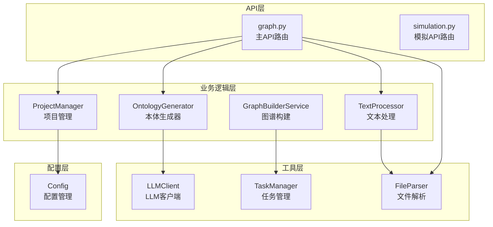
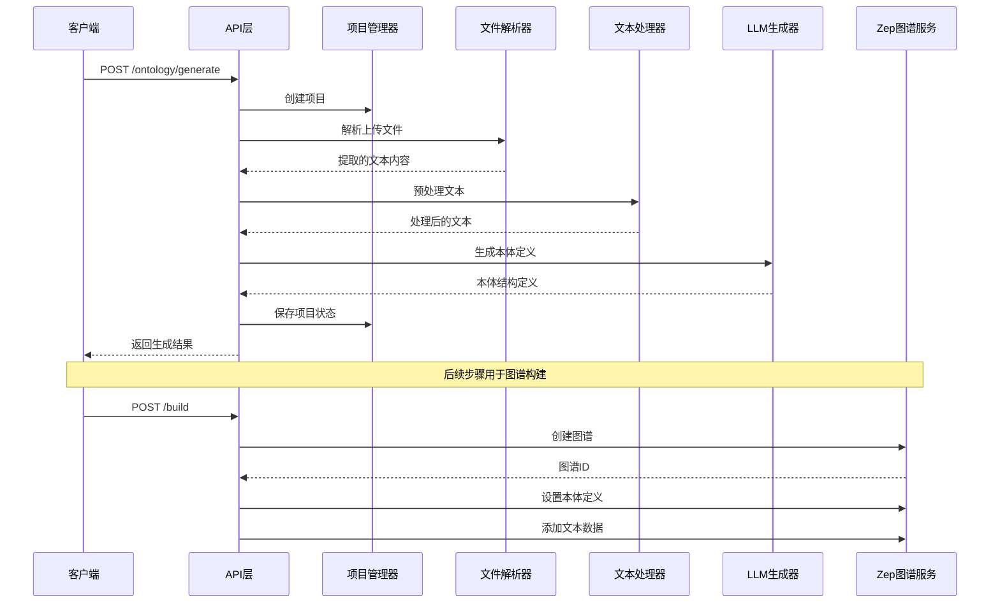
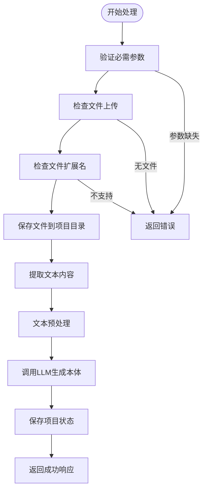
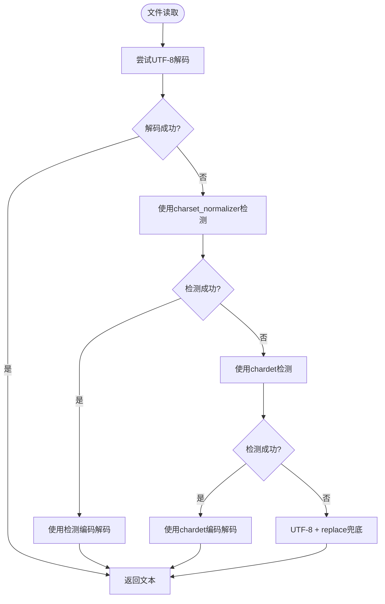
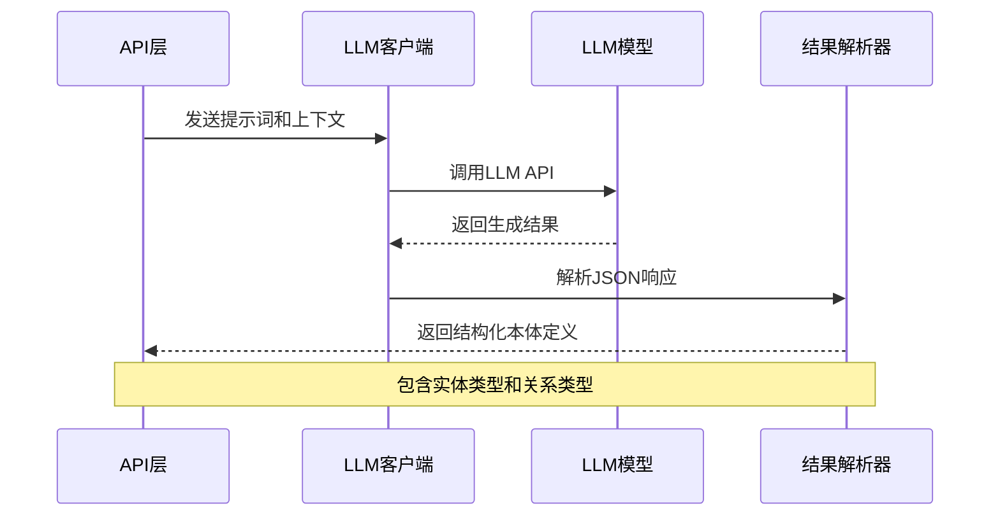
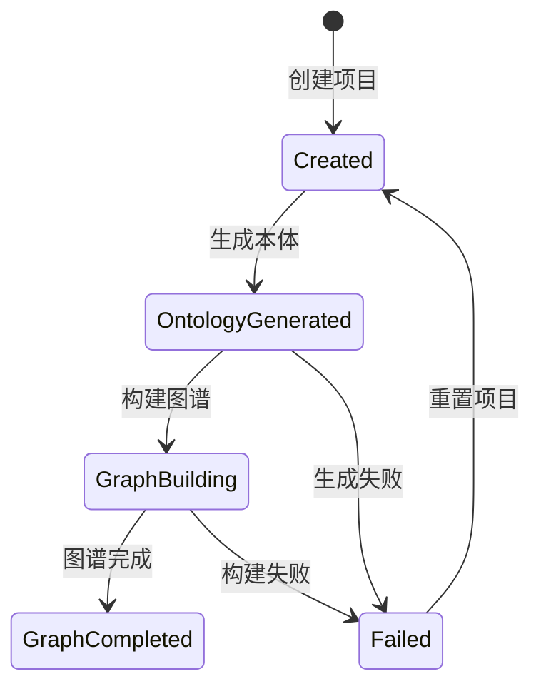
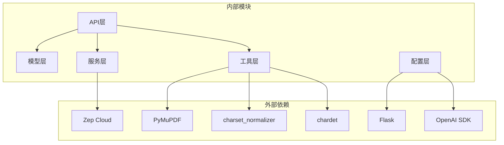

# 本体生成接口

<cite>
**本文档引用的文件**
- [backend/app/api/graph.py](file://backend/app/api/graph.py)
- [backend/app/models/project.py](file://backend/app/models/project.py)
- [backend/app/utils/file_parser.py](file://backend/app/utils/file_parser.py)
- [backend/app/services/text_processor.py](file://backend/app/services/text_processor.py)
- [backend/app/utils/llm_client.py](file://backend/app/utils/llm_client.py)
- [backend/app/config.py](file://backend/app/config.py)
- [backend/app/services/graph_builder.py](file://backend/app/services/graph_builder.py)
- [backend/run.py](file://backend/run.py)
</cite>

## 目录
1. [简介](#简介)
2. [项目结构](#项目结构)
3. [核心组件](#核心组件)
4. [架构概览](#架构概览)
5. [详细组件分析](#详细组件分析)
6. [依赖分析](#依赖分析)
7. [性能考虑](#性能考虑)
8. [故障排除指南](#故障排除指南)
9. [结论](#结论)

## 简介
本体生成接口（POST /ontology/generate）是MiroFish系统中的核心功能模块，负责接收用户上传的文档文件，进行文本提取、预处理和分析，然后通过LLM生成知识本体定义。该接口支持PDF、Markdown和纯文本文件格式，提供完整的项目上下文管理和错误处理机制。

## 项目结构
MiroFish后端采用模块化架构设计，主要包含以下关键模块：



**图表来源**
- [backend/app/api/graph.py](file://backend/app/api/graph.py#L1-L618)
- [backend/app/models/project.py](file://backend/app/models/project.py#L1-L306)
- [backend/app/utils/file_parser.py](file://backend/app/utils/file_parser.py#L1-L190)

**章节来源**
- [backend/app/api/graph.py](file://backend/app/api/graph.py#L1-L618)
- [backend/app/config.py](file://backend/app/config.py#L1-L76)

## 核心组件
本体生成接口涉及以下核心组件：

### 1. API路由层
- **主API路由**：位于graph.py中，提供完整的RESTful接口
- **路由装饰器**：使用Flask蓝图进行模块化路由管理
- **请求处理**：支持multipart/form-data格式的文件上传

### 2. 项目管理器
- **ProjectManager**：负责项目状态的持久化存储
- **状态管理**：维护项目生命周期状态（created、ontology_generated等）
- **文件存储**：安全的文件命名和存储机制

### 3. 文件处理管道
- **FileParser**：支持PDF、Markdown、TXT格式的文本提取
- **TextProcessor**：提供文本预处理和分块功能
- **编码检测**：自动检测和处理多种文本编码格式

### 4. LLM集成
- **LLMClient**：统一的LLM调用接口
- **OpenAI兼容**：支持多种LLM提供商的统一接口
- **参数配置**：温度、最大token数等参数可配置

**章节来源**
- [backend/app/api/graph.py](file://backend/app/api/graph.py#L119-L255)
- [backend/app/models/project.py](file://backend/app/models/project.py#L101-L306)
- [backend/app/utils/file_parser.py](file://backend/app/utils/file_parser.py#L61-L190)

## 架构概览
本体生成接口采用分层架构设计，确保了良好的可维护性和扩展性：



**图表来源**
- [backend/app/api/graph.py](file://backend/app/api/graph.py#L119-L255)
- [backend/app/services/graph_builder.py](file://backend/app/services/graph_builder.py#L38-L500)

## 详细组件分析

### API路由实现
本体生成接口的核心实现位于graph.py文件中，采用Flask框架构建RESTful API。

#### 请求参数规范
接口支持以下请求参数：

**必需参数：**
- `simulation_requirement`：模拟需求描述，必填字段
- `files`：上传的文件数组，支持PDF、MD、TXT格式

**可选参数：**
- `project_name`：项目名称，默认值为"Unnamed Project"
- `additional_context`：额外说明上下文

#### 文件上传处理流程


**图表来源**
- [backend/app/api/graph.py](file://backend/app/api/graph.py#L149-L255)

#### 错误处理机制
接口实现了完善的错误处理机制：

**常见错误场景：**
- 文件格式不支持：检查Config.ALLOWED_EXTENSIONS
- 文件大小超限：受Config.MAX_CONTENT_LENGTH限制
- LLM配置缺失：验证Config.LLM_API_KEY
- 项目状态异常：检查项目生命周期状态

**错误响应格式：**
```json
{
    "success": false,
    "error": "错误描述",
    "traceback": "详细错误信息"
}
```

**章节来源**
- [backend/app/api/graph.py](file://backend/app/api/graph.py#L119-L255)
- [backend/app/config.py](file://backend/app/config.py#L38-L42)

### 文件处理管道
文件处理管道负责将用户上传的原始文件转换为可用于LLM分析的结构化文本。

#### 支持的文件格式
- **PDF文件**：使用PyMuPDF库提取文本内容
- **Markdown文件**：支持.md和.markdown扩展名
- **纯文本文件**：支持.txt扩展名

#### 编码处理策略
文件解析器采用多级回退策略处理不同编码格式：



**图表来源**
- [backend/app/utils/file_parser.py](file://backend/app/utils/file_parser.py#L11-L58)

#### 文本预处理功能
文本处理器提供以下预处理功能：

**标准化处理：**
- 统一换行符格式（\r\n → \n）
- 移除多余的空白字符
- 标准化段落格式

**统计信息：**
- 字符数统计
- 行数统计
- 单词数统计

**章节来源**
- [backend/app/utils/file_parser.py](file://backend/app/utils/file_parser.py#L61-L190)
- [backend/app/services/text_processor.py](file://backend/app/services/text_processor.py#L9-L72)

### LLM集成与本体生成
本体生成过程通过LLM客户端与外部语言模型进行交互。

#### LLM客户端配置
- **API密钥管理**：从环境变量加载LLM_API_KEY
- **基础URL配置**：支持自定义LLM服务端点
- **模型选择**：默认使用gpt-4o-mini模型
- **参数调优**：温度参数0.7，最大token数4096

#### 本体生成流程


**图表来源**
- [backend/app/utils/llm_client.py](file://backend/app/utils/llm_client.py#L13-L92)

#### 本体结构定义
生成的本体包含以下核心元素：

**实体类型（Entity Types）：**
- 名称：实体的标识符
- 描述：实体的详细说明
- 属性：实体的特征字段

**关系类型（Edge Types）：**
- 名称：关系的标识符
- 描述：关系的详细说明
- 源目标：关系连接的实体类型
- 属性：关系的特征字段

**章节来源**
- [backend/app/utils/llm_client.py](file://backend/app/utils/llm_client.py#L13-L92)

### 项目上下文管理
项目管理器负责维护整个本体生成过程的状态信息。

#### 项目状态生命周期


#### 数据持久化机制
- **项目元数据**：存储在project.json文件中
- **文件存储**：安全的文件命名和目录结构
- **文本缓存**：提取的文本内容缓存
- **状态同步**：实时更新项目状态

**章节来源**
- [backend/app/models/project.py](file://backend/app/models/project.py#L17-L100)
- [backend/app/models/project.py](file://backend/app/models/project.py#L101-L306)

## 依赖分析
本体生成接口的依赖关系体现了清晰的分层架构：



**图表来源**
- [backend/app/api/graph.py](file://backend/app/api/graph.py#L1-L25)
- [backend/app/config.py](file://backend/app/config.py#L1-L76)

### 关键依赖关系
- **API层**依赖**模型层**进行数据持久化
- **服务层**依赖**工具层**进行文件处理
- **LLM集成**依赖**配置层**进行参数管理
- **图谱构建**依赖**外部服务**（Zep Cloud）

**章节来源**
- [backend/app/api/graph.py](file://backend/app/api/graph.py#L1-L25)
- [backend/app/config.py](file://backend/app/config.py#L1-L76)

## 性能考虑
本体生成接口在设计时充分考虑了性能优化：

### 并发处理
- **异步任务**：长耗时操作通过任务队列处理
- **线程安全**：使用锁机制保证并发安全性
- **资源池**：合理管理内存和CPU资源

### 缓存策略
- **文本缓存**：提取的文本内容缓存到文件系统
- **项目状态**：频繁访问的状态信息缓存
- **LLM响应**：热点数据的短期缓存

### 优化建议
- **批量处理**：对于大量文件，考虑批量处理策略
- **内存管理**：大型文档的分块处理
- **网络优化**：LLM调用的超时和重试机制

## 故障排除指南
本体生成接口提供了完善的错误诊断和处理机制：

### 常见问题及解决方案

**文件上传问题：**
- **问题**：文件格式不被支持
- **原因**：扩展名不在ALLOWED_EXTENSIONS集合中
- **解决**：检查文件扩展名是否为pdf、md、txt或markdown

**LLM配置问题：**
- **问题**：LLM调用失败
- **原因**：LLM_API_KEY未正确配置
- **解决**：检查.env文件中的LLM配置项

**内存不足问题：**
- **问题**：处理大型文档时内存溢出
- **原因**：单个文档过大
- **解决**：分块处理或增加服务器内存

**章节来源**
- [backend/app/api/graph.py](file://backend/app/api/graph.py#L149-L255)
- [backend/app/config.py](file://backend/app/config.py#L67-L75)

## 结论
本体生成接口展现了MiroFish系统的完整技术架构，通过模块化的组件设计和完善的错误处理机制，为用户提供了一个稳定可靠的本体生成解决方案。接口支持多种文件格式，具备良好的扩展性和性能表现，能够满足复杂知识图谱构建的需求。

未来可以在以下方面进行改进：
- 增加更多的文件格式支持
- 优化大文件处理性能
- 提供更丰富的本体分析功能
- 增强错误恢复和重试机制