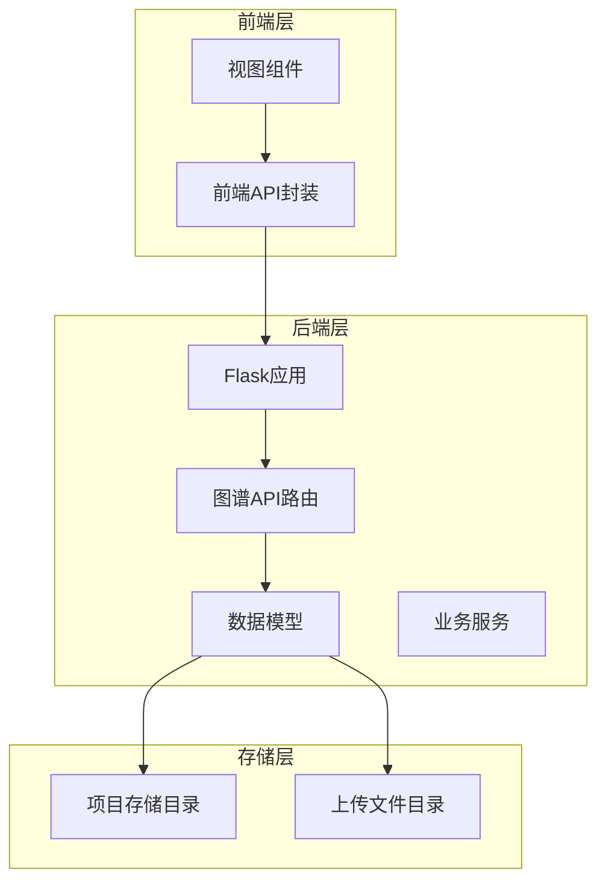
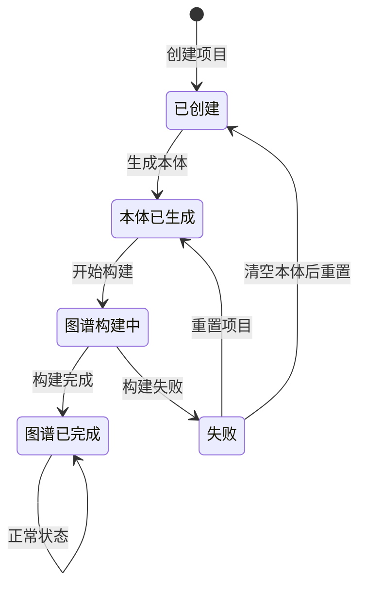
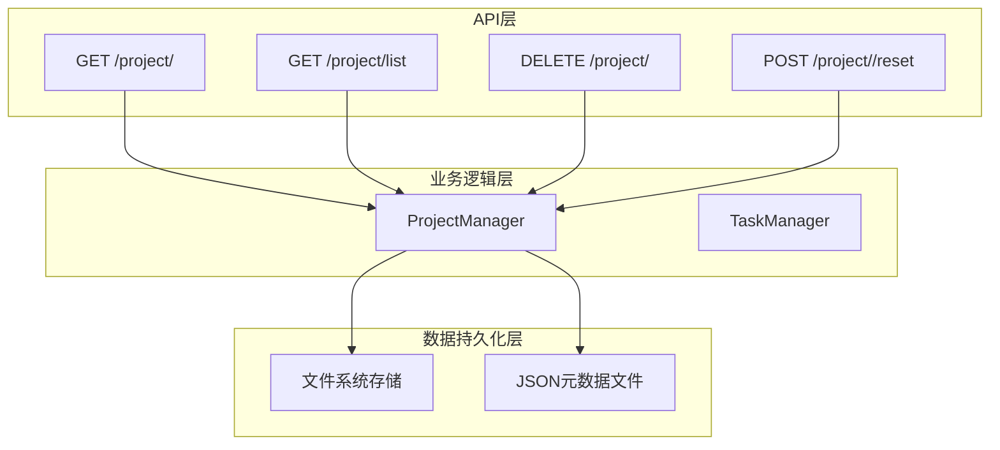
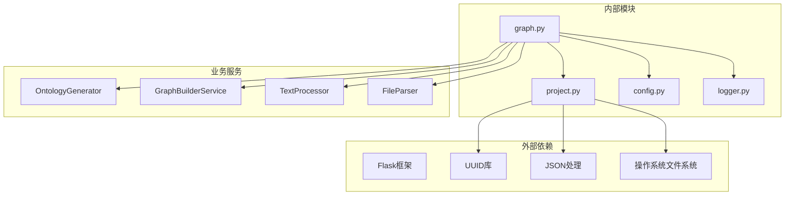

# 项目管理接口

<cite>
**本文档引用的文件**
- [backend/app/api/graph.py](file://backend/app/api/graph.py)
- [backend/app/models/project.py](file://backend/app/models/project.py)
- [backend/app/config.py](file://backend/app/config.py)
- [backend/app/api/__init__.py](file://backend/app/api/__init__.py)
- [frontend/src/api/graph.js](file://frontend/src/api/graph.js)
- [frontend/src/views/MainView.vue](file://frontend/src/views/MainView.vue)
</cite>

## 目录
1. [简介](#简介)
2. [项目结构](#项目结构)
3. [核心组件](#核心组件)
4. [架构概览](#架构概览)
5. [详细组件分析](#详细组件分析)
6. [依赖分析](#依赖分析)
7. [性能考虑](#性能考虑)
8. [故障排除指南](#故障排除指南)
9. [结论](#结论)

## 简介

MiroFish项目管理接口提供了完整的项目生命周期管理功能，包括项目创建、查询、列表、删除和重置操作。该系统基于Flask框架构建，采用项目上下文机制在服务端持久化项目状态，避免前端在接口间传递大量数据。

系统支持多阶段的项目处理流程：首先通过文件上传和本体生成接口创建项目，然后通过图谱构建接口生成知识图谱，最后提供查询和管理功能。

## 项目结构

项目采用前后端分离架构，后端使用Python Flask框架，前端使用Vue.js框架。



**图表来源**
- [backend/app/api/graph.py](file://backend/app/api/graph.py#L1-L618)
- [backend/app/models/project.py](file://backend/app/models/project.py#L1-L306)

**章节来源**
- [backend/app/api/__init__.py](file://backend/app/api/__init__.py#L1-L15)
- [backend/app/config.py](file://backend/app/config.py#L1-L76)

## 核心组件

### 项目状态管理

系统实现了完整的项目状态管理机制，使用枚举类型定义了项目生命周期中的各个阶段：



**图表来源**
- [backend/app/models/project.py](file://backend/app/models/project.py#L17-L24)

### 数据模型

项目数据模型包含了完整的项目信息和配置参数：

| 字段名 | 类型 | 描述 | 默认值 |
|--------|------|------|--------|
| project_id | string | 项目唯一标识符 | 自动生成 |
| name | string | 项目名称 | "Unnamed Project" |
| status | ProjectStatus | 项目当前状态 | ProjectStatus.CREATED |
| created_at | string | 创建时间 | ISO格式时间戳 |
| updated_at | string | 最后更新时间 | ISO格式时间戳 |
| files | List[Dict] | 文件信息列表 | [] |
| total_text_length | int | 总文本长度 | 0 |
| ontology | Dict | 本体定义 | None |
| analysis_summary | string | 分析摘要 | None |
| graph_id | string | 图谱ID | None |
| graph_build_task_id | string | 构建任务ID | None |
| simulation_requirement | string | 模拟需求描述 | None |
| chunk_size | int | 文本分块大小 | 500 |
| chunk_overlap | int | 分块重叠大小 | 50 |
| error | string | 错误信息 | None |

**章节来源**
- [backend/app/models/project.py](file://backend/app/models/project.py#L26-L98)

## 架构概览

系统采用分层架构设计，清晰分离了API路由、业务逻辑和数据持久化层。



**图表来源**
- [backend/app/api/graph.py](file://backend/app/api/graph.py#L35-L117)
- [backend/app/models/project.py](file://backend/app/models/project.py#L101-L306)

## 详细组件分析

### 获取项目详情接口

#### 接口定义
- **HTTP方法**: GET
- **URL**: `/api/graph/project/<project_id>`
- **功能**: 获取指定项目的所有详细信息

#### 请求参数
- **路径参数**:
  - `project_id` (string, 必填): 项目唯一标识符

#### 响应格式
成功的响应包含以下结构：
```json
{
  "success": true,
  "data": {
    "project_id": "proj_xxxxxx",
    "name": "项目名称",
    "status": "created",
    "created_at": "2024-01-01T00:00:00",
    "updated_at": "2024-01-01T00:00:00",
    "files": [],
    "total_text_length": 0,
    "ontology": null,
    "analysis_summary": null,
    "graph_id": null,
    "graph_build_task_id": null,
    "simulation_requirement": null,
    "chunk_size": 500,
    "chunk_overlap": 50,
    "error": null
  }
}
```

#### 错误处理
- **404 Not Found**: 当项目不存在时返回错误信息
- **500 Internal Server Error**: 服务器内部错误时返回异常详情

#### 使用示例
```javascript
// 前端调用示例
const project = await getProject('proj_xxxxxx');
console.log(project.data);
```

**章节来源**
- [backend/app/api/graph.py](file://backend/app/api/graph.py#L35-L51)
- [frontend/src/api/graph.js](file://frontend/src/api/graph.js#L65-L70)

### 列出项目接口

#### 接口定义
- **HTTP方法**: GET
- **URL**: `/api/graph/project/list`
- **功能**: 获取项目列表

#### 请求参数
- **查询参数**:
  - `limit` (integer, 可选): 返回项目数量限制，默认50

#### 响应格式
成功的响应包含以下结构：
```json
{
  "success": true,
  "data": [
    {
      "project_id": "proj_xxxxxx",
      "name": "项目名称",
      "status": "created",
      "created_at": "2024-01-01T00:00:00",
      "updated_at": "2024-01-01T00:00:00",
      "files": [],
      "total_text_length": 0,
      "ontology": null,
      "analysis_summary": null,
      "graph_id": null,
      "graph_build_task_id": null,
      "simulation_requirement": null,
      "chunk_size": 500,
      "chunk_overlap": 50,
      "error": null
    }
  ],
  "count": 1
}
```

#### 错误处理
- **500 Internal Server Error**: 服务器内部错误时返回异常详情

#### 使用示例
```javascript
// 前端调用示例
const projects = await service.get('/api/graph/project/list', { params: { limit: 10 } });
console.log(projects.data);
```

**章节来源**
- [backend/app/api/graph.py](file://backend/app/api/graph.py#L54-L66)

### 删除项目接口

#### 接口定义
- **HTTP方法**: DELETE
- **URL**: `/api/graph/project/<project_id>`
- **功能**: 删除指定项目及其所有关联文件

#### 请求参数
- **路径参数**:
  - `project_id` (string, 必填): 项目唯一标识符

#### 响应格式
成功的响应包含以下结构：
```json
{
  "success": true,
  "message": "项目已删除: proj_xxxxxx"
}
```

#### 错误处理
- **404 Not Found**: 当项目不存在或删除失败时返回错误信息
- **500 Internal Server Error**: 服务器内部错误时返回异常详情

#### 使用示例
```javascript
// 前端调用示例
const result = await service.delete('/api/graph/project/proj_xxxxxx');
console.log(result.message);
```

**章节来源**
- [backend/app/api/graph.py](file://backend/app/api/graph.py#L69-L85)

### 重置项目接口

#### 接口定义
- **HTTP方法**: POST
- **URL**: `/api/graph/project/<project_id>/reset`
- **功能**: 重置项目状态，用于重新构建图谱

#### 请求参数
- **路径参数**:
  - `project_id` (string, 必填): 项目唯一标识符

#### 响应格式
成功的响应包含以下结构：
```json
{
  "success": true,
  "message": "项目已重置: proj_xxxxxx",
  "data": {
    "project_id": "proj_xxxxxx",
    "name": "项目名称",
    "status": "ontology_generated",
    "created_at": "2024-01-01T00:00:00",
    "updated_at": "2024-01-01T00:00:00",
    "files": [],
    "total_text_length": 0,
    "ontology": null,
    "analysis_summary": null,
    "graph_id": null,
    "graph_build_task_id": null,
    "simulation_requirement": null,
    "chunk_size": 500,
    "chunk_overlap": 50,
    "error": null
  }
}
```

#### 状态重置规则
- 如果项目已有本体定义：重置为 `ONTOLOGY_GENERATED` 状态
- 如果项目无本体定义：重置为 `CREATED` 状态
- 清除图谱相关信息：graph_id、graph_build_task_id、error

#### 错误处理
- **404 Not Found**: 当项目不存在时返回错误信息
- **500 Internal Server Error**: 服务器内部错误时返回异常详情

#### 使用示例
```javascript
// 前端调用示例
const result = await service.post('/api/graph/project/proj_xxxxxx/reset');
console.log(result.message);
```

**章节来源**
- [backend/app/api/graph.py](file://backend/app/api/graph.py#L88-L116)

## 依赖分析

系统的关键依赖关系如下：



**图表来源**
- [backend/app/api/graph.py](file://backend/app/api/graph.py#L1-L25)
- [backend/app/models/project.py](file://backend/app/models/project.py#L1-L14)

**章节来源**
- [backend/app/api/graph.py](file://backend/app/api/graph.py#L1-L25)
- [backend/app/models/project.py](file://backend/app/models/project.py#L1-L14)

## 性能考虑

### 存储优化
- **文件存储**: 项目文件采用安全的随机文件名存储，避免文件冲突
- **元数据缓存**: 项目元数据以JSON格式存储，便于快速读取
- **目录结构**: 采用分层目录结构，支持大规模项目管理

### 并发处理
- **异步任务**: 图谱构建采用后台线程处理，不阻塞主请求
- **任务队列**: 使用TaskManager管理异步任务状态
- **资源清理**: 自动清理临时文件和中间结果

### 缓存策略
- **内存缓存**: 项目状态在内存中缓存，减少磁盘I/O
- **响应缓存**: 对于只读查询，可以实现适当的缓存策略

## 故障排除指南

### 常见错误及解决方案

#### 项目不存在
**错误**: `项目不存在: proj_xxxxxx`
**原因**: 项目ID无效或已被删除
**解决方案**: 
- 验证项目ID格式正确性
- 检查项目是否存在于数据库中
- 重新创建项目

#### 文件格式不支持
**错误**: `没有成功处理任何文档，请检查文件格式`
**原因**: 上传的文件格式不在允许列表中
**解决方案**:
- 支持的文件格式: pdf, md, txt, markdown
- 检查文件扩展名
- 确保文件完整且未损坏

#### 配置缺失
**错误**: `ZEP_API_KEY未配置`
**原因**: 必要配置项未正确设置
**解决方案**:
- 在.env文件中设置ZEP_API_KEY
- 确保配置文件路径正确
- 重启应用使配置生效

#### 磁盘空间不足
**错误**: 文件保存失败
**原因**: 磁盘空间不足或权限问题
**解决方案**:
- 检查磁盘空间
- 确认写入权限
- 清理临时文件

### 调试技巧
- 查看后端日志输出
- 使用浏览器开发者工具监控网络请求
- 检查项目存储目录结构
- 验证文件权限设置

**章节来源**
- [backend/app/api/graph.py](file://backend/app/api/graph.py#L160-L254)
- [backend/app/config.py](file://backend/app/config.py#L66-L75)

## 结论

MiroFish项目管理接口提供了完整的项目生命周期管理功能，具有以下特点：

### 设计优势
- **状态管理**: 完整的项目状态机设计，支持复杂的业务流程
- **持久化存储**: 基于文件系统的可靠存储方案
- **错误处理**: 全面的错误处理和恢复机制
- **扩展性**: 模块化的架构设计，易于功能扩展

### 技术特色
- **异步处理**: 支持长时间运行的任务处理
- **文件管理**: 完善的文件上传和存储机制
- **配置管理**: 灵活的配置系统，支持多种部署环境
- **API设计**: 统一的响应格式和错误处理标准

### 应用场景
该接口适用于需要知识图谱构建和管理的各种应用场景，包括但不限于：
- 学术研究项目管理
- 企业知识管理系统
- 智能问答系统
- 决策支持系统

通过合理使用这些接口，用户可以高效地管理项目从创建到完成的整个生命周期，实现知识图谱的自动化构建和维护。