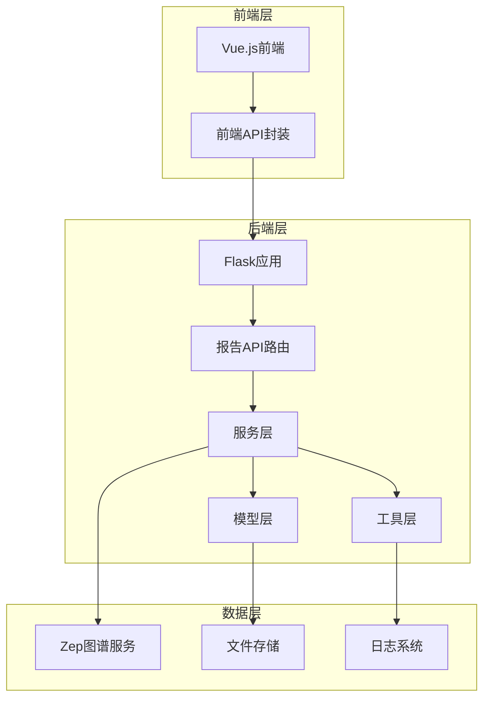
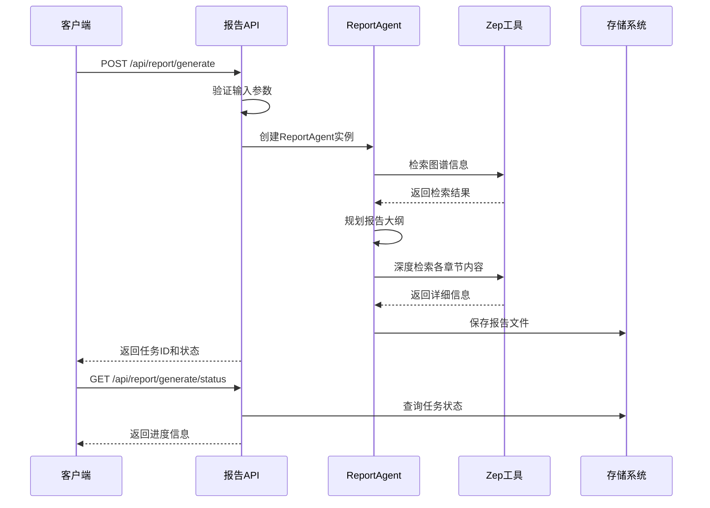
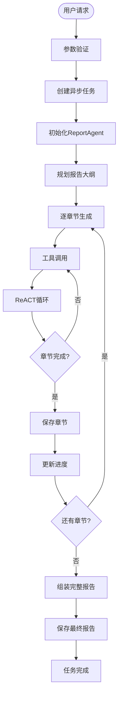
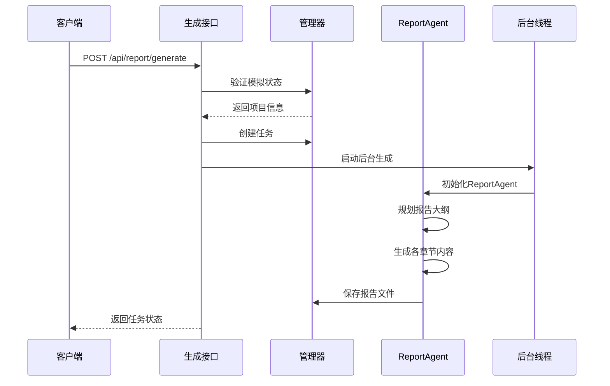
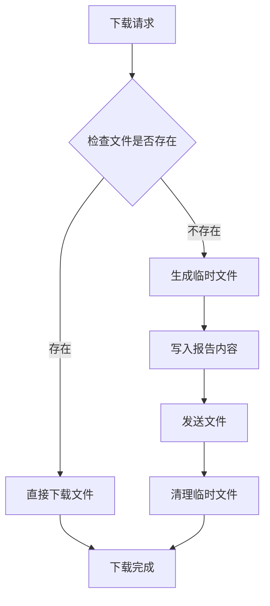
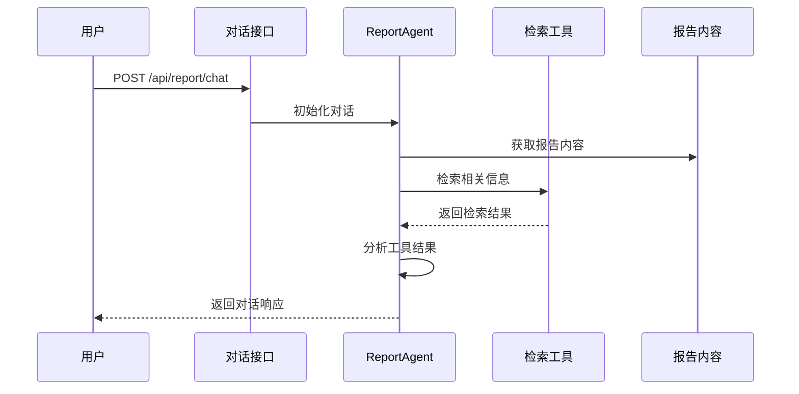
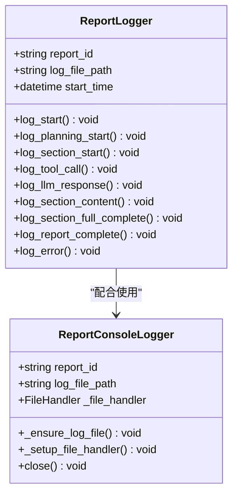
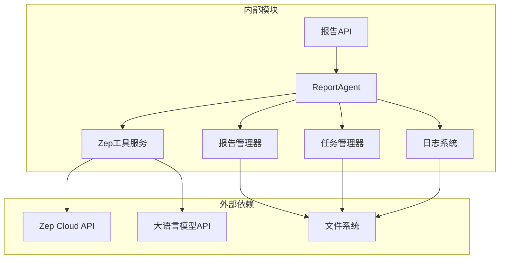
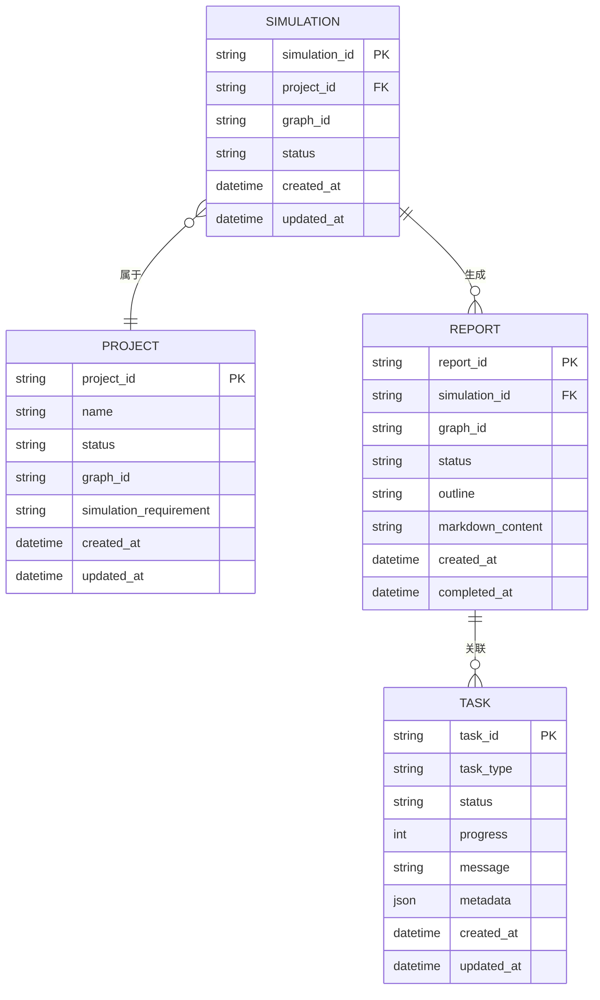
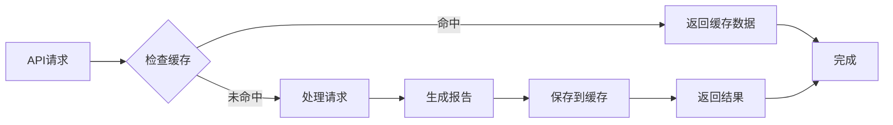

# 报告API接口

<cite>
**本文档引用的文件**
- [backend/app/api/report.py](file://backend/app/api/report.py)
- [backend/app/services/report_agent.py](file://backend/app/services/report_agent.py)
- [backend/app/services/zep_tools.py](file://backend/app/services/zep_tools.py)
- [backend/app/models/project.py](file://backend/app/models/project.py)
- [backend/app/models/task.py](file://backend/app/models/task.py)
- [backend/app/utils/logger.py](file://backend/app/utils/logger.py)
- [frontend/src/api/report.js](file://frontend/src/api/report.js)
- [README.md](file://README.md)
</cite>

## 目录
1. [简介](#简介)
2. [项目结构](#项目结构)
3. [核心组件](#核心组件)
4. [架构概览](#架构概览)
5. [详细组件分析](#详细组件分析)
6. [依赖关系分析](#依赖关系分析)
7. [性能考虑](#性能考虑)
8. [故障排除指南](#故障排除指南)
9. [结论](#结论)

## 简介

MiroFish报告API接口是基于多智能体技术的下一代AI预测引擎的重要组成部分。该系统通过ReACT（Reasoning + Acting）模式的智能Agent，结合Zep图谱检索工具，为用户提供完整的模拟分析报告生成功能。

系统支持四种核心报告API接口：
- **报告生成接口**：异步生成模拟分析报告
- **报告获取接口**：查询和获取报告详情
- **报告下载接口**：下载Markdown格式的报告
- **深度交互采访接口**：与模拟Agent进行深度对话采访

## 项目结构

MiroFish项目采用前后端分离架构，后端使用Flask框架，前端使用Vue.js技术栈。报告API接口位于后端的`backend/app/api/report.py`文件中，核心业务逻辑由`ReportAgent`类实现。

**图表来源**
- [backend/app/api/report.py](file://backend/app/api/report.py#L1-L1016)
- [backend/app/services/report_agent.py](file://backend/app/services/report_agent.py#L1-L2420)

**章节来源**
- [README.md](file://README.md#L81-L88)

## 核心组件

### 报告API路由层

报告API路由层负责处理HTTP请求和响应，提供RESTful接口。主要包含以下功能模块：

- **异步报告生成**：处理报告生成任务的创建和状态查询
- **报告查询管理**：提供报告详情查询、列表获取等功能
- **文件下载服务**：支持报告文件的下载和流式传输
- **智能对话接口**：提供与ReportAgent的深度交互能力
- **日志监控服务**：实时获取报告生成过程的详细日志

### ReportAgent智能代理

ReportAgent是系统的核心智能体，采用ReACT模式进行推理和行动：

- **ReACT推理模式**：思考-行动-观察的循环机制
- **多工具集集成**：整合三种核心检索工具和深度采访功能
- **结构化报告生成**：按照预定义的大纲结构生成高质量报告
- **实时进度监控**：提供详细的生成进度和状态反馈

### Zep工具服务

Zep工具服务提供强大的图谱检索能力：

- **InsightForge深度洞察**：多维度的智能检索和分析
- **Panorama广度搜索**：获取事件全貌和演变过程
- **QuickSearch快速检索**：高效的精确信息查询
- **InterviewAgents深度采访**：真实Agent的多视角采访

**章节来源**
- [backend/app/api/report.py](file://backend/app/api/report.py#L24-L196)
- [backend/app/services/report_agent.py](file://backend/app/services/report_agent.py#L469-L530)
- [backend/app/services/zep_tools.py](file://backend/app/services/zep_tools.py#L377-L400)

## 架构概览

系统采用分层架构设计，确保各层职责明确、耦合度低：

**图表来源**
- [backend/app/api/report.py](file://backend/app/api/report.py#L24-L196)
- [backend/app/services/report_agent.py](file://backend/app/services/report_agent.py#L1358-L1591)

### 数据流架构

**图表来源**
- [backend/app/services/report_agent.py](file://backend/app/services/report_agent.py#L1456-L1564)

## 详细组件分析

### 报告生成接口

报告生成接口提供异步任务处理能力，支持强制重新生成和进度查询功能。

#### 接口规范

**POST /api/report/generate**
- **请求参数**：
  - `simulation_id` (必填)：模拟ID
  - `force_regenerate` (可选)：强制重新生成标志

- **响应结构**：
  - `success`：布尔值，请求是否成功
  - `data`：包含任务信息的对象
  - `task_id`：任务唯一标识符
  - `report_id`：报告唯一标识符
  - `status`：任务状态
  - `message`：状态描述

#### 生成流程

**图表来源**
- [backend/app/api/report.py](file://backend/app/api/report.py#L24-L196)
- [backend/app/services/report_agent.py](file://backend/app/services/report_agent.py#L1358-L1591)

**章节来源**
- [backend/app/api/report.py](file://backend/app/api/report.py#L24-L196)

### 报告获取接口

报告获取接口提供多种查询方式，满足不同场景的需求。

#### 接口规范

**GET /api/report/{report_id}**
- **路径参数**：`report_id` - 报告唯一标识符
- **响应**：完整的报告详情，包括大纲、内容和元数据

**GET /api/report/by-simulation/{simulation_id}**
- **路径参数**：`simulation_id` - 模拟唯一标识符
- **响应**：对应模拟的报告信息

**GET /api/report/list**
- **查询参数**：
  - `simulation_id` (可选)：按模拟ID过滤
  - `limit` (可选，默认50)：返回数量限制
- **响应**：报告列表和总数

**章节来源**
- [backend/app/api/report.py](file://backend/app/api/report.py#L272-L391)

### 报告下载接口

报告下载接口支持Markdown格式的报告文件下载，提供灵活的文件处理机制。

#### 接口规范

**GET /api/report/{report_id}/download**
- **路径参数**：`report_id` - 报告唯一标识符
- **响应**：Markdown格式的报告文件
- **返回类型**：文件流，Content-Type: text/markdown

#### 下载机制

**图表来源**
- [backend/app/api/report.py](file://backend/app/api/report.py#L393-L437)

**章节来源**
- [backend/app/api/report.py](file://backend/app/api/report.py#L393-L437)

### 深度交互采访接口

深度交互采访接口提供与模拟Agent的智能对话能力，支持多视角的深度分析。

#### 接口规范

**POST /api/report/chat**
- **请求参数**：
  - `simulation_id` (必填)：模拟ID
  - `message` (必填)：用户消息
  - `chat_history` (可选)：对话历史记录

- **响应结构**：
  - `response`：Agent回复内容
  - `tool_calls`：调用的工具列表
  - `sources`：信息来源

#### 对话机制

**图表来源**
- [backend/app/api/report.py](file://backend/app/api/report.py#L467-L559)
- [backend/app/services/report_agent.py](file://backend/app/services/report_agent.py#L1592-L1728)

**章节来源**
- [backend/app/api/report.py](file://backend/app/api/report.py#L467-L559)

### 报告进度监控接口

系统提供完善的进度监控机制，支持实时获取报告生成状态。

#### 接口规范

**GET /api/report/generate/status**
- **请求参数**：
  - `task_id` (可选)：任务ID
  - `simulation_id` (可选)：模拟ID

- **响应**：任务状态和进度信息

**GET /api/report/{report_id}/progress**
- **路径参数**：`report_id` - 报告ID
- **响应**：详细的生成进度，包括当前章节和已完成章节

**GET /api/report/{report_id}/sections**
- **路径参数**：`report_id` - 报告ID
- **响应**：已生成章节列表和完成状态

**章节来源**
- [backend/app/api/report.py](file://backend/app/api/report.py#L198-L268)
- [backend/app/api/report.py](file://backend/app/api/report.py#L564-L654)

### 日志监控接口

系统提供完整的日志监控功能，支持结构化和控制台日志的实时获取。

#### 接口规范

**GET /api/report/{report_id}/agent-log**
- **路径参数**：`report_id` - 报告ID
- **查询参数**：`from_line` (可选)：起始行号
- **响应**：结构化Agent日志

**GET /api/report/{report_id}/console-log**
- **路径参数**：`report_id` - 报告ID
- **查询参数**：`from_line` (可选)：起始行号
- **响应**：控制台风格日志

#### 日志结构

**图表来源**
- [backend/app/services/report_agent.py](file://backend/app/services/report_agent.py#L35-L304)
- [backend/app/services/report_agent.py](file://backend/app/services/report_agent.py#L306-L386)

**章节来源**
- [backend/app/api/report.py](file://backend/app/api/report.py#L751-L926)

## 依赖关系分析

### 核心依赖关系

**图表来源**
- [backend/app/services/report_agent.py](file://backend/app/services/report_agent.py#L1-L50)
- [backend/app/services/zep_tools.py](file://backend/app/services/zep_tools.py#L1-L30)

### 数据模型关系

**图表来源**
- [backend/app/models/project.py](file://backend/app/models/project.py#L26-L99)
- [backend/app/models/task.py](file://backend/app/models/task.py#L22-L52)

**章节来源**
- [backend/app/models/project.py](file://backend/app/models/project.py#L1-L306)
- [backend/app/models/task.py](file://backend/app/models/task.py#L1-L185)

## 性能考虑

### 异步处理机制

系统采用异步任务处理模式，避免长时间阻塞请求：

- **后台线程池**：使用独立线程处理报告生成任务
- **任务状态管理**：通过TaskManager跟踪任务进度
- **内存优化**：分章节生成和保存，避免内存峰值过高

### 缓存策略

### 错误处理机制

系统提供多层次的错误处理和恢复机制：

- **工具重试**：Zep工具服务支持自动重试
- **异常捕获**：完整的异常捕获和日志记录
- **状态回滚**：失败时的状态回滚和清理

## 故障排除指南

### 常见问题诊断

**报告生成失败**
1. 检查模拟ID是否有效
2. 验证图谱是否已正确构建
3. 查看Agent日志获取详细错误信息

**工具调用异常**
1. 确认Zep API密钥配置正确
2. 检查网络连接和API可用性
3. 查看重试日志和错误码

**文件下载失败**
1. 检查报告文件是否存在
2. 验证文件权限设置
3. 确认磁盘空间充足

### 日志分析

系统提供详细的日志记录功能，便于问题诊断：

- **结构化日志**：agent_log.jsonl文件记录完整执行流程
- **控制台日志**：console_log.txt文件记录标准输出
- **错误日志**：统一的日志格式便于搜索和分析

**章节来源**
- [backend/app/utils/logger.py](file://backend/app/utils/logger.py#L1-L127)

## 结论

MiroFish报告API接口系统通过智能化的设计和完善的架构，为用户提供了一套完整的模拟分析报告解决方案。系统的主要优势包括：

1. **智能推理能力**：基于ReACT模式的ReportAgent能够自主规划和生成高质量报告
2. **多工具集集成**：整合深度检索、广度搜索和快速查询等多种工具
3. **实时监控机制**：提供完整的进度监控和日志记录功能
4. **异步处理架构**：支持大规模并发处理和资源优化
5. **灵活的API设计**：满足不同场景下的报告生成和查询需求

该系统不仅适用于专业的预测分析场景，也为普通用户提供了易用的报告生成工具，是构建智能预测分析平台的理想选择。