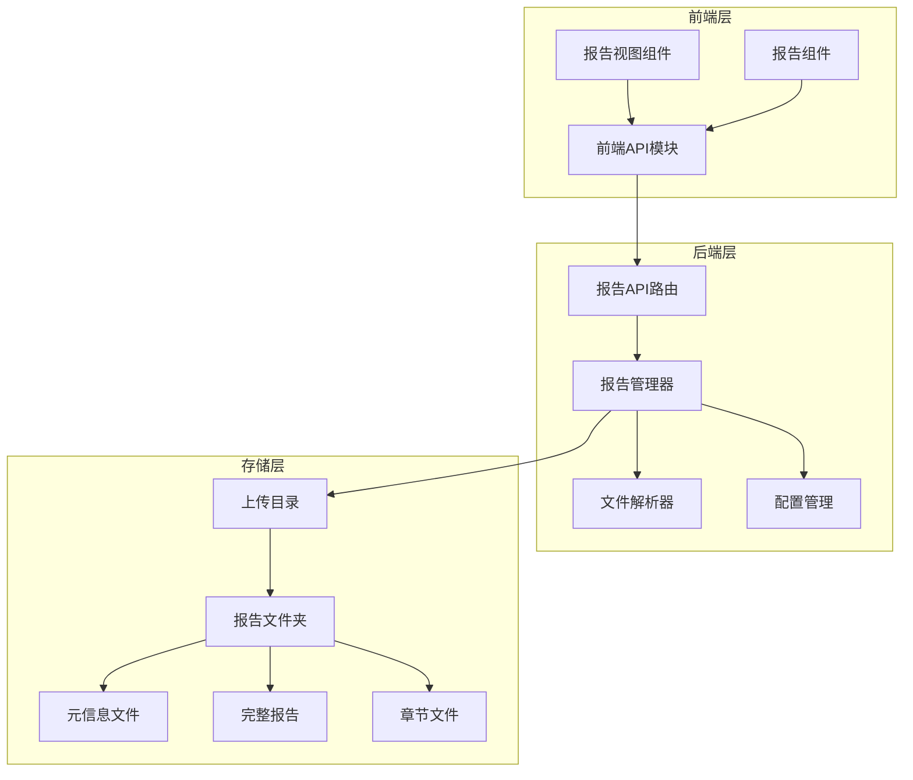
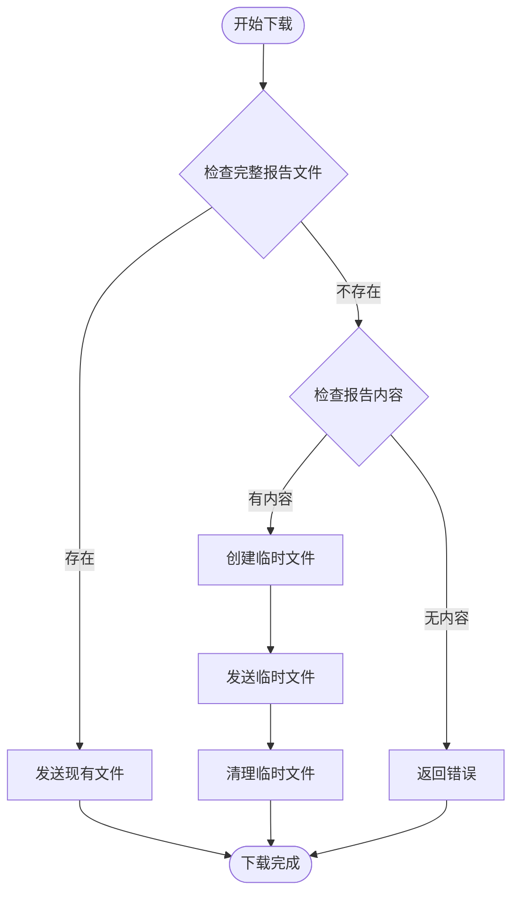
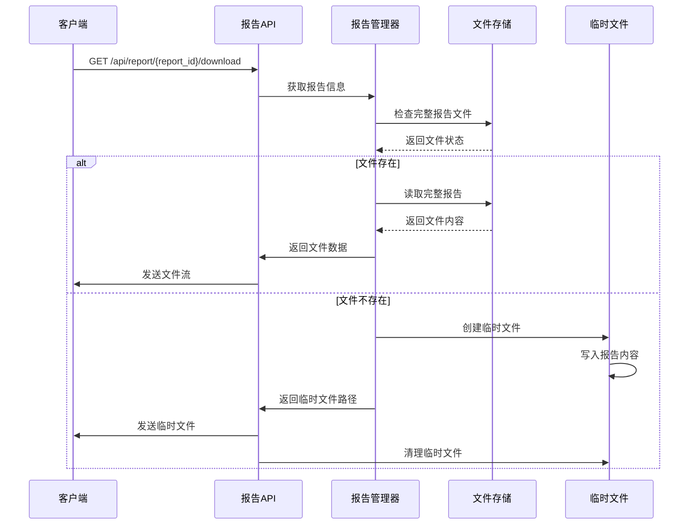
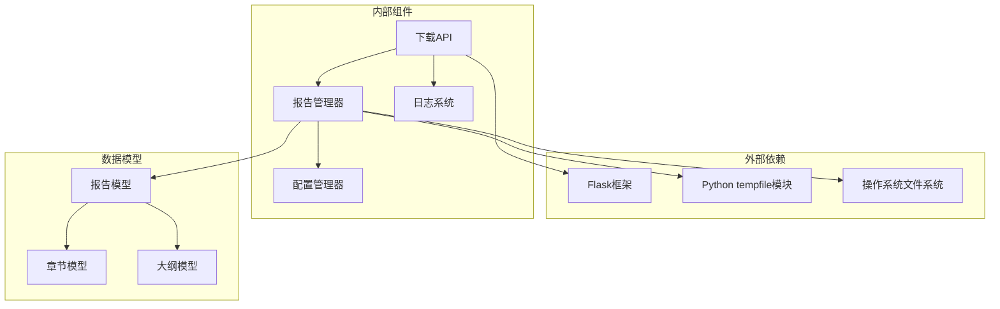

# 报告下载接口

<cite>
**本文档引用的文件**
- [backend/app/api/report.py](file://backend/app/api/report.py)
- [backend/app/services/report_agent.py](file://backend/app/services/report_agent.py)
- [backend/app/config.py](file://backend/app/config.py)
- [backend/app/utils/file_parser.py](file://backend/app/utils/file_parser.py)
- [frontend/src/api/report.js](file://frontend/src/api/report.js)
- [frontend/src/views/ReportView.vue](file://frontend/src/views/ReportView.vue)
- [frontend/src/components/Step4Report.vue](file://frontend/src/components/Step4Report.vue)
</cite>

## 目录
1. [简介](#简介)
2. [项目结构](#项目结构)
3. [核心组件](#核心组件)
4. [架构概览](#架构概览)
5. [详细组件分析](#详细组件分析)
6. [依赖关系分析](#依赖关系分析)
7. [性能考虑](#性能考虑)
8. [故障排除指南](#故障排除指南)
9. [结论](#结论)
10. [附录](#附录)

## 简介

本文档详细说明了MiroFish项目中报告下载接口的实现机制。该接口提供GET /api/report/{report_id}/download功能，负责将模拟分析报告以Markdown格式下载到本地。系统实现了智能的文件存储策略，包括持久化存储和临时文件处理，确保在不同状态下都能正确提供报告文件。

## 项目结构

MiroFish项目采用前后端分离架构，报告下载功能涉及以下关键组件：



**图表来源**
- [backend/app/api/report.py](file://backend/app/api/report.py#L393-L436)
- [backend/app/services/report_agent.py](file://backend/app/services/report_agent.py#L1731-L1755)
- [backend/app/config.py](file://backend/app/config.py#L38-L41)

**章节来源**
- [backend/app/api/report.py](file://backend/app/api/report.py#L1-L1016)
- [backend/app/services/report_agent.py](file://backend/app/services/report_agent.py#L1731-L2420)
- [backend/app/config.py](file://backend/app/config.py#L1-L76)

## 核心组件

### 报告下载接口

报告下载接口位于后端API路由中，提供完整的文件下载功能：

- **接口路径**: `/api/report/{report_id}/download`
- **HTTP方法**: GET
- **功能**: 下载指定ID的报告为Markdown文件
- **响应**: 返回二进制文件流，文件名为 `{report_id}.md`

### 报告管理器

报告管理器负责报告的持久化存储和文件管理：

- **存储目录**: `Config.UPLOAD_FOLDER/reports/{report_id}/`
- **文件结构**:
  - `meta.json`: 报告元信息和状态
  - `outline.json`: 报告大纲
  - `progress.json`: 生成进度
  - `section_01.md` 至 `section_N.md`: 各章节内容
  - `full_report.md`: 完整报告

### 文件存储策略

系统实现了智能的文件存储策略，确保在不同状态下都能正确提供报告文件：



**图表来源**
- [backend/app/api/report.py](file://backend/app/api/report.py#L409-L428)

**章节来源**
- [backend/app/api/report.py](file://backend/app/api/report.py#L393-L436)
- [backend/app/services/report_agent.py](file://backend/app/services/report_agent.py#L1774-L1777)

## 架构概览

报告下载系统的整体架构如下：



**图表来源**
- [backend/app/api/report.py](file://backend/app/api/report.py#L393-L436)
- [backend/app/services/report_agent.py](file://backend/app/services/report_agent.py#L2287-L2291)

## 详细组件分析

### 报告下载API实现

报告下载接口的核心实现逻辑如下：

#### 文件存在性检查

接口首先检查报告的完整Markdown文件是否存在。如果存在，直接返回该文件；如果不存在，则检查报告内容是否可用。

#### 临时文件处理

当完整报告文件不存在但报告内容可用时，系统会创建一个临时文件：

1. **临时文件创建**: 使用Python的tempfile模块创建临时文件
2. **内容写入**: 将报告的markdown_content写入临时文件
3. **文件发送**: 使用Flask的send_file函数发送临时文件
4. **资源清理**: 下载完成后自动清理临时文件

#### HTTP响应配置

下载响应设置了适当的HTTP头：

- `Content-Type`: `application/octet-stream`
- `Content-Disposition`: `attachment; filename="{report_id}.md"`
- `Content-Length`: 文件大小（由Flask自动设置）

### 报告存储管理

报告管理器负责维护报告的文件结构和状态：

#### 存储目录结构

```mermaid
graph TD
REPORTS_ROOT[reports/] --> REPORT_ID[{report_id}/]
REPORT_ID --> META[meta.json]
REPORT_ID --> OUTLINE[outline.json]
REPORT_ID --> PROGRESS[progress.json]
REPORT_ID --> SECTIONS[章节文件]
SECTIONS --> SECTION_01[section_01.md]
SECTIONS --> SECTION_02[section_02.md]
SECTIONS --> SECTION_N[section_N.md]
REPORT_ID --> FULL_REPORT[full_report.md]
```

**图表来源**
- [backend/app/services/report_agent.py](file://backend/app/services/report_agent.py#L1737-L1746)

#### 文件路径管理

报告管理器提供了统一的文件路径管理方法：

- `_get_report_markdown_path()`: 获取完整报告文件路径
- `_get_section_path()`: 获取特定章节文件路径
- `_get_report_folder()`: 获取报告文件夹路径

### 编码处理机制

系统实现了智能的文件编码处理机制：

#### Markdown文件编码

- **编码格式**: UTF-8
- **写入方式**: 使用`encoding='utf-8'`参数确保正确的Unicode编码
- **读取方式**: 统一使用UTF-8解码，支持中文等多字节字符

#### 文件解析编码

文件解析器提供了多级编码检测机制：

1. **UTF-8优先**: 首先尝试UTF-8解码
2. **charset_normalizer**: 使用第三方库自动检测编码
3. **chardet**: 回退到chardet库检测
4. **UTF-8兜底**: 最终使用UTF-8 + errors='replace'

### 错误恢复机制

系统实现了多层次的错误处理和恢复机制：

#### 报告不存在处理

当请求的报告不存在时：
- 返回404状态码
- 返回清晰的错误信息
- 记录详细的错误日志

#### 文件系统错误处理

文件操作中的异常情况：
- 文件不存在：返回相应错误
- 权限不足：返回权限错误
- 磁盘空间不足：返回存储错误

#### 临时文件清理

系统确保临时文件得到及时清理：
- 下载完成后自动删除临时文件
- 异常情况下也进行清理
- 防止磁盘空间泄漏

**章节来源**
- [backend/app/api/report.py](file://backend/app/api/report.py#L393-L436)
- [backend/app/services/report_agent.py](file://backend/app/services/report_agent.py#L1774-L1777)
- [backend/app/utils/file_parser.py](file://backend/app/utils/file_parser.py#L11-L58)

## 依赖关系分析

报告下载功能涉及多个组件之间的复杂依赖关系：



**图表来源**
- [backend/app/api/report.py](file://backend/app/api/report.py#L6-L17)
- [backend/app/services/report_agent.py](file://backend/app/services/report_agent.py#L16-L32)

### 组件耦合度分析

- **低耦合**: 下载API与文件系统操作相对独立
- **高内聚**: 报告管理器集中处理所有文件操作
- **清晰边界**: 配置管理器提供统一的存储路径配置

### 外部依赖管理

系统对外部依赖的管理策略：
- Flask作为Web框架提供HTTP服务
- Python标准库处理文件操作
- 第三方库用于编码检测和文件解析

**章节来源**
- [backend/app/api/report.py](file://backend/app/api/report.py#L1-L20)
- [backend/app/services/report_agent.py](file://backend/app/services/report_agent.py#L1-L32)

## 性能考虑

### 文件传输优化

系统在文件传输方面采用了多项优化措施：

#### 流式传输

- 使用Flask的send_file函数实现流式文件传输
- 避免将整个文件加载到内存中
- 支持大文件的高效传输

#### 临时文件管理

- 临时文件在内存中创建，避免磁盘I/O
- 下载完成后立即清理临时文件
- 防止临时文件占用磁盘空间

### 存储效率

#### 文件组织策略

- 分章节存储：将长报告拆分为多个小文件
- 元信息分离：报告内容与元信息分开存储
- 快速访问：通过索引文件快速定位章节内容

#### 缓存机制

- 内存缓存：报告内容在内存中缓存
- 文件系统缓存：操作系统自动缓存常用文件
- 减少磁盘I/O操作

## 故障排除指南

### 常见问题及解决方案

#### 下载文件为空

**症状**: 下载的Markdown文件内容为空

**可能原因**:
1. 报告尚未生成完成
2. 报告内容在生成过程中被清空
3. 文件系统权限问题

**解决步骤**:
1. 检查报告生成状态
2. 确认报告文件存在且非空
3. 验证文件系统权限

#### 文件编码问题

**症状**: 下载的文件出现乱码

**可能原因**:
1. 文件编码不正确
2. 客户端解码设置错误
3. 字符集不兼容

**解决步骤**:
1. 确认文件使用UTF-8编码
2. 检查客户端的字符集设置
3. 验证浏览器的编码识别

#### 磁盘空间不足

**症状**: 下载临时文件失败

**可能原因**:
1. 服务器磁盘空间不足
2. 临时文件未及时清理
3. 大文件导致空间不足

**解决步骤**:
1. 检查服务器磁盘使用情况
2. 清理临时文件
3. 优化文件存储策略

### 调试建议

#### 后端调试

1. **启用详细日志**: 检查下载过程中的日志信息
2. **验证文件路径**: 确认报告文件的实际存储位置
3. **监控磁盘空间**: 定期检查存储空间使用情况

#### 前端调试

1. **网络请求检查**: 使用浏览器开发者工具查看请求响应
2. **文件完整性验证**: 检查下载文件的完整性
3. **错误处理测试**: 验证错误情况下的用户反馈

**章节来源**
- [backend/app/api/report.py](file://backend/app/api/report.py#L430-L436)
- [backend/app/services/report_agent.py](file://backend/app/services/report_agent.py#L2294-L2304)

## 结论

MiroFish项目的报告下载接口实现了高效、可靠的文件下载功能。通过智能的文件存储策略、完善的错误处理机制和优化的性能考虑，系统能够稳定地提供报告下载服务。

主要特点包括：
- **灵活的存储策略**: 支持持久化存储和临时文件处理
- **完善的错误处理**: 提供清晰的错误信息和恢复机制
- **高效的性能表现**: 采用流式传输和内存优化技术
- **良好的用户体验**: 提供一致的下载体验和错误反馈

该接口为MiroFish项目的核心功能之一，为用户提供了便捷的报告导出能力，支持后续的数据分析和报告分享需求。

## 附录

### 前端集成示例

前端可以通过以下方式集成报告下载功能：

#### JavaScript集成

```javascript
// 下载报告的函数示例
async function downloadReport(reportId) {
    try {
        const response = await fetch(`/api/report/${reportId}/download`);
        
        if (!response.ok) {
            throw new Error(`HTTP error! status: ${response.status}`);
        }
        
        const blob = await response.blob();
        const url = window.URL.createObjectURL(blob);
        const a = document.createElement('a');
        a.href = url;
        a.download = `${reportId}.md`;
        document.body.appendChild(a);
        a.click();
        window.URL.revokeObjectURL(url);
        document.body.removeChild(a);
    } catch (error) {
        console.error('下载失败:', error);
        // 显示错误信息给用户
    }
}
```

#### Vue.js组件集成

在Vue.js组件中，可以这样集成下载功能：

```vue
<template>
    <button @click="handleDownload" :disabled="downloading">
        {{ downloading ? '下载中...' : '下载报告' }}
    </button>
</template>

<script>
export default {
    methods: {
        async handleDownload() {
            this.downloading = true;
            try {
                await downloadReport(this.reportId);
            } finally {
                this.downloading = false;
            }
        }
    }
}
</script>
```

### 最佳实践建议

#### 后端开发最佳实践

1. **错误处理**: 始终提供清晰的错误信息和适当的HTTP状态码
2. **资源管理**: 确保临时文件得到及时清理
3. **日志记录**: 记录关键操作和错误信息
4. **性能监控**: 监控文件下载的性能指标

#### 前端开发最佳实践

1. **用户反馈**: 提供下载进度和状态反馈
2. **错误处理**: 处理网络错误和文件下载失败
3. **兼容性**: 确保跨浏览器的兼容性
4. **安全性**: 验证文件名和防止路径遍历攻击

#### 系统运维最佳实践

1. **存储监控**: 定期监控存储空间使用情况
2. **备份策略**: 建立报告文件的备份机制
3. **性能优化**: 根据使用情况调整存储和缓存策略
4. **安全审计**: 定期检查文件访问权限和安全配置