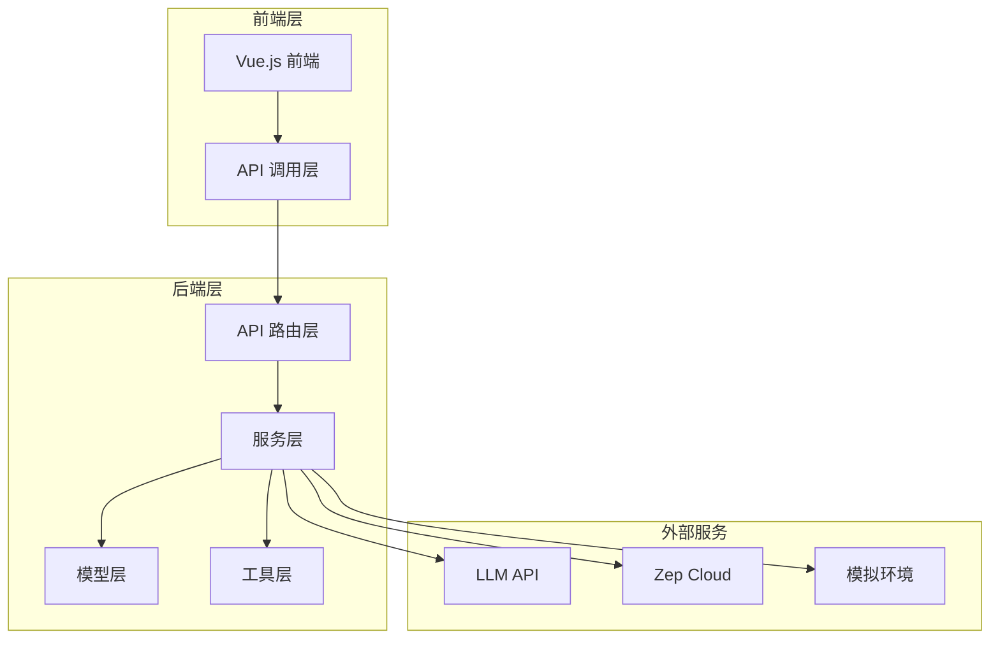
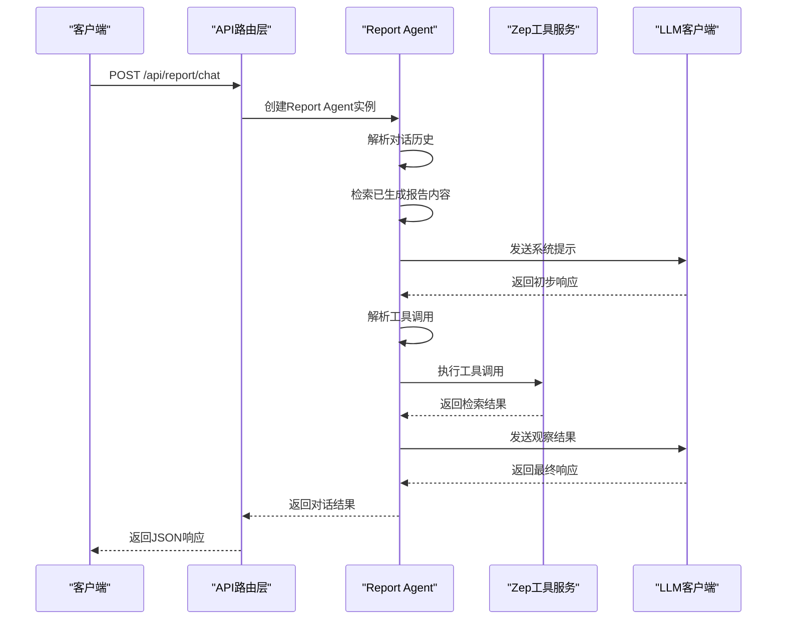
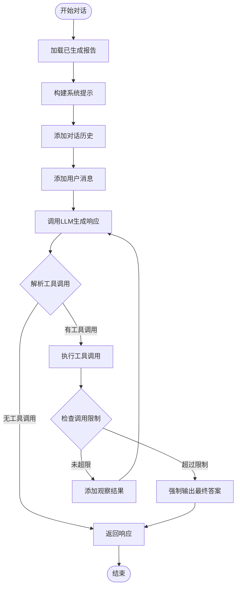
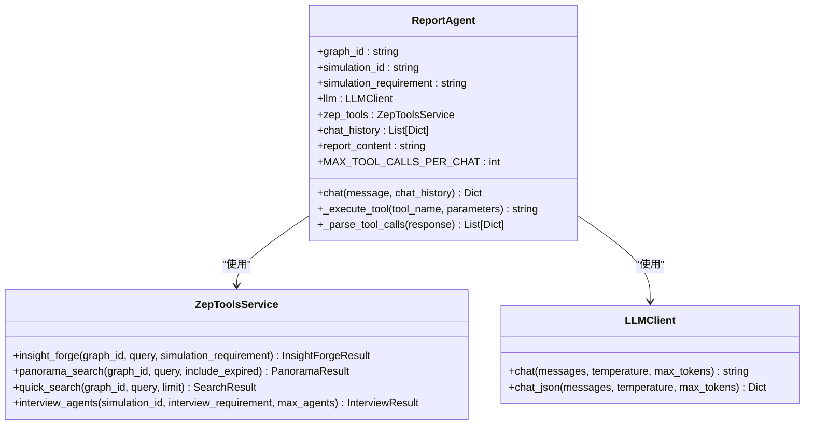
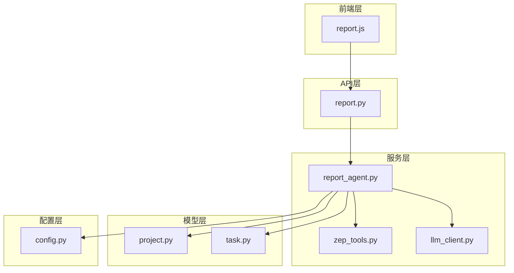

# 报告对话接口

<cite>
**本文档引用的文件**
- [report.py](file://backend/app/api/report.py)
- [report_agent.py](file://backend/app/services/report_agent.py)
- [zep_tools.py](file://backend/app/services/zep_tools.py)
- [llm_client.py](file://backend/app/utils/llm_client.py)
- [config.py](file://backend/app/config.py)
- [project.py](file://backend/app/models/project.py)
- [task.py](file://backend/app/models/task.py)
- [report.js](file://frontend/src/api/report.js)
</cite>

## 目录
1. [简介](#简介)
2. [项目结构](#项目结构)
3. [核心组件](#核心组件)
4. [架构概览](#架构概览)
5. [详细组件分析](#详细组件分析)
6. [依赖关系分析](#依赖关系分析)
7. [性能考虑](#性能考虑)
8. [故障排除指南](#故障排除指南)
9. [结论](#结论)

## 简介

MiroFish的报告对话接口是一个基于ReACT模式的智能对话系统，允许用户与Report Agent进行交互，获取关于模拟预测结果的深度分析。该接口支持智能对话机制、ReACT模式推理和工具调用集成，为用户提供了一个强大的预测分析助手。

## 项目结构

MiroFish项目采用分层架构设计，主要包含以下模块：



**图表来源**
- [report.py](file://backend/app/api/report.py#L1-L1016)
- [report_agent.py](file://backend/app/services/report_agent.py#L1-L2420)

**章节来源**
- [report.py](file://backend/app/api/report.py#L1-L1016)
- [config.py](file://backend/app/config.py#L1-L76)

## 核心组件

### Report Agent 核心功能

Report Agent是系统的核心智能体，具备以下核心能力：

1. **ReACT模式推理**：结合思考、行动、观察的循环机制
2. **多工具集成**：支持多种检索工具的智能调用
3. **上下文管理**：维护对话历史和报告内容
4. **信息来源标注**：提供可追溯的信息来源

### 对话接口设计

POST /api/report/chat接口提供了完整的对话功能：

- **请求参数**：simulation_id、message、chat_history
- **响应结构**：包含回复内容、工具调用列表和信息来源
- **智能推理**：基于已生成报告内容进行优先回答

**章节来源**
- [report.py](file://backend/app/api/report.py#L467-L560)
- [report_agent.py](file://backend/app/services/report_agent.py#L1592-L1728)

## 架构概览

系统采用模块化设计，各组件职责明确：



**图表来源**
- [report.py](file://backend/app/api/report.py#L467-L560)
- [report_agent.py](file://backend/app/services/report_agent.py#L1592-L1728)

## 详细组件分析

### Report Agent 对话机制

Report Agent的对话系统采用简化的ReACT模式：



**图表来源**
- [report_agent.py](file://backend/app/services/report_agent.py#L1592-L1728)

#### 工具调用集成

Report Agent支持四种核心工具：

1. **insight_forge**：深度洞察检索，自动分解问题并多维度检索
2. **panorama_search**：广度搜索，获取事件全貌和演变过程
3. **quick_search**：快速搜索，获取具体信息点
4. **interview_agents**：深度采访，获取模拟Agent的真实观点

**章节来源**
- [report_agent.py](file://backend/app/services/report_agent.py#L530-L632)

### 消息格式规范

#### 请求格式

```json
{
  "simulation_id": "sim_xxxx",
  "message": "请解释一下舆情走向",
  "chat_history": [
    {"role": "user", "content": "什么是模拟预测？"},
    {"role": "assistant", "content": "模拟预测是基于多智能体技术的预测引擎..."}
  ]
}
```

#### 响应格式

```json
{
  "success": true,
  "data": {
    "response": "Agent回复内容",
    "tool_calls": [
      {
        "name": "insight_forge",
        "parameters": {
          "query": "舆情走向分析"
        }
      }
    ],
    "sources": ["舆情走向分析"]
  }
}
```

**章节来源**
- [report.py](file://backend/app/api/report.py#L467-L560)

### 上下文管理与会话状态

Report Agent实现了完善的上下文管理机制：



**图表来源**
- [report_agent.py](file://backend/app/services/report_agent.py#L469-L529)
- [zep_tools.py](file://backend/app/services/zep_tools.py#L377-L417)
- [llm_client.py](file://backend/app/utils/llm_client.py#L13-L92)

**章节来源**
- [report_agent.py](file://backend/app/services/report_agent.py#L1592-L1728)

### 检索工具调用

Report Agent的工具调用遵循严格的限制和规范：

| 工具类型 | 最大调用次数 | 主要用途 | 返回内容 |
|---------|-------------|----------|----------|
| insight_forge | 2次 | 深度分析和多维度检索 | 事实、实体洞察、关系链 |
| panorama_search | 2次 | 事件全貌和演变过程 | 当前有效事实、历史事实、实体列表 |
| quick_search | 2次 | 具体信息点验证 | 相关事实列表 |
| interview_agents | 2次 | 模拟Agent真实观点 | 采访实录、关键引言 |

**章节来源**
- [report_agent.py](file://backend/app/services/report_agent.py#L486-L494)
- [report_agent.py](file://backend/app/services/report_agent.py#L1694-L1712)

## 依赖关系分析

系统各组件之间的依赖关系如下：



**图表来源**
- [report.py](file://backend/app/api/report.py#L1-L1016)
- [report_agent.py](file://backend/app/services/report_agent.py#L1-L2420)

**章节来源**
- [report.py](file://backend/app/api/report.py#L1-L1016)
- [report_agent.py](file://backend/app/services/report_agent.py#L1-L2420)

## 性能考虑

### 工具调用限制

为了保证系统性能和成本控制，Report Agent实施了严格的调用限制：

- **每轮对话最多2次工具调用**
- **每章节最多5次工具调用**
- **报告内容截断限制（15000字符）**
- **工具结果截断限制（1500字符）**

### 缓存策略

系统采用了多层次的缓存策略：

1. **已生成报告内容缓存**：避免重复检索
2. **工具调用结果缓存**：减少重复查询
3. **对话历史缓存**：限制历史长度（最近10条）

### 并发处理

系统支持并发对话处理：

- **线程安全的工具调用**
- **异步任务处理**
- **资源池管理**

## 故障排除指南

### 常见问题及解决方案

#### 1. API密钥配置错误

**问题症状**：
- LLM API调用失败
- Zep Cloud连接错误

**解决方法**：
- 检查.env文件中的LLM_API_KEY和ZEP_API_KEY
- 确认API密钥的有效性和权限

#### 2. 模拟ID无效

**问题症状**：
- 返回"模拟不存在"错误

**解决方法**：
- 验证simulation_id的正确性
- 确认模拟已经完成并生成报告

#### 3. 工具调用超时

**问题症状**：
- 工具调用响应缓慢
- 对话超时

**解决方法**：
- 检查网络连接
- 调整工具调用参数
- 优化查询语句

#### 4. 上下文过长

**问题症状**：
- LLM响应质量下降
- API调用失败

**解决方法**：
- 简化查询语句
- 减少对话历史长度
- 使用更精确的工具参数

**章节来源**
- [config.py](file://backend/app/config.py#L67-L75)
- [report_agent.py](file://backend/app/services/report_agent.py#L1618-L1627)

## 结论

MiroFish的报告对话接口通过ReACT模式推理和智能工具调用，为用户提供了强大的预测分析能力。系统的设计充分考虑了性能、可扩展性和用户体验，为复杂场景下的智能对话提供了可靠的解决方案。

该接口的主要优势包括：

1. **智能推理**：基于ReACT模式的深度思考和行动
2. **工具集成**：多种检索工具的智能组合使用
3. **上下文管理**：完善的对话历史和报告内容管理
4. **性能优化**：严格的调用限制和缓存策略
5. **错误处理**：健壮的异常处理和恢复机制

通过合理使用该接口，用户可以深入理解模拟预测结果，获得有价值的洞察和建议。