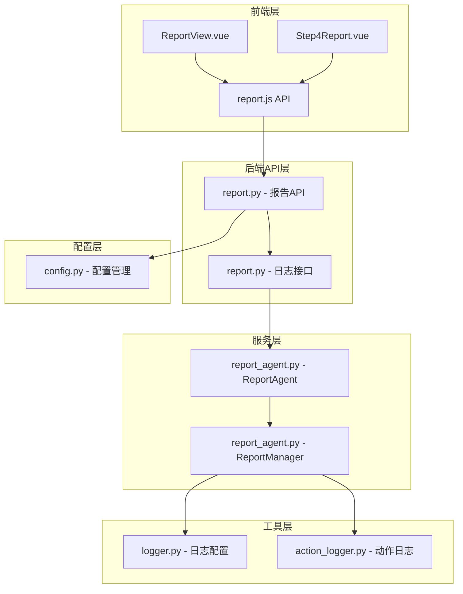
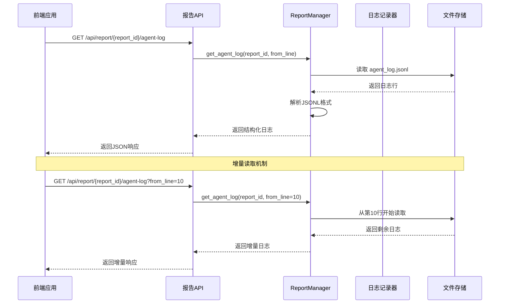
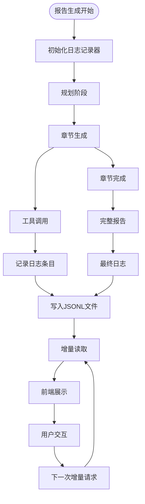
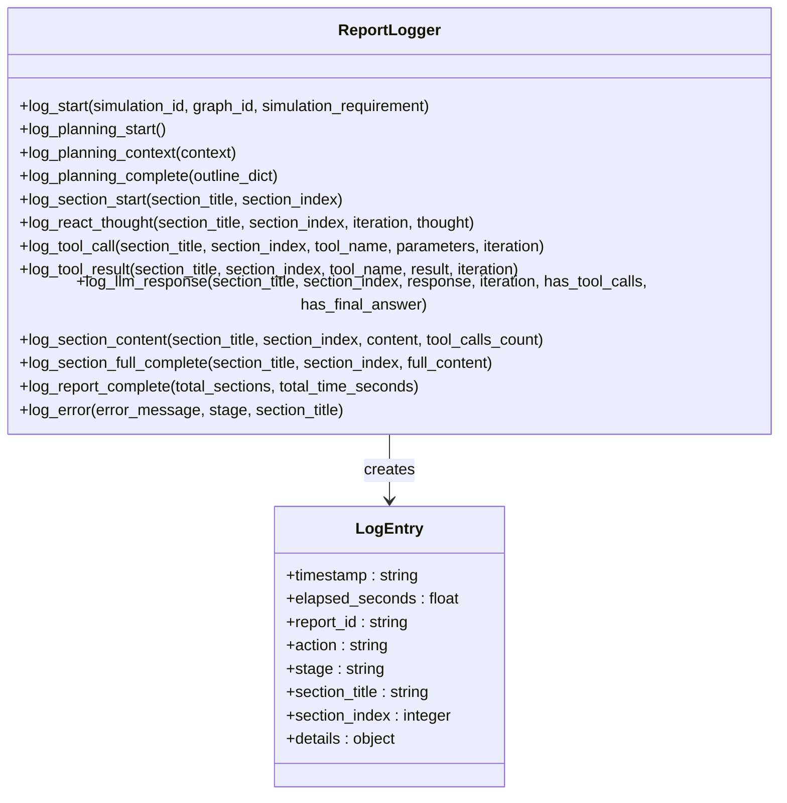
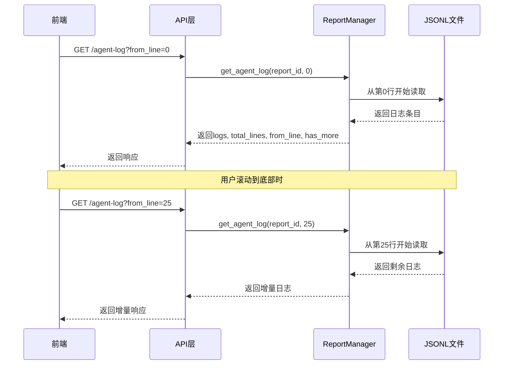
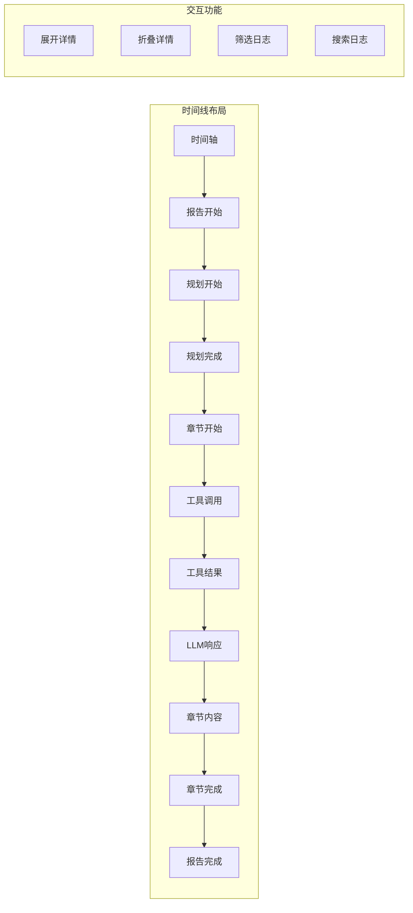
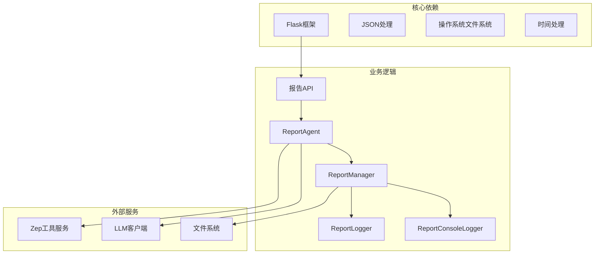
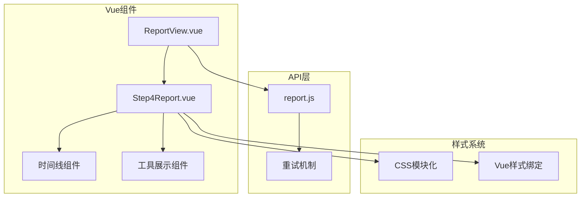
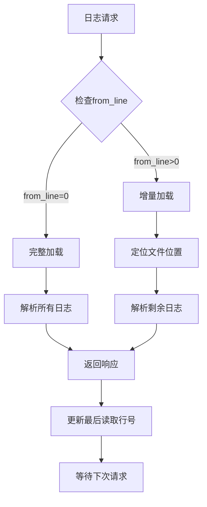

# 报告日志接口

<cite>
**本文档引用的文件**
- [report.py](file://backend/app/api/report.py)
- [report_agent.py](file://backend/app/services/report_agent.py)
- [logger.py](file://backend/app/utils/logger.py)
- [action_logger.py](file://backend/scripts/action_logger.py)
- [report.js](file://frontend/src/api/report.js)
- [Step4Report.vue](file://frontend/src/components/Step4Report.vue)
- [ReportView.vue](file://frontend/src/views/ReportView.vue)
- [config.py](file://backend/app/config.py)
</cite>

## 目录
1. [简介](#简介)
2. [项目结构](#项目结构)
3. [核心组件](#核心组件)
4. [架构概览](#架构概览)
5. [详细组件分析](#详细组件分析)
6. [依赖关系分析](#依赖关系分析)
7. [性能考虑](#性能考虑)
8. [故障排除指南](#故障排除指南)
9. [结论](#结论)

## 简介

MiroFish项目中的报告日志接口为用户提供了一个强大的可视化监控系统，用于跟踪和分析报告生成过程中的详细执行日志。该接口支持增量读取功能，允许用户实时监控报告生成的每个步骤，包括Agent执行过程、动作追踪和性能监控。

主要功能特性：
- 实时获取报告生成过程中的详细日志
- 支持增量读取，避免一次性传输大量数据
- 结构化日志格式，便于前端展示和分析
- 支持两种日志类型：结构化Agent日志和控制台输出日志
- 完整的性能监控和动作追踪

## 项目结构

MiroFish项目采用分层架构设计，报告日志功能分布在多个层次中：



**图表来源**
- [report.py](file://backend/app/api/report.py#L1-L1016)
- [report_agent.py](file://backend/app/services/report_agent.py#L1-L2420)
- [logger.py](file://backend/app/utils/logger.py#L1-L127)

**章节来源**
- [report.py](file://backend/app/api/report.py#L1-L1016)
- [report_agent.py](file://backend/app/services/report_agent.py#L1-L2420)
- [logger.py](file://backend/app/utils/logger.py#L1-L127)

## 核心组件

### 报告日志接口

报告日志接口提供两个主要的API端点：

1. **GET /api/report/<report_id>/agent-log** - 获取结构化Agent日志
2. **GET /api/report/<report_id>/console-log** - 获取控制台输出日志

### 日志记录器系统

系统包含两个日志记录器：

1. **ReportLogger** - 结构化日志记录器，记录详细的执行动作
2. **ReportConsoleLogger** - 控制台日志记录器，记录INFO级别输出

### 前端展示组件

前端提供了完整的日志展示界面，包括：
- 实时时间线展示
- 工具调用可视化
- 章节生成进度跟踪
- 性能指标监控

**章节来源**
- [report.py](file://backend/app/api/report.py#L751-L856)
- [report_agent.py](file://backend/app/services/report_agent.py#L35-L386)
- [Step4Report.vue](file://frontend/src/components/Step4Report.vue#L1-L800)

## 架构概览

报告日志系统的整体架构采用分层设计，确保了良好的可维护性和扩展性：



**图表来源**
- [report.py](file://backend/app/api/report.py#L753-L810)
- [report_agent.py](file://backend/app/services/report_agent.py#L1866-L1911)

### 数据流分析

系统采用异步数据流处理模式：



**图表来源**
- [report_agent.py](file://backend/app/services/report_agent.py#L1407-L1564)
- [report.py](file://backend/app/api/report.py#L753-L810)

## 详细组件分析

### ReportLogger - 结构化日志记录器

ReportLogger是系统的核心日志记录组件，负责记录报告生成过程中的所有重要事件：

#### 日志条目结构

每个日志条目包含以下关键字段：

| 字段名 | 类型 | 描述 | 示例 |
|--------|------|------|------|
| timestamp | string | ISO格式时间戳 | "2025-12-13T10:30:45.123Z" |
| elapsed_seconds | float | 从开始到现在的耗时(秒) | 12.5 |
| report_id | string | 报告唯一标识符 | "report_a1b2c3d4e5f6" |
| action | string | 动作类型 | "tool_call" |
| stage | string | 当前阶段 | "generating" |
| section_title | string | 章节标题 | "执行摘要" |
| section_index | integer | 章节索引 | 1 |
| details | object | 详细信息对象 | 包含工具参数、结果等 |

#### 支持的动作类型

系统支持多种动作类型的日志记录：



**图表来源**
- [report_agent.py](file://backend/app/services/report_agent.py#L35-L304)

#### 增量读取机制

ReportManager实现了高效的增量读取功能：



**图表来源**
- [report_agent.py](file://backend/app/services/report_agent.py#L1866-L1911)
- [report.py](file://backend/app/api/report.py#L793-L810)

### ReportConsoleLogger - 控制台日志记录器

ReportConsoleLogger专门用于记录控制台风格的日志输出：

#### 日志格式特点

控制台日志采用简洁的文本格式：
```
[HH:MM:SS] INFO: 报告生成任务开始
[HH:MM:SS] INFO: 开始规划报告大纲
[HH:MM:SS] INFO: 大纲规划完成，共3个章节
[HH:MM:SS] WARNING: 工具调用次数已达上限
[HH:MM:SS] ERROR: 工具执行失败: 未知工具
```

#### 文件存储策略

控制台日志存储在`console_log.txt`文件中，采用UTF-8编码，支持实时追加写入。

### 前端展示组件

前端提供了丰富的日志展示功能：

#### 时间线展示



**图表来源**
- [Step4Report.vue](file://frontend/src/components/Step4Report.vue#L142-L374)

#### 工具调用可视化

前端为不同的工具调用提供了专门的可视化展示：

| 工具名称 | 颜色 | 图标 | 功能 |
|----------|------|------|------|
| insight_forge | 紫色 | 💡灯泡 | 深度洞察检索 |
| panorama_search | 蓝色 | 🌍地球 | 广度搜索 |
| interview_agents | 绿色 | 👥用户 | 深度采访 |
| quick_search | 橙色 | ⚡闪电 | 快速检索 |
| get_graph_statistics | 青色 | 📊图表 | 图统计信息 |
| get_entities_by_type | 粉色 | 🗃️数据库 | 实体查询 |

**章节来源**
- [Step4Report.vue](file://frontend/src/components/Step4Report.vue#L495-L540)
- [report.js](file://frontend/src/api/report.js#L19-L35)

## 依赖关系分析

### 后端依赖关系



**图表来源**
- [report.py](file://backend/app/api/report.py#L1-L19)
- [report_agent.py](file://backend/app/services/report_agent.py#L12-L32)

### 前端依赖关系



**图表来源**
- [ReportView.vue](file://frontend/src/views/ReportView.vue#L64-L213)
- [Step4Report.vue](file://frontend/src/components/Step4Report.vue#L392-L413)
- [report.js](file://frontend/src/api/report.js#L1-L52)

**章节来源**
- [report.py](file://backend/app/api/report.py#L1-L19)
- [report_agent.py](file://backend/app/services/report_agent.py#L12-L32)
- [report.js](file://frontend/src/api/report.js#L1-L52)

## 性能考虑

### 日志文件存储策略

系统采用了高效的文件存储策略：

1. **JSONL格式**：每行一个JSON对象，支持随机访问和增量读取
2. **UTF-8编码**：确保中文字符正确显示
3. **自动清理**：报告完成后保留必要的日志文件
4. **内存优化**：前端只加载必要的日志片段

### 增量读取优化



### 前端性能优化

前端实现了多项性能优化措施：

1. **虚拟滚动**：只渲染可见区域的日志项
2. **懒加载**：按需加载工具结果详情
3. **防抖处理**：避免频繁的API请求
4. **内存管理**：及时清理不需要的日志数据

**章节来源**
- [report_agent.py](file://backend/app/services/report_agent.py#L1866-L1911)
- [Step4Report.vue](file://frontend/src/components/Step4Report.vue#L142-L374)

## 故障排除指南

### 常见问题及解决方案

#### 1. 日志无法显示

**症状**：前端显示空白或加载失败

**可能原因**：
- 日志文件不存在
- 文件权限问题
- 网络连接中断

**解决步骤**：
1. 检查报告文件夹是否存在
2. 验证文件权限设置
3. 确认网络连接稳定
4. 查看后端日志获取详细错误信息

#### 2. 增量读取不工作

**症状**：从指定行号开始读取时返回空数据

**可能原因**：
- 文件已被清理
- 行号超出文件范围
- 文件损坏

**解决步骤**：
1. 检查文件完整性
2. 验证行号范围
3. 重新生成报告
4. 查看文件修改时间

#### 3. 前端显示异常

**症状**：日志显示格式混乱或工具图标不显示

**可能原因**：
- CSS样式冲突
- JavaScript错误
- 字符编码问题

**解决步骤**：
1. 检查浏览器控制台错误
2. 验证CSS样式加载
3. 确认字符编码设置
4. 清除浏览器缓存

### 调试技巧

#### 后端调试

1. **启用详细日志**：在配置中设置DEBUG模式
2. **检查文件路径**：确认日志文件存储路径正确
3. **验证JSON格式**：确保日志条目符合JSONL格式
4. **监控内存使用**：避免大量日志导致内存溢出

#### 前端调试

1. **使用Vue DevTools**：检查组件状态和props传递
2. **网络面板分析**：查看API请求和响应
3. **控制台错误**：关注JavaScript运行时错误
4. **性能分析**：使用浏览器性能面板分析渲染性能

**章节来源**
- [logger.py](file://backend/app/utils/logger.py#L30-L88)
- [report.py](file://backend/app/api/report.py#L793-L810)

## 结论

MiroFish项目的报告日志接口提供了一个完整、高效、可视化的监控系统。通过结构化日志记录、增量读取机制和丰富的前端展示，用户可以实时跟踪报告生成的每个细节。

### 主要优势

1. **实时监控**：提供完整的执行过程可视化
2. **性能优化**：采用增量读取避免大数据传输
3. **用户体验**：直观的时间线展示和交互功能
4. **扩展性强**：模块化设计便于功能扩展

### 技术亮点

1. **异步架构**：报告生成和日志记录完全异步
2. **文件存储**：采用JSONL格式实现高效存储
3. **前端优化**：虚拟滚动和懒加载提升性能
4. **错误处理**：完善的异常处理和恢复机制

该系统为复杂的数据分析和报告生成场景提供了强有力的技术支撑，是现代AI应用监控的最佳实践案例。