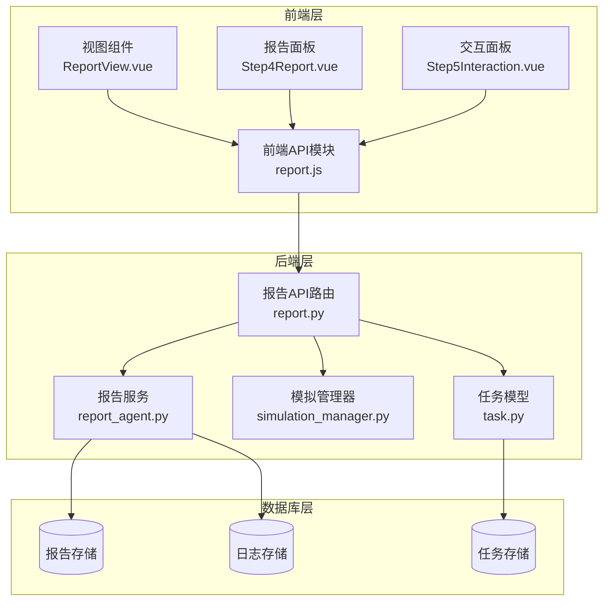
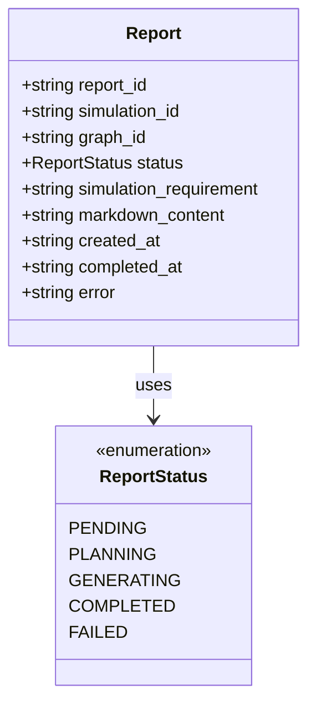
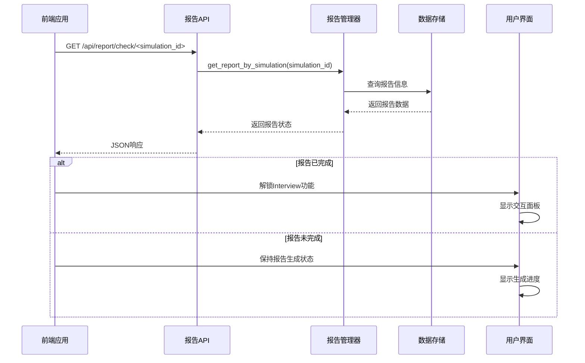
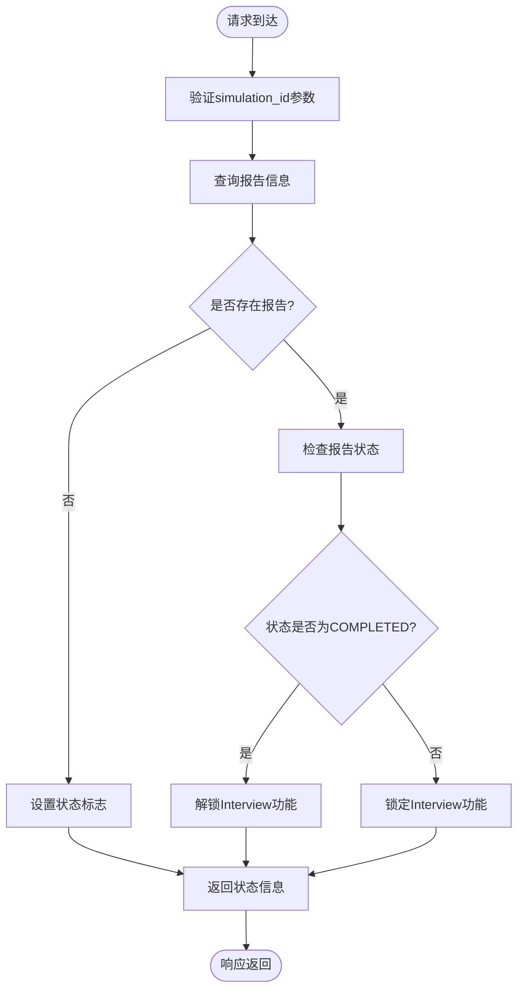
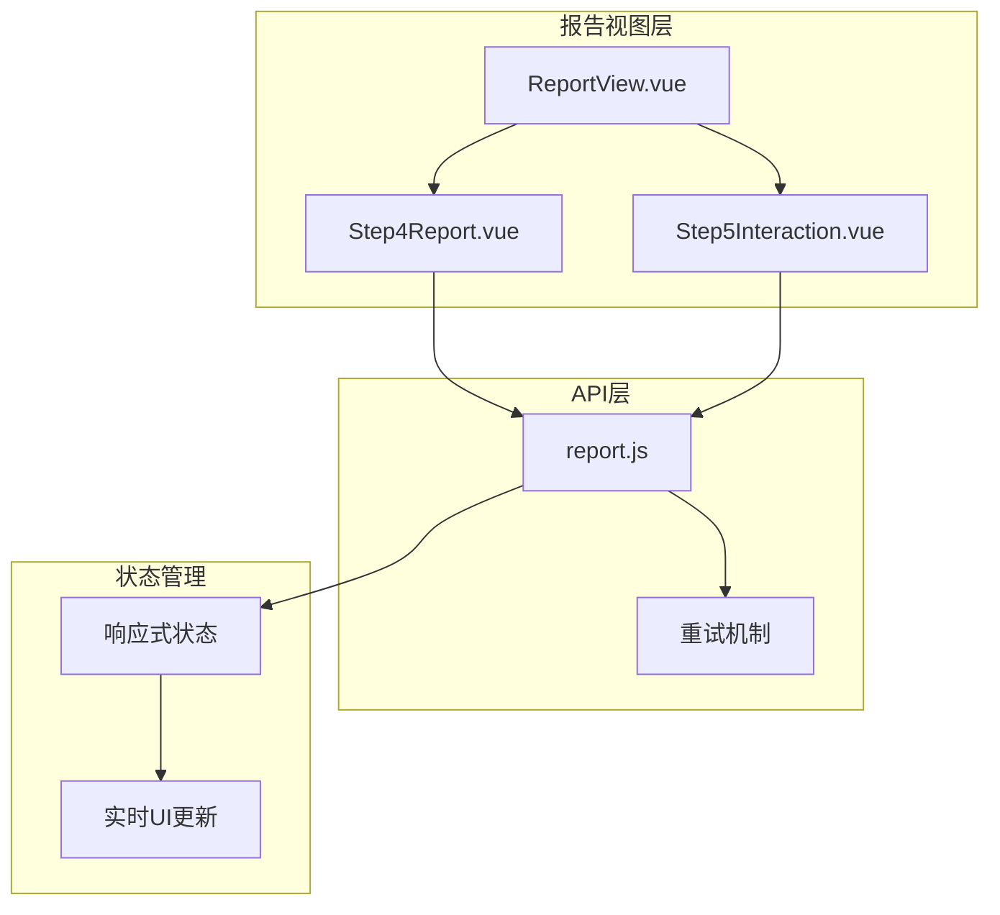
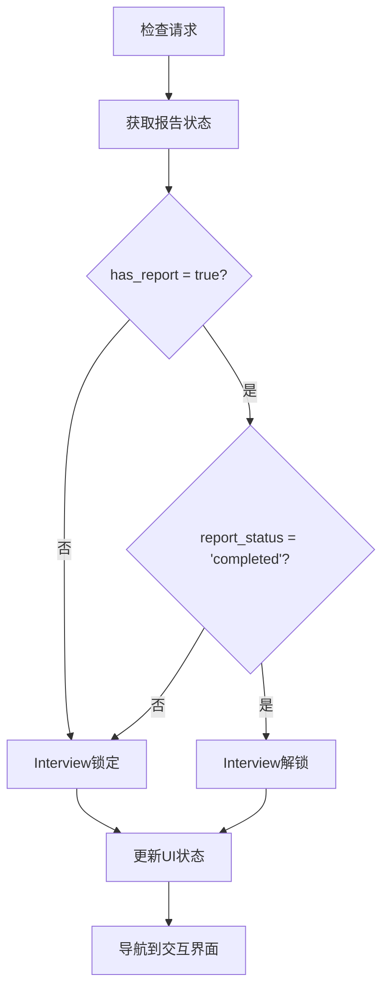
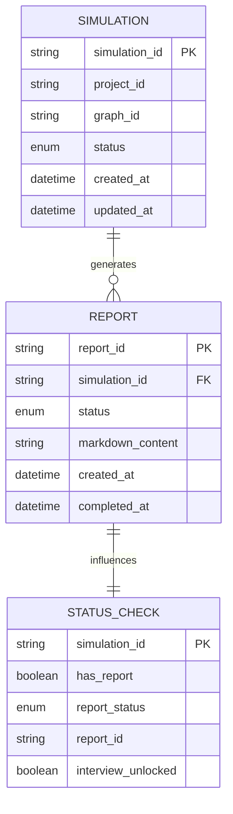
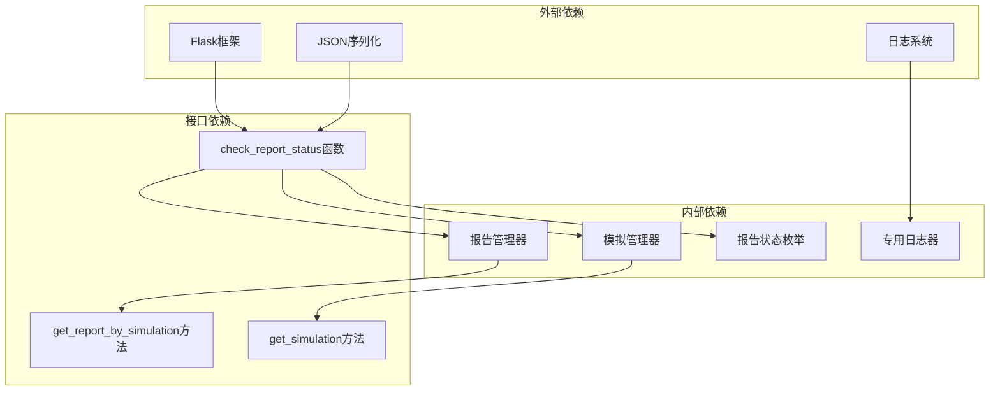

# 报告状态检查接口

<cite>
**本文档引用的文件**
- [report.py](file://backend/app/api/report.py)
- [report_agent.py](file://backend/app/services/report_agent.py)
- [simulation_manager.py](file://backend/app/services/simulation_manager.py)
- [task.py](file://backend/app/models/task.py)
- [report.js](file://frontend/src/api/report.js)
- [Step4Report.vue](file://frontend/src/components/Step4Report.vue)
- [Step5Interaction.vue](file://frontend/src/components/Step5Interaction.vue)
- [ReportView.vue](file://frontend/src/views/ReportView.vue)
</cite>

## 目录
1. [简介](#简介)
2. [项目结构](#项目结构)
3. [核心组件](#核心组件)
4. [架构概览](#架构概览)
5. [详细组件分析](#详细组件分析)
6. [依赖关系分析](#依赖关系分析)
7. [性能考虑](#性能考虑)
8. [故障排除指南](#故障排除指南)
9. [结论](#结论)

## 简介

报告状态检查接口是MiroFish项目中用于监控和控制报告生成流程的关键组件。该接口提供了一个简洁的API端点`GET /api/report/check/<simulation_id>`，专门用于检查模拟是否有报告以及报告的当前状态，从而决定是否解锁Interview功能。

该接口的设计体现了现代Web应用中状态检查和UI交互的最佳实践，通过异步报告生成机制实现了流畅的用户体验。接口不仅检查报告的存在性，还提供了完整的状态信息，包括报告状态、报告ID和Interview功能的解锁状态。

## 项目结构

MiroFish项目采用前后端分离的架构设计，报告状态检查接口位于后端Python Flask应用中，前端Vue.js应用负责UI交互和状态管理。

**图表来源**
- [report.py](file://backend/app/api/report.py#L700-L749)
- [report_agent.py](file://backend/app/services/report_agent.py#L388-L467)
- [simulation_manager.py](file://backend/app/services/simulation_manager.py#L114-L192)

**章节来源**
- [report.py](file://backend/app/api/report.py#L1-L100)
- [report_agent.py](file://backend/app/services/report_agent.py#L1-L50)
- [simulation_manager.py](file://backend/app/services/simulation_manager.py#L1-L50)

## 核心组件

### 报告状态检查接口

报告状态检查接口是整个系统的核心组件，提供了实时的状态查询能力。该接口专门设计用于前端判断Interview功能的解锁状态。

**接口定义**
- **URL**: `GET /api/report/check/<simulation_id>`
- **功能**: 检查模拟是否有报告以及报告状态
- **返回值**: 包含报告存在性、状态、报告ID和Interview解锁状态

**状态检查机制**
接口通过以下步骤实现状态检查：

1. **报告查询**: 通过`ReportManager.get_report_by_simulation(simulation_id)`获取报告信息
2. **状态判断**: 检查报告是否存在以及状态是否为COMPLETED
3. **Interview解锁**: 只有当报告状态为COMPLETED时才解锁Interview功能

**章节来源**
- [report.py](file://backend/app/api/report.py#L700-L749)

### 报告状态枚举

报告状态使用统一的枚举系统，确保状态的一致性和可维护性。

**图表来源**
- [report_agent.py](file://backend/app/services/report_agent.py#L388-L395)
- [report_agent.py](file://backend/app/services/report_agent.py#L440-L467)

**章节来源**
- [report_agent.py](file://backend/app/services/report_agent.py#L388-L467)

### 前端集成组件

前端通过专门的API模块和组件实现与后端的无缝集成。

**前端API模块**
- **文件**: `frontend/src/api/report.js`
- **功能**: 提供与报告相关的API调用封装
- **特点**: 包含重试机制和错误处理

**章节来源**
- [report.js](file://frontend/src/api/report.js#L1-L52)

## 架构概览

报告状态检查接口在整个系统架构中扮演着关键的协调角色，连接着前端UI、后端服务和数据存储层。

**图表来源**
- [report.py](file://backend/app/api/report.py#L700-L749)
- [report.js](file://frontend/src/api/report.js#L1-L52)

## 详细组件分析

### 后端实现分析

#### 报告状态检查实现

后端的报告状态检查功能通过精心设计的业务逻辑实现，确保了状态查询的准确性和实时性。

**核心实现流程**

**图表来源**
- [report.py](file://backend/app/api/report.py#L721-L740)

**实现细节**

接口的核心逻辑包括：

1. **参数验证**: 确保`simulation_id`参数的有效性
2. **报告查询**: 使用`ReportManager.get_report_by_simulation()`获取报告信息
3. **状态判断**: 检查报告是否存在以及状态是否为COMPLETED
4. **Interview解锁**: 基于报告状态决定Interview功能的可用性

**章节来源**
- [report.py](file://backend/app/api/report.py#L700-L749)

#### 报告管理器集成

报告状态检查接口与报告管理器紧密集成，确保了状态信息的准确性和一致性。

**状态检查的关键要素**

| 要素 | 描述 | 实现方式 |
|------|------|----------|
| 报告存在性 | 检查模拟是否已有报告 | `ReportManager.get_report_by_simulation()` |
| 报告状态 | 获取报告的当前状态 | `report.status.value` |
| 报告ID | 返回关联的报告标识符 | `report.report_id` |
| Interview解锁 | 基于状态决定功能可用性 | `report.status == ReportStatus.COMPLETED` |

**章节来源**
- [report.py](file://backend/app/api/report.py#L721-L739)

### 前端集成分析

#### Vue.js组件集成

前端通过Vue.js组件实现了与后端API的无缝集成，提供了直观的用户界面和流畅的交互体验。

**组件架构**

**图表来源**
- [ReportView.vue](file://frontend/src/views/ReportView.vue#L64-L213)
- [Step4Report.vue](file://frontend/src/components/Step4Report.vue#L392-L413)

**前端状态管理**

前端组件通过以下方式管理状态：

1. **响应式数据**: 使用Vue.js的响应式系统管理状态
2. **实时更新**: 通过轮询机制获取最新的报告状态
3. **UI同步**: 确保UI状态与后端状态保持一致

**章节来源**
- [ReportView.vue](file://frontend/src/views/ReportView.vue#L64-L213)
- [Step4Report.vue](file://frontend/src/components/Step4Report.vue#L392-L413)

#### Interview功能解锁逻辑

Interview功能的解锁完全依赖于报告状态检查接口的返回值，实现了严格的访问控制。

**解锁条件**

**图表来源**
- [report.py](file://backend/app/api/report.py#L728-L729)

**章节来源**
- [report.py](file://backend/app/api/report.py#L728-L729)

### 数据流分析

报告状态检查接口的数据流体现了清晰的职责分离和数据传递机制。

**图表来源**
- [simulation_manager.py](file://backend/app/services/simulation_manager.py#L42-L111)
- [report_agent.py](file://backend/app/services/report_agent.py#L440-L467)
- [report.py](file://backend/app/api/report.py#L731-L739)

**数据流特点**

1. **单向依赖**: 状态检查依赖于报告存在性，而非反向
2. **状态一致性**: 确保前端和后端状态的同步
3. **原子性操作**: 状态检查作为一个原子操作执行

**章节来源**
- [simulation_manager.py](file://backend/app/services/simulation_manager.py#L42-L111)
- [report_agent.py](file://backend/app/services/report_agent.py#L440-L467)

## 依赖关系分析

报告状态检查接口的依赖关系体现了良好的模块化设计和松耦合原则。

**图表来源**
- [report.py](file://backend/app/api/report.py#L1-L20)
- [report.py](file://backend/app/api/report.py#L11-L18)

**依赖特点**

1. **最小依赖**: 仅依赖必要的核心模块
2. **明确边界**: 清晰的接口定义和依赖边界
3. **可测试性**: 依赖注入使得单元测试成为可能

**章节来源**
- [report.py](file://backend/app/api/report.py#L1-L20)

## 性能考虑

报告状态检查接口在设计时充分考虑了性能优化，确保了高并发场景下的稳定表现。

### 缓存策略

虽然报告状态检查接口本身不实现复杂的缓存机制，但可以通过以下方式优化性能：

1. **数据库查询优化**: 使用适当的索引加速报告查询
2. **连接池管理**: 合理配置数据库连接池
3. **响应时间监控**: 实时监控接口响应时间

### 并发处理

接口设计支持高并发访问，通过以下机制保证稳定性：

1. **线程安全**: 使用Flask的内置线程安全特性
2. **异常隔离**: 每个请求独立处理，避免相互影响
3. **资源清理**: 及时释放数据库连接和其他资源

### 最佳实践建议

1. **合理轮询**: 前端应该避免过于频繁的状态检查
2. **错误重试**: 实现指数退避的重试机制
3. **超时处理**: 设置合理的请求超时时间

## 故障排除指南

### 常见问题及解决方案

**问题1: 报告状态检查失败**
- **症状**: 接口返回500错误
- **原因**: 数据库连接异常或报告管理器异常
- **解决方案**: 检查数据库连接状态，查看日志文件

**问题2: Interview功能无法解锁**
- **症状**: 即使报告已完成，Interview仍被锁定
- **原因**: 状态检查逻辑错误或前端状态不同步
- **解决方案**: 验证报告状态值，检查前端状态管理

**问题3: 前端状态不同步**
- **症状**: UI显示与实际状态不符
- **原因**: 轮询机制失效或状态更新延迟
- **解决方案**: 检查网络连接，增加重试机制

### 调试技巧

1. **日志分析**: 查看后端日志中的错误信息
2. **网络监控**: 使用浏览器开发者工具监控API调用
3. **状态检查**: 验证数据库中的报告状态

**章节来源**
- [report.py](file://backend/app/api/report.py#L742-L748)

## 结论

报告状态检查接口是MiroFish项目中实现优雅用户体验的关键组件。通过精心设计的状态检查机制、严格的Interview功能解锁逻辑和完善的前端集成，该接口为用户提供了流畅的报告生成和交互体验。

### 主要优势

1. **简洁明了**: API设计简单直观，易于理解和使用
2. **实时性强**: 支持实时状态检查和UI更新
3. **可靠性高**: 完善的错误处理和重试机制
4. **扩展性强**: 良好的架构设计支持功能扩展

### 技术亮点

1. **状态驱动的UI**: 基于报告状态的动态UI更新
2. **严格的权限控制**: 基于状态的功能访问控制
3. **前后端协作**: 协调一致的前后端状态管理
4. **性能优化**: 高效的查询和响应机制

该接口的成功实现展示了现代Web应用中状态管理和UI交互的最佳实践，为类似的应用开发提供了宝贵的参考经验。