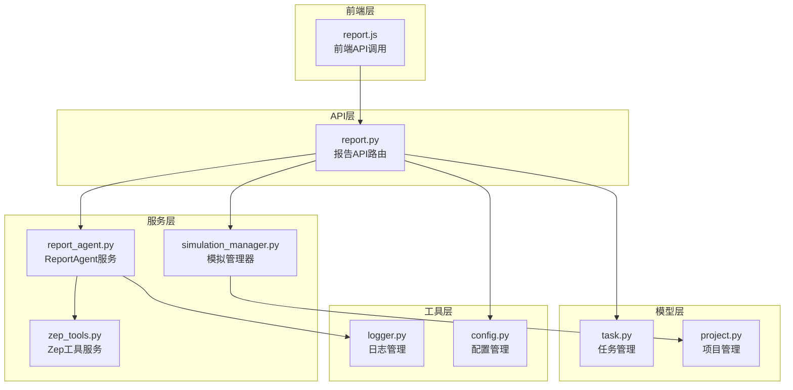
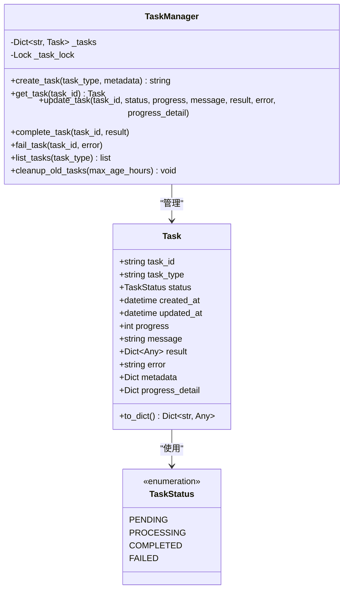
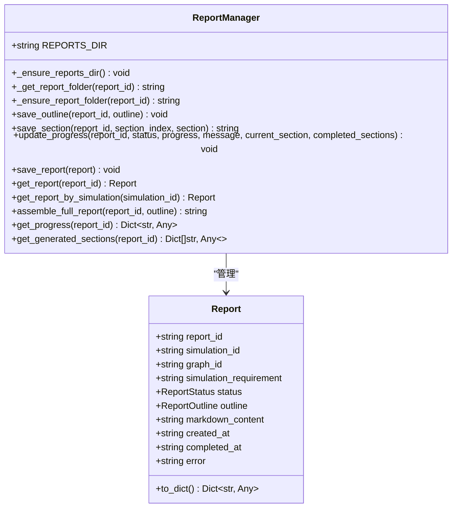
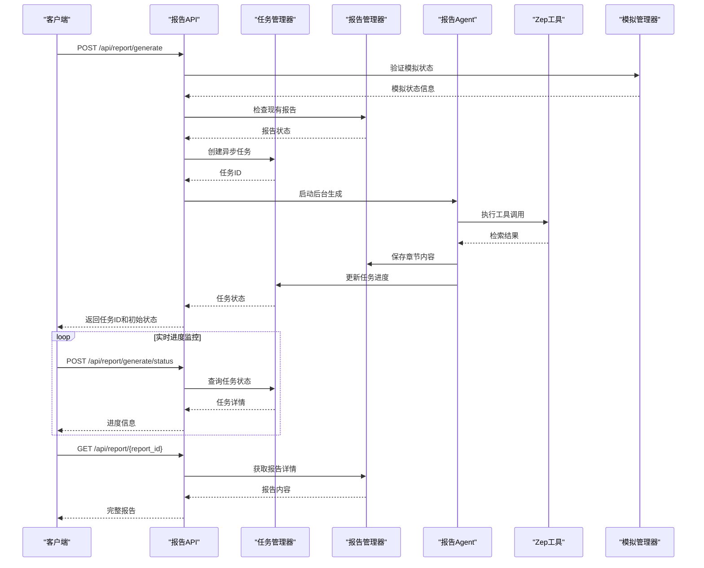
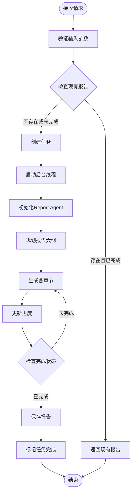
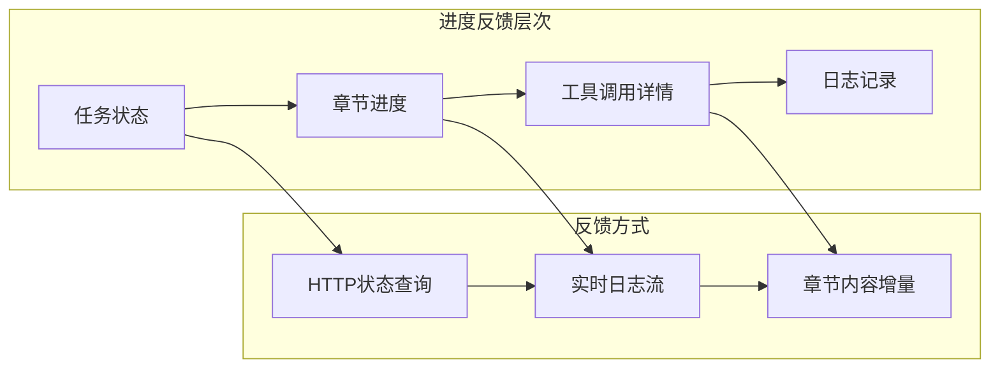
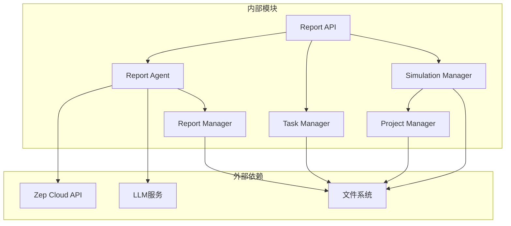

# 报告生成接口

<cite>
**本文档引用的文件**
- [report.py](file://backend/app/api/report.py)
- [report_agent.py](file://backend/app/services/report_agent.py)
- [task.py](file://backend/app/models/task.py)
- [simulation_manager.py](file://backend/app/services/simulation_manager.py)
- [project.py](file://backend/app/models/project.py)
- [logger.py](file://backend/app/utils/logger.py)
- [config.py](file://backend/app/config.py)
- [report.js](file://frontend/src/api/report.js)
</cite>

## 目录
1. [简介](#简介)
2. [项目结构](#项目结构)
3. [核心组件](#核心组件)
4. [架构概览](#架构概览)
5. [详细组件分析](#详细组件分析)
6. [依赖关系分析](#依赖关系分析)
7. [性能考虑](#性能考虑)
8. [故障排除指南](#故障排除指南)
9. [结论](#结论)

## 简介

MiroFish的报告生成接口提供了一个完整的异步报告生成功能，基于ReACT（Reasoning + Acting）模式，结合Zep图谱检索和LLM能力，为模拟分析生成专业的报告内容。该接口支持分章节输出、实时进度监控、工具调用追踪等功能，为用户提供高质量的分析报告生成体验。

## 项目结构

MiroFish项目采用分层架构设计，报告生成功能主要分布在以下模块中：

**图表来源**
- [report.py](file://backend/app/api/report.py#L1-L1016)
- [report_agent.py](file://backend/app/services/report_agent.py#L1-L2420)
- [task.py](file://backend/app/models/task.py#L1-L185)

**章节来源**
- [report.py](file://backend/app/api/report.py#L1-L1016)
- [report_agent.py](file://backend/app/services/report_agent.py#L1-L2420)
- [task.py](file://backend/app/models/task.py#L1-L185)

## 核心组件

### 报告生成API接口

POST /api/report/generate 接口是报告生成的核心入口，提供异步任务处理机制：

**请求参数**
- `simulation_id` (必填): 模拟ID，用于标识特定的模拟分析
- `force_regenerate` (可选): 强制重新生成标志，默认false

**响应格式**
- `success`: 操作是否成功的布尔值
- `data`: 成功时返回的数据对象
- `error`: 失败时的错误信息
- `traceback`: 详细错误堆栈信息

**章节来源**
- [report.py](file://backend/app/api/report.py#L24-L48)

### 任务管理系统

TaskManager提供线程安全的任务状态管理，支持任务的创建、更新、完成和失败标记：

**图表来源**
- [task.py](file://backend/app/models/task.py#L14-L185)

**章节来源**
- [task.py](file://backend/app/models/task.py#L54-L185)

### 报告管理器

ReportManager负责报告的持久化存储和检索，支持分章节输出和实时进度监控：

**图表来源**
- [report_agent.py](file://backend/app/services/report_agent.py#L1731-L2420)

**章节来源**
- [report_agent.py](file://backend/app/services/report_agent.py#L1731-L2420)

## 架构概览

报告生成系统的整体架构采用异步处理模式，确保用户体验和系统性能的平衡：

**图表来源**
- [report.py](file://backend/app/api/report.py#L24-L195)
- [task.py](file://backend/app/models/task.py#L73-L162)
- [report_agent.py](file://backend/app/services/report_agent.py#L469-L743)

## 详细组件分析

### 报告生成流程

报告生成采用ReACT模式，分为三个主要阶段：

#### 1. 规划阶段 (Planning)
- 分析模拟需求和上下文
- 生成报告大纲结构
- 定义章节组织和内容范围

#### 2. 生成阶段 (Generating)  
- 逐章节生成内容
- 每章节可多次调用工具获取信息
- 支持反思和质量检查

#### 3. 完成阶段 (Completed)
- 组装完整报告
- 保存最终内容
- 标记任务完成

**章节来源**
- [report_agent.py](file://backend/app/services/report_agent.py#L795-L800)

### 异步任务处理机制

系统采用线程池和异步处理机制确保高并发性能：

**图表来源**
- [report.py](file://backend/app/api/report.py#L124-L175)
- [task.py](file://backend/app/models/task.py#L106-L162)

**章节来源**
- [report.py](file://backend/app/api/report.py#L124-L175)

### 工具调用机制

ReportAgent支持多种工具调用，每种工具都有特定的功能和参数：

| 工具名称 | 功能描述 | 主要用途 |
|---------|----------|----------|
| insight_forge | 深度洞察检索 | 多维度分析、复杂问题分解 |
| panorama_search | 广度搜索 | 全貌了解、历史信息获取 |
| quick_search | 简单搜索 | 快速信息定位 |
| interview_agents | 深度采访 | 真实Agent观点收集 |

**章节来源**
- [report_agent.py](file://backend/app/services/report_agent.py#L530-L632)

### 进度回调机制

系统提供多层次的进度反馈机制：

**图表来源**
- [report.py](file://backend/app/api/report.py#L198-L267)
- [report_agent.py](file://backend/app/services/report_agent.py#L2047-L2084)

**章节来源**
- [report.py](file://backend/app/api/report.py#L198-L267)

## 依赖关系分析

报告生成系统的关键依赖关系如下：

**图表来源**
- [report.py](file://backend/app/api/report.py#L11-L17)
- [report_agent.py](file://backend/app/services/report_agent.py#L16-L31)

**章节来源**
- [report.py](file://backend/app/api/report.py#L11-L17)

## 性能考虑

### 线程池和并发处理

系统采用线程池模式处理异步任务，避免阻塞主线程：

- 每个报告生成任务在独立线程中执行
- 任务状态通过内存共享，支持实时查询
- 线程安全的锁机制确保数据一致性

### 缓存策略

- 任务状态缓存在内存中，减少数据库访问
- 报告内容分章节存储，支持增量获取
- 日志文件按需读取，避免内存溢出

### 错误处理

系统提供多层次的错误处理机制：

- 输入参数验证和错误提示
- 任务状态异常恢复
- 文件系统操作的异常捕获
- 日志记录便于问题诊断

## 故障排除指南

### 常见问题及解决方案

**问题1: 模拟不存在**
- 症状: 返回404错误，提示模拟不存在
- 解决方案: 确认simulation_id正确性，检查模拟状态

**问题2: 缺少图谱ID**
- 症状: 返回400错误，提示缺少图谱ID
- 解决方案: 确保已完成图谱构建步骤

**问题3: 报告生成超时**
- 症状: 任务长时间处于processing状态
- 解决方案: 检查LLM服务可用性，查看Agent日志

**问题4: 工具调用失败**
- 症状: 工具执行返回错误
- 解决方案: 检查Zep API密钥配置，验证网络连接

**章节来源**
- [report.py](file://backend/app/api/report.py#L65-L99)

### 日志分析

系统提供多层级日志记录：

- 控制台日志：INFO级别输出，记录主要操作
- Agent日志：结构化JSONL格式，记录详细执行过程
- 错误日志：异常堆栈信息，便于问题定位

**章节来源**
- [report_agent.py](file://backend/app/services/report_agent.py#L35-L304)

## 结论

MiroFish的报告生成接口提供了一个完整、高效、可扩展的异步报告生成功能。通过ReACT模式、多工具集成、分章节输出和实时进度监控，系统能够为复杂的模拟分析生成高质量的专业报告。

关键特性包括：
- 异步任务处理，提升用户体验
- 分章节输出，支持增量获取
- 多层次进度反馈，便于监控
- 完善的错误处理和日志记录
- 灵活的工具调用机制

该接口为后续的功能扩展和性能优化奠定了良好的基础，能够满足不同规模和复杂度的报告生成需求。