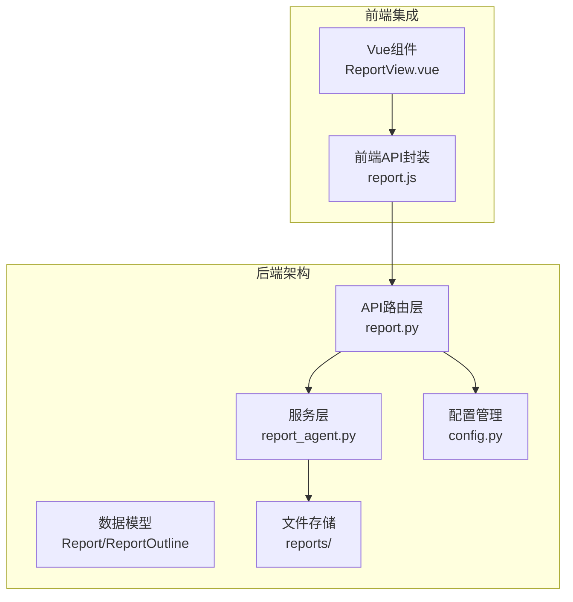
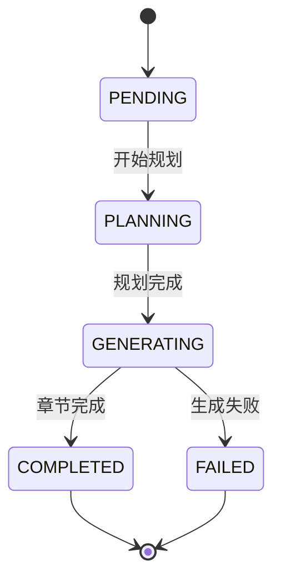
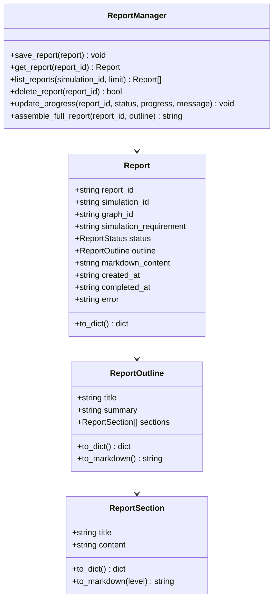
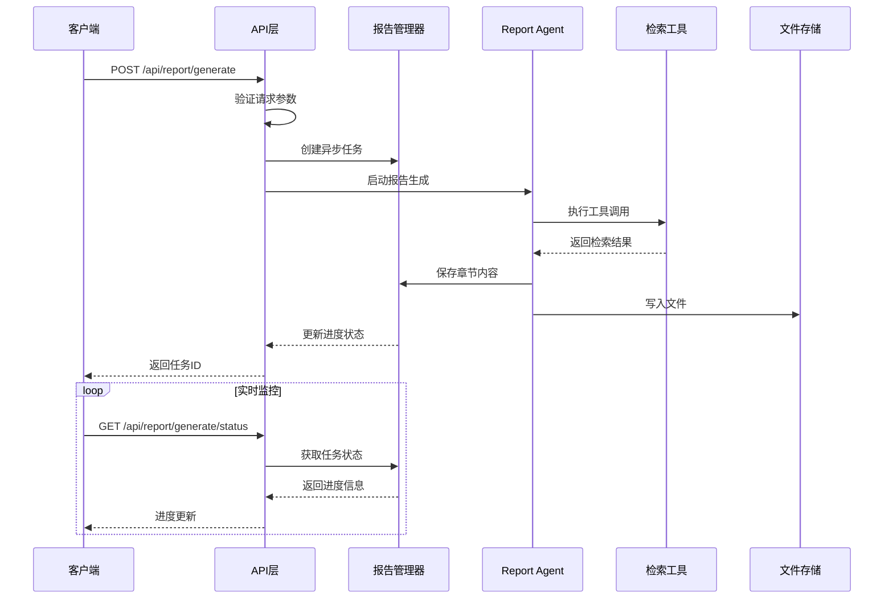
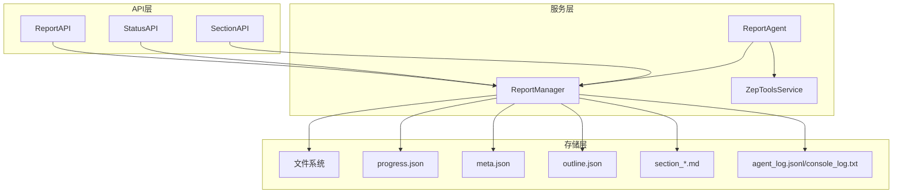
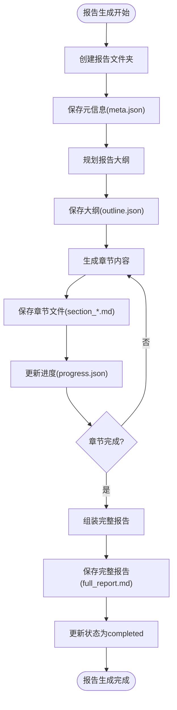

# 报告管理接口

<cite>
**本文档引用的文件**
- [report.py](file://backend/app/api/report.py)
- [report_agent.py](file://backend/app/services/report_agent.py)
- [config.py](file://backend/app/config.py)
- [report.js](file://frontend/src/api/report.js)
</cite>

## 目录
1. [简介](#简介)
2. [项目结构](#项目结构)
3. [核心组件](#核心组件)
4. [架构概览](#架构概览)
5. [详细接口文档](#详细接口文档)
6. [依赖关系分析](#依赖关系分析)
7. [性能考虑](#性能考虑)
8. [故障排除指南](#故障排除指南)
9. [结论](#结论)

## 简介

MiroFish项目提供了一个完整的模拟报告管理系统，支持异步报告生成、实时进度监控、分章节输出和多种交互功能。该系统基于Flask框架构建，采用ReACT（Reasoning + Acting）模式的AI Agent进行报告生成，结合Zep图谱检索工具提供深度分析能力。

## 项目结构

报告管理模块位于后端应用的API层，主要包含以下组件：



**图表来源**
- [report.py](file://backend/app/api/report.py#L1-L1016)
- [report_agent.py](file://backend/app/services/report_agent.py#L1731-L2420)
- [config.py](file://backend/app/config.py#L1-L76)

**章节来源**
- [report.py](file://backend/app/api/report.py#L1-L1016)
- [report_agent.py](file://backend/app/services/report_agent.py#L1731-L2420)
- [config.py](file://backend/app/config.py#L1-L76)

## 核心组件

### 报告状态管理

系统采用五种报告状态进行生命周期管理：



**状态说明：**
- **PENDING**: 报告待处理状态
- **PLANNING**: 正在规划报告大纲
- **GENERATING**: 正在生成章节内容
- **COMPLETED**: 报告生成完成
- **FAILED**: 报告生成失败

### 数据模型



**图表来源**
- [report_agent.py](file://backend/app/services/report_agent.py#L440-L467)
- [report_agent.py](file://backend/app/services/report_agent.py#L417-L438)
- [report_agent.py](file://backend/app/services/report_agent.py#L397-L415)
- [report_agent.py](file://backend/app/services/report_agent.py#L2273-L2420)

**章节来源**
- [report_agent.py](file://backend/app/services/report_agent.py#L388-L467)

## 架构概览

报告管理系统采用分层架构设计，实现了异步处理、实时监控和文件存储的有机结合：



**图表来源**
- [report.py](file://backend/app/api/report.py#L24-L196)
- [report_agent.py](file://backend/app/services/report_agent.py#L1492-L1591)

## 详细接口文档

### 1. 获取报告详情

**接口地址**: `GET /api/report/{report_id}`

**功能描述**: 根据报告ID获取完整的报告详情，包括报告元信息、大纲结构和Markdown内容。

**路径参数**:
- `report_id` (string, 必填): 报告唯一标识符

**响应格式**:
```json
{
  "success": true,
  "data": {
    "report_id": "report_xxxx",
    "simulation_id": "sim_xxxx",
    "graph_id": "graph_xxxx",
    "simulation_requirement": "模拟需求描述",
    "status": "completed",
    "outline": {
      "title": "报告标题",
      "summary": "报告摘要",
      "sections": [
        {
          "title": "章节标题",
          "content": "章节内容"
        }
      ]
    },
    "markdown_content": "# 报告内容\n\n...",
    "created_at": "2025-01-01T00:00:00Z",
    "completed_at": "2025-01-01T01:00:00Z",
    "error": null
  }
}
```

**错误响应**:
- 404 Not Found: 报告不存在

**章节来源**
- [report.py](file://backend/app/api/report.py#L272-L312)

### 2. 根据模拟ID获取报告

**接口地址**: `GET /api/report/by-simulation/{simulation_id}`

**功能描述**: 根据模拟ID获取对应的报告，如果不存在则返回404状态。

**路径参数**:
- `simulation_id` (string, 必填): 模拟唯一标识符

**响应格式**:
```json
{
  "success": true,
  "data": {
    "report_id": "report_xxxx",
    "simulation_id": "sim_xxxx",
    "status": "completed",
    "outline": {...},
    "markdown_content": "...",
    "has_report": true
  }
}
```

**错误响应**:
- 404 Not Found: 该模拟暂无报告

**章节来源**
- [report.py](file://backend/app/api/report.py#L314-L351)

### 3. 列出所有报告

**接口地址**: `GET /api/report/list`

**功能描述**: 获取所有报告的列表，支持按模拟ID过滤和限制返回数量。

**查询参数**:
- `simulation_id` (string, 可选): 按模拟ID过滤
- `limit` (integer, 可选): 返回数量限制，默认50

**响应格式**:
```json
{
  "success": true,
  "data": [
    {
      "report_id": "report_xxxx",
      "simulation_id": "sim_xxxx",
      "status": "completed",
      "outline": {...},
      "created_at": "2025-01-01T00:00:00Z"
    }
  ],
  "count": 10
}
```

**章节来源**
- [report.py](file://backend/app/api/report.py#L353-L391)

### 4. 删除报告

**接口地址**: `DELETE /api/report/{report_id}`

**功能描述**: 删除指定ID的报告，包括报告文件夹和所有相关文件。

**路径参数**:
- `report_id` (string, 必填): 报告唯一标识符

**响应格式**:
```json
{
  "success": true,
  "message": "报告已删除: report_xxxx"
}
```

**错误响应**:
- 404 Not Found: 报告不存在

**章节来源**
- [report.py](file://backend/app/api/report.py#L439-L463)

### 5. 报告生成接口

**接口地址**: `POST /api/report/generate`

**功能描述**: 异步启动报告生成任务，立即返回任务ID供后续状态查询。

**请求格式**:
```json
{
  "simulation_id": "sim_xxxx",
  "force_regenerate": false
}
```

**响应格式**:
```json
{
  "success": true,
  "data": {
    "simulation_id": "sim_xxxx",
    "report_id": "report_xxxx",
    "task_id": "task_xxxx",
    "status": "generating",
    "message": "报告生成任务已启动",
    "already_generated": false
  }
}
```

**参数验证**:
- `simulation_id`: 必填，必须存在且有效
- `force_regenerate`: 可选，布尔值，默认false

**章节来源**
- [report.py](file://backend/app/api/report.py#L24-L196)

### 6. 报告生成状态查询

**接口地址**: `POST /api/report/generate/status`

**功能描述**: 查询报告生成任务的进度状态，支持通过任务ID或模拟ID查询。

**请求格式**:
```json
{
  "task_id": "task_xxxx",
  "simulation_id": "sim_xxxx"
}
```

**响应格式**:
```json
{
  "success": true,
  "data": {
    "task_id": "task_xxxx",
    "status": "processing",
    "progress": 45,
    "message": "正在生成章节: 关键发现"
  }
}
```

**章节来源**
- [report.py](file://backend/app/api/report.py#L198-L268)

### 7. 分章节获取接口

**接口地址**: `GET /api/report/{report_id}/sections`

**功能描述**: 获取已生成的章节列表，支持前端轮询获取已完成的章节内容。

**路径参数**:
- `report_id` (string, 必填): 报告唯一标识符

**响应格式**:
```json
{
  "success": true,
  "data": {
    "report_id": "report_xxxx",
    "sections": [
      {
        "filename": "section_01.md",
        "section_index": 1,
        "content": "## 执行摘要\n\n..."
      }
    ],
    "total_sections": 3,
    "is_complete": false
  }
}
```

**章节来源**
- [report.py](file://backend/app/api/report.py#L605-L654)

### 8. 单个章节获取

**接口地址**: `GET /api/report/{report_id}/section/{section_index}`

**功能描述**: 获取指定索引的章节内容。

**路径参数**:
- `report_id` (string, 必填): 报告唯一标识符
- `section_index` (integer, 必填): 章节索引（从1开始）

**响应格式**:
```json
{
  "success": true,
  "data": {
    "filename": "section_01.md",
    "content": "## 执行摘要\n\n..."
  }
}
```

**章节来源**
- [report.py](file://backend/app/api/report.py#L656-L698)

### 9. 报告进度查询

**接口地址**: `GET /api/report/{report_id}/progress`

**功能描述**: 获取报告生成的实时进度信息。

**路径参数**:
- `report_id` (string, 必填): 报告唯一标识符

**响应格式**:
```json
{
  "success": true,
  "data": {
    "status": "generating",
    "progress": 45,
    "message": "正在生成章节: 关键发现",
    "current_section": "关键发现",
    "completed_sections": ["执行摘要", "模拟背景"],
    "updated_at": "2025-12-09T..."
  }
}
```

**章节来源**
- [report.py](file://backend/app/api/report.py#L564-L603)

### 10. 报告状态检查

**接口地址**: `GET /api/report/check/{simulation_id}`

**功能描述**: 检查模拟是否有报告以及报告状态，用于前端判断是否解锁Interview功能。

**路径参数**:
- `simulation_id` (string, 必填): 模拟唯一标识符

**响应格式**:
```json
{
  "success": true,
  "data": {
    "simulation_id": "sim_xxxx",
    "has_report": true,
    "report_status": "completed",
    "report_id": "report_xxxx",
    "interview_unlocked": true
  }
}
```

**章节来源**
- [report.py](file://backend/app/api/report.py#L702-L749)

### 11. Agent日志获取

**接口地址**: `GET /api/report/{report_id}/agent-log`

**功能描述**: 获取Report Agent的详细执行日志，包含每一步的动作记录。

**路径参数**:
- `report_id` (string, 必填): 报告唯一标识符

**查询参数**:
- `from_line` (integer, 可选): 从第几行开始读取，默认0

**响应格式**:
```json
{
  "success": true,
  "data": {
    "logs": [
      {
        "timestamp": "2025-12-13T...",
        "elapsed_seconds": 12.5,
        "report_id": "report_xxxx",
        "action": "tool_call",
        "stage": "generating",
        "section_title": "执行摘要",
        "section_index": 1,
        "details": {
          "tool_name": "insight_forge",
          "parameters": {...}
        }
      }
    ],
    "total_lines": 25,
    "from_line": 0,
    "has_more": false
  }
}
```

**章节来源**
- [report.py](file://backend/app/api/report.py#L753-L800)

### 12. 控制台日志获取

**接口地址**: `GET /api/report/{report_id}/console-log`

**功能描述**: 获取控制台输出日志，包含INFO、WARNING等控制台风格日志。

**路径参数**:
- `report_id` (string, 必填): 报告唯一标识符

**查询参数**:
- `from_line` (integer, 可选): 从第几行开始读取，默认0

**响应格式**:
```json
{
  "success": true,
  "data": {
    "logs": ["[HH:MM:SS] INFO: 日志内容"],
    "total_lines": 25,
    "from_line": 0,
    "has_more": false
  }
}
```

**章节来源**
- [report.py](file://backend/app/api/report.py#L848-L857)

### 13. 报告下载

**接口地址**: `GET /api/report/{report_id}/download`

**功能描述**: 下载报告的Markdown格式文件。

**路径参数**:
- `report_id` (string, 必填): 报告唯一标识符

**响应**: Markdown文件流

**章节来源**
- [report.py](file://backend/app/api/report.py#L393-L437)

### 14. Report Agent对话

**接口地址**: `POST /api/report/chat`

**功能描述**: 与Report Agent进行对话，Agent可以在对话中自主调用检索工具。

**请求格式**:
```json
{
  "simulation_id": "sim_xxxx",
  "message": "请解释一下舆情走向",
  "chat_history": [
    {"role": "user", "content": "..."},
    {"role": "assistant", "content": "..."}
  ]
}
```

**响应格式**:
```json
{
  "success": true,
  "data": {
    "response": "Agent回复...",
    "tool_calls": [],
    "sources": []
  }
}
```

**章节来源**
- [report.py](file://backend/app/api/report.py#L467-L560)

## 依赖关系分析

### 组件耦合关系



**图表来源**
- [report.py](file://backend/app/api/report.py#L1-L1016)
- [report_agent.py](file://backend/app/services/report_agent.py#L1731-L2420)

### 外部依赖

系统依赖以下外部服务和工具：

1. **LLM服务**: OpenAI兼容的大型语言模型
2. **Zep图谱服务**: 提供图谱检索和分析能力
3. **文件存储**: 本地文件系统存储报告数据
4. **任务队列**: Flask内置的异步任务处理

**章节来源**
- [config.py](file://backend/app/config.py#L30-L64)

## 性能考虑

### 缓存机制

系统采用多层次的缓存策略：

1. **内存缓存**: 模拟状态缓存，减少磁盘I/O
2. **文件缓存**: 报告文件分章节存储，支持增量访问
3. **进度缓存**: 实时进度文件，避免频繁数据库查询

### 存储策略



**图表来源**
- [report_agent.py](file://backend/app/services/report_agent.py#L1523-L1564)

### 性能优化建议

1. **异步处理**: 所有报告生成任务都采用异步方式处理
2. **分章节输出**: 支持实时获取已完成的章节内容
3. **增量日志**: 支持从指定行号开始获取日志
4. **文件系统优化**: 使用合理的文件命名和组织结构

## 故障排除指南

### 常见错误及解决方案

| 错误代码 | 错误类型 | 可能原因 | 解决方案 |
|---------|---------|---------|---------|
| 400 | Bad Request | 缺少必需参数 | 检查请求参数完整性 |
| 404 | Not Found | 报告或模拟不存在 | 验证ID有效性 |
| 500 | Internal Server Error | 系统内部错误 | 查看服务器日志 |

### 日志分析

系统提供两种类型的日志用于故障诊断：

1. **Agent日志**: 结构化的JSONL格式日志
2. **控制台日志**: 纯文本格式的控制台输出

**章节来源**
- [report_agent.py](file://backend/app/services/report_agent.py#L35-L304)
- [report_agent.py](file://backend/app/services/report_agent.py#L306-L386)

## 结论

MiroFish的报告管理接口提供了一个完整、高效且易于使用的报告生成和管理解决方案。系统采用异步处理、分章节输出和实时监控等先进特性，能够满足复杂模拟场景下的报告需求。

主要优势包括：
- **异步处理**: 支持长时间运行的报告生成任务
- **实时监控**: 提供详细的进度和日志信息
- **灵活存储**: 采用文件系统存储，便于扩展和维护
- **工具集成**: 深度集成Zep图谱检索工具，提供丰富的分析能力

该接口设计充分考虑了实际使用场景，为用户提供了直观易用的报告管理体验。