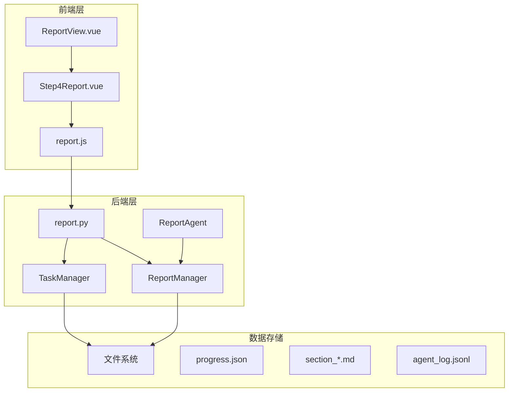
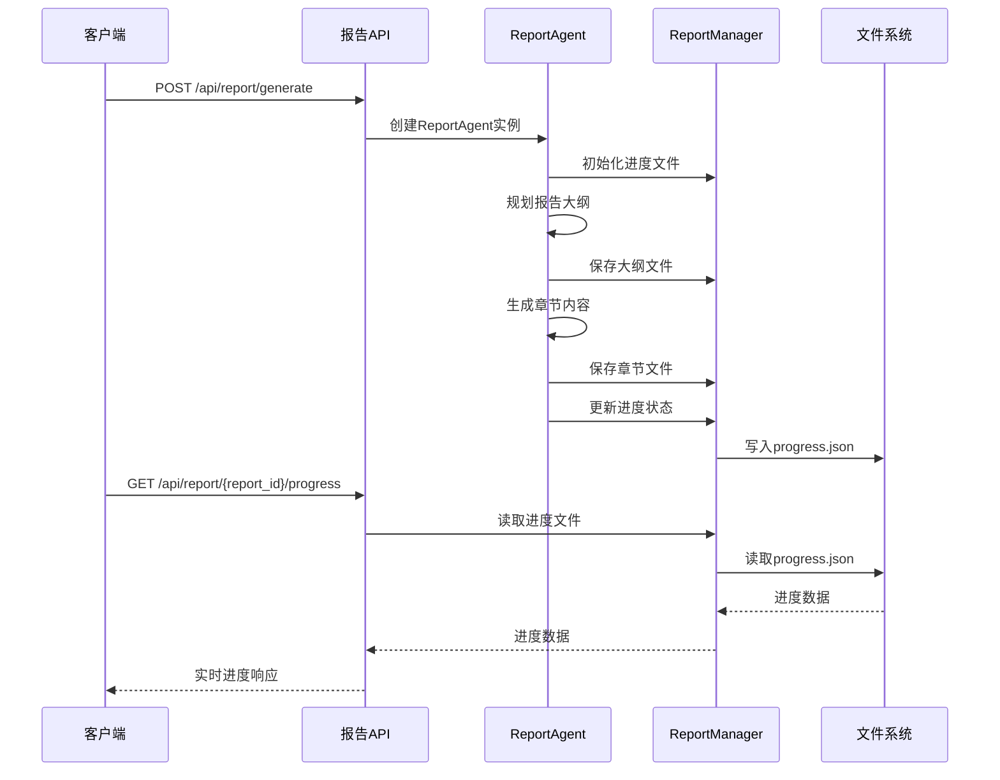
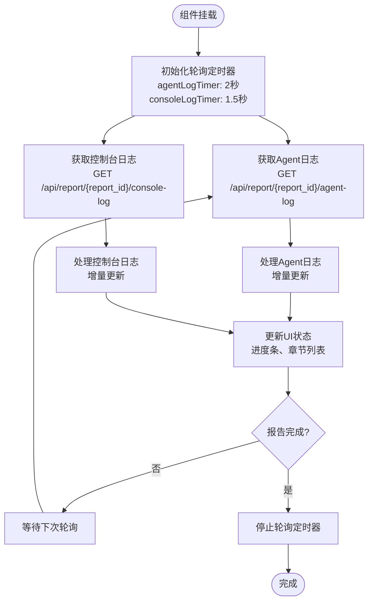
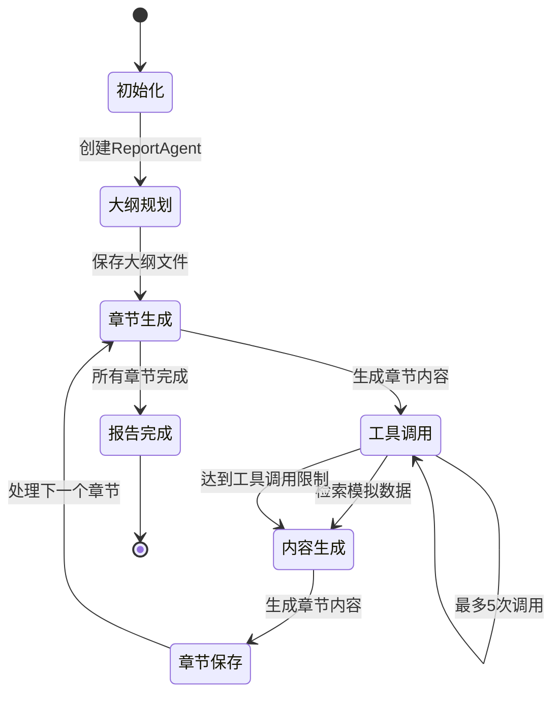
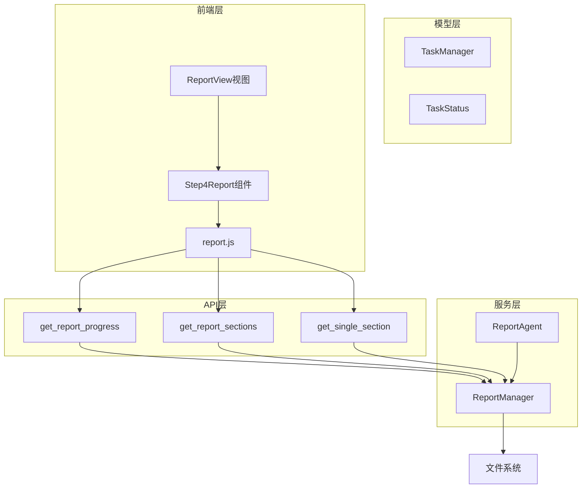

# 报告进度接口

<cite>
**本文档引用的文件**
- [report.py](file://backend/app/api/report.py)
- [report_agent.py](file://backend/app/services/report_agent.py)
- [task.py](file://backend/app/models/task.py)
- [report.js](file://frontend/src/api/report.js)
- [Step4Report.vue](file://frontend/src/components/Step4Report.vue)
- [ReportView.vue](file://frontend/src/views/ReportView.vue)
</cite>

## 目录
1. [简介](#简介)
2. [项目结构](#项目结构)
3. [核心组件](#核心组件)
4. [架构概览](#架构概览)
5. [详细组件分析](#详细组件分析)
6. [依赖关系分析](#依赖关系分析)
7. [性能考虑](#性能考虑)
8. [故障排除指南](#故障排除指南)
9. [结论](#结论)

## 简介

MiroFish项目提供了完整的报告生成和进度监控系统。本文档专注于报告进度接口，包括实时进度查询、分章节输出机制和前端轮询策略。该系统采用异步报告生成架构，支持实时进度跟踪、章节级内容获取和完整的错误处理机制。

## 项目结构

MiroFish项目采用前后端分离架构，后端使用Flask提供RESTful API，前端使用Vue.js构建用户界面。报告进度接口位于后端的API层，通过文件系统存储报告数据和进度信息。



**图表来源**
- [report.py](file://backend/app/api/report.py#L1-L100)
- [report_agent.py](file://backend/app/services/report_agent.py#L1787-L1797)
- [task.py](file://backend/app/models/task.py#L54-L100)

**章节来源**
- [report.py](file://backend/app/api/report.py#L1-L100)
- [report_agent.py](file://backend/app/services/report_agent.py#L1-L50)
- [task.py](file://backend/app/models/task.py#L1-L50)

## 核心组件

### 后端核心组件

#### ReportManager
负责报告数据的持久化和管理，提供进度跟踪、章节管理和日志记录功能。

#### ReportAgent
实现报告生成算法，采用ReACT模式进行章节内容生成，支持工具调用和智能反思。

#### TaskManager
管理长时间运行的任务状态，提供任务创建、更新和查询功能。

### 前端核心组件

#### Step4Report组件
实现报告生成界面，包含进度显示、章节内容展示和实时日志监控。

#### ReportView视图
提供报告生成流程的整体视图，集成图谱展示和报告生成面板。

**章节来源**
- [report_agent.py](file://backend/app/services/report_agent.py#L2047-L2085)
- [task.py](file://backend/app/models/task.py#L54-L100)
- [Step4Report.vue](file://frontend/src/components/Step4Report.vue#L2069-L2077)

## 架构概览

报告进度接口采用分层架构设计，实现了完整的异步报告生成功能：



**图表来源**
- [report.py](file://backend/app/api/report.py#L24-L196)
- [report_agent.py](file://backend/app/services/report_agent.py#L1358-L1590)
- [report_agent.py](file://backend/app/services/report_agent.py#L2047-L2085)

## 详细组件分析

### 进度查询接口

#### GET /api/report/{report_id}/progress

该接口提供实时进度查询功能，返回当前报告生成的详细状态信息。

**请求参数**
- `report_id`: 报告唯一标识符

**响应数据结构**
```json
{
  "success": true,
  "data": {
    "status": "generating",
    "progress": 45,
    "message": "正在生成章节: 关键发现",
    "current_section": "关键发现",
    "completed_sections": ["执行摘要", "模拟背景"],
    "updated_at": "2025-12-09T..."
  }
}
```

**进度状态含义**
- `pending`: 报告初始化阶段
- `planning`: 大纲规划阶段（5%进度）
- `generating`: 章节生成阶段（20-95%进度）
- `completed`: 报告完成阶段（100%进度）
- `failed`: 报告生成失败

**章节来源**
- [report.py](file://backend/app/api/report.py#L564-L602)
- [report_agent.py](file://backend/app/services/report_agent.py#L2047-L2085)

### 分章节输出接口

#### GET /api/report/{report_id}/sections

该接口返回已生成的章节列表，支持前端轮询获取实时章节内容。

**响应数据结构**
```json
{
  "success": true,
  "data": {
    "report_id": "report_xxxx",
    "sections": [
      {
        "filename": "section_01.md",
        "section_index": 1,
        "content": "## 执行摘要\n\n..."
      }
    ],
    "total_sections": 3,
    "is_complete": false
  }
}
```

**章节生成顺序**
1. **执行摘要** - 报告概述和核心发现
2. **模拟背景** - 模拟环境和参数说明
3. **关键发现** - 主要分析结果和趋势
4. **影响分析** - 对相关方的影响评估
5. **建议措施** - 基于分析的行动建议

**章节来源**
- [report.py](file://backend/app/api/report.py#L605-L653)
- [report_agent.py](file://backend/app/services/report_agent.py#L2087-L2115)

#### GET /api/report/{report_id}/section/{section_index}

该接口获取指定索引的章节内容，支持精确的章节访问。

**响应数据结构**
```json
{
  "success": true,
  "data": {
    "filename": "section_01.md",
    "content": "## 执行摘要\n\n..."
  }
}
```

**章节来源**
- [report.py](file://backend/app/api/report.py#L656-L697)
- [report_agent.py](file://backend/app/services/report_agent.py#L1790-L1792)

### 前端轮询机制

前端采用双通道轮询机制，确保实时监控报告生成过程：



**图表来源**
- [Step4Report.vue](file://frontend/src/components/Step4Report.vue#L2069-L2077)
- [report.js](file://frontend/src/api/report.js#L24-L35)

**轮询配置**
- Agent日志轮询间隔：2秒
- 控制台日志轮询间隔：1.5秒
- 增量获取机制：使用`from_line`参数实现增量读取

**章节来源**
- [Step4Report.vue](file://frontend/src/components/Step4Report.vue#L2069-L2077)
- [report.js](file://frontend/src/api/report.js#L24-L35)

### 报告生成流程

报告生成采用ReACT模式，实现智能的章节内容生成：



**图表来源**
- [report_agent.py](file://backend/app/services/report_agent.py#L929-L1356)
- [report_agent.py](file://backend/app/services/report_agent.py#L1456-L1521)

**章节来源**
- [report_agent.py](file://backend/app/services/report_agent.py#L929-L1356)
- [report_agent.py](file://backend/app/services/report_agent.py#L1456-L1521)

## 依赖关系分析

### 组件耦合关系



**图表来源**
- [report.py](file://backend/app/api/report.py#L564-L697)
- [report_agent.py](file://backend/app/services/report_agent.py#L1787-L1797)
- [task.py](file://backend/app/models/task.py#L54-L100)

### 数据流分析

报告进度接口的数据流遵循以下模式：

1. **异步生成**: 报告生成在后台线程中执行
2. **实时更新**: 通过文件系统实时更新进度状态
3. **增量传输**: 前端使用增量获取减少网络负载
4. **状态同步**: 前后端状态通过文件系统保持一致

**章节来源**
- [report.py](file://backend/app/api/report.py#L124-L175)
- [report_agent.py](file://backend/app/services/report_agent.py#L2047-L2085)

## 性能考虑

### 存储优化策略

1. **文件系统存储**: 使用本地文件系统存储报告数据，避免数据库压力
2. **增量日志**: 采用JSONL格式存储结构化日志，支持高效增量读取
3. **章节分离**: 将报告拆分为独立的章节文件，支持并行访问
4. **进度缓存**: 在内存中维护进度状态，减少文件I/O操作

### 网络优化策略

1. **轮询优化**: 前端采用不同的轮询间隔适应不同类型的数据
2. **增量获取**: 使用`from_line`参数实现增量数据传输
3. **压缩传输**: 前端对日志内容进行适当的压缩和格式化
4. **连接复用**: 后端使用长连接池减少连接建立开销

### 并发处理策略

1. **线程安全**: ReportManager使用文件锁确保并发访问安全
2. **异步处理**: 报告生成在独立线程中执行，不影响主线程
3. **资源管理**: 及时释放文件句柄和内存资源
4. **错误隔离**: 单个章节的失败不影响整体报告生成

## 故障排除指南

### 常见错误类型

#### 报告不存在错误
**错误信息**: `"报告不存在或进度信息不可用: {report_id}"`
**解决方案**: 
1. 确认report_id的有效性
2. 检查报告文件夹是否存在
3. 验证文件权限设置

#### 进度文件读取错误
**错误信息**: 进度文件读取失败
**解决方案**:
1. 检查文件系统磁盘空间
2. 验证文件权限设置
3. 确认文件编码格式

#### 章节文件缺失错误
**错误信息**: `"章节不存在: section_{index:02d}.md"`
**解决方案**:
1. 检查报告生成状态
2. 验证章节文件命名格式
3. 确认文件系统同步状态

### 前端轮询问题

#### 轮询频率过高
**表现**: 页面响应缓慢，服务器负载增加
**解决方案**:
1. 调整轮询间隔参数
2. 实施退避策略
3. 添加请求去重机制

#### 增量获取失效
**表现**: 日志重复显示，内存占用增加
**解决方案**:
1. 检查`from_line`参数传递
2. 验证服务器端增量读取逻辑
3. 实施客户端缓存清理

**章节来源**
- [report.py](file://backend/app/api/report.py#L585-L602)
- [report.py](file://backend/app/api/report.py#L673-L697)
- [Step4Report.vue](file://frontend/src/components/Step4Report.vue#L2069-L2077)

## 结论

MiroFish项目的报告进度接口设计体现了现代Web应用的最佳实践。通过异步报告生成、分章节输出和实时轮询机制，系统实现了高效的用户体验和良好的性能表现。

### 设计优势

1. **实时性**: 采用增量日志和轮询机制确保用户获得最新的报告状态
2. **可扩展性**: 文件系统存储方案支持大规模部署和水平扩展
3. **可靠性**: 完善的错误处理和状态管理确保系统稳定性
4. **用户体验**: 分章节输出和进度可视化提升用户满意度

### 技术创新

1. **ReACT模式**: 报告生成采用智能反思机制，提高内容质量
2. **工具集成**: 支持多种检索工具，增强报告的权威性
3. **可视化监控**: 实时日志和进度展示帮助用户理解生成过程
4. **模块化设计**: 清晰的组件分离便于维护和扩展

该接口设计为复杂报告生成场景提供了可靠的解决方案，为类似项目提供了有价值的参考。