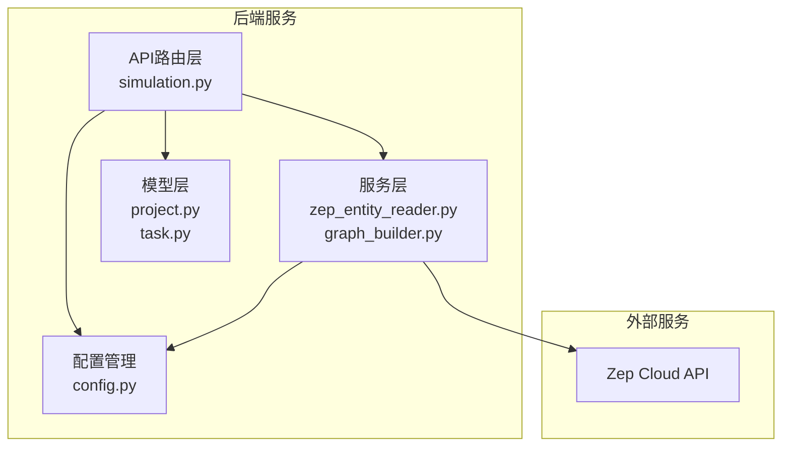
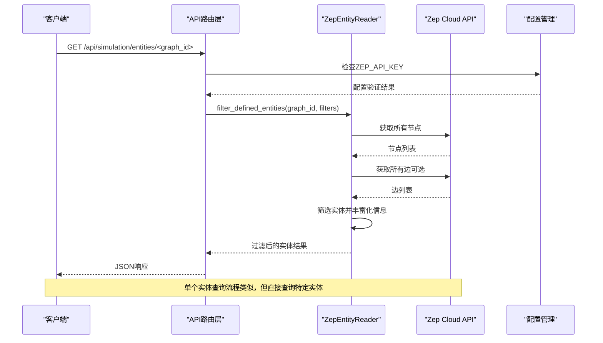
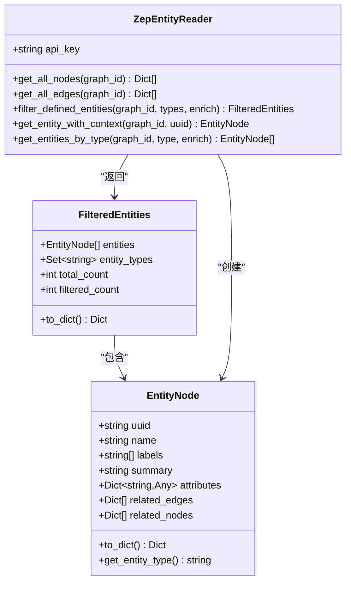
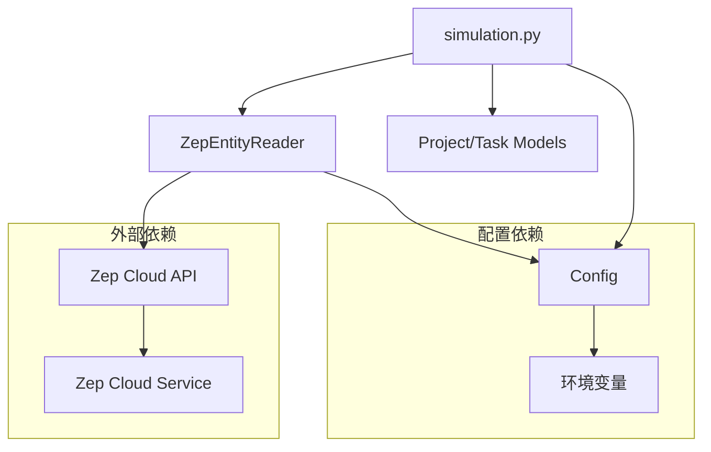

# 实体读取接口

<cite>
**本文档引用的文件**
- [backend/app/api/simulation.py](file://backend/app/api/simulation.py)
- [backend/app/services/zep_entity_reader.py](file://backend/app/services/zep_entity_reader.py)
- [backend/app/services/graph_builder.py](file://backend/app/services/graph_builder.py)
- [backend/app/config.py](file://backend/app/config.py)
- [backend/app/models/project.py](file://backend/app/models/project.py)
- [backend/app/models/task.py](file://backend/app/models/task.py)
- [README.md](file://README.md)
</cite>

## 目录
1. [简介](#简介)
2. [项目结构](#项目结构)
3. [核心组件](#核心组件)
4. [架构概览](#架构概览)
5. [详细组件分析](#详细组件分析)
6. [依赖分析](#依赖分析)
7. [性能考虑](#性能考虑)
8. [故障排查指南](#故障排查指南)
9. [结论](#结论)

## 简介
本文档详细说明了MiroFish项目中与图谱实体查询相关的API接口，包括：
- 获取所有过滤实体接口：/api/simulation/entities/<graph_id>
- 获取单个实体详情接口：/api/simulation/entities/<graph_id>/<entity_uuid>
- 按实体类型查询接口：/api/simulation/entities/<graph_id>/by-type/<entity_type>

这些接口基于Zep图谱服务实现，提供实体过滤、边信息丰富化等功能。文档还解释了查询参数配置、响应格式、错误处理策略，以及与Zep图谱集成的方式。

## 项目结构
MiroFish后端采用Flask框架，API路由集中在`backend/app/api/`目录下，实体读取功能位于`simulation.py`中。核心服务位于`backend/app/services/`目录，包括Zep实体读取服务、图谱构建服务等。



**图表来源**
- [backend/app/api/simulation.py](file://backend/app/api/simulation.py#L47-L159)
- [backend/app/services/zep_entity_reader.py](file://backend/app/services/zep_entity_reader.py#L70-L444)
- [backend/app/services/graph_builder.py](file://backend/app/services/graph_builder.py#L38-L500)
- [backend/app/config.py](file://backend/app/config.py#L20-L76)

**章节来源**
- [backend/app/api/simulation.py](file://backend/app/api/simulation.py#L1-L160)
- [backend/app/services/zep_entity_reader.py](file://backend/app/services/zep_entity_reader.py#L1-L50)
- [backend/app/config.py](file://backend/app/config.py#L1-L76)

## 核心组件
本节介绍与实体读取API相关的核心组件及其职责。

### API路由层
- simulation_bp：专门处理实体读取相关API的蓝图
- 提供三个主要端点：
  - GET /api/simulation/entities/<graph_id>
  - GET /api/simulation/entities/<graph_id>/<entity_uuid>
  - GET /api/simulation/entities/<graph_id>/by-type/<entity_type>

### 实体读取服务
- ZepEntityReader：核心实体读取与过滤服务
- 负责从Zep图谱中读取节点、筛选实体、获取边信息
- 提供重试机制以提高API调用稳定性

### 配置管理
- Config类：集中管理所有配置项
- 包括ZEP_API_KEY、文件上传配置、文本处理配置等

**章节来源**
- [backend/app/api/simulation.py](file://backend/app/api/simulation.py#L47-L159)
- [backend/app/services/zep_entity_reader.py](file://backend/app/services/zep_entity_reader.py#L70-L444)
- [backend/app/config.py](file://backend/app/config.py#L20-L76)

## 架构概览
实体读取API的完整调用流程如下：



**图表来源**
- [backend/app/api/simulation.py](file://backend/app/api/simulation.py#L47-L159)
- [backend/app/services/zep_entity_reader.py](file://backend/app/services/zep_entity_reader.py#L222-L338)
- [backend/app/config.py](file://backend/app/config.py#L35-L37)

## 详细组件分析

### 实体过滤机制
实体过滤是整个系统的核心功能，基于以下规则进行筛选：

#### 过滤规则
1. **标签筛选**：只有包含除"Entity"和"Node"之外标签的节点才被视为有效实体
2. **类型匹配**：可选地按指定的实体类型列表进行进一步过滤
3. **边信息丰富化**：可选择性地获取每个实体的相关边和关联节点信息

#### 数据结构设计


**图表来源**
- [backend/app/services/zep_entity_reader.py](file://backend/app/services/zep_entity_reader.py#L21-L68)
- [backend/app/services/zep_entity_reader.py](file://backend/app/services/zep_entity_reader.py#L70-L444)

**章节来源**
- [backend/app/services/zep_entity_reader.py](file://backend/app/services/zep_entity_reader.py#L222-L338)

### 查询参数配置
所有实体查询接口都支持以下通用查询参数：

#### 通用参数
- **entity_types**：逗号分隔的实体类型列表（可选）
- **enrich**：是否获取相关边信息（默认true）

#### 单独参数
- **/api/simulation/entities/<graph_id>/<entity_uuid>**：无查询参数
- **/api/simulation/entities/<graph_id>/by-type/<entity_type>**：无查询参数

**章节来源**
- [backend/app/api/simulation.py](file://backend/app/api/simulation.py#L54-L67)
- [backend/app/api/simulation.py](file://backend/app/api/simulation.py#L125-L136)

### 响应格式
所有实体查询接口都遵循统一的成功/失败响应格式：

#### 成功响应格式
```json
{
  "success": true,
  "data": {
    // 具体数据内容
  }
}
```

#### 失败响应格式
```json
{
  "success": false,
  "error": "错误描述",
  "traceback": "详细错误信息（可选）"
}
```

#### 具体接口响应
1. **获取所有过滤实体**：
   - 返回：FilteredEntities对象
   - 包含：entities列表、entity_types集合、total_count、filtered_count

2. **获取单个实体详情**：
   - 返回：EntityNode对象的字典表示
   - 包含：uuid、name、labels、summary、attributes、related_edges、related_nodes

3. **按实体类型查询**：
   - 返回：包含entity_type、count、entities的对象
   - entities为EntityNode对象列表

**章节来源**
- [backend/app/services/zep_entity_reader.py](file://backend/app/services/zep_entity_reader.py#L53-L68)
- [backend/app/services/zep_entity_reader.py](file://backend/app/services/zep_entity_reader.py#L340-L418)

### 错误处理策略
系统实现了多层次的错误处理机制：

#### 配置验证
- 在每次API调用前检查ZEP_API_KEY配置
- 如果配置缺失，返回500状态码和错误信息

#### API调用重试
- ZepEntityReader内置指数退避重试机制
- 最多重试3次，每次延迟加倍
- 记录警告和错误日志

#### 业务逻辑错误
- 实体不存在时返回404状态码
- 参数验证失败时返回400状态码
- 其他异常返回500状态码

**章节来源**
- [backend/app/api/simulation.py](file://backend/app/api/simulation.py#L58-L89)
- [backend/app/services/zep_entity_reader.py](file://backend/app/services/zep_entity_reader.py#L87-L125)

## 依赖分析

### 组件耦合关系


**图表来源**
- [backend/app/api/simulation.py](file://backend/app/api/simulation.py#L10-L19)
- [backend/app/services/zep_entity_reader.py](file://backend/app/services/zep_entity_reader.py#L12-L15)
- [backend/app/config.py](file://backend/app/config.py#L9-L17)

### 外部依赖
- **Zep Cloud API**：核心图谱服务提供商
- **Flask**：Web框架
- **Python运行时**：3.11-3.12版本

**章节来源**
- [backend/app/services/zep_entity_reader.py](file://backend/app/services/zep_entity_reader.py#L10-L15)
- [README.md](file://README.md#L95-L123)

## 性能考虑
基于代码分析，以下是性能优化建议：

### 查询优化
1. **批量查询**：ZepEntityReader支持批量获取节点和边，减少API调用次数
2. **条件过滤**：优先使用entity_types参数进行服务器端过滤
3. **边信息按需获取**：enrich参数默认开启，可根据需要关闭以提升性能

### 缓存策略
1. **本地缓存**：对于频繁查询的实体，可在应用层实现缓存
2. **数据库缓存**：利用ProjectManager的持久化能力缓存中间结果

### 并发处理
1. **异步处理**：大型图谱查询可采用异步任务模式
2. **连接池**：合理配置Zep API客户端连接池

### 最佳实践
1. **合理设置chunk_size**：在图谱构建阶段平衡内存使用和查询性能
2. **监控API配额**：关注Zep Cloud的API使用限制
3. **错误重试**：利用内置重试机制提高系统稳定性

## 故障排查指南

### 常见问题诊断
1. **ZEP_API_KEY未配置**
   - 症状：所有实体查询接口返回500错误
   - 解决：检查.env文件中的ZEP_API_KEY配置

2. **实体不存在**
   - 症状：单个实体查询返回404错误
   - 解决：确认graph_id和entity_uuid的正确性

3. **查询超时**
   - 症状：大型图谱查询响应缓慢
   - 解决：使用entity_types参数缩小查询范围，或关闭enrich选项

### 日志分析
系统提供了详细的日志记录：
- 请求处理日志
- API调用日志
- 错误追踪日志

### 调试建议
1. **启用详细日志**：在开发环境中设置DEBUG模式
2. **分步调试**：先测试单个API端点，再组合使用
3. **监控资源使用**：关注内存和CPU使用情况

**章节来源**
- [backend/app/api/simulation.py](file://backend/app/api/simulation.py#L83-L89)
- [backend/app/services/zep_entity_reader.py](file://backend/app/services/zep_entity_reader.py#L115-L124)

## 结论
MiroFish的实体读取API提供了完整的图谱实体查询能力，具有以下特点：

1. **灵活的过滤机制**：支持按实体类型精确过滤
2. **丰富的信息维度**：可选择性获取边信息和关联节点
3. **稳定的API设计**：内置重试机制和完善的错误处理
4. **高性能实现**：支持批量查询和条件过滤

通过合理使用查询参数和遵循最佳实践，用户可以高效地从Zep图谱中获取所需的实体信息，为后续的模拟和分析提供坚实基础。