# 模拟API接口

<cite>
**本文档引用的文件**
- [backend/app/api/simulation.py](file://backend/app/api/simulation.py)
- [backend/app/services/simulation_manager.py](file://backend/app/services/simulation_manager.py)
- [backend/app/services/simulation_runner.py](file://backend/app/services/simulation_runner.py)
- [backend/app/models/project.py](file://backend/app/models/project.py)
- [backend/app/models/task.py](file://backend/app/models/task.py)
- [backend/app/services/zep_entity_reader.py](file://backend/app/services/zep_entity_reader.py)
- [backend/app/services/oasis_profile_generator.py](file://backend/app/services/oasis_profile_generator.py)
- [backend/app/config.py](file://backend/app/config.py)
- [frontend/src/api/simulation.js](file://frontend/src/api/simulation.js)
- [frontend/src/api/report.js](file://frontend/src/api/report.js)
- [frontend/src/api/graph.js](file://frontend/src/api/graph.js)
</cite>

## 目录
1. [简介](#简介)
2. [项目结构](#项目结构)
3. [核心组件](#核心组件)
4. [架构概览](#架构概览)
5. [详细组件分析](#详细组件分析)
6. [依赖关系分析](#依赖关系分析)
7. [性能考虑](#性能考虑)
8. [故障排除指南](#故障排除指南)
9. [结论](#结论)

## 简介

MiroFish是一个基于OASIS模拟平台的双平台社交媒体模拟系统，支持Twitter和Reddit两个平台的并行模拟运行。该系统通过智能LLM生成Agent Profile和模拟配置，实现了从图谱实体到真实社交模拟的完整自动化流程。

系统的核心目标是为用户提供一个完整的模拟生态系统，包括：
- 图谱构建与实体读取
- Agent Profile自动生成
- 模拟配置智能生成
- 双平台并行模拟运行
- 实时状态监控和结果获取
- 报告生成和分析

## 项目结构

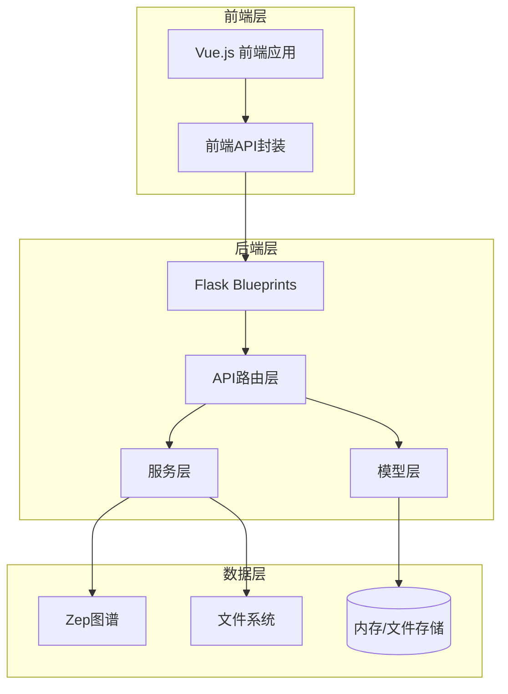

**图表来源**
- [backend/app/api/__init__.py](file://backend/app/api/__init__.py#L1-L15)
- [backend/app/api/simulation.py](file://backend/app/api/simulation.py#L1-L50)

**章节来源**
- [backend/app/api/__init__.py](file://backend/app/api/__init__.py#L1-L15)
- [backend/app/config.py](file://backend/app/config.py#L1-L76)

## 核心组件

### API路由模块

系统采用Flask蓝图架构，将不同功能模块分离为独立的API路由：

- **graph_bp**: 图谱相关API（本体生成、图谱构建、任务管理）
- **simulation_bp**: 模拟相关API（实体读取、模拟创建、状态管理）
- **report_bp**: 报告相关API（报告生成、获取、对话）

### 服务层架构

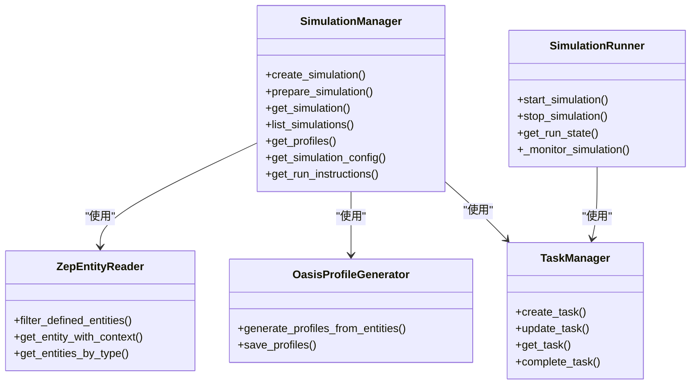

**图表来源**
- [backend/app/services/simulation_manager.py](file://backend/app/services/simulation_manager.py#L114-L529)
- [backend/app/services/simulation_runner.py](file://backend/app/services/simulation_runner.py#L195-L800)
- [backend/app/services/zep_entity_reader.py](file://backend/app/services/zep_entity_reader.py#L70-L200)
- [backend/app/services/oasis_profile_generator.py](file://backend/app/services/oasis_profile_generator.py#L142-L200)

**章节来源**
- [backend/app/services/simulation_manager.py](file://backend/app/services/simulation_manager.py#L1-L529)
- [backend/app/services/simulation_runner.py](file://backend/app/services/simulation_runner.py#L1-L800)

## 架构概览

### 系统架构图

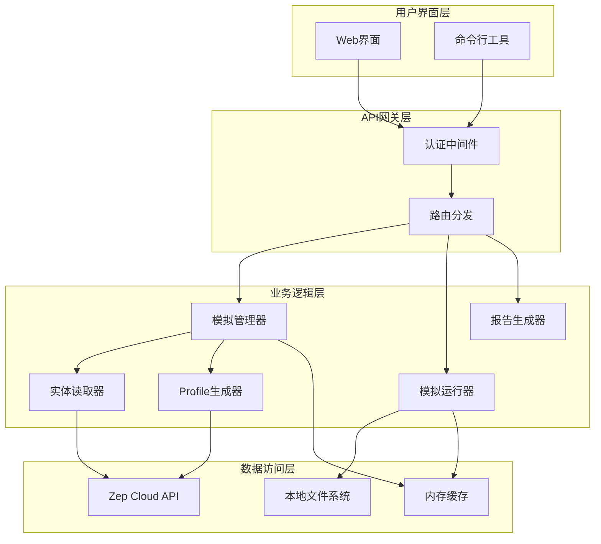

**图表来源**
- [backend/app/api/simulation.py](file://backend/app/api/simulation.py#L1-L800)
- [backend/app/api/report.py](file://backend/app/api/report.py#L1-L800)

### 数据流架构

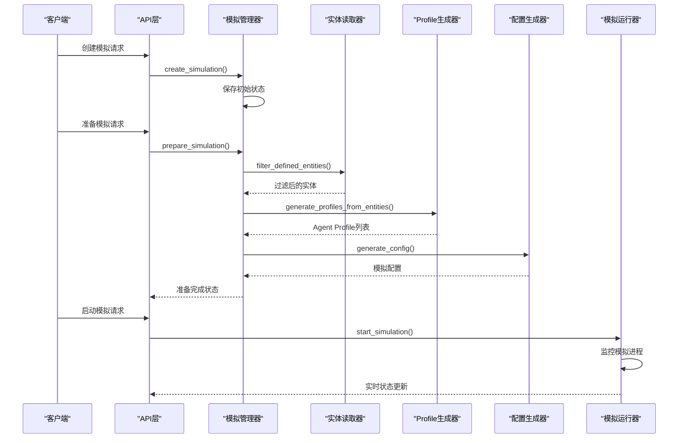

**图表来源**
- [backend/app/api/simulation.py](file://backend/app/api/simulation.py#L164-L237)
- [backend/app/services/simulation_manager.py](file://backend/app/services/simulation_manager.py#L229-L457)
- [backend/app/services/simulation_runner.py](file://backend/app/services/simulation_runner.py#L312-L475)

## 详细组件分析

### 实体读取接口

实体读取接口提供从Zep图谱中获取和过滤实体的功能：

#### 接口规范

**获取所有实体**
- **方法**: GET
- **路径**: `/api/simulation/entities/{graph_id}`
- **查询参数**:
  - `entity_types`: 逗号分隔的实体类型列表（可选）
  - `enrich`: 是否获取相关边信息（默认true）

**获取单个实体详情**
- **方法**: GET
- **路径**: `/api/simulation/entities/{graph_id}/{entity_uuid}`

**按类型获取实体**
- **方法**: GET
- **路径**: `/api/simulation/entities/{graph_id}/by-type/{entity_type}`
- **查询参数**:
  - `enrich`: 是否获取相关边信息（默认true）

#### 数据结构

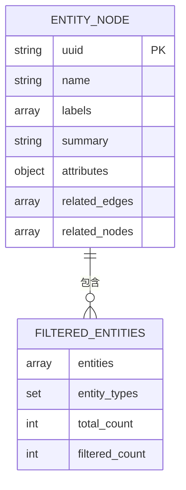

**图表来源**
- [backend/app/services/zep_entity_reader.py](file://backend/app/services/zep_entity_reader.py#L21-L68)

**章节来源**
- [backend/app/api/simulation.py](file://backend/app/api/simulation.py#L47-L160)
- [backend/app/services/zep_entity_reader.py](file://backend/app/services/zep_entity_reader.py#L70-L200)

### 模拟创建接口

模拟创建接口负责初始化模拟状态和基础配置。

#### 接口规范

**创建模拟**
- **方法**: POST
- **路径**: `/api/simulation/create`
- **请求体**:
  ```json
  {
    "project_id": "proj_xxxx",
    "graph_id": "mirofish_xxxx",
    "enable_twitter": true,
    "enable_reddit": true
  }
  ```
- **响应体**:
  ```json
  {
    "success": true,
    "data": {
      "simulation_id": "sim_xxxx",
      "project_id": "proj_xxxx",
      "graph_id": "mirofish_xxxx",
      "status": "created",
      "enable_twitter": true,
      "enable_reddit": true,
      "created_at": "2025-12-01T10:00:00"
    }
  }
  ```

#### 状态管理

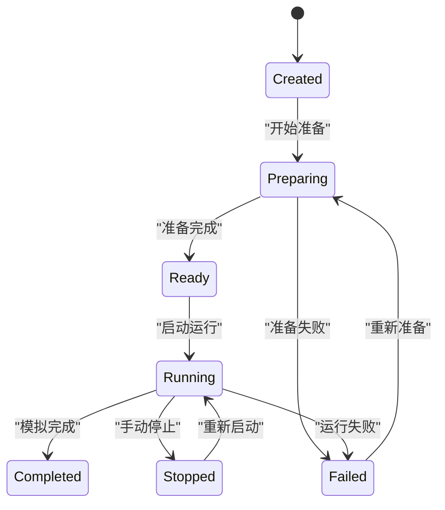

**图表来源**
- [backend/app/services/simulation_manager.py](file://backend/app/services/simulation_manager.py#L24-L34)

**章节来源**
- [backend/app/api/simulation.py](file://backend/app/api/simulation.py#L164-L237)
- [backend/app/services/simulation_manager.py](file://backend/app/services/simulation_manager.py#L193-L228)

### 模拟准备接口

模拟准备接口是系统的核心功能，负责自动化生成Agent Profile和模拟配置。

#### 接口规范

**准备模拟**
- **方法**: POST
- **路径**: `/api/simulation/prepare`
- **请求体**:
  ```json
  {
    "simulation_id": "sim_xxxx",
    "entity_types": ["Student", "PublicFigure"],
    "use_llm_for_profiles": true,
    "parallel_profile_count": 5,
    "force_regenerate": false
  }
  ```

**查询准备进度**
- **方法**: POST
- **路径**: `/api/simulation/prepare/status`
- **请求体**:
  ```json
  {
    "task_id": "task_xxxx",
    "simulation_id": "sim_xxxx"
  }
  ```

#### 准备流程

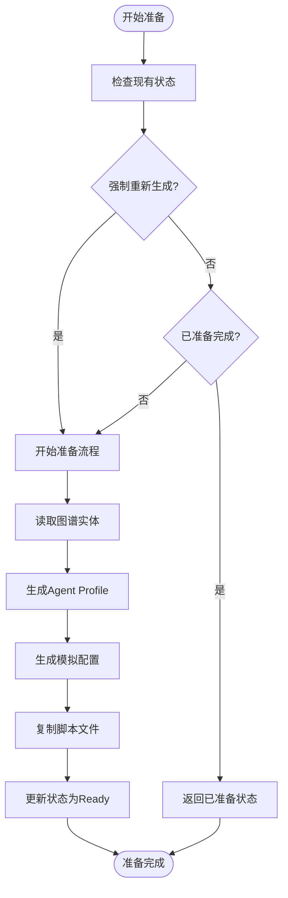

**图表来源**
- [backend/app/api/simulation.py](file://backend/app/api/simulation.py#L358-L635)

**章节来源**
- [backend/app/api/simulation.py](file://backend/app/api/simulation.py#L358-L748)
- [backend/app/services/simulation_manager.py](file://backend/app/services/simulation_manager.py#L229-L457)

### 模拟运行接口

模拟运行接口提供双平台并行模拟运行能力。

#### 接口规范

**启动模拟**
- **方法**: POST
- **路径**: `/api/simulation/start`
- **请求体**:
  ```json
  {
    "simulation_id": "sim_xxxx",
    "platform": "parallel",
    "max_rounds": 100,
    "enable_graph_memory_update": false,
    "graph_id": "zep_graph_xxxx"
  }
  ```

**停止模拟**
- **方法**: POST
- **路径**: `/api/simulation/stop`
- **请求体**:
  ```json
  {
    "simulation_id": "sim_xxxx"
  }
  ```

#### 运行状态监控

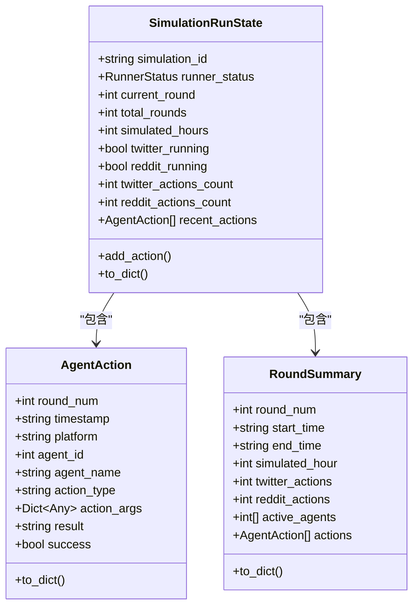

**图表来源**
- [backend/app/services/simulation_runner.py](file://backend/app/services/simulation_runner.py#L47-L193)

**章节来源**
- [backend/app/api/simulation.py](file://backend/app/api/simulation.py#L750-L800)
- [backend/app/services/simulation_runner.py](file://backend/app/services/simulation_runner.py#L195-L800)

### 报告生成接口

报告生成接口提供模拟结果的分析和报告生成功能。

#### 接口规范

**生成报告**
- **方法**: POST
- **路径**: `/api/report/generate`
- **请求体**:
  ```json
  {
    "simulation_id": "sim_xxxx",
    "force_regenerate": false
  }
  ```

**获取报告状态**
- **方法**: POST
- **路径**: `/api/report/generate/status`
- **请求体**:
  ```json
  {
    "task_id": "task_xxxx",
    "simulation_id": "sim_xxxx"
  }
  ```

#### 报告进度监控

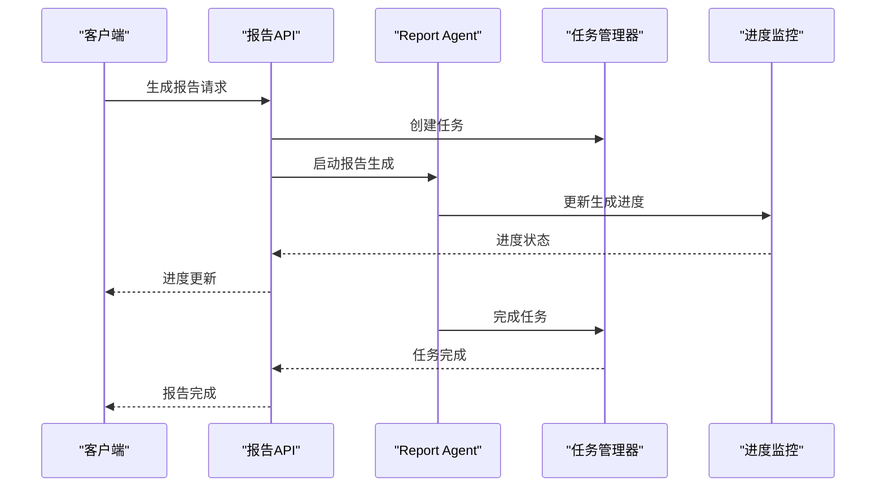

**图表来源**
- [backend/app/api/report.py](file://backend/app/api/report.py#L24-L196)

**章节来源**
- [backend/app/api/report.py](file://backend/app/api/report.py#L1-L800)

## 依赖关系分析

### 外部依赖

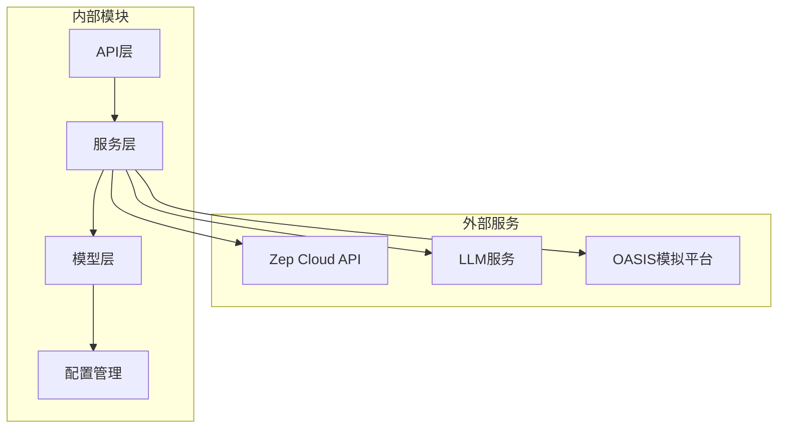

**图表来源**
- [backend/app/config.py](file://backend/app/config.py#L20-L76)

### 内部模块依赖

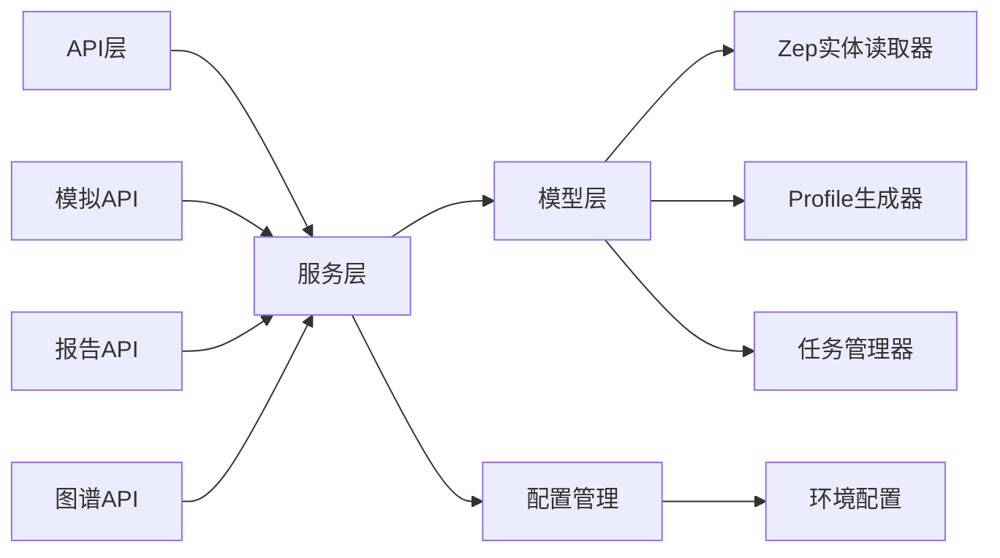

**图表来源**
- [backend/app/api/__init__.py](file://backend/app/api/__init__.py#L1-L15)

**章节来源**
- [backend/app/config.py](file://backend/app/config.py#L1-L76)

## 性能考虑

### 并行处理优化

系统采用多线程和异步处理来提升性能：

1. **并行Profile生成**: 支持配置并行数量，默认5个
2. **异步任务处理**: 使用线程池处理长时间运行的任务
3. **增量日志读取**: 实时监控模拟进程，避免全量读取
4. **内存缓存**: 缓存模拟状态减少磁盘I/O

### 资源管理

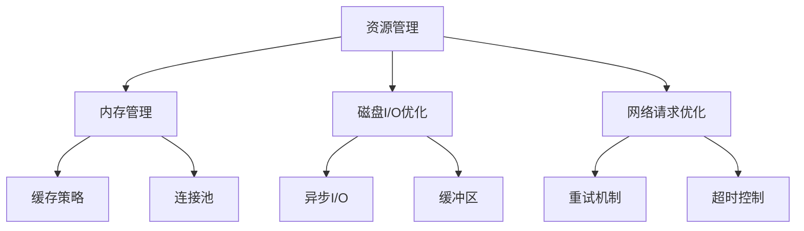

### 性能监控指标

- **响应时间**: API请求平均响应时间
- **并发处理**: 同时处理的任务数量
- **内存使用**: 模拟状态和日志的内存占用
- **磁盘I/O**: Profile文件和日志文件的读写性能

## 故障排除指南

### 常见错误及解决方案

#### 配置错误

**错误**: ZEP_API_KEY未配置
**解决方案**: 检查.env文件中的ZEP_API_KEY配置

**错误**: LLM_API_KEY未配置  
**解决方案**: 配置LLM服务的API密钥和基础URL

#### 任务执行错误

**错误**: 任务超时
**解决方案**: 检查任务队列状态，增加超时时间配置

**错误**: 任务失败
**解决方案**: 查看任务错误日志，检查依赖服务状态

#### 模拟运行错误

**错误**: 模拟无法启动
**解决方案**: 检查模拟配置文件，确认脚本路径正确

**错误**: 进程无法终止
**解决方案**: 使用进程ID手动终止，检查僵尸进程

### 调试工具

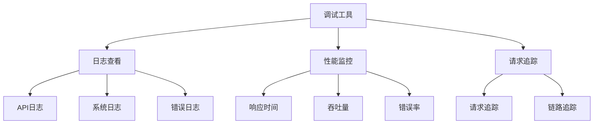

**章节来源**
- [backend/app/config.py](file://backend/app/config.py#L66-L75)

## 结论

MiroFish模拟API系统提供了一个完整的双平台社交媒体模拟解决方案。通过模块化的架构设计和完善的错误处理机制，系统能够稳定地支持从图谱构建到模拟运行的完整流程。

### 系统优势

1. **自动化程度高**: 从实体读取到配置生成完全自动化
2. **扩展性强**: 支持新的平台和功能模块扩展
3. **监控完善**: 提供实时状态监控和日志追踪
4. **容错能力强**: 具备完善的错误处理和恢复机制

### 未来发展方向

1. **性能优化**: 进一步提升大规模模拟的处理能力
2. **功能扩展**: 支持更多社交媒体平台和模拟场景
3. **可视化增强**: 提供更丰富的数据可视化和分析功能
4. **部署优化**: 支持容器化和云原生部署方案

该系统为研究人员和开发者提供了一个强大而灵活的模拟平台，能够满足各种社交媒体行为研究和分析需求。