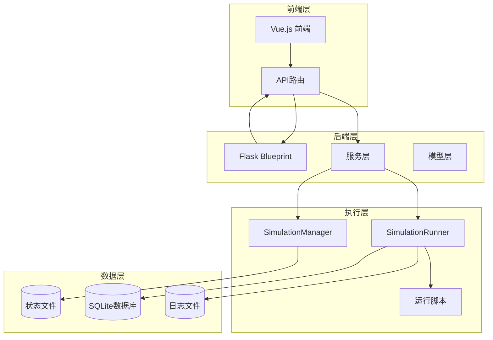
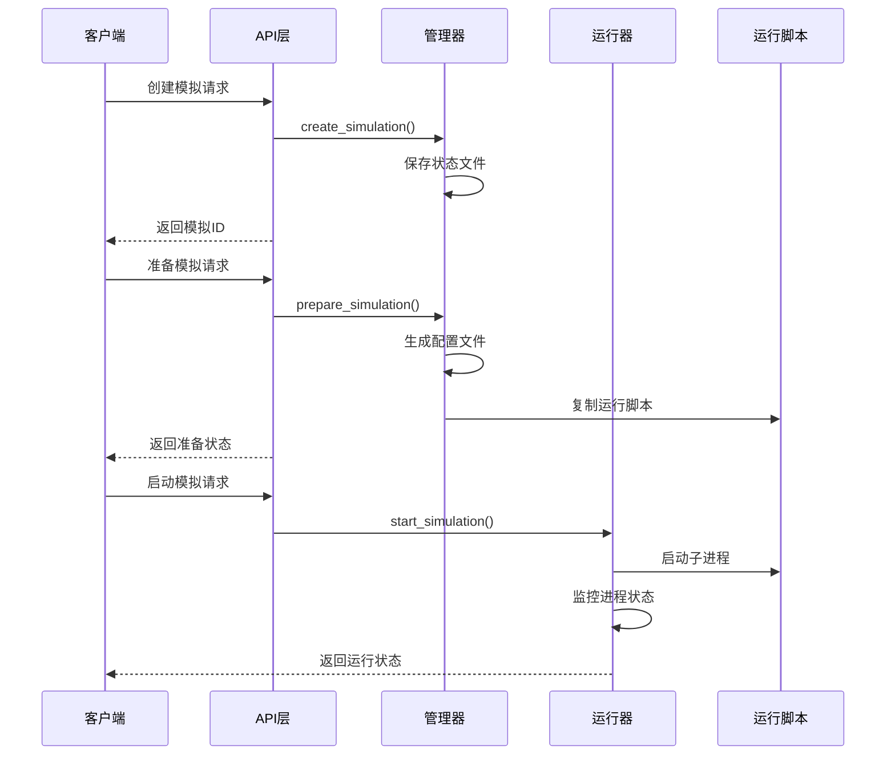
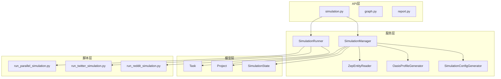

# 模拟控制接口

<cite>
**本文档引用的文件**
- [backend/app/api/simulation.py](file://backend/app/api/simulation.py)
- [backend/app/services/simulation_manager.py](file://backend/app/services/simulation_manager.py)
- [backend/app/services/simulation_runner.py](file://backend/app/services/simulation_runner.py)
- [backend/app/models/task.py](file://backend/app/models/task.py)
- [backend/app/models/project.py](file://backend/app/models/project.py)
- [backend/scripts/run_parallel_simulation.py](file://backend/scripts/run_parallel_simulation.py)
- [frontend/src/api/simulation.js](file://frontend/src/api/simulation.js)
</cite>

## 目录
1. [简介](#简介)
2. [项目结构](#项目结构)
3. [核心组件](#核心组件)
4. [架构概览](#架构概览)
5. [详细组件分析](#详细组件分析)
6. [依赖关系分析](#依赖关系分析)
7. [性能考虑](#性能考虑)
8. [故障排除指南](#故障排除指南)
9. [结论](#结论)

## 简介

MiroFish的模拟控制API接口为双平台（Twitter和Reddit）社交媒体模拟系统提供了完整的HTTP接口支持。该系统基于OASIS模拟框架，支持智能配置生成、并行模拟运行、实时状态监控和动态采访功能。

系统采用分层架构设计，包含API路由层、业务逻辑层、服务层和脚本执行层，实现了从模拟创建到结果导出的全生命周期管理。

## 项目结构



**图表来源**
- [backend/app/api/simulation.py](file://backend/app/api/simulation.py#L1-L50)
- [backend/app/services/simulation_manager.py](file://backend/app/services/simulation_manager.py#L1-L50)
- [backend/app/services/simulation_runner.py](file://backend/app/services/simulation_runner.py#L1-L50)

**章节来源**
- [backend/app/api/__init__.py](file://backend/app/api/__init__.py#L1-L15)
- [backend/app/api/simulation.py](file://backend/app/api/simulation.py#L1-L50)

## 核心组件

### 模拟管理器 (SimulationManager)

负责模拟生命周期管理，包括状态跟踪、配置管理和文件操作。

**主要功能：**
- 模拟状态创建和持久化
- 配置文件生成和管理
- Profile文件处理
- 并发控制和资源管理

### 模拟运行器 (SimulationRunner)

负责实际的模拟执行，包括进程管理、状态监控和数据收集。

**主要功能：**
- 子进程启动和管理
- 实时状态监控
- 动作日志解析
- 数据库查询接口

### 任务管理器 (TaskManager)

提供异步任务状态跟踪，支持长时间运行的操作。

**主要功能：**
- 任务创建和状态跟踪
- 进度回调机制
- 任务结果存储

**章节来源**
- [backend/app/services/simulation_manager.py](file://backend/app/services/simulation_manager.py#L114-L228)
- [backend/app/services/simulation_runner.py](file://backend/app/services/simulation_runner.py#L195-L320)
- [backend/app/models/task.py](file://backend/app/models/task.py#L54-L100)

## 架构概览



**图表来源**
- [backend/app/api/simulation.py](file://backend/app/api/simulation.py#L164-L237)
- [backend/app/services/simulation_manager.py](file://backend/app/services/simulation_manager.py#L229-L457)
- [backend/app/services/simulation_runner.py](file://backend/app/services/simulation_runner.py#L312-L475)

## 详细组件分析

### 模拟创建接口

#### 接口定义
- **URL**: `/api/simulation/create`
- **方法**: POST
- **功能**: 创建新的模拟实例

#### 请求参数
| 参数名 | 类型 | 必填 | 描述 |
|--------|------|------|------|
| project_id | string | 是 | 项目ID |
| graph_id | string | 否 | 图谱ID，未提供时从项目获取 |
| enable_twitter | boolean | 否 | 是否启用Twitter模拟，默认true |
| enable_reddit | boolean | 否 | 是否启用Reddit模拟，默认true |

#### 响应格式
```json
{
  "success": true,
  "data": {
    "simulation_id": "sim_xxxx",
    "project_id": "proj_xxxx",
    "graph_id": "mirofish_xxxx",
    "status": "created",
    "enable_twitter": true,
    "enable_reddit": true,
    "created_at": "2025-12-01T10:00:00"
  }
}
```

**章节来源**
- [backend/app/api/simulation.py](file://backend/app/api/simulation.py#L164-L237)

### 模拟准备接口

#### 接口定义
- **URL**: `/api/simulation/prepare`
- **方法**: POST
- **功能**: 异步准备模拟环境

#### 请求参数
| 参数名 | 类型 | 必填 | 描述 |
|--------|------|------|------|
| simulation_id | string | 是 | 模拟ID |
| entity_types | array | 否 | 指定实体类型列表 |
| use_llm_for_profiles | boolean | 否 | 是否使用LLM生成人设 |
| parallel_profile_count | number | 否 | 并行生成人设数量，默认5 |
| force_regenerate | boolean | 否 | 强制重新生成，默认false |

#### 响应格式
```json
{
  "success": true,
  "data": {
    "simulation_id": "sim_xxxx",
    "task_id": "task_xxxx",
    "status": "preparing",
    "message": "准备任务已启动...",
    "already_prepared": false,
    "expected_entities_count": 68,
    "entity_types": ["Student", "Professor"]
  }
}
```

**章节来源**
- [backend/app/api/simulation.py](file://backend/app/api/simulation.py#L358-L635)

### 准备状态查询接口

#### 接口定义
- **URL**: `/api/simulation/prepare/status`
- **方法**: POST
- **功能**: 查询准备任务进度

#### 请求参数
| 参数名 | 类型 | 必填 | 描述 |
|--------|------|------|------|
| task_id | string | 否 | prepare返回的任务ID |
| simulation_id | string | 否 | 模拟ID（用于检查已完成的准备） |

#### 响应格式
```json
{
  "success": true,
  "data": {
    "task_id": "task_xxxx",
    "status": "processing",
    "progress": 45,
    "message": "...",
    "already_prepared": false
  }
}
```

**章节来源**
- [backend/app/api/simulation.py](file://backend/app/api/simulation.py#L637-L748)

### 模拟运行控制接口

#### 启动模拟接口
- **URL**: `/api/simulation/start`
- **方法**: POST
- **功能**: 开始运行模拟

##### 请求参数
| 参数名 | 类型 | 必填 | 描述 |
|--------|------|------|------|
| simulation_id | string | 是 | 模拟ID |
| platform | string | 否 | 运行平台：twitter/reddit/parallel，默认parallel |
| max_rounds | number | 否 | 最大模拟轮数，用于截断过长模拟 |
| enable_graph_memory_update | boolean | 否 | 是否将Agent活动动态更新到Zep图谱 |
| force | boolean | 否 | 强制重新开始 |

#### 停止模拟接口
- **URL**: `/api/simulation/stop`
- **方法**: POST
- **功能**: 停止模拟运行

##### 请求参数
| 参数名 | 类型 | 必填 | 描述 |
|--------|------|------|------|
| simulation_id | string | 是 | 模拟ID |

**章节来源**
- [backend/app/api/simulation.py](file://backend/app/api/simulation.py#L1446-L1696)

### 实时状态监控接口

#### 运行状态查询接口
- **URL**: `/api/simulation/{simulation_id}/run-status`
- **方法**: GET
- **功能**: 获取模拟运行实时状态

#### 详细状态查询接口
- **URL**: `/api/simulation/{simulation_id}/run-status/detail`
- **方法**: GET
- **功能**: 获取模拟运行详细状态（包含所有动作）

#### 动作历史查询接口
- **URL**: `/api/simulation/{simulation_id}/actions`
- **方法**: GET
- **功能**: 获取模拟中的Agent动作历史

**章节来源**
- [backend/app/api/simulation.py](file://backend/app/api/simulation.py#L1700-L1910)

### 数据查询和导出接口

#### 帖子查询接口
- **URL**: `/api/simulation/{simulation_id}/posts`
- **方法**: GET
- **功能**: 获取模拟中的帖子

#### 评论查询接口
- **URL**: `/api/simulation/{simulation_id}/comments`
- **方法**: GET
- **功能**: 获取模拟中的评论

#### 配置查询接口
- **URL**: `/api/simulation/{simulation_id}/config`
- **方法**: GET
- **功能**: 获取模拟配置

#### 配置下载接口
- **URL**: `/api/simulation/{simulation_id}/config/download`
- **方法**: GET
- **功能**: 下载模拟配置文件

**章节来源**
- [backend/app/api/simulation.py](file://backend/app/api/simulation.py#L1982-L1316)

### Interview采访接口

#### 单个Agent采访接口
- **URL**: `/api/simulation/interview`
- **方法**: POST
- **功能**: 采访单个Agent

#### 批量采访接口
- **URL**: `/api/simulation/interview/batch`
- **方法**: POST
- **功能**: 批量采访多个Agent

#### 全局采访接口
- **URL**: `/api/simulation/interview/all`
- **方法**: POST
- **功能**: 使用相同问题采访所有Agent

**章节来源**
- [backend/app/api/simulation.py](file://backend/app/api/simulation.py#L2137-L2504)

## 依赖关系分析



**图表来源**
- [backend/app/api/simulation.py](file://backend/app/api/simulation.py#L1-L50)
- [backend/app/services/simulation_manager.py](file://backend/app/services/simulation_manager.py#L1-L50)
- [backend/app/services/simulation_runner.py](file://backend/app/services/simulation_runner.py#L1-L50)

**章节来源**
- [backend/app/models/task.py](file://backend/app/models/task.py#L1-L185)
- [backend/app/models/project.py](file://backend/app/models/project.py#L101-L200)

## 性能考虑

### 并发运行策略

系统支持双平台并行模拟运行，采用以下策略：

1. **进程隔离**: 每个平台运行在独立的子进程中
2. **资源分配**: 
   - Twitter平台: 专用进程池
   - Reddit平台: 专用进程池
3. **内存管理**: 实时状态缓存，定期持久化到文件

### 性能优化措施

1. **异步处理**: 配置生成和准备任务采用异步执行
2. **增量更新**: Profile和配置文件支持实时增量更新
3. **缓存机制**: 运行状态在内存中缓存，减少文件I/O
4. **流式处理**: 动作日志采用流式读取，避免内存溢出

### 资源监控

系统提供多维度的资源使用监控：
- CPU使用率
- 内存占用
- 磁盘I/O
- 网络连接数

## 故障排除指南

### 常见错误类型

#### 配置错误
- **错误**: ZEP_API_KEY未配置
- **解决方案**: 在环境变量中设置正确的API密钥

#### 文件缺失
- **错误**: 必要文件不存在
- **解决方案**: 检查模拟目录结构，重新执行准备步骤

#### 进程异常
- **错误**: 子进程无法启动
- **解决方案**: 检查Python环境和依赖包安装情况

### 异常恢复机制

1. **自动重启**: 运行器检测到进程异常退出时自动重启
2. **状态同步**: 运行状态与文件状态保持同步
3. **日志追踪**: 完整的日志记录便于问题诊断

### 调试工具

系统提供以下调试接口：
- 环境状态查询
- Interview历史记录
- 运行时详细状态
- 错误日志导出

**章节来源**
- [backend/app/services/simulation_runner.py](file://backend/app/services/simulation_runner.py#L1098-L1281)

## 结论

MiroFish的模拟控制API接口提供了一个完整、可靠的双平台社交媒体模拟系统。通过清晰的分层架构、完善的错误处理机制和丰富的监控功能，系统能够支持复杂的社会媒体模拟场景。

关键优势包括：
- **灵活的配置管理**: 支持动态参数调整和智能配置生成
- **强大的并发控制**: 双平台并行运行，资源合理分配
- **全面的监控能力**: 实时状态监控和性能调优支持
- **完善的错误处理**: 自动恢复和异常处理机制

该系统为研究人员和开发者提供了一个强大而易用的社交媒体模拟平台，支持从简单测试到复杂研究的各种应用场景。