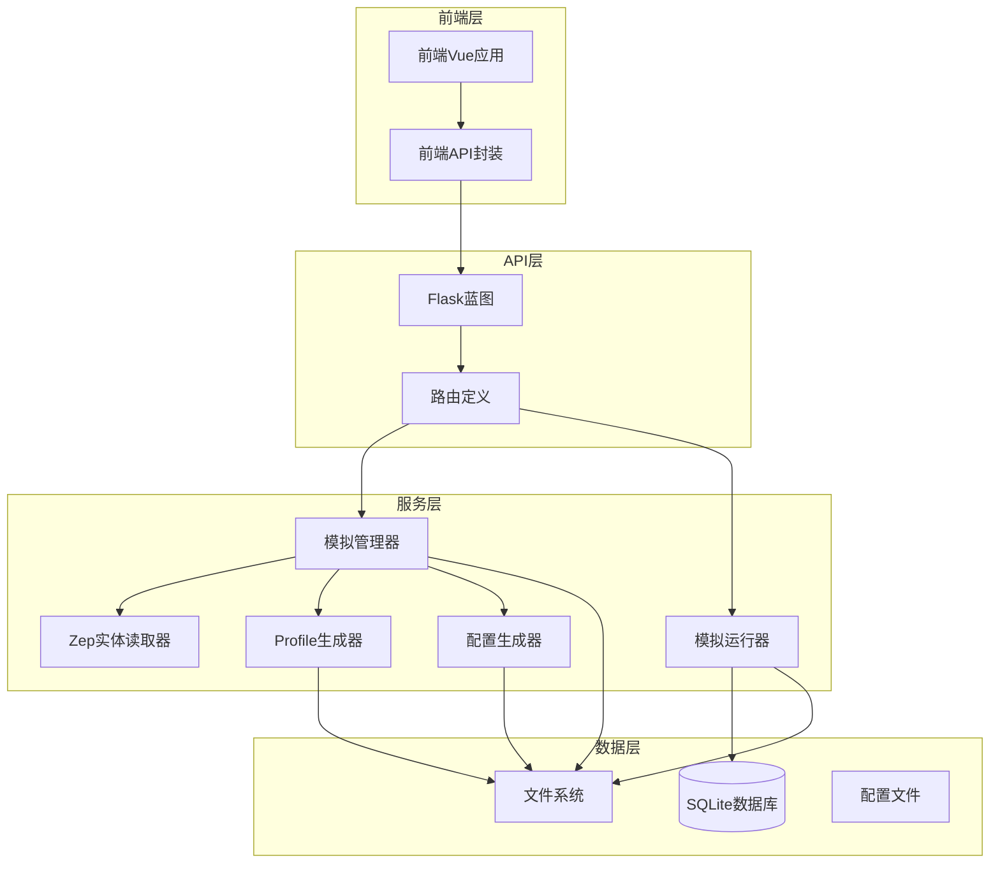
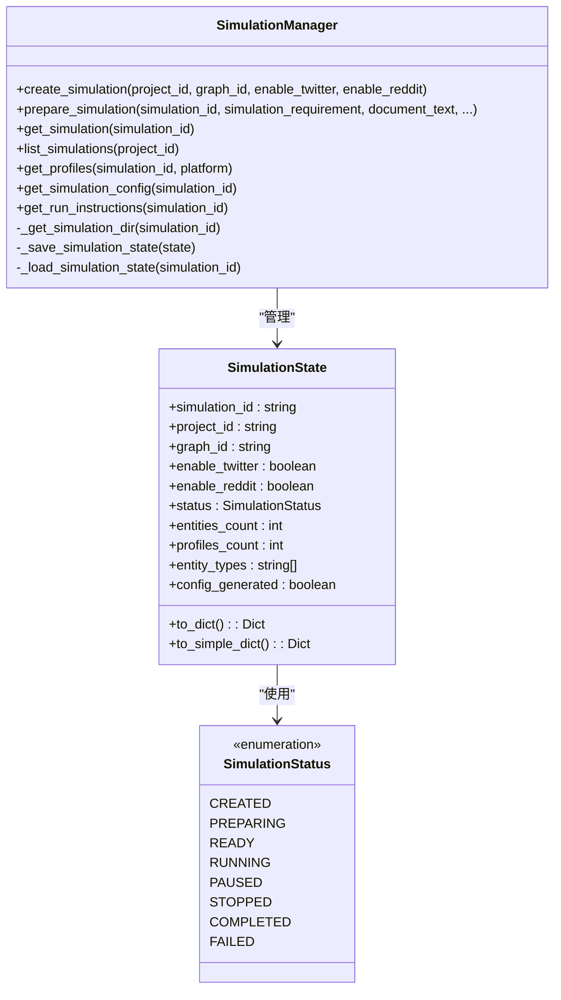
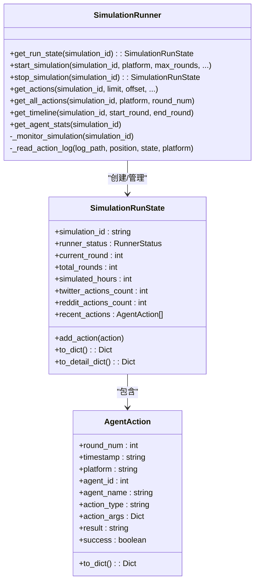
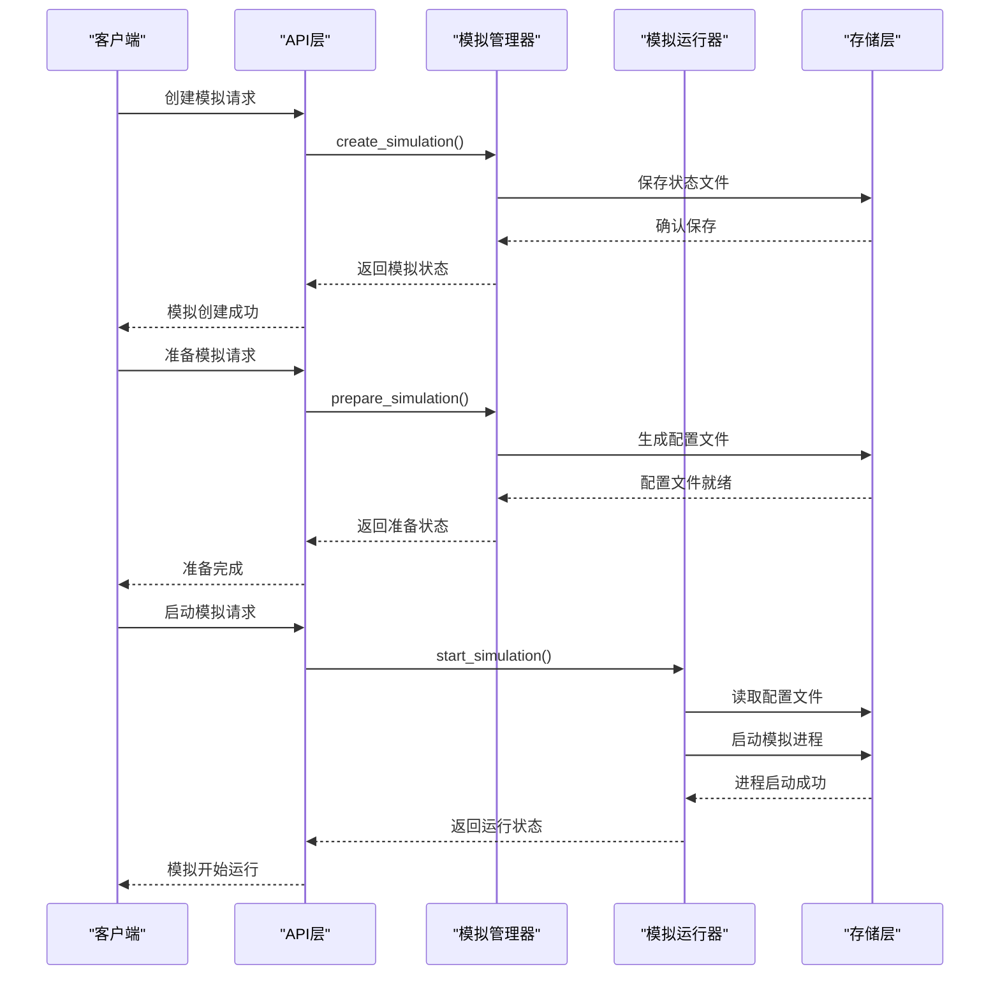
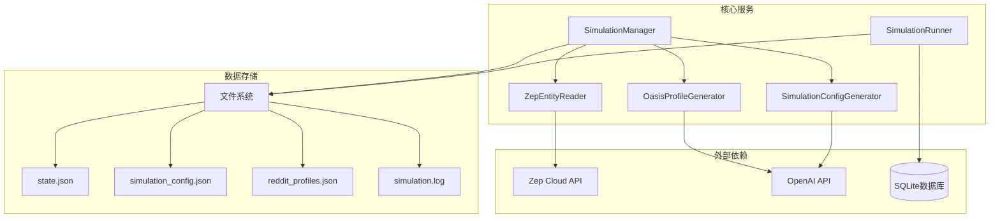
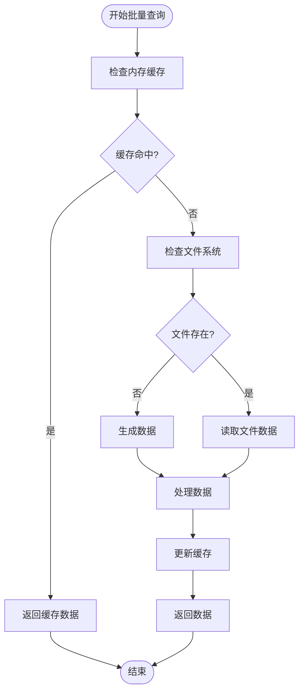

# 模拟数据接口

<cite>
**本文档引用的文件**
- [backend/app/api/simulation.py](file://backend/app/api/simulation.py)
- [backend/app/services/simulation_manager.py](file://backend/app/services/simulation_manager.py)
- [backend/app/services/simulation_runner.py](file://backend/app/services/simulation_runner.py)
- [backend/app/services/simulation_config_generator.py](file://backend/app/services/simulation_config_generator.py)
- [backend/app/services/zep_entity_reader.py](file://backend/app/services/zep_entity_reader.py)
- [backend/app/models/project.py](file://backend/app/models/project.py)
- [frontend/src/api/simulation.js](file://frontend/src/api/simulation.js)
</cite>

## 目录
1. [简介](#简介)
2. [项目结构](#项目结构)
3. [核心组件](#核心组件)
4. [架构概览](#架构概览)
5. [详细组件分析](#详细组件分析)
6. [依赖关系分析](#依赖关系分析)
7. [性能考虑](#性能考虑)
8. [故障排除指南](#故障排除指南)
9. [结论](#结论)

## 简介

MiroFish的模拟数据API接口为用户提供了一套完整的社交媒体模拟数据查询解决方案。该系统基于OASIS模拟平台，能够从知识图谱中提取实体并生成逼真的社交媒体用户档案，支持Twitter和Reddit双平台并行模拟。

系统的核心功能包括：
- 模拟配置获取和下载
- 模拟脚本下载
- 模拟帖子查询
- 模拟动作查询
- 实时状态监控
- 数据库查询接口

## 项目结构

后端采用Flask框架构建，主要分为以下几个层次：



**图表来源**
- [backend/app/api/simulation.py](file://backend/app/api/simulation.py#L1-L50)
- [backend/app/services/simulation_manager.py](file://backend/app/services/simulation_manager.py#L1-L50)

**章节来源**
- [backend/app/api/simulation.py](file://backend/app/api/simulation.py#L1-L100)
- [backend/app/services/simulation_manager.py](file://backend/app/services/simulation_manager.py#L1-L100)

## 核心组件

### 模拟管理器 (SimulationManager)

模拟管理器是整个系统的核心协调者，负责管理模拟的生命周期和状态。



**图表来源**
- [backend/app/services/simulation_manager.py](file://backend/app/services/simulation_manager.py#L42-L112)
- [backend/app/services/simulation_manager.py](file://backend/app/services/simulation_manager.py#L24-L34)

### 模拟运行器 (SimulationRunner)

模拟运行器负责实际执行模拟过程，监控运行状态并收集动作数据。



**图表来源**
- [backend/app/services/simulation_runner.py](file://backend/app/services/simulation_runner.py#L100-L193)
- [backend/app/services/simulation_runner.py](file://backend/app/services/simulation_runner.py#L47-L72)

**章节来源**
- [backend/app/services/simulation_manager.py](file://backend/app/services/simulation_manager.py#L114-L228)
- [backend/app/services/simulation_runner.py](file://backend/app/services/simulation_runner.py#L195-L310)

## 架构概览

系统采用分层架构设计，实现了清晰的关注点分离：



**图表来源**
- [backend/app/api/simulation.py](file://backend/app/api/simulation.py#L164-L237)
- [backend/app/services/simulation_manager.py](file://backend/app/services/simulation_manager.py#L193-L260)
- [backend/app/services/simulation_runner.py](file://backend/app/services/simulation_runner.py#L312-L375)

## 详细组件分析

### 模拟配置获取接口

#### 接口定义
- **URL**: `/api/simulation/{simulation_id}/config`
- **方法**: GET
- **功能**: 获取完整的模拟配置信息

#### 请求参数
- `simulation_id`: 模拟实例ID（路径参数）

#### 响应格式
```json
{
  "success": true,
  "data": {
    "simulation_id": "sim_xxxx",
    "project_id": "proj_xxxx",
    "graph_id": "mirofish_xxxx",
    "simulation_requirement": "模拟需求描述",
    "time_config": {
      "total_simulation_hours": 72,
      "minutes_per_round": 60,
      "agents_per_hour_min": 5,
      "agents_per_hour_max": 20,
      "peak_hours": [19, 20, 21, 22],
      "off_peak_hours": [0, 1, 2, 3, 4, 5]
    },
    "agent_configs": [
      {
        "agent_id": 0,
        "entity_uuid": "uuid_xxxx",
        "entity_name": "实体名称",
        "entity_type": "Student",
        "activity_level": 0.5,
        "posts_per_hour": 1.0,
        "comments_per_hour": 2.0,
        "active_hours": [8, 9, ..., 22],
        "response_delay_min": 5,
        "response_delay_max": 60,
        "sentiment_bias": 0.0,
        "stance": "neutral",
        "influence_weight": 1.0
      }
    ],
    "event_config": {
      "initial_posts": [],
      "scheduled_events": [],
      "hot_topics": [],
      "narrative_direction": ""
    },
    "twitter_config": {
      "platform": "twitter",
      "recency_weight": 0.4,
      "popularity_weight": 0.3,
      "relevance_weight": 0.3,
      "viral_threshold": 10,
      "echo_chamber_strength": 0.5
    },
    "reddit_config": {
      "platform": "reddit",
      "recency_weight": 0.3,
      "popularity_weight": 0.4,
      "relevance_weight": 0.3,
      "viral_threshold": 15,
      "echo_chamber_strength": 0.6
    },
    "llm_model": "gpt-4",
    "llm_base_url": "https://api.openai.com",
    "generated_at": "2025-12-01T10:00:00",
    "generation_reasoning": "LLM推理说明"
  }
}
```

#### 实现细节
配置生成过程采用分步策略：
1. **时间配置生成**: 基于用户需求和实体数量生成模拟时间轴
2. **事件配置生成**: 提取热点话题和初始帖子内容
3. **Agent配置生成**: 分批生成每个Agent的详细活动配置
4. **平台配置生成**: 为Twitter和Reddit设置不同的算法权重

**章节来源**
- [backend/app/api/simulation.py](file://backend/app/api/simulation.py#L1253-L1287)
- [backend/app/services/simulation_config_generator.py](file://backend/app/services/simulation_config_generator.py#L242-L379)

### 模拟配置下载接口

#### 接口定义
- **URL**: `/api/simulation/{simulation_id}/config/download`
- **方法**: GET
- **功能**: 下载模拟配置文件

#### 实现机制
该接口直接从文件系统读取配置文件并返回给客户端：
1. 验证模拟实例是否存在
2. 检查配置文件是否生成完成
3. 使用Flask的send_file函数返回文件流
4. 设置适当的下载头信息

**章节来源**
- [backend/app/api/simulation.py](file://backend/app/api/simulation.py#L1289-L1316)

### 模拟脚本下载接口

#### 接口定义
- **URL**: `/api/simulation/script/{script_name}/download`
- **方法**: GET
- **功能**: 下载模拟运行脚本

#### 支持的脚本类型
- `run_twitter_simulation.py`: Twitter平台模拟脚本
- `run_reddit_simulation.py`: Reddit平台模拟脚本  
- `run_parallel_simulation.py`: 双平台并行模拟脚本
- `action_logger.py`: 动作日志记录脚本

#### 实现机制
脚本文件位于`backend/scripts/`目录，接口通过文件系统直接读取并返回。

**章节来源**
- [backend/app/api/simulation.py](file://backend/app/api/simulation.py#L1318-L1368)

### 模拟帖子查询接口

#### 接口定义
- **URL**: `/api/simulation/{simulation_id}/posts`
- **方法**: GET
- **功能**: 查询模拟生成的帖子数据

#### 查询参数
- `platform`: 平台类型（twitter/reddit，默认reddit）
- `limit`: 返回数量（默认50）
- `offset`: 偏移量（默认0）

#### 数据存储机制
帖子数据存储在SQLite数据库中，文件命名规则：
- `{platform}_simulation.db`: 数据库文件
- 表结构：`post` 表存储帖子信息

#### 查询优化
1. **分页查询**: 支持limit和offset参数实现分页
2. **索引优化**: 按创建时间排序，支持高效分页
3. **连接池**: 使用SQLite连接池提高并发性能

**章节来源**
- [backend/app/api/simulation.py](file://backend/app/api/simulation.py#L1982-L2058)

### 模拟动作查询接口

#### 接口定义
- **URL**: `/api/simulation/{simulation_id}/actions`
- **方法**: GET
- **功能**: 查询Agent的动作历史

#### 查询参数
- `limit`: 返回数量（默认100）
- `offset`: 偏移量（默认0）
- `platform`: 过滤平台（twitter/reddit）
- `agent_id`: 过滤Agent ID
- `round_num`: 过滤轮次

#### 数据结构
动作数据采用统一的数据结构：
```json
{
  "round_num": 5,
  "timestamp": "2025-12-01T10:30:00",
  "platform": "twitter",
  "agent_id": 3,
  "agent_name": "Agent Name",
  "action_type": "CREATE_POST",
  "action_args": {"content": "..."},
  "result": null,
  "success": true
}
```

#### 实时性保证
1. **内存缓存**: 运行状态存储在内存中，提供快速访问
2. **文件监控**: 实时监控日志文件变化
3. **增量更新**: 只读取新增的动作数据

**章节来源**
- [backend/app/api/simulation.py](file://backend/app/api/simulation.py#L1859-L1911)
- [backend/app/services/simulation_runner.py](file://backend/app/services/simulation_runner.py#L578-L687)

## 依赖关系分析

系统采用模块化设计，各组件之间的依赖关系如下：



**图表来源**
- [backend/app/services/simulation_manager.py](file://backend/app/services/simulation_manager.py#L1-L50)
- [backend/app/services/simulation_runner.py](file://backend/app/services/simulation_runner.py#L1-L30)

### 数据完整性保证

系统通过多种机制确保数据完整性：

1. **文件系统层面**
   - 状态文件原子性写入
   - 配置文件备份机制
   - 文件权限控制

2. **数据库层面**
   - 事务性操作
   - 连接池管理
   - 查询结果验证

3. **内存层面**
   - 状态缓存一致性
   - 并发访问控制
   - 内存泄漏防护

**章节来源**
- [backend/app/services/simulation_manager.py](file://backend/app/services/simulation_manager.py#L144-L155)
- [backend/app/services/simulation_runner.py](file://backend/app/services/simulation_runner.py#L298-L310)

## 性能考虑

### 查询优化策略

1. **分页查询优化**
   ```sql
   SELECT * FROM post 
   ORDER BY created_at DESC 
   LIMIT ? OFFSET ?
   ```

2. **索引策略**
   - 按时间戳建立索引
   - 按Agent ID建立索引
   - 按轮次建立复合索引

3. **缓存策略**
   - 内存缓存运行状态
   - 文件系统缓存配置数据
   - 前端缓存查询结果

### 批量获取机制

系统支持高效的批量数据获取：



**图表来源**
- [backend/app/services/simulation_runner.py](file://backend/app/services/simulation_runner.py#L298-L310)

## 故障排除指南

### 常见问题及解决方案

1. **模拟配置文件缺失**
   - **症状**: 返回404错误
   - **原因**: 配置文件尚未生成
   - **解决**: 先调用`/prepare`接口生成配置

2. **数据库连接失败**
   - **症状**: 查询帖子时报错
   - **原因**: 模拟尚未运行或数据库文件不存在
   - **解决**: 确保模拟已启动并运行一段时间

3. **API密钥配置错误**
   - **症状**: LLM调用失败
   - **原因**: OpenAI API密钥未正确配置
   - **解决**: 检查环境变量配置

4. **文件权限问题**
   - **症状**: 无法读取或写入文件
   - **原因**: 文件系统权限不足
   - **解决**: 检查文件夹权限设置

**章节来源**
- [backend/app/api/simulation.py](file://backend/app/api/simulation.py#L1270-L1274)
- [backend/app/api/simulation.py](file://backend/app/api/simulation.py#L2007-L2016)

## 结论

MiroFish的模拟数据API接口提供了一套完整、高效、可靠的社交媒体模拟数据查询解决方案。系统通过模块化设计、分层架构和多种优化策略，实现了高性能的数据查询和实时状态监控。

主要优势包括：
- **完整的功能覆盖**: 从配置生成到数据查询的全流程支持
- **高性能设计**: 采用缓存、分页、索引等多种优化技术
- **高可靠性**: 多重错误处理和数据完整性保证机制
- **易于扩展**: 模块化设计便于功能扩展和维护

未来可以考虑的改进方向：
- 增加更多的查询过滤选项
- 实现更精细的权限控制
- 添加数据导出功能
- 优化大规模数据的查询性能