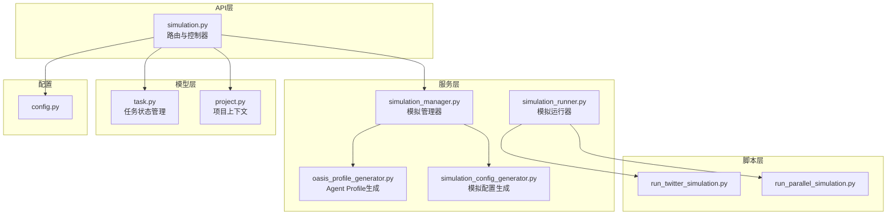
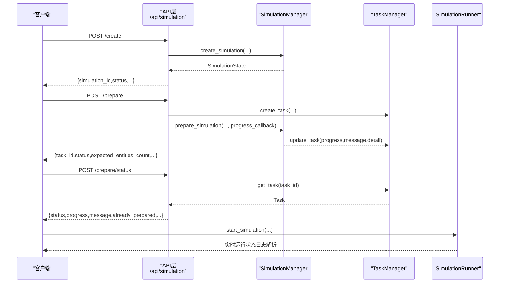
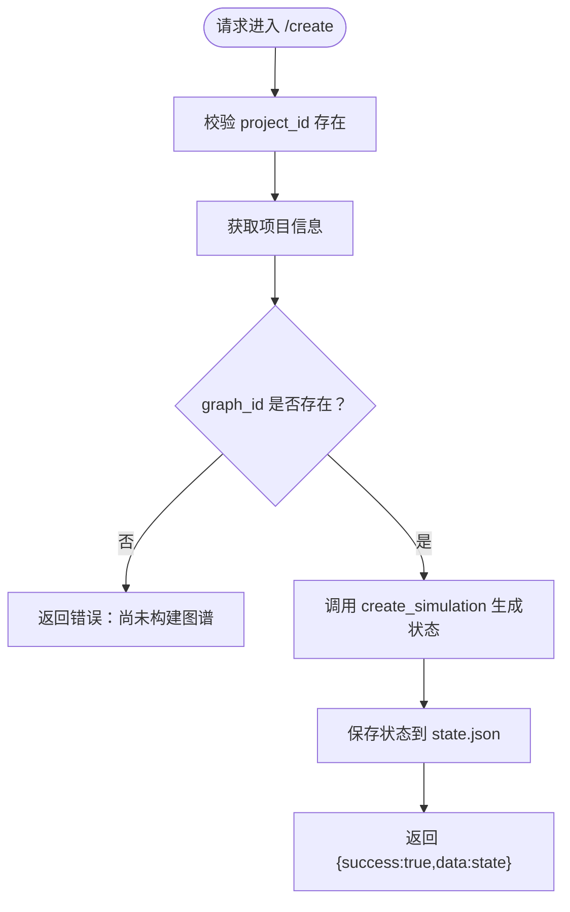
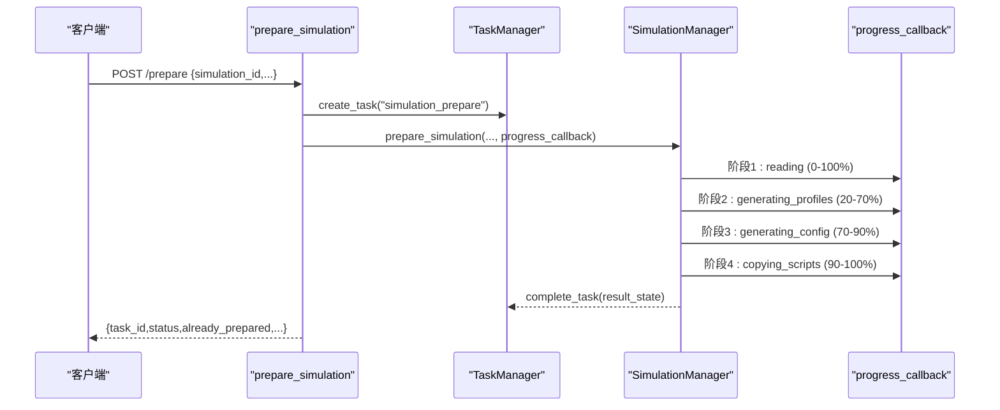
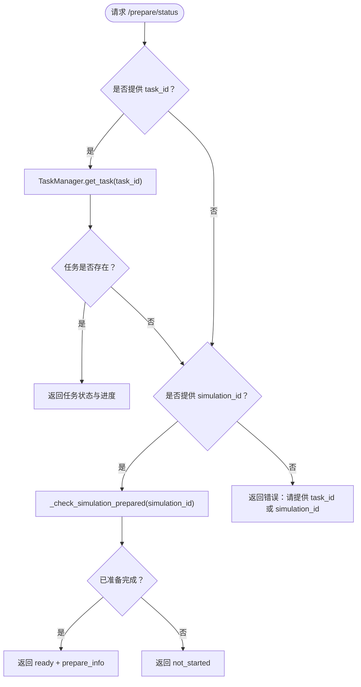
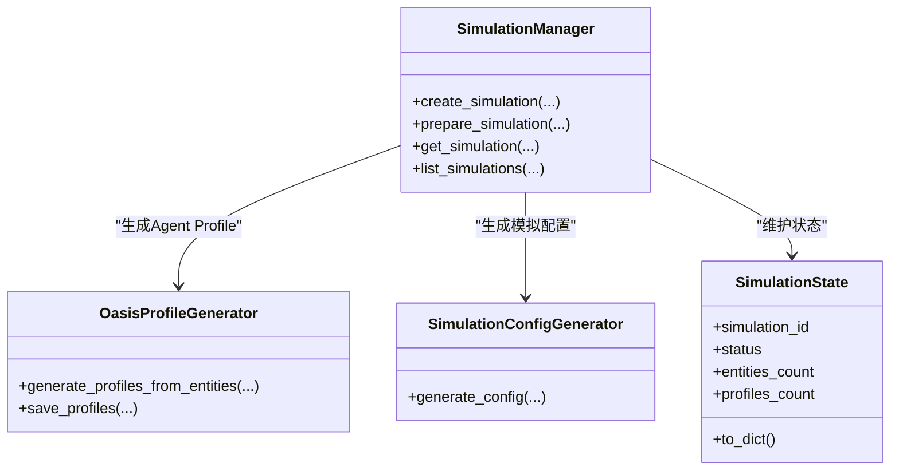
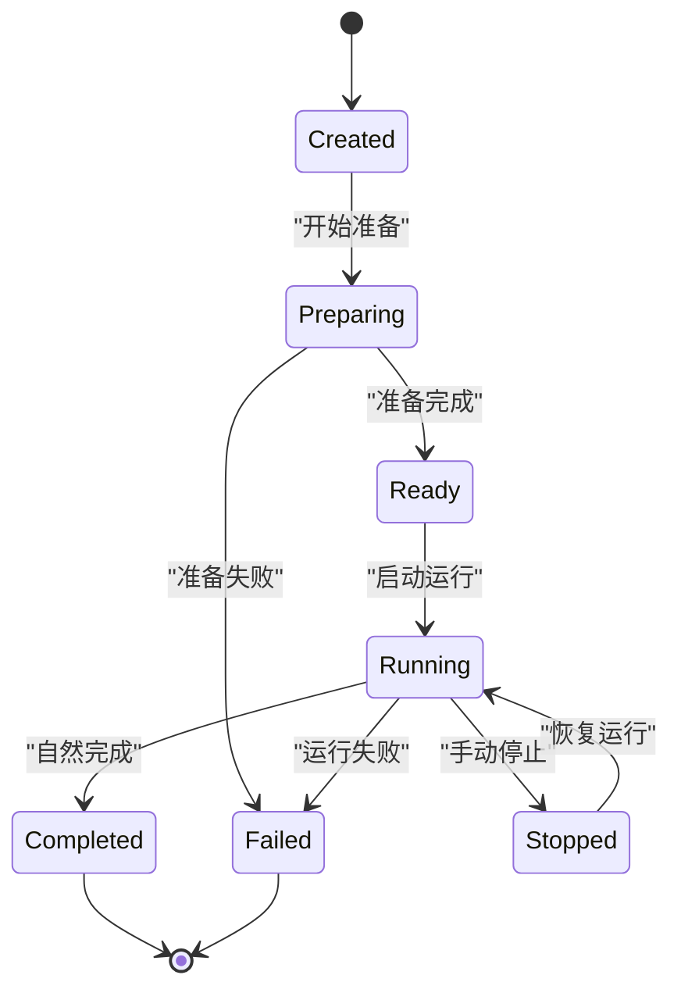
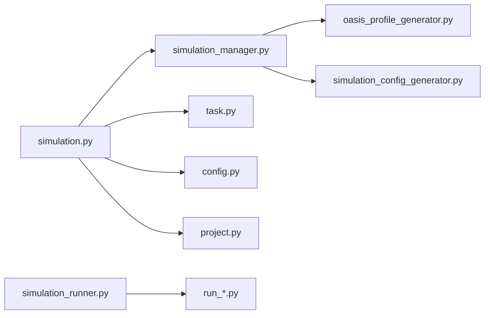

# 模拟管理接口

<cite>
**本文档引用的文件**
- [backend/app/api/simulation.py](file://backend/app/api/simulation.py)
- [backend/app/services/simulation_manager.py](file://backend/app/services/simulation_manager.py)
- [backend/app/services/simulation_runner.py](file://backend/app/services/simulation_runner.py)
- [backend/app/models/task.py](file://backend/app/models/task.py)
- [backend/app/services/oasis_profile_generator.py](file://backend/app/services/oasis_profile_generator.py)
- [backend/app/services/simulation_config_generator.py](file://backend/app/services/simulation_config_generator.py)
- [backend/app/models/project.py](file://backend/app/models/project.py)
- [backend/app/config.py](file://backend/app/config.py)
- [backend/run.py](file://backend/run.py)
- [backend/scripts/run_twitter_simulation.py](file://backend/scripts/run_twitter_simulation.py)
- [backend/scripts/run_parallel_simulation.py](file://backend/scripts/run_parallel_simulation.py)
- [backend/app/api/__init__.py](file://backend/app/api/__init__.py)
- [README.md](file://README.md)
</cite>

## 目录
1. [简介](#简介)
2. [项目结构](#项目结构)
3. [核心组件](#核心组件)
4. [架构总览](#架构总览)
5. [详细组件分析](#详细组件分析)
6. [依赖关系分析](#依赖关系分析)
7. [性能考虑](#性能考虑)
8. [故障排查指南](#故障排查指南)
9. [结论](#结论)
10. [附录](#附录)

## 简介
本文件面向MiroFish的模拟管理API，系统性梳理并说明以下接口与能力：
- 模拟创建接口：/api/simulation/create
- 模拟准备接口：/api/simulation/prepare
- 准备状态查询接口：/api/simulation/prepare/status

重点覆盖模拟任务的生命周期管理（创建、准备、运行、状态监控）、模拟参数配置、实体类型过滤与Agent Profile生成机制、异步任务处理与进度回调、错误恢复策略，以及并发控制与资源管理的最佳实践。

## 项目结构
后端采用Flask蓝图组织API，核心模块分布如下：
- API层：路由定义与请求处理
- 服务层：业务逻辑封装（模拟管理、运行器、配置生成、Profile生成等）
- 模型层：任务状态与项目上下文管理
- 脚本层：OASIS模拟脚本（Twitter/Reddit/并行）

**图表来源**
- [backend/app/api/simulation.py](file://backend/app/api/simulation.py#L1-L800)
- [backend/app/services/simulation_manager.py](file://backend/app/services/simulation_manager.py#L1-L529)
- [backend/app/services/simulation_runner.py](file://backend/app/services/simulation_runner.py#L1-L800)
- [backend/app/models/task.py](file://backend/app/models/task.py#L1-L185)
- [backend/app/models/project.py](file://backend/app/models/project.py#L1-L306)
- [backend/app/services/oasis_profile_generator.py](file://backend/app/services/oasis_profile_generator.py#L1-L200)
- [backend/app/services/simulation_config_generator.py](file://backend/app/services/simulation_config_generator.py#L1-L200)
- [backend/app/config.py](file://backend/app/config.py#L1-L76)
- [backend/scripts/run_twitter_simulation.py](file://backend/scripts/run_twitter_simulation.py#L1-L200)
- [backend/scripts/run_parallel_simulation.py](file://backend/scripts/run_parallel_simulation.py#L1-L200)

**章节来源**
- [backend/app/api/__init__.py](file://backend/app/api/__init__.py#L1-L15)
- [backend/run.py](file://backend/run.py#L1-L51)

## 核心组件
- 模拟管理器（SimulationManager）：负责创建、准备、读取、列举模拟；维护模拟状态与配置文件；协调Profile生成与配置生成。
- 模拟运行器（SimulationRunner）：负责启动、监控、停止OASIS模拟进程；解析动作日志并维护运行状态。
- 任务管理器（TaskManager）：提供异步任务的创建、更新、完成与失败标记，支持进度与详细进度信息。
- Profile生成器（OasisProfileGenerator）：将图谱实体转换为OASIS Agent Profile，支持并行生成与实时保存。
- 配置生成器（SimulationConfigGenerator）：基于需求与图谱信息，LLM智能生成时间、事件、平台等配置。
- 项目管理器（ProjectManager）：提供项目上下文（含simulation_requirement、graph_id等）。

**章节来源**
- [backend/app/services/simulation_manager.py](file://backend/app/services/simulation_manager.py#L114-L529)
- [backend/app/services/simulation_runner.py](file://backend/app/services/simulation_runner.py#L195-L800)
- [backend/app/models/task.py](file://backend/app/models/task.py#L54-L185)
- [backend/app/services/oasis_profile_generator.py](file://backend/app/services/oasis_profile_generator.py#L142-L200)
- [backend/app/services/simulation_config_generator.py](file://backend/app/services/simulation_config_generator.py#L199-L200)
- [backend/app/models/project.py](file://backend/app/models/project.py#L101-L306)

## 架构总览
模拟管理API围绕“异步准备 + 状态查询 + 启动运行”的闭环设计，关键流程如下：

**图表来源**
- [backend/app/api/simulation.py](file://backend/app/api/simulation.py#L164-L747)
- [backend/app/services/simulation_manager.py](file://backend/app/services/simulation_manager.py#L193-L456)
- [backend/app/models/task.py](file://backend/app/models/task.py#L73-L162)
- [backend/app/services/simulation_runner.py](file://backend/app/services/simulation_runner.py#L312-L475)

## 详细组件分析

### 模拟创建接口 /api/simulation/create
- 功能：为指定项目创建新的模拟，生成唯一simulation_id并初始化状态。
- 输入参数：
  - project_id：必填
  - graph_id：可选（若为空则从项目获取）
  - enable_twitter / enable_reddit：可选，默认开启
- 输出：
  - 成功：返回包含simulation_id、project_id、graph_id、初始状态等的结构
  - 失败：返回错误信息与traceback
- 关键逻辑：
  - 校验项目存在性与图谱ID
  - 调用SimulationManager.create_simulation生成状态并持久化
  - 返回状态字典

**图表来源**
- [backend/app/api/simulation.py](file://backend/app/api/simulation.py#L164-L236)
- [backend/app/services/simulation_manager.py](file://backend/app/services/simulation_manager.py#L193-L227)

**章节来源**
- [backend/app/api/simulation.py](file://backend/app/api/simulation.py#L164-L236)
- [backend/app/services/simulation_manager.py](file://backend/app/services/simulation_manager.py#L193-L227)

### 模拟准备接口 /api/simulation/prepare
- 功能：异步准备模拟环境，包括实体过滤、Agent Profile生成、配置生成与脚本准备。
- 支持特性：
  - 自动检测已完成的准备工作，避免重复生成
  - 支持强制重新生成（force_regenerate）
  - 并行生成Profile（parallel_profile_count）
  - LLM智能生成配置（use_llm_for_profiles）
- 输入参数：
  - simulation_id：必填
  - entity_types：可选，指定实体类型
  - use_llm_for_profiles：可选，默认true
  - parallel_profile_count：可选，默认5
  - force_regenerate：可选，默认false
- 输出：
  - 成功：返回task_id、当前状态、是否已准备完成、预期Agent数量等
  - 失败：返回错误信息
- 异步流程：
  - 创建任务并更新状态为processing
  - 启动后台线程执行prepare_simulation
  - 通过progress_callback上报阶段进度与详细信息
  - 任务完成后标记完成或失败

**图表来源**
- [backend/app/api/simulation.py](file://backend/app/api/simulation.py#L358-L634)
- [backend/app/models/task.py](file://backend/app/models/task.py#L73-L162)
- [backend/app/services/simulation_manager.py](file://backend/app/services/simulation_manager.py#L229-L456)

**章节来源**
- [backend/app/api/simulation.py](file://backend/app/api/simulation.py#L358-L634)
- [backend/app/models/task.py](file://backend/app/models/task.py#L54-L185)
- [backend/app/services/simulation_manager.py](file://backend/app/services/simulation_manager.py#L229-L456)

### 准备状态查询接口 /api/simulation/prepare/status
- 功能：查询准备任务进度，支持通过task_id或simulation_id查询。
- 输入参数：
  - task_id：可选
  - simulation_id：可选（用于检查已完成的准备）
- 输出：
  - 若提供simulation_id且已准备完成：返回ready与prepare_info
  - 若提供task_id：返回任务状态、进度、消息与详细进度
  - 若仅提供simulation_id且未开始：返回not_started

**图表来源**
- [backend/app/api/simulation.py](file://backend/app/api/simulation.py#L637-L747)
- [backend/app/models/task.py](file://backend/app/models/task.py#L101-L104)

**章节来源**
- [backend/app/api/simulation.py](file://backend/app/api/simulation.py#L637-L747)
- [backend/app/models/task.py](file://backend/app/models/task.py#L101-L104)

### 模拟参数配置与Agent Profile生成机制
- 实体类型过滤：
  - 通过ZepEntityReader.filter_defined_entities按预定义类型过滤
  - 支持enrich_with_edges控制是否获取边信息
- Agent Profile生成：
  - 使用OasisProfileGenerator.generate_profiles_from_entities
  - 支持use_llm增强人设细节
  - 支持并行生成（parallel_profile_count）
  - 支持实时保存到reddit_profiles.json或twitter_profiles.csv
- 模拟配置生成：
  - 使用SimulationConfigGenerator.generate_config
  - 自动生成时间配置、事件配置、平台配置与Agent活动配置
  - 输出simulation_config.json

**图表来源**
- [backend/app/services/simulation_manager.py](file://backend/app/services/simulation_manager.py#L114-L529)
- [backend/app/services/oasis_profile_generator.py](file://backend/app/services/oasis_profile_generator.py#L142-L200)
- [backend/app/services/simulation_config_generator.py](file://backend/app/services/simulation_config_generator.py#L199-L200)

**章节来源**
- [backend/app/services/simulation_manager.py](file://backend/app/services/simulation_manager.py#L229-L456)
- [backend/app/services/oasis_profile_generator.py](file://backend/app/services/oasis_profile_generator.py#L142-L200)
- [backend/app/services/simulation_config_generator.py](file://backend/app/services/simulation_config_generator.py#L199-L200)

### 异步任务处理、进度回调与错误恢复
- 任务管理：
  - TaskManager提供create_task/update_task/complete_task/fail_task
  - 支持progress与progress_detail（阶段名称、当前/总数、条目描述）
- 进度回调：
  - prepare_simulation中定义progress_callback，计算加权总进度
  - 阶段权重：reading(0-20%)、generating_profiles(20-70%)、generating_config(70-90%)、copying_scripts(90-100%)
- 错误恢复：
  - prepare失败时更新模拟状态为FAILED并记录error
  - 任务失败时TaskManager.fail_task并持久化错误

**章节来源**
- [backend/app/models/task.py](file://backend/app/models/task.py#L54-L185)
- [backend/app/api/simulation.py](file://backend/app/api/simulation.py#L517-L596)
- [backend/app/services/simulation_manager.py](file://backend/app/services/simulation_manager.py#L449-L456)

### 模拟状态转换与生命周期管理
- 模拟状态枚举：created → preparing → ready → running → paused → stopped → completed → failed
- 生命周期要点：
  - /create：created
  - /prepare：preparing（异步），完成后ready
  - /prepare/status：查询preparing/ready/not_started
  - 运行：SimulationRunner.start_simulation → running → completed/failed
  - 停止：stop_simulation → stopped

**图表来源**
- [backend/app/services/simulation_manager.py](file://backend/app/services/simulation_manager.py#L24-L34)
- [backend/app/services/simulation_runner.py](file://backend/app/services/simulation_runner.py#L35-L44)

**章节来源**
- [backend/app/services/simulation_manager.py](file://backend/app/services/simulation_manager.py#L24-L34)
- [backend/app/services/simulation_runner.py](file://backend/app/services/simulation_runner.py#L35-L44)

### 并发控制与资源管理最佳实践
- 并发控制：
  - 使用线程池/线程启动后台准备任务，避免阻塞API响应
  - TaskManager使用锁保证线程安全
- 资源管理：
  - 使用start_new_session=True创建进程组，便于跨平台终止
  - 进程树终止：Windows使用taskkill，Unix使用os.killpg(SIGTERM/SIGKILL)
  - 日志文件句柄管理：统一打开与关闭，防止句柄泄漏
  - 模拟数据目录隔离：每个simulation_id独立目录，避免冲突

**章节来源**
- [backend/app/api/simulation.py](file://backend/app/api/simulation.py#L606-L607)
- [backend/app/services/simulation_runner.py](file://backend/app/services/simulation_runner.py#L716-L770)
- [backend/app/utils/logger.py](file://backend/app/utils/logger.py#L1-L127)

## 依赖关系分析
- API层依赖服务层与模型层，负责参数校验、任务调度与结果封装
- 服务层内部协作：SimulationManager协调Profile与配置生成；Runner负责进程生命周期
- 配置层：Config集中管理LLM/Zep/上传目录等全局配置
- 脚本层：run_twitter_simulation.py与run_parallel_simulation.py作为OASIS模拟入口

**图表来源**
- [backend/app/api/simulation.py](file://backend/app/api/simulation.py#L1-L800)
- [backend/app/services/simulation_manager.py](file://backend/app/services/simulation_manager.py#L1-L529)
- [backend/app/services/simulation_runner.py](file://backend/app/services/simulation_runner.py#L1-L800)
- [backend/app/models/task.py](file://backend/app/models/task.py#L1-L185)
- [backend/app/services/oasis_profile_generator.py](file://backend/app/services/oasis_profile_generator.py#L1-L200)
- [backend/app/services/simulation_config_generator.py](file://backend/app/services/simulation_config_generator.py#L1-L200)
- [backend/app/config.py](file://backend/app/config.py#L1-L76)
- [backend/app/models/project.py](file://backend/app/models/project.py#L1-L306)

**章节来源**
- [backend/app/api/simulation.py](file://backend/app/api/simulation.py#L1-L800)
- [backend/app/services/simulation_manager.py](file://backend/app/services/simulation_manager.py#L1-L529)
- [backend/app/services/simulation_runner.py](file://backend/app/services/simulation_runner.py#L1-L800)
- [backend/app/models/task.py](file://backend/app/models/task.py#L1-L185)
- [backend/app/services/oasis_profile_generator.py](file://backend/app/services/oasis_profile_generator.py#L1-L200)
- [backend/app/services/simulation_config_generator.py](file://backend/app/services/simulation_config_generator.py#L1-L200)
- [backend/app/config.py](file://backend/app/config.py#L1-L76)
- [backend/app/models/project.py](file://backend/app/models/project.py#L1-L306)

## 性能考虑
- 并行Profile生成：通过parallel_profile_count提升生成效率，建议根据CPU与LLM配额合理设置
- 实时保存：在生成过程中实时写入Profile文件，降低内存压力并支持断点续跑
- 日志与I/O：使用主日志文件避免stdout/stderr缓冲区满导致阻塞；统一UTF-8编码避免第三方库兼容问题
- 进程管理：进程组终止确保子进程完全清理，减少僵尸进程

[本节为通用指导，无需特定文件引用]

## 故障排查指南
- 配置缺失：
  - LLM_API_KEY或ZEP_API_KEY未配置会导致准备失败
  - 使用Config.validate进行启动前校验
- 准备失败：
  - 检查任务状态与progress_detail，定位失败阶段
  - 查看模拟目录下的simulation.log与各平台actions.jsonl
- 运行失败：
  - 通过SimulationRunner.stop_simulation终止进程树
  - 检查图谱记忆更新器是否正常停止
- 前端交互：
  - /api/simulation/get_run_status用于获取运行状态（参见脚本中的IPC与日志结构）

**章节来源**
- [backend/app/config.py](file://backend/app/config.py#L66-L75)
- [backend/app/api/simulation.py](file://backend/app/api/simulation.py#L594-L603)
- [backend/app/services/simulation_runner.py](file://backend/app/services/simulation_runner.py#L771-L800)
- [backend/scripts/run_parallel_simulation.py](file://backend/scripts/run_parallel_simulation.py#L1-L200)

## 结论
本文档系统梳理了MiroFish模拟管理API的核心接口与实现细节，明确了从创建、准备、状态查询到运行监控的完整生命周期。通过异步任务与进度回调、LLM智能配置与Profile生成、严格的并发与资源管理，实现了高效、稳定、可观测的模拟管理体验。建议在生产环境中结合日志与监控体系，持续优化并行参数与资源配额，确保大规模模拟场景的稳定性与性能。

[本节为总结性内容，无需特定文件引用]

## 附录
- 环境变量与配置项参考：LLM_API_KEY、ZEP_API_KEY、LLM_BASE_URL、LLM_MODEL_NAME、OASIS_SIMULATION_DATA_DIR等
- 快速开始与部署：README.md提供了源码与Docker部署指引，包含必需的API密钥配置

**章节来源**
- [README.md](file://README.md#L101-L123)
- [backend/app/config.py](file://backend/app/config.py#L30-L49)