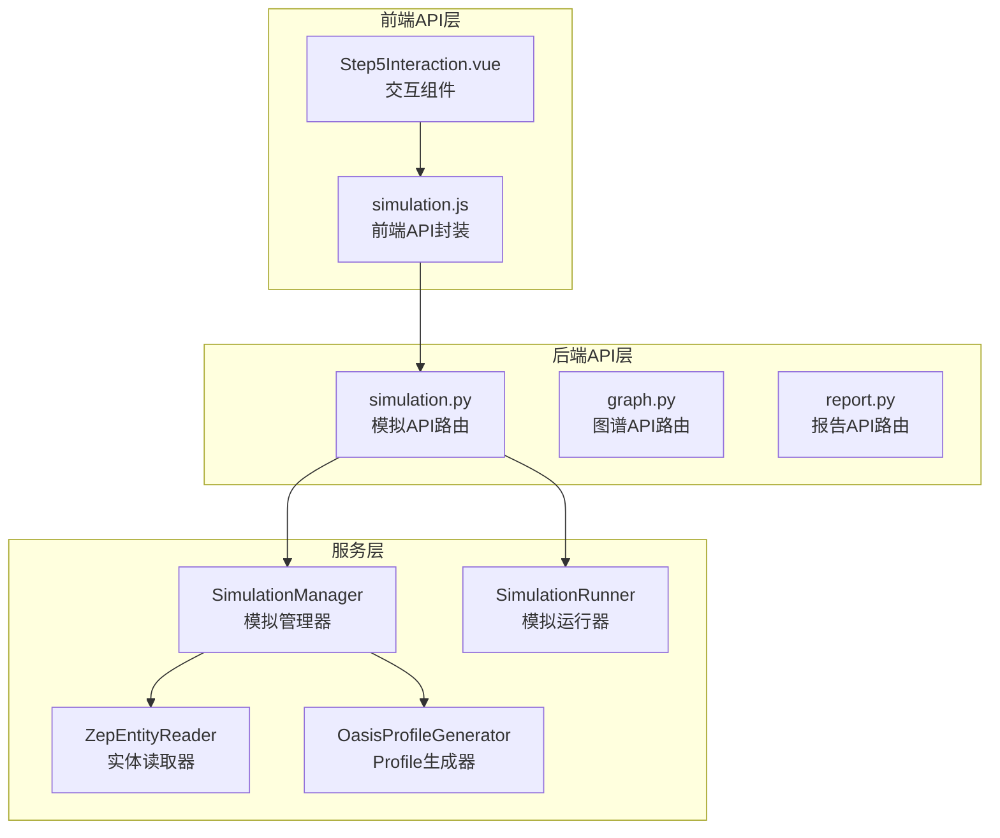
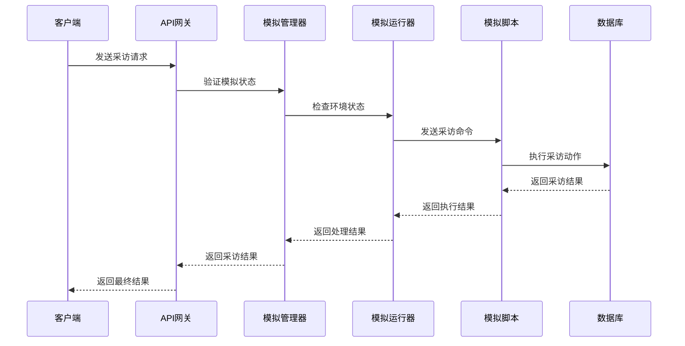
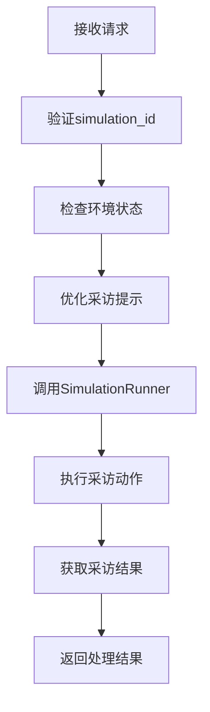
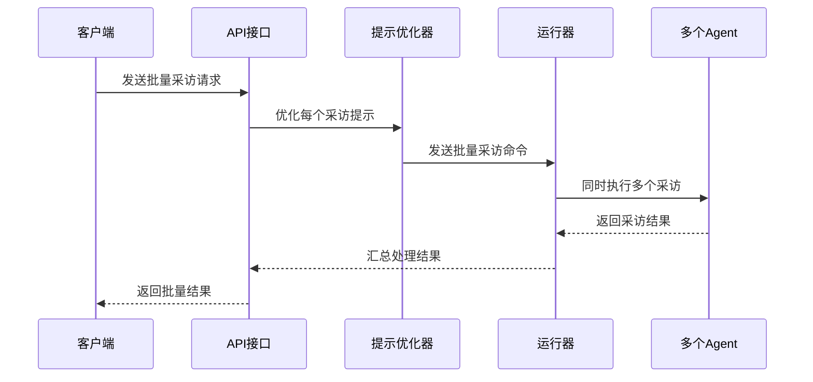
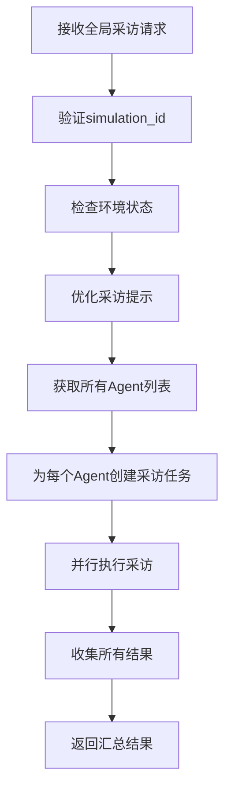
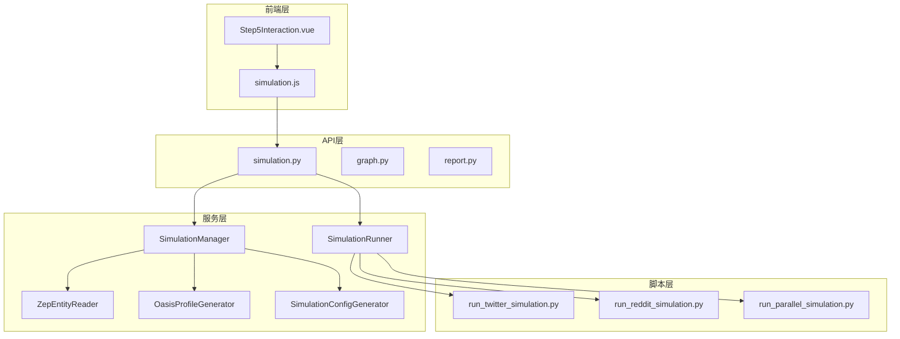

# 模拟采访接口

<cite>
**本文档引用的文件**
- [backend/app/api/simulation.py](file://backend/app/api/simulation.py)
- [backend/app/services/simulation_manager.py](file://backend/app/services/simulation_manager.py)
- [backend/app/services/simulation_runner.py](file://backend/app/services/simulation_runner.py)
- [frontend/src/api/simulation.js](file://frontend/src/api/simulation.js)
- [frontend/src/components/Step5Interaction.vue](file://frontend/src/components/Step5Interaction.vue)
</cite>

## 目录
1. [简介](#简介)
2. [项目结构](#项目结构)
3. [核心组件](#核心组件)
4. [架构概览](#架构概览)
5. [详细组件分析](#详细组件分析)
6. [依赖关系分析](#依赖关系分析)
7. [性能考虑](#性能考虑)
8. [故障排除指南](#故障排除指南)
9. [结论](#结论)

## 简介

MiroFish的模拟采访API接口为智能采访系统提供了完整的HTTP端点支持，包括单个Agent采访接口、批量采访接口和全局采访接口。该系统基于ReACT（推理-行动-观察-思考）模式，在模拟环境中实现智能采访功能。

系统的核心特性包括：
- **ReACT模式应用**：通过推理-行动-观察-思考循环实现智能采访
- **采访优化机制**：自动优化采访提示，避免Agent调用工具
- **多平台支持**：支持Twitter和Reddit双平台采访
- **深度交互**：支持单个Agent、批量采访和全局采访三种模式
- **上下文保持**：通过图谱记忆和对话历史实现上下文保持
- **质量评估**：内置采访结果验证和人工审核流程

## 项目结构

模拟采访API位于后端的API路由模块中，主要文件组织如下：



**图表来源**
- [backend/app/api/simulation.py](file://backend/app/api/simulation.py#L1-L50)
- [backend/app/services/simulation_manager.py](file://backend/app/services/simulation_manager.py#L1-L50)
- [frontend/src/api/simulation.js](file://frontend/src/api/simulation.js#L1-L30)

**章节来源**
- [backend/app/api/simulation.py](file://backend/app/api/simulation.py#L1-L100)
- [backend/app/services/simulation_manager.py](file://backend/app/services/simulation_manager.py#L1-L100)
- [frontend/src/api/simulation.js](file://frontend/src/api/simulation.js#L1-L50)

## 核心组件

### 模拟管理器（SimulationManager）

模拟管理器负责整个模拟生命周期的管理，包括状态跟踪、配置生成和文件管理。

**核心功能**：
- 模拟状态管理（CREATED、PREPARING、READY、RUNNING等状态）
- 实体读取和过滤
- Agent Profile生成
- 模拟配置生成
- 文件系统管理

**状态枚举**：
- CREATED：模拟已创建
- PREPARING：准备中
- READY：准备完成
- RUNNING：运行中
- PAUSED：已暂停
- STOPPED：已停止
- COMPLETED：已完成
- FAILED：已失败

**章节来源**
- [backend/app/services/simulation_manager.py](file://backend/app/services/simulation_manager.py#L24-L112)

### 模拟运行器（SimulationRunner）

模拟运行器负责实际的模拟执行和监控，支持实时状态监控和动作记录。

**核心功能**：
- 后台进程管理
- 实时状态监控
- 动作日志解析
- 进程生命周期管理
- 图谱记忆更新

**运行状态**：
- IDLE：空闲
- STARTING：启动中
- RUNNING：运行中
- PAUSED：已暂停
- STOPPING：停止中
- STOPPED：已停止
- COMPLETED：已完成
- FAILED：已失败

**章节来源**
- [backend/app/services/simulation_runner.py](file://backend/app/services/simulation_runner.py#L35-L193)

### 采访优化机制

系统实现了智能的采访优化机制，通过添加特定前缀避免Agent调用工具。

**优化策略**：
- 自动添加"结合你的人设、所有的过往记忆与行动，不调用任何工具直接用文本回复我："前缀
- 避免重复添加前缀
- 支持批量优化
- 超时处理机制

**章节来源**
- [backend/app/api/simulation.py](file://backend/app/api/simulation.py#L22-L43)

## 架构概览

模拟采访系统的整体架构采用分层设计，确保了良好的可维护性和扩展性。



**图表来源**
- [backend/app/api/simulation.py](file://backend/app/api/simulation.py#L2231-L2263)
- [backend/app/services/simulation_runner.py](file://backend/app/services/simulation_runner.py#L312-L475)

系统架构特点：
- **分层设计**：API层、服务层、脚本层清晰分离
- **异步处理**：支持长时间运行的采访操作
- **状态管理**：完整的状态跟踪和恢复机制
- **错误处理**：完善的异常捕获和错误恢复

## 详细组件分析

### 单个Agent采访接口

单个Agent采访接口提供了针对特定Agent的深度采访能力。

**接口定义**：
- 路径：`/api/simulation/<simulation_id>/interview`
- 方法：POST
- 功能：对指定Agent进行个性化采访

**请求参数**：
```json
{
  "agent_id": 0,
  "prompt": "你对这件事有什么看法？",
  "platform": "twitter",
  "timeout": 120
}
```

**响应结构**：
```json
{
  "success": true,
  "data": {
    "agent_id": 0,
    "response": "Agent的回答内容",
    "platform": "twitter",
    "timestamp": "2025-12-08T10:00:01"
  }
}
```

**处理流程**：



**图表来源**
- [backend/app/api/simulation.py](file://backend/app/api/simulation.py#L2222-L2263)

**章节来源**
- [backend/app/api/simulation.py](file://backend/app/api/simulation.py#L2222-L2263)

### 批量采访接口

批量采访接口支持同时对多个Agent进行采访，提高采访效率。

**接口定义**：
- 路径：`/api/simulation/interview/batch`
- 方法：POST
- 功能：批量采访多个Agent

**请求参数**：
```json
{
  "simulation_id": "sim_xxxx",
  "interviews": [
    {
      "agent_id": 0,
      "prompt": "你对A有什么看法？",
      "platform": "twitter"
    },
    {
      "agent_id": 1,
      "prompt": "你对B有什么看法？"
    }
  ],
  "platform": "reddit",
  "timeout": 120
}
```

**响应结构**：
```json
{
  "success": true,
  "data": {
    "interviews_count": 2,
    "result": {
      "interviews_count": 4,
      "results": {
        "twitter_0": {"agent_id": 0, "response": "...", "platform": "twitter"},
        "reddit_0": {"agent_id": 0, "response": "...", "platform": "reddit"},
        "twitter_1": {"agent_id": 1, "response": "...", "platform": "twitter"},
        "reddit_1": {"agent_id": 1, "response": "...", "platform": "reddit"}
      }
    },
    "timestamp": "2025-12-08T10:00:01"
  }
}
```

**处理流程**：



**图表来源**
- [backend/app/api/simulation.py](file://backend/app/api/simulation.py#L2266-L2401)

**章节来源**
- [backend/app/api/simulation.py](file://backend/app/api/simulation.py#L2266-L2401)

### 全局采访接口

全局采访接口使用相同问题采访所有Agent，适合进行大规模对比分析。

**接口定义**：
- 路径：`/api/simulation/interview/all`
- 方法：POST
- 功能：使用相同问题采访所有Agent

**请求参数**：
```json
{
  "simulation_id": "sim_xxxx",
  "prompt": "你对这件事整体有什么看法？",
  "platform": "reddit",
  "timeout": 180
}
```

**响应结构**：
```json
{
  "success": true,
  "data": {
    "interviews_count": 50,
    "result": {
      "interviews_count": 100,
      "results": {
        "twitter_0": {"agent_id": 0, "response": "...", "platform": "twitter"},
        "reddit_0": {"agent_id": 0, "response": "...", "platform": "reddit"},
        ...
      }
    },
    "timestamp": "2025-12-08T10:00:01"
  }
}
```

**处理流程**：



**图表来源**
- [backend/app/api/simulation.py](file://backend/app/api/simulation.py#L2404-L2504)

**章节来源**
- [backend/app/api/simulation.py](file://backend/app/api/simulation.py#L2404-L2504)

### ReACT模式应用

系统实现了完整的ReACT（推理-行动-观察-思考）模式，用于智能采访决策。

**推理阶段**：
- 分析采访需求
- 选择合适的Agent
- 生成优化的采访问题

**行动阶段**：
- 发送采访命令到模拟环境
- 执行具体的采访动作

**观察阶段**：
- 监控采访执行状态
- 收集采访结果
- 记录动作日志

**思考阶段**：
- 分析采访结果
- 评估采访质量
- 生成改进建议

**章节来源**
- [backend/app/services/zep_tools.py](file://backend/app/services/zep_tools.py#L1309-L1334)

### 采访提示优化

系统实现了智能的采访提示优化机制，确保Agent能够专注于文本回复而非工具调用。

**优化策略**：
- 自动添加固定前缀避免工具调用
- 支持批量优化多个采访
- 防止重复添加前缀
- 超时处理和错误恢复

**优化前缀**：
```
"结合你的人设、所有的过往记忆与行动，不调用任何工具直接用文本回复我："
```

**章节来源**
- [backend/app/api/simulation.py](file://backend/app/api/simulation.py#L22-L43)

### Agent行为控制

系统提供了多种Agent行为控制机制，确保采访过程的可控性和一致性。

**控制机制**：
- **平台选择**：支持Twitter和Reddit平台的差异化控制
- **超时管理**：统一的超时处理机制
- **状态监控**：实时监控Agent状态和环境状态
- **错误处理**：完善的异常捕获和恢复机制

**章节来源**
- [backend/app/api/simulation.py](file://backend/app/api/simulation.py#L2215-L2227)

### 采访参数配置

系统支持灵活的采访参数配置，满足不同场景的需求。

**核心参数**：
- **simulation_id**：模拟实例标识符
- **agent_id**：目标Agent标识符
- **prompt**：采访问题内容
- **platform**：采访平台（twitter/reddit）
- **timeout**：超时时间（秒）

**可选参数**：
- **max_rounds**：最大模拟轮数
- **enable_graph_memory_update**：是否启用图谱记忆更新
- **force**：强制重新开始标志

**章节来源**
- [backend/app/api/simulation.py](file://backend/app/api/simulation.py#L2215-L2227)

### 对话历史管理

系统实现了完整的对话历史管理系统，支持多轮对话和上下文保持。

**历史管理功能**：
- **历史记录存储**：持久化存储采访历史
- **上下文检索**：支持基于历史的上下文检索
- **多轮对话支持**：支持复杂的多轮对话场景
- **历史查询接口**：提供灵活的历史查询能力

**章节来源**
- [backend/app/api/simulation.py](file://backend/app/api/simulation.py#L2507-L2576)

### 深度交互实现

系统提供了多种深度交互方式，支持从简单到复杂的各种采访场景。

**交互模式**：
- **单轮采访**：简单的单次采访
- **多轮对话**：支持多次往返的深度对话
- **批量采访**：同时采访多个Agent
- **全局采访**：采访所有可用Agent

**章节来源**
- [frontend/src/components/Step5Interaction.vue](file://frontend/src/components/Step5Interaction.vue#L691-L808)

## 依赖关系分析

模拟采访API的依赖关系体现了清晰的分层架构设计。



**图表来源**
- [backend/app/api/simulation.py](file://backend/app/api/simulation.py#L1-L50)
- [backend/app/services/simulation_manager.py](file://backend/app/services/simulation_manager.py#L1-L50)

**依赖特点**：
- **单向依赖**：API层依赖服务层，服务层依赖脚本层
- **松耦合**：各层之间通过清晰的接口进行通信
- **可替换性**：底层实现可以独立替换而不影响上层

**章节来源**
- [backend/app/api/simulation.py](file://backend/app/api/simulation.py#L1-L50)
- [backend/app/services/simulation_manager.py](file://backend/app/services/simulation_manager.py#L1-L50)

## 性能考虑

系统在设计时充分考虑了性能优化，采用了多种策略确保高效运行。

**性能优化策略**：
- **异步处理**：采访操作采用异步处理，避免阻塞
- **并行执行**：批量采访支持并行执行，提高效率
- **内存管理**：合理的内存使用和垃圾回收
- **缓存机制**：状态和配置的内存缓存
- **流式处理**：日志和结果的流式处理

**监控指标**：
- **响应时间**：平均响应时间控制在合理范围内
- **并发处理**：支持高并发的采访请求
- **资源使用**：CPU和内存使用率优化
- **错误率**：系统稳定性保证

## 故障排除指南

系统提供了完善的错误处理和故障排除机制。

**常见问题及解决方案**：

**环境状态问题**：
- **症状**：环境未运行或已关闭
- **原因**：模拟环境未正确启动
- **解决**：检查模拟状态，重新启动环境

**参数验证错误**：
- **症状**：参数缺失或格式错误
- **原因**：请求参数不符合要求
- **解决**：检查请求格式，确保所有必需参数都已提供

**超时问题**：
- **症状**：采访操作超时
- **原因**：Agent处理时间过长或系统负载过高
- **解决**：增加超时时间，优化系统性能

**章节来源**
- [backend/app/api/simulation.py](file://backend/app/api/simulation.py#L2251-L2255)
- [backend/app/api/simulation.py](file://backend/app/api/simulation.py#L2389-L2393)

## 结论

MiroFish的模拟采访API接口提供了一个完整、高效的智能采访解决方案。通过ReACT模式的应用、智能的采访优化机制和灵活的参数配置，系统能够支持从简单到复杂的各种采访场景。

**主要优势**：
- **智能化程度高**：基于ReACT模式的智能决策
- **灵活性强**：支持多种采访模式和参数配置
- **可扩展性好**：清晰的分层架构便于扩展
- **用户体验佳**：提供完整的前后端集成方案

**应用场景**：
- **舆情分析**：大规模Agent采访进行舆情监测
- **市场调研**：深度采访了解用户需求
- **学术研究**：模拟复杂社会现象进行研究
- **产品测试**：收集用户反馈改进产品

该系统为智能采访应用提供了坚实的技术基础，能够满足各种复杂的应用需求。