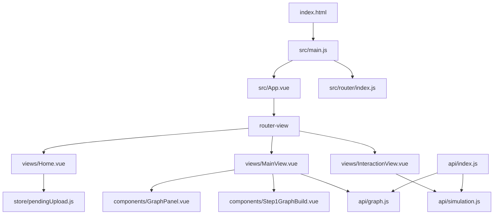
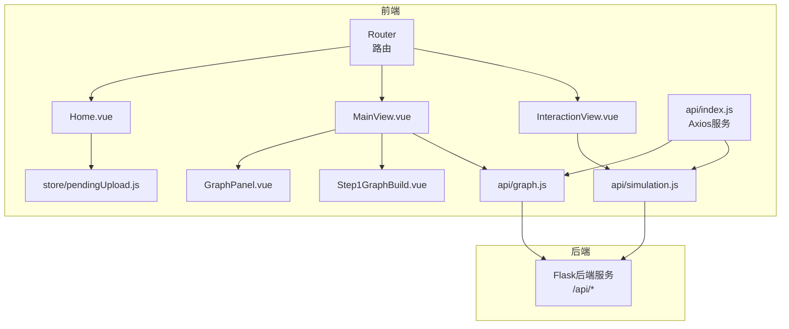
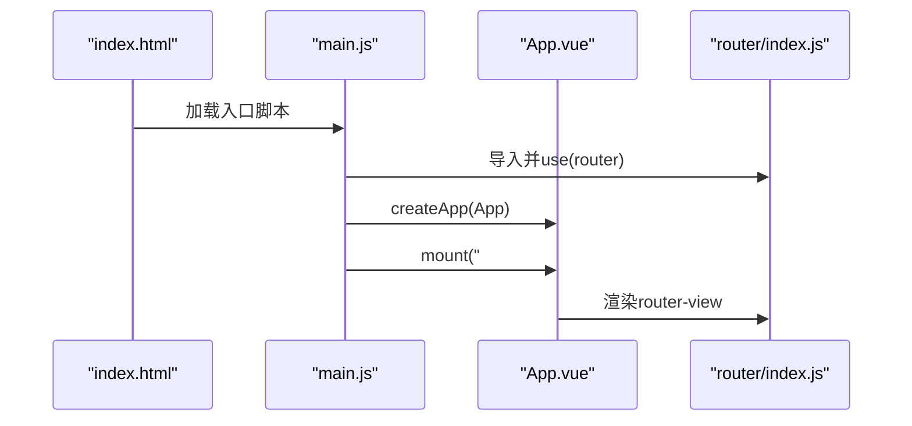
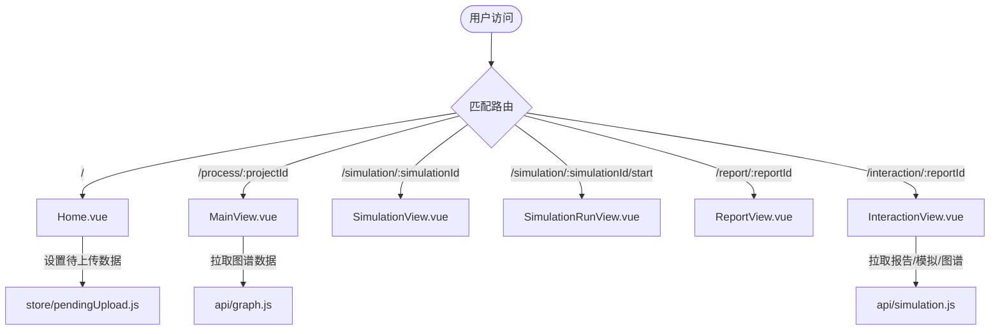
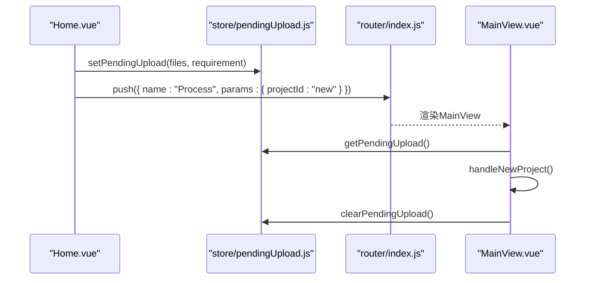
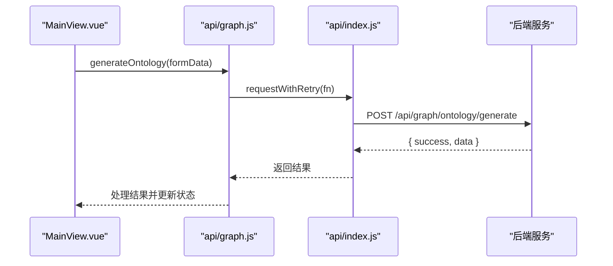
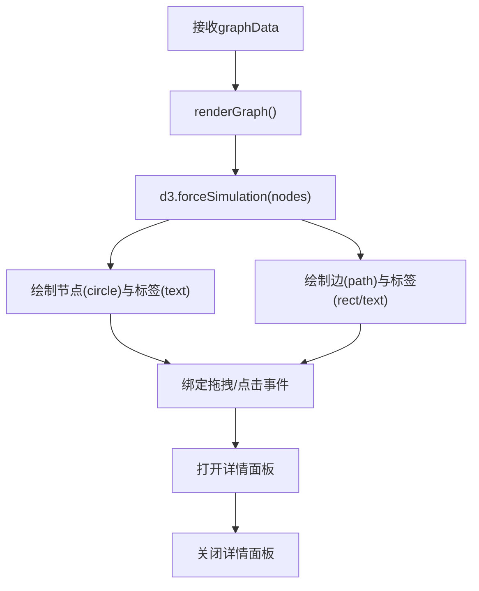
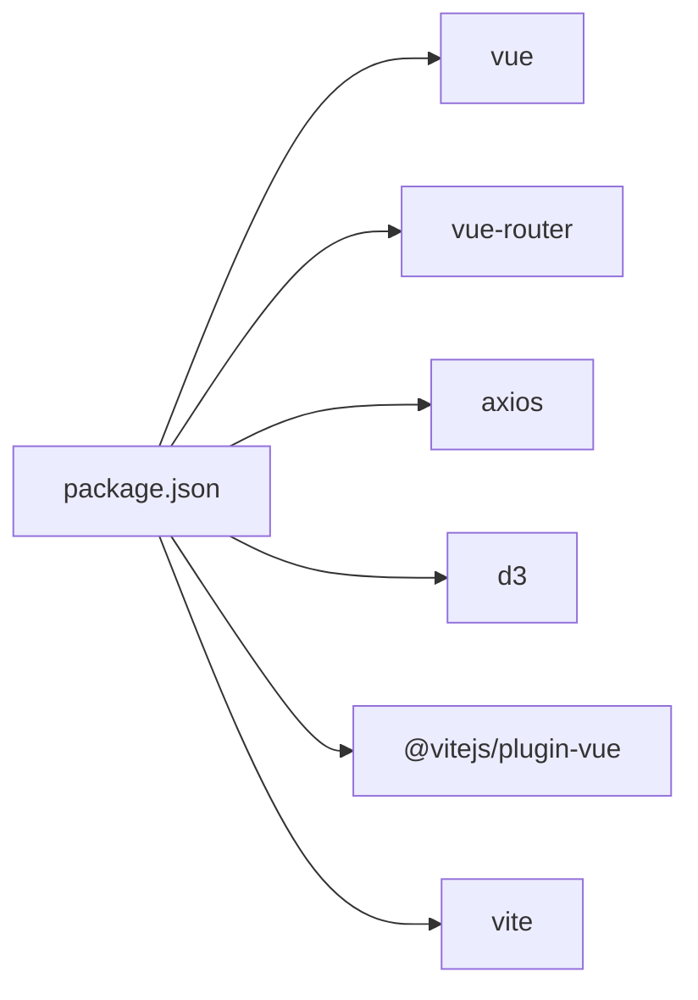

# Vue应用架构

<cite>
**本文档引用的文件**
- [frontend/src/main.js](file://frontend/src/main.js)
- [frontend/vite.config.js](file://frontend/vite.config.js)
- [frontend/package.json](file://frontend/package.json)
- [frontend/src/router/index.js](file://frontend/src/router/index.js)
- [frontend/src/store/pendingUpload.js](file://frontend/src/store/pendingUpload.js)
- [frontend/src/App.vue](file://frontend/src/App.vue)
- [frontend/src/views/Home.vue](file://frontend/src/views/Home.vue)
- [frontend/src/views/MainView.vue](file://frontend/src/views/MainView.vue)
- [frontend/src/views/InteractionView.vue](file://frontend/src/views/InteractionView.vue)
- [frontend/src/api/index.js](file://frontend/src/api/index.js)
- [frontend/src/api/graph.js](file://frontend/src/api/graph.js)
- [frontend/src/api/simulation.js](file://frontend/src/api/simulation.js)
- [frontend/src/components/GraphPanel.vue](file://frontend/src/components/GraphPanel.vue)
- [frontend/src/components/Step1GraphBuild.vue](file://frontend/src/components/Step1GraphBuild.vue)
- [frontend/index.html](file://frontend/index.html)
</cite>

## 目录
1. [简介](#简介)
2. [项目结构](#项目结构)
3. [核心组件](#核心组件)
4. [架构总览](#架构总览)
5. [详细组件分析](#详细组件分析)
6. [依赖分析](#依赖分析)
7. [性能考虑](#性能考虑)
8. [故障排查指南](#故障排查指南)
9. [结论](#结论)
10. [附录](#附录)

## 简介
本文件面向MiroFish前端Vue.js应用，提供从应用初始化、路由与状态管理到构建配置与性能优化的完整技术文档。重点覆盖：
- 应用初始化流程与插件系统
- 路由配置与视图组织
- 全局状态管理与跨组件数据传递
- Vite构建配置、开发服务器与代理设置
- 模块化结构、组件注册与全局样式管理
- API封装与重试机制
- 性能优化建议与调试技巧

## 项目结构
前端采用典型的Vue 3单页应用结构，核心目录如下：
- src：源代码
  - api：统一HTTP客户端与业务接口封装
  - components：可复用UI组件
  - router：路由配置
  - store：轻量全局状态
  - views：页面级视图组件
  - App.vue与main.js：应用入口与根组件
- public：静态资源
- vite.config.js：构建与开发服务器配置
- package.json：脚本与依赖

图表来源
- [frontend/index.html](file://frontend/index.html#L1-L18)
- [frontend/src/main.js](file://frontend/src/main.js#L1-L10)
- [frontend/src/App.vue](file://frontend/src/App.vue#L1-L48)
- [frontend/src/router/index.js](file://frontend/src/router/index.js#L1-L53)
- [frontend/src/views/Home.vue](file://frontend/src/views/Home.vue#L1-L800)
- [frontend/src/views/MainView.vue](file://frontend/src/views/MainView.vue#L1-L541)
- [frontend/src/views/InteractionView.vue](file://frontend/src/views/InteractionView.vue#L1-L351)
- [frontend/src/components/GraphPanel.vue](file://frontend/src/components/GraphPanel.vue#L1-L800)
- [frontend/src/components/Step1GraphBuild.vue](file://frontend/src/components/Step1GraphBuild.vue#L1-L699)
- [frontend/src/store/pendingUpload.js](file://frontend/src/store/pendingUpload.js#L1-L34)
- [frontend/src/api/index.js](file://frontend/src/api/index.js#L1-L68)
- [frontend/src/api/graph.js](file://frontend/src/api/graph.js#L1-L71)
- [frontend/src/api/simulation.js](file://frontend/src/api/simulation.js#L1-L188)

章节来源
- [frontend/index.html](file://frontend/index.html#L1-L18)
- [frontend/src/main.js](file://frontend/src/main.js#L1-L10)
- [frontend/src/router/index.js](file://frontend/src/router/index.js#L1-L53)

## 核心组件
- 应用入口与初始化
  - main.js负责创建Vue应用实例、挂载路由并挂载根组件。
- 根组件与全局样式
  - App.vue提供全局样式重置、滚动条与按钮基础样式。
- 路由与视图
  - router/index.js定义多视图路由，包括首页、主流程视图、模拟视图、报告视图与交互视图。
- 全局状态
  - store/pendingUpload.js提供轻量的待上传数据与需求的临时存储，用于首页到流程页的跨页面数据传递。

章节来源
- [frontend/src/main.js](file://frontend/src/main.js#L1-L10)
- [frontend/src/App.vue](file://frontend/src/App.vue#L1-L48)
- [frontend/src/router/index.js](file://frontend/src/router/index.js#L1-L53)
- [frontend/src/store/pendingUpload.js](file://frontend/src/store/pendingUpload.js#L1-L34)

## 架构总览
应用采用“视图驱动”的单页应用模式，通过Vue Router实现页面级切换；数据层通过统一的Axios服务封装与业务API模块对接后端；组件层通过props与事件实现父子通信，配合轻量全局状态实现跨页面数据传递。

图表来源
- [frontend/src/router/index.js](file://frontend/src/router/index.js#L1-L53)
- [frontend/src/views/Home.vue](file://frontend/src/views/Home.vue#L1-L800)
- [frontend/src/views/MainView.vue](file://frontend/src/views/MainView.vue#L1-L541)
- [frontend/src/views/InteractionView.vue](file://frontend/src/views/InteractionView.vue#L1-L351)
- [frontend/src/components/GraphPanel.vue](file://frontend/src/components/GraphPanel.vue#L1-L800)
- [frontend/src/components/Step1GraphBuild.vue](file://frontend/src/components/Step1GraphBuild.vue#L1-L699)
- [frontend/src/store/pendingUpload.js](file://frontend/src/store/pendingUpload.js#L1-L34)
- [frontend/src/api/index.js](file://frontend/src/api/index.js#L1-L68)
- [frontend/src/api/graph.js](file://frontend/src/api/graph.js#L1-L71)
- [frontend/src/api/simulation.js](file://frontend/src/api/simulation.js#L1-L188)

## 详细组件分析

### 应用初始化与插件系统
- 初始化流程
  - main.js创建应用实例，引入并使用路由，最后挂载到DOM。
- 插件系统
  - Vite通过@vitejs/plugin-vue启用Vue SFC编译与热更新。
- 全局样式
  - App.vue提供全局样式重置、滚动条与按钮样式，确保一致的视觉基础。

图表来源
- [frontend/index.html](file://frontend/index.html#L1-L18)
- [frontend/src/main.js](file://frontend/src/main.js#L1-L10)
- [frontend/src/App.vue](file://frontend/src/App.vue#L1-L48)
- [frontend/src/router/index.js](file://frontend/src/router/index.js#L1-L53)

章节来源
- [frontend/src/main.js](file://frontend/src/main.js#L1-L10)
- [frontend/src/App.vue](file://frontend/src/App.vue#L1-L48)
- [frontend/vite.config.js](file://frontend/vite.config.js#L1-L19)

### 路由配置与视图组织
- 路由定义
  - 定义首页、主流程视图、模拟视图、模拟运行视图、报告视图与交互视图，支持动态参数与props透传。
- 视图职责
  - Home.vue：上传文件与输入模拟需求，触发跨页面数据传递。
  - MainView.vue：工作流主面板，包含图谱面板与步骤组件，负责项目与图谱生命周期管理。
  - InteractionView.vue：报告与交互视图，加载报告关联的模拟与图谱数据。

图表来源
- [frontend/src/router/index.js](file://frontend/src/router/index.js#L1-L53)
- [frontend/src/views/Home.vue](file://frontend/src/views/Home.vue#L1-L800)
- [frontend/src/views/MainView.vue](file://frontend/src/views/MainView.vue#L1-L541)
- [frontend/src/views/InteractionView.vue](file://frontend/src/views/InteractionView.vue#L1-L351)
- [frontend/src/store/pendingUpload.js](file://frontend/src/store/pendingUpload.js#L1-L34)
- [frontend/src/api/graph.js](file://frontend/src/api/graph.js#L1-L71)
- [frontend/src/api/simulation.js](file://frontend/src/api/simulation.js#L1-L188)

章节来源
- [frontend/src/router/index.js](file://frontend/src/router/index.js#L1-L53)
- [frontend/src/views/Home.vue](file://frontend/src/views/Home.vue#L1-L800)
- [frontend/src/views/MainView.vue](file://frontend/src/views/MainView.vue#L1-L541)
- [frontend/src/views/InteractionView.vue](file://frontend/src/views/InteractionView.vue#L1-L351)

### 全局状态管理与跨页面数据传递
- 待上传数据桥接
  - Home.vue在用户点击启动后，通过动态导入store/pendingUpload.js写入待上传文件与需求，随后跳转到MainView。
  - MainView在初始化时读取该状态，执行本体生成与图谱构建。
- 状态设计
  - 使用响应式对象保存files、simulationRequirement与isPending标志位，提供set/get/clear方法。

图表来源
- [frontend/src/views/Home.vue](file://frontend/src/views/Home.vue#L291-L305)
- [frontend/src/store/pendingUpload.js](file://frontend/src/store/pendingUpload.js#L13-L31)
- [frontend/src/router/index.js](file://frontend/src/router/index.js#L1-L53)
- [frontend/src/views/MainView.vue](file://frontend/src/views/MainView.vue#L189-L227)

章节来源
- [frontend/src/views/Home.vue](file://frontend/src/views/Home.vue#L291-L305)
- [frontend/src/store/pendingUpload.js](file://frontend/src/store/pendingUpload.js#L1-L34)
- [frontend/src/views/MainView.vue](file://frontend/src/views/MainView.vue#L189-L227)

### API封装与重试机制
- Axios服务
  - api/index.js创建axios实例，设置baseURL、超时与默认头；提供请求/响应拦截器与通用重试函数。
- 业务API
  - api/graph.js与api/simulation.js分别封装图谱与模拟相关的REST接口，统一使用带重试的请求函数。
- 使用示例
  - MainView在项目初始化、图谱构建与轮询任务状态时均通过上述API模块发起请求。

图表来源
- [frontend/src/views/MainView.vue](file://frontend/src/views/MainView.vue#L189-L227)
- [frontend/src/api/graph.js](file://frontend/src/api/graph.js#L8-L19)
- [frontend/src/api/index.js](file://frontend/src/api/index.js#L54-L65)

章节来源
- [frontend/src/api/index.js](file://frontend/src/api/index.js#L1-L68)
- [frontend/src/api/graph.js](file://frontend/src/api/graph.js#L1-L71)
- [frontend/src/api/simulation.js](file://frontend/src/api/simulation.js#L1-L188)
- [frontend/src/views/MainView.vue](file://frontend/src/views/MainView.vue#L189-L227)

### 组件注册机制与模块化结构
- 组件使用方式
  - 视图内直接import并使用子组件（如GraphPanel、Step1GraphBuild），无需全局注册。
- 模块化结构
  - API模块按功能拆分，store按领域拆分，组件按职责拆分，路由集中管理。
- 插件系统
  - Vite通过@vitejs/plugin-vue提供Vue SFC支持。

章节来源
- [frontend/src/views/MainView.vue](file://frontend/src/views/MainView.vue#L78-L84)
- [frontend/src/components/GraphPanel.vue](file://frontend/src/components/GraphPanel.vue#L1-L800)
- [frontend/src/components/Step1GraphBuild.vue](file://frontend/src/components/Step1GraphBuild.vue#L1-L699)
- [frontend/vite.config.js](file://frontend/vite.config.js#L1-L19)

### 全局样式管理与主题配置
- 全局样式
  - App.vue提供全局样式重置、滚动条与按钮基础样式，确保跨组件一致性。
- 字体与排版
  - index.html引入Google Fonts，App.vue指定字体族，保障中英文排版体验。
- 视图内样式
  - 各视图与组件使用scoped样式，避免样式污染。

章节来源
- [frontend/src/App.vue](file://frontend/src/App.vue#L1-L48)
- [frontend/index.html](file://frontend/index.html#L1-L18)

### 图谱可视化组件（GraphPanel）
- 功能概述
  - 基于D3实现力导向图谱渲染，支持节点/边详情、自环边聚合、边标签显示/隐藏、缩放与拖拽。
- 关键特性
  - 动态曲线与标签定位、边数量感知的距离调整、自环边的圆形路径绘制。
- 交互行为
  - 点击节点/边高亮，点击空白关闭详情；支持边标签开关与刷新图谱。

图表来源
- [frontend/src/components/GraphPanel.vue](file://frontend/src/components/GraphPanel.vue#L328-L784)

章节来源
- [frontend/src/components/GraphPanel.vue](file://frontend/src/components/GraphPanel.vue#L1-L800)

## 依赖分析
- 运行时依赖
  - vue、vue-router：框架与路由
  - axios：HTTP客户端
  - d3：图谱可视化
- 开发依赖
  - @vitejs/plugin-vue、vite：构建与开发服务器

图表来源
- [frontend/package.json](file://frontend/package.json#L1-L22)

章节来源
- [frontend/package.json](file://frontend/package.json#L1-L22)

## 性能考虑
- 构建与打包
  - 使用Vite进行快速冷启动与热更新；生产构建建议开启压缩与资源分包策略（可在Vite配置中扩展）。
- 图谱渲染
  - GraphPanel使用D3力导向图，建议：
    - 控制节点/边数量，必要时进行采样或分页加载
    - 合理设置仿真迭代次数与节点间距，避免过度计算
    - 在大数据场景下禁用边标签以减少DOM节点
- 网络请求
  - API层已内置超时与重试机制；建议在高频轮询场景中增加退避策略与节流
- 资源加载
  - 预连接Google Fonts，减少首屏阻塞
- 内存管理
  - 组件卸载时清理定时器与D3仿真实例，防止内存泄漏

## 故障排查指南
- 路由跳转无效
  - 检查路由名称与参数是否正确；确认router/index.js中路由定义与视图组件导入路径
- 图谱不显示
  - 确认graphData结构与节点/边字段；检查GraphPanel的渲染条件与容器尺寸
- API请求失败
  - 查看api/index.js拦截器输出；确认代理配置与后端服务状态
- 开发服务器无法访问
  - 检查vite.config.js的server.port与proxy配置；确认本地端口未被占用

章节来源
- [frontend/src/router/index.js](file://frontend/src/router/index.js#L1-L53)
- [frontend/src/components/GraphPanel.vue](file://frontend/src/components/GraphPanel.vue#L1-L800)
- [frontend/src/api/index.js](file://frontend/src/api/index.js#L1-L68)
- [frontend/vite.config.js](file://frontend/vite.config.js#L1-L19)

## 结论
MiroFish前端采用清晰的模块化架构：路由驱动视图、API封装业务、组件职责明确、状态轻量化。通过D3实现高性能图谱可视化，结合Axios重试与Vite快速开发体验，满足复杂模拟场景的交互需求。建议在后续迭代中进一步完善构建优化、数据分页与缓存策略，以提升大规模数据场景下的用户体验。

## 附录
- 开发与构建命令
  - dev：启动开发服务器（主机可访问）
  - build：生产构建
  - preview：预览生产包
- 代理配置
  - 将/api前缀代理到后端服务地址，便于前后端联调

章节来源
- [frontend/package.json](file://frontend/package.json#L6-L10)
- [frontend/vite.config.js](file://frontend/vite.config.js#L7-L18)