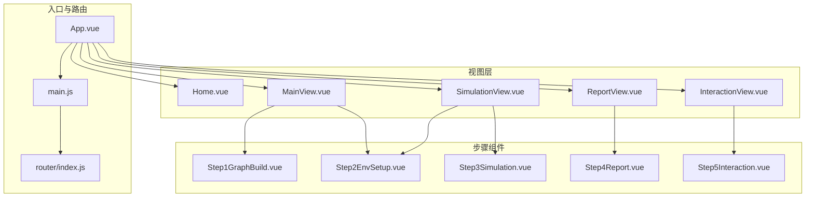
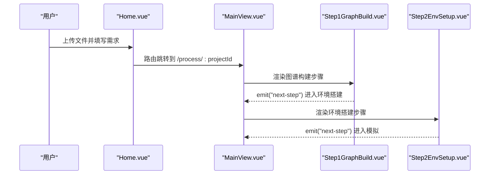
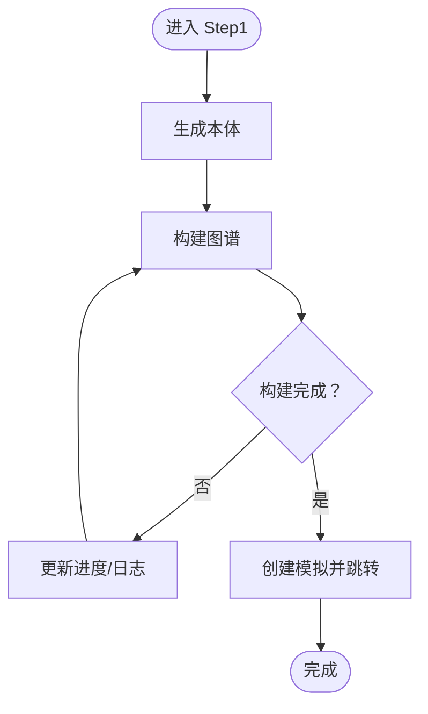
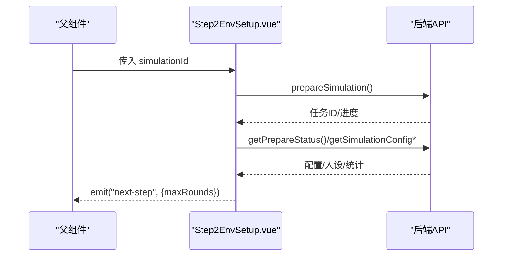
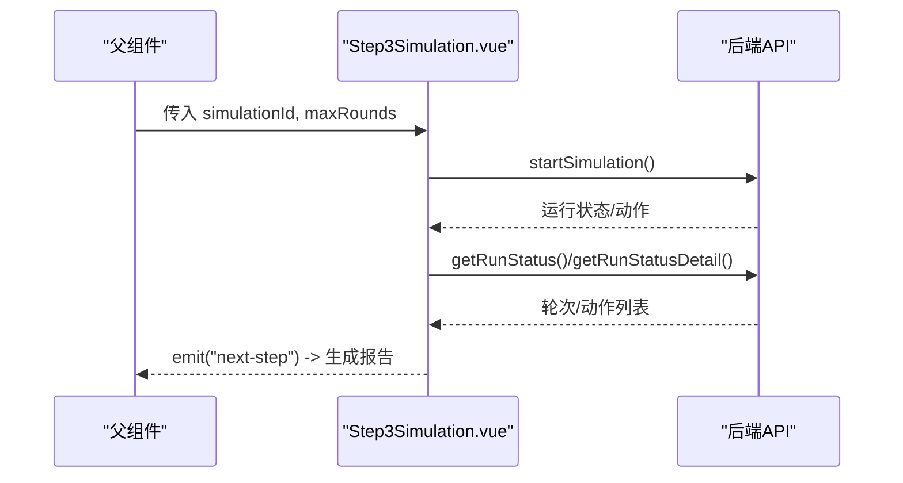
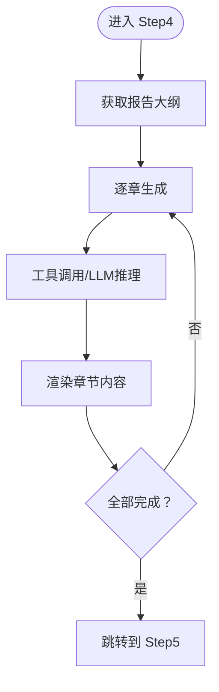
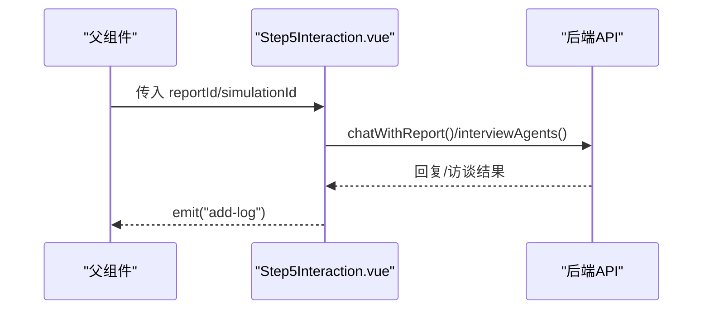
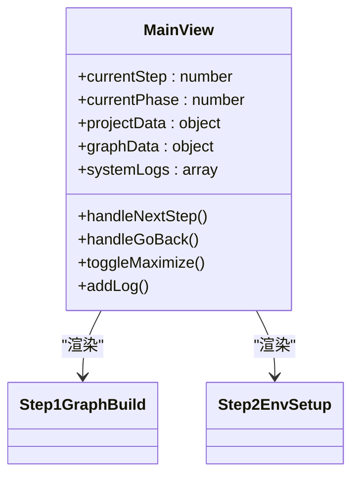
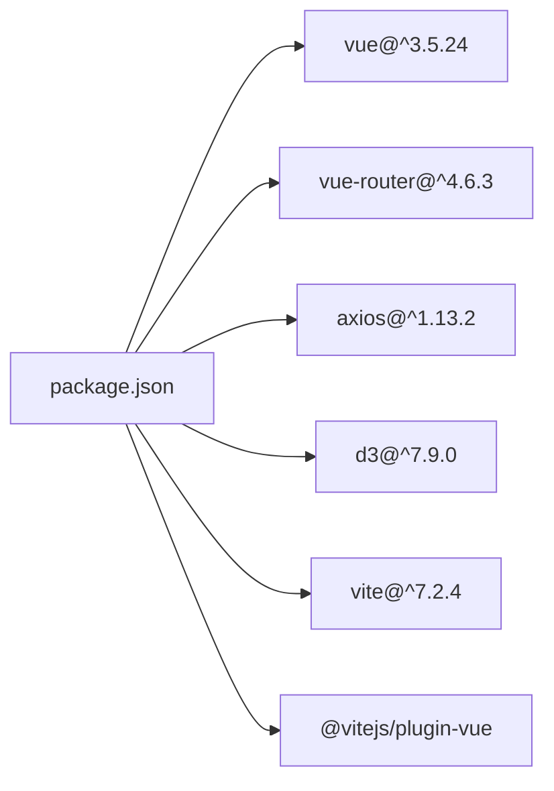

# 前端组件

<cite>
**本文档引用的文件**
- [frontend/src/App.vue](file://frontend/src/App.vue)
- [frontend/src/main.js](file://frontend/src/main.js)
- [frontend/package.json](file://frontend/package.json)
- [frontend/vite.config.js](file://frontend/vite.config.js)
- [frontend/src/router/index.js](file://frontend/src/router/index.js)
- [frontend/src/components/Step1GraphBuild.vue](file://frontend/src/components/Step1GraphBuild.vue)
- [frontend/src/components/Step2EnvSetup.vue](file://frontend/src/components/Step2EnvSetup.vue)
- [frontend/src/components/Step3Simulation.vue](file://frontend/src/components/Step3Simulation.vue)
- [frontend/src/components/Step4Report.vue](file://frontend/src/components/Step4Report.vue)
- [frontend/src/components/Step5Interaction.vue](file://frontend/src/components/Step5Interaction.vue)
- [frontend/src/views/Home.vue](file://frontend/src/views/Home.vue)
- [frontend/src/views/MainView.vue](file://frontend/src/views/MainView.vue)
- [frontend/src/views/SimulationView.vue](file://frontend/src/views/SimulationView.vue)
- [frontend/src/views/ReportView.vue](file://frontend/src/views/ReportView.vue)
- [frontend/src/views/InteractionView.vue](file://frontend/src/views/InteractionView.vue)
</cite>

## 目录
1. [简介](#简介)
2. [项目结构](#项目结构)
3. [核心组件](#核心组件)
4. [架构总览](#架构总览)
5. [详细组件分析](#详细组件分析)
6. [依赖分析](#依赖分析)
7. [性能考虑](#性能考虑)
8. [故障排查指南](#故障排查指南)
9. [结论](#结论)
10. [附录](#附录)

## 简介
本文件面向前端开发者，系统性梳理 MiroFish 前端组件体系，覆盖组件层次结构、设计原则、交互模式与数据流。文档重点解释各页面组件的功能、属性与事件，阐述组件间通信机制、状态传递与数据绑定方式；同时给出自定义选项、样式定制与主题支持建议，以及组件组合模式与复用策略，帮助团队高效协作与持续演进。

## 项目结构
前端采用 Vue 3 + Vite 架构，路由基于 vue-router，组件按功能拆分为步骤组件与视图组件两类，配合全局入口与路由配置实现端到端工作流。

**图表来源**
- [frontend/src/App.vue](file://frontend/src/App.vue#L1-L48)
- [frontend/src/main.js](file://frontend/src/main.js#L1-L10)
- [frontend/src/router/index.js](file://frontend/src/router/index.js#L1-L53)
- [frontend/src/views/MainView.vue](file://frontend/src/views/MainView.vue#L1-L541)
- [frontend/src/views/SimulationView.vue](file://frontend/src/views/SimulationView.vue#L1-L435)
- [frontend/src/views/ReportView.vue](file://frontend/src/views/ReportView.vue#L1-L349)
- [frontend/src/views/InteractionView.vue](file://frontend/src/views/InteractionView.vue#L1-L351)

**章节来源**
- [frontend/src/App.vue](file://frontend/src/App.vue#L1-L48)
- [frontend/src/main.js](file://frontend/src/main.js#L1-L10)
- [frontend/package.json](file://frontend/package.json#L1-L22)
- [frontend/vite.config.js](file://frontend/vite.config.js#L1-L19)
- [frontend/src/router/index.js](file://frontend/src/router/index.js#L1-L53)

## 核心组件
- 步骤组件：负责具体工作流阶段的可视化与交互，如 Step1GraphBuild、Step2EnvSetup、Step3Simulation、Step4Report、Step5Interaction。
- 视图组件：承载布局与视图切换逻辑，如 MainView、SimulationView、ReportView、InteractionView。
- 入口与路由：App.vue 作为根组件，main.js 注册路由，router/index.js 定义页面路由与参数。

关键特性
- 组件职责单一：步骤组件专注阶段内交互，视图组件专注布局与状态展示。
- 属性驱动：通过 props 接收上游数据，通过 emits 与父组件通信。
- 响应式数据：使用 ref/computed/watch 实现状态管理与联动。
- 事件驱动：通过 emit('next-step')、emit('add-log') 等事件向上冒泡，由父组件统一调度。

**章节来源**
- [frontend/src/components/Step1GraphBuild.vue](file://frontend/src/components/Step1GraphBuild.vue#L1-L699)
- [frontend/src/components/Step2EnvSetup.vue](file://frontend/src/components/Step2EnvSetup.vue#L1-L800)
- [frontend/src/components/Step3Simulation.vue](file://frontend/src/components/Step3Simulation.vue#L1-L800)
- [frontend/src/components/Step4Report.vue](file://frontend/src/components/Step4Report.vue#L1-L800)
- [frontend/src/components/Step5Interaction.vue](file://frontend/src/components/Step5Interaction.vue#L1-L800)
- [frontend/src/views/MainView.vue](file://frontend/src/views/MainView.vue#L1-L541)
- [frontend/src/views/SimulationView.vue](file://frontend/src/views/SimulationView.vue#L1-L435)
- [frontend/src/views/ReportView.vue](file://frontend/src/views/ReportView.vue#L1-L349)
- [frontend/src/views/InteractionView.vue](file://frontend/src/views/InteractionView.vue#L1-L351)

## 架构总览
整体采用“视图容器 + 步骤组件”的分层架构。视图容器负责布局、状态与日志，步骤组件负责阶段内的业务交互与数据流转。路由负责页面切换与参数传递。

**图表来源**
- [frontend/src/views/Home.vue](file://frontend/src/views/Home.vue#L291-L305)
- [frontend/src/views/MainView.vue](file://frontend/src/views/MainView.vue#L159-L176)
- [frontend/src/components/Step1GraphBuild.vue](file://frontend/src/components/Step1GraphBuild.vue#L205-L244)
- [frontend/src/components/Step2EnvSetup.vue](file://frontend/src/components/Step2EnvSetup.vue#L740-L755)

## 详细组件分析

### 步骤组件：Step1GraphBuild
- 功能定位：本体生成、图谱构建、构建进度与统计展示、系统日志滚动。
- 关键属性
  - currentPhase: number，阶段状态（-1: 上传, 0: 本体生成, 1: 构建, 2: 完成）
  - projectData: object，项目元数据
  - ontologyProgress: object，本体生成进度
  - buildProgress: object，图谱构建进度
  - graphData: object，图谱统计
  - systemLogs: array，系统日志
- 关键事件
  - emit('next-step'): 触发进入环境搭建
- 交互要点
  - 点击实体/关系标签弹出详情抽屉
  - 自动滚动日志面板
  - 创建 simulation 并跳转

**图表来源**
- [frontend/src/components/Step1GraphBuild.vue](file://frontend/src/components/Step1GraphBuild.vue#L196-L244)

**章节来源**
- [frontend/src/components/Step1GraphBuild.vue](file://frontend/src/components/Step1GraphBuild.vue#L1-L699)

### 步骤组件：Step2EnvSetup
- 功能定位：模拟实例初始化、Agent 人设生成、双平台模拟配置生成、初始激活编排、轮数配置（自动/自定义）。
- 关键属性
  - simulationId: string，来自父组件传入
  - projectData: object，项目数据
  - graphData: object，图谱数据
  - systemLogs: array，系统日志
- 关键事件
  - emit('go-back'): 返回上一步
  - emit('next-step', params): 进入模拟阶段（可携带 maxRounds）
  - emit('add-log'): 追加日志
  - emit('update-status'): 更新状态
- 交互要点
  - 轮询任务状态与配置生成
  - Agent 人设列表预览与详情弹窗
  - 双平台配置可视化展示
  - 自定义轮数滑杆与推荐值

**图表来源**
- [frontend/src/components/Step2EnvSetup.vue](file://frontend/src/components/Step2EnvSetup.vue#L644-L755)
- [frontend/src/components/Step2EnvSetup.vue](file://frontend/src/components/Step2EnvSetup.vue#L768-L800)

**章节来源**
- [frontend/src/components/Step2EnvSetup.vue](file://frontend/src/components/Step2EnvSetup.vue#L1-L800)

### 步骤组件：Step3Simulation
- 功能定位：双平台并行模拟运行，实时展示动作时间轴、平台状态与统计、报告生成入口。
- 关键属性
  - simulationId: string
  - maxRounds: number，来自 Step2 的轮数配置
  - minutesPerRound: number，默认 30
  - projectData/graphData/systemLogs: object/array
- 关键事件
  - emit('next-step'): 启动报告生成
  - emit('add-log'): 追加日志
  - emit('update-status'): 更新状态
- 交互要点
  - 启动/停止模拟
  - 轮询运行状态与动作明细
  - 动作时间轴自动滚动
  - 平台动作提示气泡

**图表来源**
- [frontend/src/components/Step3Simulation.vue](file://frontend/src/components/Step3Simulation.vue#L299-L311)
- [frontend/src/components/Step3Simulation.vue](file://frontend/src/components/Step3Simulation.vue#L379-L435)
- [frontend/src/components/Step3Simulation.vue](file://frontend/src/components/Step3Simulation.vue#L489-L531)

**章节来源**
- [frontend/src/components/Step3Simulation.vue](file://frontend/src/components/Step3Simulation.vue#L1-L800)

### 步骤组件：Step4Report
- 功能定位：报告生成工作流可视化，章节大纲与内容渲染，工具调用与 LLM 输出展示，控制台日志。
- 关键属性
  - reportId: string
  - simulationId: string
  - systemLogs: array
- 关键事件
  - emit('add-log'): 追加日志
  - emit('update-status'): 更新状态
- 交互要点
  - 章节展开/折叠
  - 工具调用与结果切换（结构化/原始）
  - LLM 响应展开/收起
  - 报告完成后跳转“深度互动”

**图表来源**
- [frontend/src/components/Step4Report.vue](file://frontend/src/components/Step4Report.vue#L399-L405)

**章节来源**
- [frontend/src/components/Step4Report.vue](file://frontend/src/components/Step4Report.vue#L1-L800)

### 步骤组件：Step5Interaction
- 功能定位：与 Report Agent 对话、与任意 Agent 对话、问卷调查、报告内容阅读。
- 关键属性
  - reportId: string
  - simulationId: string
- 关键事件
  - emit('add-log'): 追加日志
  - emit('update-status'): 更新状态
- 交互要点
  - 聊天模式与问卷模式切换
  - Agent 下拉选择与资料展开
  - 问卷目标选择与结果展示
  - Markdown 渲染与滚动

**图表来源**
- [frontend/src/components/Step5Interaction.vue](file://frontend/src/components/Step5Interaction.vue#L418-L423)
- [frontend/src/components/Step5Interaction.vue](file://frontend/src/components/Step5Interaction.vue#L614-L743)

**章节来源**
- [frontend/src/components/Step5Interaction.vue](file://frontend/src/components/Step5Interaction.vue#L1-L800)

### 视图组件：MainView
- 功能定位：工作台布局，左侧图谱面板，右侧步骤组件，视图模式切换（图谱/双栏/工作台），工作流状态指示。
- 关键属性
  - currentStep: number，当前步骤（1-5）
  - currentPhase: number，阶段状态
  - projectData/graphData/systemLogs: object/array
- 关键方法
  - handleNextStep/handleGoBack：步骤推进/回退
  - toggleMaximize：视图最大化切换
  - addLog：系统日志追加
- 数据逻辑
  - 新建项目：读取 pendingUpload，发起本体生成与图谱构建
  - 加载项目：根据状态推进到对应阶段并轮询

**图表来源**
- [frontend/src/views/MainView.vue](file://frontend/src/views/MainView.vue#L77-L404)
- [frontend/src/components/Step1GraphBuild.vue](file://frontend/src/components/Step1GraphBuild.vue#L196-L205)
- [frontend/src/components/Step2EnvSetup.vue](file://frontend/src/components/Step2EnvSetup.vue#L644-L651)

**章节来源**
- [frontend/src/views/MainView.vue](file://frontend/src/views/MainView.vue#L1-L541)

### 视图组件：SimulationView
- 功能定位：环境搭建阶段专用视图，左侧图谱，右侧 Step2EnvSetup，状态指示与返回/前进。
- 关键方法
  - checkAndStopRunningSimulation：返回时关闭/停止模拟
  - handleNextStep：携带 maxRounds 跳转 Step3

**章节来源**
- [frontend/src/views/SimulationView.vue](file://frontend/src/views/SimulationView.vue#L1-L435)

### 视图组件：ReportView
- 功能定位：报告生成阶段视图，左侧图谱，右侧 Step4Report。
- 关键方法
  - loadReportData：根据 reportId 获取 simulationId 并加载图谱数据

**章节来源**
- [frontend/src/views/ReportView.vue](file://frontend/src/views/ReportView.vue#L1-L349)

### 视图组件：InteractionView
- 功能定位：深度互动阶段视图，左侧图谱，右侧 Step5Interaction。
- 关键方法
  - loadReportData：根据 reportId 获取 simulationId 并加载图谱数据

**章节来源**
- [frontend/src/views/InteractionView.vue](file://frontend/src/views/InteractionView.vue#L1-L351)

## 依赖分析
- 运行时依赖
  - vue: 3.x，Composition API 与响应式系统
  - vue-router: 4.x，页面路由与参数传递
  - axios: 1.x，HTTP 请求封装
  - d3: 7.x，图谱可视化（由 GraphPanel 使用）
- 构建依赖
  - vite: 7.x，开发服务器与打包
  - @vitejs/plugin-vue: Vue 单文件组件支持
- 开发代理
  - /api 代理到后端服务端口，便于前后端联调

**图表来源**
- [frontend/package.json](file://frontend/package.json#L11-L21)

**章节来源**
- [frontend/package.json](file://frontend/package.json#L1-L22)
- [frontend/vite.config.js](file://frontend/vite.config.js#L1-L19)

## 性能考虑
- 组件渲染
  - 使用 v-show/v-if 控制复杂面板（如报告章节、Agent 详情）的渲染时机，减少不必要的 DOM。
  - 列表渲染使用 key，避免重复渲染与闪烁。
- 数据轮询
  - 合理设置轮询间隔（如 2s/10s），并在组件卸载时及时清理定时器，防止内存泄漏。
- 图谱渲染
  - GraphPanel 使用 D3，建议在数据量较大时采用分页/抽样策略或虚拟化手段。
- 日志与时间轴
  - 限制日志数组长度，避免内存暴涨；时间轴仅在需要时滚动，避免频繁重排。
- 样式与主题
  - 使用 CSS 变量与 scoped 样式，避免全局污染；主题色与字体族集中管理，便于统一替换。

## 故障排查指南
- 路由与参数
  - 确认路由参数是否正确传入（如 :projectId/:simulationId/:reportId），避免空指针访问。
- 状态与轮询
  - 若模拟未开始或状态异常，检查轮询函数是否启动与清理；确认后端任务状态与前端状态一致。
- API 错误
  - 统一在组件内捕获异常并调用 addLog 记录错误信息，便于定位。
- 事件冒泡
  - 确保 emit('next-step') 等事件在正确时机触发，并在父组件中接收与处理。

**章节来源**
- [frontend/src/views/MainView.vue](file://frontend/src/views/MainView.vue#L382-L404)
- [frontend/src/components/Step3Simulation.vue](file://frontend/src/components/Step3Simulation.vue#L474-L483)

## 结论
MiroFish 前端采用清晰的“视图容器 + 步骤组件”分层架构，围绕工作流的五个阶段提供了高内聚、低耦合的组件模块。通过 props/emit 的约定式通信、响应式状态与事件驱动，实现了从上传到深度互动的完整闭环。建议在后续迭代中进一步完善组件文档与测试覆盖，持续优化性能与用户体验。

## 附录

### 组件使用指南与最佳实践
- 组件复用
  - 将公共逻辑抽象为 Composables（如轮询、日志管理），在多个步骤组件中共享。
- 自定义选项
  - 通过 props 暴露关键配置（如 maxRounds、字体/颜色主题），在父组件中集中管理。
- 样式定制
  - 使用 CSS 变量统一管理主题色与字号；为复杂面板提供 scoped 样式与过渡动画。
- 主题支持
  - 提供明暗主题切换开关，通过根元素类名或 CSS 变量切换，保证一致性。
- 响应式设计
  - 使用媒体查询与弹性布局适配不同屏幕尺寸；移动端优先时注意触摸交互与点击热区。
- 跨浏览器兼容
  - 关注 ES 特性与 polyfill；对较老浏览器提供降级方案（如 Promise、fetch）。

### 组件组合模式
- 视图容器 + 步骤组件：视图容器负责布局与状态，步骤组件负责阶段内交互。
- 事件驱动：通过 emit('next-step')、emit('add-log') 实现父子组件解耦。
- 数据下钻：父组件聚合数据，子组件按需消费，避免跨层级访问。