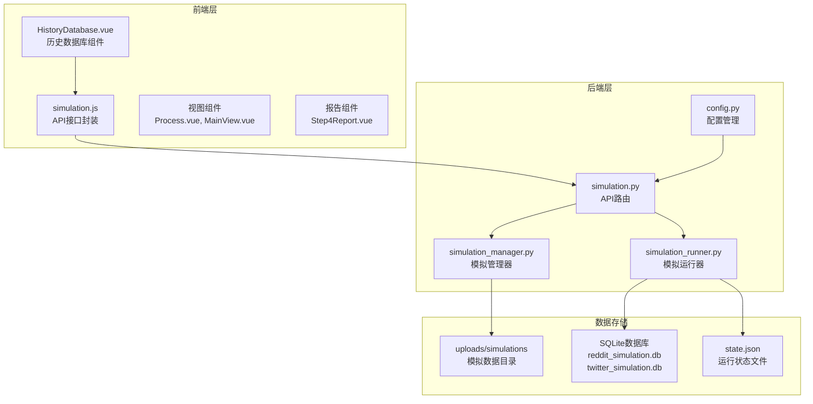
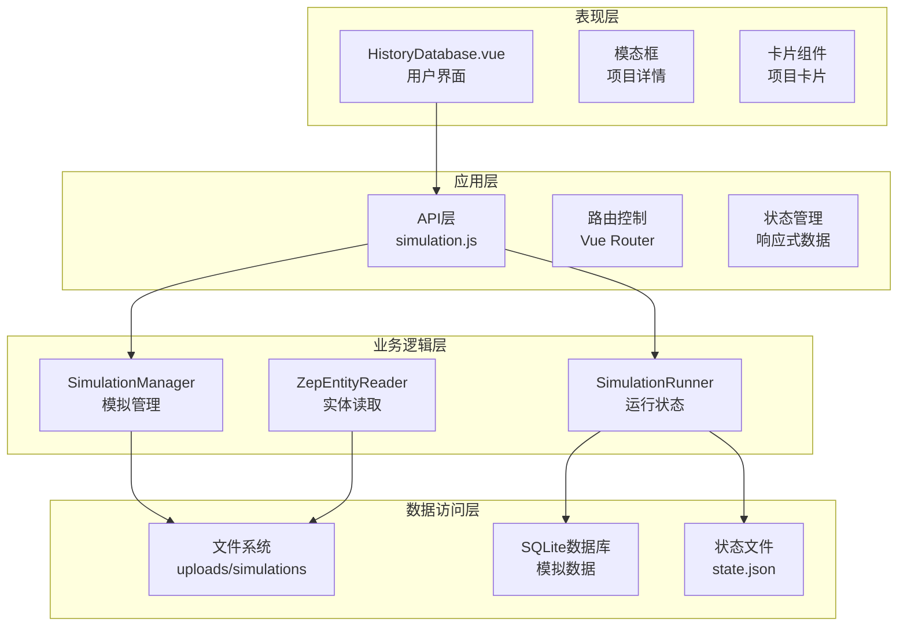
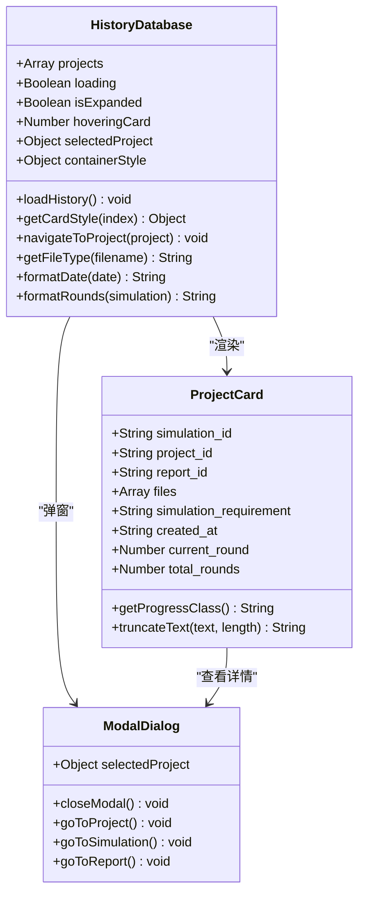
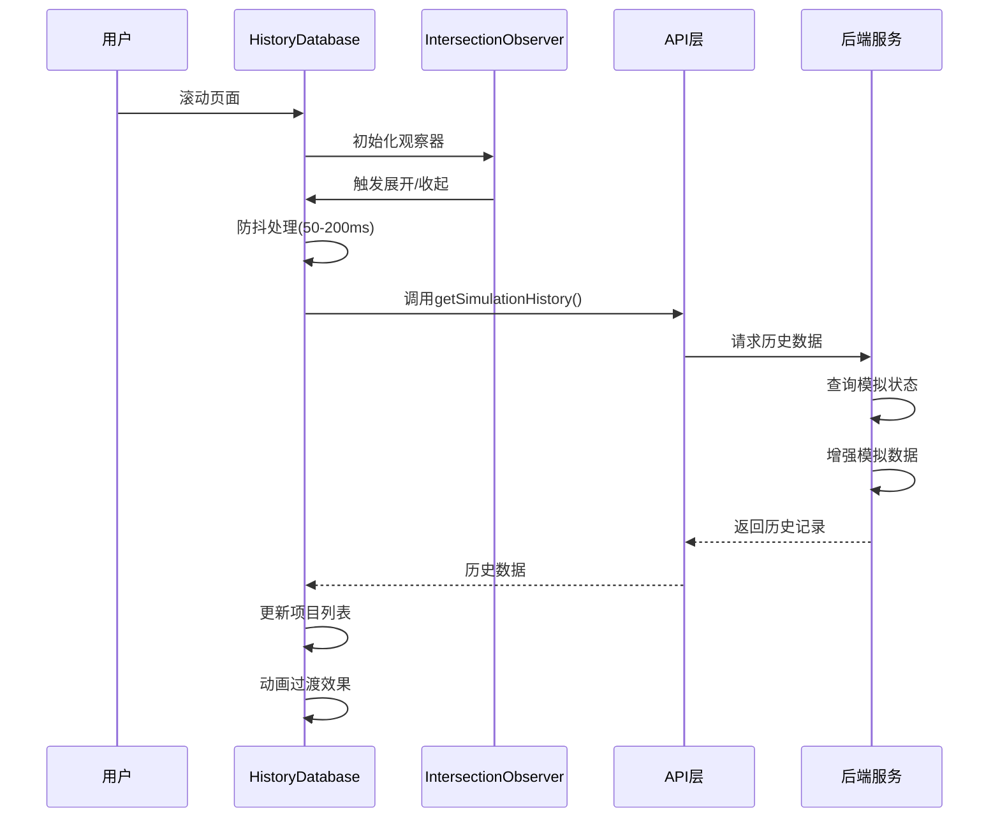
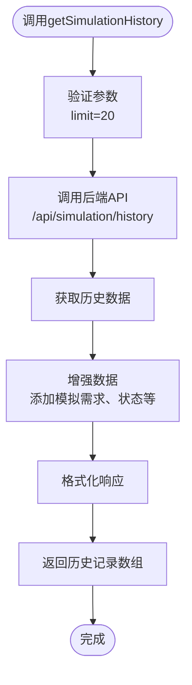
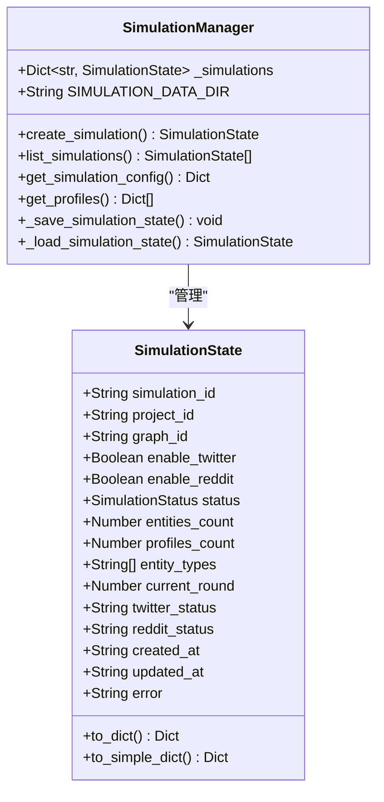
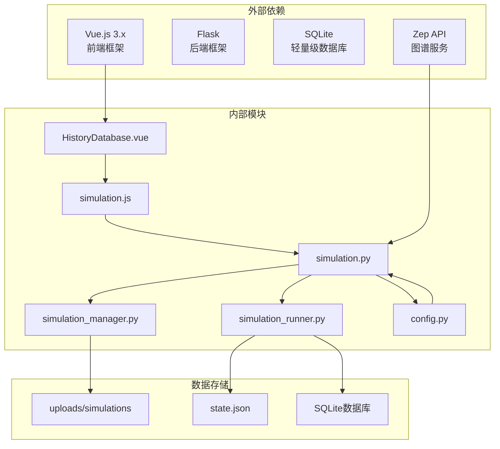
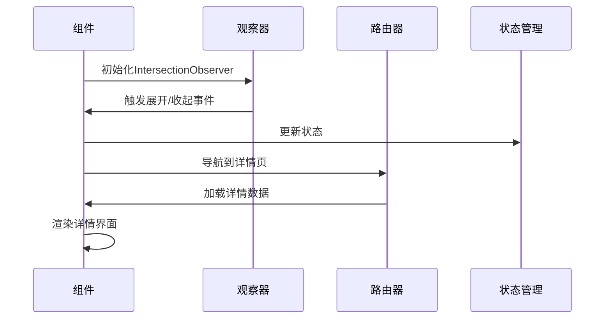

# 历史数据库组件

<cite>
**本文引用的文件**
- [HistoryDatabase.vue](file://frontend/src/components/HistoryDatabase.vue)
- [simulation.js](file://frontend/src/api/simulation.js)
- [simulation.py](file://backend/app/api/simulation.py)
- [simulation_manager.py](file://backend/app/services/simulation_manager.py)
- [simulation_runner.py](file://backend/app/services/simulation_runner.py)
- [config.py](file://backend/app/config.py)
- [Step4Report.vue](file://frontend/src/components/Step4Report.vue)
- [Process.vue](file://frontend/src/views/Process.vue)
- [MainView.vue](file://frontend/src/views/MainView.vue)
- [Step2EnvSetup.vue](file://frontend/src/components/Step2EnvSetup.vue)
</cite>

## 目录
1. [简介](#简介)
2. [项目结构](#项目结构)
3. [核心组件](#核心组件)
4. [架构概览](#架构概览)
5. [详细组件分析](#详细组件分析)
6. [依赖分析](#依赖分析)
7. [性能考虑](#性能考虑)
8. [故障排除指南](#故障排除指南)
9. [结论](#结论)
10. [附录](#附录)

## 简介
历史数据库组件是MiroFish系统中用于管理、存储和展示历史模拟记录的核心模块。它提供了完整的生命周期管理能力，包括历史数据的收集、增强、存储、检索和可视化展示。该组件支持多维度的历史数据管理，涵盖模拟项目、运行状态、文件关联、报告生成等多个方面。

组件采用前后端分离架构，前端负责用户界面交互和数据展示，后端提供RESTful API接口和数据持久化服务。通过智能的数据增强机制，历史记录不仅包含基础信息，还能提供丰富的上下文数据，如模拟需求、运行状态、文件关联等。

## 项目结构
历史数据库组件在MiroFish项目中采用模块化设计，主要分布在以下目录：

**图表来源**
- [HistoryDatabase.vue](file://frontend/src/components/HistoryDatabase.vue#L1-L191)
- [simulation.py](file://backend/app/api/simulation.py#L1-L200)
- [simulation_manager.py](file://backend/app/services/simulation_manager.py#L125-L143)

**章节来源**
- [HistoryDatabase.vue](file://frontend/src/components/HistoryDatabase.vue#L1-L191)
- [simulation.js](file://frontend/src/api/simulation.js#L180-L188)
- [simulation.py](file://backend/app/api/simulation.py#L880-L983)

## 核心组件
历史数据库组件由多个相互协作的子组件构成，每个组件都有明确的职责分工：

### 历史数据库展示组件
HistoryDatabase.vue是前端的核心展示组件，负责历史记录的可视化呈现。该组件实现了复杂的交互逻辑，包括卡片式布局、动态展开效果、文件类型识别等功能。

### API接口层
frontend/src/api/simulation.js封装了所有与历史数据库相关的API调用，提供了统一的接口访问方式。该层包含了历史记录查询、模拟状态获取、配置信息读取等核心功能。

### 后端服务层
后端通过多个服务类提供历史数据管理能力：
- SimulationManager：模拟管理器，负责模拟状态的持久化和检索
- SimulationRunner：模拟运行器，负责运行时状态的实时跟踪
- ZepGraphMemoryUpdater：图谱内存更新器，支持历史数据的增量更新

**章节来源**
- [HistoryDatabase.vue](file://frontend/src/components/HistoryDatabase.vue#L193-L569)
- [simulation.js](file://frontend/src/api/simulation.js#L1-L188)
- [simulation_manager.py](file://backend/app/services/simulation_manager.py#L114-L200)

## 架构概览
历史数据库组件采用分层架构设计，确保了良好的可维护性和扩展性：

**图表来源**
- [HistoryDatabase.vue](file://frontend/src/components/HistoryDatabase.vue#L193-L210)
- [simulation.py](file://backend/app/api/simulation.py#L164-L200)
- [simulation_manager.py](file://backend/app/services/simulation_manager.py#L114-L137)

## 详细组件分析

### 历史数据库展示组件分析
HistoryDatabase.vue是整个历史数据库组件的核心UI组件，实现了丰富的交互功能和视觉效果。

#### 组件架构设计
组件采用响应式设计，支持多种显示模式和交互状态：

**图表来源**
- [HistoryDatabase.vue](file://frontend/src/components/HistoryDatabase.vue#L193-L435)

#### 数据流处理机制
组件实现了复杂的数据流处理逻辑，包括Intersection Observer的使用来优化性能：

**图表来源**
- [HistoryDatabase.vue](file://frontend/src/components/HistoryDatabase.vue#L437-L532)
- [simulation.js](file://frontend/src/api/simulation.js#L180-L186)

#### 文件类型识别与展示
组件内置了智能的文件类型识别系统，能够自动识别不同类型的文件并提供相应的视觉标识：

| 文件类型 | 扩展名示例 | 视觉标识 |
|---------|-----------|----------|
| PDF文档 | pdf | 📄 |
| Word文档 | doc, docx | 📄 |
| Excel表格 | xls, xlsx, csv | 📊 |
| PowerPoint | ppt, pptx | 🎯 |
| 文本文件 | txt, md, json | 📝 |
| 图片文件 | jpg, jpeg, png, gif | 🖼️ |
| 压缩包 | zip, rar, 7z | 📦 |

**章节来源**
- [HistoryDatabase.vue](file://frontend/src/components/HistoryDatabase.vue#L360-L392)

### API接口层分析
frontend/src/api/simulation.js提供了完整的API接口封装，支持历史数据库的所有核心功能。

#### 历史记录查询接口
getSimulationHistory()接口是历史数据库的核心入口，负责获取历史模拟记录：

**图表来源**
- [simulation.js](file://frontend/src/api/simulation.js#L180-L186)
- [simulation.py](file://backend/app/api/simulation.py#L906-L974)

#### 数据增强机制
后端服务实现了智能的数据增强功能，为每个历史记录添加丰富的上下文信息：

| 增强字段 | 数据来源 | 描述 |
|---------|---------|------|
| simulation_requirement | simulation_config.json | 模拟需求描述 |
| total_simulation_hours | time_config | 总模拟时长 |
| current_round | run_state.json | 当前轮次 |
| total_rounds | 推荐计算 | 总轮次数 |
| files | 项目文件 | 关联文件列表 |
| report_id | 报告查找 | 最新报告ID |

**章节来源**
- [simulation.py](file://backend/app/api/simulation.py#L912-L968)

### 后端服务层分析
后端通过多个专业化的服务类提供历史数据管理能力。

#### 模拟管理器
SimulationManager是历史数据管理的核心服务，负责模拟状态的持久化和检索：

**图表来源**
- [simulation_manager.py](file://backend/app/services/simulation_manager.py#L114-L200)

#### 模拟运行器
SimulationRunner负责运行时状态的实时跟踪和历史数据的生成：

| 运行状态 | 描述 | 用途 |
|---------|------|------|
| CREATED | 已创建 | 模拟初始化阶段 |
| PREPARING | 准备中 | 配置生成和资源准备 |
| READY | 已就绪 | 等待开始运行 |
| RUNNING | 运行中 | 模拟执行阶段 |
| PAUSED | 已暂停 | 暂停状态 |
| STOPPED | 已停止 | 手动停止 |
| COMPLETED | 已完成 | 自然结束 |
| FAILED | 已失败 | 执行失败 |

**章节来源**
- [simulation_runner.py](file://backend/app/services/simulation_runner.py#L35-L45)

## 依赖分析
历史数据库组件的依赖关系清晰且层次分明，确保了系统的稳定性和可维护性。

**图表来源**
- [HistoryDatabase.vue](file://frontend/src/components/HistoryDatabase.vue#L193-L196)
- [simulation.py](file://backend/app/api/simulation.py#L1-L20)
- [config.py](file://backend/app/config.py#L35-L37)

**章节来源**
- [config.py](file://backend/app/config.py#L1-L76)
- [simulation_manager.py](file://backend/app/services/simulation_manager.py#L1-L22)

## 性能考虑
历史数据库组件在设计时充分考虑了性能优化，采用了多种策略来提升用户体验：

### 前端性能优化
1. **Intersection Observer优化**：使用Intersection Observer API替代传统的滚动监听，减少DOM操作频率
2. **防抖机制**：展开/收起操作采用50-200ms的防抖延迟，避免频繁动画切换
3. **虚拟滚动**：对于大量历史记录，采用虚拟滚动技术减少DOM节点数量
4. **懒加载**：图片和文件图标采用懒加载策略

### 后端性能优化
1. **状态缓存**：内存中缓存模拟状态，减少文件I/O操作
2. **批量查询**：历史记录查询支持批量获取，减少网络往返
3. **数据分页**：默认限制返回20条记录，支持分页加载
4. **智能索引**：SQLite数据库建立适当的索引提高查询效率

### 缓存策略
组件实现了多层次的缓存机制：
- **内存缓存**：模拟状态在内存中缓存
- **文件缓存**：状态文件定期刷新
- **浏览器缓存**：静态资源利用浏览器缓存

## 故障排除指南
历史数据库组件可能遇到的常见问题及解决方案：

### 历史记录无法加载
**症状**：页面显示空白或加载状态持续
**可能原因**：
1. 后端服务未启动
2. API接口访问失败
3. 数据库连接异常

**解决步骤**：
1. 检查后端服务日志
2. 验证API接口连通性
3. 确认数据库文件存在

### 文件类型识别错误
**症状**：文件图标显示不正确
**可能原因**：
1. 文件扩展名缺失
2. 新文件类型未支持

**解决步骤**：
1. 检查文件扩展名格式
2. 更新文件类型映射表

### 性能问题
**症状**：页面卡顿或响应缓慢
**可能原因**：
1. 历史记录过多
2. 动画效果影响性能

**解决步骤**：
1. 启用虚拟滚动
2. 减少同时渲染的卡片数量
3. 调整动画参数

**章节来源**
- [HistoryDatabase.vue](file://frontend/src/components/HistoryDatabase.vue#L437-L532)
- [simulation.py](file://backend/app/api/simulation.py#L976-L982)

## 结论
历史数据库组件是MiroFish系统中不可或缺的重要组成部分，它通过精心设计的架构和完善的实现，为用户提供了强大而易用的历史数据管理能力。组件具有以下显著特点：

1. **完整的生命周期管理**：从数据收集到展示的全流程覆盖
2. **智能的数据增强**：为历史记录提供丰富的上下文信息
3. **优秀的用户体验**：流畅的动画效果和直观的界面设计
4. **高性能的实现**：采用多种优化策略确保系统性能
5. **良好的可扩展性**：模块化设计便于功能扩展和维护

该组件的成功实现为MiroFish系统的整体功能奠定了坚实的基础，为用户提供了可靠的历史数据管理解决方案。

## 附录

### 配置选项
历史数据库组件支持以下配置选项：

| 配置项 | 类型 | 默认值 | 描述 |
|-------|------|--------|------|
| OASIS_DEFAULT_MAX_ROUNDS | Integer | 10 | 默认最大轮次数 |
| OASIS_SIMULATION_DATA_DIR | String | uploads/simulations | 模拟数据存储目录 |
| LLM_API_KEY | String | - | LLM API密钥 |
| ZEP_API_KEY | String | - | Zep API密钥 |

### API接口规范
组件提供以下核心API接口：

| 接口名称 | 方法 | 路径 | 功能描述 |
|---------|------|------|----------|
| 获取历史记录 | GET | /api/simulation/history | 获取历史模拟记录 |
| 创建模拟 | POST | /api/simulation/create | 创建新的模拟 |
| 准备模拟 | POST | /api/simulation/prepare | 准备模拟环境 |
| 启动模拟 | POST | /api/simulation/start | 启动模拟运行 |
| 获取模拟状态 | GET | /api/simulation/:id/run-status | 获取运行状态 |

### 事件监听机制
组件支持以下事件监听：

**图表来源**
- [HistoryDatabase.vue](file://frontend/src/components/HistoryDatabase.vue#L534-L555)