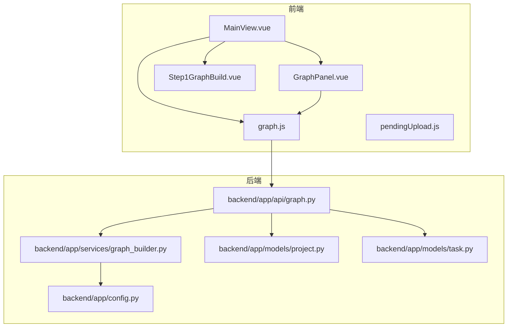
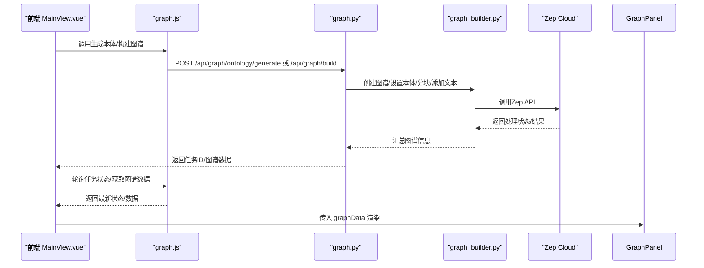
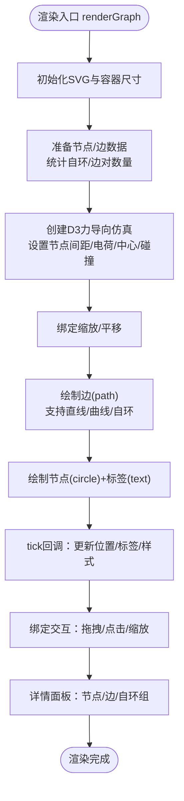
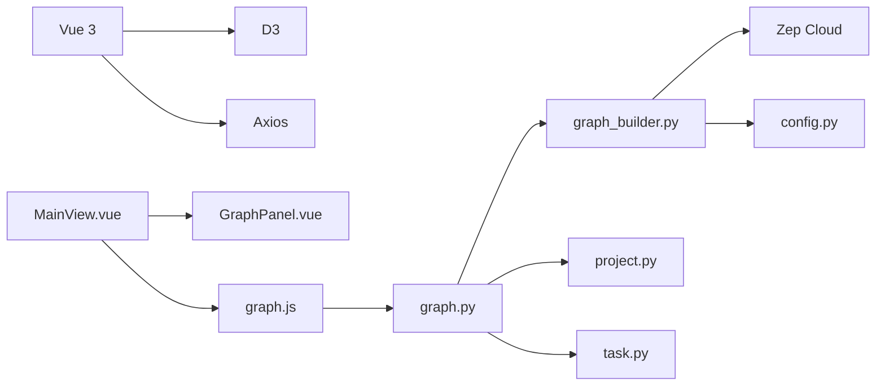

# 图谱面板组件

<cite>
**本文引用的文件**
- [GraphPanel.vue](file://frontend/src/components/GraphPanel.vue)
- [graph.js](file://frontend/src/api/graph.js)
- [graph.py](file://backend/app/api/graph.py)
- [graph_builder.py](file://backend/app/services/graph_builder.py)
- [MainView.vue](file://frontend/src/views/MainView.vue)
- [project.py](file://backend/app/models/project.py)
- [task.py](file://backend/app/models/task.py)
- [config.py](file://backend/app/config.py)
- [Step1GraphBuild.vue](file://frontend/src/components/Step1GraphBuild.vue)
- [pendingUpload.js](file://frontend/src/store/pendingUpload.js)
- [package.json](file://frontend/package.json)
</cite>

## 目录
1. [简介](#简介)
2. [项目结构](#项目结构)
3. [核心组件](#核心组件)
4. [架构总览](#架构总览)
5. [详细组件分析](#详细组件分析)
6. [依赖分析](#依赖分析)
7. [性能考虑](#性能考虑)
8. [故障排查指南](#故障排查指南)
9. [结论](#结论)
10. [附录](#附录)

## 简介
本技术文档围绕 MiroFish 的“图谱面板组件”展开，系统性阐述其设计架构、渲染引擎、交互功能与数据流。该组件负责将后端提供的知识图谱数据以 SVG + D3 的方式可视化呈现，支持节点与边的样式配置、力导向布局、曲线边与标签、缩放与平移、节点/边选择与详情面板、自环边聚合展示、边标签开关等功能。同时，文档还给出图谱数据格式、API 接口与事件处理规范，以及组件定制与扩展建议，帮助开发者快速理解与二次开发。

## 项目结构
- 前端采用 Vue 3 + Vite，使用 D3 进行图渲染；后端基于 Flask，通过 Zep Cloud 构建知识图谱。
- 图谱面板组件位于前端组件目录，配合主视图与步骤组件协同工作，主视图负责项目生命周期与轮询拉取图谱数据。

图表来源
- [MainView.vue](file://frontend/src/views/MainView.vue#L39-L73)
- [GraphPanel.vue](file://frontend/src/components/GraphPanel.vue#L1-L236)
- [graph.js](file://frontend/src/api/graph.js#L1-L71)
- [graph.py](file://backend/app/api/graph.py#L1-L618)
- [graph_builder.py](file://backend/app/services/graph_builder.py#L1-L500)
- [project.py](file://backend/app/models/project.py#L1-L306)
- [task.py](file://backend/app/models/task.py#L1-L185)
- [config.py](file://backend/app/config.py#L1-L76)

章节来源
- [MainView.vue](file://frontend/src/views/MainView.vue#L39-L73)
- [GraphPanel.vue](file://frontend/src/components/GraphPanel.vue#L1-L236)
- [graph.js](file://frontend/src/api/graph.js#L1-L71)
- [graph.py](file://backend/app/api/graph.py#L1-L618)
- [graph_builder.py](file://backend/app/services/graph_builder.py#L1-L500)
- [project.py](file://backend/app/models/project.py#L1-L306)
- [task.py](file://backend/app/models/task.py#L1-L185)
- [config.py](file://backend/app/config.py#L1-L76)

## 核心组件
- 图谱面板组件（GraphPanel.vue）
  - 负责接收图谱数据，使用 D3 力导向布局渲染节点与边，支持曲线边、自环边、边标签、节点拖拽、缩放平移、详情面板等。
  - 对外暴露刷新与最大化事件，内部维护加载状态、边标签开关、自环展开状态等。
- 主视图（MainView.vue）
  - 协调项目生命周期：从本体生成、图谱构建到图谱数据拉取与轮询，驱动 GraphPanel 渲染。
  - 提供视图模式切换（图谱/双栏/工作台）与状态指示。
- API 层（graph.js）
  - 封装前端与后端交互，提供生成本体、构建图谱、查询任务状态、获取图谱数据等方法。
- 后端 API（graph.py）
  - 提供项目管理、本体生成、图谱构建、任务查询、图谱数据获取等接口。
- 图谱构建服务（graph_builder.py）
  - 基于 Zep Cloud 的图谱构建与数据获取，负责分块、本体设置、批量添加文本、等待处理完成、汇总统计。
- 项目与任务模型（project.py, task.py）
  - 项目状态机与任务状态管理，支撑前端轮询与状态展示。
- 配置（config.py）
  - 统一加载 .env，提供 ZEP_API_KEY、LLM 配置、上传与分块参数等。

章节来源
- [GraphPanel.vue](file://frontend/src/components/GraphPanel.vue#L238-L814)
- [MainView.vue](file://frontend/src/views/MainView.vue#L77-L404)
- [graph.js](file://frontend/src/api/graph.js#L1-L71)
- [graph.py](file://backend/app/api/graph.py#L1-L618)
- [graph_builder.py](file://backend/app/services/graph_builder.py#L1-L500)
- [project.py](file://backend/app/models/project.py#L1-L306)
- [task.py](file://backend/app/models/task.py#L1-L185)
- [config.py](file://backend/app/config.py#L1-L76)

## 架构总览
从前端到后端的数据流如下：
- 前端通过 graph.js 调用后端 graph.py 的接口，完成本体生成与图谱构建。
- 构建过程中，后端通过 graph_builder.py 与 Zep Cloud 交互，分批添加文本并等待处理完成。
- 构建完成后，前端轮询获取图谱数据，GraphPanel 接收数据并渲染。

图表来源
- [MainView.vue](file://frontend/src/views/MainView.vue#L271-L373)
- [graph.js](file://frontend/src/api/graph.js#L8-L70)
- [graph.py](file://backend/app/api/graph.py#L121-L524)
- [graph_builder.py](file://backend/app/services/graph_builder.py#L186-L494)

章节来源
- [MainView.vue](file://frontend/src/views/MainView.vue#L271-L373)
- [graph.js](file://frontend/src/api/graph.js#L8-L70)
- [graph.py](file://backend/app/api/graph.py#L121-L524)
- [graph_builder.py](file://backend/app/services/graph_builder.py#L186-L494)

## 详细组件分析

### 图谱面板组件（GraphPanel.vue）
- 数据输入
  - graphData：包含 nodes 与 edges 的完整图谱数据；loading：加载状态；currentPhase/isSimulating：用于提示构建/模拟状态。
- 渲染流程
  - 初始化 D3 力导向仿真，设置节点与边的初始位置。
  - 使用 SVG path 绘制边，支持直线与二次贝塞尔曲线；自环边使用圆弧路径。
  - 节点使用 circle，节点标签使用 text；边标签使用 rect+text 并居中定位。
  - tick 回调中更新节点、边与边标签的位置与样式。
- 交互功能
  - 缩放与平移：启用 d3.zoom，g 组合元素随变换平移缩放。
  - 节点拖拽：d3.drag，拖拽阈值判断，拖拽时重启仿真 alphaTarget，释放时恢复。
  - 选择高亮：点击节点/边时高亮对应元素与连接边；点击空白处关闭详情。
  - 详情面板：点击节点/边弹出详情面板，支持自环组聚合与展开。
  - 边标签开关：通过 showEdgeLabels 控制边标签与背景的显示。
- 动画与布局
  - 力导向仿真：charge、center、collide、x/y 吸引力等，节点间距根据边数量动态调整。
  - 曲线边：多条边时按对节点边数均匀分布曲率，避免重叠。
- 状态与提示
  - 构建中/模拟中提示：底部居中提示，带呼吸动画。
  - 模拟结束后提示：建议稍后手动刷新。
  - 实体类型图例：基于节点标签生成颜色映射与计数。
- 事件与生命周期
  - mounted：注册窗口 resize 监听；unmounted：清理仿真与监听。
  - watch(graphData)：深监听，数据变化时重新渲染。
  - watch(showEdgeLabels)：动态控制边标签显隐。

图表来源
- [GraphPanel.vue](file://frontend/src/components/GraphPanel.vue#L328-L784)

章节来源
- [GraphPanel.vue](file://frontend/src/components/GraphPanel.vue#L238-L814)

### 数据格式与API

- 图谱数据格式（graphData）
  - nodes：节点数组，字段示例：uuid、name、labels、summary、attributes、created_at。
  - edges：边数组，字段示例：uuid、name、fact、fact_type、source_node_uuid、target_node_uuid、source_node_name、target_node_name、attributes、created_at、valid_at、invalid_at、expired_at、episodes。
  - node_count/edge_count：统计计数。
- API 接口
  - 生成本体：POST /api/graph/ontology/generate（multipart/form-data，含 files、simulation_requirement、project_name、additional_context）。
  - 构建图谱：POST /api/graph/build（project_id、graph_name、chunk_size、chunk_overlap）。
  - 查询任务：GET /api/graph/task/{task_id}。
  - 获取图谱数据：GET /api/graph/data/{graph_id}。
  - 获取项目：GET /api/graph/project/{project_id}。
  - 删除图谱：DELETE /api/graph/delete/{graph_id}。

章节来源
- [graph_builder.py](file://backend/app/services/graph_builder.py#L419-L494)
- [graph.py](file://backend/app/api/graph.py#L121-L590)
- [graph.js](file://frontend/src/api/graph.js#L8-L70)

### 交互与事件处理
- 前端事件
  - GraphPanel 暴露 refresh/toggle-maximize 事件，由父组件 MainView 监听并处理。
  - 父组件 MainView 负责项目状态推进、轮询任务与图谱数据、触发刷新。
- 用户交互
  - 节点点击：高亮节点与关联边，打开详情面板。
  - 边点击：高亮边与背景标签，打开详情面板。
  - 自环组：支持展开/折叠，逐项查看细节。
  - 边标签开关：右上角开关控制边标签显隐。
  - 缩放/平移：鼠标滚轮缩放，拖拽平移。
  - 节点拖拽：拖动节点改变布局，拖拽阈值避免误触。

章节来源
- [GraphPanel.vue](file://frontend/src/components/GraphPanel.vue#L578-L783)
- [MainView.vue](file://frontend/src/views/MainView.vue#L375-L380)

### 样式与布局配置
- 节点样式
  - 圆形节点，半径固定，按实体类型映射颜色；悬停/选中时描边加粗与变色。
- 边样式
  - 线宽固定，颜色统一；自环边使用圆弧路径；多条边按对节点边数分布曲率。
- 边标签
  - 白色背景矩形+文本，居中定位；可开关显隐。
- 详情面板
  - 右侧浮动面板，支持节点属性、摘要、标签、边事实、时间戳、自环组等。
- 图例
  - 左下角实体类型图例，颜色与计数。

章节来源
- [GraphPanel.vue](file://frontend/src/components/GraphPanel.vue#L466-L784)

### 动画与性能
- 力导向仿真
  - charge、center、collide、x/y 吸引力共同作用，节点间距随边数动态调整，提升可读性。
- tick 更新
  - 每帧更新节点位置、边路径与边标签位置，保持视觉一致性。
- 交互优化
  - 拖拽阈值避免误触发；拖拽时重启仿真，释放后平滑停止。
  - 边标签仅在需要时显示，减少 DOM 元素数量。

章节来源
- [GraphPanel.vue](file://frontend/src/components/GraphPanel.vue#L471-L774)

### 自环边与多关系处理
- 自环边聚合
  - 同一节点的多条自环边被合并为一条“自环组”，并在详情面板中展开查看。
- 多条边
  - 对同一对节点的多条边按边数均匀分布曲率，避免重叠。
- 边方向
  - 标准化方向（源UUID < 目标UUID）决定曲线方向，保证视觉一致性。

章节来源
- [GraphPanel.vue](file://frontend/src/components/GraphPanel.vue#L365-L464)

### 项目生命周期与轮询
- MainView 负责：
  - 本体生成：上传文件与需求，调用生成本体接口。
  - 图谱构建：调用构建接口，轮询任务状态，最终拉取图谱数据。
  - 图谱渲染：将 graphData 传给 GraphPanel 渲染。
- 轮询策略
  - 任务轮询：2 秒一次；图谱轮询：10 秒一次；完成后停止轮询。
  - 项目状态推进：根据后端返回状态更新 currentPhase。

章节来源
- [MainView.vue](file://frontend/src/views/MainView.vue#L178-L373)
- [Step1GraphBuild.vue](file://frontend/src/components/Step1GraphBuild.vue#L1-L200)

## 依赖分析
- 前端依赖
  - Vue 3、Vue Router、D3、Axios。
- 后端依赖
  - Flask、Zep Cloud SDK、任务与项目模型。
- 组件耦合
  - GraphPanel 与 MainView 通过 props/事件通信；MainView 与 API 层解耦，便于替换后端实现。
- 外部集成
  - Zep Cloud：图谱创建、本体设置、文本添加、数据获取。
  - LLM：本体生成阶段使用 LLM API（配置于 .env）。

图表来源
- [package.json](file://frontend/package.json#L11-L16)
- [MainView.vue](file://frontend/src/views/MainView.vue#L77-L84)
- [graph.js](file://frontend/src/api/graph.js#L1-L71)
- [graph.py](file://backend/app/api/graph.py#L1-L618)
- [graph_builder.py](file://backend/app/services/graph_builder.py#L1-L500)
- [project.py](file://backend/app/models/project.py#L1-L306)
- [task.py](file://backend/app/models/task.py#L1-L185)
- [config.py](file://backend/app/config.py#L1-L76)

章节来源
- [package.json](file://frontend/package.json#L11-L16)
- [MainView.vue](file://frontend/src/views/MainView.vue#L77-L84)
- [graph.js](file://frontend/src/api/graph.js#L1-L71)
- [graph.py](file://backend/app/api/graph.py#L1-L618)
- [graph_builder.py](file://backend/app/services/graph_builder.py#L1-L500)
- [project.py](file://backend/app/models/project.py#L1-L306)
- [task.py](file://backend/app/models/task.py#L1-L185)
- [config.py](file://backend/app/config.py#L1-L76)

## 性能考虑
- 渲染性能
  - 使用 D3 力导向仿真，节点/边/标签在 tick 中统一更新，避免频繁 DOM 操作。
  - 边标签仅在需要时显示，减少渲染负担。
- 交互性能
  - 拖拽阈值避免误触发；拖拽时重启仿真，释放后平滑停止，降低抖动。
- 数据规模
  - 大图建议开启边标签开关，减少标签覆盖；合理设置节点间距与电荷强度。
- 后端吞吐
  - 分批添加文本至 Zep，等待处理完成后再获取数据，避免一次性请求过大。

[本节为通用指导，无需特定文件来源]

## 故障排查指南
- 常见问题
  - 无法获取图谱数据：确认项目状态为 graph_completed，且 graph_id 存在；检查轮询是否停止。
  - 任务失败：查看任务状态接口返回的 error 字段；检查 .env 中 ZEP_API_KEY/LLM 配置。
  - 图谱为空：确认已成功完成本体生成与图谱构建；检查分块参数与文本长度。
- 日志与诊断
  - 前端 MainView 维护系统日志，可在工作台查看关键步骤与错误信息。
  - 后端 graph.py 与 graph_builder.py 记录详细日志与异常堆栈。
- 重试与清理
  - 支持强制重建图谱（build 接口传入 force=true）；失败后可清理旧任务与项目。

章节来源
- [MainView.vue](file://frontend/src/views/MainView.vue#L316-L355)
- [graph.py](file://backend/app/api/graph.py#L282-L524)
- [task.py](file://backend/app/models/task.py#L106-L162)

## 结论
图谱面板组件以 D3 为核心，结合 Vue 的响应式数据与事件系统，实现了高性能、可交互的知识图谱可视化。通过清晰的前后端职责划分与完善的项目/任务状态管理，组件能够稳定地承载从本体生成到图谱构建再到可视化的完整流程。开发者可在此基础上进一步扩展样式、交互与数据源，满足更复杂的业务场景。

[本节为总结，无需特定文件来源]

## 附录

### 组件定制与扩展指南
- 样式定制
  - 节点颜色映射：在 entityTypes 计算属性中扩展颜色方案。
  - 边样式：修改边的 stroke、stroke-width、curve 参数以适配不同关系类型。
  - 边标签：调整字体大小、背景矩形尺寸与定位逻辑。
- 交互增强
  - 支持框选：结合 d3.selection.box 与 brush 实现多节点选择。
  - 编辑能力：在详情面板中增加属性编辑与保存按钮，调用后端更新接口。
  - 动画：在仿真参数中调整 alpha、alphaDecay 等，优化收敛速度与视觉效果。
- 数据扩展
  - 支持更多节点/边属性：在详情面板中新增字段展示与编辑。
  - 时间序列：利用 created_at/valid_at 等时间戳，实现时间轴视图。
- 后端扩展
  - 更多样本与本体：在本体生成阶段引入更多上下文与约束。
  - 多图谱：支持多图谱并行构建与切换。

[本节为通用指导，无需特定文件来源]