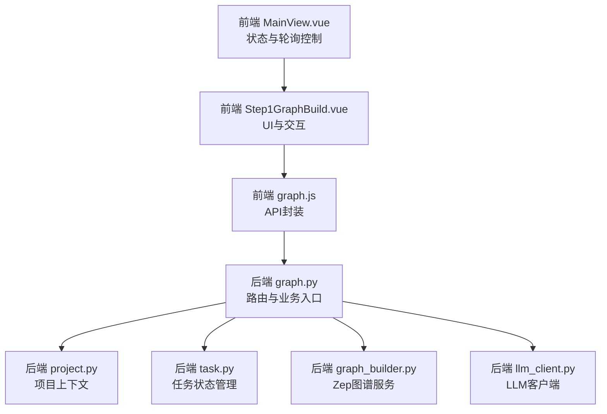
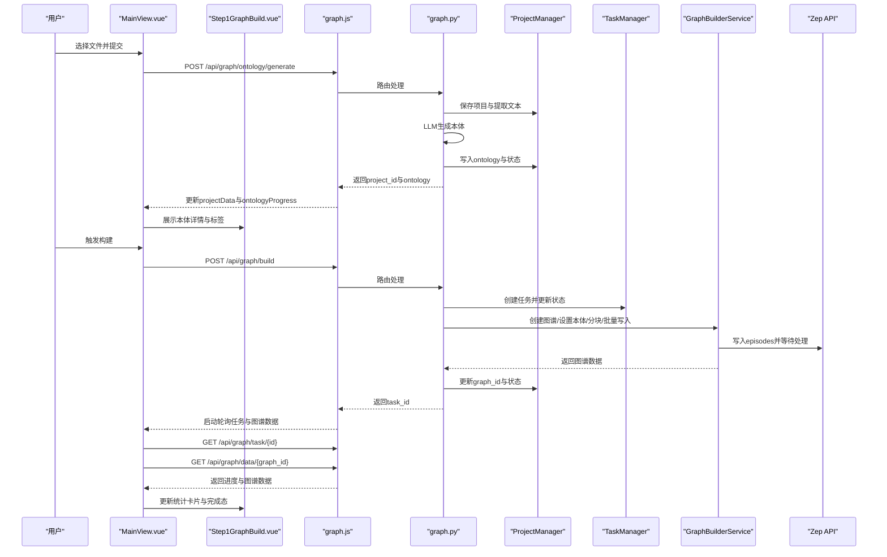
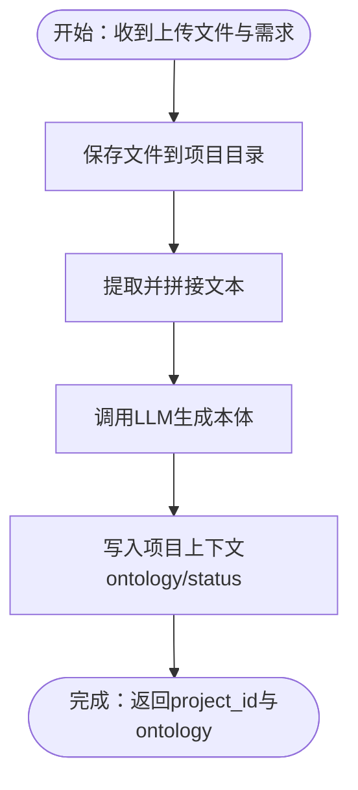
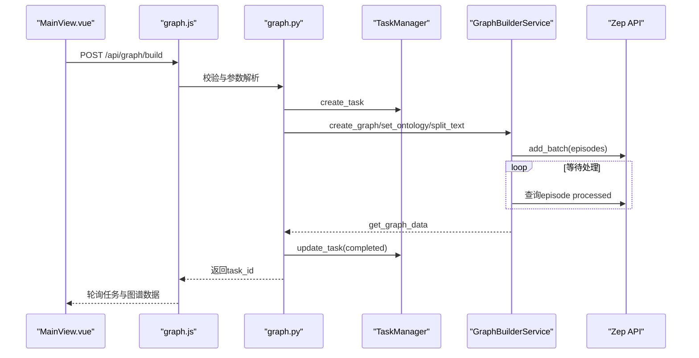
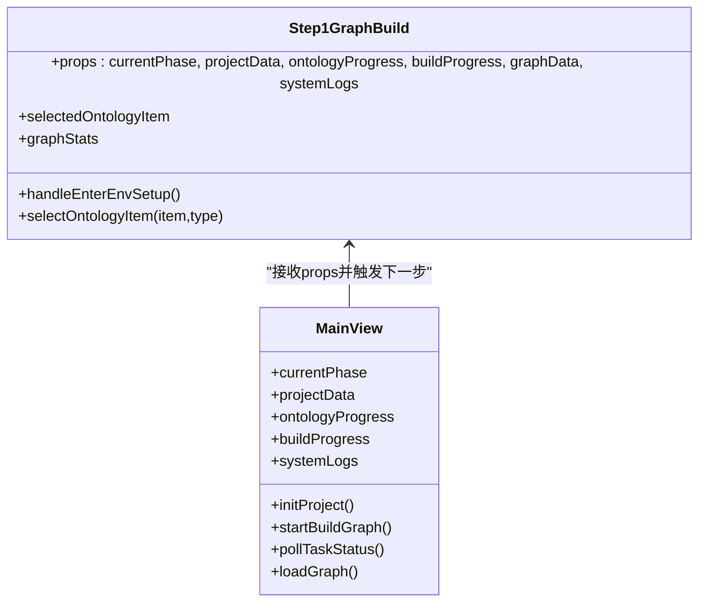
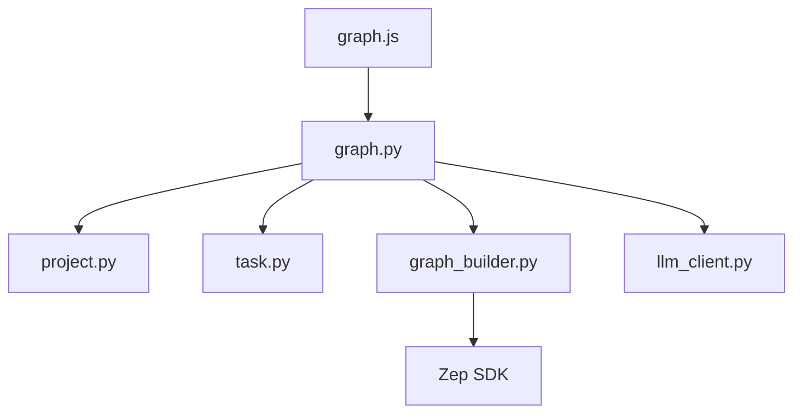

# 步骤一：图谱构建

<cite>
**本文引用的文件**
- [frontend/src/components/Step1GraphBuild.vue](file://frontend/src/components/Step1GraphBuild.vue)
- [frontend/src/views/MainView.vue](file://frontend/src/views/MainView.vue)
- [frontend/src/api/graph.js](file://frontend/src/api/graph.js)
- [backend/app/api/graph.py](file://backend/app/api/graph.py)
- [backend/app/services/graph_builder.py](file://backend/app/services/graph_builder.py)
- [backend/app/models/project.py](file://backend/app/models/project.py)
- [backend/app/models/task.py](file://backend/app/models/task.py)
- [backend/app/utils/llm_client.py](file://backend/app/utils/llm_client.py)
</cite>

## 目录
1. [简介](#简介)
2. [项目结构](#项目结构)
3. [核心组件](#核心组件)
4. [架构总览](#架构总览)
5. [详细组件分析](#详细组件分析)
6. [依赖分析](#依赖分析)
7. [性能考虑](#性能考虑)
8. [故障排查指南](#故障排查指南)
9. [结论](#结论)
10. [附录](#附录)

## 简介
本技术文档聚焦于MiroFish“步骤一：图谱构建”组件，系统性阐述从LLM本体生成到GraphRAG构建的完整流程，涵盖：
- LLM本体生成算法与数据结构
- 实体类型识别与关系类型抽取
- Zep图谱构建过程与进度管理
- 前端UI交互设计（本体详情弹窗、实体标签展示、构建进度显示、统计信息面板）
- 前后端API交互方式（ontology/generate 与 graph/build）
- 组件状态管理机制（currentPhase、projectData、systemLogs）
- 最佳实践与排障建议

## 项目结构
该功能由前后端协同实现：
- 前端负责用户交互、状态驱动与实时日志展示
- 后端负责项目上下文持久化、任务调度、LLM本体生成与Zep图谱构建

图表来源
- [frontend/src/views/MainView.vue](file://frontend/src/views/MainView.vue#L77-L405)
- [frontend/src/components/Step1GraphBuild.vue](file://frontend/src/components/Step1GraphBuild.vue#L1-L699)
- [frontend/src/api/graph.js](file://frontend/src/api/graph.js#L1-L71)
- [backend/app/api/graph.py](file://backend/app/api/graph.py#L1-L618)
- [backend/app/models/project.py](file://backend/app/models/project.py#L1-L306)
- [backend/app/models/task.py](file://backend/app/models/task.py#L1-L185)
- [backend/app/services/graph_builder.py](file://backend/app/services/graph_builder.py#L1-L500)
- [backend/app/utils/llm_client.py](file://backend/app/utils/llm_client.py#L1-L92)

章节来源
- [frontend/src/views/MainView.vue](file://frontend/src/views/MainView.vue#L77-L405)
- [frontend/src/components/Step1GraphBuild.vue](file://frontend/src/components/Step1GraphBuild.vue#L1-L699)
- [frontend/src/api/graph.js](file://frontend/src/api/graph.js#L1-L71)
- [backend/app/api/graph.py](file://backend/app/api/graph.py#L1-L618)

## 核心组件
- 前端组件 Step1GraphBuild.vue：负责本体生成与GraphRAG构建阶段的UI呈现、详情弹窗、统计卡片与系统日志展示。
- 前端视图 MainView.vue：负责整体流程编排、轮询任务状态、拉取图谱数据、驱动 currentPhase 状态切换。
- 前端 API graph.js：封装 /api/graph/ontology/generate 与 /api/graph/build 等接口调用。
- 后端 API graph.py：实现本体生成与图谱构建的路由、状态机与任务调度。
- 后端服务 graph_builder.py：封装Zep图谱创建、本体设置、文本分块与批量写入、等待处理完成等。
- 后端模型 project.py：项目上下文持久化，维护状态机与元数据。
- 后端模型 task.py：任务状态管理，支持进度与消息上报。
- 后端工具 llm_client.py：统一LLM客户端封装。

章节来源
- [frontend/src/components/Step1GraphBuild.vue](file://frontend/src/components/Step1GraphBuild.vue#L1-L699)
- [frontend/src/views/MainView.vue](file://frontend/src/views/MainView.vue#L77-L405)
- [frontend/src/api/graph.js](file://frontend/src/api/graph.js#L1-L71)
- [backend/app/api/graph.py](file://backend/app/api/graph.py#L1-L618)
- [backend/app/services/graph_builder.py](file://backend/app/services/graph_builder.py#L1-L500)
- [backend/app/models/project.py](file://backend/app/models/project.py#L1-L306)
- [backend/app/models/task.py](file://backend/app/models/task.py#L1-L185)
- [backend/app/utils/llm_client.py](file://backend/app/utils/llm_client.py#L1-L92)

## 架构总览
下图展示了从上传文档到本体生成、再到GraphRAG构建与Zep图谱写入的端到端流程。

图表来源
- [frontend/src/views/MainView.vue](file://frontend/src/views/MainView.vue#L178-L395)
- [frontend/src/components/Step1GraphBuild.vue](file://frontend/src/components/Step1GraphBuild.vue#L1-L699)
- [frontend/src/api/graph.js](file://frontend/src/api/graph.js#L1-L71)
- [backend/app/api/graph.py](file://backend/app/api/graph.py#L119-L525)
- [backend/app/services/graph_builder.py](file://backend/app/services/graph_builder.py#L186-L494)
- [backend/app/models/project.py](file://backend/app/models/project.py#L101-L305)
- [backend/app/models/task.py](file://backend/app/models/task.py#L54-L184)

## 详细组件分析

### 本体生成（LLM本体生成算法）
- 输入：多文档（PDF/MD/TXT）、模拟需求、附加上下文
- 流程要点：
  - 保存上传文件至项目目录，提取并拼接文本
  - 调用 LLM 生成本体定义（实体类型、关系类型、属性、示例、连接关系等）
  - 将本体写入项目上下文，状态切换为“本体已生成”
- 数据结构：
  - 实体类型：包含名称、描述、属性（名称、类型、描述）
  - 关系类型：包含名称、描述、属性、source/target约束
  - 分析摘要：用于前端展示与审计

图表来源
- [backend/app/api/graph.py](file://backend/app/api/graph.py#L119-L255)
- [backend/app/models/project.py](file://backend/app/models/project.py#L26-L98)

章节来源
- [backend/app/api/graph.py](file://backend/app/api/graph.py#L119-L255)
- [backend/app/utils/llm_client.py](file://backend/app/utils/llm_client.py#L1-L92)
- [backend/app/models/project.py](file://backend/app/models/project.py#L101-L196)

### GraphRAG构建与Zep图谱写入
- 输入：project_id、可选图谱名称、分块参数（chunk_size、chunk_overlap）
- 流程要点：
  - 校验配置（ZEP_API_KEY）、检查项目状态
  - 创建任务，更新状态为“构建中”
  - 分块文本、创建Zep图谱、设置本体
  - 分批写入episodes，等待处理完成，获取图谱数据
  - 更新项目状态为“完成”，返回任务结果
- 进度与消息：
  - 通过任务管理器更新进度与消息，前端轮询展示

图表来源
- [backend/app/api/graph.py](file://backend/app/api/graph.py#L257-L525)
- [backend/app/services/graph_builder.py](file://backend/app/services/graph_builder.py#L186-L494)
- [backend/app/models/task.py](file://backend/app/models/task.py#L54-L184)

章节来源
- [backend/app/api/graph.py](file://backend/app/api/graph.py#L257-L525)
- [backend/app/services/graph_builder.py](file://backend/app/services/graph_builder.py#L186-L494)
- [backend/app/models/task.py](file://backend/app/models/task.py#L54-L184)

### 前端UI交互设计
- 本体详情弹窗：点击实体/关系标签打开详情弹窗，展示描述、属性、示例、连接关系
- 实体标签展示：展示生成的实体类型标签，支持点击查看详情
- 构建进度显示：展示任务进度百分比与消息；支持轮询更新
- 统计信息面板：展示节点数、边数、SCHEMA类型数
- 系统日志：实时滚动展示系统事件与任务消息

图表来源
- [frontend/src/components/Step1GraphBuild.vue](file://frontend/src/components/Step1GraphBuild.vue#L189-L271)
- [frontend/src/views/MainView.vue](file://frontend/src/views/MainView.vue#L77-L405)

章节来源
- [frontend/src/components/Step1GraphBuild.vue](file://frontend/src/components/Step1GraphBuild.vue#L1-L699)
- [frontend/src/views/MainView.vue](file://frontend/src/views/MainView.vue#L77-L405)

### 前后端API交互
- 本体生成接口
  - 方法：POST /api/graph/ontology/generate
  - 参数：multipart/form-data（files[]、simulation_requirement、project_name、additional_context）
  - 返回：project_id、ontology、analysis_summary、files、total_text_length
- 图谱构建接口
  - 方法：POST /api/graph/build
  - 参数：JSON（project_id、graph_name、chunk_size、chunk_overlap）
  - 返回：task_id、message
- 任务查询接口
  - 方法：GET /api/graph/task/{task_id}
  - 返回：任务状态、进度、消息、结果
- 图谱数据接口
  - 方法：GET /api/graph/data/{graph_id}
  - 返回：nodes、edges、node_count、edge_count

章节来源
- [frontend/src/api/graph.js](file://frontend/src/api/graph.js#L1-L71)
- [backend/app/api/graph.py](file://backend/app/api/graph.py#L119-L590)

### 状态管理机制
- currentPhase 状态机
  - -1：上传与分析
  - 0：本体生成中
  - 1：图谱构建中
  - 2：完成
- projectData 数据绑定
  - 保存项目ID、本体、图谱ID、状态、分块参数等
- systemLogs 实时更新
  - 前端每新增一条日志自动滚动到底部
  - 后端任务消息同步到前端，驱动进度与状态变化

章节来源
- [frontend/src/views/MainView.vue](file://frontend/src/views/MainView.vue#L92-L148)
- [frontend/src/components/Step1GraphBuild.vue](file://frontend/src/components/Step1GraphBuild.vue#L173-L271)
- [backend/app/models/project.py](file://backend/app/models/project.py#L17-L54)
- [backend/app/models/task.py](file://backend/app/models/task.py#L14-L52)

## 依赖分析
- 前端依赖
  - graph.js 封装API调用，MainView.vue 负责轮询与状态切换，Step1GraphBuild.vue 负责UI与日志展示
- 后端依赖
  - graph.py 依赖 ProjectManager、TaskManager、GraphBuilderService、LLMClient
  - graph_builder.py 依赖 zep_cloud SDK 与 TextProcessor
  - project.py 与 task.py 提供项目上下文与任务状态持久化

图表来源
- [frontend/src/api/graph.js](file://frontend/src/api/graph.js#L1-L71)
- [backend/app/api/graph.py](file://backend/app/api/graph.py#L1-L618)
- [backend/app/services/graph_builder.py](file://backend/app/services/graph_builder.py#L1-L500)
- [backend/app/models/project.py](file://backend/app/models/project.py#L1-L306)
- [backend/app/models/task.py](file://backend/app/models/task.py#L1-L185)
- [backend/app/utils/llm_client.py](file://backend/app/utils/llm_client.py#L1-L92)

章节来源
- [frontend/src/api/graph.js](file://frontend/src/api/graph.js#L1-L71)
- [backend/app/api/graph.py](file://backend/app/api/graph.py#L1-L618)
- [backend/app/services/graph_builder.py](file://backend/app/services/graph_builder.py#L1-L500)
- [backend/app/models/project.py](file://backend/app/models/project.py#L1-L306)
- [backend/app/models/task.py](file://backend/app/models/task.py#L1-L185)
- [backend/app/utils/llm_client.py](file://backend/app/utils/llm_client.py#L1-L92)

## 性能考虑
- 文本分块策略
  - 合理设置 chunk_size 与 chunk_overlap，平衡召回与性能
  - 批量写入时控制并发与速率，避免Zep侧限流
- 任务轮询频率
  - 任务状态轮询建议 2 秒，图谱数据轮询建议 10 秒，避免过度请求
- 日志与渲染
  - 限制日志条目数量，避免DOM过大
  - 使用虚拟滚动或分页展示大量节点/边（如后续扩展）

## 故障排查指南
- 常见错误与定位
  - 未配置 ZEP_API_KEY：后端返回配置错误，检查环境变量
  - 项目状态不合法：如未先生成本体即请求构建，后端返回提示
  - 任务重复提交：若状态为“构建中”，后端拒绝重复提交
  - LLM调用失败：检查 LLM_API_KEY、base_url、model 名称
- 前端排查
  - 查看 systemLogs 中的最新消息，确认当前阶段与错误信息
  - 确认轮询是否正常，任务状态是否推进
- 后端排查
  - 检查任务管理器中的任务状态与错误堆栈
  - 核对项目上下文中的 graph_id 与状态流转

章节来源
- [backend/app/api/graph.py](file://backend/app/api/graph.py#L282-L525)
- [backend/app/models/task.py](file://backend/app/models/task.py#L101-L184)
- [frontend/src/views/MainView.vue](file://frontend/src/views/MainView.vue#L316-L355)

## 结论
本步骤通过“本体生成 + GraphRAG构建”的两阶段流程，结合前端可视化与后端任务驱动，实现了从文档到知识图谱的自动化构建。其关键在于：
- 明确的项目状态机与任务状态机
- 清晰的前后端API边界与参数约定
- 可观测的日志与进度反馈
- 对Zep图谱写入的稳健实现与超时处理

## 附录
- 最佳实践
  - 在本体生成前确保文档格式正确且内容可读
  - 合理设置分块参数，避免过小导致碎片化或过大导致上下文丢失
  - 使用轮询而非长连接，降低服务器压力
  - 在前端对日志进行节流与截断，保证交互流畅
- 参考路径
  - 本体生成流程：[backend/app/api/graph.py](file://backend/app/api/graph.py#L119-L255)
  - 图谱构建流程：[backend/app/api/graph.py](file://backend/app/api/graph.py#L257-L525)
  - Zep写入与等待：[backend/app/services/graph_builder.py](file://backend/app/services/graph_builder.py#L287-L494)
  - 项目状态机：[backend/app/models/project.py](file://backend/app/models/project.py#L17-L54)
  - 任务状态机：[backend/app/models/task.py](file://backend/app/models/task.py#L14-L52)
  - 前端轮询与UI：[frontend/src/views/MainView.vue](file://frontend/src/views/MainView.vue#L271-L395), [frontend/src/components/Step1GraphBuild.vue](file://frontend/src/components/Step1GraphBuild.vue#L1-L699)