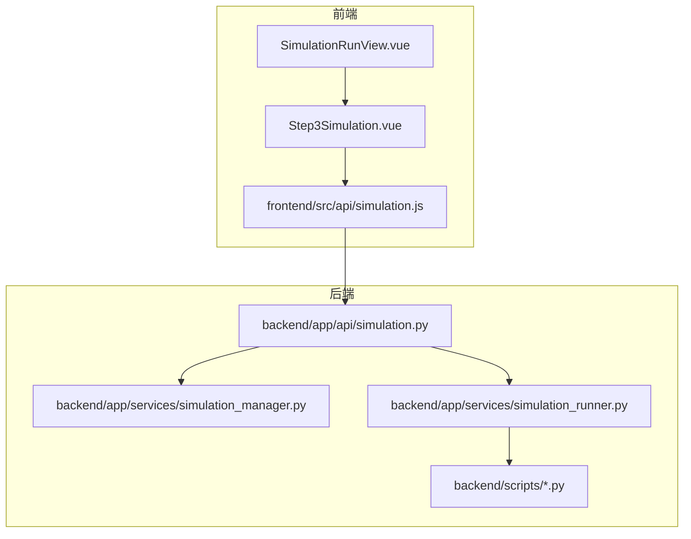
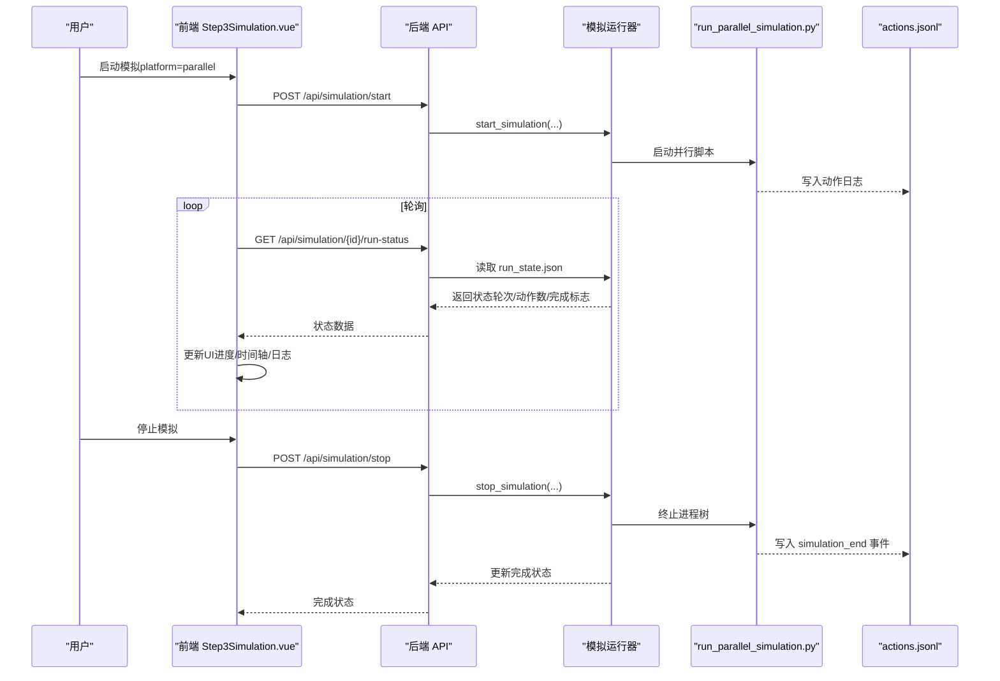
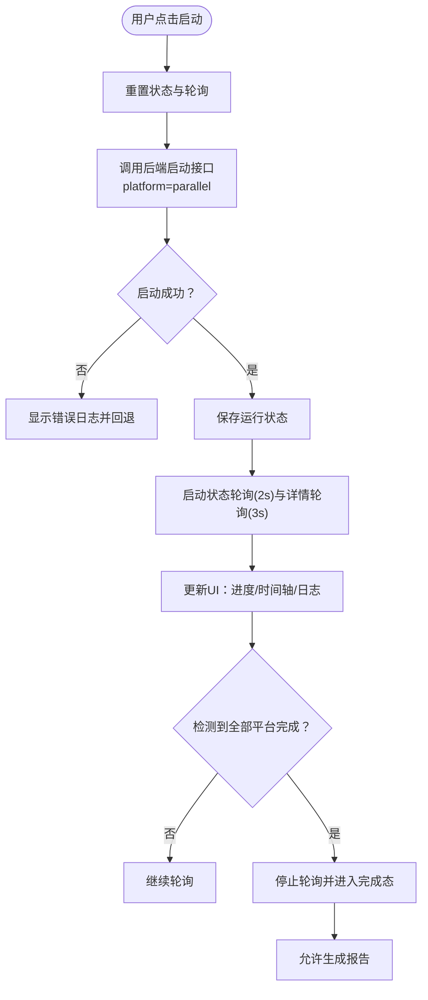
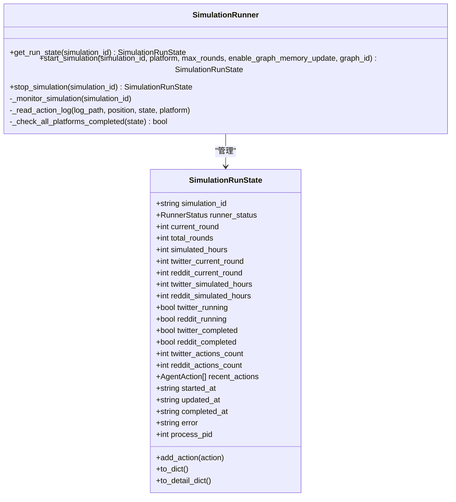
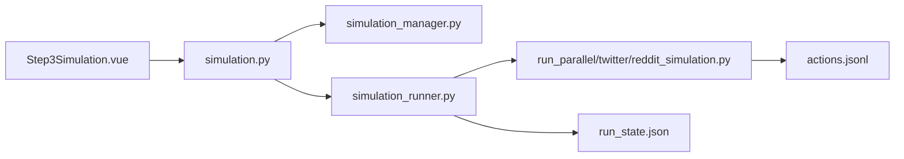

# 步骤三：模拟运行

<cite>
**本文档引用的文件**
- [frontend/src/components/Step3Simulation.vue](file://frontend/src/components/Step3Simulation.vue)
- [frontend/src/views/SimulationRunView.vue](file://frontend/src/views/SimulationRunView.vue)
- [frontend/src/views/SimulationView.vue](file://frontend/src/views/SimulationView.vue)
- [frontend/src/api/simulation.js](file://frontend/src/api/simulation.js)
- [backend/app/services/simulation_manager.py](file://backend/app/services/simulation_manager.py)
- [backend/app/services/simulation_runner.py](file://backend/app/services/simulation_runner.py)
- [backend/app/api/simulation.py](file://backend/app/api/simulation.py)
- [backend/scripts/run_parallel_simulation.py](file://backend/scripts/run_parallel_simulation.py)
- [backend/scripts/run_twitter_simulation.py](file://backend/scripts/run_twitter_simulation.py)
- [backend/scripts/run_reddit_simulation.py](file://backend/scripts/run_reddit_simulation.py)
</cite>

## 目录
1. [简介](#简介)
2. [项目结构](#项目结构)
3. [核心组件](#核心组件)
4. [架构总览](#架构总览)
5. [详细组件分析](#详细组件分析)
6. [依赖关系分析](#依赖关系分析)
7. [性能考虑](#性能考虑)
8. [故障排除指南](#故障排除指南)
9. [结论](#结论)
10. [附录](#附录)

## 简介
本文件为 MiroFish 步骤三“模拟运行”的技术文档，聚焦双平台并行模拟的前端 UI 与后端服务交互、实时监控、状态管理与错误处理。文档涵盖：
- 双平台（Twitter 与 Reddit）并行模拟的架构设计与配置
- Agent 行为控制与模拟参数调整
- 实时监控（进度、状态变更、性能指标）
- UI 设计（控制面板、状态指示器、时间轴、日志窗口）
- 与后端模拟管理服务的交互（启动、暂停、停止、重启）
- 状态同步、错误处理与异常恢复策略
- 最佳实践与故障排除建议

## 项目结构
前端采用 Vue 3 + Vite，后端采用 Flask，前后端通过 REST API 通信；模拟运行由后端脚本驱动，前端负责实时监控与交互。

**图表来源**
- [frontend/src/views/SimulationRunView.vue](file://frontend/src/views/SimulationRunView.vue#L1-L448)
- [frontend/src/components/Step3Simulation.vue](file://frontend/src/components/Step3Simulation.vue#L1-L1264)
- [frontend/src/api/simulation.js](file://frontend/src/api/simulation.js#L1-L188)
- [backend/app/api/simulation.py](file://backend/app/api/simulation.py#L1-L2712)
- [backend/app/services/simulation_manager.py](file://backend/app/services/simulation_manager.py#L1-L529)
- [backend/app/services/simulation_runner.py](file://backend/app/services/simulation_runner.py#L1-L1764)
- [backend/scripts/run_parallel_simulation.py](file://backend/scripts/run_parallel_simulation.py#L1-L1700)

**章节来源**
- [frontend/src/views/SimulationRunView.vue](file://frontend/src/views/SimulationRunView.vue#L1-L448)
- [frontend/src/components/Step3Simulation.vue](file://frontend/src/components/Step3Simulation.vue#L1-L1264)
- [frontend/src/api/simulation.js](file://frontend/src/api/simulation.js#L1-L188)
- [backend/app/api/simulation.py](file://backend/app/api/simulation.py#L1-L2712)

## 核心组件
- 前端控制面板与时间轴：Step3Simulation.vue 提供双平台进度、动作时间轴、可用动作提示与系统日志。
- 运行视图容器：SimulationRunView.vue 负责布局切换、状态指示、图谱刷新与返回/下一步导航。
- 后端模拟管理器：simulation_manager.py 负责准备阶段（实体过滤、Agent Profile 生成、配置生成）与运行说明。
- 后端模拟运行器：simulation_runner.py 负责启动/停止模拟、解析动作日志、聚合状态、跨平台监控。
- 预设脚本：run_parallel_simulation.py、run_twitter_simulation.py、run_reddit_simulation.py 驱动具体平台模拟与 IPC 命令处理。

**章节来源**
- [frontend/src/components/Step3Simulation.vue](file://frontend/src/components/Step3Simulation.vue#L1-L1264)
- [frontend/src/views/SimulationRunView.vue](file://frontend/src/views/SimulationRunView.vue#L1-L448)
- [backend/app/services/simulation_manager.py](file://backend/app/services/simulation_manager.py#L1-L529)
- [backend/app/services/simulation_runner.py](file://backend/app/services/simulation_runner.py#L1-L1764)
- [backend/scripts/run_parallel_simulation.py](file://backend/scripts/run_parallel_simulation.py#L1-L1700)
- [backend/scripts/run_twitter_simulation.py](file://backend/scripts/run_twitter_simulation.py#L1-L781)
- [backend/scripts/run_reddit_simulation.py](file://backend/scripts/run_reddit_simulation.py#L1-L770)

## 架构总览
双平台并行模拟的端到端流程如下：

**图表来源**
- [frontend/src/components/Step3Simulation.vue](file://frontend/src/components/Step3Simulation.vue#L380-L460)
- [frontend/src/api/simulation.js](file://frontend/src/api/simulation.js#L83-L93)
- [backend/app/api/simulation.py](file://backend/app/api/simulation.py#L1-L2712)
- [backend/app/services/simulation_runner.py](file://backend/app/services/simulation_runner.py#L312-L475)
- [backend/scripts/run_parallel_simulation.py](file://backend/scripts/run_parallel_simulation.py#L1-L1700)

## 详细组件分析

### 前端组件：Step3Simulation.vue
- 控制面板与状态显示
  - 双平台卡片：Twitter 与 Reddit，分别显示轮次、耗时、动作数与完成状态徽章。
  - 可用动作提示：鼠标悬停显示平台可用动作清单。
  - 开始生成报告按钮：在模拟完成后触发报告生成。
- 实时监控
  - 状态轮询：每 2 秒获取一次运行状态，每 3 秒获取一次详细动作列表。
  - 增量更新：基于唯一 ID 去重，仅追加新增动作，保持时间轴连续滚动。
  - 进度计算：基于每轮分钟数与当前轮次计算“已模拟小时”。
- 日志系统
  - 顶部系统日志区域：记录启动、停止、完成、平台轮次变化等事件。
  - 本地日志队列：最多保留 200 条，超出则丢弃最早条目。
- 交互逻辑
  - 启动模拟：携带 platform=parallel、force=true、enable_graph_memory_update=true。
  - 停止模拟：调用后端停止接口，更新状态为 completed。
  - 报告生成：调用后端生成接口并跳转至报告页。

**图表来源**
- [frontend/src/components/Step3Simulation.vue](file://frontend/src/components/Step3Simulation.vue#L380-L589)

**章节来源**
- [frontend/src/components/Step3Simulation.vue](file://frontend/src/components/Step3Simulation.vue#L1-L1264)
- [frontend/src/api/simulation.js](file://frontend/src/api/simulation.js#L83-L109)

### 前端视图：SimulationRunView.vue
- 布局与视图切换
  - 左右分栏：左侧图谱面板，右侧模拟运行面板。
  - 视图模式：graph/split/workbench 三种布局，支持最大化与还原。
- 状态指示器
  - Step 3/5 标识，状态指示器随运行状态变化（processing/completed/error）。
- 图谱刷新
  - 模拟运行期间每 30 秒自动刷新图谱数据，避免全屏 loading 闪烁。
- 返回与停止逻辑
  - 返回 Step 2 时，优先尝试优雅关闭模拟环境，失败则强制停止。

**章节来源**
- [frontend/src/views/SimulationRunView.vue](file://frontend/src/views/SimulationRunView.vue#L1-L448)

### 后端 API：simulation.py
- 模拟生命周期接口
  - /api/simulation/start：启动模拟（支持 platform=parallel/tweet/redit，max_rounds 截断，enable_graph_memory_update 动态图谱更新）。
  - /api/simulation/stop：停止模拟。
  - /api/simulation/{id}/run-status：获取运行状态（轮次、动作数、完成标志等）。
  - /api/simulation/{id}/run-status/detail：获取最近动作列表。
  - /api/simulation/{id}/config：获取模拟配置（含 time_config）。
  - /api/simulation/env-status、/api/simulation/close-env：环境状态与优雅关闭。
- 任务进度
  - /api/simulation/prepare 与 /api/simulation/prepare/status：异步准备任务与进度查询。

**章节来源**
- [backend/app/api/simulation.py](file://backend/app/api/simulation.py#L1-L2712)
- [frontend/src/api/simulation.js](file://frontend/src/api/simulation.js#L1-L188)

### 模拟管理器：simulation_manager.py
- 准备阶段
  - 从 Zep 图谱读取并过滤实体，生成 Agent Profile（支持并行生成），使用 LLM 智能生成模拟配置，保存配置与 Profile 文件。
- 运行说明
  - 提供脚本命令说明，支持单平台与并行运行。

**章节来源**
- [backend/app/services/simulation_manager.py](file://backend/app/services/simulation_manager.py#L1-L529)

### 模拟运行器：simulation_runner.py
- 运行状态
  - 维护各平台独立轮次、模拟小时、动作计数、完成标志。
  - 统一进度：current_round 取两平台最大轮次，simulated_hours 取两平台最大模拟小时。
- 日志解析
  - 监控 twitter/actions.jsonl 与 reddit/actions.jsonl，解析动作与 round_end/simulation_end 事件。
  - 动态图谱更新：可选启用，将活动写入 Zep。
- 停止与清理
  - 跨平台终止进程树，关闭日志文件句柄，停止图谱更新器。

**图表来源**
- [backend/app/services/simulation_runner.py](file://backend/app/services/simulation_runner.py#L100-L193)
- [backend/app/services/simulation_runner.py](file://backend/app/services/simulation_runner.py#L312-L475)
- [backend/app/services/simulation_runner.py](file://backend/app/services/simulation_runner.py#L477-L577)

**章节来源**
- [backend/app/services/simulation_runner.py](file://backend/app/services/simulation_runner.py#L1-L1764)

### 预设脚本：run_parallel_simulation.py
- 并行双平台模拟
  - 同时运行 Twitter 与 Reddit 模拟，共享配置文件。
  - 完成后进入等待命令模式，支持 IPC 命令：interview、batch_interview、close_env。
- 日志结构
  - twitter/、reddit/ 下的 actions.jsonl；主进程日志 simulation.log；运行状态 run_state.json。
- 动作解析与上下文丰富
  - 从数据库提取 trace，映射动作类型，补充帖子/评论/作者等上下文信息。

**章节来源**
- [backend/scripts/run_parallel_simulation.py](file://backend/scripts/run_parallel_simulation.py#L1-L1700)

### 预设脚本：run_twitter_simulation.py 与 run_reddit_simulation.py
- 单平台模拟
  - 读取配置，加载 Agent Profile，创建 OASIS 环境，按轮次执行 LLMAction。
  - 支持初始事件、等待命令模式与 IPC 命令处理。
- 日志与数据库
  - 使用固定命名的日志文件，SQLite 数据库存储 trace 与 Interview 结果。

**章节来源**
- [backend/scripts/run_twitter_simulation.py](file://backend/scripts/run_twitter_simulation.py#L1-L781)
- [backend/scripts/run_reddit_simulation.py](file://backend/scripts/run_reddit_simulation.py#L1-L770)

## 依赖关系分析
- 前端依赖后端 API 提供的运行状态与配置；后端通过 simulation_runner.py 与脚本交互。
- simulation_manager.py 负责准备阶段，产出配置与 Profile，供脚本使用。
- simulation_runner.py 负责运行时状态持久化与日志解析，提供给前端轮询展示。

**图表来源**
- [frontend/src/components/Step3Simulation.vue](file://frontend/src/components/Step3Simulation.vue#L1-L1264)
- [backend/app/api/simulation.py](file://backend/app/api/simulation.py#L1-L2712)
- [backend/app/services/simulation_manager.py](file://backend/app/services/simulation_manager.py#L1-L529)
- [backend/app/services/simulation_runner.py](file://backend/app/services/simulation_runner.py#L1-L1764)
- [backend/scripts/run_parallel_simulation.py](file://backend/scripts/run_parallel_simulation.py#L1-L1700)

**章节来源**
- [frontend/src/components/Step3Simulation.vue](file://frontend/src/components/Step3Simulation.vue#L1-L1264)
- [backend/app/api/simulation.py](file://backend/app/api/simulation.py#L1-L2712)
- [backend/app/services/simulation_runner.py](file://backend/app/services/simulation_runner.py#L1-L1764)

## 性能考虑
- 前端轮询频率
  - 状态轮询 2 秒一次，详情轮询 3 秒一次，平衡实时性与网络负载。
- 增量动作更新
  - 基于唯一 ID 去重，避免重复渲染与内存膨胀。
- 后端日志解析
  - 逐平台读取 actions.jsonl，使用文件指针位置增量读取，减少 IO 压力。
- 进程与资源管理
  - 使用 start_new_session=True 创建进程组，统一跨平台终止；及时关闭日志文件句柄，避免句柄泄漏。
- 图谱动态更新
  - 可选启用，按需开启以降低写入压力。

[本节为通用指导，无需特定文件引用]

## 故障排除指南
- 启动失败
  - 检查后端日志与 run_state.json 的 error 字段；确认配置文件存在与脚本路径正确。
  - 前端显示“启动失败/异常”，可在系统日志中查看详细错误。
- 模拟未完成
  - 确认 actions.jsonl 中是否存在 simulation_end 事件；检查各平台完成标志。
  - 若某平台未生成日志文件，表示该平台未启用。
- 停止无效
  - 确认进程 PID 存在；跨平台终止使用 taskkill（Windows）或 killpg（Unix）。
- 图谱更新失败
  - 检查 enable_graph_memory_update 与 graph_id 配置；确认 Zep 可达性。
- 前端卡顿
  - 控制日志与动作列表长度；适当提高轮询间隔或减少一次性渲染数量。

**章节来源**
- [backend/app/services/simulation_runner.py](file://backend/app/services/simulation_runner.py#L578-L800)
- [frontend/src/components/Step3Simulation.vue](file://frontend/src/components/Step3Simulation.vue#L437-L460)

## 结论
本组件通过前后端协同，实现了双平台并行模拟的可视化运行与实时监控。前端提供直观的控制面板与时间轴，后端通过运行器与脚本保障稳定执行与状态同步。配合完善的错误处理与异常恢复策略，用户可高效管理多智能体模拟过程并生成高质量报告。

[本节为总结性内容，无需特定文件引用]

## 附录

### 模拟参数与配置要点
- time_config
  - total_simulation_hours：总模拟时长
  - minutes_per_round：每轮分钟数
  - agents_per_hour_min/max：每小时最小/最大活跃 Agent 数
  - peak_hours/off_peak_hours：高峰/低谷时段
  - peak_activity_multiplier/off_peak_activity_multiplier：活跃倍数
- event_config
  - initial_posts：初始帖子列表（可选）

**章节来源**
- [backend/app/services/simulation_runner.py](file://backend/app/services/simulation_runner.py#L350-L360)
- [backend/scripts/run_twitter_simulation.py](file://backend/scripts/run_twitter_simulation.py#L536-L565)
- [backend/scripts/run_reddit_simulation.py](file://backend/scripts/run_reddit_simulation.py#L536-L555)

### Agent 行为控制
- Twitter 可用动作：CREATE_POST、LIKE_POST、REPOST、FOLLOW、DO_NOTHING、QUOTE_POST
- Reddit 可用动作：LIKE_POST、DISLIKE_POST、CREATE_POST、CREATE_COMMENT、LIKE_COMMENT、DISLIKE_COMMENT、SEARCH_POSTS、SEARCH_USER、TREND、REFRESH、DO_NOTHING、FOLLOW、MUTE

**章节来源**
- [backend/scripts/run_parallel_simulation.py](file://backend/scripts/run_parallel_simulation.py#L177-L202)
- [backend/scripts/run_twitter_simulation.py](file://backend/scripts/run_twitter_simulation.py#L388-L396)
- [backend/scripts/run_reddit_simulation.py](file://backend/scripts/run_reddit_simulation.py#L388-L403)