# 步骤二：环境搭建

<cite>
**本文档引用的文件**
- [Step2EnvSetup.vue](file://frontend/src/components/Step2EnvSetup.vue)
- [simulation.js](file://frontend/src/api/simulation.js)
- [simulation.py](file://backend/app/api/simulation.py)
- [simulation_manager.py](file://backend/app/services/simulation_manager.py)
- [simulation_config_generator.py](file://backend/app/services/simulation_config_generator.py)
- [oasis_profile_generator.py](file://backend/app/services/oasis_profile_generator.py)
- [zep_entity_reader.py](file://backend/app/services/zep_entity_reader.py)
- [graph.js](file://frontend/src/api/graph.js)
- [graph.py](file://backend/app/api/graph.py)
- [project.py](file://backend/app/models/project.py)
- [GraphPanel.vue](file://frontend/src/components/GraphPanel.vue)
</cite>

## 目录
1. [简介](#简介)
2. [项目结构](#项目结构)
3. [核心组件](#核心组件)
4. [架构概览](#架构概览)
5. [详细组件分析](#详细组件分析)
6. [依赖关系分析](#依赖关系分析)
7. [性能考虑](#性能考虑)
8. [故障排除指南](#故障排除指南)
9. [结论](#结论)

## 简介

步骤二环境搭建是MiroFish模拟系统的第二个关键阶段，负责从图谱数据中提取实体关系，生成智能体配置文件，并为双平台模拟做好充分准备。该组件实现了从知识图谱到可执行模拟环境的完整转换，包括实体关系抽取、Agent Profile生成、环境配置等核心功能。

## 项目结构

MiroFish项目采用前后端分离架构，分为前端Vue.js应用和后端Flask服务：

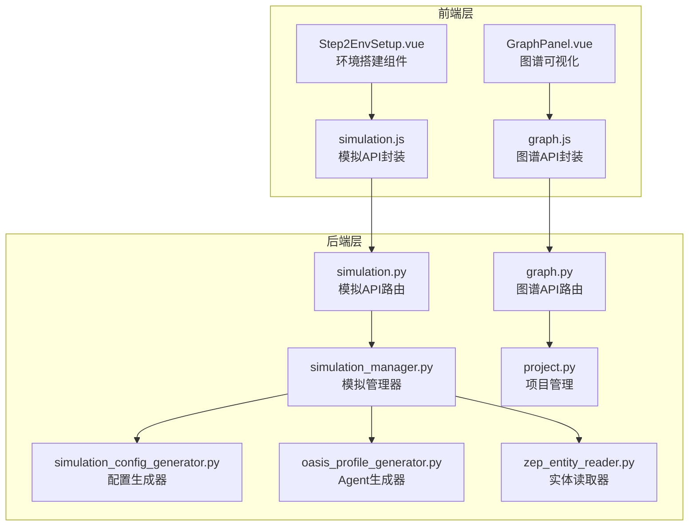

**图表来源**
- [Step2EnvSetup.vue](file://frontend/src/components/Step2EnvSetup.vue#L1-L800)
- [simulation.py](file://backend/app/api/simulation.py#L1-L800)
- [simulation_manager.py](file://backend/app/services/simulation_manager.py#L1-L529)

**章节来源**
- [Step2EnvSetup.vue](file://frontend/src/components/Step2EnvSetup.vue#L1-L800)
- [simulation.py](file://backend/app/api/simulation.py#L1-L800)

## 核心组件

### 前端组件架构

步骤二环境搭建组件采用模块化设计，包含五个主要阶段：

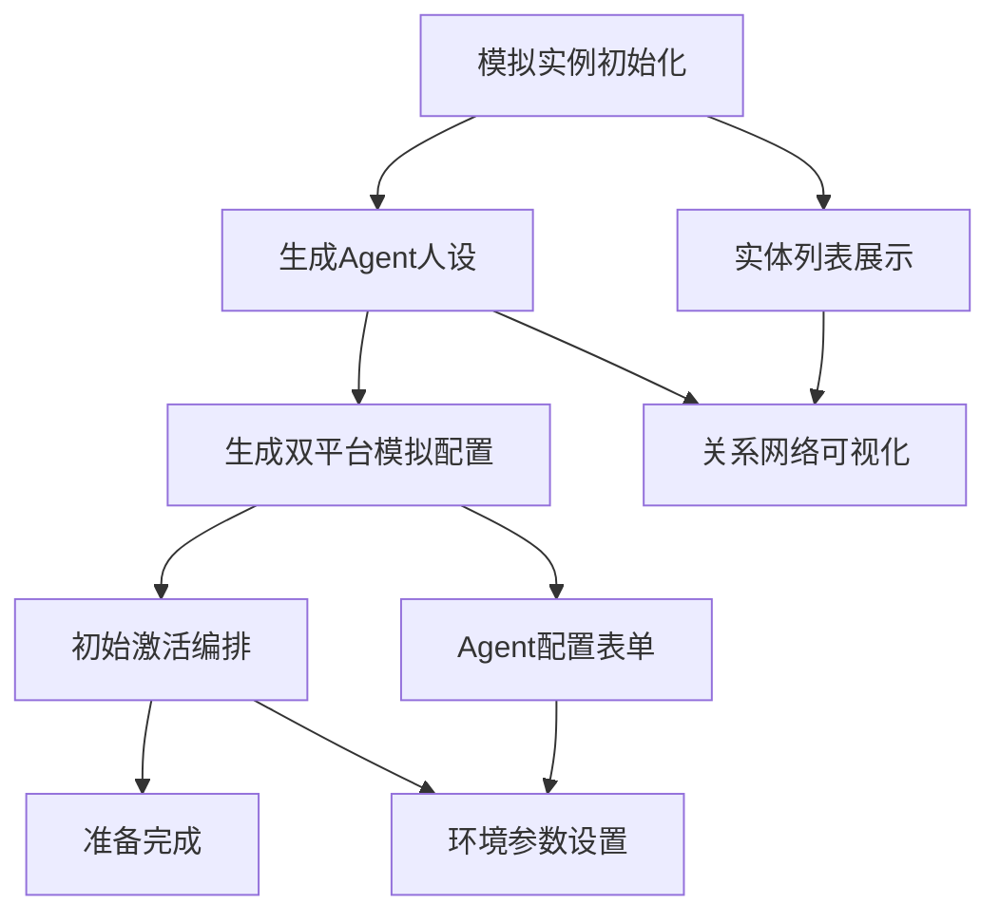

**图表来源**
- [Step2EnvSetup.vue](file://frontend/src/components/Step2EnvSetup.vue#L1-L800)

### 后端服务架构

后端服务采用分层架构，每个服务职责明确：

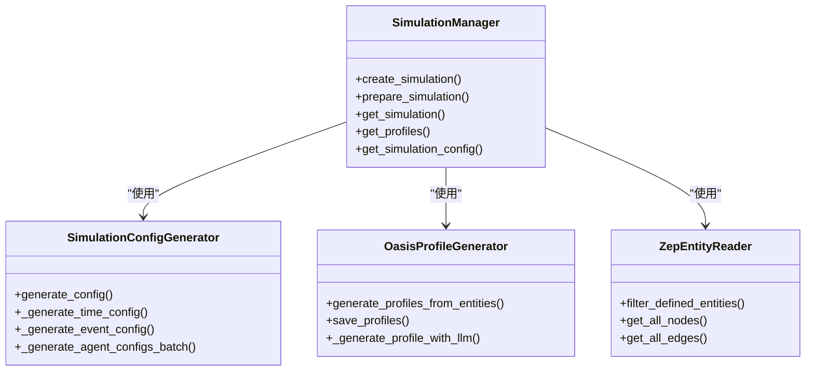

**图表来源**
- [simulation_manager.py](file://backend/app/services/simulation_manager.py#L114-L529)
- [simulation_config_generator.py](file://backend/app/services/simulation_config_generator.py#L199-L988)
- [oasis_profile_generator.py](file://backend/app/services/oasis_profile_generator.py#L142-L1201)
- [zep_entity_reader.py](file://backend/app/services/zep_entity_reader.py#L70-L445)

**章节来源**
- [simulation_manager.py](file://backend/app/services/simulation_manager.py#L1-L529)
- [simulation_config_generator.py](file://backend/app/services/simulation_config_generator.py#L1-L988)
- [oasis_profile_generator.py](file://backend/app/services/oasis_profile_generator.py#L1-L1201)
- [zep_entity_reader.py](file://backend/app/services/zep_entity_reader.py#L1-L445)

## 架构概览

### 数据流架构

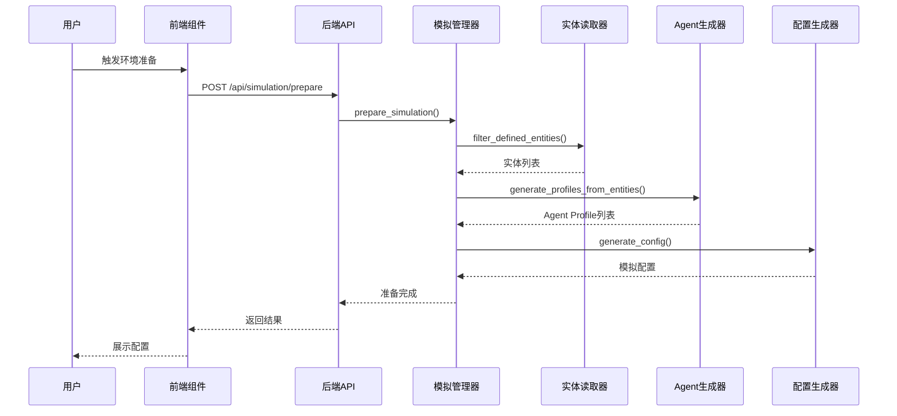

**图表来源**
- [simulation.py](file://backend/app/api/simulation.py#L358-L635)
- [simulation_manager.py](file://backend/app/services/simulation_manager.py#L229-L457)

### 状态管理流程

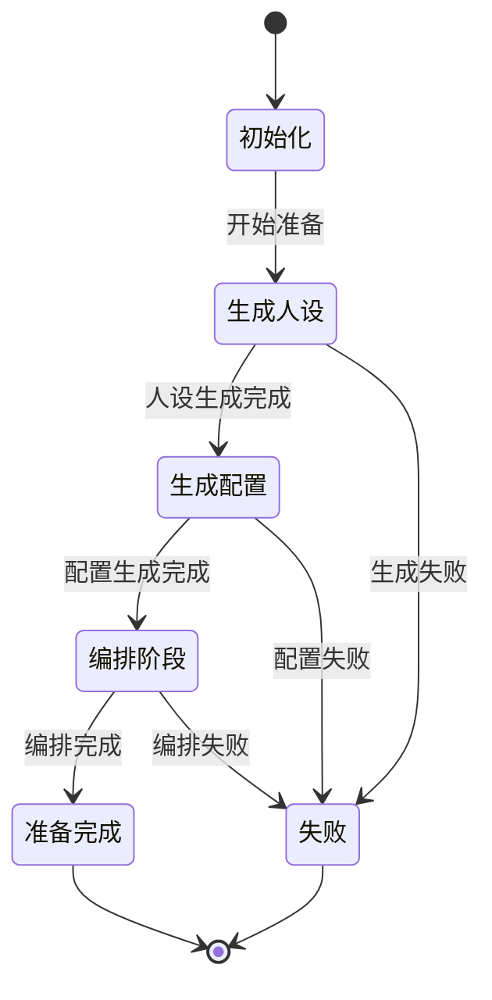

**图表来源**
- [simulation_manager.py](file://backend/app/services/simulation_manager.py#L24-L40)
- [simulation.py](file://backend/app/api/simulation.py#L358-L635)

## 详细组件分析

### 实体关系抽取组件

实体关系抽取是环境搭建的核心功能之一，负责从知识图谱中提取结构化信息：

#### 实体过滤机制

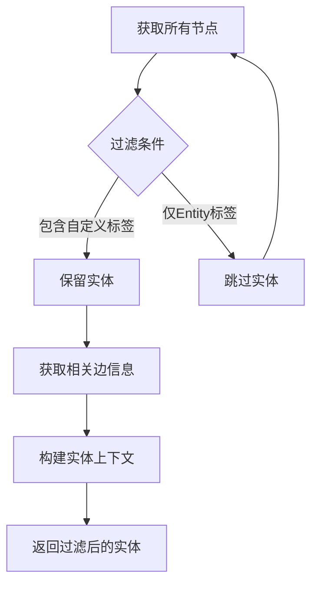

**图表来源**
- [zep_entity_reader.py](file://backend/app/services/zep_entity_reader.py#L222-L339)

#### 实体类型识别

系统支持多种实体类型，包括个人实体和群体实体：

| 实体类型类别 | 示例类型 | 用途 |
|------------|----------|------|
| 个人实体 | student, alumni, professor, person | 生成具体用户画像 |
| 公众人物 | publicfigure, expert, faculty | 生成知名人士人设 |
| 机构实体 | university, governmentagency, organization | 生成组织账号设定 |
| 媒体实体 | mediaoutlet, journalist, activist | 生成媒体账号设定 |

**章节来源**
- [zep_entity_reader.py](file://backend/app/services/zep_entity_reader.py#L420-L445)
- [oasis_profile_generator.py](file://backend/app/services/oasis_profile_generator.py#L168-L179)

### Agent Profile生成组件

Agent Profile生成器负责将实体转换为模拟平台可用的Agent配置：

#### 人设生成流程

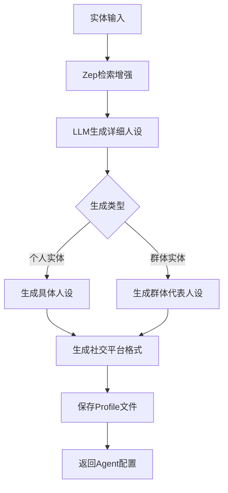

**图表来源**
- [oasis_profile_generator.py](file://backend/app/services/oasis_profile_generator.py#L211-L274)

#### Profile数据结构

Agent Profile包含以下关键字段：

| 字段类别 | 字段名称 | 数据类型 | 描述 |
|---------|----------|----------|------|
| 基本信息 | user_id | int | 用户ID |
| 基本信息 | user_name | string | 用户名 |
| 基本信息 | name | string | 显示名称 |
| 基本信息 | bio | string | 简介 |
| 基本信息 | persona | string | 详细人设描述 |
| 平台特定 | karma | int | Reddit积分 |
| 平台特定 | friend_count | int | Twitter好友数 |
| 平台特定 | follower_count | int | Twitter粉丝数 |
| 平台特定 | statuses_count | int | Twitter发帖数 |
| 附加信息 | age | int | 年龄 |
| 附加信息 | gender | string | 性别 |
| 附加信息 | mbti | string | MBTI类型 |
| 附加信息 | country | string | 国家/地区 |
| 附加信息 | profession | string | 职业 |
| 附加信息 | interested_topics | array | 感兴趣话题 |

**章节来源**
- [oasis_profile_generator.py](file://backend/app/services/oasis_profile_generator.py#L28-L140)

### 模拟配置生成组件

模拟配置生成器负责智能生成双平台模拟参数：

#### 配置生成策略

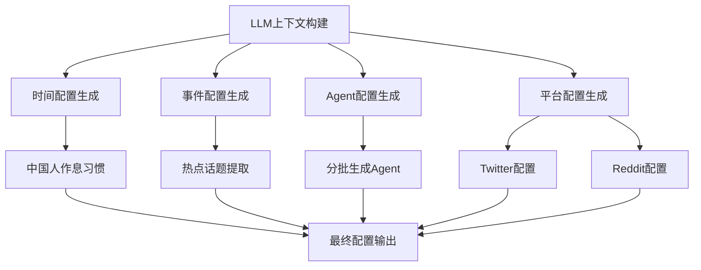

**图表来源**
- [simulation_config_generator.py](file://backend/app/services/simulation_config_generator.py#L242-L379)

#### 时间配置参数

| 参数类别 | 参数名称 | 默认值 | 描述 |
|---------|----------|--------|------|
| 总体配置 | total_simulation_hours | 72 | 模拟总时长（小时） |
| 总体配置 | minutes_per_round | 60 | 每轮代表时间（分钟） |
| 活跃度配置 | agents_per_hour_min | 动态计算 | 每小时最少激活Agent数 |
| 活跃度配置 | agents_per_hour_max | 动态计算 | 每小时最多激活Agent数 |
| 时段配置 | peak_hours | [19,20,21,22] | 活跃高峰时段 |
| 时段配置 | off_peak_hours | [0,1,2,3,4,5] | 低谷时段 |
| 时段配置 | morning_hours | [6,7,8] | 早晨时段 |
| 时段配置 | work_hours | [9,10,11,12,13,14,15,16,17,18] | 工作时段 |
| 活跃倍数 | peak_activity_multiplier | 1.5 | 高峰活跃倍数 |
| 活跃倍数 | off_peak_activity_multiplier | 0.05 | 低谷活跃倍数 |
| 活跃倍数 | morning_activity_multiplier | 0.4 | 早晨活跃倍数 |
| 活跃倍数 | work_activity_multiplier | 0.7 | 工作时段活跃倍数 |

**章节来源**
- [simulation_config_generator.py](file://backend/app/services/simulation_config_generator.py#L82-L110)
- [simulation_config_generator.py](file://backend/app/services/simulation_config_generator.py#L534-L642)

### 前端UI组件分析

#### 实体列表展示组件

前端组件提供了直观的实体列表展示功能：

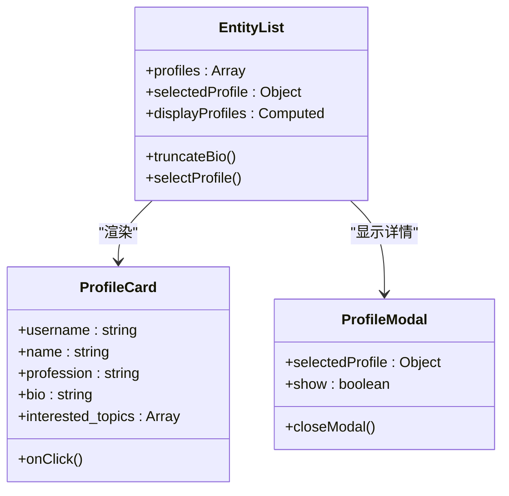

**图表来源**
- [Step2EnvSetup.vue](file://frontend/src/components/Step2EnvSetup.vue#L80-L113)
- [Step2EnvSetup.vue](file://frontend/src/components/Step2EnvSetup.vue#L531-L617)

#### 关系网络可视化组件

图谱可视化组件提供了交互式的网络视图：

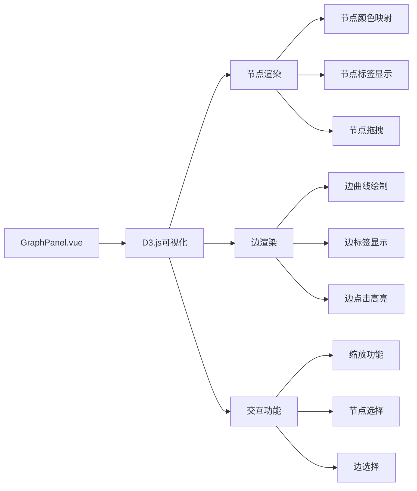

**图表来源**
- [GraphPanel.vue](file://frontend/src/components/GraphPanel.vue#L17-L236)

**章节来源**
- [Step2EnvSetup.vue](file://frontend/src/components/Step2EnvSetup.vue#L1-L800)
- [GraphPanel.vue](file://frontend/src/components/GraphPanel.vue#L1-L800)

## 依赖关系分析

### 组件间依赖关系

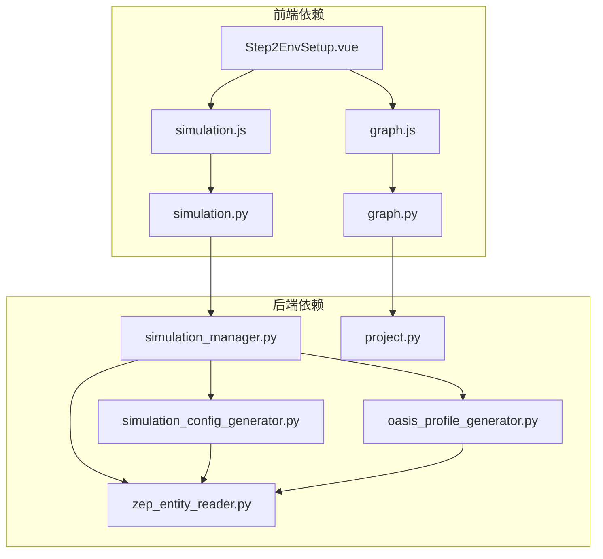

**图表来源**
- [Step2EnvSetup.vue](file://frontend/src/components/Step2EnvSetup.vue#L634-L642)
- [simulation.py](file://backend/app/api/simulation.py#L1-L800)
- [simulation_manager.py](file://backend/app/services/simulation_manager.py#L1-L529)

### 数据依赖关系

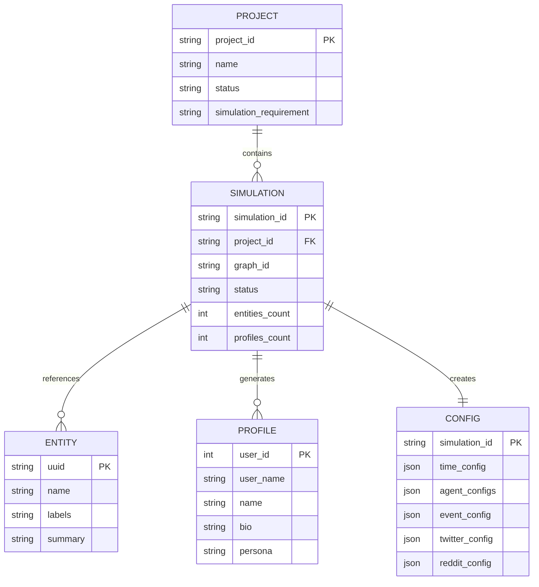

**图表来源**
- [project.py](file://backend/app/models/project.py#L26-L98)
- [simulation_manager.py](file://backend/app/services/simulation_manager.py#L42-L112)

**章节来源**
- [simulation.py](file://backend/app/api/simulation.py#L1-L800)
- [simulation_manager.py](file://backend/app/services/simulation_manager.py#L1-L529)
- [project.py](file://backend/app/models/project.py#L1-L306)

## 性能考虑

### 并行处理优化

系统采用了多项性能优化措施：

1. **并行Agent生成**：支持多线程并行生成Agent Profile
2. **批量实体处理**：分批处理实体，避免内存溢出
3. **增量配置生成**：分步骤生成配置，支持断点续传
4. **缓存机制**：内存缓存模拟状态，减少磁盘I/O

### 内存管理

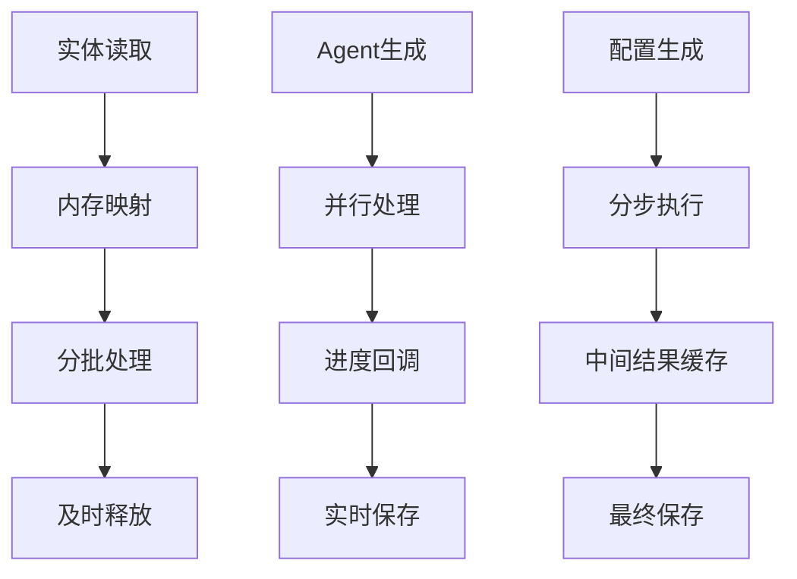

**图表来源**
- [simulation_manager.py](file://backend/app/services/simulation_manager.py#L317-L346)
- [simulation_config_generator.py](file://backend/app/services/simulation_config_generator.py#L214-L222)

## 故障排除指南

### 常见问题及解决方案

#### 实体读取失败

**问题症状**：实体数量为0或读取超时

**可能原因**：
1. Zep API密钥配置错误
2. 图谱ID无效
3. 网络连接问题

**解决步骤**：
1. 验证ZEP_API_KEY配置
2. 检查graph_id有效性
3. 查看后端日志获取详细错误信息

#### Agent生成失败

**问题症状**：Agent Profile生成中断或失败

**可能原因**：
1. LLM API密钥配置错误
2. 实体上下文过大
3. 网络超时

**解决步骤**：
1. 验证LLM_API_KEY配置
2. 检查实体数量是否过多
3. 增加超时时间配置

#### 配置生成失败

**问题症状**：模拟配置生成失败

**可能原因**：
1. LLM响应格式错误
2. 实体类型不匹配
3. 上下文长度超限

**解决步骤**：
1. 检查LLM响应格式
2. 验证实体类型定义
3. 截断上下文内容

**章节来源**
- [simulation.py](file://backend/app/api/simulation.py#L358-L635)
- [simulation_manager.py](file://backend/app/services/simulation_manager.py#L449-L456)

## 结论

步骤二环境搭建组件是MiroFish模拟系统的核心模块，实现了从知识图谱到可执行模拟环境的完整转换。该组件通过精心设计的架构和优化策略，确保了大规模实体处理的性能和可靠性。

### 主要优势

1. **模块化设计**：各组件职责明确，便于维护和扩展
2. **性能优化**：采用并行处理和分批操作，支持大规模数据处理
3. **智能生成**：利用LLM技术实现自动化配置生成
4. **用户友好**：提供直观的可视化界面和详细的状态反馈

### 技术特色

1. **多平台支持**：同时支持Twitter和Reddit平台的模拟
2. **智能配置**：基于实体类型和上下文自动调整模拟参数
3. **实时监控**：提供详细的进度跟踪和状态反馈
4. **错误恢复**：支持断点续传和错误恢复机制

该组件为后续的模拟运行奠定了坚实的基础，确保了整个MiroFish系统的稳定性和可靠性。