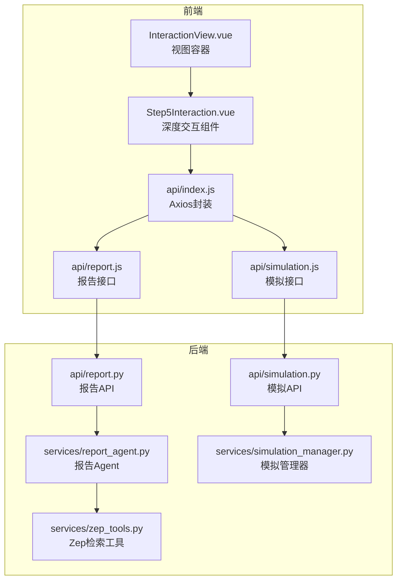
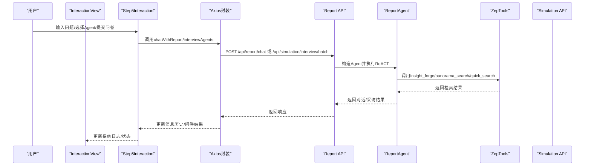
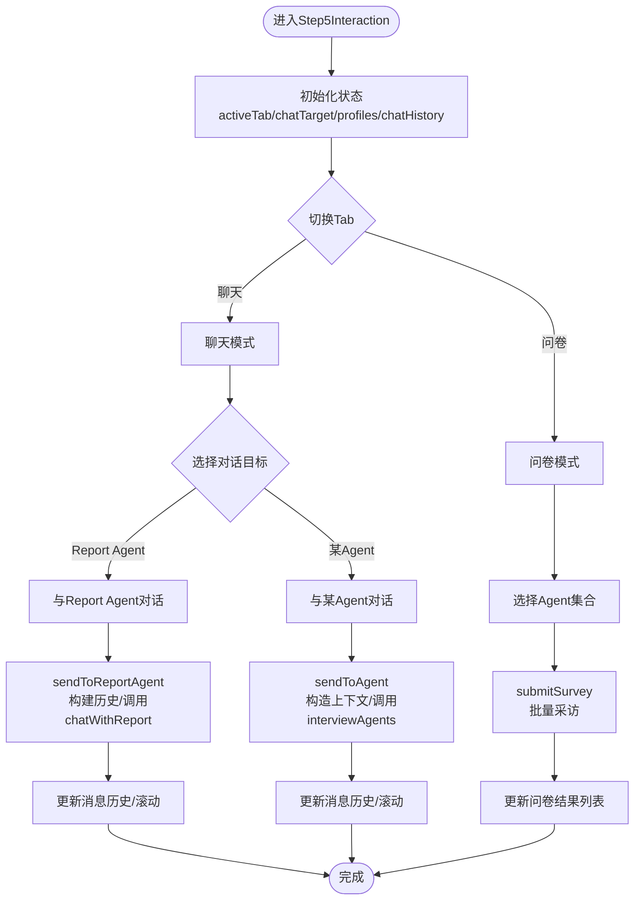
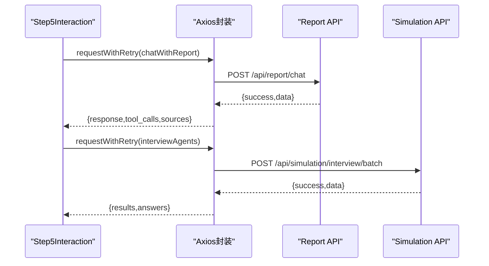
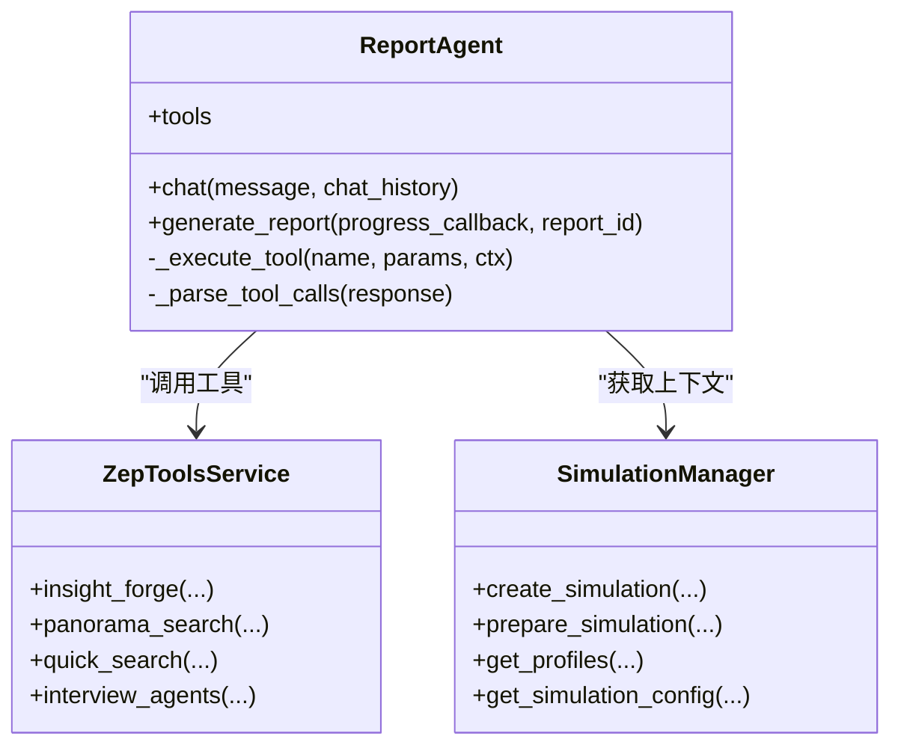
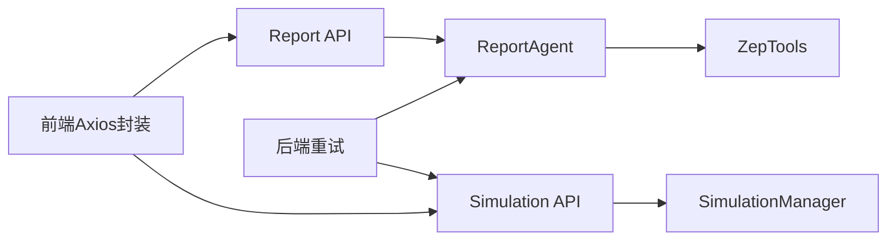

# 步骤五：深度交互

<cite>
**本文档引用的文件**
- [frontend/src/components/Step5Interaction.vue](file://frontend/src/components/Step5Interaction.vue)
- [frontend/src/views/InteractionView.vue](file://frontend/src/views/InteractionView.vue)
- [frontend/src/api/simulation.js](file://frontend/src/api/simulation.js)
- [frontend/src/api/report.js](file://frontend/src/api/report.js)
- [frontend/src/api/index.js](file://frontend/src/api/index.js)
- [backend/app/api/simulation.py](file://backend/app/api/simulation.py)
- [backend/app/api/report.py](file://backend/app/api/report.py)
- [backend/app/services/zep_tools.py](file://backend/app/services/zep_tools.py)
- [backend/app/services/report_agent.py](file://backend/app/services/report_agent.py)
- [backend/app/services/simulation_manager.py](file://backend/app/services/simulation_manager.py)
- [backend/app/utils/retry.py](file://backend/app/utils/retry.py)
</cite>

## 目录
1. [引言](#引言)
2. [项目结构](#项目结构)
3. [核心组件](#核心组件)
4. [架构总览](#架构总览)
5. [详细组件分析](#详细组件分析)
6. [依赖关系分析](#依赖关系分析)
7. [性能考虑](#性能考虑)
8. [故障排查指南](#故障排查指南)
9. [结论](#结论)
10. [附录](#附录)

## 引言
本文件面向“步骤五：深度交互”组件，系统性阐述MiroFish智能采访系统的实现机制与交互体验。组件提供与模拟环境的深度交互能力，包括：
- 多轮对话管理与上下文保持
- 问题生成与工具调用（InsightForge、PanoramaSearch、QuickSearch、InterviewSubAgent）
- Agent对话界面、行为查询、情景探索、假设测试
- UI设计：聊天界面、消息历史、输入框、快捷操作按钮
- 与后端交互服务的通信协议：HTTP API与重试机制
- 状态管理：会话状态、历史记录、用户偏好设置
- 交互式探索最佳实践

## 项目结构
前端采用Vue 3 Composition API，后端采用Flask，前后端通过REST API通信；深度交互组件位于前端Step5Interaction模块，负责与后端报告生成与模拟采访接口协作。

**图表来源**
- [frontend/src/views/InteractionView.vue](file://frontend/src/views/InteractionView.vue#L1-L214)
- [frontend/src/components/Step5Interaction.vue](file://frontend/src/components/Step5Interaction.vue#L1-L411)
- [frontend/src/api/index.js](file://frontend/src/api/index.js#L1-L68)
- [frontend/src/api/simulation.js](file://frontend/src/api/simulation.js#L1-L188)
- [frontend/src/api/report.js](file://frontend/src/api/report.js#L1-L52)
- [backend/app/api/report.py](file://backend/app/api/report.py#L1-L1016)
- [backend/app/api/simulation.py](file://backend/app/api/simulation.py#L1-L800)
- [backend/app/services/report_agent.py](file://backend/app/services/report_agent.py#L1-L800)
- [backend/app/services/zep_tools.py](file://backend/app/services/zep_tools.py#L1-L800)
- [backend/app/services/simulation_manager.py](file://backend/app/services/simulation_manager.py#L1-L529)

**章节来源**
- [frontend/src/views/InteractionView.vue](file://frontend/src/views/InteractionView.vue#L1-L214)
- [frontend/src/components/Step5Interaction.vue](file://frontend/src/components/Step5Interaction.vue#L1-L411)
- [frontend/src/api/index.js](file://frontend/src/api/index.js#L1-L68)
- [frontend/src/api/simulation.js](file://frontend/src/api/simulation.js#L1-L188)
- [frontend/src/api/report.js](file://frontend/src/api/report.js#L1-L52)
- [backend/app/api/report.py](file://backend/app/api/report.py#L1-L1016)
- [backend/app/api/simulation.py](file://backend/app/api/simulation.py#L1-L800)
- [backend/app/services/report_agent.py](file://backend/app/services/report_agent.py#L1-L800)
- [backend/app/services/zep_tools.py](file://backend/app/services/zep_tools.py#L1-L800)
- [backend/app/services/simulation_manager.py](file://backend/app/services/simulation_manager.py#L1-L529)

## 核心组件
- 深度交互组件（Step5Interaction.vue）：提供聊天界面、问卷调查、报告侧边栏、工具卡片等交互区域，负责状态管理与UI渲染。
- 交互视图（InteractionView.vue）：承载Step5组件，管理布局与全局状态（视图模式、状态指示、系统日志）。
- API层：封装HTTP请求与重试机制，分别对接模拟与报告后端接口。
- 后端服务：报告Agent负责ReACT多轮对话与工具调用；Zep工具提供InsightForge、PanoramaSearch、QuickSearch等检索能力；模拟管理器负责Agent人设与配置生成。

**章节来源**
- [frontend/src/components/Step5Interaction.vue](file://frontend/src/components/Step5Interaction.vue#L413-L751)
- [frontend/src/views/InteractionView.vue](file://frontend/src/views/InteractionView.vue#L64-L214)
- [frontend/src/api/index.js](file://frontend/src/api/index.js#L54-L68)
- [backend/app/services/report_agent.py](file://backend/app/services/report_agent.py#L469-L743)
- [backend/app/services/zep_tools.py](file://backend/app/services/zep_tools.py#L377-L440)

## 架构总览
深度交互组件通过HTTP API与后端交互，后端采用异步任务与工具链实现智能采访与报告生成。组件状态与后端状态通过接口同步，支持实时进度与章节内容获取。

**图表来源**
- [frontend/src/components/Step5Interaction.vue](file://frontend/src/components/Step5Interaction.vue#L614-L743)
- [frontend/src/api/report.js](file://frontend/src/api/report.js#L46-L52)
- [frontend/src/api/simulation.js](file://frontend/src/api/simulation.js#L172-L177)
- [backend/app/api/report.py](file://backend/app/api/report.py#L467-L560)
- [backend/app/api/simulation.py](file://backend/app/api/simulation.py#L1-L800)
- [backend/app/services/report_agent.py](file://backend/app/services/report_agent.py#L469-L743)
- [backend/app/services/zep_tools.py](file://backend/app/services/zep_tools.py#L377-L440)

## 详细组件分析

### 组件A：Step5Interaction 深度交互组件
- 功能职责
  - 聊天模式：与Report Agent对话、与任意Agent对话，支持上下文历史与工具卡片。
  - 问卷模式：批量采访多个Agent，聚合结果展示。
  - 报告侧边栏：展示报告大纲、章节生成状态与内容。
  - 状态管理：聊天历史缓存、Agent选择、问卷状态、报告大纲与章节缓存。
- 关键实现要点
  - 多轮对话：维护chatHistory，发送前截断历史长度，构造上下文提示词。
  - 上下文保持：saveChatHistory/restoreChatHistory，按目标（report_agent或agent_i）缓存。
  - 工具卡片：Report Agent工具集（InsightForge、PanoramaSearch、QuickSearch、InterviewSubAgent）。
  - Markdown渲染：renderMarkdown，支持标题、列表、代码块、引用等。
  - 问卷批量采访：interviewAgents，支持多Agent并行采访，兼容不同返回结构。
  - 报告侧边栏：根据报告生成进度动态展示章节内容与展开/折叠状态。
- UI交互
  - 聊天界面：消息头像、时间戳、滚动到底部、打字指示器。
  - 输入框：Enter发送、禁用态、高度自适应。
  - 快捷操作：Tab切换聊天/问卷、Agent下拉选择、问卷勾选、全选/清空。

**图表来源**
- [frontend/src/components/Step5Interaction.vue](file://frontend/src/components/Step5Interaction.vue#L413-L751)
- [frontend/src/api/report.js](file://frontend/src/api/report.js#L46-L52)
- [frontend/src/api/simulation.js](file://frontend/src/api/simulation.js#L172-L177)

**章节来源**
- [frontend/src/components/Step5Interaction.vue](file://frontend/src/components/Step5Interaction.vue#L413-L751)
- [frontend/src/api/report.js](file://frontend/src/api/report.js#L1-L52)
- [frontend/src/api/simulation.js](file://frontend/src/api/simulation.js#L1-L188)

### 组件B：InteractionView 视图容器
- 功能职责
  - 管理视图模式（图谱/双栏/工作台），左右面板布局切换。
  - 加载报告数据与图谱数据，传递给Step5组件。
  - 系统日志与状态指示，便于用户感知后端任务状态。
- 关键实现要点
  - 路由参数监听，动态加载报告与图谱。
  - 视图模式切换动画与样式控制。
  - 状态类名与文本映射，Ready/Processing/Completed/Error。

**章节来源**
- [frontend/src/views/InteractionView.vue](file://frontend/src/views/InteractionView.vue#L64-L214)

### 组件C：API封装与后端接口
- Axios封装
  - baseURL、超时、拦截器、重试函数requestWithRetry。
- 报告接口
  - chatWithReport：与Report Agent对话，支持历史上下文。
  - getReport/getReportStatus：获取报告与生成状态。
  - getAgentLog/getConsoleLog：增量获取Agent日志与控制台日志。
- 模拟接口
  - interviewAgents：批量采访Agent（双平台）。
  - getSimulationProfilesRealtime：实时获取Agent人设。
  - getSimulation/getPrepareStatus：获取模拟状态与准备进度。

**图表来源**
- [frontend/src/api/index.js](file://frontend/src/api/index.js#L54-L68)
- [frontend/src/api/report.js](file://frontend/src/api/report.js#L46-L52)
- [frontend/src/api/simulation.js](file://frontend/src/api/simulation.js#L172-L177)

**章节来源**
- [frontend/src/api/index.js](file://frontend/src/api/index.js#L1-L68)
- [frontend/src/api/report.js](file://frontend/src/api/report.js#L1-L52)
- [frontend/src/api/simulation.js](file://frontend/src/api/simulation.js#L1-L188)

### 组件D：后端服务与工具链
- ReportAgent（ReACT）
  - 工具定义：insight_forge、panorama_search、quick_search、interview_agents。
  - 对话流程：解析工具调用、执行工具、记录日志、生成响应。
  - 工具调用解析：支持XML与函数调用两种格式。
- ZepTools（检索工具）
  - InsightForge：自动生成子问题，多维度检索，整合事实、实体、关系链。
  - PanoramaSearch：获取全貌，区分有效/历史事实。
  - QuickSearch：快速检索。
  - InterviewAgents：真实采访模拟Agent，双平台（Twitter/Reddit）。
- SimulationManager（模拟管理）
  - 生成Agent人设与模拟配置，准备模拟环境，提供实时Profile与Config。

**图表来源**
- [backend/app/services/report_agent.py](file://backend/app/services/report_agent.py#L469-L743)
- [backend/app/services/zep_tools.py](file://backend/app/services/zep_tools.py#L377-L440)
- [backend/app/services/simulation_manager.py](file://backend/app/services/simulation_manager.py#L114-L529)

**章节来源**
- [backend/app/services/report_agent.py](file://backend/app/services/report_agent.py#L1-L800)
- [backend/app/services/zep_tools.py](file://backend/app/services/zep_tools.py#L1-L800)
- [backend/app/services/simulation_manager.py](file://backend/app/services/simulation_manager.py#L1-L529)

## 依赖关系分析
- 前端依赖
  - Axios封装统一处理请求与重试。
  - Step5Interaction依赖API层，API层依赖后端路由。
- 后端依赖
  - Report API依赖ReportAgent与ZepTools。
  - Simulation API依赖SimulationManager与ZepGraphMemoryUpdater（用于图谱记忆更新）。
- 重试机制
  - 前端：requestWithRetry（指数退避）。
  - 后端：retry_with_backoff（装饰器）与RetryableAPIClient。

**图表来源**
- [frontend/src/api/index.js](file://frontend/src/api/index.js#L54-L68)
- [backend/app/utils/retry.py](file://backend/app/utils/retry.py#L15-L78)
- [backend/app/api/report.py](file://backend/app/api/report.py#L1-L1016)
- [backend/app/api/simulation.py](file://backend/app/api/simulation.py#L1-L800)

**章节来源**
- [frontend/src/api/index.js](file://frontend/src/api/index.js#L1-L68)
- [backend/app/utils/retry.py](file://backend/app/utils/retry.py#L1-L239)
- [backend/app/api/report.py](file://backend/app/api/report.py#L1-L1016)
- [backend/app/api/simulation.py](file://backend/app/api/simulation.py#L1-L800)

## 性能考虑
- 前端
  - Markdown渲染与长消息列表的虚拟滚动建议（当前实现为简单渲染，可扩展）。
  - 输入框自适应高度与滚动定位优化用户体验。
- 后端
  - 工具调用与LLM请求采用指数退避重试，降低外部依赖波动影响。
  - 模拟准备阶段分阶段进度上报，前端可渐进式展示。
  - InterviewAgents支持批量采访，减少往返开销。

[本节为通用指导，无需特定文件引用]

## 故障排查指南
- 常见错误
  - API返回success=false：检查后端日志与参数校验。
  - 网络错误/超时：确认Axios拦截器与后端服务连通性。
  - Report Agent工具调用失败：检查Zep API Key与工具参数。
- 建议排查步骤
  - 查看系统日志（InteractionView中的systemLogs）。
  - 增量获取Agent日志（getAgentLog）与控制台日志（getConsoleLog）。
  - 检查模拟状态与准备进度（getPrepareStatus/getSimulation）。
  - 重试请求（requestWithRetry）或后端重试装饰器。

**章节来源**
- [frontend/src/views/InteractionView.vue](file://frontend/src/views/InteractionView.vue#L119-L129)
- [frontend/src/api/report.js](file://frontend/src/api/report.js#L19-L35)
- [backend/app/api/report.py](file://backend/app/api/report.py#L751-L800)
- [backend/app/api/simulation.py](file://backend/app/api/simulation.py#L637-L748)
- [frontend/src/api/index.js](file://frontend/src/api/index.js#L54-L68)

## 结论
Step5深度交互组件通过清晰的UI设计与完善的后端工具链，实现了与模拟环境的多维交互：既能与Report Agent进行ReACT多轮对话，又能对真实运行的Agent进行批量采访，同时提供报告侧边栏与问卷调查能力。前后端通过HTTP API与重试机制协同，保障了交互的稳定性与可扩展性。建议在实际使用中遵循最佳实践，充分利用工具与上下文保持能力，开展高质量的创新性研究与分析。

[本节为总结性内容，无需特定文件引用]

## 附录
- 术语
  - InsightForge：深度洞察检索，自动生成子问题并多维度检索。
  - PanoramaSearch：广度搜索，获取全貌与历史/过期内容。
  - QuickSearch：简单搜索，快速检索。
  - InterviewSubAgent：真实采访，调用双平台Agent获取观点。
- 最佳实践
  - 对话前先回顾上下文，避免冗余信息。
  - 使用InsightForge进行复杂问题拆解，再用QuickSearch细化事实。
  - 通过问卷模式收集多视角观点，辅助报告生成。
  - 利用报告侧边栏跟踪章节生成进度，及时调整问题方向。

[本节为概念性内容，无需特定文件引用]