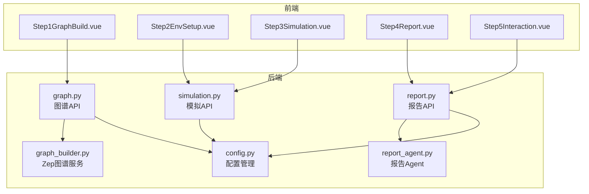
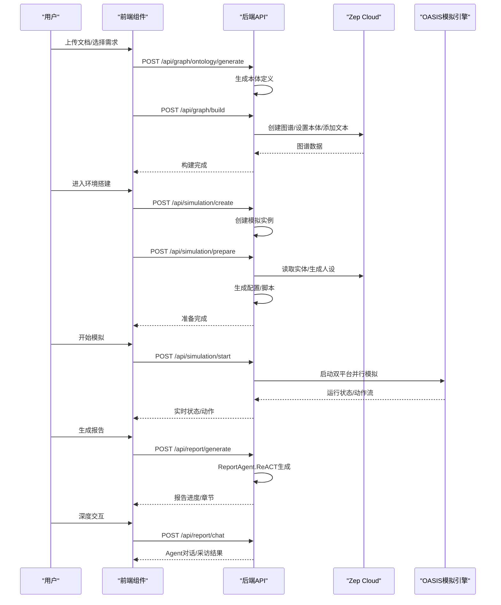
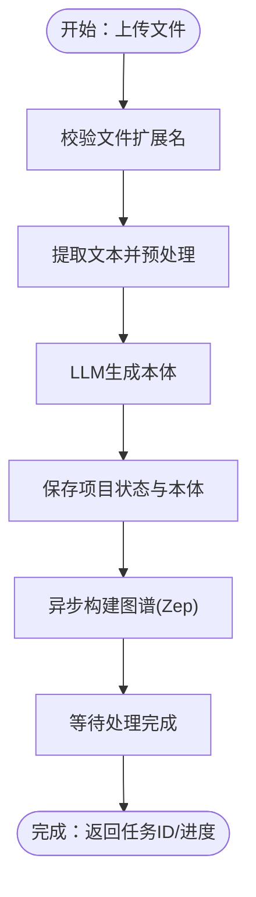
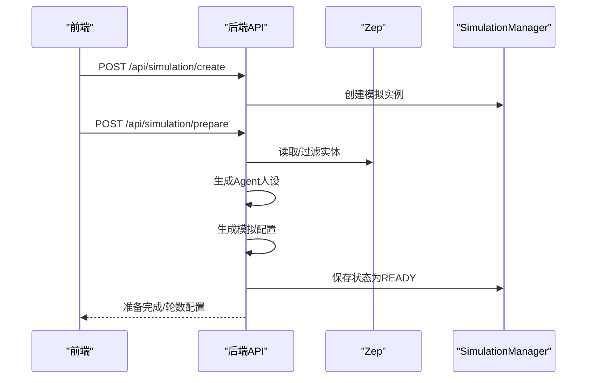
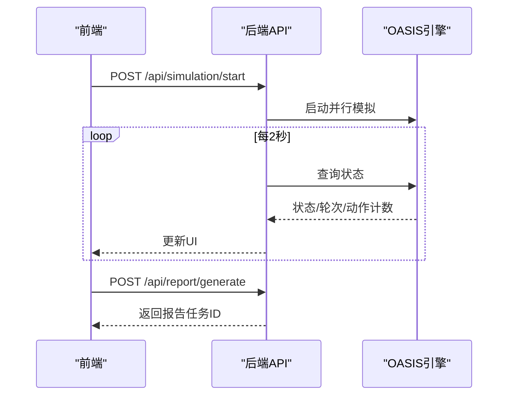
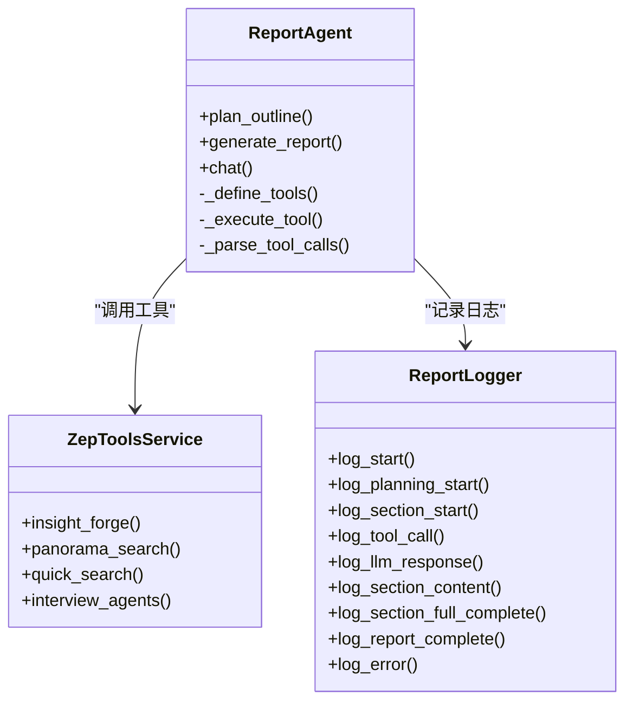
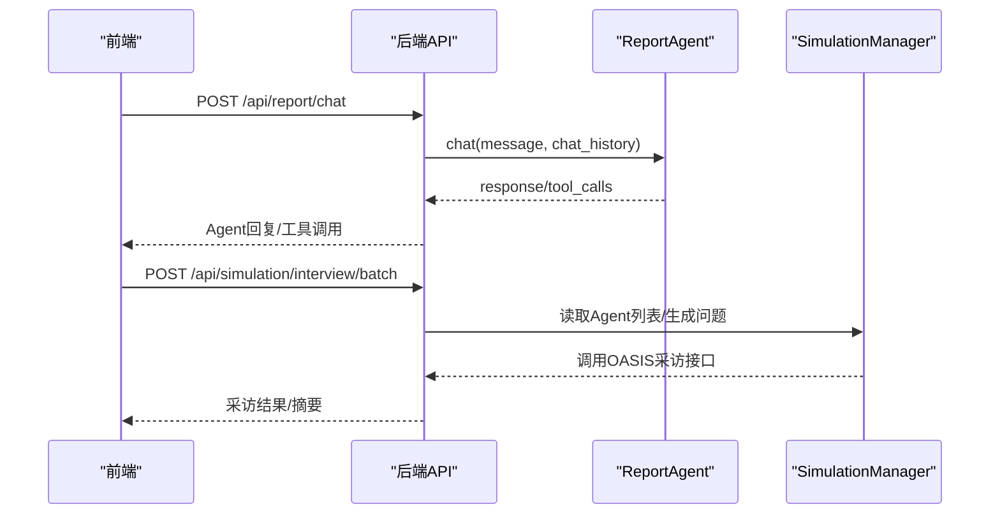
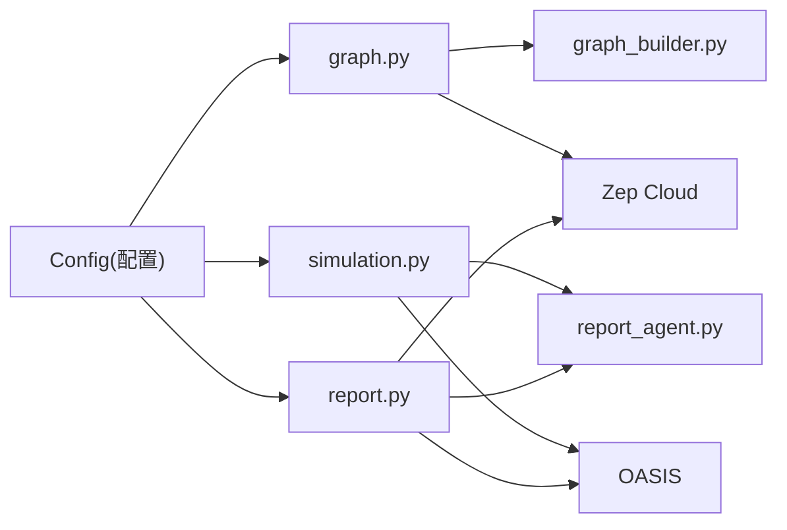

# 步骤化工作流组件

<cite>
**本文档引用的文件**
- [README.md](file://README.md)
- [config.py](file://backend/app/config.py)
- [graph.py](file://backend/app/api/graph.py)
- [simulation.py](file://backend/app/api/simulation.py)
- [report.py](file://backend/app/api/report.py)
- [graph_builder.py](file://backend/app/services/graph_builder.py)
- [report_agent.py](file://backend/app/services/report_agent.py)
- [Step1GraphBuild.vue](file://frontend/src/components/Step1GraphBuild.vue)
- [Step2EnvSetup.vue](file://frontend/src/components/Step2EnvSetup.vue)
- [Step3Simulation.vue](file://frontend/src/components/Step3Simulation.vue)
- [Step4Report.vue](file://frontend/src/components/Step4Report.vue)
- [Step5Interaction.vue](file://frontend/src/components/Step5Interaction.vue)
</cite>

## 目录
1. [引言](#引言)
2. [项目结构](#项目结构)
3. [核心组件](#核心组件)
4. [架构总览](#架构总览)
5. [详细组件分析](#详细组件分析)
6. [依赖关系分析](#依赖关系分析)
7. [性能考虑](#性能考虑)
8. [故障排查指南](#故障排查指南)
9. [结论](#结论)

## 引言
本文件面向MiroFish步骤化工作流组件的使用者与维护者，系统性阐述从Step1图谱构建到Step5深度交互的完整流程。文档聚焦五个核心步骤的设计理念、功能实现、数据流转与状态管理，并给出配置选项、事件处理与错误恢复机制说明，帮助读者高效理解与使用该工作流。

## 项目结构
MiroFish采用前后端分离架构：
- 前端（Vue3 + Vite）：负责可视化工作流面板与实时交互，包含Step1~Step5的组件。
- 后端（Python Flask）：提供图谱构建、模拟准备与运行、报告生成与交互等API服务，配合Zep Cloud与OASIS模拟引擎。

**图表来源**
- [Step1GraphBuild.vue](file://frontend/src/components/Step1GraphBuild.vue#L1-L699)
- [Step2EnvSetup.vue](file://frontend/src/components/Step2EnvSetup.vue#L1-L800)
- [Step3Simulation.vue](file://frontend/src/components/Step3Simulation.vue#L1-L800)
- [Step4Report.vue](file://frontend/src/components/Step4Report.vue#L1-L800)
- [Step5Interaction.vue](file://frontend/src/components/Step5Interaction.vue#L1-L800)
- [graph.py](file://backend/app/api/graph.py#L1-L618)
- [simulation.py](file://backend/app/api/simulation.py#L1-L800)
- [report.py](file://backend/app/api/report.py#L1-L800)
- [graph_builder.py](file://backend/app/services/graph_builder.py#L1-L500)
- [report_agent.py](file://backend/app/services/report_agent.py#L1-L800)
- [config.py](file://backend/app/config.py#L1-L76)

**章节来源**
- [README.md](file://README.md#L81-L87)

## 核心组件
- Step1 图谱构建：文件上传与本体生成、GraphRAG构建、Zep图谱创建与数据导入。
- Step2 环境搭建：实体关系抽取、Agent人设生成、双平台模拟配置、初始激活编排。
- Step3 模拟运行：双平台并行模拟、状态监控、参数调整、动态图谱更新。
- Step4 报告生成：Report Agent采用ReACT模式，工具集成与章节化生成。
- Step5 深度交互：与Report Agent对话、与模拟Agent采访、问卷调查与结果分析。

**章节来源**
- [README.md](file://README.md#L81-L87)

## 架构总览
整体工作流遵循“数据驱动 + 工具增强”的设计原则：前端通过API驱动后端服务，后端利用LLM与外部服务（Zep Cloud、OASIS）完成知识抽取、Agent生成与模拟运行；报告阶段引入ReACT模式与工具链，实现高质量报告生成与交互。

**图表来源**
- [graph.py](file://backend/app/api/graph.py#L121-L524)
- [simulation.py](file://backend/app/api/simulation.py#L164-L780)
- [report.py](file://backend/app/api/report.py#L24-L196)
- [graph_builder.py](file://backend/app/services/graph_builder.py#L186-L494)
- [report_agent.py](file://backend/app/services/report_agent.py#L469-L800)
- [Step1GraphBuild.vue](file://frontend/src/components/Step1GraphBuild.vue#L212-L244)
- [Step2EnvSetup.vue](file://frontend/src/components/Step2EnvSetup.vue#L741-L755)
- [Step3Simulation.vue](file://frontend/src/components/Step3Simulation.vue#L380-L435)
- [Step4Report.vue](file://frontend/src/components/Step4Report.vue#L1-L800)
- [Step5Interaction.vue](file://frontend/src/components/Step5Interaction.vue#L614-L743)

## 详细组件分析

### Step1 图谱构建：文件上传与本体生成
- 设计理念
  - 以“种子材料”为输入，结合模拟需求，自动生成本体结构，再基于本体构建GraphRAG。
  - 通过Zep Cloud完成实体/关系抽取与时序记忆构建。
- 前端交互
  - 展示本体生成进度、实体/关系类型详情与Graph统计信息。
  - 支持进入下一步（创建模拟实例）。
- 后端流程
  - 上传文件校验与文本提取 → 本体生成（LLM）→ 保存项目状态 → 异步构建图谱（Zep）→ 返回任务ID与进度。
- 关键API
  - POST /api/graph/ontology/generate：生成本体
  - POST /api/graph/build：构建图谱
  - GET /api/graph/task/{task_id}：查询任务进度
- 数据与状态
  - 项目状态机：CREATED → ONTOLOGY_GENERATED → GRAPH_BUILDING → GRAPH_COMPLETED/FAILED
  - 前端通过系统仪表盘实时展示日志与进度

**图表来源**
- [graph.py](file://backend/app/api/graph.py#L121-L524)
- [graph_builder.py](file://backend/app/services/graph_builder.py#L52-L184)
- [Step1GraphBuild.vue](file://frontend/src/components/Step1GraphBuild.vue#L1-L699)

**章节来源**
- [graph.py](file://backend/app/api/graph.py#L121-L524)
- [graph_builder.py](file://backend/app/services/graph_builder.py#L186-L494)
- [Step1GraphBuild.vue](file://frontend/src/components/Step1GraphBuild.vue#L1-L699)

### Step2 环境搭建：实体关系抽取与Agent配置
- 设计理念
  - 基于图谱实体生成Agent人设，智能生成双平台（Twitter/Reddit）模拟配置，提供初始激活事件与热点话题。
- 前端交互
  - 展示Agent人设列表与统计、双平台配置卡片、时间流速与活跃时段、推荐算法权重。
  - 支持自定义模拟轮数（自动/手动），并提供“返回图谱构建”与“开始模拟”入口。
- 后端流程
  - 检测是否已有准备完成的环境 → 读取图谱实体 → 生成Agent人设（可并行）→ LLM生成模拟配置 → 保存配置与脚本 → 状态更新为READY。
- 关键API
  - POST /api/simulation/create：创建模拟实例
  - POST /api/simulation/prepare：准备环境（异步）
  - POST /api/simulation/prepare/status：查询准备进度
- 状态管理
  - 模拟状态机：CREATED → PREPARING → READY → RUNNING → COMPLETED/STOPPED/FAILED

**图表来源**
- [simulation.py](file://backend/app/api/simulation.py#L164-L780)
- [Step2EnvSetup.vue](file://frontend/src/components/Step2EnvSetup.vue#L1-L800)

**章节来源**
- [simulation.py](file://backend/app/api/simulation.py#L358-L747)
- [Step2EnvSetup.vue](file://frontend/src/components/Step2EnvSetup.vue#L1-L800)

### Step3 模拟运行：状态监控与参数调整
- 设计理念
  - 双平台并行模拟，实时监控运行状态与动作流，支持动态图谱更新与轮数控制。
- 前端交互
  - 显示Twitter/Reddit平台进度、轮次、耗时、动作计数与可用动作提示。
  - 实时时间轴展示动作详情（发布、转发、点赞、评论、搜索、关注等）。
  - 支持“开始生成结果报告”按钮，触发报告生成。
- 后端流程
  - 启动模拟（可强制重启）→ 轮询运行状态与动作流 → 动态图谱更新 → 完成后进入报告阶段。
- 关键API
  - POST /api/simulation/start：启动模拟
  - GET /api/simulation/status：查询运行状态
  - GET /api/simulation/status/detail：获取动作流
  - POST /api/simulation/stop：停止模拟
- 事件与错误处理
  - 轮询间隔与超时控制，平台完成状态检测，异常时更新状态为ERROR并记录日志。

**图表来源**
- [Step3Simulation.vue](file://frontend/src/components/Step3Simulation.vue#L380-L590)
- [simulation.py](file://backend/app/api/simulation.py#L750-L800)
- [report.py](file://backend/app/api/report.py#L24-L196)

**章节来源**
- [Step3Simulation.vue](file://frontend/src/components/Step3Simulation.vue#L1-L800)
- [simulation.py](file://backend/app/api/simulation.py#L750-L800)

### Step4 报告生成：ReACT模式与工具集成
- 设计理念
  - Report Agent采用ReACT（推理+行动）模式，先规划大纲，再逐章节生成，期间可多次调用检索工具（深度洞察、全景搜索、快速检索、Agent采访）。
- 前端交互
  - 左侧面板展示报告大纲与章节内容，右侧时间线展示Agent执行日志（工具调用、LLM响应、章节完成等）。
  - 支持展开/折叠章节、查看工具参数与结果、切换结构化/原始输出。
- 后端流程
  - 异步生成报告 → 记录agent_log.jsonl与console_log.txt → 分章节输出 → 完成后解锁深度交互。
- 关键API
  - POST /api/report/generate：生成报告（异步）
  - GET /api/report/generate/status：查询进度
  - GET /api/report/{report_id}/sections：获取已生成章节
  - POST /api/report/chat：与Report Agent对话
- 工具能力
  - insight_forge：深度归因与多维检索
  - panorama_search：全貌视图（含历史/过期）
  - quick_search：快速检索
  - interview_agents：真实Agent采访（双平台）

**图表来源**
- [report_agent.py](file://backend/app/services/report_agent.py#L469-L800)
- [report.py](file://backend/app/api/report.py#L24-L196)

**章节来源**
- [Step4Report.vue](file://frontend/src/components/Step4Report.vue#L1-L800)
- [report_agent.py](file://backend/app/services/report_agent.py#L469-L800)
- [report.py](file://backend/app/api/report.py#L24-L196)

### Step5 深度交互：智能采访与结果分析
- 设计理念
  - 在报告完成后解锁交互功能，支持与Report Agent对话、与任意模拟Agent进行采访、批量问卷调查。
- 前端交互
  - 左侧面板展示报告内容；右侧提供聊天与问卷两大模块。
  - 聊天支持Report Agent工具面板与Agent选择下拉；问卷支持多Agent勾选与批量发送。
- 后端流程
  - 与Report Agent对话：携带历史上下文，Agent可自主调用工具检索。
  - 与Agent采访：根据主题智能选择Agent，调用OASIS真实采访接口，聚合Twitter/Reddit双平台回答。
  - 问卷调查：批量向选定Agent发送问题，汇总回答。
- 关键API
  - POST /api/report/chat：与Report Agent对话
  - POST /api/simulation/interview/batch：批量采访
  - GET /api/report/check/{simulation_id}：检查报告状态以解锁交互

**图表来源**
- [Step5Interaction.vue](file://frontend/src/components/Step5Interaction.vue#L414-L743)
- [report.py](file://backend/app/api/report.py#L467-L559)
- [simulation.py](file://backend/app/api/simulation.py#L1-L800)

**章节来源**
- [Step5Interaction.vue](file://frontend/src/components/Step5Interaction.vue#L1-L800)
- [report.py](file://backend/app/api/report.py#L467-L559)
- [simulation.py](file://backend/app/api/simulation.py#L1-L800)

## 依赖关系分析
- 组件耦合
  - 前端各Step组件通过HTTP API与后端解耦，状态主要由后端服务端状态机与任务管理器维护。
  - 后端服务层（graph_builder、report_agent）与API层通过统一的配置中心（config.py）读取环境变量。
- 外部依赖
  - Zep Cloud：图谱创建、本体设置、实体/关系检索。
  - OASIS：Agent人设生成、双平台模拟运行、真实采访接口。
  - LLM：本体生成、配置生成、报告规划与生成。
- 潜在循环依赖
  - API层仅作为入口，不直接依赖服务层内部细节，避免循环依赖。
- 配置与契约
  - 配置集中于Config类，统一读取.env或环境变量，API层在启动时校验必要配置。

**图表来源**
- [config.py](file://backend/app/config.py#L20-L76)
- [graph.py](file://backend/app/api/graph.py#L1-L618)
- [simulation.py](file://backend/app/api/simulation.py#L1-L800)
- [report.py](file://backend/app/api/report.py#L1-L800)
- [graph_builder.py](file://backend/app/services/graph_builder.py#L1-L500)
- [report_agent.py](file://backend/app/services/report_agent.py#L1-L800)

**章节来源**
- [config.py](file://backend/app/config.py#L20-L76)

## 性能考虑
- 异步任务与轮询
  - 图谱构建、模拟准备、报告生成均采用异步任务与进度回调，前端通过定时轮询获取最新状态，避免阻塞。
- 批量与限流
  - Zep Cloud文本分批发送与等待策略，控制请求频率与处理时延。
- 资源控制
  - 模拟轮数可配置（自动/手动），首次运行建议使用较小轮数以降低资源消耗与失败概率。
- I/O与存储
  - 报告日志（JSONL/文本）与章节文件按报告ID隔离存储，便于并发与清理。

[本节为通用指导，不直接分析具体文件]

## 故障排查指南
- 常见错误与定位
  - 缺少配置：检查LLM_API_KEY、ZEP_API_KEY是否正确配置。
  - 文件格式不支持：确认上传扩展名为pdf/md/txt/markdown之一。
  - 项目状态异常：ONTOLOGY_GENERATED前无法构建图谱；GRAPH_BUILDING中避免重复提交。
  - 模拟未准备完成：检查prepare状态，必要时强制重新生成。
  - 报告未生成：确认模拟已完成并存在报告；必要时强制重新生成。
- 前端日志与仪表盘
  - Step1/2/3/4/5均提供系统/控制台日志面板，滚动至底部可查看最新输出。
- 后端日志
  - API层与服务层均记录详细错误堆栈，可通过任务ID与报告ID定位问题。

**章节来源**
- [config.py](file://backend/app/config.py#L66-L75)
- [graph.py](file://backend/app/api/graph.py#L285-L294)
- [simulation.py](file://backend/app/api/simulation.py#L423-L446)
- [report.py](file://backend/app/api/report.py#L70-L106)

## 结论
MiroFish步骤化工作流以清晰的五步流程串联起“知识抽取—环境准备—模拟运行—报告生成—深度交互”，通过前后端协作与外部服务集成，实现了从种子材料到预测报告与深度互动的完整闭环。建议在首次运行时采用较小轮数与简化配置，逐步熟悉流程后再进行大规模模拟与复杂分析。