# 步骤四：报告生成

<cite>
**本文档引用的文件**
- [frontend/src/components/Step4Report.vue](file://frontend/src/components/Step4Report.vue)
- [frontend/src/views/ReportView.vue](file://frontend/src/views/ReportView.vue)
- [frontend/src/api/report.js](file://frontend/src/api/report.js)
- [backend/app/api/report.py](file://backend/app/api/report.py)
- [backend/app/services/report_agent.py](file://backend/app/services/report_agent.py)
- [backend/app/services/zep_tools.py](file://backend/app/services/zep_tools.py)
</cite>

## 目录
1. [简介](#简介)
2. [项目结构](#项目结构)
3. [核心组件](#核心组件)
4. [架构概览](#架构概览)
5. [详细组件分析](#详细组件分析)
6. [依赖分析](#依赖分析)
7. [性能考虑](#性能考虑)
8. [故障排除指南](#故障排除指南)
9. [结论](#结论)
10. [附录](#附录)

## 简介

步骤四报告生成组件是MiroFish模拟预测系统的核心模块，负责基于模拟结果生成深度分析报告。该组件实现了完整的ReACT（推理-行动-反思）模式，集成了智能工具集，提供实时的报告生成体验。

本组件的主要功能包括：
- ReACT模式的AI工作流程实现
- 多种智能工具的集成与管理
- 实时报告生成进度跟踪
- 交互式报告预览界面
- 深度采访系统的智能集成
- 报告下载与格式转换

## 项目结构

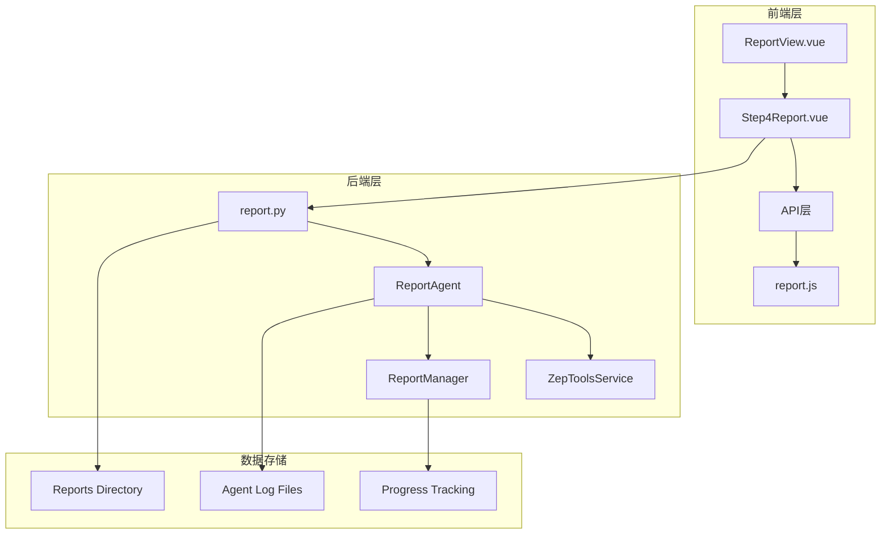

**图表来源**
- [frontend/src/views/ReportView.vue](file://frontend/src/views/ReportView.vue#L1-L62)
- [frontend/src/components/Step4Report.vue](file://frontend/src/components/Step4Report.vue#L1-L390)
- [backend/app/api/report.py](file://backend/app/api/report.py#L1-L100)

**章节来源**
- [frontend/src/views/ReportView.vue](file://frontend/src/views/ReportView.vue#L1-L62)
- [frontend/src/components/Step4Report.vue](file://frontend/src/components/Step4Report.vue#L1-L80)

## 核心组件

### 前端组件架构

步骤四报告生成组件采用Vue 3 Composition API构建，主要包含以下核心组件：

#### 主要组件职责

1. **ReportView** - 主视图容器，负责数据加载和布局管理
2. **Step4Report** - 核心报告生成组件，实现ReACT模式
3. **工具面板** - 展示和管理各种智能工具
4. **报告预览** - 实时渲染生成的报告内容

#### 状态管理系统

组件使用响应式状态管理来跟踪报告生成的各个阶段：

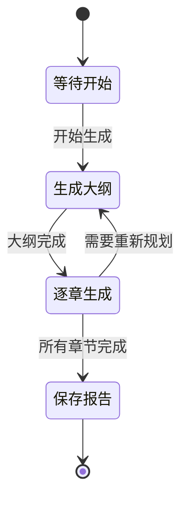

**图表来源**
- [backend/app/services/report_agent.py](file://backend/app/services/report_agent.py#L1424-L1564)

**章节来源**
- [frontend/src/components/Step4Report.vue](file://frontend/src/components/Step4Report.vue#L1670-L1790)
- [backend/app/services/report_agent.py](file://backend/app/services/report_agent.py#L1424-L1564)

## 架构概览

### ReACT模式实现

报告生成组件实现了完整的ReACT（推理-行动-反思）模式：

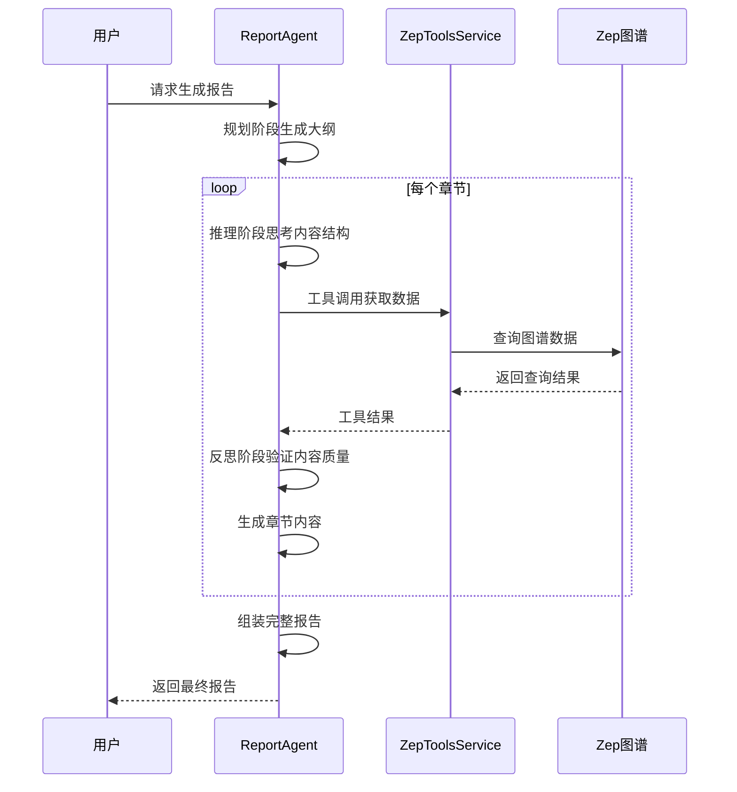

**图表来源**
- [backend/app/services/report_agent.py](file://backend/app/services/report_agent.py#L469-L1728)

### 工具集集成机制

组件集成了多种智能工具，每种工具都有特定的功能和用途：

#### 核心工具功能

1. **InsightForge** - 深度洞察检索，自动分解问题并多维度检索
2. **PanoramaSearch** - 广度搜索，获取事件全貌和历史演变
3. **QuickSearch** - 快速检索，处理简单直接的信息查询
4. **InterviewAgents** - 深度采访，获取模拟Agent的真实观点

**章节来源**
- [backend/app/services/report_agent.py](file://backend/app/services/report_agent.py#L530-L632)
- [backend/app/services/zep_tools.py](file://backend/app/services/zep_tools.py#L1-L200)

## 详细组件分析

### ReACT模式实现详解

#### 推理阶段（Reasoning）

推理阶段负责分析模拟需求并规划报告结构：

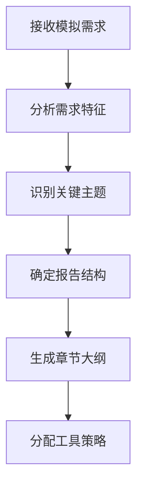

**图表来源**
- [backend/app/services/report_agent.py](file://backend/app/services/report_agent.py#L795-L856)

#### 行动阶段（Acting）

行动阶段通过工具调用获取所需数据：

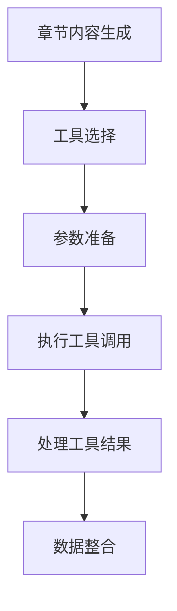

**图表来源**
- [backend/app/services/report_agent.py](file://backend/app/services/report_agent.py#L634-L743)

#### 反思阶段（Reflecting）

反思阶段验证内容的完整性和准确性：

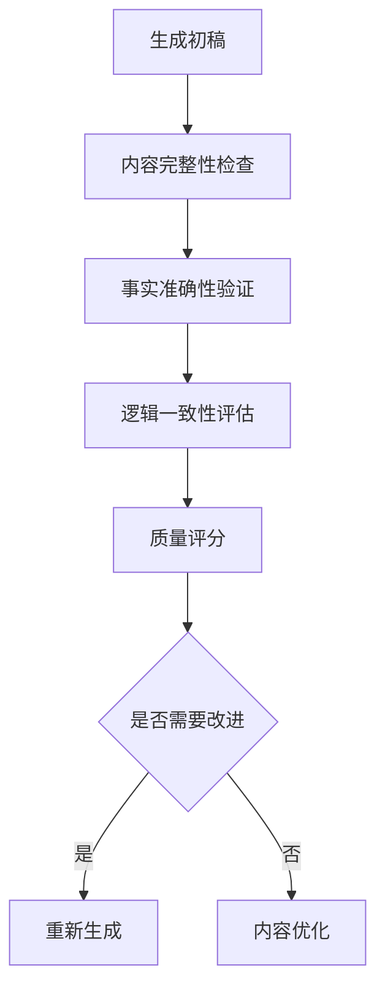

**图表来源**
- [backend/app/services/report_agent.py](file://backend/app/services/report_agent.py#L1592-L1728)

**章节来源**
- [backend/app/services/report_agent.py](file://backend/app/services/report_agent.py#L469-L1728)

### 智能采访系统

深度采访系统能够智能选择合适的模拟Agent并获取真实观点：

#### Agent选择算法

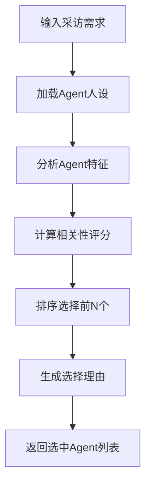

**图表来源**
- [backend/app/services/zep_tools.py](file://backend/app/services/zep_tools.py#L1527-L1565)

#### 采访问题生成

系统能够自动生成针对不同Agent角色的采访问题：

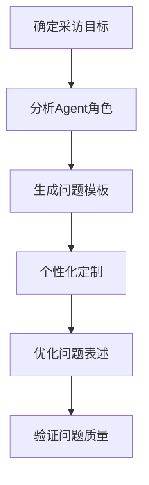

**图表来源**
- [backend/app/services/zep_tools.py](file://backend/app/services/zep_tools.py#L1567-L1595)

**章节来源**
- [backend/app/services/zep_tools.py](file://backend/app/services/zep_tools.py#L1280-L1595)

### 报告生成UI设计

#### 报告预览界面

报告预览界面采用响应式设计，支持多种视图模式：

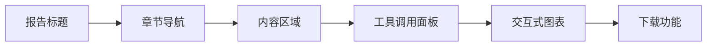

**图表来源**
- [frontend/src/components/Step4Report.vue](file://frontend/src/components/Step4Report.vue#L2236-L2407)

#### 工具调用面板

工具调用面板提供实时的工具使用情况监控：

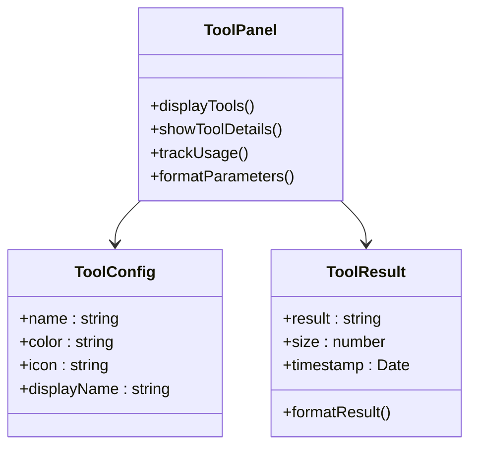

**图表来源**
- [frontend/src/components/Step4Report.vue](file://frontend/src/components/Step4Report.vue#L495-L540)

**章节来源**
- [frontend/src/components/Step4Report.vue](file://frontend/src/components/Step4Report.vue#L1-L390)

### 报告生成流程

#### 分章节输出机制

系统采用分章节输出的方式，确保用户可以实时查看生成进度：

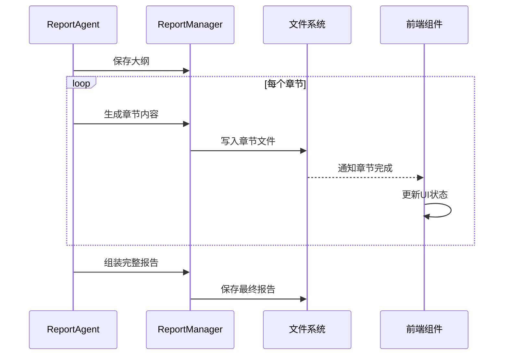

**图表来源**
- [backend/app/services/report_agent.py](file://backend/app/services/report_agent.py#L1456-L1564)

**章节来源**
- [backend/app/services/report_agent.py](file://backend/app/services/report_agent.py#L1942-L2115)

## 依赖分析

### 组件间依赖关系

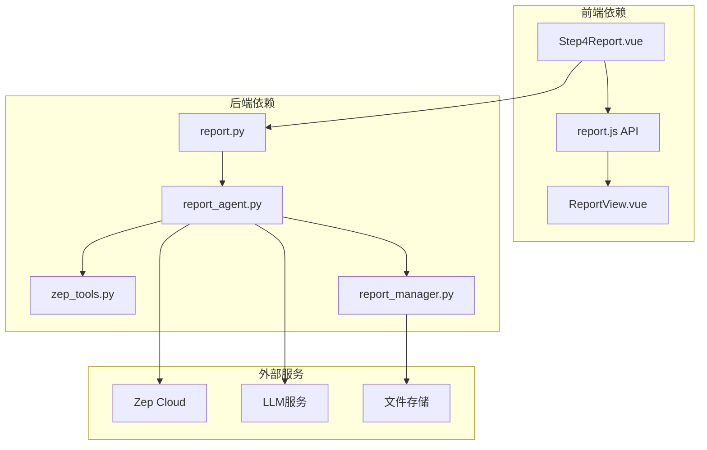

**图表来源**
- [frontend/src/components/Step4Report.vue](file://frontend/src/components/Step4Report.vue#L392-L410)
- [backend/app/api/report.py](file://backend/app/api/report.py#L1-L20)

### 数据流依赖

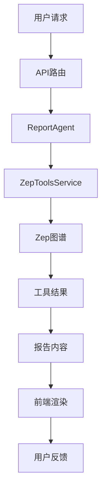

**图表来源**
- [backend/app/api/report.py](file://backend/app/api/report.py#L24-L196)
- [backend/app/services/report_agent.py](file://backend/app/services/report_agent.py#L134-L152)

**章节来源**
- [backend/app/api/report.py](file://backend/app/api/report.py#L1-L1016)
- [backend/app/services/report_agent.py](file://backend/app/services/report_agent.py#L1-L800)

## 性能考虑

### 异步处理机制

报告生成采用异步处理方式，避免阻塞用户界面：

- **后台线程**：使用Python线程池处理长时间运行的任务
- **增量更新**：前端定期轮询获取最新状态
- **进度跟踪**：实时显示生成进度和剩余时间

### 缓存策略

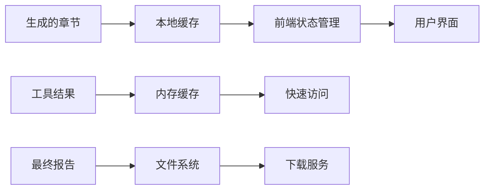

**图表来源**
- [backend/app/services/report_agent.py](file://backend/app/services/report_agent.py#L1942-L1976)

### 优化建议

1. **并发工具调用**：在允许的情况下并行执行独立的工具调用
2. **结果压缩**：对大型工具结果进行压缩存储
3. **智能刷新**：根据用户行为调整轮询频率
4. **内存管理**：及时清理已完成任务的内存占用

## 故障排除指南

### 常见问题诊断

#### 报告生成失败

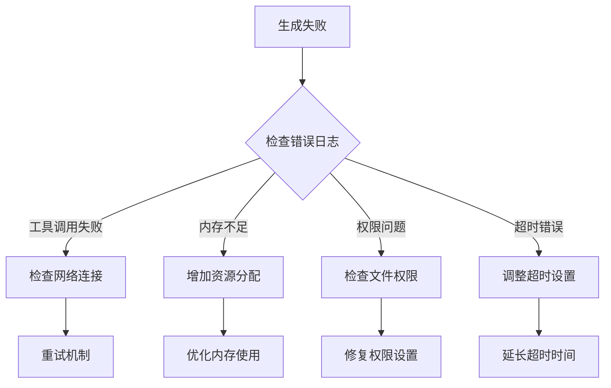

**图表来源**
- [backend/app/services/report_agent.py](file://backend/app/services/report_agent.py#L1566-L1590)

#### 前端显示问题

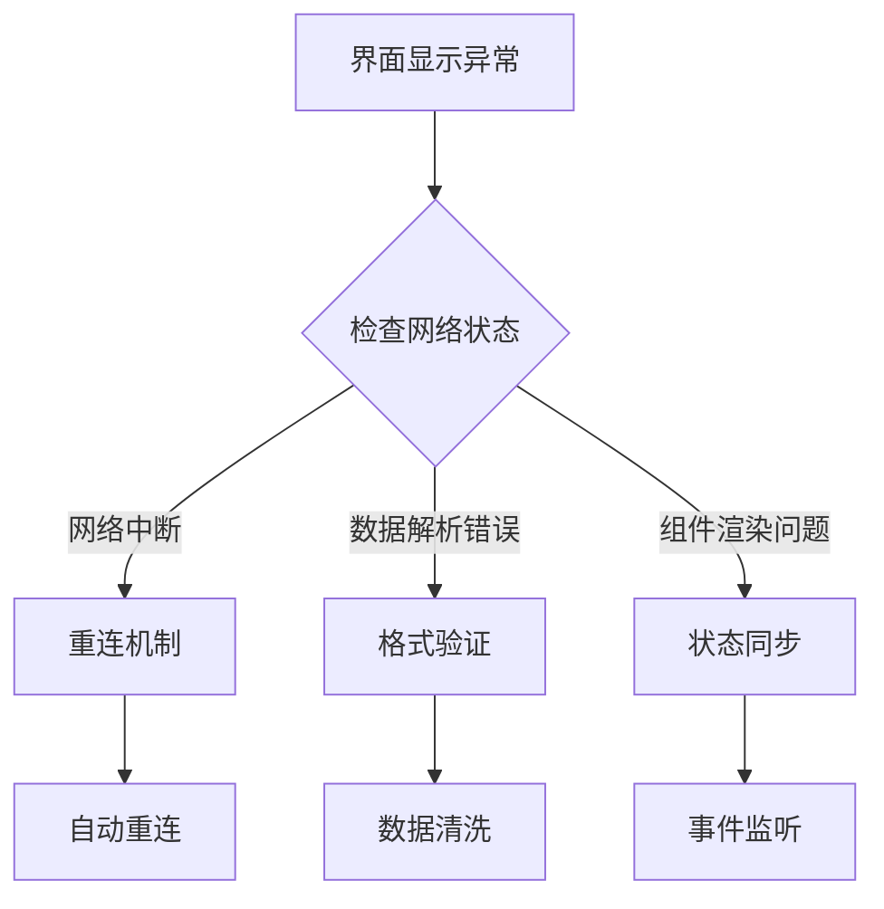

**图表来源**
- [frontend/src/components/Step4Report.vue](file://frontend/src/components/Step4Report.vue#L1936-L2096)

**章节来源**
- [backend/app/services/report_agent.py](file://backend/app/services/report_agent.py#L1566-L1590)
- [frontend/src/components/Step4Report.vue](file://frontend/src/components/Step4Report.vue#L1936-L2096)

## 结论

步骤四报告生成组件成功实现了基于ReACT模式的智能报告生成系统。该组件通过以下关键特性提供了优秀的用户体验：

1. **完整的AI工作流程**：实现了推理-行动-反思的完整循环
2. **智能工具集成**：提供了多种专业工具的无缝集成
3. **实时交互体验**：支持实时进度跟踪和内容预览
4. **深度采访能力**：能够获取模拟Agent的真实观点
5. **灵活的UI设计**：支持多种视图模式和交互方式

该组件为MiroFish模拟预测系统提供了强大的报告生成功能，能够帮助用户从复杂的模拟结果中提取有价值的洞察。

## 附录

### 配置选项和自定义参数

#### 报告生成配置

| 参数名称 | 类型 | 默认值 | 描述 |
|---------|------|--------|------|
| force_regenerate | boolean | false | 是否强制重新生成报告 |
| max_tool_calls | integer | 5 | 每个章节的最大工具调用次数 |
| max_reflection_rounds | integer | 3 | 最大反思轮数 |
| max_tool_calls_per_chat | integer | 2 | 对话中的最大工具调用次数 |

#### 工具调用参数

| 工具名称 | 参数 | 类型 | 描述 |
|---------|------|------|------|
| insight_forge | query | string | 搜索查询问题 |
| insight_forge | report_context | string | 报告上下文信息 |
| panorama_search | query | string | 搜索查询 |
| panorama_search | include_expired | boolean | 是否包含过期内容 |
| quick_search | query | string | 搜索查询 |
| quick_search | limit | integer | 返回结果数量 |
| interview_agents | interview_topic | string | 采访主题 |
| interview_agents | max_agents | integer | 最多采访的Agent数量 |

### API接口规范

#### 报告生成接口

```javascript
// POST /api/report/generate
{
  "simulation_id": "必需，模拟ID",
  "force_regenerate": "可选，强制重新生成"
}

// POST /api/report/generate/status
{
  "task_id": "可选，任务ID",
  "simulation_id": "可选，模拟ID"
}
```

**章节来源**
- [backend/app/api/report.py](file://backend/app/api/report.py#L24-L267)
- [frontend/src/api/report.js](file://frontend/src/api/report.js#L1-L52)