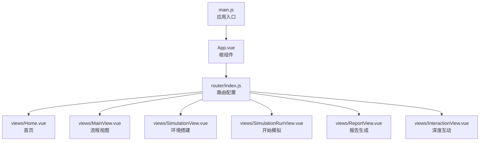
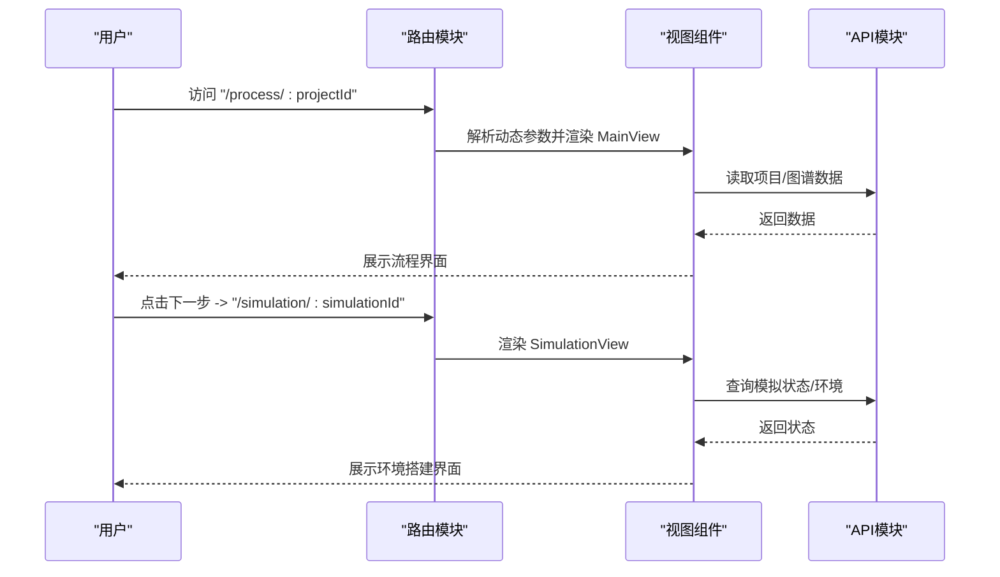
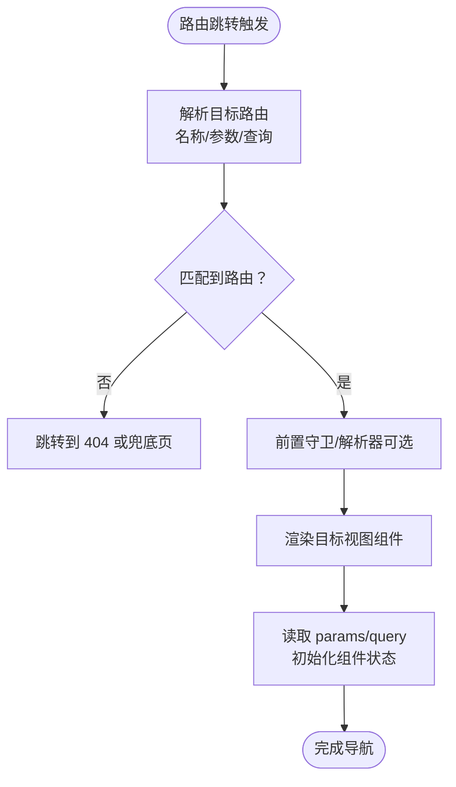
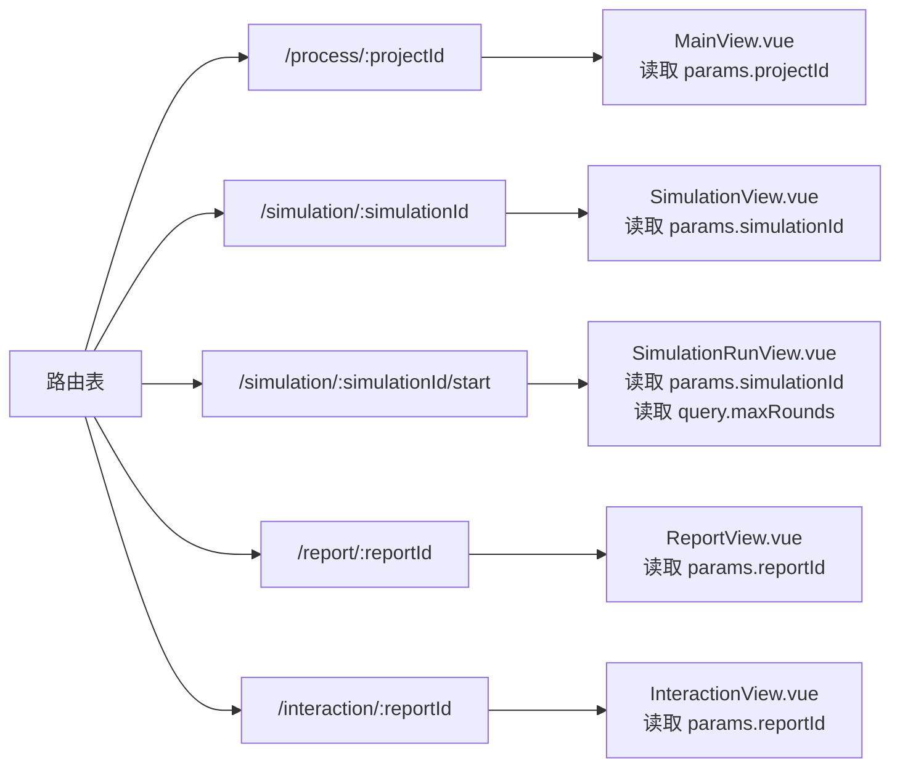
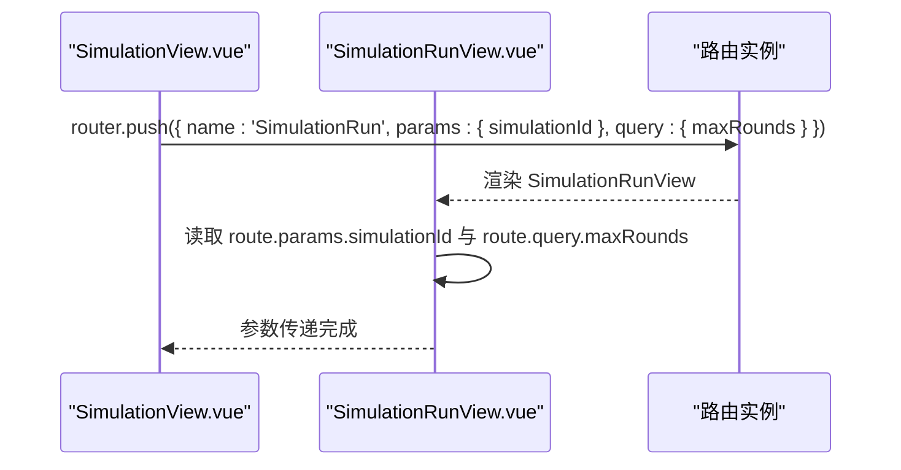
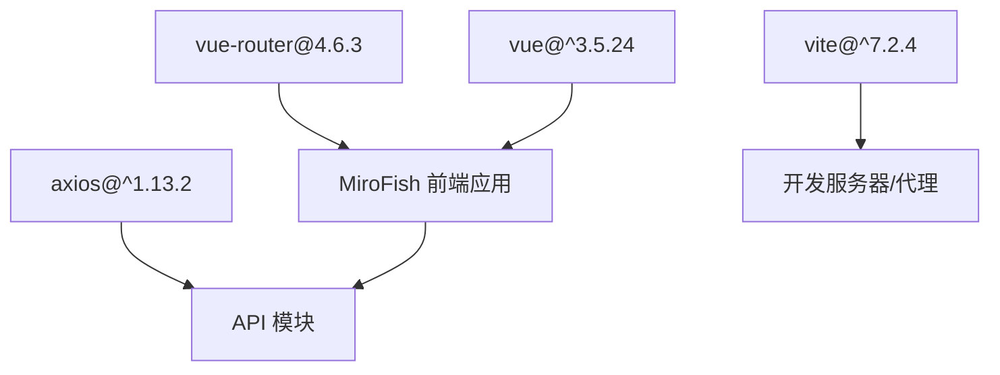

# 路由导航系统

<cite>
**本文档引用的文件**
- [frontend/src/router/index.js](file://frontend/src/router/index.js)
- [frontend/src/main.js](file://frontend/src/main.js)
- [frontend/src/App.vue](file://frontend/src/App.vue)
- [frontend/src/views/MainView.vue](file://frontend/src/views/MainView.vue)
- [frontend/src/views/SimulationView.vue](file://frontend/src/views/SimulationView.vue)
- [frontend/src/views/SimulationRunView.vue](file://frontend/src/views/SimulationRunView.vue)
- [frontend/src/views/ReportView.vue](file://frontend/src/views/ReportView.vue)
- [frontend/src/views/InteractionView.vue](file://frontend/src/views/InteractionView.vue)
- [frontend/src/views/Home.vue](file://frontend/src/views/Home.vue)
- [frontend/src/store/pendingUpload.js](file://frontend/src/store/pendingUpload.js)
- [frontend/src/api/simulation.js](file://frontend/src/api/simulation.js)
- [frontend/package.json](file://frontend/package.json)
- [frontend/vite.config.js](file://frontend/vite.config.js)
</cite>

## 目录
1. [简介](#简介)
2. [项目结构](#项目结构)
3. [核心组件](#核心组件)
4. [架构总览](#架构总览)
5. [详细组件分析](#详细组件分析)
6. [依赖分析](#依赖分析)
7. [性能考虑](#性能考虑)
8. [故障排除指南](#故障排除指南)
9. [结论](#结论)

## 简介
本文件为 MiroFish 路由导航系统的全面技术文档，围绕 Vue Router 4.x 的配置、路由守卫与导航策略展开，结合项目实际代码，系统性阐述路由层级结构、动态路由与嵌套路由实现方式；详解路由参数传递、查询字符串处理与路由元信息使用；并提供路由懒加载、权限控制与导航拦截的机制说明与最佳实践。文档同时给出性能优化建议与扩展定制指南，帮助开发者快速理解并高效维护该路由体系。

## 项目结构
前端采用 Vite + Vue 3 + Vue Router 4 的现代开发栈。路由配置集中于路由模块，视图组件位于 views 目录，全局入口在 main.js 中挂载路由实例，根组件 App.vue 通过 router-view 渲染当前匹配的视图。

图表来源
- [frontend/src/main.js](file://frontend/src/main.js#L1-L10)
- [frontend/src/App.vue](file://frontend/src/App.vue#L1-L48)
- [frontend/src/router/index.js](file://frontend/src/router/index.js#L1-L53)

章节来源
- [frontend/src/router/index.js](file://frontend/src/router/index.js#L1-L53)
- [frontend/src/main.js](file://frontend/src/main.js#L1-L10)
- [frontend/src/App.vue](file://frontend/src/App.vue#L1-L48)

## 核心组件
- 路由配置与实例化：在路由模块中定义路径、名称与组件映射，并创建基于 HTML5 History 模式的路由器实例。
- 视图组件：各步骤视图均通过 useRoute/useRouter 获取路由参数与执行编程式导航。
- 应用入口：在 main.js 中注册路由插件并挂载应用。
- 根组件：App.vue 通过 router-view 渲染当前路由对应视图。

章节来源
- [frontend/src/router/index.js](file://frontend/src/router/index.js#L1-L53)
- [frontend/src/main.js](file://frontend/src/main.js#L1-L10)
- [frontend/src/App.vue](file://frontend/src/App.vue#L1-L48)

## 架构总览
MiroFish 的路由采用单页应用的前端路由模式，基于 Vue Router 4 的 createRouter/createWebHistory 实现。路由表包含首页、项目流程、模拟环境、模拟运行、报告生成与深度互动六个主要页面，其中流程视图、模拟视图、报告视图与互动视图均使用动态路由参数传递业务 ID。

图表来源
- [frontend/src/router/index.js](file://frontend/src/router/index.js#L9-L45)
- [frontend/src/views/MainView.vue](file://frontend/src/views/MainView.vue#L77-L106)
- [frontend/src/views/SimulationView.vue](file://frontend/src/views/SimulationView.vue#L66-L91)

## 详细组件分析

### 路由配置与导航策略
- 路由表定义：包含首页、流程视图、模拟视图、模拟运行视图、报告视图与互动视图，均使用命名路由与动态参数。
- 历史模式：使用 createWebHistory，适配现代浏览器的 URL 哈希与无哈希两种形态。
- 编程式导航：视图组件通过 router.push/router.replace 执行路由跳转，支持按名称与参数对象跳转。
- 参数传递：动态路由参数通过 route.params 获取；跨步骤参数（如模拟轮数）通过 query 传递。

图表来源
- [frontend/src/router/index.js](file://frontend/src/router/index.js#L47-L50)
- [frontend/src/views/SimulationView.vue](file://frontend/src/views/SimulationView.vue#L148-L171)
- [frontend/src/views/SimulationRunView.vue](file://frontend/src/views/SimulationRunView.vue#L89-L92)

章节来源
- [frontend/src/router/index.js](file://frontend/src/router/index.js#L1-L53)
- [frontend/src/views/SimulationView.vue](file://frontend/src/views/SimulationView.vue#L148-L171)
- [frontend/src/views/SimulationRunView.vue](file://frontend/src/views/SimulationRunView.vue#L89-L92)

### 动态路由与嵌套路由
- 动态路由：流程视图、模拟视图、模拟运行视图、报告视图与互动视图均使用动态参数，如 ":projectId"、":simulationId"、":reportId"。
- 嵌套路由：当前路由表未显式声明嵌套路由结构，但通过视图内部的组件组合（如 GraphPanel、StepX 组件）实现页面内的内容分层与状态隔离。
- 参数读取：视图组件通过 useRoute().params 读取动态参数，保证组件在不同 ID 下复用同一逻辑。

图表来源
- [frontend/src/router/index.js](file://frontend/src/router/index.js#L9-L45)
- [frontend/src/views/MainView.vue](file://frontend/src/views/MainView.vue#L97)
- [frontend/src/views/SimulationView.vue](file://frontend/src/views/SimulationView.vue#L86)
- [frontend/src/views/SimulationRunView.vue](file://frontend/src/views/SimulationRunView.vue#L89-L92)
- [frontend/src/views/ReportView.vue](file://frontend/src/views/ReportView.vue#L85)
- [frontend/src/views/InteractionView.vue](file://frontend/src/views/InteractionView.vue#L85)

章节来源
- [frontend/src/router/index.js](file://frontend/src/router/index.js#L9-L45)
- [frontend/src/views/MainView.vue](file://frontend/src/views/MainView.vue#L97)
- [frontend/src/views/SimulationView.vue](file://frontend/src/views/SimulationView.vue#L86)
- [frontend/src/views/SimulationRunView.vue](file://frontend/src/views/SimulationRunView.vue#L89-L92)
- [frontend/src/views/ReportView.vue](file://frontend/src/views/ReportView.vue#L85)
- [frontend/src/views/InteractionView.vue](file://frontend/src/views/InteractionView.vue#L85)

### 路由参数传递与查询字符串处理
- 动态参数：通过 route.params 获取，如项目 ID、模拟 ID、报告 ID。
- 查询参数：通过 route.query 获取，如模拟轮数 maxRounds。
- 参数校验与转换：在组件初始化时将字符串类型的查询参数转换为整型，确保后续逻辑正确性。
- 跨组件参数传递：通过路由 push 的 params 与 query 字段传递复杂参数，避免全局状态污染。

图表来源
- [frontend/src/views/SimulationView.vue](file://frontend/src/views/SimulationView.vue#L158-L171)
- [frontend/src/views/SimulationRunView.vue](file://frontend/src/views/SimulationRunView.vue#L89-L92)

章节来源
- [frontend/src/views/SimulationView.vue](file://frontend/src/views/SimulationView.vue#L158-L171)
- [frontend/src/views/SimulationRunView.vue](file://frontend/src/views/SimulationRunView.vue#L89-L92)

### 路由元信息与权限控制
- 元信息使用：当前路由表未定义 meta 字段，未实现基于元信息的权限控制与导航守卫。
- 权限控制建议：可在路由表中添加 meta 字段（如 roles、requiresAuth），并在全局前置守卫中根据用户状态与路由元信息进行拦截与放行。
- 导航拦截：可通过全局前置守卫实现登录态校验、角色校验与访问白名单控制。

章节来源
- [frontend/src/router/index.js](file://frontend/src/router/index.js#L9-L45)

### 路由懒加载与性能优化
- 当前实现：路由组件通过静态导入，未启用路由级别的懒加载。
- 懒加载建议：将大型视图组件改为动态导入，减少首屏包体积，提升初始加载速度。
- 路由预加载：对用户即将访问的路由（如流程视图与模拟视图）进行预加载，改善用户体验。
- 路由缓存：结合 keep-alive 对频繁切换的视图进行缓存，降低重复渲染成本。

章节来源
- [frontend/src/router/index.js](file://frontend/src/router/index.js#L1-L7)
- [frontend/package.json](file://frontend/package.json#L11-L16)

### 导航拦截与最佳实践
- 编程式导航：统一使用 router.push/router.replace，避免模板字符串拼接导致的路径错误。
- 参数一致性：动态参数与查询参数的命名应保持一致，便于调试与维护。
- 状态同步：在路由跳转前后，确保组件状态与 API 数据同步，避免状态不一致。
- 错误处理：对路由跳转失败与参数缺失进行兜底处理，保证应用稳定性。

章节来源
- [frontend/src/views/MainView.vue](file://frontend/src/views/MainView.vue#L213)
- [frontend/src/views/SimulationView.vue](file://frontend/src/views/SimulationView.vue#L141-L146)
- [frontend/src/views/SimulationRunView.vue](file://frontend/src/views/SimulationRunView.vue#L192)

## 依赖分析
- Vue Router 版本：4.6.3，支持 Vue 3 的 Composition API 与类型安全。
- Vite 配置：提供开发服务器与代理，便于前后端联调。
- Axios：用于 API 请求封装，配合路由参数进行数据获取与状态更新。

图表来源
- [frontend/package.json](file://frontend/package.json#L11-L20)
- [frontend/vite.config.js](file://frontend/vite.config.js#L1-L19)

章节来源
- [frontend/package.json](file://frontend/package.json#L11-L20)
- [frontend/vite.config.js](file://frontend/vite.config.js#L1-L19)

## 性能考虑
- 首屏优化：启用路由懒加载，拆分视图组件，减少初始包体积。
- 并发请求：在路由切换时合理并发获取项目、图谱与模拟数据，避免阻塞渲染。
- 内存管理：在组件卸载时清理定时器与轮询任务，防止内存泄漏。
- 缓存策略：对静态资源与 API 结果进行缓存，提升重复访问性能。
- 代理配置：开发环境通过 Vite 代理转发 API 请求，减少跨域问题与网络延迟。

章节来源
- [frontend/src/views/MainView.vue](file://frontend/src/views/MainView.vue#L397-L404)
- [frontend/src/views/SimulationView.vue](file://frontend/src/views/SimulationView.vue#L289-L297)
- [frontend/vite.config.js](file://frontend/vite.config.js#L7-L17)

## 故障排除指南
- 路由跳转无效：检查目标路由名称与参数对象是否正确，确认路由表中存在对应配置。
- 动态参数为空：确认导航时是否传入 params，组件中是否正确读取 route.params。
- 查询参数丢失：确认 router.push 是否包含 query 字段，组件中是否正确读取 route.query。
- 数据未更新：检查组件生命周期钩子中是否在 mounted/onMounted 中发起数据请求。
- 资源加载失败：检查 Vite 代理配置与后端 API 地址是否一致。

章节来源
- [frontend/src/views/SimulationView.vue](file://frontend/src/views/SimulationView.vue#L148-L171)
- [frontend/src/views/SimulationRunView.vue](file://frontend/src/views/SimulationRunView.vue#L89-L92)
- [frontend/vite.config.js](file://frontend/vite.config.js#L10-L16)

## 结论
MiroFish 的路由系统以 Vue Router 4 为核心，采用清晰的命名路由与动态参数设计，满足多步骤工作流的导航需求。当前实现注重参数传递与组件解耦，具备良好的可维护性。建议后续引入路由元信息与全局守卫以增强权限控制，同时通过懒加载与预加载优化性能，进一步完善导航拦截与错误处理机制，为复杂场景提供更稳健的路由基础设施。