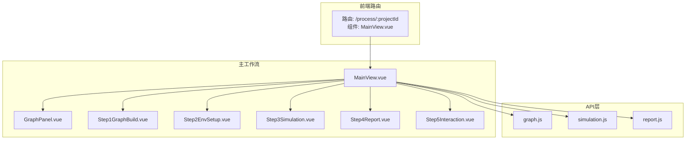
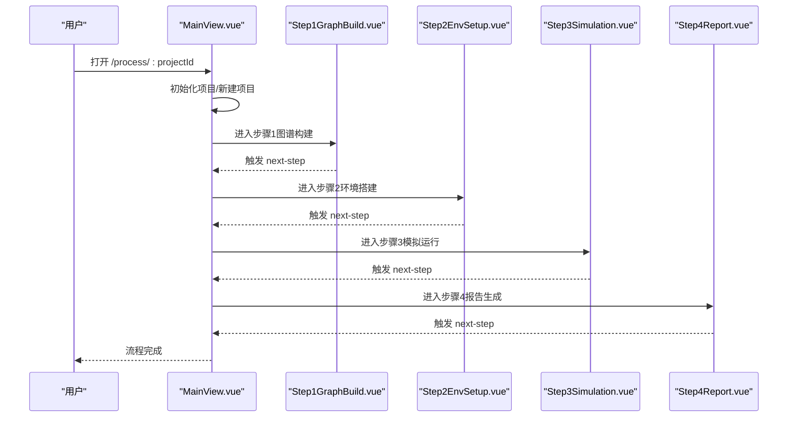
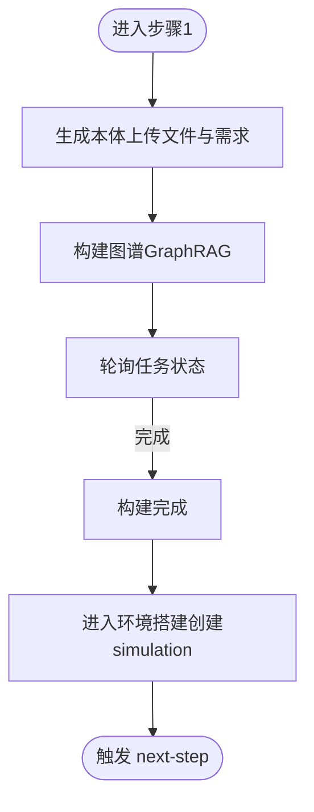
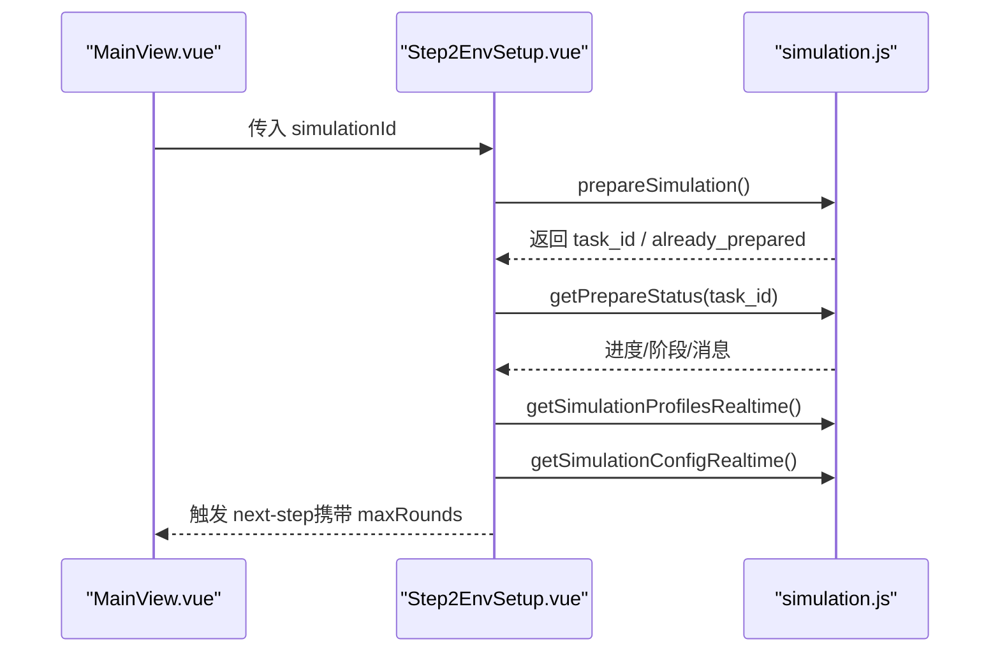
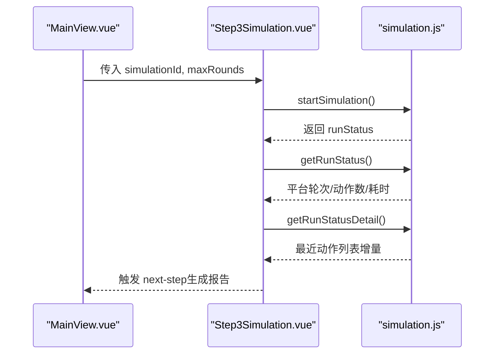
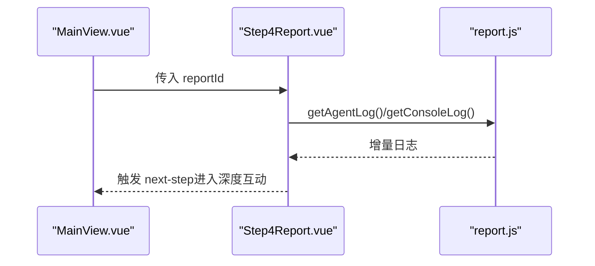
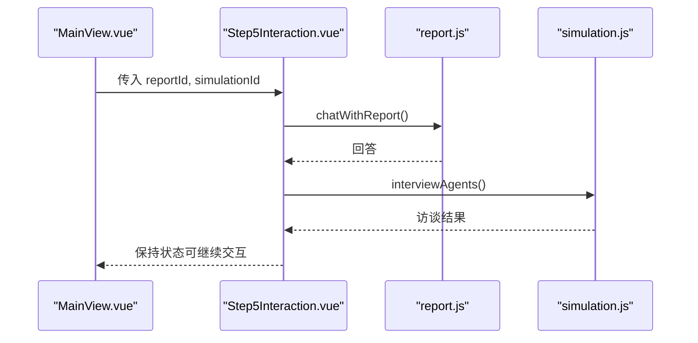
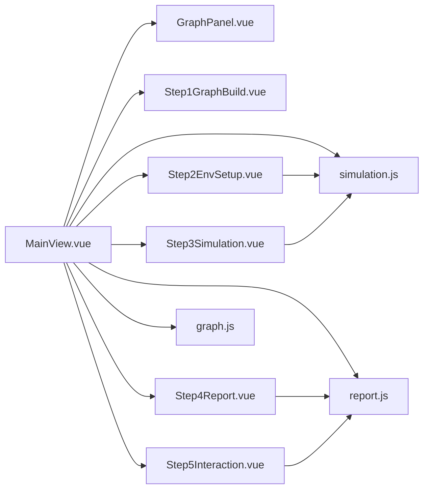

# 主工作流程

<cite>
**本文档引用的文件**
- [MainView.vue](file://frontend/src/views/MainView.vue)
- [Step1GraphBuild.vue](file://frontend/src/components/Step1GraphBuild.vue)
- [Step2EnvSetup.vue](file://frontend/src/components/Step2EnvSetup.vue)
- [Step3Simulation.vue](file://frontend/src/components/Step3Simulation.vue)
- [Step4Report.vue](file://frontend/src/components/Step4Report.vue)
- [Step5Interaction.vue](file://frontend/src/components/Step5Interaction.vue)
- [GraphPanel.vue](file://frontend/src/components/GraphPanel.vue)
- [graph.js](file://frontend/src/api/graph.js)
- [simulation.js](file://frontend/src/api/simulation.js)
- [report.js](file://frontend/src/api/report.js)
- [index.js](file://frontend/src/router/index.js)
- [pendingUpload.js](file://frontend/src/store/pendingUpload.js)
</cite>

## 目录
1. [简介](#简介)
2. [项目结构](#项目结构)
3. [核心组件](#核心组件)
4. [架构总览](#架构总览)
5. [详细组件分析](#详细组件分析)
6. [依赖分析](#依赖分析)
7. [性能考虑](#性能考虑)
8. [故障排除指南](#故障排除指南)
9. [结论](#结论)

## 简介
本文件面向MiroFish主工作流程页面（MainView.vue）的使用者与维护者，系统性阐述“图谱构建—环境搭建—模拟运行—报告生成—深度互动”五步法的界面布局、用户交互、数据流转与状态管理。文档同时提供步骤间导航逻辑、状态同步机制、进度指示器的使用指南、最佳实践与常见问题排查方法，帮助用户高效完成从文档到预测报告的全流程。

## 项目结构
前端采用Vue 3 + Vite架构，路由通过Vue Router集中管理。MainView作为主工作流入口，左侧为图谱可视化面板，右侧为步骤化工作流面板；各步骤以独立组件实现，通过事件与状态在MainView中协调。

**图表来源**
- [index.js](file://frontend/src/router/index.js#L9-L45)
- [MainView.vue](file://frontend/src/views/MainView.vue#L1-L75)
- [GraphPanel.vue](file://frontend/src/components/GraphPanel.vue#L1-L30)
- [Step1GraphBuild.vue](file://frontend/src/components/Step1GraphBuild.vue#L1-L30)
- [Step2EnvSetup.vue](file://frontend/src/components/Step2EnvSetup.vue#L1-L30)
- [Step3Simulation.vue](file://frontend/src/components/Step3Simulation.vue#L1-L30)
- [Step4Report.vue](file://frontend/src/components/Step4Report.vue#L1-L30)
- [Step5Interaction.vue](file://frontend/src/components/Step5Interaction.vue#L1-L30)
- [graph.js](file://frontend/src/api/graph.js#L1-L71)
- [simulation.js](file://frontend/src/api/simulation.js#L1-L188)
- [report.js](file://frontend/src/api/report.js#L1-L52)

**章节来源**
- [index.js](file://frontend/src/router/index.js#L9-L45)
- [MainView.vue](file://frontend/src/views/MainView.vue#L1-L75)

## 核心组件
- MainView.vue：主工作流容器，负责步骤切换、状态同步、轮询调度、日志聚合与视图模式切换。
- Step1GraphBuild.vue：图谱构建步骤，负责本体生成、图谱构建、进度展示与进入下一步。
- Step2EnvSetup.vue：环境搭建步骤，负责Agent人设生成、配置生成、初始激活编排与轮数配置。
- Step3Simulation.vue：模拟运行步骤，负责双平台并行模拟、实时状态轮询、动作流展示与报告生成入口。
- Step4Report.vue：报告生成步骤，负责报告Agent日志与控制台日志的可视化、章节大纲与内容渲染。
- Step5Interaction.vue：深度互动步骤，负责与Report Agent对话、Agent访谈与问卷调查。
- GraphPanel.vue：图谱可视化面板，支持缩放、拖拽、节点/边详情与动态刷新。

**章节来源**
- [MainView.vue](file://frontend/src/views/MainView.vue#L77-L405)
- [Step1GraphBuild.vue](file://frontend/src/components/Step1GraphBuild.vue#L189-L271)
- [Step2EnvSetup.vue](file://frontend/src/components/Step2EnvSetup.vue#L634-L1081)
- [Step3Simulation.vue](file://frontend/src/components/Step3Simulation.vue#L288-L697)
- [Step4Report.vue](file://frontend/src/components/Step4Report.vue#L392-L527)
- [Step5Interaction.vue](file://frontend/src/components/Step5Interaction.vue#L413-L751)
- [GraphPanel.vue](file://frontend/src/components/GraphPanel.vue#L238-L800)

## 架构总览
主工作流采用“步骤驱动 + 轮询驱动”的混合架构：
- 步骤驱动：通过currentStep与事件（next-step/go-back）推进流程。
- 轮询驱动：通过定时器轮询任务状态与实时数据，实现异步进度与动态更新。
- 状态同步：通过全局状态（projectData、graphData、systemLogs）在步骤间共享。

**图表来源**
- [MainView.vue](file://frontend/src/views/MainView.vue#L159-L176)
- [Step1GraphBuild.vue](file://frontend/src/components/Step1GraphBuild.vue#L211-L244)
- [Step2EnvSetup.vue](file://frontend/src/components/Step2EnvSetup.vue#L740-L755)
- [Step3Simulation.vue](file://frontend/src/components/Step3Simulation.vue#L641-L675)
- [Step4Report.vue](file://frontend/src/components/Step4Report.vue#L1-L30)

## 详细组件分析

### 步骤一：图谱构建（Step1GraphBuild）
- 界面布局：三段式卡片（本体生成、图谱构建、完成），右侧系统仪表盘。
- 用户交互：点击“进入环境搭建”按钮，触发创建simulation并跳转至步骤二。
- 数据流转：调用graph.js的generateOntology与buildGraph，轮询任务状态，更新buildProgress与graphData。
- 状态同步：通过MainView的systemLogs与graphData在左右面板间共享。

**图表来源**
- [Step1GraphBuild.vue](file://frontend/src/components/Step1GraphBuild.vue#L189-L271)
- [graph.js](file://frontend/src/api/graph.js#L8-L34)
- [MainView.vue](file://frontend/src/views/MainView.vue#L271-L373)

**章节来源**
- [Step1GraphBuild.vue](file://frontend/src/components/Step1GraphBuild.vue#L1-L187)
- [graph.js](file://frontend/src/api/graph.js#L8-L34)
- [MainView.vue](file://frontend/src/views/MainView.vue#L178-L373)

### 步骤二：环境搭建（Step2EnvSetup）
- 界面布局：五段式卡片（实例初始化、生成Agent人设、生成双平台配置、初始激活编排、准备完成），右侧系统仪表盘。
- 用户交互：实时预览Agent人设、查看配置摘要、选择自定义轮数、点击“开始模拟”。
- 数据流转：调用simulation.js的prepareSimulation与getPrepareStatus，实时获取Profiles与配置；根据配置生成自动轮数。
- 状态同步：通过MainView的systemLogs与simulationId在步骤间共享。

**图表来源**
- [Step2EnvSetup.vue](file://frontend/src/components/Step2EnvSetup.vue#L634-L1081)
- [simulation.js](file://frontend/src/api/simulation.js#L15-L68)
- [MainView.vue](file://frontend/src/views/MainView.vue#L159-L176)

**章节来源**
- [Step2EnvSetup.vue](file://frontend/src/components/Step2EnvSetup.vue#L1-L1081)
- [simulation.js](file://frontend/src/api/simulation.js#L15-L68)
- [MainView.vue](file://frontend/src/views/MainView.vue#L159-L176)

### 步骤三：模拟运行（Step3Simulation）
- 界面布局：双平台控制栏（Twitter/Reddit）、实时动作时间轴、系统监控面板。
- 用户交互：启动/停止模拟、查看平台进度、点击“生成报告”进入步骤四。
- 数据流转：调用simulation.js的startSimulation/getRunStatus/getRunStatusDetail，增量渲染动作流。
- 状态同步：通过MainView的systemLogs与runStatus在步骤间共享。

**图表来源**
- [Step3Simulation.vue](file://frontend/src/components/Step3Simulation.vue#L288-L697)
- [simulation.js](file://frontend/src/api/simulation.js#L83-L136)
- [MainView.vue](file://frontend/src/views/MainView.vue#L641-L675)

**章节来源**
- [Step3Simulation.vue](file://frontend/src/components/Step3Simulation.vue#L1-L697)
- [simulation.js](file://frontend/src/api/simulation.js#L83-L136)
- [MainView.vue](file://frontend/src/views/MainView.vue#L641-L675)

### 步骤四：报告生成（Step4Report）
- 界面布局：左右分栏，左侧报告大纲与内容，右侧工作流时间线与Agent日志。
- 用户交互：查看章节生成状态、展开/折叠内容、点击“进入深度互动”。
- 数据流转：调用report.js的generateReport/getAgentLog/getConsoleLog，渲染报告内容与工具调用链。
- 状态同步：通过MainView的systemLogs与reportId在步骤间共享。

**图表来源**
- [Step4Report.vue](file://frontend/src/components/Step4Report.vue#L392-L527)
- [report.js](file://frontend/src/api/report.js#L24-L51)
- [MainView.vue](file://frontend/src/views/MainView.vue#L641-L675)

**章节来源**
- [Step4Report.vue](file://frontend/src/components/Step4Report.vue#L1-L527)
- [report.js](file://frontend/src/api/report.js#L24-L51)
- [MainView.vue](file://frontend/src/views/MainView.vue#L641-L675)

### 步骤五：深度互动（Step5Interaction）
- 界面布局：左右分栏，左侧报告大纲与内容，右侧交互工具（与Report Agent对话、与Agent访谈、问卷调查）。
- 用户交互：在聊天模式与问卷模式间切换，选择Agent进行访谈，提交问卷并查看结果。
- 数据流转：调用report.js的chatWithReport与simulation.js的interviewAgents，渲染对话与结果。
- 状态同步：通过MainView的systemLogs与reportId/simulationId在步骤间共享。

**图表来源**
- [Step5Interaction.vue](file://frontend/src/components/Step5Interaction.vue#L413-L751)
- [report.js](file://frontend/src/api/report.js#L49-L51)
- [simulation.js](file://frontend/src/api/simulation.js#L175-L177)
- [MainView.vue](file://frontend/src/views/MainView.vue#L641-L675)

**章节来源**
- [Step5Interaction.vue](file://frontend/src/components/Step5Interaction.vue#L1-L751)
- [report.js](file://frontend/src/api/report.js#L49-L51)
- [simulation.js](file://frontend/src/api/simulation.js#L175-L177)
- [MainView.vue](file://frontend/src/views/MainView.vue#L641-L675)

## 依赖分析
- 路由依赖：/process/:projectId绑定MainView，其余步骤通过路由名称跳转。
- 组件依赖：MainView组合GraphPanel与五个步骤组件，通过事件与状态在组件间传递。
- API依赖：graph.js、simulation.js、report.js封装后端接口，MainView与各步骤组件统一调用。
- 状态依赖：MainView集中管理projectData、graphData、systemLogs、currentStep、currentPhase等，步骤组件通过props与事件与之同步。

**图表来源**
- [MainView.vue](file://frontend/src/views/MainView.vue#L77-L84)
- [graph.js](file://frontend/src/api/graph.js#L1-L71)
- [simulation.js](file://frontend/src/api/simulation.js#L1-L188)
- [report.js](file://frontend/src/api/report.js#L1-L52)

**章节来源**
- [MainView.vue](file://frontend/src/views/MainView.vue#L77-L84)
- [graph.js](file://frontend/src/api/graph.js#L1-L71)
- [simulation.js](file://frontend/src/api/simulation.js#L1-L188)
- [report.js](file://frontend/src/api/report.js#L1-L52)

## 性能考虑
- 轮询策略：步骤间使用定时器轮询任务状态与实时数据，需合理设置轮询间隔（如2秒、3秒），避免频繁请求导致性能压力。
- 增量更新：动作流与日志采用增量方式推送与渲染，减少DOM更新量。
- 图谱渲染：GraphPanel使用D3力导向图，节点/边数量较多时建议开启边标签开关与适当降低动画强度。
- 内存管理：组件卸载时及时清理轮询定时器，防止内存泄漏。

[本节为通用指导，无需特定文件引用]

## 故障排除指南
- 无法进入步骤：检查路由参数projectId与后端返回的project_id是否一致；确认MainView的initProject逻辑与轮询状态。
- 本体/图谱构建失败：查看systemLogs中的错误信息，确认generateOntology与buildGraph的返回；检查任务状态轮询是否正常。
- 环境搭建卡住：确认prepareSimulation的task_id与getPrepareStatus返回；检查Profiles与配置实时接口是否返回数据。
- 模拟运行无动作：确认startSimulation返回的runStatus与getRunStatusDetail是否正常；检查增量动作列表是否为空。
- 报告生成异常：确认generateReport返回的report_id与getAgentLog/getConsoleLog是否可用；检查报告Agent日志。
- 深度互动不可用：确认chatWithReport与interviewAgents的返回；检查Agent列表与问卷提交结果。

**章节来源**
- [MainView.vue](file://frontend/src/views/MainView.vue#L316-L355)
- [Step2EnvSetup.vue](file://frontend/src/components/Step2EnvSetup.vue#L846-L906)
- [Step3Simulation.vue](file://frontend/src/components/Step3Simulation.vue#L462-L531)
- [Step4Report.vue](file://frontend/src/components/Step4Report.vue#L392-L527)
- [Step5Interaction.vue](file://frontend/src/components/Step5Interaction.vue#L614-L743)

## 结论
MiroFish主工作流程通过清晰的步骤化设计与完善的轮询机制，实现了从文档到预测报告的自动化闭环。MainView作为中枢，承担了状态管理、步骤切换与数据同步职责；各步骤组件聚焦具体业务能力，配合API层完成端到端流程。遵循本文的使用指南、最佳实践与故障排除方法，可显著提升用户体验与系统稳定性。