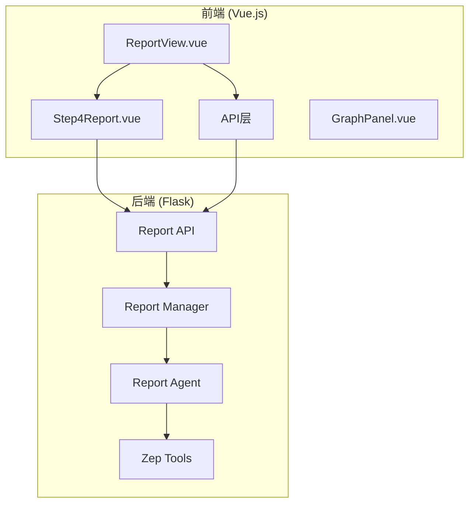
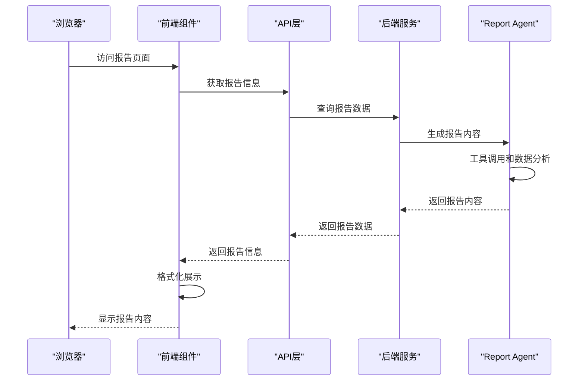
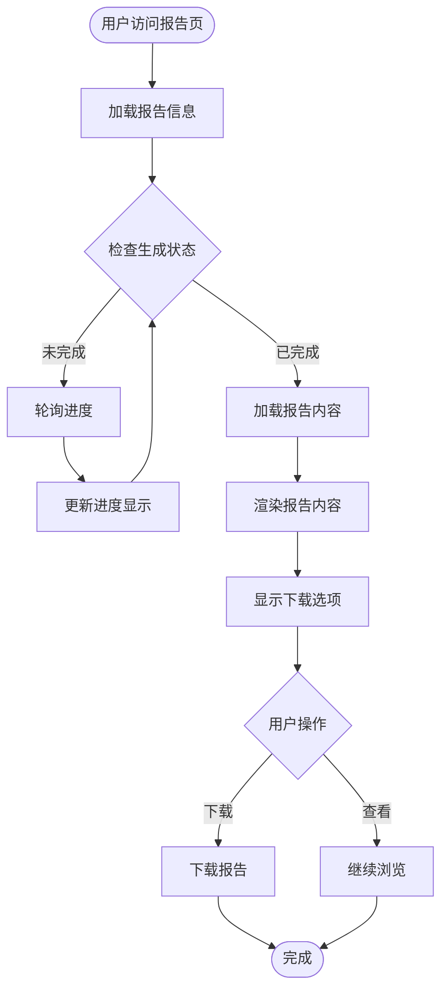
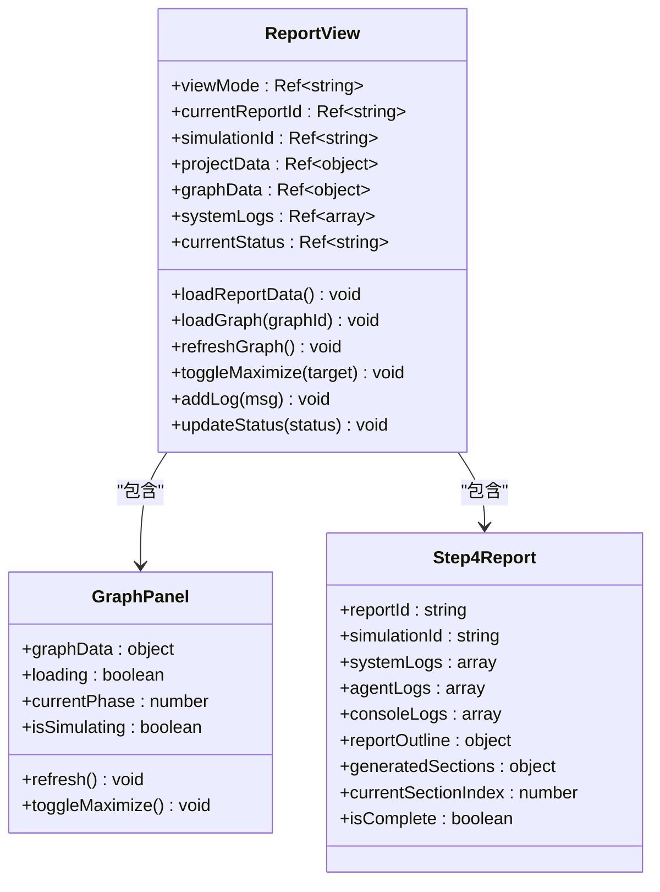
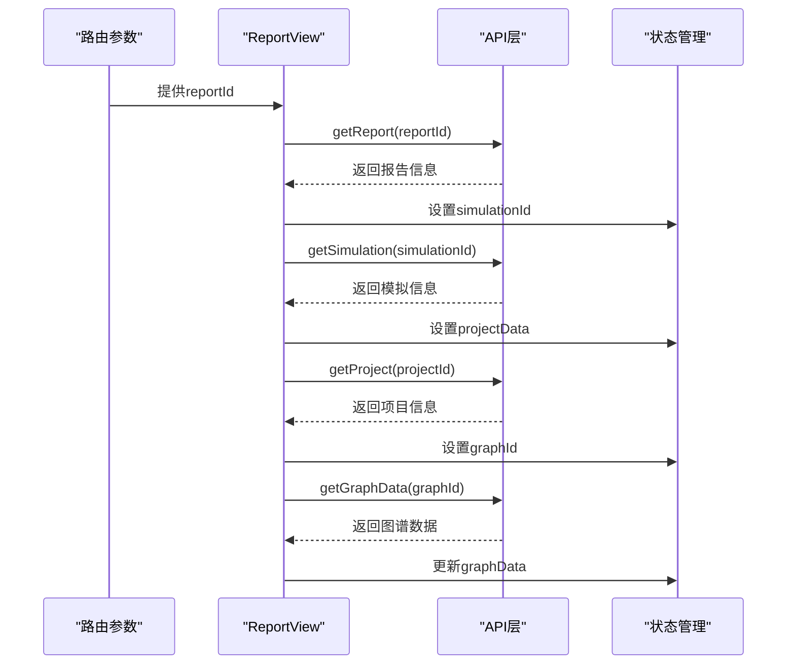
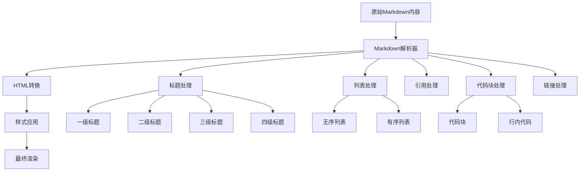
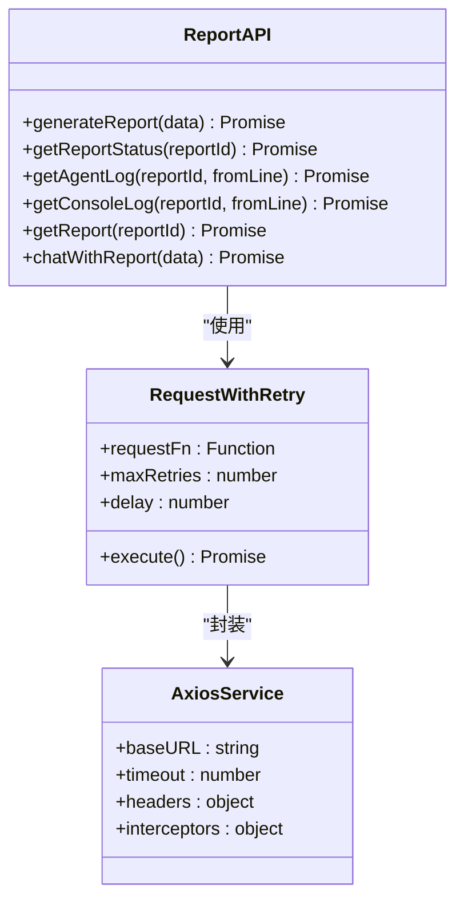
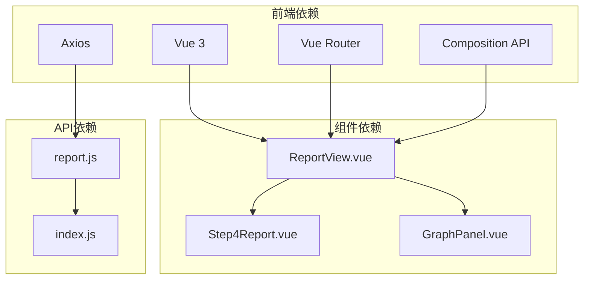
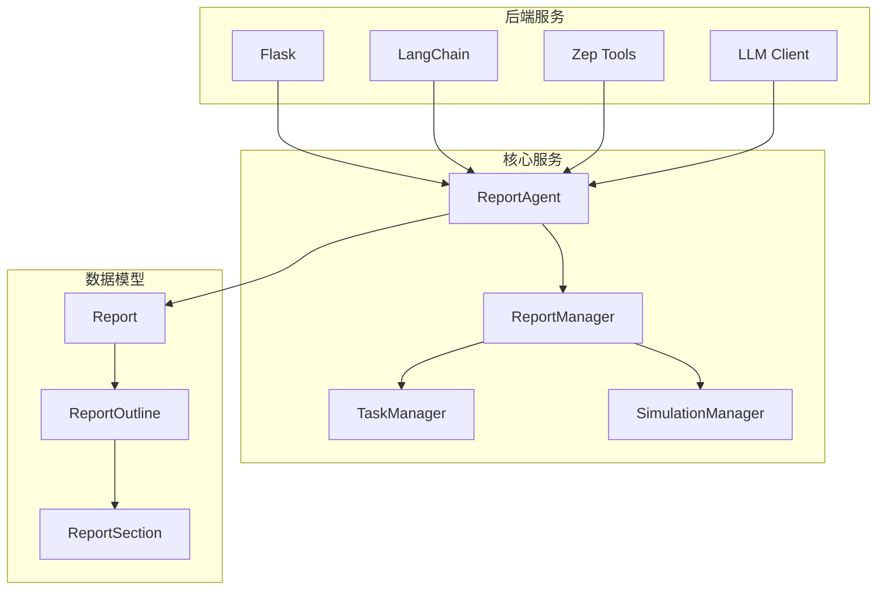

# 报告展示

<cite>
**本文档引用的文件**
- [ReportView.vue](file://frontend/src/views/ReportView.vue)
- [Step4Report.vue](file://frontend/src/components/Step4Report.vue)
- [report.js](file://frontend/src/api/report.js)
- [index.js](file://frontend/src/api/index.js)
- [report.py](file://backend/app/api/report.py)
- [report_agent.py](file://backend/app/services/report_agent.py)
</cite>

## 目录
1. [项目概述](#项目概述)
2. [项目结构](#项目结构)
3. [核心组件](#核心组件)
4. [架构概览](#架构概览)
5. [详细组件分析](#详细组件分析)
6. [依赖关系分析](#依赖关系分析)
7. [性能考虑](#性能考虑)
8. [故障排除指南](#故障排除指南)
9. [结论](#结论)

## 项目概述

MiroFish是一个基于Vue.js和Flask的模拟分析平台，专门用于生成和展示基于模拟世界的预测报告。ReportView.vue组件是整个应用的核心展示组件，负责报告内容的解析、格式化显示、交互式图表和下载功能的统一管理。

该系统采用前后端分离架构，前端使用Vue 3 Composition API构建响应式界面，后端使用Flask提供RESTful API服务。ReportView组件通过异步数据流实现了完整的报告生命周期管理，从数据获取到最终展示的全流程自动化。

## 项目结构

MiroFish项目采用模块化设计，主要分为前端和后端两个部分：

**图表来源**
- [ReportView.vue](file://frontend/src/views/ReportView.vue#L1-L349)
- [report.py](file://backend/app/api/report.py#L1-L1016)

**章节来源**
- [ReportView.vue](file://frontend/src/views/ReportView.vue#L1-L349)
- [report.py](file://backend/app/api/report.py#L1-L1016)

## 核心组件

### ReportView.vue - 主要展示组件

ReportView.vue是报告展示的核心组件，负责协调整个报告生成和展示流程。该组件实现了以下关键功能：

#### 布局管理
- **视图模式切换**：支持graph、split、workbench三种布局模式
- **动态面板布局**：根据视图模式动态调整左右面板宽度和透明度
- **响应式设计**：使用CSS Grid和Flexbox实现自适应布局

#### 数据获取流程
- **报告信息获取**：通过`getReport()`获取报告元数据
- **模拟信息关联**：自动关联对应的simulation_id和project_id
- **图谱数据加载**：获取关联的图谱数据用于可视化展示

#### 状态管理
- **生成状态跟踪**：processing、completed、error三种状态
- **实时日志系统**：集成系统日志和Agent日志
- **进度监控**：实时更新报告生成进度

**章节来源**
- [ReportView.vue](file://frontend/src/views/ReportView.vue#L64-L213)

### Step4Report.vue - 报告内容展示组件

Step4Report.vue专门负责报告内容的格式化展示，实现了专业的报告阅读体验：

#### 报告结构展示
- **大纲导航**：清晰的章节导航和状态指示
- **章节折叠**：支持章节内容的展开/折叠
- **实时内容更新**：动态显示已生成的章节内容

#### 格式化渲染
- **Markdown解析**：支持标题、列表、引用、代码块等格式
- **样式定制**：针对学术报告的字体和排版优化
- **响应式布局**：适配不同屏幕尺寸

#### 交互功能
- **工具调用追踪**：显示报告生成过程中使用的工具
- **进度可视化**：工作流时间线和状态指示
- **下载功能**：支持完整报告的Markdown格式下载

**章节来源**
- [Step4Report.vue](file://frontend/src/components/Step4Report.vue#L1-L5058)

## 架构概览

MiroFish采用分层架构设计，实现了清晰的职责分离：

**图表来源**
- [report.py](file://backend/app/api/report.py#L24-L196)
- [report_agent.py](file://backend/app/services/report_agent.py#L1424-L1456)

### 数据流架构

系统采用异步数据流设计，确保用户体验的流畅性：

**图表来源**
- [report.js](file://frontend/src/api/report.js#L15-L26)
- [report_agent.py](file://backend/app/services/report_agent.py#L1424-L1456)

## 详细组件分析

### ReportView.vue 组件分析

#### 组件结构设计

ReportView.vue采用了现代化的组件化设计，通过Composition API实现了高度模块化的功能组织：

**图表来源**
- [ReportView.vue](file://frontend/src/views/ReportView.vue#L64-L213)
- [Step4Report.vue](file://frontend/src/components/Step4Report.vue#L392-L430)

#### 数据获取流程

ReportView.vue实现了完整的数据获取和处理流程：

**图表来源**
- [ReportView.vue](file://frontend/src/views/ReportView.vue#L140-L193)
- [report.js](file://frontend/src/api/report.js#L41-L43)

#### 布局管理系统

ReportView.vue实现了灵活的布局管理系统，支持多种视图模式：

| 视图模式 | 左侧面板宽度 | 右侧面板宽度 | 透明度 | 变换效果 |
|---------|-------------|-------------|-------|---------|
| graph | 100% | 0% | 1 | 无变换 |
| split | 50% | 50% | 1 | 无变换 |
| workbench | 0% | 100% | 0 | 透明过渡 |

**章节来源**
- [ReportView.vue](file://frontend/src/views/ReportView.vue#L94-L104)

### Step4Report.vue 组件分析

#### 报告内容渲染系统

Step4Report.vue实现了专业的报告内容渲染系统，支持复杂的Markdown格式：

**图表来源**
- [Step4Report.vue](file://frontend/src/components/Step4Report.vue#L554-L611)

#### 工具调用追踪系统

系统实现了完整的工具调用追踪功能，为用户提供透明的报告生成过程：

| 工具类型 | 图标 | 颜色 | 功能描述 |
|---------|------|------|----------|
| InsightForge | 💡 | 紫色 | 深度洞察检索，自动分解问题并多维度检索 |
| PanoramaSearch | 🌍 | 蓝色 | 广度搜索，获取事件全貌和演变过程 |
| QuickSearch | ⚡ | 橙色 | 快速检索，获取具体信息点 |
| InterviewAgents | 👥 | 绿色 | 深度采访，获取模拟Agent的真实观点 |

**章节来源**
- [Step4Report.vue](file://frontend/src/components/Step4Report.vue#L495-L540)

### API 层设计

#### 前端API接口设计

前端API层提供了统一的接口抽象，简化了后端服务的调用：

**图表来源**
- [report.js](file://frontend/src/api/report.js#L1-L52)
- [index.js](file://frontend/src/api/index.js#L1-L68)

#### 后端API服务设计

后端API层提供了RESTful接口，支持完整的报告生命周期管理：

| 接口 | 方法 | 功能描述 | 返回数据 |
|------|------|----------|----------|
| `/api/report/generate` | POST | 启动报告生成任务 | 任务信息 |
| `/api/report/generate/status` | POST | 查询生成进度 | 进度信息 |
| `/api/report/{report_id}` | GET | 获取报告详情 | 报告内容 |
| `/api/report/{report_id}/download` | GET | 下载报告 | Markdown文件 |
| `/api/report/{report_id}/agent-log` | GET | 获取Agent日志 | 日志数据 |
| `/api/report/chat` | POST | 与Report Agent对话 | 回复内容 |

**章节来源**
- [report.py](file://backend/app/api/report.py#L24-L196)

## 依赖关系分析

### 前端依赖关系

**图表来源**
- [ReportView.vue](file://frontend/src/views/ReportView.vue#L65-L71)
- [report.js](file://frontend/src/api/report.js#L1-L52)

### 后端服务依赖

**图表来源**
- [report_agent.py](file://backend/app/services/report_agent.py#L469-L529)
- [report.py](file://backend/app/api/report.py#L11-L18)

**章节来源**
- [report_agent.py](file://backend/app/services/report_agent.py#L1-L800)
- [report.py](file://backend/app/api/report.py#L1-L1016)

## 性能考虑

### 前端性能优化策略

#### 数据缓存机制
- **组件状态缓存**：使用Vue响应式系统缓存已获取的数据
- **日志缓存限制**：限制系统日志数量，避免内存泄漏
- **图片懒加载**：对于大型图表采用懒加载策略

#### 渲染优化
- **虚拟滚动**：对于长列表采用虚拟滚动技术
- **防抖处理**：对频繁触发的操作进行防抖处理
- **组件拆分**：将复杂组件拆分为更小的子组件

#### 网络优化
- **请求重试**：实现指数退避的请求重试机制
- **超时控制**：合理的超时设置避免长时间阻塞
- **并发控制**：限制同时进行的网络请求数量

### 后端性能优化策略

#### 异步处理
- **后台线程**：报告生成在独立线程中执行
- **任务队列**：使用任务管理器处理并发请求
- **进度回调**：实时更新进度信息减少轮询频率

#### 数据存储优化
- **文件系统**：使用本地文件系统存储报告内容
- **增量更新**：支持增量日志和章节更新
- **压缩存储**：对大文件进行压缩存储

#### 资源管理
- **连接池**：数据库连接池管理
- **内存监控**：监控内存使用情况
- **垃圾回收**：定期清理临时文件

**章节来源**
- [index.js](file://frontend/src/api/index.js#L54-L65)
- [report_agent.py](file://backend/app/services/report_agent.py#L124-L176)

## 故障排除指南

### 常见问题及解决方案

#### 报告加载失败
**症状**：报告页面显示加载失败或空白
**可能原因**：
- 网络连接问题
- 报告ID无效
- 后端服务不可用

**解决步骤**：
1. 检查网络连接状态
2. 验证报告ID的有效性
3. 查看后端服务日志
4. 重新加载页面

#### 报告生成超时
**症状**：报告生成长时间无响应
**可能原因**：
- 模拟数据量过大
- LLM服务响应慢
- 系统资源不足

**解决步骤**：
1. 检查系统资源使用情况
2. 优化模拟配置
3. 增加超时时间
4. 重启后端服务

#### 图表显示异常
**症状**：图谱数据无法正常显示
**可能原因**：
- 图谱ID错误
- 权限不足
- 数据格式不匹配

**解决步骤**：
1. 验证图谱ID的正确性
2. 检查用户权限设置
3. 确认数据格式兼容性
4. 重新构建图谱

### 调试工具和技巧

#### 前端调试
- **Vue DevTools**：检查组件状态和数据流
- **浏览器开发者工具**：监控网络请求和JavaScript错误
- **日志系统**：利用系统日志进行问题定位

#### 后端调试
- **日志分析**：查看详细的执行日志
- **性能监控**：监控CPU和内存使用情况
- **数据库查询**：分析慢查询和锁等待

**章节来源**
- [ReportView.vue](file://frontend/src/views/ReportView.vue#L174-L177)
- [report.py](file://backend/app/api/report.py#L189-L196)

## 结论

ReportView.vue组件作为MiroFish项目的核心展示组件，成功实现了报告生成和展示的完整解决方案。该组件通过精心设计的架构和优化的性能策略，为用户提供了流畅、直观的报告阅读体验。

### 主要成就

1. **完整的报告生命周期管理**：从数据获取到最终展示的一站式解决方案
2. **灵活的布局系统**：支持多种视图模式满足不同使用场景
3. **专业的报告渲染**：高质量的Markdown内容展示和格式化
4. **实时交互功能**：提供工具调用追踪和进度监控
5. **完善的下载功能**：支持完整报告的Markdown格式下载

### 技术亮点

- **响应式设计**：完全适配不同设备和屏幕尺寸
- **异步数据流**：高效的异步处理和状态管理
- **模块化架构**：清晰的组件分离和职责划分
- **性能优化**：多层面的性能优化策略
- **错误处理**：完善的错误处理和恢复机制

### 未来发展

该组件为MiroFish项目奠定了坚实的技术基础，未来可以在以下方面进一步优化：

1. **增强的可视化功能**：集成更多类型的图表和可视化组件
2. **协作功能**：支持多人协作和评论功能
3. **移动端优化**：进一步优化移动端用户体验
4. **AI辅助分析**：集成更多AI驱动的分析功能
5. **扩展性设计**：支持更多报告格式和自定义模板

通过持续的优化和完善，ReportView.vue组件将继续为用户提供卓越的报告展示体验，推动MiroFish项目在模拟分析领域的领先地位。