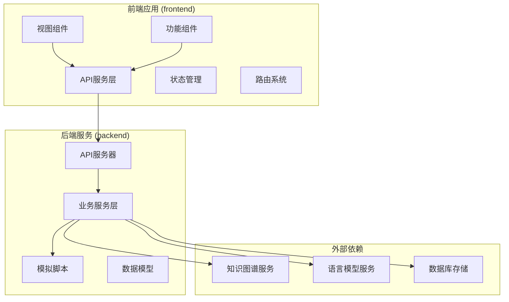
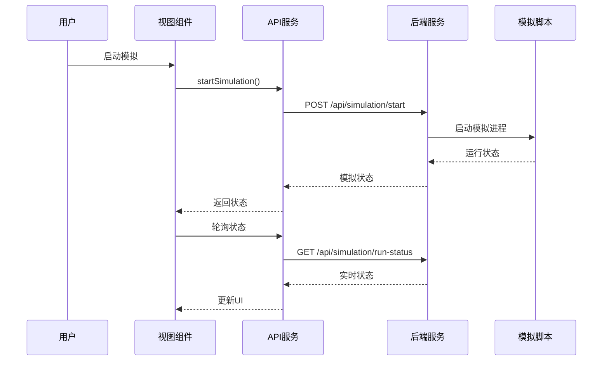
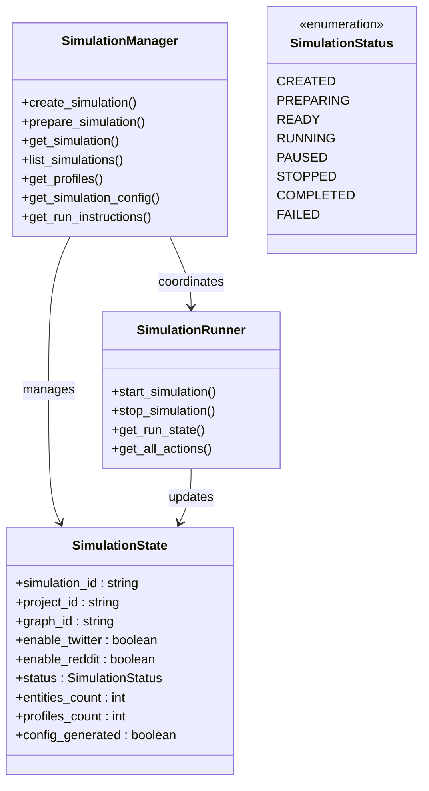
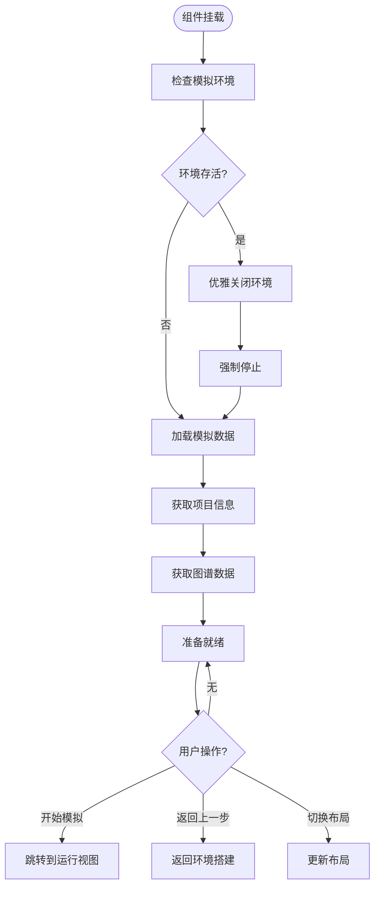
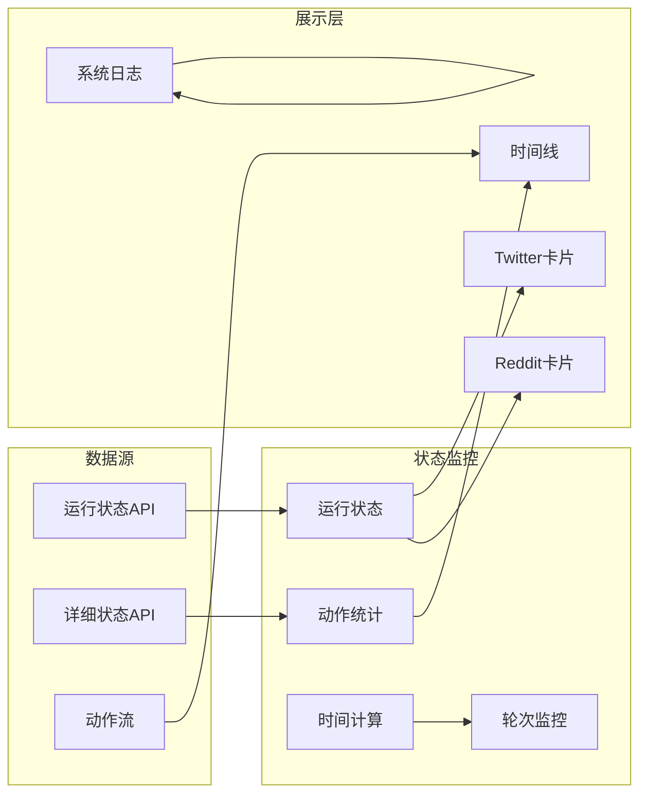
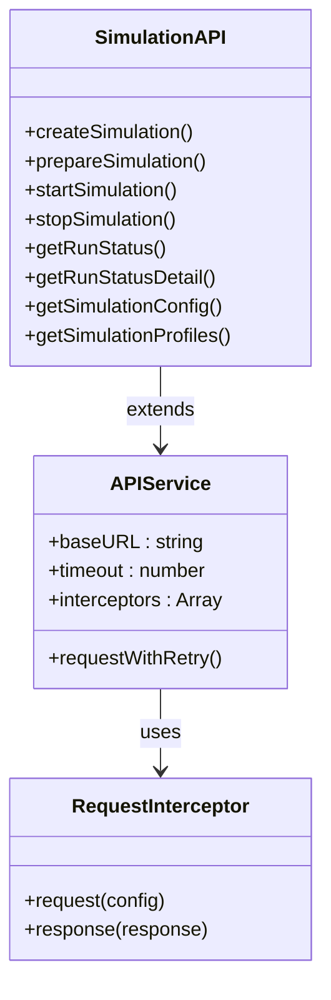
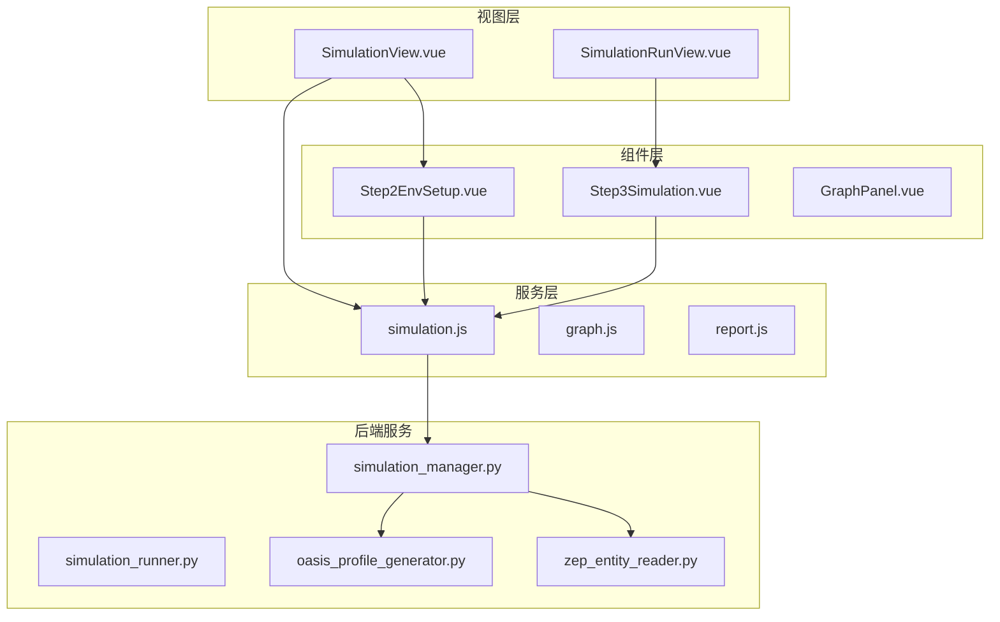
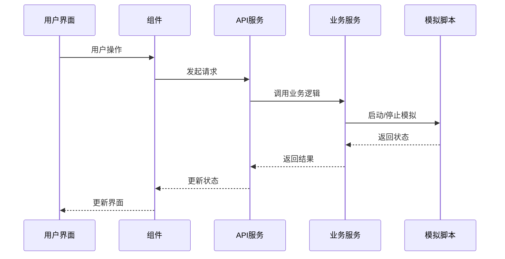

# 模拟界面

<cite>
**本文档引用的文件**
- [SimulationView.vue](file://frontend/src/views/SimulationView.vue)
- [Step3Simulation.vue](file://frontend/src/components/Step3Simulation.vue)
- [SimulationRunView.vue](file://frontend/src/views/SimulationRunView.vue)
- [Step2EnvSetup.vue](file://frontend/src/components/Step2EnvSetup.vue)
- [simulation.js](file://frontend/src/api/simulation.js)
- [index.js](file://frontend/src/api/index.js)
- [simulation.py](file://backend/app/api/simulation.py)
- [simulation_manager.py](file://backend/app/services/simulation_manager.py)
- [run_parallel_simulation.py](file://backend/scripts/run_parallel_simulation.py)
- [index.js](file://frontend/src/router/index.js)
</cite>

## 目录
1. [简介](#简介)
2. [项目结构](#项目结构)
3. [核心组件](#核心组件)
4. [架构概览](#架构概览)
5. [详细组件分析](#详细组件分析)
6. [依赖关系分析](#依赖关系分析)
7. [性能考虑](#性能考虑)
8. [故障排除指南](#故障排除指南)
9. [结论](#结论)

## 简介

MiroFish模拟界面是一个基于Vue.js的前端应用，提供了完整的社交媒体模拟环境可视化和控制功能。该系统支持Twitter和Reddit两个平台的并行模拟，允许用户配置模拟参数、监控运行状态、查看实时数据流，并生成详细的模拟报告。

系统采用前后端分离架构，前端负责用户界面和交互逻辑，后端提供模拟管理和数据处理服务。整个界面围绕"环境搭建-开始模拟-结果报告"的工作流程设计，为用户提供直观的模拟控制体验。

## 项目结构

MiroFish项目采用模块化的前端架构，主要包含以下核心模块：

**图表来源**
- [SimulationView.vue](file://frontend/src/views/SimulationView.vue#L1-L435)
- [simulation.py](file://backend/app/api/simulation.py#L1-L800)

**章节来源**
- [SimulationView.vue](file://frontend/src/views/SimulationView.vue#L1-L435)
- [Step3Simulation.vue](file://frontend/src/components/Step3Simulation.vue#L1-L1264)
- [simulation.js](file://frontend/src/api/simulation.js#L1-L188)

## 核心组件

### 模拟视图组件体系

系统的核心组件围绕三个主要视图构建：

1. **环境搭建视图** (`SimulationView.vue`)
   - 负责模拟环境的初始化和配置
   - 提供图谱可视化和项目信息展示
   - 管理模拟状态监控和日志记录

2. **模拟运行视图** (`SimulationRunView.vue`)
   - 展示实时模拟状态和统计数据
   - 提供模拟控制功能（启动、停止、暂停）
   - 集成双平台时间线和动作监控

3. **配置设置组件** (`Step2EnvSetup.vue`)
   - 生成和配置Agent人设
   - 智能生成模拟配置参数
   - 提供轮数配置和自定义选项

**章节来源**
- [SimulationView.vue](file://frontend/src/views/SimulationView.vue#L66-L298)
- [Step3Simulation.vue](file://frontend/src/components/Step3Simulation.vue#L288-L697)
- [Step2EnvSetup.vue](file://frontend/src/components/Step2EnvSetup.vue#L634-L755)

## 架构概览

### 前端架构设计

前端采用Vue 3 Composition API设计模式，实现了高度模块化的组件架构：

**图表来源**
- [simulation.js](file://frontend/src/api/simulation.js#L83-L109)
- [simulation.py](file://backend/app/api/simulation.py#L1722-L1755)

### 后端服务架构

后端服务采用Flask框架，实现了完整的模拟生命周期管理：

**图表来源**
- [simulation_manager.py](file://backend/app/services/simulation_manager.py#L114-L529)
- [simulation.py](file://backend/app/api/simulation.py#L1722-L1755)

**章节来源**
- [simulation_manager.py](file://backend/app/services/simulation_manager.py#L1-L529)
- [simulation.py](file://backend/app/api/simulation.py#L1-L800)

## 详细组件分析

### SimulationView组件分析

#### 组件结构和职责

`SimulationView.vue`是模拟界面的核心控制器，承担着以下关键职责：

1. **状态管理**
   - 维护模拟会话状态和UI状态
   - 管理布局模式切换（graph、split、workbench）
   - 处理系统日志和状态指示器

2. **数据加载**
   - 获取项目和图谱数据
   - 加载模拟配置和状态
   - 处理模拟环境的优雅关闭

3. **导航控制**
   - 实现步骤间的导航逻辑
   - 处理返回和前进操作
   - 管理路由参数传递

#### 核心功能实现

**图表来源**
- [SimulationView.vue](file://frontend/src/views/SimulationView.vue#L179-L297)

#### 数据绑定机制

组件使用Vue 3的响应式系统实现双向数据绑定：

- **状态绑定**: `currentStatus`、`viewMode`、`graphLoading`
- **属性绑定**: `graphData`、`projectData`、`systemLogs`
- **事件绑定**: `@add-log`、`@update-status`、`@next-step`

**章节来源**
- [SimulationView.vue](file://frontend/src/views/SimulationView.vue#L66-L298)

### Step3Simulation组件分析

#### 实时监控系统

`Step3Simulation.vue`实现了复杂的实时监控系统，提供多维度的模拟状态展示：

**图表来源**
- [Step3Simulation.vue](file://frontend/src/components/Step3Simulation.vue#L462-L589)

#### 模拟控制功能

组件提供了完整的模拟控制能力：

1. **启动控制**
   - 支持并行双平台启动
   - 强制重启和清理功能
   - 动态图谱更新模式

2. **停止控制**
   - 优雅停止和强制停止
   - 环境状态检查
   - 资源清理

3. **状态轮询**
   - 2秒间隔的状态轮询
   - 3秒间隔的详细状态轮询
   - 自动停止机制

**章节来源**
- [Step3Simulation.vue](file://frontend/src/components/Step3Simulation.vue#L379-L460)
- [Step3Simulation.vue](file://frontend/src/components/Step3Simulation.vue#L462-L555)

### API服务层分析

#### 前端API封装

前端API服务层提供了统一的HTTP客户端封装：

**图表来源**
- [index.js](file://frontend/src/api/index.js#L1-L68)
- [simulation.js](file://frontend/src/api/simulation.js#L1-L188)

#### 后端API路由设计

后端API采用RESTful设计原则，提供了完整的模拟生命周期管理：

| 路由 | 方法 | 功能 | 描述 |
|------|------|------|------|
| `/api/simulation/create` | POST | 创建模拟 | 初始化模拟实例 |
| `/api/simulation/prepare` | POST | 准备环境 | 生成Agent和配置 |
| `/api/simulation/start` | POST | 启动模拟 | 开始模拟运行 |
| `/api/simulation/stop` | POST | 停止模拟 | 停止模拟运行 |
| `/api/simulation/run-status` | GET | 获取状态 | 获取实时运行状态 |
| `/api/simulation/run-status/detail` | GET | 获取详细状态 | 获取详细动作信息 |

**章节来源**
- [simulation.js](file://frontend/src/api/simulation.js#L1-L188)
- [simulation.py](file://backend/app/api/simulation.py#L164-L800)

## 依赖关系分析

### 组件依赖图

**图表来源**
- [SimulationView.vue](file://frontend/src/views/SimulationView.vue#L69-L72)
- [Step3Simulation.vue](file://frontend/src/components/Step3Simulation.vue#L289-L296)

### 数据流分析

系统采用单向数据流设计，确保状态的一致性和可预测性：

**图表来源**
- [simulation.js](file://frontend/src/api/simulation.js#L83-L109)
- [simulation_manager.py](file://backend/app/services/simulation_manager.py#L114-L529)

**章节来源**
- [SimulationView.vue](file://frontend/src/views/SimulationView.vue#L1-L435)
- [Step3Simulation.vue](file://frontend/src/components/Step3Simulation.vue#L1-L1264)

## 性能考虑

### 前端性能优化

1. **组件懒加载**
   - 图谱组件按需加载
   - 大数据集分页显示
   - 虚拟滚动优化

2. **状态管理优化**
   - 响应式数据最小化
   - 计算属性缓存
   - 事件监听器清理

3. **网络请求优化**
   - 请求重试机制
   - 超时控制
   - 并发请求限制

### 后端性能优化

1. **模拟脚本优化**
   - 并行处理多个Agent
   - 内存使用优化
   - I/O操作批量化

2. **数据库访问优化**
   - 连接池管理
   - 查询索引优化
   - 缓存策略

3. **资源管理**
   - 进程生命周期管理
   - 内存泄漏防护
   - 文件句柄清理

## 故障排除指南

### 常见问题诊断

#### 模拟启动失败

**症状**: 模拟启动后立即停止或状态保持在准备中

**诊断步骤**:
1. 检查Agent配置文件是否正确生成
2. 验证LLM API密钥配置
3. 确认图谱数据完整性
4. 查看后端日志中的错误信息

**解决方案**:
- 重新生成Agent配置
- 检查网络连接和API密钥
- 验证图谱构建过程
- 清理模拟目录后重新开始

#### 实时数据延迟

**症状**: 前端显示的动作数据滞后

**诊断步骤**:
1. 检查轮询间隔设置
2. 验证WebSocket连接状态
3. 监控后端数据库性能
4. 检查网络延迟

**解决方案**:
- 调整轮询间隔参数
- 优化数据库查询
- 检查网络带宽
- 实施数据缓存策略

#### 内存泄漏问题

**症状**: 应用运行时间越长内存占用越高

**诊断步骤**:
1. 检查定时器是否正确清理
2. 验证事件监听器是否移除
3. 监控组件生命周期
4. 检查大型对象引用

**解决方案**:
- 实现正确的清理机制
- 使用WeakMap避免循环引用
- 优化大数据结构
- 实施内存使用监控

### 调试工具和技巧

1. **浏览器开发者工具**
   - Network面板监控API请求
   - Console面板查看错误信息
   - Performance面板分析性能瓶颈

2. **后端日志分析**
   - 查看模拟脚本日志
   - 监控数据库操作
   - 分析API响应时间

3. **模拟状态检查**
   - 验证配置文件完整性
   - 检查Agent状态一致性
   - 监控资源使用情况

**章节来源**
- [simulation.js](file://frontend/src/api/simulation.js#L54-L65)
- [simulation_manager.py](file://backend/app/services/simulation_manager.py#L1-L529)

## 结论

MiroFish模拟界面是一个功能完整、架构清晰的复杂系统。它成功地将复杂的模拟管理逻辑抽象为直观的用户界面，为研究人员和分析师提供了强大的社交媒体模拟工具。

系统的成功关键在于：

1. **模块化设计**: 清晰的组件分离和职责划分
2. **响应式架构**: 前后端分离，状态管理明确
3. **扩展性考虑**: 支持多种平台和配置选项
4. **用户体验**: 直观的界面设计和流畅的操作流程

未来可以考虑的改进方向包括：
- 增加更多的模拟平台支持
- 优化大规模模拟的性能表现
- 提供更丰富的数据分析功能
- 增强模拟结果的可视化展示

通过持续的优化和迭代，MiroFish模拟界面将继续为社交媒体研究提供强有力的技术支撑。