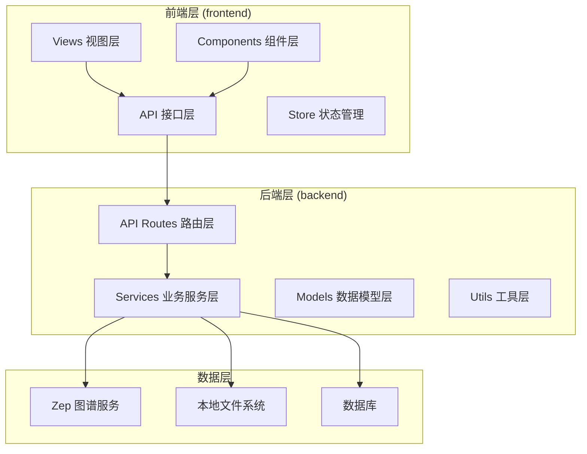
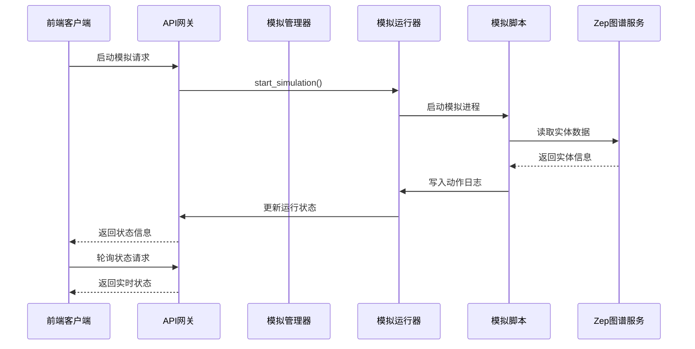
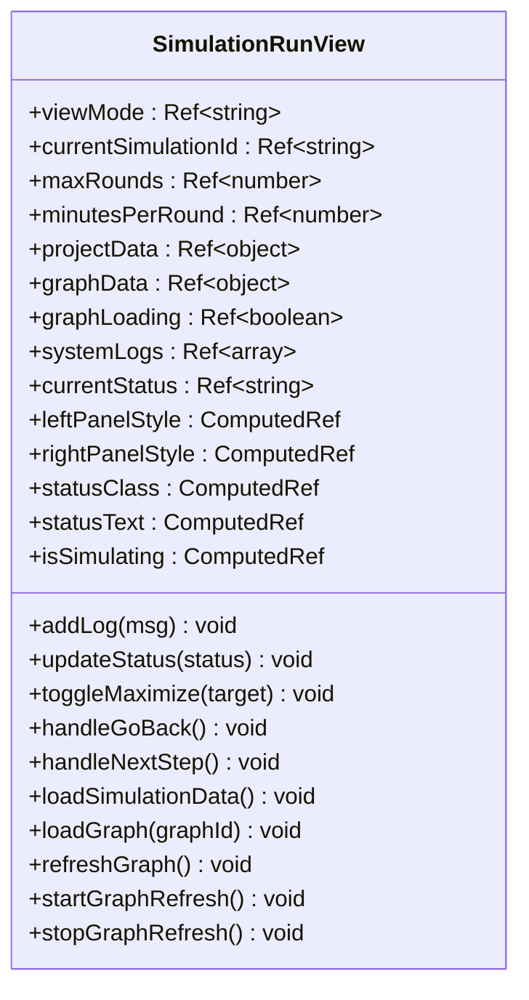
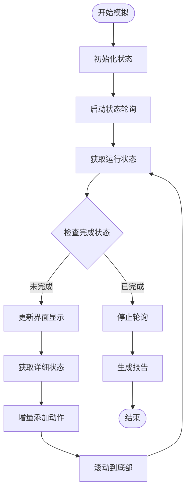
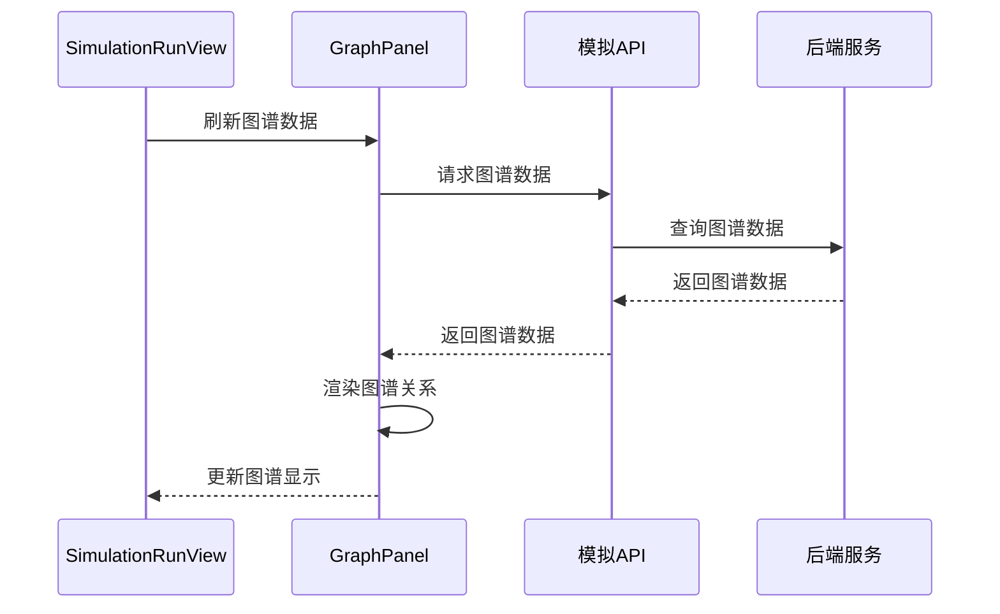
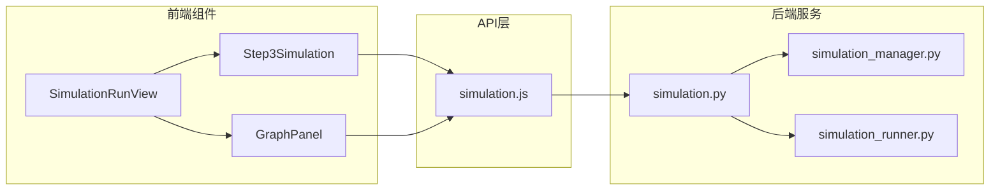

# 模拟运行视图

<cite>
**本文档引用的文件**
- [SimulationRunView.vue](file://frontend/src/views/SimulationRunView.vue)
- [Step3Simulation.vue](file://frontend/src/components/Step3Simulation.vue)
- [GraphPanel.vue](file://frontend/src/components/GraphPanel.vue)
- [simulation.js](file://frontend/src/api/simulation.js)
- [simulation.py](file://backend/app/api/simulation.py)
- [simulation_manager.py](file://backend/app/services/simulation_manager.py)
- [simulation_runner.py](file://backend/app/services/simulation_runner.py)
</cite>

## 目录
1. [简介](#简介)
2. [项目结构](#项目结构)
3. [核心组件](#核心组件)
4. [架构概览](#架构概览)
5. [详细组件分析](#详细组件分析)
6. [依赖关系分析](#依赖关系分析)
7. [性能考虑](#性能考虑)
8. [故障排除指南](#故障排除指南)
9. [结论](#结论)

## 简介

MiroFish模拟运行视图是整个模拟系统的核心界面，负责展示和监控双平台（Twitter和Reddit）并行模拟的实时执行过程。该视图提供了完整的模拟执行监控功能，包括模拟进度显示、实时数据更新、性能指标监控和状态反馈。

该组件采用前后端分离架构，前端使用Vue.js构建响应式界面，后端基于Python Flask提供RESTful API服务。系统支持双平台并行模拟运行，实时监控Agent行为，动态更新图谱关系，并提供丰富的可视化展示功能。

## 项目结构

MiroFish项目采用模块化的前后端分离架构，主要分为以下层次：

**图表来源**
- [SimulationRunView.vue](file://frontend/src/views/SimulationRunView.vue#L1-L448)
- [simulation.py](file://backend/app/api/simulation.py#L1-L800)

**章节来源**
- [SimulationRunView.vue](file://frontend/src/views/SimulationRunView.vue#L1-L448)
- [simulation.py](file://backend/app/api/simulation.py#L1-L800)

## 核心组件

### 主要组件职责

1. **SimulationRunView.vue** - 主视图容器，协调左右面板布局和状态管理
2. **Step3Simulation.vue** - 模拟控制面板，负责启动、停止和监控模拟运行
3. **GraphPanel.vue** - 图谱可视化组件，展示实体关系和实时更新

### 界面布局设计

组件采用三面板布局设计，支持多种视图模式：

- **图谱模式 (graph)**: 全屏显示图谱可视化
- **双栏模式 (split)**: 左右分栏显示图谱和控制面板
- **工作台模式 (workbench)**: 全屏显示控制面板

**章节来源**
- [SimulationRunView.vue](file://frontend/src/views/SimulationRunView.vue#L39-L64)
- [SimulationRunView.vue](file://frontend/src/views/SimulationRunView.vue#L85-L111)

## 架构概览

MiroFish模拟运行系统采用分层架构设计，实现了前后端的清晰分离：

**图表来源**
- [simulation_runner.py](file://backend/app/services/simulation_runner.py#L312-L475)
- [simulation.py](file://backend/app/api/simulation.py#L1698-L1755)

系统架构特点：
- **异步处理**: 模拟准备和运行采用异步任务处理
- **实时监控**: 前端定时轮询后端状态
- **双平台支持**: Twitter和Reddit平台并行运行
- **动态更新**: 支持图谱关系的实时更新

**章节来源**
- [simulation_runner.py](file://backend/app/services/simulation_runner.py#L195-L800)
- [simulation_manager.py](file://backend/app/services/simulation_manager.py#L114-L529)

## 详细组件分析

### SimulationRunView 主视图组件

#### 界面布局和状态管理

主视图组件负责整体布局协调和状态管理：

**图表来源**
- [SimulationRunView.vue](file://frontend/src/views/SimulationRunView.vue#L69-L311)

#### 实时数据刷新机制

系统实现了智能的数据刷新策略：

1. **自动刷新控制**: 基于模拟状态动态启停刷新
2. **延迟刷新**: 避免频繁的API调用
3. **条件加载**: 仅在需要时加载图谱数据

**章节来源**
- [SimulationRunView.vue](file://frontend/src/views/SimulationRunView.vue#L271-L296)
- [SimulationRunView.vue](file://frontend/src/views/SimulationRunView.vue#L243-L269)

### Step3Simulation 控制面板

#### 模拟运行监控

控制面板提供了完整的模拟运行监控功能：

**图表来源**
- [Step3Simulation.vue](file://frontend/src/components/Step3Simulation.vue#L462-L589)

#### 双平台状态监控

系统支持Twitter和Reddit双平台的独立监控：

- **平台进度**: 显示各平台的轮次进度和动作数量
- **实时统计**: 显示平台的模拟时间和动作统计
- **完成状态**: 监控各平台的完成状态

**章节来源**
- [Step3Simulation.vue](file://frontend/src/components/Step3Simulation.vue#L1-L800)

### GraphPanel 图谱可视化

#### 实时图谱更新

图谱组件实现了动态的图谱关系可视化：

**图表来源**
- [GraphPanel.vue](file://frontend/src/components/GraphPanel.vue#L1-L800)

#### 交互式探索功能

图谱组件提供了丰富的交互功能：

- **节点选择**: 点击节点查看详细信息
- **边选择**: 点击边查看关系详情
- **缩放平移**: 支持图谱的缩放和平移操作
- **详情面板**: 显示选中元素的详细属性

**章节来源**
- [GraphPanel.vue](file://frontend/src/components/GraphPanel.vue#L1-L800)

## 依赖关系分析

### 前端依赖关系

**图表来源**
- [simulation.js](file://frontend/src/api/simulation.js#L1-L188)
- [simulation.py](file://backend/app/api/simulation.py#L1-L800)

### 后端服务依赖

后端服务采用了清晰的分层设计：

- **API层**: 处理HTTP请求和响应
- **服务层**: 实现业务逻辑和数据处理
- **工具层**: 提供通用的工具函数和配置

**章节来源**
- [simulation_manager.py](file://backend/app/services/simulation_manager.py#L114-L529)
- [simulation_runner.py](file://backend/app/services/simulation_runner.py#L195-L800)

## 性能考虑

### 前端性能优化

1. **虚拟滚动**: 对于大量动作记录，使用虚拟滚动技术
2. **懒加载**: 图谱数据按需加载，避免不必要的渲染
3. **防抖节流**: API调用使用防抖和节流机制
4. **内存管理**: 及时清理定时器和事件监听器

### 后端性能优化

1. **异步处理**: 模拟准备和运行采用异步任务处理
2. **缓存策略**: 内存中缓存模拟状态，减少磁盘I/O
3. **增量更新**: 仅传输新增的动作数据
4. **资源管理**: 合理管理进程和文件句柄

## 故障排除指南

### 常见问题诊断

#### 模拟启动失败

**症状**: 模拟启动后立即失败
**排查步骤**:
1. 检查模拟配置文件是否存在
2. 验证Zep图谱连接配置
3. 查看后端日志中的错误信息
4. 确认Python环境和依赖包

#### 实时数据更新异常

**症状**: 前端无法获取实时状态
**排查步骤**:
1. 检查网络连接和API可达性
2. 验证后端进程是否正常运行
3. 查看WebSocket连接状态
4. 检查防火墙和代理设置

#### 图谱显示问题

**症状**: 图谱渲染异常或显示空白
**排查步骤**:
1. 检查图谱数据格式和完整性
2. 验证D3.js依赖是否正确加载
3. 查看浏览器控制台错误信息
4. 确认SVG渲染权限

### 性能调优建议

1. **合理设置轮询间隔**: 根据数据更新频率调整轮询间隔
2. **优化图谱数据**: 控制图谱节点和边的数量
3. **启用缓存**: 对静态数据启用浏览器缓存
4. **监控资源使用**: 定期检查内存和CPU使用情况

**章节来源**
- [Step3Simulation.vue](file://frontend/src/components/Step3Simulation.vue#L437-L460)
- [GraphPanel.vue](file://frontend/src/components/GraphPanel.vue#L264-L271)

## 结论

MiroFish模拟运行视图是一个功能完整、架构清晰的模拟监控系统。它成功地实现了以下关键功能：

1. **实时监控**: 提供双平台并行模拟的实时状态监控
2. **可视化展示**: 通过图谱关系可视化展示模拟结果
3. **交互式探索**: 支持用户与模拟数据的深度交互
4. **性能优化**: 采用多种技术手段确保系统的高性能运行

该系统的设计充分考虑了用户体验和技术实现的平衡，为复杂模拟场景提供了可靠的监控和分析工具。通过合理的架构设计和性能优化，系统能够稳定地处理大规模的模拟数据，为用户提供流畅的使用体验。

未来可以在以下方面进行改进：
- 增加更多的可视化图表类型
- 优化移动端适配
- 提供更丰富的数据分析功能
- 增强错误处理和用户反馈机制