# 深度交互界面

<cite>
**本文档引用的文件**
- [InteractionView.vue](file://frontend/src/views/InteractionView.vue)
- [Step5Interaction.vue](file://frontend/src/components/Step5Interaction.vue)
- [GraphPanel.vue](file://frontend/src/components/GraphPanel.vue)
- [report.js](file://frontend/src/api/report.js)
- [simulation.js](file://frontend/src/api/simulation.js)
- [index.js](file://frontend/src/api/index.js)
- [report.py](file://backend/app/api/report.py)
- [simulation.py](file://backend/app/api/simulation.py)
- [report_agent.py](file://backend/app/services/report_agent.py)
- [zep_tools.py](file://backend/app/services/zep_tools.py)
- [config.py](file://backend/app/config.py)
- [logger.py](file://backend/app/utils/logger.py)
</cite>

## 目录
1. [简介](#简介)
2. [项目结构](#项目结构)
3. [核心组件](#核心组件)
4. [架构概览](#架构概览)
5. [详细组件分析](#详细组件分析)
6. [依赖关系分析](#依赖关系分析)
7. [性能考虑](#性能考虑)
8. [故障排除指南](#故障排除指南)
9. [结论](#结论)

## 简介

MiroFish深度交互界面是整个模拟系统的核心交互入口，为用户提供了一个智能化的对话和探索平台。该界面支持与模拟世界中的智能体进行深度对话，与Report Agent进行专业级的报告生成和分析，同时提供实时的图谱可视化和状态监控。

该系统采用前后端分离架构，前端使用Vue.js框架构建响应式用户界面，后端基于Flask提供RESTful API服务。核心功能包括智能对话、报告生成、Agent采访、实时状态监控等高级特性。

## 项目结构

MiroFish项目采用模块化设计，主要分为前端和后端两个部分：

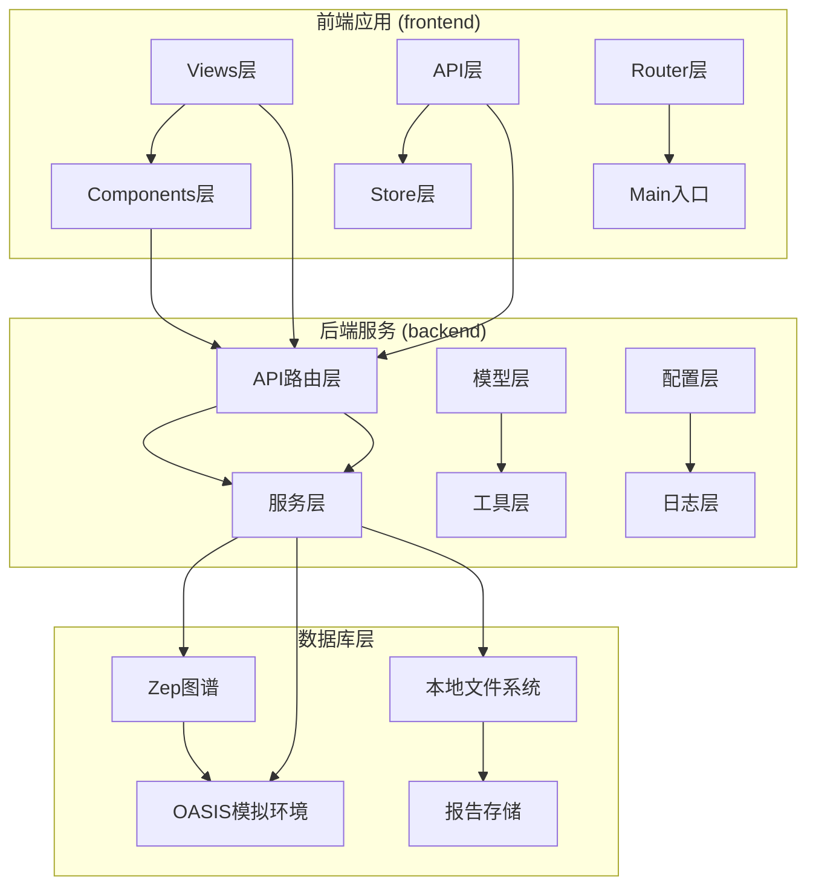

**图表来源**
- [InteractionView.vue](file://frontend/src/views/InteractionView.vue#L1-L351)
- [Step5Interaction.vue](file://frontend/src/components/Step5Interaction.vue#L1-L2547)

**章节来源**
- [InteractionView.vue](file://frontend/src/views/InteractionView.vue#L1-L351)
- [Step5Interaction.vue](file://frontend/src/components/Step5Interaction.vue#L1-L2547)

## 核心组件

### 主要组件架构

深度交互界面由三个核心组件构成：

1. **InteractionView主视图** - 整体布局和状态管理
2. **Step5Interaction交互面板** - 主要的对话和交互功能
3. **GraphPanel图谱面板** - 实时图谱可视化和探索

### 组件职责分工

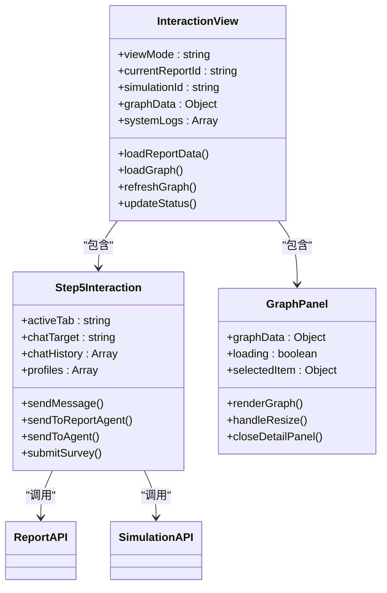

**图表来源**
- [InteractionView.vue](file://frontend/src/views/InteractionView.vue#L64-L214)
- [Step5Interaction.vue](file://frontend/src/components/Step5Interaction.vue#L413-L931)
- [GraphPanel.vue](file://frontend/src/components/GraphPanel.vue#L238-L800)

**章节来源**
- [InteractionView.vue](file://frontend/src/views/InteractionView.vue#L64-L214)
- [Step5Interaction.vue](file://frontend/src/components/Step5Interaction.vue#L413-L931)
- [GraphPanel.vue](file://frontend/src/components/GraphPanel.vue#L238-L800)

## 架构概览

### 系统架构图

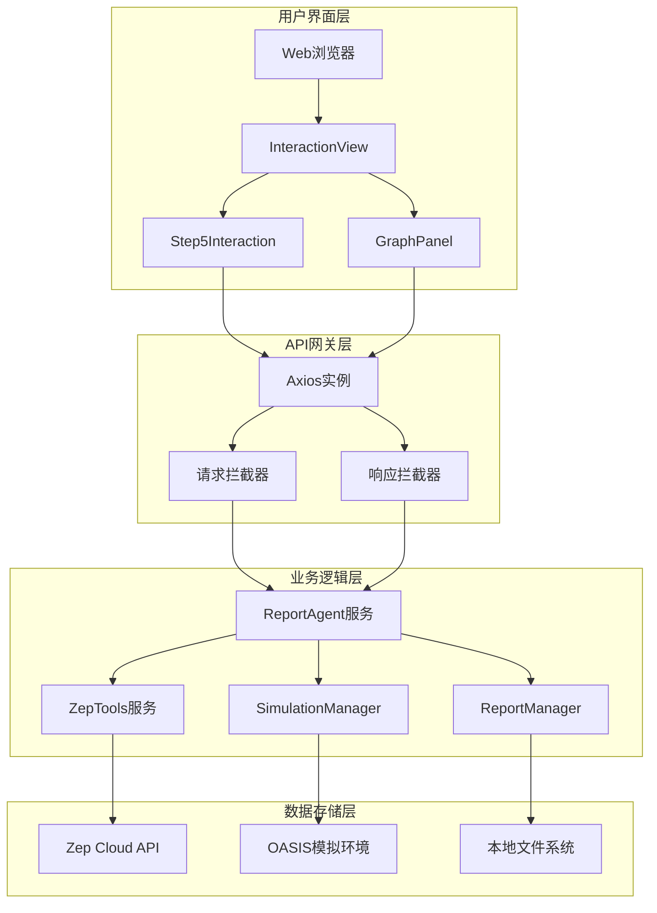

**图表来源**
- [report.py](file://backend/app/api/report.py#L1-L1016)
- [simulation.py](file://backend/app/api/simulation.py#L1-L2712)
- [report_agent.py](file://backend/app/services/report_agent.py#L1-L2420)
- [zep_tools.py](file://backend/app/services/zep_tools.py#L1-L1660)

### 数据流架构

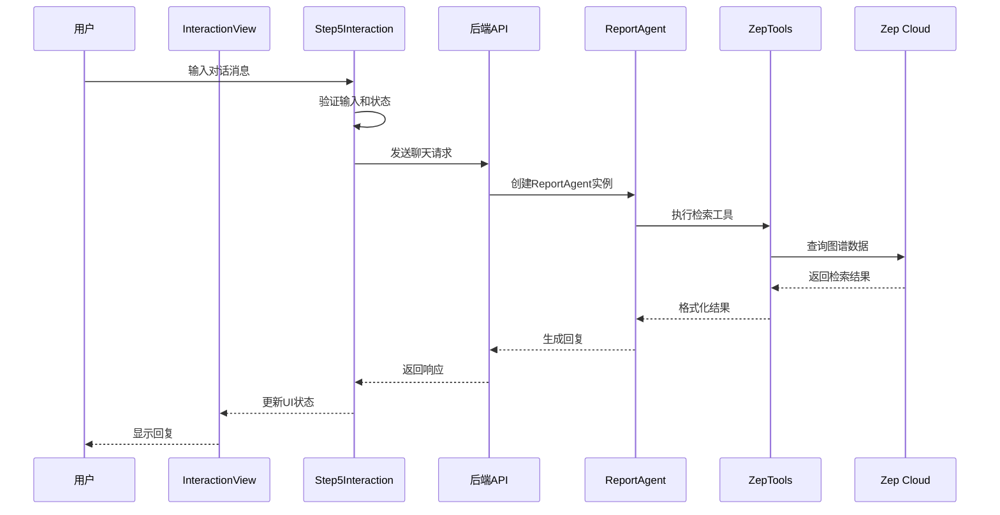

**图表来源**
- [Step5Interaction.vue](file://frontend/src/components/Step5Interaction.vue#L614-L743)
- [report.py](file://backend/app/api/report.py#L467-L559)
- [report_agent.py](file://backend/app/services/report_agent.py#L469-L800)

**章节来源**
- [report.py](file://backend/app/api/report.py#L1-L1016)
- [simulation.py](file://backend/app/api/simulation.py#L1-L2712)
- [report_agent.py](file://backend/app/services/report_agent.py#L1-L2420)

## 详细组件分析

### InteractionView主视图组件

InteractionView作为深度交互界面的主容器，负责整体布局管理和状态协调。

#### 核心功能特性

1. **多视图模式支持**
   - 图谱视图模式
   - 双栏视图模式  
   - 工作台视图模式

2. **实时状态监控**
   - 报告生成状态跟踪
   - 模拟运行状态监控
   - 系统日志记录

3. **数据加载管理**
   - 报告数据获取
   - 图谱数据加载
   - 模拟状态同步

#### 状态管理系统

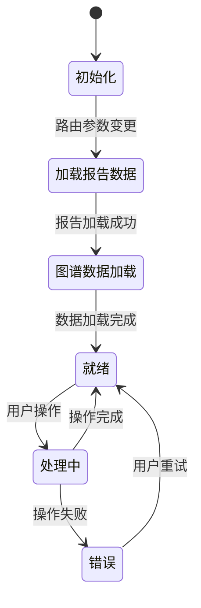

**图表来源**
- [InteractionView.vue](file://frontend/src/views/InteractionView.vue#L81-L213)

**章节来源**
- [InteractionView.vue](file://frontend/src/views/InteractionView.vue#L64-L214)

### Step5Interaction交互面板组件

Step5Interaction是深度交互界面的核心功能模块，提供智能对话和探索能力。

#### 对话系统架构

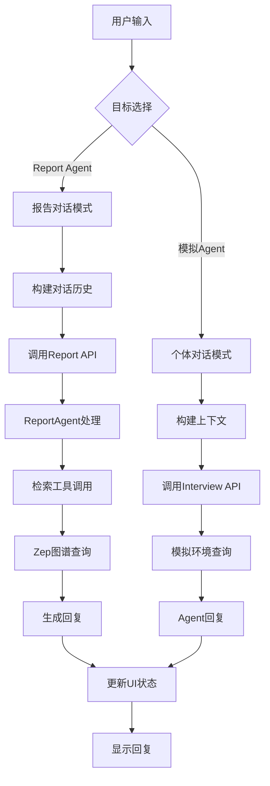

**图表来源**
- [Step5Interaction.vue](file://frontend/src/components/Step5Interaction.vue#L614-L743)
- [report.js](file://frontend/src/api/report.js#L46-L51)
- [simulation.js](file://frontend/src/api/simulation.js#L172-L177)

#### 对话历史管理

组件实现了智能的对话历史缓存机制：

| 缓存类型 | 存储键 | 用途 | 生命周期 |
|---------|--------|------|----------|
| Report Agent | `report_agent` | 与报告智能体的对话记录 | 应用会话期间 |
| 模拟Agent | `agent_{index}` | 与特定Agent的对话记录 | 应用会话期间 |
| 问卷调查 | `survey_results` | 批量调查结果 | 页面刷新后清除 |

**章节来源**
- [Step5Interaction.vue](file://frontend/src/components/Step5Interaction.vue#L487-L540)
- [Step5Interaction.vue](file://frontend/src/components/Step5Interaction.vue#L614-L743)

### GraphPanel图谱可视化组件

GraphPanel提供实时的图谱可视化和交互探索功能。

#### 图谱渲染引擎

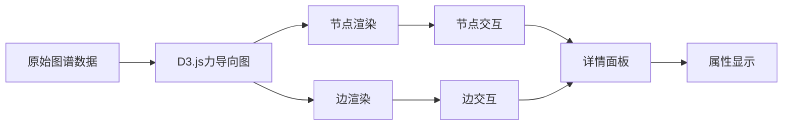

**图表来源**
- [GraphPanel.vue](file://frontend/src/components/GraphPanel.vue#L328-L784)

#### 实时更新机制

组件支持多种实时更新场景：

1. **模拟运行时更新** - 实时反映模拟状态变化
2. **手动刷新** - 用户主动触发数据更新
3. **状态变化监听** - 自动响应相关状态改变

**章节来源**
- [GraphPanel.vue](file://frontend/src/components/GraphPanel.vue#L1-L800)

## 依赖关系分析

### 前端依赖关系

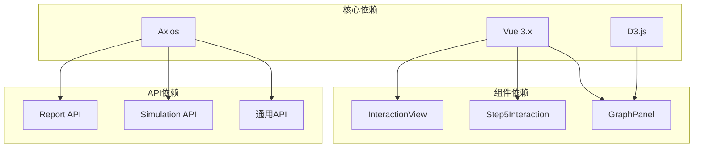

**图表来源**
- [InteractionView.vue](file://frontend/src/views/InteractionView.vue#L65-L71)
- [Step5Interaction.vue](file://frontend/src/components/Step5Interaction.vue#L414-L417)
- [GraphPanel.vue](file://frontend/src/components/GraphPanel.vue#L240)

### 后端服务依赖

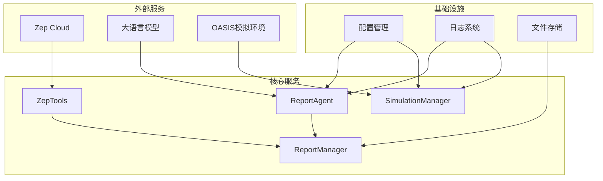

**图表来源**
- [report_agent.py](file://backend/app/services/report_agent.py#L469-L530)
- [zep_tools.py](file://backend/app/services/zep_tools.py#L1-L200)
- [config.py](file://backend/app/config.py#L20-L76)

**章节来源**
- [config.py](file://backend/app/config.py#L1-L76)
- [logger.py](file://backend/app/utils/logger.py#L1-L127)

## 性能考虑

### 前端性能优化策略

1. **虚拟滚动** - 对于大量对话记录和Agent列表，使用虚拟滚动技术
2. **懒加载** - 图谱数据和报告内容按需加载
3. **缓存机制** - 对常用数据进行内存缓存
4. **防抖处理** - 对频繁的用户输入进行防抖处理

### 后端性能优化

1. **异步处理** - 报告生成和模拟运行采用异步任务队列
2. **连接池管理** - 数据库和外部API连接池优化
3. **结果缓存** - 对热点查询结果进行缓存
4. **并发控制** - 限制同时进行的昂贵操作数量

### 实时通信优化

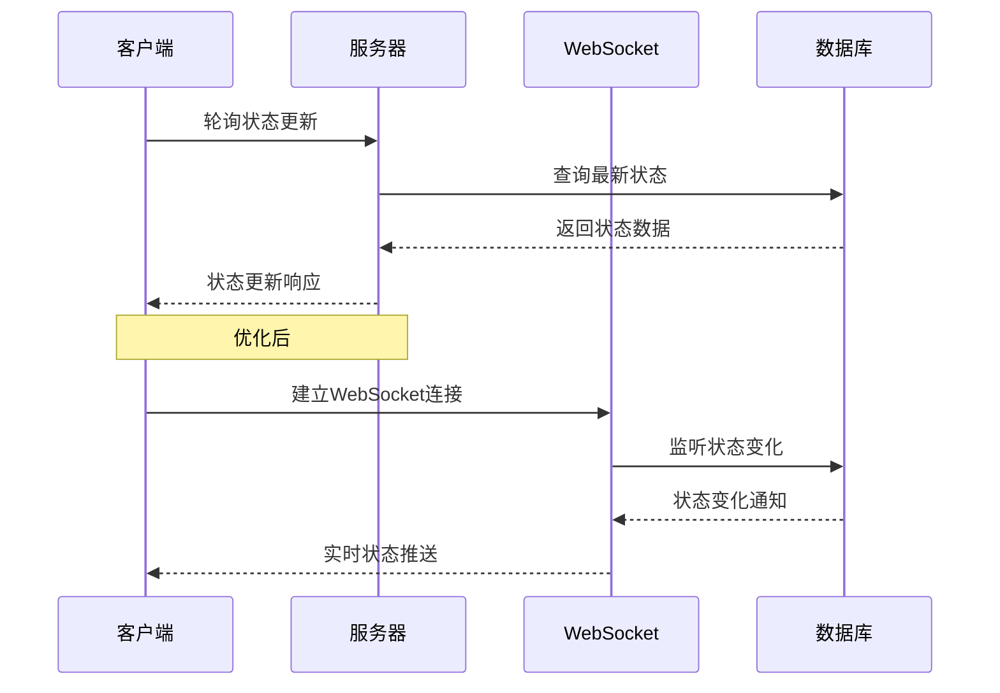

**图表来源**
- [report.py](file://backend/app/api/report.py#L564-L602)
- [simulation.py](file://backend/app/api/simulation.py#L1698-L1726)

## 故障排除指南

### 常见问题诊断

#### API连接问题

| 问题症状 | 可能原因 | 解决方案 |
|---------|---------|---------|
| 请求超时 | 网络连接不稳定 | 检查网络连接，增加超时时间 |
| 认证失败 | API密钥配置错误 | 验证.env文件配置 |
| 跨域问题 | CORS配置不当 | 检查后端CORS设置 |
| 429错误 | API配额限制 | 实现重试机制和限流 |

#### 图谱加载问题

| 问题症状 | 可能原因 | 解决方案 |
|---------|---------|---------|
| 图谱为空 | 图谱数据未生成 | 检查图谱构建流程 |
| 加载缓慢 | 数据量过大 | 实现分页加载和缓存 |
| 显示异常 | D3.js渲染错误 | 检查数据格式和版本兼容性 |

#### 对话功能问题

| 问题症状 | 可能原因 | 解决方案 |
|---------|---------|---------|
| 无法发送消息 | 状态锁定 | 检查isSending标志位 |
| 回复延迟 | API响应慢 | 实现本地占位符和进度指示 |
| 内容显示异常 | Markdown渲染错误 | 检查渲染函数和CSS样式 |

### 调试工具和技巧

1. **浏览器开发者工具** - 监控网络请求和JavaScript错误
2. **后端日志** - 查看详细的错误堆栈和调试信息
3. **API测试工具** - 使用Postman或curl测试API端点
4. **性能分析** - 使用Chrome DevTools分析性能瓶颈

### 安全配置检查

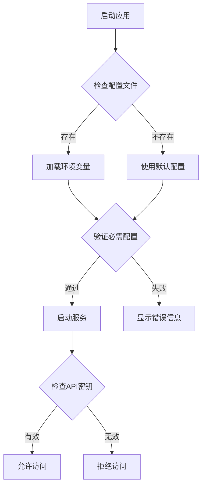

**图表来源**
- [config.py](file://backend/app/config.py#L66-L75)

**章节来源**
- [config.py](file://backend/app/config.py#L1-L76)
- [logger.py](file://backend/app/utils/logger.py#L1-L127)

## 结论

MiroFish深度交互界面是一个功能完整、架构清晰的智能对话平台。通过精心设计的组件架构和优化的性能策略，该系统能够为用户提供流畅、直观的交互体验。

### 主要优势

1. **模块化设计** - 清晰的组件职责分离，便于维护和扩展
2. **实时交互** - 支持与模拟世界中的智能体进行实时对话
3. **可视化探索** - 提供图谱可视化和交互式探索功能
4. **智能分析** - 集成Report Agent提供专业的报告生成和分析能力

### 技术亮点

1. **前后端分离** - 采用现代化的开发模式，提高开发效率
2. **异步处理** - 报告生成和模拟运行采用异步架构
3. **实时通信** - 支持WebSocket实现真正的实时更新
4. **性能优化** - 多层次的性能优化策略确保流畅体验

### 未来发展建议

1. **增强AI能力** - 集成更先进的自然语言处理模型
2. **扩展可视化** - 增加更多图谱分析和探索功能
3. **移动端适配** - 优化移动端用户体验
4. **多语言支持** - 扩展国际化功能

该系统为模拟和数据分析领域提供了一个强大而灵活的交互平台，具有良好的扩展性和维护性，能够满足复杂场景下的深度交互需求。