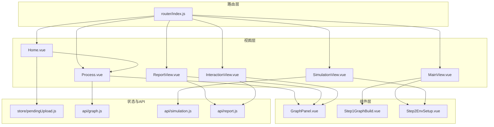
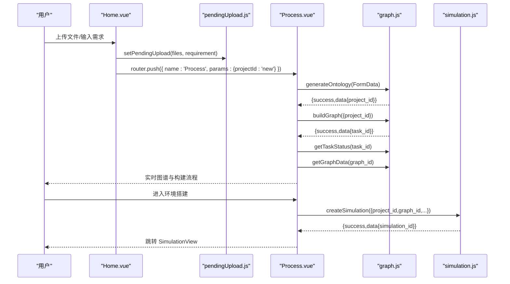
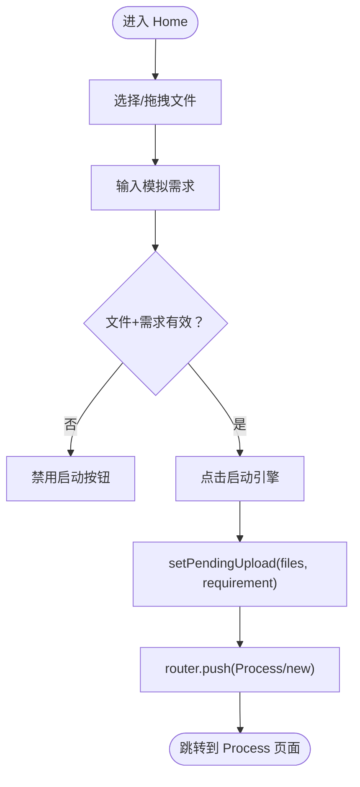
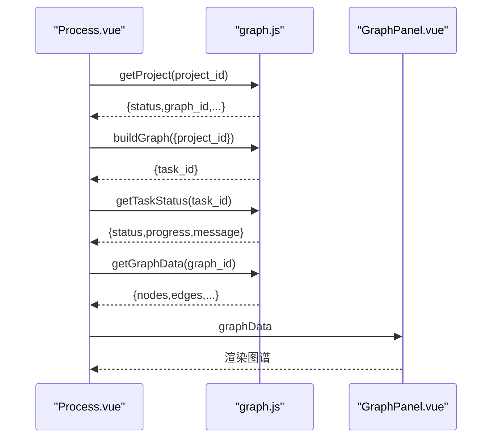
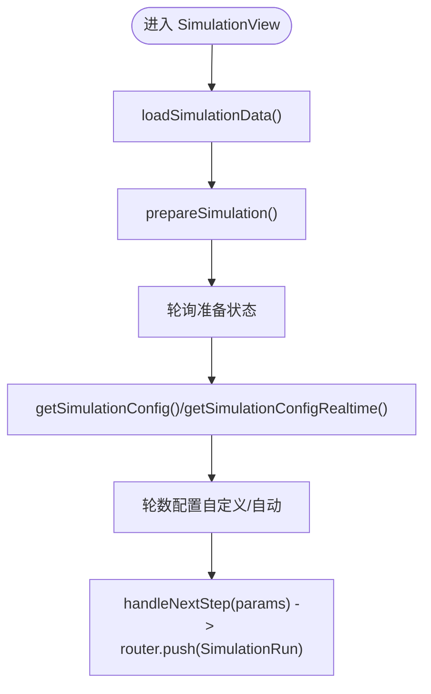
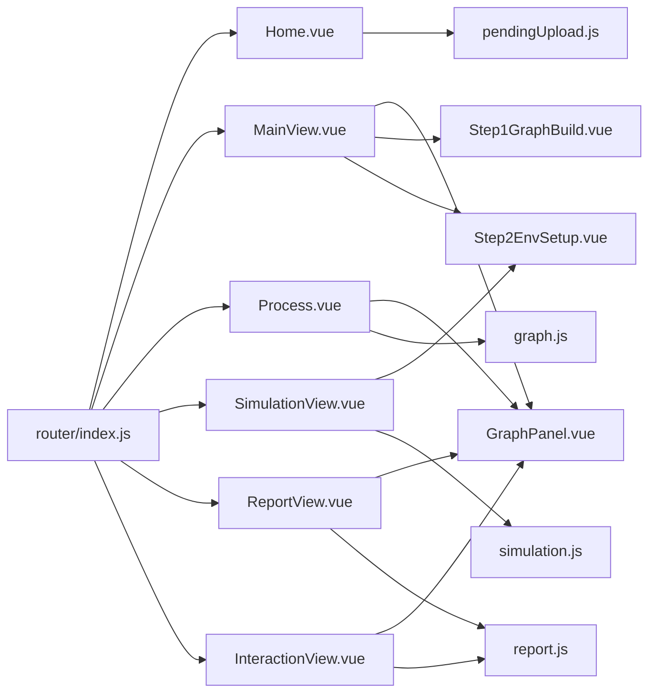

# 页面视图组件

<cite>
**本文档引用的文件**
- [Home.vue](file://frontend/src/views/Home.vue)
- [MainView.vue](file://frontend/src/views/MainView.vue)
- [Process.vue](file://frontend/src/views/Process.vue)
- [SimulationView.vue](file://frontend/src/views/SimulationView.vue)
- [ReportView.vue](file://frontend/src/views/ReportView.vue)
- [InteractionView.vue](file://frontend/src/views/InteractionView.vue)
- [index.js](file://frontend/src/router/index.js)
- [App.vue](file://frontend/src/App.vue)
- [pendingUpload.js](file://frontend/src/store/pendingUpload.js)
- [graph.js](file://frontend/src/api/graph.js)
- [simulation.js](file://frontend/src/api/simulation.js)
- [report.js](file://frontend/src/api/report.js)
- [GraphPanel.vue](file://frontend/src/components/GraphPanel.vue)
- [Step1GraphBuild.vue](file://frontend/src/components/Step1GraphBuild.vue)
- [Step2EnvSetup.vue](file://frontend/src/components/Step2EnvSetup.vue)
</cite>

## 目录
1. [简介](#简介)
2. [项目结构](#项目结构)
3. [核心组件](#核心组件)
4. [架构总览](#架构总览)
5. [详细组件分析](#详细组件分析)
6. [依赖分析](#依赖分析)
7. [性能考虑](#性能考虑)
8. [故障排查指南](#故障排查指南)
9. [结论](#结论)
10. [附录](#附录)

## 简介
本文件系统化梳理 MiroFish 前端页面视图组件，覆盖从首页入口、主工作流、项目状态跟踪、模拟配置、报告生成到深度交互的完整流程。文档重点阐述各页面的功能定位、布局设计、用户交互与数据流转，以及页面间的状态同步与导航逻辑，并提供使用示例与定制指南。

## 项目结构
前端采用 Vue 3 + Vue Router 的单页应用架构，页面视图集中于 views 目录，核心页面包括：
- 首页 Home：项目入口与初始化
- 主工作流 MainView：步骤化流程容器
- 项目状态跟踪 Process：实时图谱与构建流程
- 模拟配置 SimulationView：环境搭建与配置
- 报告展示 ReportView：报告生成与查看
- 深度交互 InteractionView：与模拟世界及 ReportAgent 的交互
- 路由 router：统一管理页面路由与参数传递
- 组件 components：GraphPanel、Step1GraphBuild、Step2EnvSetup 等复用组件
- API 层：graph.js、simulation.js、report.js
- 状态 store：pendingUpload.js 用于首页到流程的跨页面数据传递

**图表来源**
- [index.js](file://frontend/src/router/index.js#L1-L53)
- [Home.vue](file://frontend/src/views/Home.vue#L1-L886)
- [MainView.vue](file://frontend/src/views/MainView.vue#L1-L541)
- [Process.vue](file://frontend/src/views/Process.vue#L1-L800)
- [SimulationView.vue](file://frontend/src/views/SimulationView.vue#L1-L435)
- [ReportView.vue](file://frontend/src/views/ReportView.vue#L1-L349)
- [InteractionView.vue](file://frontend/src/views/InteractionView.vue#L1-L351)
- [GraphPanel.vue](file://frontend/src/components/GraphPanel.vue#L1-L800)
- [Step1GraphBuild.vue](file://frontend/src/components/Step1GraphBuild.vue#L1-L699)
- [Step2EnvSetup.vue](file://frontend/src/components/Step2EnvSetup.vue#L1-L800)
- [pendingUpload.js](file://frontend/src/store/pendingUpload.js#L1-L34)
- [graph.js](file://frontend/src/api/graph.js#L1-L71)
- [simulation.js](file://frontend/src/api/simulation.js#L1-L188)
- [report.js](file://frontend/src/api/report.js#L1-L52)

**章节来源**
- [index.js](file://frontend/src/router/index.js#L1-L53)
- [App.vue](file://frontend/src/App.vue#L1-L48)

## 核心组件
- 首页 Home：提供文件上传、模拟需求输入、启动引擎的入口；通过 pendingUpload.store 在首页与流程页之间传递数据。
- 主工作流 MainView：统一的步骤化容器，左侧 GraphPanel，右侧 Step1GraphBuild/Step2EnvSetup 等步骤组件，支持视图模式切换与步骤前进后退。
- 项目状态跟踪 Process：实时图谱展示与构建流程详情，支持全屏、详情面板、自动轮询。
- 模拟配置 SimulationView：环境搭建与配置，支持轮数自定义、优雅关闭模拟环境。
- 报告展示 ReportView：报告生成与查看，工作台视角聚焦。
- 深度交互 InteractionView：与模拟世界及 ReportAgent 的交互，工作台视角聚焦。
- GraphPanel：D3 力导向图谱可视化，支持节点/边详情、自环聚合、边标签、缩放拖拽、实时更新提示。
- Step1GraphBuild：本体生成与图谱构建的步骤面板，支持本体详情弹窗、系统日志滚动。
- Step2EnvSetup：模拟环境准备的步骤面板，支持 Agent 人设生成、双平台配置、初始激活编排、轮数配置。

**章节来源**
- [Home.vue](file://frontend/src/views/Home.vue#L1-L886)
- [MainView.vue](file://frontend/src/views/MainView.vue#L1-L541)
- [Process.vue](file://frontend/src/views/Process.vue#L1-L800)
- [SimulationView.vue](file://frontend/src/views/SimulationView.vue#L1-L435)
- [ReportView.vue](file://frontend/src/views/ReportView.vue#L1-L349)
- [InteractionView.vue](file://frontend/src/views/InteractionView.vue#L1-L351)
- [GraphPanel.vue](file://frontend/src/components/GraphPanel.vue#L1-L800)
- [Step1GraphBuild.vue](file://frontend/src/components/Step1GraphBuild.vue#L1-L699)
- [Step2EnvSetup.vue](file://frontend/src/components/Step2EnvSetup.vue#L1-L800)

## 架构总览
页面视图组件围绕“项目生命周期”组织：首页初始化 → 流程构建 → 环境搭建 → 模拟运行 → 报告生成 → 深度交互。路由负责页面切换与参数传递，API 层负责与后端交互，组件层负责具体 UI 与交互细节。

**图表来源**
- [Home.vue](file://frontend/src/views/Home.vue#L291-L305)
- [pendingUpload.js](file://frontend/src/store/pendingUpload.js#L13-L31)
- [Process.vue](file://frontend/src/views/Process.vue#L567-L619)
- [graph.js](file://frontend/src/api/graph.js#L8-L70)
- [simulation.js](file://frontend/src/api/simulation.js#L7-L93)

## 详细组件分析

### 首页 Home（项目入口）
- 功能定位：提供文件上传、模拟需求输入、启动引擎按钮；展示系统状态与工作流序列；集成历史项目数据库。
- 布局设计：Hero 区域 + 双栏布局（左状态与步骤、右交互控制台）；支持拖拽上传、文件列表与移除。
- 用户交互：校验文件与需求后跳转到 Process 页面，使用特殊 projectId 标识“新建项目”，随后在 Process 页面调用 API。
- 数据传递：通过 pendingUpload.store 临时存储文件与需求，Process 页面读取并清理。

**图表来源**
- [Home.vue](file://frontend/src/views/Home.vue#L232-L305)
- [pendingUpload.js](file://frontend/src/store/pendingUpload.js#L13-L31)

**章节来源**
- [Home.vue](file://frontend/src/views/Home.vue#L1-L886)
- [pendingUpload.js](file://frontend/src/store/pendingUpload.js#L1-L34)

### 主工作流 MainView（步骤化操作）
- 功能定位：统一的步骤化容器，支持视图模式（图谱/双栏/工作台）切换；承载 Step1GraphBuild 与 Step2EnvSetup。
- 布局设计：左侧 GraphPanel，右侧步骤组件；顶部显示步骤名与状态指示器。
- 用户交互：步骤前进/后退、日志追加、状态类名映射（Processing/Completed/Error）。
- 数据与状态：currentStep、currentPhase、systemLogs、graphData、projectData 等；通过 API 轮询任务与图谱数据。

**章节来源**
- [MainView.vue](file://frontend/src/views/MainView.vue#L1-L541)
- [GraphPanel.vue](file://frontend/src/components/GraphPanel.vue#L1-L800)
- [Step1GraphBuild.vue](file://frontend/src/components/Step1GraphBuild.vue#L1-L699)
- [Step2EnvSetup.vue](file://frontend/src/components/Step2EnvSetup.vue#L1-L800)

### 项目状态跟踪 Process（实时监控）
- 功能定位：实时展示图谱构建过程与结果；提供构建流程详情与项目信息面板。
- 布局设计：左侧实时图谱（GraphPanel），右侧构建流程详情与项目信息；支持全屏切换与详情面板。
- 用户交互：刷新图谱、关闭详情、全屏显示；支持本体生成进度与构建进度展示。
- 数据与状态：currentPhase（-1/0/1/2）、buildProgress、ontologyProgress、graphData、projectData；通过轮询获取任务状态与图谱数据。

**图表来源**
- [Process.vue](file://frontend/src/views/Process.vue#L621-L770)
- [graph.js](file://frontend/src/api/graph.js#L26-L70)
- [GraphPanel.vue](file://frontend/src/components/GraphPanel.vue#L328-L784)

**章节来源**
- [Process.vue](file://frontend/src/views/Process.vue#L1-L800)
- [GraphPanel.vue](file://frontend/src/components/GraphPanel.vue#L1-L800)
- [graph.js](file://frontend/src/api/graph.js#L1-L71)

### 模拟配置 SimulationView（环境搭建）
- 功能定位：环境搭建与配置，支持 Agent 人设生成、双平台配置、初始激活编排与轮数配置。
- 布局设计：左侧 GraphPanel，右侧 Step2EnvSetup；顶部状态指示器与步骤名。
- 用户交互：返回上一步、进入下一步（携带 maxRounds 参数）、优雅关闭模拟环境。
- 数据与状态：simulationId、projectData、graphData、systemLogs；通过 API 轮询准备状态与配置。

**图表来源**
- [SimulationView.vue](file://frontend/src/views/SimulationView.vue#L175-L297)
- [Step2EnvSetup.vue](file://frontend/src/components/Step2EnvSetup.vue#L768-L800)
- [simulation.js](file://frontend/src/api/simulation.js#L15-L68)

**章节来源**
- [SimulationView.vue](file://frontend/src/views/SimulationView.vue#L1-L435)
- [Step2EnvSetup.vue](file://frontend/src/components/Step2EnvSetup.vue#L1-L800)
- [simulation.js](file://frontend/src/api/simulation.js#L1-L188)

### 报告展示 ReportView（报告生成）
- 功能定位：报告生成与查看，工作台视角聚焦；支持日志与图谱加载。
- 布局设计：左侧 GraphPanel，右侧 Step4Report；顶部状态指示器与步骤名。
- 用户交互：加载报告数据、图谱刷新、状态更新。
- 数据与状态：reportId、simulationId、projectData、graphData、systemLogs；通过 API 获取报告与图谱。

**章节来源**
- [ReportView.vue](file://frontend/src/views/ReportView.vue#L1-L349)
- [report.js](file://frontend/src/api/report.js#L1-L52)

### 深度交互 InteractionView（与模拟世界交互）
- 功能定位：与模拟世界中的任意 Agent 对话，与 ReportAgent 对话；工作台视角聚焦。
- 布局设计：左侧 GraphPanel，右侧 Step5Interaction；顶部状态指示器与步骤名。
- 用户交互：加载报告数据、图谱刷新、状态更新。
- 数据与状态：reportId、simulationId、projectData、graphData、systemLogs；通过 API 获取报告与图谱。

**章节来源**
- [InteractionView.vue](file://frontend/src/views/InteractionView.vue#L1-L351)
- [report.js](file://frontend/src/api/report.js#L1-L52)

### GraphPanel（图谱可视化）
- 功能定位：D3 力导向图谱可视化，支持节点/边详情、自环聚合、边标签、缩放拖拽、实时更新提示。
- 用户交互：点击节点/边查看详情、点击空白关闭详情、刷新图谱、最大化/还原。
- 性能与复杂度：节点/边数量增长时，力导向仿真与曲线路径计算成本上升；通过边数量动态调整节点间距与曲线范围优化视觉体验。

**章节来源**
- [GraphPanel.vue](file://frontend/src/components/GraphPanel.vue#L1-L800)

### Step1GraphBuild（图谱构建步骤）
- 功能定位：本体生成与图谱构建的步骤面板，支持本体详情弹窗、系统日志滚动。
- 用户交互：点击实体/关系标签查看详情、进入环境搭建。
- 数据与状态：ontologyProgress、buildProgress、graphStats、selectedOntologyItem。

**章节来源**
- [Step1GraphBuild.vue](file://frontend/src/components/Step1GraphBuild.vue#L1-L699)

### Step2EnvSetup（环境搭建步骤）
- 功能定位：Agent 人设生成、双平台配置、初始激活编排、轮数配置。
- 用户交互：查看 Agent 人设、查看配置详情、自定义轮数（滑块）、开始模拟。
- 数据与状态：profiles、simulationConfig、expectedTotal、prepareProgress、phase、useCustomRounds。

**章节来源**
- [Step2EnvSetup.vue](file://frontend/src/components/Step2EnvSetup.vue#L1-L800)

## 依赖分析
- 路由依赖：router/index.js 定义页面路由与参数传递（:projectId/:simulationId/:reportId）。
- 状态依赖：pendingUpload.js 提供首页到流程的跨页面数据传递。
- API 依赖：graph.js、simulation.js、report.js 提供与后端交互的统一入口。
- 组件依赖：GraphPanel 与各步骤组件在 MainView/Process/Simulation/Report/Interaction 中复用。

**图表来源**
- [index.js](file://frontend/src/router/index.js#L1-L53)
- [Home.vue](file://frontend/src/views/Home.vue#L1-L886)
- [MainView.vue](file://frontend/src/views/MainView.vue#L1-L541)
- [Process.vue](file://frontend/src/views/Process.vue#L1-L800)
- [SimulationView.vue](file://frontend/src/views/SimulationView.vue#L1-L435)
- [ReportView.vue](file://frontend/src/views/ReportView.vue#L1-L349)
- [InteractionView.vue](file://frontend/src/views/InteractionView.vue#L1-L351)
- [GraphPanel.vue](file://frontend/src/components/GraphPanel.vue#L1-L800)
- [Step1GraphBuild.vue](file://frontend/src/components/Step1GraphBuild.vue#L1-L699)
- [Step2EnvSetup.vue](file://frontend/src/components/Step2EnvSetup.vue#L1-L800)
- [pendingUpload.js](file://frontend/src/store/pendingUpload.js#L1-L34)
- [graph.js](file://frontend/src/api/graph.js#L1-L71)
- [simulation.js](file://frontend/src/api/simulation.js#L1-L188)
- [report.js](file://frontend/src/api/report.js#L1-L52)

**章节来源**
- [index.js](file://frontend/src/router/index.js#L1-L53)
- [pendingUpload.js](file://frontend/src/store/pendingUpload.js#L1-L34)
- [graph.js](file://frontend/src/api/graph.js#L1-L71)
- [simulation.js](file://frontend/src/api/simulation.js#L1-L188)
- [report.js](file://frontend/src/api/report.js#L1-L52)

## 性能考虑
- 图谱渲染：D3 力导向仿真复杂度与节点/边数量相关，建议在大规模场景下启用边标签开关、适当降低动画频率或分批加载。
- 轮询策略：Process 与 SimulationView 对任务状态与图谱数据采用定时轮询，建议根据数据变化情况动态调整轮询间隔。
- 资源释放：组件卸载时应停止轮询定时器，避免内存泄漏与后台任务占用。
- 首屏体验：首页上传与 API 调用分离，先跳转后加载，缩短首屏等待时间。

[本节为通用指导，无需特定文件引用]

## 故障排查指南
- 首页启动失败：检查 pendingUpload.store 是否存在文件与需求；确认 router.push 是否正确传递 projectId。
- 构建失败：检查 graph.js 的 generateOntology/buildGraph 返回值与 getTaskStatus 的状态；关注错误日志与状态类名。
- 模拟环境异常：使用 SimulationView 的优雅关闭与强制停止流程；检查 getEnvStatus 与 getSimulation 的状态。
- 图谱不显示：确认 getGraphData 返回数据结构与 GraphPanel 的 graphData 接收；检查渲染函数与 D3 版本兼容性。
- 日志堆积：注意日志数组长度限制与自动清理逻辑，避免内存占用过高。

**章节来源**
- [Home.vue](file://frontend/src/views/Home.vue#L291-L305)
- [Process.vue](file://frontend/src/views/Process.vue#L772-L807)
- [SimulationView.vue](file://frontend/src/views/SimulationView.vue#L179-L236)
- [GraphPanel.vue](file://frontend/src/components/GraphPanel.vue#L328-L784)

## 结论
MiroFish 页面视图组件围绕“项目生命周期”构建，通过路由与 API 层实现页面间的数据传递与状态同步，组件层提供可复用的可视化与交互能力。整体设计强调步骤化与实时反馈，适合复杂模拟场景的可视化与交互需求。

[本节为总结性内容，无需特定文件引用]

## 附录

### 页面间导航与参数传递
- 首页 → 流程：Home.setPendingUpload → router.push(Process/new)
- 流程 → 环境搭建：Process.createSimulation → router.push(Simulation/:id)
- 环境搭建 → 模拟运行：SimulationView.handleNextStep(params) → router.push(SimulationRun/:id)
- 报告/交互：ReportView/InteractionView 通过 reportId 获取 simulationId 与 projectData

**章节来源**
- [Home.vue](file://frontend/src/views/Home.vue#L291-L305)
- [Process.vue](file://frontend/src/views/Process.vue#L211-L244)
- [SimulationView.vue](file://frontend/src/views/SimulationView.vue#L148-L171)
- [ReportView.vue](file://frontend/src/views/ReportView.vue#L140-L177)
- [InteractionView.vue](file://frontend/src/views/InteractionView.vue#L140-L178)

### 使用示例与定制指南
- 定制轮数：在 SimulationView 的 Step2EnvSetup 中通过 useCustomRounds 与 customMaxRounds 控制；默认推荐值与自动计算轮数。
- 视图模式：MainView/Process/Simulation/Report/Interaction 支持 graph/split/workbench 三种模式，通过 viewMode 切换。
- 日志系统：各页面通过 systemLogs 与 addLog 统一记录系统事件，便于调试与审计。
- 图谱交互：GraphPanel 支持节点/边详情、自环聚合、边标签开关、缩放拖拽与实时更新提示。

**章节来源**
- [Step2EnvSetup.vue](file://frontend/src/components/Step2EnvSetup.vue#L671-L755)
- [MainView.vue](file://frontend/src/views/MainView.vue#L90-L123)
- [Process.vue](file://frontend/src/views/Process.vue#L88-L104)
- [SimulationView.vue](file://frontend/src/views/SimulationView.vue#L82-L104)
- [ReportView.vue](file://frontend/src/views/ReportView.vue#L81-L104)
- [InteractionView.vue](file://frontend/src/views/InteractionView.vue#L81-L104)
- [GraphPanel.vue](file://frontend/src/components/GraphPanel.vue#L251-L282)