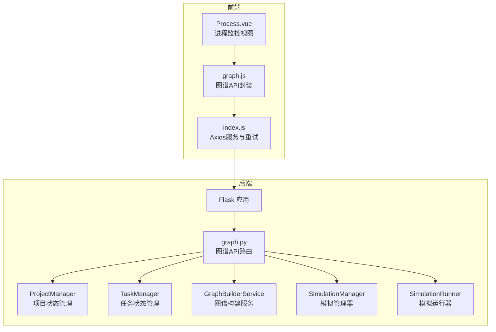
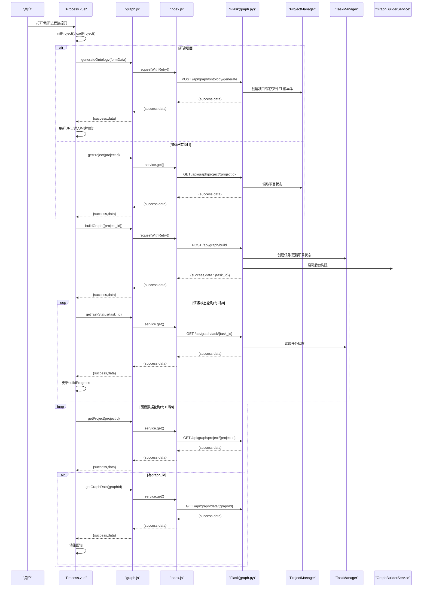
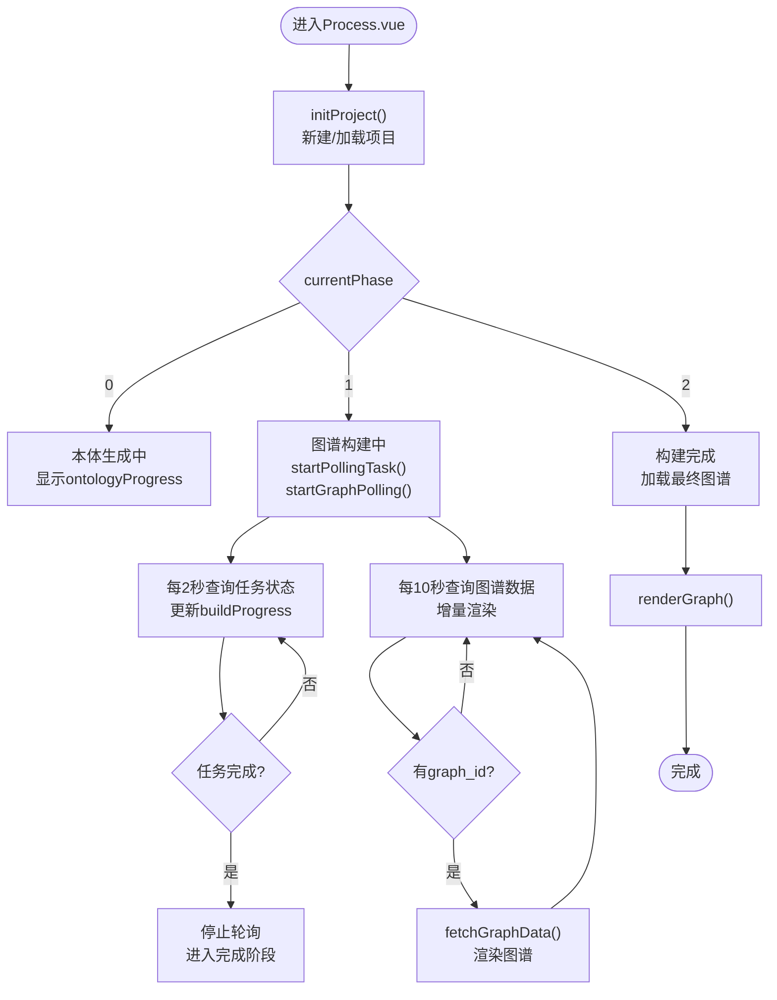
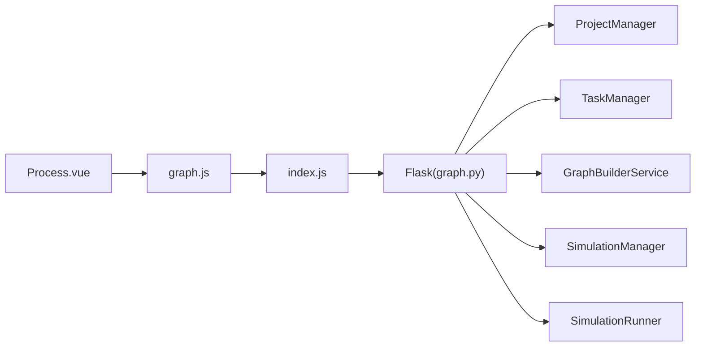

# 项目进程监控

<cite>
**本文档引用的文件**
- [Process.vue](file://frontend/src/views/Process.vue)
- [graph.js](file://frontend/src/api/graph.js)
- [index.js](file://frontend/src/api/index.js)
- [graph.py](file://backend/app/api/graph.py)
- [simulation_manager.py](file://backend/app/services/simulation_manager.py)
- [simulation_runner.py](file://backend/app/services/simulation_runner.py)
- [retry.py](file://backend/app/utils/retry.py)
- [README.md](file://README.md)
</cite>

## 目录
1. [简介](#简介)
2. [项目结构](#项目结构)
3. [核心组件](#核心组件)
4. [架构总览](#架构总览)
5. [详细组件分析](#详细组件分析)
6. [依赖关系分析](#依赖关系分析)
7. [性能考量](#性能考量)
8. [故障排查指南](#故障排查指南)
9. [结论](#结论)

## 简介
本文件面向MiroFish项目的“进程监控”页面，聚焦于Process.vue组件的实时状态监控能力，涵盖项目进度跟踪、任务状态显示、错误信息展示与用户反馈机制。文档同时阐述与后端API的通信方式、数据更新策略与实时通知功能，解释项目状态的生命周期管理、异常处理与重试机制，并提供监控界面的使用指南、调试技巧与性能优化建议。

## 项目结构
MiroFish采用前后端分离架构：
- 前端使用Vue 3 + Vite，负责用户界面与交互，通过Axios封装的API模块与后端通信。
- 后端使用Flask，提供图谱构建、任务状态查询、图谱数据获取等REST接口；服务层包含模拟管理器与运行器，负责复杂业务逻辑与后台任务调度。

图表来源
- [Process.vue](file://frontend/src/views/Process.vue#L1-L800)
- [graph.js](file://frontend/src/api/graph.js#L1-L71)
- [index.js](file://frontend/src/api/index.js#L1-L68)
- [graph.py](file://backend/app/api/graph.py#L1-L618)
- [simulation_manager.py](file://backend/app/services/simulation_manager.py#L1-L529)
- [simulation_runner.py](file://backend/app/services/simulation_runner.py#L1-L800)

章节来源
- [README.md](file://README.md#L81-L88)

## 核心组件
- Process.vue：进程监控视图，负责实时展示图谱构建进度、项目状态、图谱数据与交互细节。
- graph.js：前端API封装，提供本体生成、图谱构建、任务状态查询、图谱数据获取等方法。
- index.js：Axios服务与重试机制，统一处理请求/响应拦截与指数退避重试。
- graph.py：后端图谱API路由，负责项目管理、任务状态查询、图谱数据获取等。
- simulation_manager.py：模拟管理器，维护模拟状态与配置，支持准备阶段的并行与LLM增强。
- simulation_runner.py：模拟运行器，负责后台进程运行、日志解析与实时状态输出。

章节来源
- [Process.vue](file://frontend/src/views/Process.vue#L414-L808)
- [graph.js](file://frontend/src/api/graph.js#L1-L71)
- [index.js](file://frontend/src/api/index.js#L1-L68)
- [graph.py](file://backend/app/api/graph.py#L1-L618)
- [simulation_manager.py](file://backend/app/services/simulation_manager.py#L1-L529)
- [simulation_runner.py](file://backend/app/services/simulation_runner.py#L1-L800)

## 架构总览
进程监控页面的核心流程如下：
- 用户进入/加载项目：前端根据路由参数决定新建或加载已有项目。
- 新建项目：从前端store读取待上传文件与需求，调用本体生成接口，成功后自动进入图谱构建。
- 加载项目：根据项目状态决定是否自动启动构建或继续轮询任务。
- 图谱构建：启动构建任务，同时开启两个轮询：
  - 任务状态轮询：每2秒查询一次任务状态，更新进度与消息。
  - 图谱数据轮询：每10秒拉取一次图谱数据，增量渲染。
- 构建完成：停止轮询，加载最终图谱数据并渲染。

图表来源
- [Process.vue](file://frontend/src/views/Process.vue#L554-L808)
- [graph.js](file://frontend/src/api/graph.js#L1-L71)
- [index.js](file://frontend/src/api/index.js#L1-L68)
- [graph.py](file://backend/app/api/graph.py#L121-L524)

## 详细组件分析

### Process.vue：进程监控视图
- 状态管理
  - 项目状态：currentProjectId、currentPhase（-1:上传中, 0:本体生成中, 1:图谱构建中, 2:完成）
  - UI状态：loading、graphLoading、error
  - 数据：projectData、graphData、buildProgress、ontologyProgress
  - 交互：isFullScreen、selectedItem（节点/边详情）
- 生命周期与初始化
  - initProject：根据路由参数判断新建或加载，新建时从store读取待上传数据并调用本体生成接口。
  - loadProject：根据项目状态决定是否自动启动构建、轮询任务或加载图谱。
- 轮询策略
  - 任务状态轮询：startPollingTask，每2秒查询一次任务状态，更新进度与消息。
  - 图谱数据轮询：startGraphPolling，每10秒查询一次项目信息与图谱数据，增量渲染。
- 图谱渲染
  - fetchGraphData：先获取项目信息确认graph_id，再获取图谱数据，比较节点数量变化后触发渲染。
  - renderGraph：基于D3进行可视化渲染（在完整文件中实现）。
- 错误处理与用户反馈
  - 错误状态：error字段用于展示错误信息。
  - 状态指示：statusClass/statusText根据phase与error动态切换。
  - 详情面板：selectNode/selectEdge打开节点/边详情，closeDetailPanel关闭。
- 全屏与刷新
  - toggleFullScreen：切换全屏模式并重绘。
  - refreshGraph：手动刷新图谱数据。

图表来源
- [Process.vue](file://frontend/src/views/Process.vue#L554-L808)

章节来源
- [Process.vue](file://frontend/src/views/Process.vue#L414-L808)

### graph.js：前端API封装
- generateOntology：上传文件与需求，调用本体生成接口，使用requestWithRetry进行重试。
- buildGraph：提交构建请求，返回任务ID。
- getTaskStatus：查询任务状态（进度、消息、错误）。
- getGraphData：获取图谱数据（节点、边、统计信息）。
- getProject：获取项目信息（含graph_id、状态等）。

章节来源
- [graph.js](file://frontend/src/api/graph.js#L1-L71)

### index.js：Axios服务与重试机制
- baseURL：根据环境变量配置后端地址，默认http://localhost:5001。
- 超时：5分钟，适配本体生成等耗时任务。
- 响应拦截：统一校验success字段，失败时抛出错误。
- requestWithRetry：指数退避重试，支持幂等请求，避免重复副作用。

章节来源
- [index.js](file://frontend/src/api/index.js#L1-L68)

### graph.py：后端图谱API路由
- 项目管理：get_project、list_projects、delete_project、reset_project。
- 本体生成：generate_ontology，解析上传文件，调用OntologyGenerator生成本体，保存项目状态。
- 图谱构建：build_graph，创建异步任务，更新项目状态，启动后台线程构建，分块添加文本，等待Zep处理，获取图谱数据并更新项目状态。
- 任务查询：get_task、list_tasks。
- 图谱数据：get_graph_data、delete_graph。

章节来源
- [graph.py](file://backend/app/api/graph.py#L1-L618)

### simulation_manager.py：模拟管理器
- SimulationState：模拟状态数据类，包含状态、实体计数、配置生成信息、运行时数据等。
- SimulationManager：提供创建模拟、准备模拟（实体过滤、Profile生成、配置生成）、获取状态、列出模拟等方法。
- 并行与LLM增强：支持并行生成Profile、使用LLM增强配置生成。

章节来源
- [simulation_manager.py](file://backend/app/services/simulation_manager.py#L1-L529)

### simulation_runner.py：模拟运行器
- SimulationRunState：运行时状态，包含当前轮次、模拟小时、平台独立状态、最近动作列表等。
- SimulationRunner：启动模拟进程、监控日志、解析动作、更新状态、支持跨平台终止。
- 实时状态：提供run-status与run-status/detail接口，便于前端实时展示。

章节来源
- [simulation_runner.py](file://backend/app/services/simulation_runner.py#L1-L800)

## 依赖关系分析
- 前端依赖
  - Vue 3响应式与组合式API：ref/computed/onMounted/onUnmounted/watch。
  - D3.js：图谱可视化渲染。
  - Axios：HTTP请求与重试。
- 后端依赖
  - Flask：路由与请求处理。
  - 线程：后台任务执行。
  - Zep API：图谱创建与数据获取。
  - LLM：本体生成与配置生成。

图表来源
- [Process.vue](file://frontend/src/views/Process.vue#L414-L808)
- [graph.js](file://frontend/src/api/graph.js#L1-L71)
- [index.js](file://frontend/src/api/index.js#L1-L68)
- [graph.py](file://backend/app/api/graph.py#L1-L618)
- [simulation_manager.py](file://backend/app/services/simulation_manager.py#L1-L529)
- [simulation_runner.py](file://backend/app/services/simulation_runner.py#L1-L800)

## 性能考量
- 轮询频率权衡
  - 任务状态轮询：2秒一次，兼顾实时性与后端压力。
  - 图谱数据轮询：10秒一次，减少Zep API调用频次。
- 增量渲染
  - 仅在节点数量变化时触发渲染，降低前端重绘成本。
- 超时与重试
  - Axios超时5分钟，适配本体生成等长耗时任务。
  - requestWithRetry指数退避，避免雪崩效应。
- 后端线程池
  - 构建任务在后台线程执行，避免阻塞主线程。
- 图谱数据获取
  - 仅在有graph_id时拉取，避免无效请求。

[本节为通用性能指导，无需特定文件引用]

## 故障排查指南
- 常见错误与定位
  - 本体生成失败：检查上传文件格式、模拟需求参数、LLM配置。
  - 图谱构建失败：检查ZEP_API_KEY、网络连通性、任务状态与错误信息。
  - 任务状态轮询失败：检查任务ID有效性、后端日志。
  - 图谱数据为空：确认项目状态已进入graph_completed，graph_id已生成。
- 前端调试技巧
  - 查看控制台日志：graph.js与Process.vue中的console.log。
  - 检查轮询定时器：确保startPollingTask与startGraphPolling正确启动与停止。
  - 手动刷新：使用refreshGraph强制拉取最新数据。
- 后端调试技巧
  - 查看Flask日志：graph.py中的logger输出。
  - 检查任务状态：TaskManager与ProjectManager状态一致性。
  - 检查Zep API调用：GraphBuilderService的错误信息与重试策略。
- 重试机制
  - 前端：requestWithRetry，指数退避，最多3次重试。
  - 后端：retry_with_backoff装饰器，适用于外部API调用。

章节来源
- [index.js](file://frontend/src/api/index.js#L54-L65)
- [graph.py](file://backend/app/api/graph.py#L374-L508)
- [retry.py](file://backend/app/utils/retry.py#L15-L77)

## 结论
Process.vue通过双轮询策略实现了对图谱构建过程的实时监控：任务状态轮询提供进度与消息反馈，图谱数据轮询实现增量可视化。前后端配合Axios重试与后端指数退避重试，有效提升了系统的鲁棒性。项目状态生命周期清晰，异常处理与用户反馈机制完善，适合在复杂场景下稳定运行。建议在生产环境中进一步优化轮询频率与前端渲染策略，结合缓存与懒加载提升用户体验。