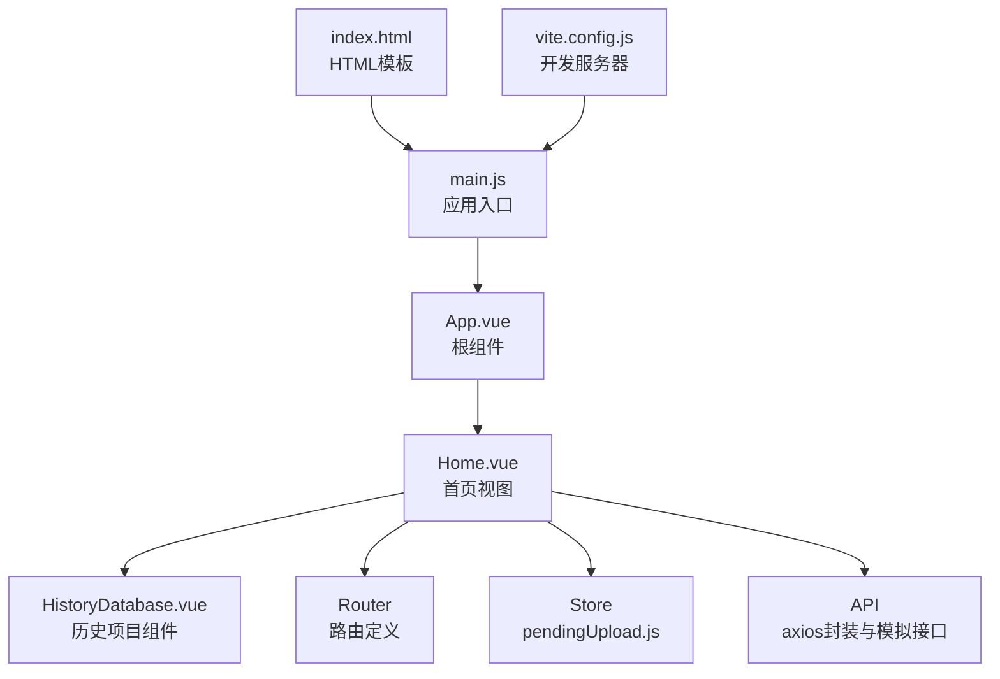
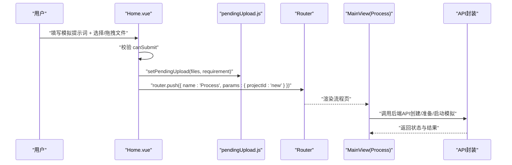
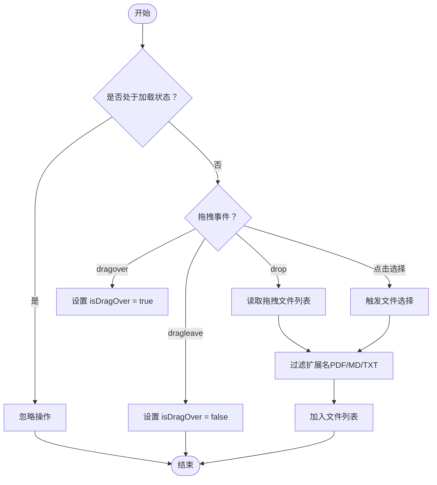
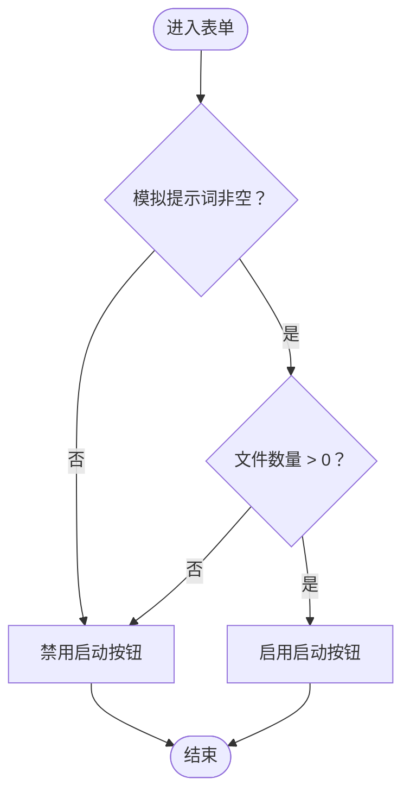
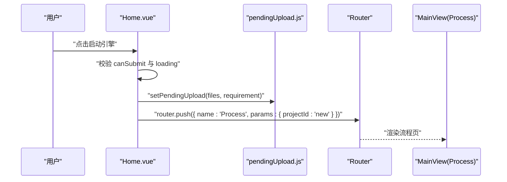
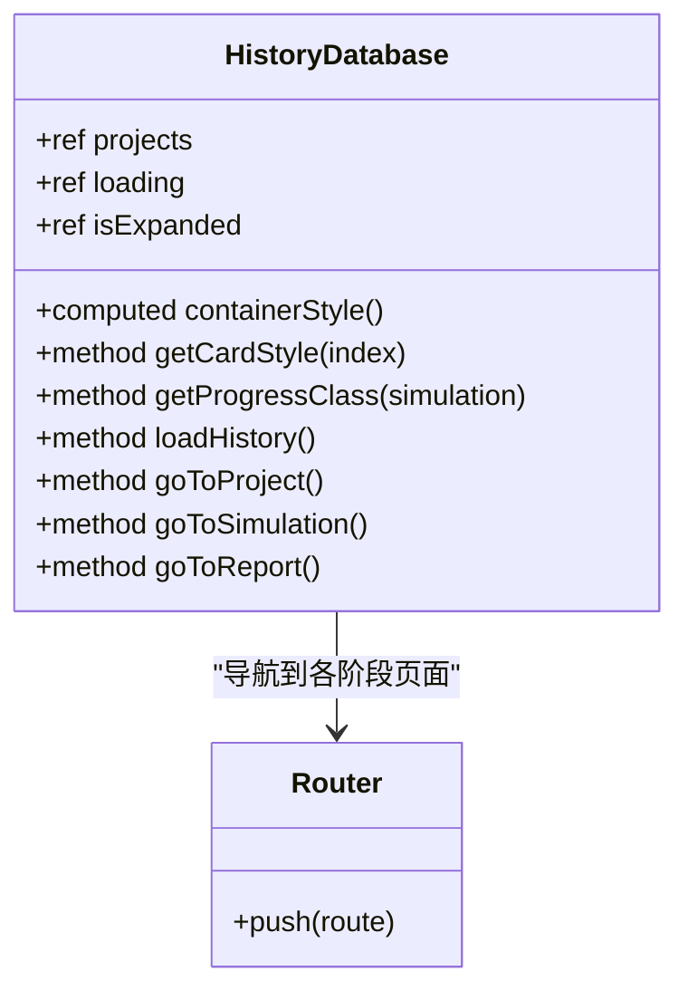
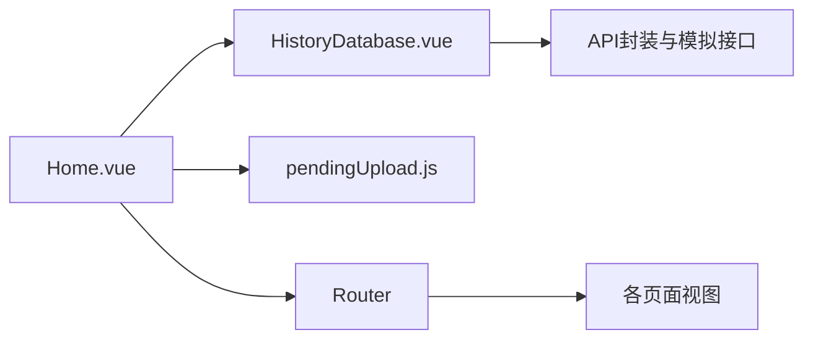

# 首页主页

<cite>
**本文档引用的文件**
- [Home.vue](file://frontend/src/views/Home.vue)
- [HistoryDatabase.vue](file://frontend/src/components/HistoryDatabase.vue)
- [index.js（路由）](file://frontend/src/router/index.js)
- [pendingUpload.js（状态）](file://frontend/src/store/pendingUpload.js)
- [main.js（入口）](file://frontend/src/main.js)
- [App.vue（根组件）](file://frontend/src/App.vue)
- [index.html（HTML模板）](file://frontend/index.html)
- [vite.config.js（开发服务器）](file://frontend/vite.config.js)
- [index.js（API封装）](file://frontend/src/api/index.js)
- [simulation.js（模拟API）](file://frontend/src/api/simulation.js)
</cite>

## 目录
1. [简介](#简介)
2. [项目结构](#项目结构)
3. [核心组件](#核心组件)
4. [架构概览](#架构概览)
5. [详细组件分析](#详细组件分析)
6. [依赖分析](#依赖分析)
7. [性能考虑](#性能考虑)
8. [故障排除指南](#故障排除指南)
9. [结论](#结论)
10. [附录](#附录)

## 简介
本文件为 MiroFish 首页主页（Home.vue）的详细技术文档，面向前端开发者与产品团队，系统阐述首页的设计理念、功能实现与交互流程。重点包括：
- 顶部导航栏与品牌展示
- Hero 区域的信息传达与视觉引导
- 双栏布局（左侧系统状态与工作流、右侧交互控制台）
- 文件上传区域的拖拽与选择机制
- 表单验证与项目创建工作流
- 响应式设计与样式系统
- 用户体验优化策略
- 组件使用示例、状态管理与路由跳转逻辑
- 性能优化建议与常见问题解决方案

## 项目结构
首页位于前端子项目中，采用 Vue 3 Composition API 与单文件组件（SFC）形式组织。整体结构如下：
- 视图层：Home.vue 为主入口，负责用户交互与页面编排
- 组件层：HistoryDatabase.vue 提供历史项目展示与回放能力
- 路由层：Vue Router 定义页面路由与参数传递
- 状态层：pendingUpload.js 提供跨页面的临时状态存储
- API 层：统一的 axios 封装与模拟相关接口
- 构建层：Vite 开发服务器与代理配置

**图表来源**
- [Home.vue](file://frontend/src/views/Home.vue#L1-L207)
- [HistoryDatabase.vue](file://frontend/src/components/HistoryDatabase.vue#L1-L191)
- [index.js（路由）](file://frontend/src/router/index.js#L1-L53)
- [pendingUpload.js（状态）](file://frontend/src/store/pendingUpload.js#L1-L34)
- [main.js（入口）](file://frontend/src/main.js#L1-L10)
- [App.vue（根组件）](file://frontend/src/App.vue#L1-L48)
- [index.html（HTML模板）](file://frontend/index.html#L1-L18)
- [vite.config.js（开发服务器）](file://frontend/vite.config.js#L1-L19)

**章节来源**
- [Home.vue](file://frontend/src/views/Home.vue#L1-L207)
- [index.js（路由）](file://frontend/src/router/index.js#L1-L53)
- [pendingUpload.js（状态）](file://frontend/src/store/pendingUpload.js#L1-L34)
- [main.js（入口）](file://frontend/src/main.js#L1-L10)
- [App.vue（根组件）](file://frontend/src/App.vue#L1-L48)
- [index.html（HTML模板）](file://frontend/index.html#L1-L18)
- [vite.config.js（开发服务器）](file://frontend/vite.config.js#L1-L19)

## 核心组件
- Home.vue：首页主组件，包含导航栏、Hero 区域、双栏布局与交互控制台；负责文件上传、表单验证与路由跳转
- HistoryDatabase.vue：历史项目数据库组件，提供卡片式展示、展开/折叠动画、模态详情与路由跳转
- pendingUpload.js：轻量状态存储，用于首页提交后跨页面传递文件与需求
- 路由配置：定义首页、流程页、模拟页、报告页、交互页等路由与参数传递

关键特性
- 双栏布局：左侧系统状态与工作流，右侧交互控制台
- 文件上传：支持拖拽与点击选择，多文件过滤与移除
- 表单验证：基于输入内容与文件数量的可提交状态
- 路由跳转：首页提交后立即跳转到流程页，参数携带新建项目标识

**章节来源**
- [Home.vue](file://frontend/src/views/Home.vue#L1-L207)
- [HistoryDatabase.vue](file://frontend/src/components/HistoryDatabase.vue#L1-L191)
- [pendingUpload.js（状态）](file://frontend/src/store/pendingUpload.js#L1-L34)
- [index.js（路由）](file://frontend/src/router/index.js#L1-L53)

## 架构概览
首页的整体交互流程如下：

**图表来源**
- [Home.vue](file://frontend/src/views/Home.vue#L291-L305)
- [pendingUpload.js（状态）](file://frontend/src/store/pendingUpload.js#L13-L17)
- [index.js（路由）](file://frontend/src/router/index.js#L15-L20)
- [index.js（API封装）](file://frontend/src/api/index.js#L1-L68)
- [simulation.js（模拟API）](file://frontend/src/api/simulation.js#L1-L188)

## 详细组件分析

### 顶部导航栏
- 品牌展示：黑色背景配白色文字的品牌名称
- 导航链接：指向项目 GitHub 主页的外链，带箭头图标与悬停效果
- 响应式适配：在小屏设备上仍保持清晰对比度与可点击性

交互要点
- 链接使用新窗口打开，避免打断用户在首页的操作
- 悬停透明度变化，提供即时反馈

**章节来源**
- [Home.vue](file://frontend/src/views/Home.vue#L4-L11)
- [App.vue（根组件）](file://frontend/src/App.vue#L9-L47)

### Hero 区域
- 标签与版本：简洁标签与版本号组合，突出产品定位
- 标题与渐变：强调“上传报告 → 即刻推演未来”的核心价值主张
- 描述文案：突出“低成本、高可用、百万级 Agent”等关键卖点
- 装饰元素：对角方块与光标闪烁动画，增强科技感与引导性
- 右侧布局：Logo 展示与向下滚动按钮，提升信息密度与交互引导

设计细节
- 字体系统：标题使用 Space Grotesk，代码/标签使用 JetBrains Mono，正文使用 Noto Sans SC
- 动画：光标闪烁与按钮脉冲边框，营造“引擎待启动”的氛围

**章节来源**
- [Home.vue](file://frontend/src/views/Home.vue#L14-L49)
- [index.html（HTML模板）](file://frontend/index.html#L4-L6)

### 左侧面板：系统状态与工作流
- 系统状态：状态指示点与“准备就绪”提示
- 数据指标：低成本与高可用两个关键指标卡片
- 工作流序列：五步法可视化（图谱构建、环境搭建、开始模拟、报告生成、深度互动），每步含编号与简述

交互与可访问性
- 步骤编号与图标结合，便于用户理解流程顺序
- 文案简洁明确，避免技术术语堆砌

**章节来源**
- [Home.vue](file://frontend/src/views/Home.vue#L52-L118)

### 右侧面板：交互控制台
- 上传区域：支持拖拽与点击选择，多文件过滤（PDF、MD、TXT），文件列表与移除按钮
- 输入区域：代码风格的多行文本框，占位符提示与模型标识徽章
- 启动按钮：禁用态与可点击态的视觉差异，带脉冲动画与箭头图标

表单验证与状态
- canSubmit 计算属性：要求模拟提示词非空且至少有一个有效文件
- loading 状态：在提交过程中禁用交互，防止重复提交
- isDragOver 状态：拖拽悬停时的视觉反馈

**章节来源**
- [Home.vue](file://frontend/src/views/Home.vue#L121-L200)
- [Home.vue](file://frontend/src/views/Home.vue#L232-L235)
- [Home.vue](file://frontend/src/views/Home.vue#L250-L281)

### 文件上传与拖拽实现
- 拖拽事件：dragover/dragleave/drop，控制 isDragOver 状态与文件添加
- 选择事件：隐藏的文件输入框，支持多选与类型过滤
- 文件处理：addFiles 过滤扩展名，removeFile 支持逐项移除
- 状态控制：loading 期间禁用交互，保证流程一致性

**图表来源**
- [Home.vue](file://frontend/src/views/Home.vue#L250-L281)
- [Home.vue](file://frontend/src/views/Home.vue#L269-L276)

**章节来源**
- [Home.vue](file://frontend/src/views/Home.vue#L131-L162)
- [Home.vue](file://frontend/src/views/Home.vue#L238-L281)

### 表单验证机制
- canSubmit：基于模拟提示词非空与文件数量大于零
- disabled 状态：按钮与输入框在 loading 或不可提交时禁用
- 用户反馈：禁用态颜色与指针样式变化，避免误操作

**图表来源**
- [Home.vue](file://frontend/src/views/Home.vue#L232-L235)

**章节来源**
- [Home.vue](file://frontend/src/views/Home.vue#L232-L235)

### 项目创建工作流
- 提交前校验：canSubmit 与 loading 状态
- 状态存储：setPendingUpload 将文件与需求写入全局状态
- 路由跳转：立即跳转到流程页，params 中携带新建项目标识
- 流程页处理：在流程页发起后端 API 调用，完成项目初始化与模拟准备

**图表来源**
- [Home.vue](file://frontend/src/views/Home.vue#L291-L305)
- [pendingUpload.js（状态）](file://frontend/src/store/pendingUpload.js#L13-L17)
- [index.js（路由）](file://frontend/src/router/index.js#L15-L20)

**章节来源**
- [Home.vue](file://frontend/src/views/Home.vue#L291-L305)
- [pendingUpload.js（状态）](file://frontend/src/store/pendingUpload.js#L13-L17)
- [index.js（路由）](file://frontend/src/router/index.js#L15-L20)

### 历史项目数据库（HistoryDatabase.vue）
- 展示方式：折叠态扇形堆叠、展开态网格布局，配合 IntersectionObserver 控制展开/收起
- 交互细节：鼠标悬停放大、点击进入详情弹窗；弹窗内提供导航到各阶段页面的能力
- 数据加载：通过 API 获取历史模拟列表，支持按项目过滤与分页
- 动画与性能：使用防抖与动画锁，避免频繁切换导致的闪烁与性能损耗

**图表来源**
- [HistoryDatabase.vue](file://frontend/src/components/HistoryDatabase.vue#L193-L569)
- [index.js（路由）](file://frontend/src/router/index.js#L15-L44)

**章节来源**
- [HistoryDatabase.vue](file://frontend/src/components/HistoryDatabase.vue#L1-L191)
- [HistoryDatabase.vue](file://frontend/src/components/HistoryDatabase.vue#L437-L569)

### 响应式设计与样式系统
- 断点适配：在 1024px 以下将双栏布局改为垂直堆叠，Hero 区域也调整为纵向排列
- 字体系统：标题使用 Space Grotesk，代码/标签使用 JetBrains Mono，正文使用 Noto Sans SC
- 主题变量：通过 CSS 变量统一管理黑、白、橙、灰等色彩，确保视觉一致性
- 动画与过渡：按钮脉冲边框、卡片悬停阴影、展开/收起的缓动曲线，提升交互质感

**章节来源**
- [Home.vue](file://frontend/src/views/Home.vue#L865-L884)
- [Home.vue](file://frontend/src/views/Home.vue#L308-L324)
- [index.html（HTML模板）](file://frontend/index.html#L4-L6)

## 依赖分析
- 组件耦合
  - Home.vue 依赖 HistoryDatabase.vue、pendingUpload.js 与路由模块
  - HistoryDatabase.vue 依赖路由与模拟 API，内部维护复杂的状态与动画
- 外部依赖
  - Vue 3、Vue Router、axios
  - Vite 开发服务器与代理配置
- 数据流
  - 首页通过状态存储传递数据到流程页
  - 历史数据库通过 API 获取数据并在组件内渲染

**图表来源**
- [Home.vue](file://frontend/src/views/Home.vue#L210-L212)
- [HistoryDatabase.vue](file://frontend/src/components/HistoryDatabase.vue#L194-L196)
- [index.js（路由）](file://frontend/src/router/index.js#L1-L53)
- [index.js（API封装）](file://frontend/src/api/index.js#L1-L68)

**章节来源**
- [Home.vue](file://frontend/src/views/Home.vue#L210-L212)
- [HistoryDatabase.vue](file://frontend/src/components/HistoryDatabase.vue#L194-L196)
- [index.js（路由）](file://frontend/src/router/index.js#L1-L53)
- [index.js（API封装）](file://frontend/src/api/index.js#L1-L68)

## 性能考虑
- 首屏渲染
  - 使用 scoped 样式减少全局污染，避免不必要的重绘
  - Hero 区域与历史数据库采用相对定位与绝对定位，降低布局抖动
- 交互性能
  - 文件上传区域使用防抖与动画锁，避免频繁切换导致的卡顿
  - 卡片展开/收起使用缓动曲线与 transform，优先使用 GPU 加速
- 网络性能
  - API 封装内置重试机制，提高弱网环境下的成功率
  - 开发服务器代理配置减少跨域与调试成本
- 资源优化
  - 字体资源通过 preconnect 与 CDN 加速加载
  - 滚动条样式统一，减少浏览器默认样式的差异带来的重排

[本节为通用性能指导，无需特定文件引用]

## 故障排除指南
- 无法拖拽上传
  - 检查 loading 状态是否被意外置为 true
  - 确认文件扩展名是否为 PDF/MD/TXT
  - 验证 dragover/dragleave/drop 事件绑定是否生效
- 启动按钮不可用
  - 确认模拟提示词非空且已选择至少一个有效文件
  - 检查 canSubmit 计算属性与 disabled 状态
- 路由跳转异常
  - 确认路由配置中 Process 页面的 name 与 params 是否正确
  - 检查 pendingUpload 状态是否成功写入
- 历史项目不显示
  - 检查 API 返回格式与 success 字段
  - 确认 IntersectionObserver 初始化与清理逻辑
- 开发服务器无法访问后端
  - 检查 vite 代理配置与后端服务端口
  - 确认 CORS 与跨域设置

**章节来源**
- [Home.vue](file://frontend/src/views/Home.vue#L250-L305)
- [HistoryDatabase.vue](file://frontend/src/components/HistoryDatabase.vue#L437-L569)
- [index.js（API封装）](file://frontend/src/api/index.js#L12-L51)
- [vite.config.js（开发服务器）](file://frontend/vite.config.js#L7-L17)

## 结论
首页 Home.vue 以清晰的信息层级与流畅的交互体验为核心目标，结合双栏布局与控制台设计，为用户提供从“现实种子”到“模拟推演”的完整入口。通过合理的状态管理与路由设计，实现了从首页到流程页的无缝衔接；配合历史数据库组件与响应式样式体系，进一步提升了产品的可用性与专业感。

[本节为总结性内容，无需特定文件引用]

## 附录

### 组件使用示例
- 在首页中，用户填写模拟提示词并选择/拖拽文件后，点击“启动引擎”按钮即可跳转到流程页
- 在流程页中，系统将使用 pendingUpload.js 中存储的文件与需求发起后端 API 调用
- 历史数据库组件可在首页底部展示历史项目卡片，支持查看详情与跳转到对应阶段页面

**章节来源**
- [Home.vue](file://frontend/src/views/Home.vue#L291-L305)
- [pendingUpload.js（状态）](file://frontend/src/store/pendingUpload.js#L13-L17)
- [HistoryDatabase.vue](file://frontend/src/components/HistoryDatabase.vue#L394-L435)

### 状态管理与路由跳转逻辑
- 状态存储：pendingUpload.js 提供 set/get/clear 方法，用于在首页提交后跨页面传递数据
- 路由配置：Process 页面支持动态参数 projectId，首页提交时传入 'new' 标识新建项目
- API 调用：流程页负责实际的后端请求，首页仅负责数据传递与路由跳转

**章节来源**
- [pendingUpload.js（状态）](file://frontend/src/store/pendingUpload.js#L13-L31)
- [index.js（路由）](file://frontend/src/router/index.js#L15-L20)
- [index.js（API封装）](file://frontend/src/api/index.js#L53-L65)