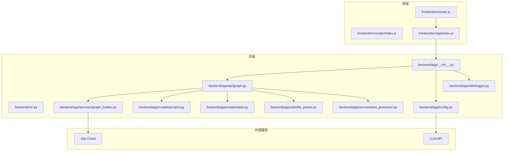
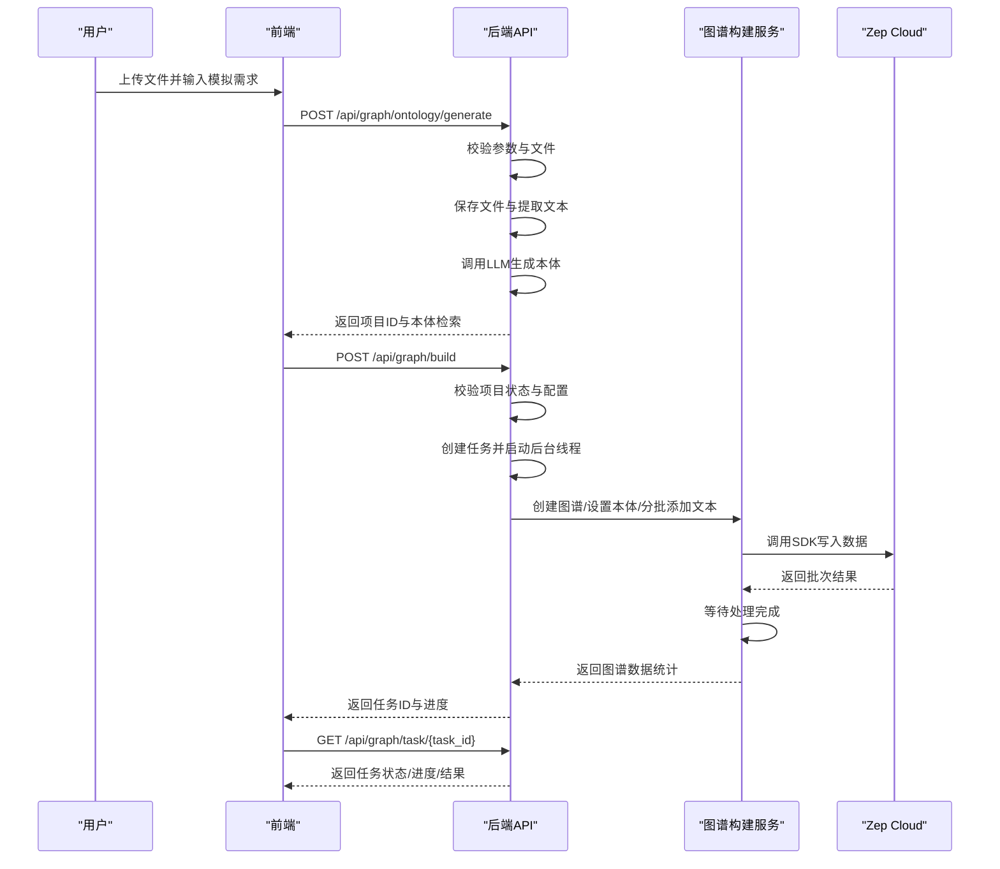
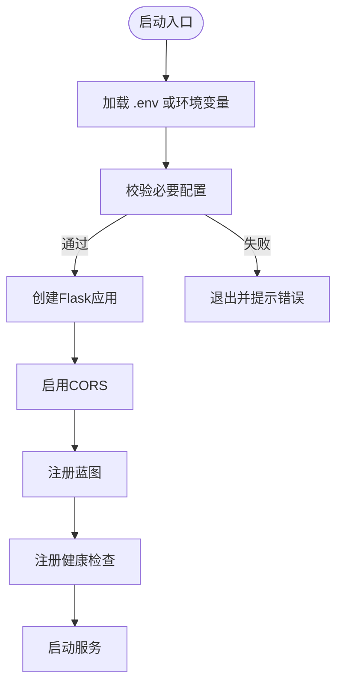
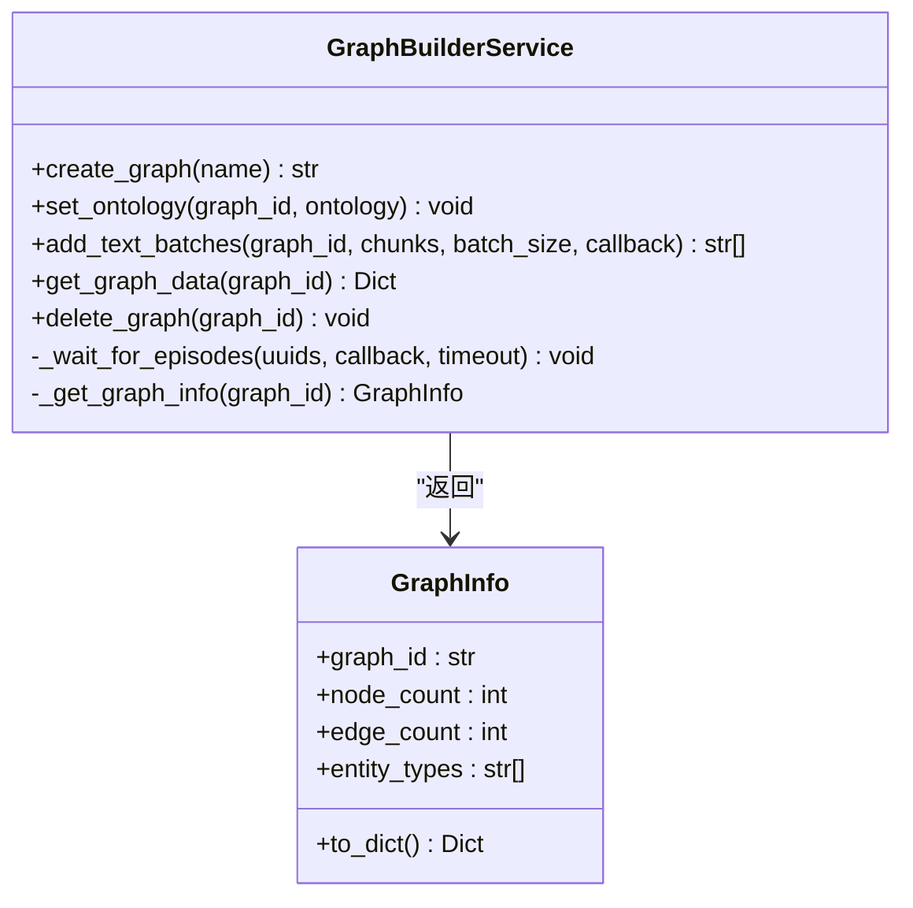
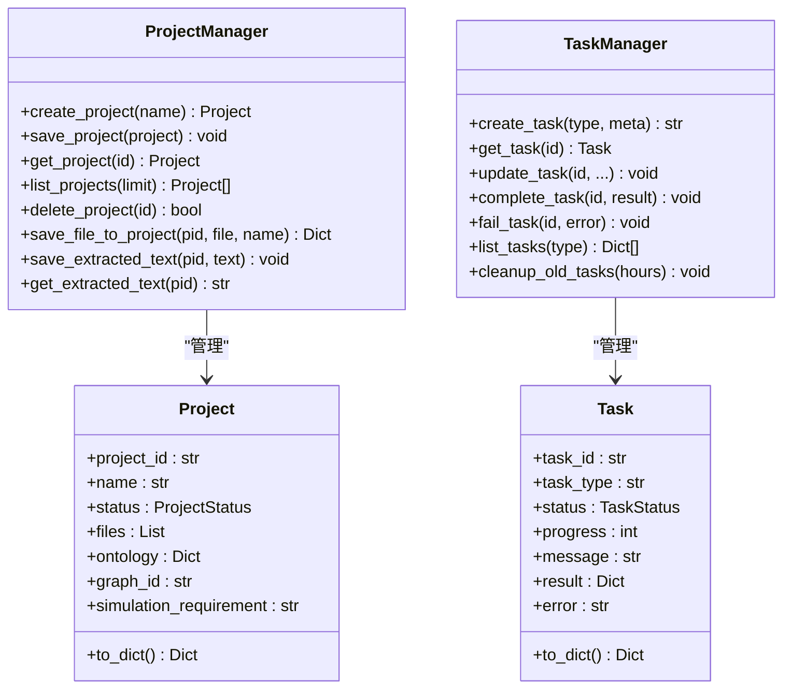
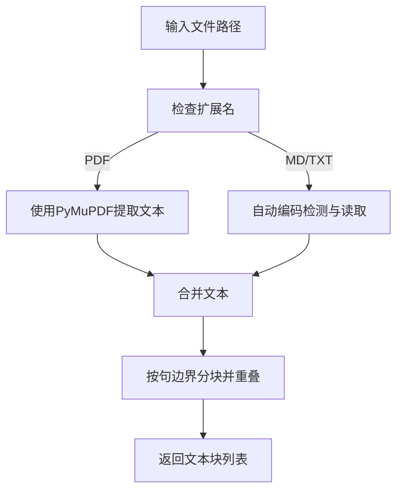
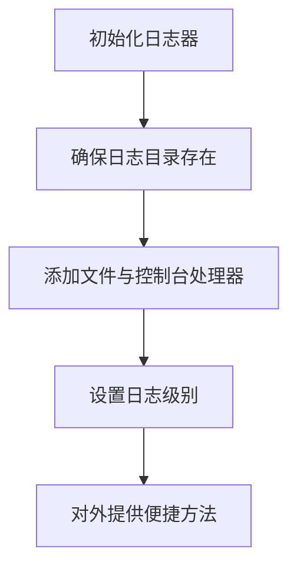
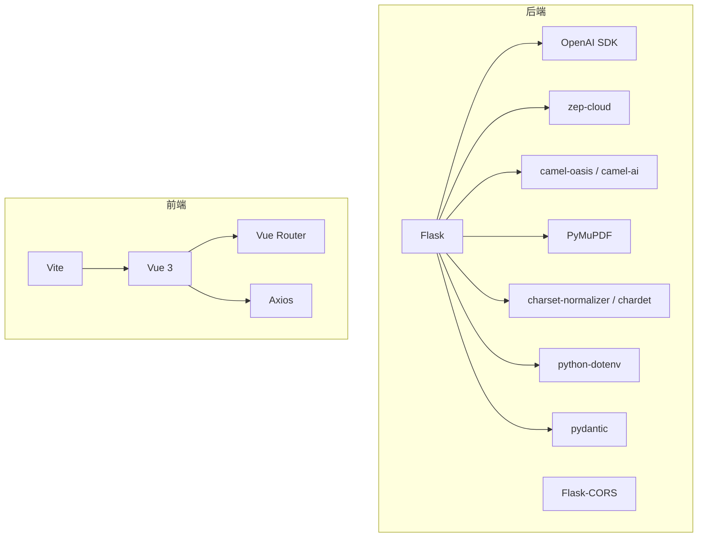

# 开发指南

<cite>
**本文引用的文件**
- [README.md](file://README.md)
- [docker-compose.yml](file://docker-compose.yml)
- [backend/run.py](file://backend/run.py)
- [backend/app/__init__.py](file://backend/app/__init__.py)
- [backend/app/config.py](file://backend/app/config.py)
- [backend/app/api/graph.py](file://backend/app/api/graph.py)
- [backend/app/services/graph_builder.py](file://backend/app/services/graph_builder.py)
- [backend/app/utils/logger.py](file://backend/app/utils/logger.py)
- [backend/app/models/project.py](file://backend/app/models/project.py)
- [backend/app/models/task.py](file://backend/app/models/task.py)
- [backend/app/utils/file_parser.py](file://backend/app/utils/file_parser.py)
- [backend/app/services/text_processor.py](file://backend/app/services/text_processor.py)
- [backend/pyproject.toml](file://backend/pyproject.toml)
- [frontend/package.json](file://frontend/package.json)
- [frontend/package-lock.json](file://frontend/package-lock.json)
- [frontend/src/main.js](file://frontend/src/main.js)
- [package.json](file://package.json)
- [package-lock.json](file://package-lock.json)
</cite>

## 目录
1. [简介](#简介)
2. [项目结构](#项目结构)
3. [核心组件](#核心组件)
4. [架构总览](#架构总览)
5. [详细组件分析](#详细组件分析)
6. [依赖分析](#依赖分析)
7. [性能考虑](#性能考虑)
8. [故障排查指南](#故障排查指南)
9. [结论](#结论)
10. [附录](#附录)

## 简介
本指南面向新加入的开发者，提供 MiroFish 项目的开发环境搭建、代码规范与最佳实践、目录结构与模块划分、编码约定、测试策略、代码审查流程、质量保证措施、贡献指南、分支管理与发布流程、插件系统与扩展机制、第三方集成方法、调试技巧、性能分析与优化建议，以及完整的入职参考。

## 项目结构
MiroFish 采用前后端分离架构：
- 后端：基于 Flask 的 Python 应用，提供图谱构建、任务调度、报告生成等能力，并通过 Zep Cloud 构建知识图谱。
- 前端：基于 Vue 3 + Vite 的单页应用，负责用户交互与可视化展示。
- 配置与部署：通过 .env 管理环境变量，支持 Docker Compose 一键部署。

**图表来源**
- [backend/run.py](file://backend/run.py#L25-L46)
- [backend/app/__init__.py](file://backend/app/__init__.py#L19-L79)
- [backend/app/api/graph.py](file://backend/app/api/graph.py#L1-L618)
- [backend/app/services/graph_builder.py](file://backend/app/services/graph_builder.py#L38-L499)
- [backend/app/config.py](file://backend/app/config.py#L20-L76)
- [backend/app/utils/logger.py](file://backend/app/utils/logger.py#L30-L88)
- [backend/app/models/project.py](file://backend/app/models/project.py#L101-L306)
- [backend/app/models/task.py](file://backend/app/models/task.py#L54-L185)
- [backend/app/utils/file_parser.py](file://backend/app/utils/file_parser.py#L61-L190)
- [backend/app/services/text_processor.py](file://backend/app/services/text_processor.py#L9-L72)
- [frontend/src/main.js](file://frontend/src/main.js#L1-L10)

**章节来源**
- [README.md](file://README.md#L81-L173)
- [backend/run.py](file://backend/run.py#L1-L51)
- [backend/app/__init__.py](file://backend/app/__init__.py#L1-L81)
- [backend/app/config.py](file://backend/app/config.py#L1-L76)
- [backend/app/api/graph.py](file://backend/app/api/graph.py#L1-L618)
- [backend/app/services/graph_builder.py](file://backend/app/services/graph_builder.py#L1-L500)
- [backend/app/utils/logger.py](file://backend/app/utils/logger.py#L1-L127)
- [backend/app/models/project.py](file://backend/app/models/project.py#L1-L306)
- [backend/app/models/task.py](file://backend/app/models/task.py#L1-L185)
- [backend/app/utils/file_parser.py](file://backend/app/utils/file_parser.py#L1-L190)
- [backend/app/services/text_processor.py](file://backend/app/services/text_processor.py#L1-L72)
- [frontend/src/main.js](file://frontend/src/main.js#L1-L10)

## 核心组件
- 配置中心：集中管理 LLM、Zep、文件上传、OASIS 模拟等配置项，并提供校验。
- 应用工厂：创建 Flask 应用，启用 CORS、注册蓝图、健康检查、请求/响应日志。
- 图谱构建服务：封装 Zep SDK，负责创建图谱、设置本体、分批添加文本、等待处理完成、获取图谱数据。
- 项目与任务模型：在服务端持久化项目状态与任务进度，支持并发安全。
- 文件解析与文本处理：支持 PDF/Markdown/TXT 多格式解析与分块，自动编码检测。
- 日志系统：统一输出到控制台与滚动文件，解决 Windows 中文乱码问题。
- 前端入口：Vue 应用挂载与路由初始化。

**章节来源**
- [backend/app/config.py](file://backend/app/config.py#L20-L76)
- [backend/app/__init__.py](file://backend/app/__init__.py#L19-L79)
- [backend/app/services/graph_builder.py](file://backend/app/services/graph_builder.py#L38-L499)
- [backend/app/models/project.py](file://backend/app/models/project.py#L101-L306)
- [backend/app/models/task.py](file://backend/app/models/task.py#L54-L185)
- [backend/app/utils/file_parser.py](file://backend/app/utils/file_parser.py#L61-L190)
- [backend/app/services/text_processor.py](file://backend/app/services/text_processor.py#L9-L72)
- [backend/app/utils/logger.py](file://backend/app/utils/logger.py#L30-L88)
- [frontend/src/main.js](file://frontend/src/main.js#L1-L10)

## 架构总览
后端通过 Flask 提供 REST API，前端通过 axios 调用后端接口。图谱构建流程分为"本体生成"和"图谱构建"两阶段，分别对应两个 API 流程；任务状态通过内存中的任务管理器进行跟踪。

**图表来源**
- [backend/app/api/graph.py](file://backend/app/api/graph.py#L121-L524)
- [backend/app/services/graph_builder.py](file://backend/app/services/graph_builder.py#L95-L185)
- [backend/app/models/task.py](file://backend/app/models/task.py#L73-L171)

**章节来源**
- [backend/app/api/graph.py](file://backend/app/api/graph.py#L121-L524)
- [backend/app/services/graph_builder.py](file://backend/app/services/graph_builder.py#L95-L185)
- [backend/app/models/task.py](file://backend/app/models/task.py#L73-L171)

## 详细组件分析

### 配置与启动
- 启动入口：后端通过 run.py 校验配置并创建应用，支持主机、端口与调试模式配置。
- 应用工厂：启用 CORS、注册蓝图、健康检查、请求/响应日志；注册模拟进程清理钩子。
- 配置中心：集中读取 .env 或环境变量，提供 LLM/Zep/OASIS/文件上传等配置与校验。

**图表来源**
- [backend/run.py](file://backend/run.py#L25-L46)
- [backend/app/__init__.py](file://backend/app/__init__.py#L19-L79)
- [backend/app/config.py](file://backend/app/config.py#L66-L76)

**章节来源**
- [backend/run.py](file://backend/run.py#L1-L51)
- [backend/app/__init__.py](file://backend/app/__init__.py#L1-L81)
- [backend/app/config.py](file://backend/app/config.py#L1-L76)

### 图谱构建服务
- 职责：封装 Zep SDK，负责创建图谱、设置本体、分批添加文本、等待处理完成、获取图谱数据。
- 本体设置：动态构造实体与边类型，兼容 Zep 的字段约束与保留名。
- 批量处理：分批发送文本，回调推进进度；轮询检查处理状态。
- 数据获取：返回节点、边、时间戳与属性等完整信息。

**图表来源**
- [backend/app/services/graph_builder.py](file://backend/app/services/graph_builder.py#L38-L499)

**章节来源**
- [backend/app/services/graph_builder.py](file://backend/app/services/graph_builder.py#L1-L500)

### 项目与任务模型
- 项目模型：记录项目元数据、文件、本体、图谱ID、状态与错误信息；提供持久化与检索。
- 任务模型：线程安全的任务状态管理，支持进度、消息、结果与错误记录；提供清理过期任务能力。

**图表来源**
- [backend/app/models/project.py](file://backend/app/models/project.py#L26-L306)
- [backend/app/models/task.py](file://backend/app/models/task.py#L22-L185)

**章节来源**
- [backend/app/models/project.py](file://backend/app/models/project.py#L1-L306)
- [backend/app/models/task.py](file://backend/app/models/task.py#L1-L185)

### 文件解析与文本处理
- 文件解析：支持 PDF/Markdown/TXT，自动编码检测与回退策略，统一输出文本。
- 文本处理：标准化换行、去除多余空白、按句号/换行等边界分块，支持重叠。

**图表来源**
- [backend/app/utils/file_parser.py](file://backend/app/utils/file_parser.py#L61-L190)
- [backend/app/services/text_processor.py](file://backend/app/services/text_processor.py#L18-L34)

**章节来源**
- [backend/app/utils/file_parser.py](file://backend/app/utils/file_parser.py#L1-L190)
- [backend/app/services/text_processor.py](file://backend/app/services/text_processor.py#L1-L72)

### 日志系统
- 统一日志：控制台与文件双通道，文件按天轮转，避免中文乱码。
- 应用集成：在应用工厂中设置 JSON 编码、请求/响应日志、启动日志。

**图表来源**
- [backend/app/utils/logger.py](file://backend/app/utils/logger.py#L30-L88)

**章节来源**
- [backend/app/utils/logger.py](file://backend/app/utils/logger.py#L1-L127)
- [backend/app/__init__.py](file://backend/app/__init__.py#L51-L63)

### 前端入口与路由
- 入口：创建 Vue 应用并挂载。
- 路由：在 main.js 中注册路由，配合 views/components 实现页面导航。

**章节来源**
- [frontend/src/main.js](file://frontend/src/main.js#L1-L10)

## 依赖分析
- 后端依赖：Flask、Flask-CORS、OpenAI SDK、zep-cloud、camel-oasis、PyMuPDF、charset-normalizer、chardet、python-dotenv、pydantic 等。
- 前端依赖：Vue 3、Vue Router、Axios、Vite、@vitejs/plugin-vue。
- 开发依赖：pytest、pytest-asyncio、pipreqs 等（可选）。

**图表来源**
- [backend/pyproject.toml](file://backend/pyproject.toml#L11-L35)
- [frontend/package.json](file://frontend/package.json#L11-L20)

**章节来源**
- [backend/pyproject.toml](file://backend/pyproject.toml#L1-L56)
- [frontend/package.json](file://frontend/package.json#L1-L22)

### 前端依赖管理改进

**更新** 本节反映了前端依赖管理的重大改进，解决了 peerDependencies 标志修正带来的依赖解析问题。

#### 依赖解析改进
- **peerDependencies 修正**：package-lock.json 中的 peerDependencies 标志已修正，确保包安装符合真实的依赖关系而非误导性的 peer 约束。
- **依赖树稳定性**：修正后的依赖解析确保所有依赖项正确安装，避免因 peer 约束导致的循环依赖问题。
- **版本兼容性**：Vue 3.5.24 与 Vite 7.2.4 的组合经过验证，确保开发和构建过程的稳定性。

#### 具体改进内容
- **@vue/server-renderer**：修正了 peerDependencies 对 vue 的约束，确保与实际安装的 Vue 版本匹配。
- **@vitejs/plugin-vue**：更新了与 Vite 的 peerDependencies 关系，避免版本冲突。
- **d3 生态系统**：修正了 d3-* 包之间的 peerDependencies，确保可视化组件的正确加载。
- **开发工具链**：esbuild 和相关工具的 peerDependencies 已调整，提高构建性能。

**图表来源**
- [frontend/package-lock.json](file://frontend/package-lock.json#L848-L852)
- [frontend/package-lock.json](file://frontend/package-lock.json#L949-L952)
- [frontend/package-lock.json](file://frontend/package-lock.json#L1397-L1400)
- [frontend/package.json](file://frontend/package.json#L11-L20)

**章节来源**
- [frontend/package.json](file://frontend/package.json#L1-L22)
- [frontend/package-lock.json](file://frontend/package-lock.json#L1-L2051)
- [package.json](file://package.json#L1-L22)
- [package-lock.json](file://package-lock.json#L1-L334)

## 性能考虑
- 文本分块与重叠：合理设置 chunk_size 与 chunk_overlap，平衡吞吐与语义完整性。
- 批量写入：分批发送文本并设置延迟，避免请求过快导致限流。
- 进度回调：在批量与等待阶段推进进度，提升用户体验。
- 日志级别：生产环境降低控制台日志级别，减少 I/O 压力。
- 并发与清理：使用线程锁保证任务状态一致性；定期清理过期任务。

## 故障排查指南
- 配置错误：启动前校验 LLM_API_KEY、ZEP_API_KEY，若缺失则退出并提示。
- 文件格式：确保上传 PDF/MD/TXT，否则返回错误。
- 任务失败：在任务失败时记录错误堆栈并更新状态；前端轮询任务接口获取最新状态。
- 日志定位：查看 logs 目录下按日期命名的文件，结合控制台简洁日志快速定位问题。
- **依赖问题**：如遇依赖安装失败，检查 package-lock.json 中的 peerDependencies 修正是否生效，确保版本兼容性。

**章节来源**
- [backend/app/config.py](file://backend/app/config.py#L66-L76)
- [backend/app/api/graph.py](file://backend/app/api/graph.py#L166-L173)
- [backend/app/models/task.py](file://backend/app/models/task.py#L155-L162)
- [backend/app/utils/logger.py](file://backend/app/utils/logger.py#L66-L88)

## 结论
本指南提供了 MiroFish 项目的开发环境搭建、模块划分、编码约定、测试与质量保障、贡献与发布流程、插件与扩展机制、调试与性能优化的完整参考。建议新开发者从"快速开始"入手，逐步熟悉"核心组件"与"详细组件分析"，并在实践中遵循"性能考虑"与"故障排查指南"。

## 附录

### 开发环境搭建
- 前置要求：Node.js 18+、Python 3.11–3.12、uv。
- 环境变量：复制 .env.example 为 .env，填写 LLM 与 Zep 凭据。
- 一键安装：根目录执行安装脚本；或分别安装前端与后端依赖。
- 启动服务：同时启动或分别启动前后端；Docker 部署亦可。

**章节来源**
- [README.md](file://README.md#L91-L173)

### 目录结构与职责
- backend：后端应用、API、服务、模型、工具与配置。
- frontend：前端应用、路由、API 客户端与静态资源。
- 根目录：Docker 配置、环境变量示例、工作流与文档。

**章节来源**
- [README.md](file://README.md#L1-L199)
- [docker-compose.yml](file://docker-compose.yml#L1-L14)

### 代码规范与最佳实践
- 命名规范：模块与类使用清晰语义，函数与变量使用小驼峰，常量使用全大写。
- 错误处理：捕获异常并返回结构化错误，记录堆栈以便排查。
- 日志规范：统一使用日志器，区分 INFO/DEBUG/WARNING/ERROR 级别。
- 配置管理：集中于 Config，提供 validate 校验，避免魔法字符串。
- 并发安全：任务管理器使用锁保护共享状态。

**章节来源**
- [backend/app/config.py](file://backend/app/config.py#L66-L76)
- [backend/app/utils/logger.py](file://backend/app/utils/logger.py#L30-L88)
- [backend/app/models/task.py](file://backend/app/models/task.py#L60-L71)

### 测试策略与代码审查
- 单元测试：针对服务层与工具层编写 pytest 测试，覆盖异常路径。
- 集成测试：模拟 API 调用，验证端到端流程（本体生成 → 图谱构建 → 任务查询）。
- 代码审查：关注配置校验、日志完整性、错误处理与并发安全。

**章节来源**
- [backend/pyproject.toml](file://backend/pyproject.toml#L37-L42)

### 质量保证措施
- 配置校验：启动即校验关键配置，防止运行时错误。
- 进度追踪：任务管理器记录进度与结果，便于可观测性。
- 日志轮转：按天轮转，保留近期日志，避免磁盘膨胀。

**章节来源**
- [backend/app/config.py](file://backend/app/config.py#L66-L76)
- [backend/app/models/task.py](file://backend/app/models/task.py#L106-L144)
- [backend/app/utils/logger.py](file://backend/app/utils/logger.py#L66-L88)

### 贡献指南、分支管理与发布流程
- 分支策略：采用功能分支开发，主分支保持稳定；hotfix 修复紧急问题。
- 提交规范：简明标题 + 详细描述，引用相关 Issue。
- 审查流程：至少一名维护者审查，确保通过测试与规范检查。
- 发布流程：更新版本号与变更日志，打 Tag 并发布 Docker 镜像。

### 插件系统与扩展机制
- API 扩展：新增蓝图与路由，遵循现有错误与日志风格。
- 服务扩展：新增服务类，复用任务管理器与日志器。
- 第三方集成：通过 Config 集中管理凭据与参数，提供 validate 校验。

**章节来源**
- [backend/app/__init__.py](file://backend/app/__init__.py#L66-L69)
- [backend/app/config.py](file://backend/app/config.py#L30-L64)

### 第三方集成方法
- LLM：统一使用 OpenAI SDK 格式，支持任意兼容服务。
- Zep Cloud：通过 zep-cloud SDK 访问图谱能力，注意本体设置与保留名处理。
- OASIS：用于社交媒体模拟，参数与动作集合在配置中定义。

**章节来源**
- [backend/app/config.py](file://backend/app/config.py#L30-L64)
- [backend/app/services/graph_builder.py](file://backend/app/services/graph_builder.py#L198-L286)

### 调试技巧与性能优化建议
- 调试：开启 DEBUG 模式，利用请求/响应日志与任务进度定位问题。
- 性能：调整分块大小与批大小，避免请求过快；在等待阶段合理设置轮询间隔。
- 观察：通过任务接口与日志文件双通道监控执行状态。

**章节来源**
- [backend/app/__init__.py](file://backend/app/__init__.py#L51-L63)
- [backend/app/models/task.py](file://backend/app/models/task.py#L106-L144)
- [backend/app/services/graph_builder.py](file://backend/app/services/graph_builder.py#L340-L394)

### 前端依赖管理最佳实践

**更新** 新增前端依赖管理的最佳实践指南，重点关注 peerDependencies 修正后的依赖解析稳定性。

#### 依赖安装策略
- **锁定文件验证**：安装前检查 package-lock.json 中的 peerDependencies 修正是否正确应用。
- **版本兼容性检查**：确保 Vue 3.5.24 与 @vitejs/plugin-vue、Vite 7.2.4 的版本兼容性。
- **开发工具链同步**：保持 esbuild 及相关工具的版本同步，避免构建时的兼容性问题。

#### 常见问题与解决方案
- **依赖冲突**：如遇 @vue/server-renderer 与 Vue 版本不匹配，检查 peerDependencies 修正。
- **构建失败**：确认 @vitejs/plugin-vue 的 peerDependencies 已正确解析。
- **运行时错误**：检查 d3 生态系统各包之间的 peerDependencies 关系。

#### 性能优化建议
- **依赖精简**：移除未使用的依赖，减少包体积。
- **懒加载**：对大型依赖如 d3 进行懒加载，提升首屏性能。
- **缓存策略**：利用 Vite 的内置缓存机制，加速开发服务器启动。

**章节来源**
- [frontend/package.json](file://frontend/package.json#L1-L22)
- [frontend/package-lock.json](file://frontend/package-lock.json#L848-L852)
- [frontend/package-lock.json](file://frontend/package-lock.json#L949-L952)
- [frontend/package-lock.json](file://frontend/package-lock.json#L1397-L1400)