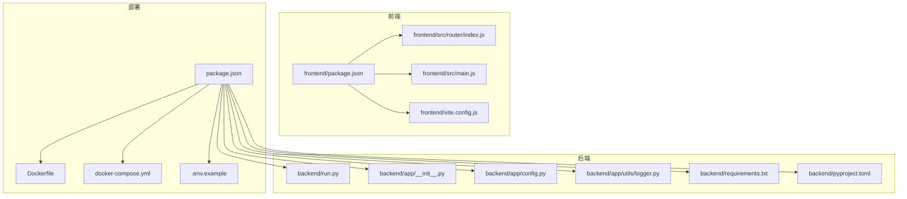
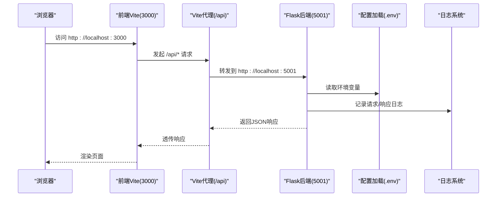
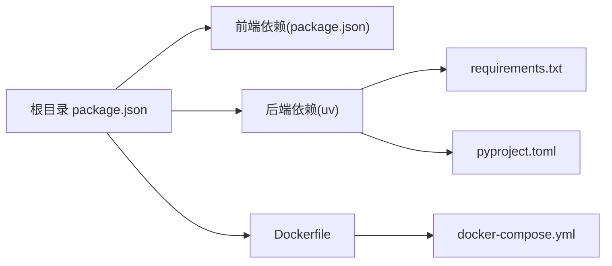

# 快速开始

<cite>
**本文引用的文件**
- [README.md](file://README.md)
- [.env.example](file://.env.example)
- [package.json](file://package.json)
- [vite.config.js](file://frontend/vite.config.js)
- [backend/run.py](file://backend/run.py)
- [backend/app/config.py](file://backend/app/config.py)
- [backend/app/__init__.py](file://backend/app/__init__.py)
- [backend/app/utils/logger.py](file://backend/app/utils/logger.py)
- [backend/pyproject.toml](file://backend/pyproject.toml)
- [backend/requirements.txt](file://backend/requirements.txt)
- [Dockerfile](file://Dockerfile)
- [docker-compose.yml](file://docker-compose.yml)
- [frontend/package.json](file://frontend/package.json)
- [frontend/src/router/index.js](file://frontend/src/router/index.js)
- [frontend/src/main.js](file://frontend/src/main.js)
- [backend/scripts/run_parallel_simulation.py](file://backend/scripts/run_parallel_simulation.py)
</cite>

## 目录
1. [简介](#简介)
2. [项目结构](#项目结构)
3. [核心组件](#核心组件)
4. [架构总览](#架构总览)
5. [详细组件分析](#详细组件分析)
6. [依赖分析](#依赖分析)
7. [性能考虑](#性能考虑)
8. [故障排除指南](#故障排除指南)
9. [结论](#结论)
10. [附录](#附录)

## 简介
本指南面向首次接触 MiroFish 的用户，帮助你在最短时间内完成环境准备、依赖安装与服务启动。项目提供两种部署方式：源码部署与 Docker 部署。无论你是初学者还是有一定经验的开发者，都可以根据本指南选择合适的路径。

## 项目结构
MiroFish 采用前后端分离架构：
- 前端：Vue 3 + Vite，提供可视化流程与交互界面
- 后端：Flask，提供 API 服务与模拟引擎集成
- 部署：支持本地源码一键安装与 Docker 一键启动

图表来源
- [package.json](file://package.json#L1-L22)
- [frontend/package.json](file://frontend/package.json#L1-L22)
- [frontend/vite.config.js](file://frontend/vite.config.js#L1-L19)
- [backend/run.py](file://backend/run.py#L1-L51)
- [backend/app/__init__.py](file://backend/app/__init__.py#L1-L81)
- [backend/app/config.py](file://backend/app/config.py#L1-L76)
- [backend/app/utils/logger.py](file://backend/app/utils/logger.py#L1-L127)
- [backend/requirements.txt](file://backend/requirements.txt#L1-L36)
- [backend/pyproject.toml](file://backend/pyproject.toml#L1-L56)
- [Dockerfile](file://Dockerfile#L1-L29)
- [docker-compose.yml](file://docker-compose.yml#L1-L14)
- [.env.example](file://.env.example#L1-L16)

章节来源
- [README.md](file://README.md#L89-L173)
- [package.json](file://package.json#L1-L22)
- [frontend/package.json](file://frontend/package.json#L1-L22)
- [backend/requirements.txt](file://backend/requirements.txt#L1-L36)
- [backend/pyproject.toml](file://backend/pyproject.toml#L1-L56)

## 核心组件
- 前端开发服务器：Vite 提供热更新与代理，将 /api 前缀转发至后端
- 后端 Flask 应用：应用工厂创建应用，注册蓝图，启用 CORS，健康检查接口
- 配置系统：统一从根目录 .env 加载环境变量，提供校验与默认值
- 日志系统：统一输出到控制台与文件，兼容 Windows 中文显示
- 部署脚本：根目录 npm 脚本统一安装与启动；Dockerfile 与 docker-compose.yml 提供容器化部署

章节来源
- [frontend/vite.config.js](file://frontend/vite.config.js#L1-L19)
- [backend/app/__init__.py](file://backend/app/__init__.py#L1-L81)
- [backend/app/config.py](file://backend/app/config.py#L1-L76)
- [backend/app/utils/logger.py](file://backend/app/utils/logger.py#L1-L127)
- [backend/run.py](file://backend/run.py#L1-L51)
- [package.json](file://package.json#L1-L22)
- [Dockerfile](file://Dockerfile#L1-L29)
- [docker-compose.yml](file://docker-compose.yml#L1-L14)

## 架构总览
下图展示了从浏览器到后端 API 的典型请求链路，以及开发模式下的本地联调关系。

图表来源
- [frontend/vite.config.js](file://frontend/vite.config.js#L10-L16)
- [backend/app/__init__.py](file://backend/app/__init__.py#L66-L69)
- [backend/app/config.py](file://backend/app/config.py#L9-L17)
- [backend/app/utils/logger.py](file://backend/app/utils/logger.py#L30-L88)

章节来源
- [frontend/vite.config.js](file://frontend/vite.config.js#L1-L19)
- [backend/app/__init__.py](file://backend/app/__init__.py#L1-L81)
- [backend/app/config.py](file://backend/app/config.py#L1-L76)
- [backend/app/utils/logger.py](file://backend/app/utils/logger.py#L1-L127)

## 详细组件分析

### 源码部署（推荐）
- 前置要求
  - Node.js 18+（包含 npm）
  - Python 3.11–3.12
  - uv（Python 包管理器）
- 环境变量
  - 复制示例文件并填写 LLM 与 Zep 相关密钥
  - 可选加速配置（如需）
- 依赖安装
  - 一键安装：根目录 npm 脚本同时安装前端与后端依赖
  - 分步安装：分别安装 Node 依赖与 Python 依赖（uv）
- 启动服务
  - 开发模式：根目录 npm 脚本同时启动前后端
  - 单独启动：前端或后端独立运行
- 服务地址
  - 前端：http://localhost:3000
  - 后端 API：http://localhost:5001

章节来源
- [README.md](file://README.md#L91-L158)
- [.env.example](file://.env.example#L1-L16)
- [package.json](file://package.json#L5-L12)
- [backend/pyproject.toml](file://backend/pyproject.toml#L1-L56)
- [backend/requirements.txt](file://backend/requirements.txt#L1-L36)

### Docker 部署
- 配置环境变量：复制示例文件并填写密钥
- 拉取镜像并启动：使用 docker compose
- 端口映射：3000（前端）/5001（后端）
- 数据卷：后端 uploads 目录映射到宿主机

章节来源
- [README.md](file://README.md#L160-L173)
- [docker-compose.yml](file://docker-compose.yml#L1-L14)
- [Dockerfile](file://Dockerfile#L1-L29)

### 配置文件与环境变量
- .env 示例文件包含 LLM 与 Zep 的基础配置，以及可选加速配置键位
- 后端配置类从根目录 .env 加载变量，提供默认值与必填项校验
- 健康检查接口：/health

章节来源
- [.env.example](file://.env.example#L1-L16)
- [backend/app/config.py](file://backend/app/config.py#L1-L76)
- [backend/app/__init__.py](file://backend/app/__init__.py#L71-L74)

### 前端路由与开发服务器
- 路由定义：首页、流程页、仿真页、报告页、交互页
- 开发服务器：Vite 监听 3000 端口，开启本地代理转发 /api 到后端
- Vue 应用入口：挂载路由与根组件

章节来源
- [frontend/src/router/index.js](file://frontend/src/router/index.js#L1-L53)
- [frontend/vite.config.js](file://frontend/vite.config.js#L1-L19)
- [frontend/src/main.js](file://frontend/src/main.js#L1-L10)

### 后端应用工厂与启动流程
- 应用工厂：创建 Flask 实例，设置 JSON 编码、CORS、蓝图注册、请求/响应日志
- 启动入口：run.py 校验配置、创建应用、读取主机/端口与调试开关并启动
- 日志系统：统一输出到控制台与文件，兼容 Windows 中文

章节来源
- [backend/app/__init__.py](file://backend/app/__init__.py#L1-L81)
- [backend/run.py](file://backend/run.py#L1-L51)
- [backend/app/utils/logger.py](file://backend/app/utils/logger.py#L1-L127)

### 模拟与并行脚本（可选）
- 双平台并行模拟：同时运行 Twitter 与 Reddit 平台，支持 IPC 命令（采访、批量采访、关闭环境）
- 日志与状态：生成动作日志、运行状态文件，便于外部查询
- 环境变量：脚本会加载项目根目录 .env

章节来源
- [backend/scripts/run_parallel_simulation.py](file://backend/scripts/run_parallel_simulation.py#L1-L120)

## 依赖分析
- 前端依赖：Vue 3、Vue Router、Axios、Vite 插件等
- 后端依赖：Flask、Flask-CORS、OpenAI SDK、Zep Cloud、OASIS/ camel-ai、文件处理与编码检测、dotenv、pydantic
- 包管理：根目录 npm 脚本结合 uv 安装 Python 依赖；Dockerfile 中使用 uv 复制与同步

图表来源
- [package.json](file://package.json#L1-L22)
- [frontend/package.json](file://frontend/package.json#L1-L22)
- [backend/requirements.txt](file://backend/requirements.txt#L1-L36)
- [backend/pyproject.toml](file://backend/pyproject.toml#L1-L56)
- [Dockerfile](file://Dockerfile#L1-L29)
- [docker-compose.yml](file://docker-compose.yml#L1-L14)

章节来源
- [package.json](file://package.json#L1-L22)
- [frontend/package.json](file://frontend/package.json#L1-L22)
- [backend/requirements.txt](file://backend/requirements.txt#L1-L36)
- [backend/pyproject.toml](file://backend/pyproject.toml#L1-L56)
- [Dockerfile](file://Dockerfile#L1-L29)
- [docker-compose.yml](file://docker-compose.yml#L1-L14)

## 性能考虑
- 模型成本：LLM 调用较为昂贵，建议先以较少轮次模拟测试
- 日志级别：生产环境可调整日志级别，减少 I/O 压力
- 并行模拟：双平台并行运行会增加资源占用，注意 CPU/内存与模型限流
- 代理与跨域：开发阶段的代理与 CORS 已配置，生产环境需按需收紧

章节来源
- [README.md](file://README.md#L110-L119)
- [backend/app/utils/logger.py](file://backend/app/utils/logger.py#L30-L88)
- [backend/app/__init__.py](file://backend/app/__init__.py#L42-L43)

## 故障排除指南
- 环境变量缺失
  - 现象：后端启动时报配置错误
  - 处理：确认 .env 是否存在并包含 LLM_API_KEY 与 ZEP_API_KEY
- 端口冲突
  - 现象：前端或后端无法启动
  - 处理：修改 vite.config.js 或 run.py 中的端口，或释放被占用端口
- 中文显示异常（Windows）
  - 现象：控制台中文乱码
  - 处理：运行入口与日志模块已做 UTF-8 配置，确保终端与系统区域设置正确
- 代理不通
  - 现象：访问 /api 返回 404 或跨域失败
  - 处理：确认 Vite 代理配置指向后端地址，且后端已启动
- Docker 启动失败
  - 现象：容器启动后立即退出或端口映射无效
  - 处理：检查 .env 内容、镜像拉取速度与加速镜像地址、数据卷权限

章节来源
- [backend/run.py](file://backend/run.py#L25-L45)
- [backend/app/config.py](file://backend/app/config.py#L66-L74)
- [backend/app/utils/logger.py](file://backend/app/utils/logger.py#L13-L23)
- [frontend/vite.config.js](file://frontend/vite.config.js#L10-L16)
- [docker-compose.yml](file://docker-compose.yml#L1-L14)
- [Dockerfile](file://Dockerfile#L1-L29)

## 结论
通过本指南，你可以快速完成 MiroFish 的环境准备与服务启动。建议优先使用源码部署以获得最佳开发体验，若追求隔离与一致性，可选择 Docker 部署。遇到问题时，请依据“故障排除指南”逐项排查。

## 附录
- 常用命令路径参考
  - 复制并编辑 .env：参考 [README.md](file://README.md#L101-L108)
  - 一键安装依赖：参考 [README.md](file://README.md#L125-L140) 与 [package.json](file://package.json#L5-L12)
  - 启动开发服务：参考 [README.md](file://README.md#L142-L158)
  - Docker 启动：参考 [README.md](file://README.md#L160-L168)
- 配置文件说明
  - .env 示例键位：参考 [.env.example](file://.env.example#L1-L16)
  - 后端配置加载与校验：参考 [backend/app/config.py](file://backend/app/config.py#L9-L17) 与 [backend/app/config.py](file://backend/app/config.py#L66-L74)
- 前端与后端端口
  - 前端：3000（Vite），参考 [frontend/vite.config.js](file://frontend/vite.config.js#L7-L17)
  - 后端：5001（Flask），参考 [backend/run.py](file://backend/run.py#L40-L42)