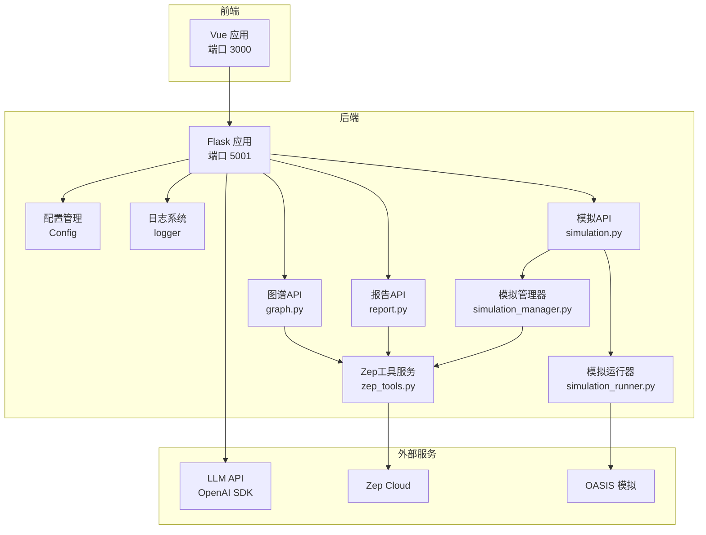
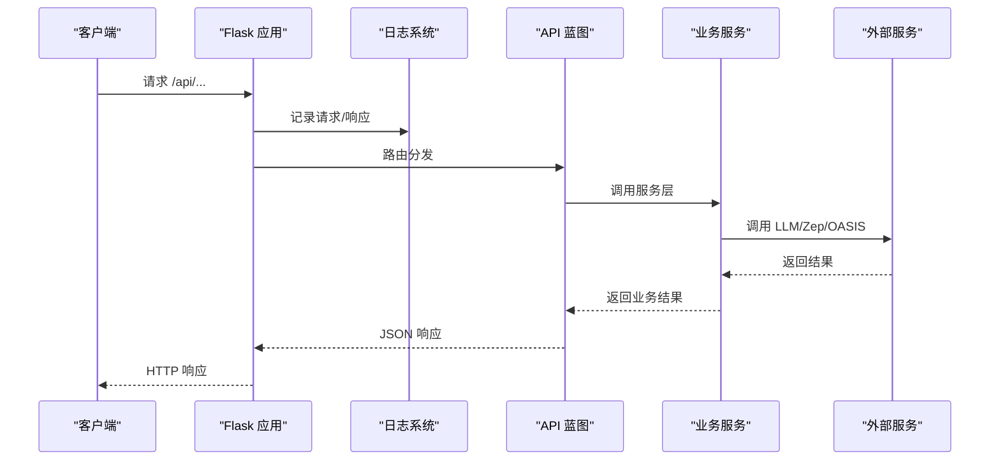
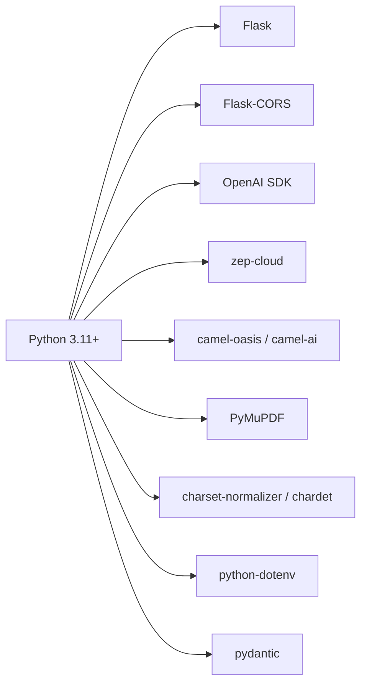

# 故障排除

<cite>
**本文引用的文件**
- [README.md](file://README.md)
- [Dockerfile](file://Dockerfile)
- [docker-compose.yml](file://docker-compose.yml)
- [.env.example](file://.env.example)
- [backend/run.py](file://backend/run.py)
- [backend/app/__init__.py](file://backend/app/__init__.py)
- [backend/app/config.py](file://backend/app/config.py)
- [backend/app/utils/logger.py](file://backend/app/utils/logger.py)
- [backend/app/utils/retry.py](file://backend/app/utils/retry.py)
- [backend/app/utils/llm_client.py](file://backend/app/utils/llm_client.py)
- [backend/app/utils/file_parser.py](file://backend/app/utils/file_parser.py)
- [backend/app/api/graph.py](file://backend/app/api/graph.py)
- [backend/app/api/simulation.py](file://backend/app/api/simulation.py)
- [backend/app/api/report.py](file://backend/app/api/report.py)
- [backend/app/services/simulation_manager.py](file://backend/app/services/simulation_manager.py)
- [backend/app/services/simulation_runner.py](file://backend/app/services/simulation_runner.py)
- [backend/app/services/zep_tools.py](file://backend/app/services/zep_tools.py)
</cite>

## 目录
1. [简介](#简介)
2. [项目结构](#项目结构)
3. [核心组件](#核心组件)
4. [架构总览](#架构总览)
5. [详细组件分析](#详细组件分析)
6. [依赖分析](#依赖分析)
7. [性能考虑](#性能考虑)
8. [故障排除指南](#故障排除指南)
9. [结论](#结论)
10. [附录](#附录)

## 简介
本指南面向技术支持人员与高级用户，系统化解析 MiroFish 在部署、运行与性能方面的常见问题与排障方法。内容覆盖：
- 部署与环境配置问题
- 运行时错误与日志定位
- API 调用失败与网络连接问题
- 数据同步与外部服务集成异常
- 性能瓶颈识别与调优建议
- 资源优化与容量规划

## 项目结构
MiroFish 采用前后端分离架构：前端 Vue 应用通过 NPM 脚本启动；后端基于 Flask，提供图谱构建、模拟准备与运行、报告生成等 API；外部依赖包括 LLM（OpenAI SDK 兼容）、Zep Cloud、OASIS 社交模拟框架。

图表来源
- [backend/app/__init__.py](file://backend/app/__init__.py#L19-L79)
- [backend/app/config.py](file://backend/app/config.py#L20-L76)
- [backend/app/utils/logger.py](file://backend/app/utils/logger.py#L30-L88)
- [backend/app/api/graph.py](file://backend/app/api/graph.py#L1-L618)
- [backend/app/api/simulation.py](file://backend/app/api/simulation.py#L1-L800)
- [backend/app/api/report.py](file://backend/app/api/report.py#L1-L800)
- [backend/app/services/simulation_manager.py](file://backend/app/services/simulation_manager.py#L114-L529)
- [backend/app/services/simulation_runner.py](file://backend/app/services/simulation_runner.py#L195-L800)
- [backend/app/services/zep_tools.py](file://backend/app/services/zep_tools.py#L377-L800)

章节来源
- [README.md](file://README.md#L90-L173)
- [backend/run.py](file://backend/run.py#L25-L46)
- [backend/app/__init__.py](file://backend/app/__init__.py#L19-L79)

## 核心组件
- 配置与启动
  - 后端启动入口负责加载 .env、校验配置、创建 Flask 应用并启动服务。
  - 配置类集中管理 LLM、Zep、上传、文本处理、模拟参数等。
- 日志系统
  - 统一日志输出到控制台与滚动文件，支持 UTF-8 编码，便于跨平台排查。
- API 层
  - 图谱：文件上传、本体生成、图谱构建、任务查询、数据获取与删除。
  - 模拟：实体读取、模拟准备、状态查询、运行与停止。
  - 报告：报告生成、进度查询、章节获取、对话与下载。
- 服务层
  - 模拟管理器：准备阶段自动化（实体过滤、Agent Profile、配置生成）。
  - 模拟运行器：后台运行 OASIS 模拟，解析动作日志，提供实时状态与停止能力。
  - Zep 工具服务：封装图谱检索、节点/边查询、深度洞察与广度搜索等工具。

章节来源
- [backend/run.py](file://backend/run.py#L25-L46)
- [backend/app/config.py](file://backend/app/config.py#L20-L76)
- [backend/app/utils/logger.py](file://backend/app/utils/logger.py#L30-L88)
- [backend/app/api/graph.py](file://backend/app/api/graph.py#L121-L525)
- [backend/app/api/simulation.py](file://backend/app/api/simulation.py#L164-L781)
- [backend/app/api/report.py](file://backend/app/api/report.py#L24-L196)
- [backend/app/services/simulation_manager.py](file://backend/app/services/simulation_manager.py#L114-L457)
- [backend/app/services/simulation_runner.py](file://backend/app/services/simulation_runner.py#L195-L577)
- [backend/app/services/zep_tools.py](file://backend/app/services/zep_tools.py#L377-L626)

## 架构总览
后端通过蓝图注册 API，中间件记录请求/响应，CORS 允许跨域访问。服务间通过模块化设计解耦，外部服务通过客户端封装统一接入。

图表来源
- [backend/app/__init__.py](file://backend/app/__init__.py#L51-L63)
- [backend/app/api/graph.py](file://backend/app/api/graph.py#L121-L255)
- [backend/app/api/simulation.py](file://backend/app/api/simulation.py#L164-L237)
- [backend/app/api/report.py](file://backend/app/api/report.py#L24-L196)
- [backend/app/utils/llm_client.py](file://backend/app/utils/llm_client.py#L13-L92)
- [backend/app/services/zep_tools.py](file://backend/app/services/zep_tools.py#L441-L522)

## 详细组件分析

### 配置与启动
- 启动入口负责：
  - 设置 Windows UTF-8 编码
  - 插入项目根目录到 sys.path
  - 校验配置（LLM、Zep）
  - 读取 FLASK_HOST/PORT/DEBUG 环境变量
  - 启动 Flask 应用
- 配置类：
  - 统一从 .env 加载，支持备用环境变量
  - 校验必要字段（LLM_API_KEY、ZEP_API_KEY）
  - 上传大小、文件类型、Chunk 参数、OASIS 平台动作集合、Report Agent 参数

章节来源
- [backend/run.py](file://backend/run.py#L25-L46)
- [backend/app/config.py](file://backend/app/config.py#L13-L76)

### 日志系统
- 输出策略：
  - 控制台：INFO 及以上，UTF-8 编码
  - 文件：DEBUG 及以上，按日滚动，最大 10MB × 5 份
- 便捷方法：debug/info/warning/error/critical
- 作用：统一记录请求/响应、任务进度、错误堆栈，便于定位问题

章节来源
- [backend/app/utils/logger.py](file://backend/app/utils/logger.py#L30-L88)

### API 层（图谱）
- 关键接口与要点：
  - 上传文件并生成本体：校验参数、保存文件、提取文本、调用 LLM 生成本体、保存项目状态
  - 构建图谱：校验 ZEP_API_KEY、分块文本、创建/设置 Zep 图谱、批量添加文本、等待处理完成、获取图谱数据
  - 任务查询：通过 TaskManager 获取状态
  - 图谱数据与删除：调用 GraphBuilderService
- 常见错误：
  - 缺少 ZEP_API_KEY
  - 项目状态不合法（未生成本体即构建图谱）
  - 文本提取失败或空内容
  - Zep API 调用异常

章节来源
- [backend/app/api/graph.py](file://backend/app/api/graph.py#L121-L525)

### API 层（模拟）
- 关键接口与要点：
  - 实体读取：过滤定义的实体类型，可选择是否获取边信息
  - 模拟准备：异步任务，自动检测已完成准备，避免重复生成；支持强制重新生成
  - 准备进度：阶段权重（读取、生成人设、生成配置、复制脚本）
  - 模拟运行：启动后台进程，解析 actions.jsonl，实时更新状态；支持停止
  - 运行状态：Twitter/Reddit 独立轮次与模拟小时，总体进度百分比
- 常见错误：
  - 未准备完成即运行
  - 缺少必要文件（state.json、配置、Profile）
  - 进程退出码非 0，主日志包含错误片段
  - 平台启用但对应 actions.jsonl 不存在

章节来源
- [backend/app/api/simulation.py](file://backend/app/api/simulation.py#L47-L781)
- [backend/app/services/simulation_manager.py](file://backend/app/services/simulation_manager.py#L229-L457)
- [backend/app/services/simulation_runner.py](file://backend/app/services/simulation_runner.py#L312-L577)

### API 层（报告）
- 关键接口与要点：
  - 报告生成：异步任务，进度回调，保存报告
  - 报告状态：支持查询生成进度、章节列表、单章内容
  - 对话：与 Report Agent 对话，支持检索工具
  - 下载：Markdown 文件下载
- 常见错误：
  - 缺少图谱 ID 或项目不存在
  - 报告已存在但未强制重新生成
  - 任务不存在或状态异常

章节来源
- [backend/app/api/report.py](file://backend/app/api/report.py#L24-L749)

### 服务层（模拟管理器）
- 职责：
  - 从 Zep 读取并过滤实体
  - 生成 Agent Profile（支持并行与实时保存）
  - LLM 智能生成模拟配置
  - 保存配置与脚本，准备运行
- 状态机：CREATED → PREPARING → READY → RUNNING/PAUSED/STOPPED → COMPLETED/FAILED

章节来源
- [backend/app/services/simulation_manager.py](file://backend/app/services/simulation_manager.py#L114-L457)

### 服务层（模拟运行器）
- 职责：
  - 启动 OASIS 模拟脚本（Twitter/Reddit/并行）
  - 解析 actions.jsonl，记录 Agent 动作
  - 实时状态：轮次、模拟小时、平台独立状态、最近动作
  - 停止：跨平台终止进程树
- 日志结构：
  - twitter/actions.jsonl
  - reddit/actions.jsonl
  - simulation.log（主日志）

章节来源
- [backend/app/services/simulation_runner.py](file://backend/app/services/simulation_runner.py#L195-L577)

### 服务层（Zep 工具服务）
- 职责：
  - 封装 Zep 搜索、节点/边查询、实体摘要
  - InsightForge（深度洞察）、Panorama（广度搜索）、QuickSearch（快速搜索）
  - 带重试的 API 调用
- 降级策略：Zep Search API 不可用时，回退到本地关键词匹配

章节来源
- [backend/app/services/zep_tools.py](file://backend/app/services/zep_tools.py#L377-L626)

## 依赖分析
- 外部依赖（后端）：
  - Flask、Flask-CORS、OpenAI SDK、zep-cloud、camel-oasis、camel-ai、PyMuPDF、charset-normalizer、chardet、python-dotenv、pydantic
- 部署方式：
  - Dockerfile 使用 Node.js 18+、uv、Python 3.11，先安装依赖再复制源码，暴露 3000/5001 端口
  - docker-compose 映射 .env、端口与上传目录卷

图表来源
- [backend/pyproject.toml](file://backend/pyproject.toml#L11-L35)
- [backend/requirements.txt](file://backend/requirements.txt#L8-L36)
- [Dockerfile](file://Dockerfile#L1-L29)
- [docker-compose.yml](file://docker-compose.yml#L1-L14)

章节来源
- [backend/pyproject.toml](file://backend/pyproject.toml#L11-L35)
- [backend/requirements.txt](file://backend/requirements.txt#L8-L36)
- [Dockerfile](file://Dockerfile#L1-L29)
- [docker-compose.yml](file://docker-compose.yml#L1-L14)

## 性能考虑
- 文本处理与分块
  - 默认 Chunk 大小与重叠可通过配置调整，减少 LLM 上下文碎片化
  - 文本分块算法按句子边界尽量切分，降低截断成本
- 并行与批处理
  - 模拟准备阶段支持并行生成 Agent Profile
  - 批量添加文本时使用小批次（示例中为 3），平衡吞吐与稳定性
- 外部服务调用
  - LLM/Zep 调用采用指数退避重试，避免瞬时峰值导致失败
  - Zep Search API 不可用时自动降级为本地关键词匹配
- 日志与 IO
  - 控制台 INFO 级别输出，文件 DEBUG 级别滚动，避免过多 IO 影响性能
- 进程与资源
  - 模拟运行使用独立进程组，支持优雅终止，防止僵尸进程
  - 主日志文件避免 stdout/stderr 缓冲区满导致阻塞

章节来源
- [backend/app/config.py](file://backend/app/config.py#L44-L49)
- [backend/app/utils/file_parser.py](file://backend/app/utils/file_parser.py#L147-L189)
- [backend/app/api/graph.py](file://backend/app/api/graph.py#L435-L440)
- [backend/app/utils/retry.py](file://backend/app/utils/retry.py#L15-L78)
- [backend/app/services/zep_tools.py](file://backend/app/services/zep_tools.py#L518-L522)
- [backend/app/services/simulation_runner.py](file://backend/app/services/simulation_runner.py#L425-L447)

## 故障排除指南

### 一、部署与环境问题
- 症状
  - 启动时报“配置错误”或“LLM_API_KEY 未配置”
  - Docker 启动后前端无法访问后端
- 排查步骤
  - 确认 .env 文件存在且包含 LLM_API_KEY、ZEP_API_KEY
  - 检查 FLASK_HOST/PORT/DEBUG 环境变量是否正确
  - Docker 端口映射 3000/5001 是否冲突
- 解决方案
  - 复制 .env.example 为 .env，填写密钥
  - 使用 docker-compose up -d 启动，确认容器日志
  - 如需加速镜像，按注释替换镜像地址

章节来源
- [backend/run.py](file://backend/run.py#L25-L46)
- [backend/app/config.py](file://backend/app/config.py#L67-L76)
- [README.md](file://README.md#L101-L124)
- [README.md](file://README.md#L160-L173)
- [docker-compose.yml](file://docker-compose.yml#L1-L14)

### 二、运行时错误与日志分析
- 常见错误类型
  - 配置缺失：LLM_API_KEY、ZEP_API_KEY
  - 项目状态异常：未生成本体即构建图谱
  - 外部服务调用失败：Zep API、LLM API
  - 进程异常：模拟运行退出码非 0
- 日志定位
  - 控制台 INFO 级别输出简要信息
  - 文件日志按天滚动，DEBUG 级别包含详细堆栈
  - API 层捕获异常并返回错误信息与 traceback
- 调试建议
  - 提升日志级别（DEBUG）观察详细流程
  - 检查 .env 与环境变量是否生效
  - 使用 /health 健康检查确认后端存活

章节来源
- [backend/app/utils/logger.py](file://backend/app/utils/logger.py#L30-L88)
- [backend/app/api/graph.py](file://backend/app/api/graph.py#L249-L255)
- [backend/app/api/simulation.py](file://backend/app/api/simulation.py#L594-L604)
- [backend/app/api/report.py](file://backend/app/api/report.py#L189-L196)

### 三、API 调用失败
- 症状
  - /api/graph/build 返回“ZEP_API_KEY未配置”
  - /api/simulation/prepare 返回“项目不存在/缺少模拟需求”
  - /api/report/generate 返回“缺少图谱ID/项目不存在”
- 排查步骤
  - 确认 .env 中 ZEP_API_KEY 已配置
  - 确认项目已成功生成本体并保存
  - 确认项目包含 simulation_requirement
  - 确认图谱已成功构建并获得 graph_id
- 解决方案
  - 补充 .env 配置并重启后端
  - 先调用 /api/graph/ontology/generate，再调用 /api/graph/build
  - 重新生成报告时传入正确的 simulation_id

章节来源
- [backend/app/api/graph.py](file://backend/app/api/graph.py#L285-L295)
- [backend/app/api/simulation.py](file://backend/app/api/simulation.py#L407-L462)
- [backend/app/api/report.py](file://backend/app/api/report.py#L52-L107)

### 四、网络连接与外部服务问题
- Zep Cloud
  - 症状：搜索失败、节点/边查询异常
  - 降级策略：当 Zep Search API 不可用时，自动回退到本地关键词匹配
  - 建议：检查 ZEP_API_KEY、网络连通性、配额
- LLM API
  - 症状：调用超时或失败
  - 重试机制：指数退避 + 随机抖动，最多重试 N 次
  - 建议：检查 LLM_BASE_URL、模型名称、并发与速率限制

章节来源
- [backend/app/services/zep_tools.py](file://backend/app/services/zep_tools.py#L518-L522)
- [backend/app/utils/retry.py](file://backend/app/utils/retry.py#L15-L78)
- [backend/app/utils/llm_client.py](file://backend/app/utils/llm_client.py#L13-L92)

### 五、数据同步与文件处理异常
- 症状
  - 文件上传后提取失败或为空
  - PDF/Markdown/TXT 编码异常
- 排查步骤
  - 检查文件扩展名是否在允许列表
  - 检查文件大小是否超过 MAX_CONTENT_LENGTH
  - 查看文本提取日志与错误堆栈
- 解决方案
  - 使用 UTF-8 或自动编码检测（charset-normalizer/chardet）
  - 对于 PDF，确保已安装 PyMuPDF

章节来源
- [backend/app/config.py](file://backend/app/config.py#L38-L42)
- [backend/app/utils/file_parser.py](file://backend/app/utils/file_parser.py#L11-L58)
- [backend/app/utils/file_parser.py](file://backend/app/utils/file_parser.py#L96-L122)

### 六、模拟运行异常
- 症状
  - “模拟已在运行中”或“未准备完成即运行”
  - 进程退出码非 0，主日志包含错误片段
  - 平台未完成但状态显示已完成
- 排查步骤
  - 检查 /api/simulation/prepare/status 是否返回 ready
  - 检查模拟目录是否存在必要文件（state.json、配置、Profile）
  - 查看 twitter/reddit/actions.jsonl 与 simulation.log
- 解决方案
  - 强制重新生成准备（force_regenerate=true）
  - 检查脚本路径与权限，确保 scripts 目录存在
  - 使用 stop_simulation 停止异常进程，清理残留

章节来源
- [backend/app/api/simulation.py](file://backend/app/api/simulation.py#L358-L446)
- [backend/app/services/simulation_runner.py](file://backend/app/services/simulation_runner.py#L478-L577)

### 七、性能瓶颈与调优
- 瓶颈识别
  - LLM 调用耗时：关注响应时间与重试次数
  - Zep 搜索/查询：大规模图谱查询耗时
  - 文本分块与批处理：Chunk 大小与重叠影响上下文质量与吞吐
  - 模拟运行：Twitter/Reddit 并行时资源占用
- 调优建议
  - 合理设置 DEFAULT_CHUNK_SIZE/DEFAULT_CHUNK_OVERLAP
  - 控制并行生成 Agent Profile 数量
  - 适当增大日志滚动文件大小与备份份数
  - 使用 /health 与任务状态接口监控后端健康

章节来源
- [backend/app/config.py](file://backend/app/config.py#L44-L49)
- [backend/app/api/graph.py](file://backend/app/api/graph.py#L435-L440)
- [backend/app/services/simulation_manager.py](file://backend/app/services/simulation_manager.py#L338-L346)
- [backend/app/services/simulation_runner.py](file://backend/app/services/simulation_runner.py#L425-L447)

### 八、容量规划与资源优化
- 资源评估
  - CPU：模拟运行（尤其是并行）与文本处理
  - 内存：大规模图谱查询与 LLM 调用
  - 存储：上传目录、日志滚动文件、模拟运行产物
- 优化策略
  - 限制并发与批大小，避免内存峰值
  - 使用 SSD 存储日志与上传目录
  - 定期清理旧日志与不再使用的模拟数据

章节来源
- [docker-compose.yml](file://docker-compose.yml#L13-L14)
- [backend/app/utils/logger.py](file://backend/app/utils/logger.py#L67-L76)

## 结论
本指南提供了从部署、运行到性能优化的系统化排障路径。通过合理配置、日志分析与外部服务降级策略，可有效应对大多数常见问题。建议在生产环境中开启 DEBUG 日志以辅助定位，并定期评估与优化资源配置。

## 附录

### A. 常见错误代码与含义
- 配置错误
  - LLM_API_KEY 未配置：检查 .env 与环境变量
  - ZEP_API_KEY 未配置：检查 .env 与外部服务可用性
- 业务状态错误
  - 项目不存在/删除失败：确认项目 ID 与状态
  - 未生成本体即构建图谱：先调用本体生成接口
  - 缺少模拟需求：确保项目包含 simulation_requirement
- 运行时错误
  - 进程退出码非 0：查看 simulation.log 获取错误片段
  - 缺少必要文件：检查 state.json、配置与 Profile 文件

章节来源
- [backend/app/config.py](file://backend/app/config.py#L67-L76)
- [backend/app/api/graph.py](file://backend/app/api/graph.py#L301-L330)
- [backend/app/api/simulation.py](file://backend/app/api/simulation.py#L407-L462)
- [backend/app/api/report.py](file://backend/app/api/report.py#L52-L107)
- [backend/app/services/simulation_runner.py](file://backend/app/services/simulation_runner.py#L529-L538)

### B. 调试工具与命令
- 健康检查
  - GET /health
- 任务与状态
  - GET /api/graph/task/{task_id}
  - POST /api/simulation/prepare/status
  - GET /api/report/generate/status
- 日志
  - 控制台 INFO 级别输出
  - 文件按日滚动，DEBUG 级别详细日志
- Docker
  - docker-compose up -d
  - docker logs 容器名

章节来源
- [backend/app/__init__.py](file://backend/app/__init__.py#L71-L78)
- [backend/app/api/graph.py](file://backend/app/api/graph.py#L529-L546)
- [backend/app/api/simulation.py](file://backend/app/api/simulation.py#L637-L748)
- [backend/app/api/report.py](file://backend/app/api/report.py#L198-L268)
- [README.md](file://README.md#L160-L173)