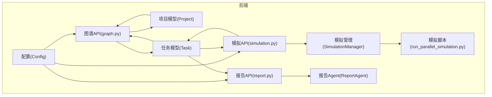
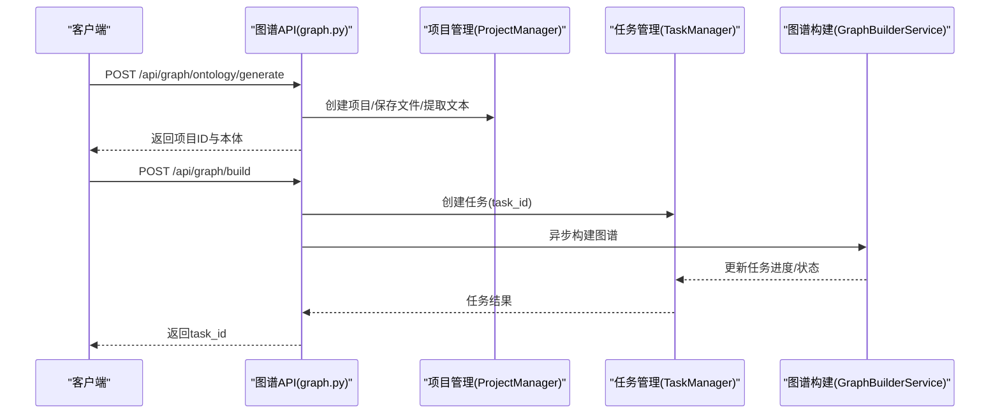
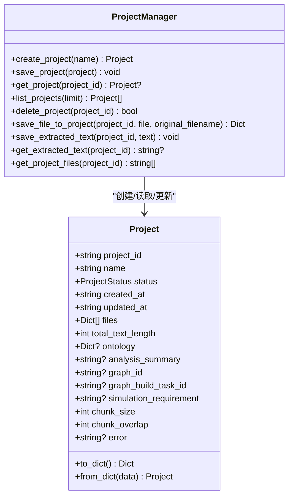
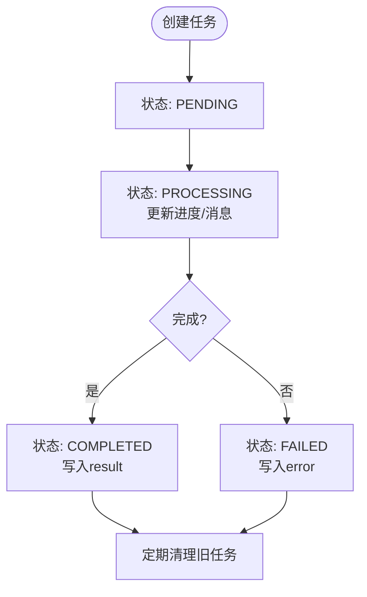
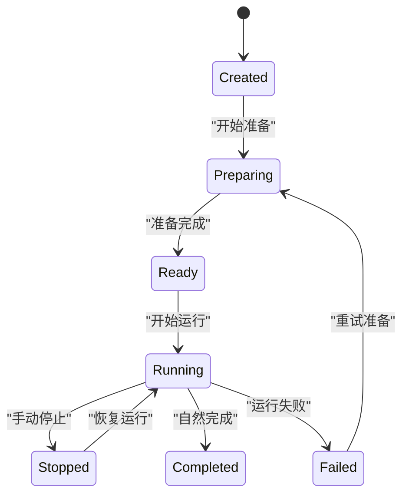
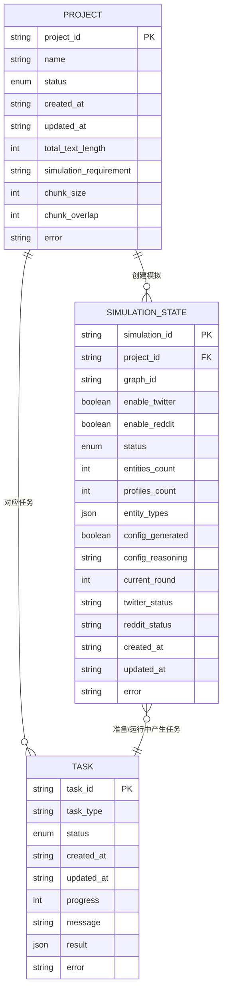
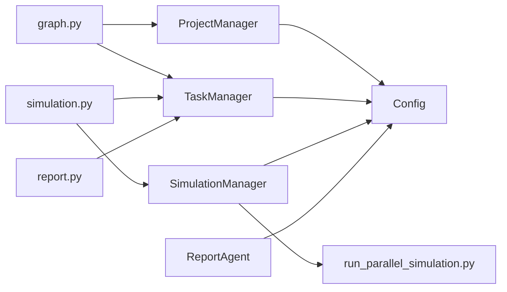
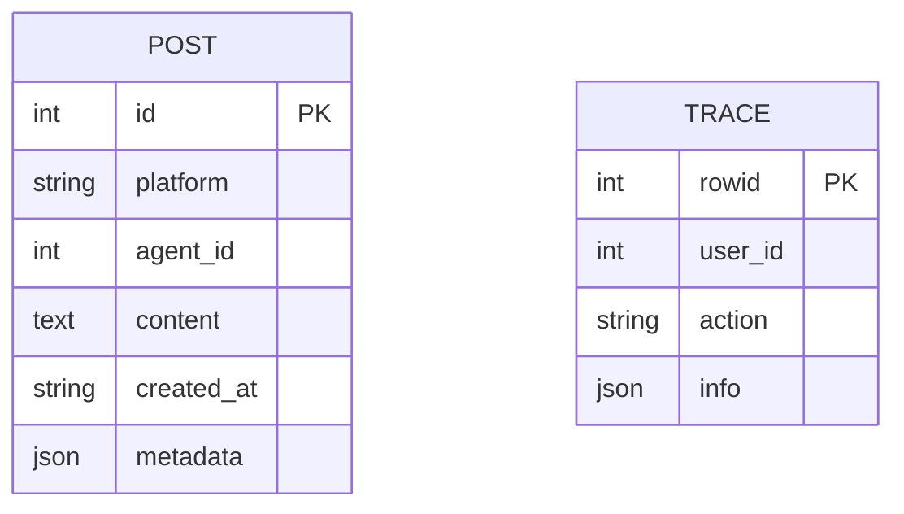

# 数据模型

<cite>
**本文引用的文件**
- [backend/app/models/project.py](file://backend/app/models/project.py)
- [backend/app/models/task.py](file://backend/app/models/task.py)
- [backend/app/models/__init__.py](file://backend/app/models/__init__.py)
- [backend/app/api/graph.py](file://backend/app/api/graph.py)
- [backend/app/api/simulation.py](file://backend/app/api/simulation.py)
- [backend/app/api/report.py](file://backend/app/api/report.py)
- [backend/app/services/simulation_manager.py](file://backend/app/services/simulation_manager.py)
- [backend/app/services/report_agent.py](file://backend/app/services/report_agent.py)
- [backend/app/config.py](file://backend/app/config.py)
- [backend/run.py](file://backend/run.py)
- [backend/scripts/run_parallel_simulation.py](file://backend/scripts/run_parallel_simulation.py)
- [backend/app/utils/logger.py](file://backend/app/utils/logger.py)
</cite>

## 目录
1. [简介](#简介)
2. [项目结构](#项目结构)
3. [核心组件](#核心组件)
4. [架构总览](#架构总览)
5. [详细组件分析](#详细组件分析)
6. [依赖分析](#依赖分析)
7. [性能考量](#性能考量)
8. [故障排查指南](#故障排查指南)
9. [结论](#结论)
10. [附录](#附录)

## 简介
本文件系统化梳理 MiroFish 的数据模型，覆盖项目数据模型、任务状态模型、模拟状态模型与实体关系模型，解释字段定义、数据类型、业务约束与生命周期管理；并给出数据库 schema 图、示例数据、数据访问模式、缓存策略与性能考虑，以及迁移路径与版本管理建议，为数据库管理员与后端开发者提供技术参考。

## 项目结构
MiroFish 后端采用“模型-服务-接口”分层组织，数据模型集中在 models 子包，状态持久化以文件系统为主，配合内存缓存与异步任务管理器实现长时任务跟踪。核心目录与职责如下：
- models：项目与任务数据模型（JSON 文件持久化）
- services：业务服务（模拟管理、报告生成、图谱构建等）
- api：REST API 路由（图谱、模拟、报告）
- scripts：OASIS 模拟脚本（SQLite 数据库与动作日志）
- config：全局配置（环境变量驱动）
- logs：日志输出（文件与控制台）

**图表来源**
- [backend/app/config.py](file://backend/app/config.py#L20-L76)
- [backend/app/models/project.py](file://backend/app/models/project.py#L101-L306)
- [backend/app/models/task.py](file://backend/app/models/task.py#L54-L185)
- [backend/app/services/simulation_manager.py](file://backend/app/services/simulation_manager.py#L114-L200)
- [backend/app/services/report_agent.py](file://backend/app/services/report_agent.py#L35-L120)
- [backend/app/api/graph.py](file://backend/app/api/graph.py#L1-L618)
- [backend/app/api/simulation.py](file://backend/app/api/simulation.py#L1-L800)
- [backend/app/api/report.py](file://backend/app/api/report.py#L1-L800)
- [backend/scripts/run_parallel_simulation.py](file://backend/scripts/run_parallel_simulation.py#L1-L200)

**章节来源**
- [backend/app/config.py](file://backend/app/config.py#L20-L76)
- [backend/app/models/project.py](file://backend/app/models/project.py#L101-L306)
- [backend/app/models/task.py](file://backend/app/models/task.py#L54-L185)
- [backend/app/services/simulation_manager.py](file://backend/app/services/simulation_manager.py#L114-L200)
- [backend/app/services/report_agent.py](file://backend/app/services/report_agent.py#L35-L120)
- [backend/app/api/graph.py](file://backend/app/api/graph.py#L1-L618)
- [backend/app/api/simulation.py](file://backend/app/api/simulation.py#L1-L800)
- [backend/app/api/report.py](file://backend/app/api/report.py#L1-L800)
- [backend/scripts/run_parallel_simulation.py](file://backend/scripts/run_parallel_simulation.py#L1-L200)

## 核心组件
- 项目模型（Project）：承载项目元数据、文件清单、本体定义、图谱ID、分块参数与错误信息，支持 JSON 文件持久化与目录结构管理。
- 任务模型（Task）：跟踪异步任务状态、进度、消息、结果与错误，提供线程安全的任务管理器。
- 模拟状态模型（SimulationState）：管理 OASIS 双平台模拟的生命周期、实体与人设数量、配置生成状态、运行时状态与时间戳。
- 报告模型（ReportAgent）：记录报告生成的详细日志（JSONL），支持章节级生成与对话检索。

**章节来源**
- [backend/app/models/project.py](file://backend/app/models/project.py#L26-L98)
- [backend/app/models/task.py](file://backend/app/models/task.py#L22-L52)
- [backend/app/services/simulation_manager.py](file://backend/app/services/simulation_manager.py#L42-L112)
- [backend/app/services/report_agent.py](file://backend/app/services/report_agent.py#L35-L120)

## 架构总览
MiroFish 的数据模型围绕“文件系统 + 内存缓存 + 异步任务”的组合展开：
- 项目与模拟状态以 JSON 文件形式持久化在 uploads 目录，便于跨进程共享与重启恢复。
- 任务状态以内存字典缓存，配合线程锁保证并发安全；定期清理旧任务。
- 模拟运行时产生的动作与日志以 SQLite 与 JSONL 文件形式落盘，支持增量读取与实时监控。
- 报告生成过程记录详细的 agent 日志，便于调试与审计。

**图表来源**
- [backend/app/api/graph.py](file://backend/app/api/graph.py#L121-L255)
- [backend/app/api/graph.py](file://backend/app/api/graph.py#L259-L525)
- [backend/app/models/project.py](file://backend/app/models/project.py#L133-L196)
- [backend/app/models/task.py](file://backend/app/models/task.py#L73-L99)

## 详细组件分析

### 项目数据模型（Project）
- 角色与职责：封装项目全生命周期元数据，负责项目目录结构、文件存储、抽取文本与本体/图谱信息的持久化。
- 关键字段与类型
  - project_id: 字符串（唯一标识）
  - name: 字符串（项目名称）
  - status: 枚举（ProjectStatus）
  - created_at/updated_at: ISO 时间字符串
  - files: 列表（字典，包含原始文件名、大小等）
  - total_text_length: 整数（抽取文本总长度）
  - ontology/analysis_summary: 字典/字符串（本体定义与分析摘要）
  - graph_id/graph_build_task_id: 字符串（图谱ID与任务ID）
  - simulation_requirement: 字符串（模拟需求）
  - chunk_size/chunk_overlap: 整数（文本分块参数）
  - error: 字符串（错误信息）
- 生命周期
  - CREATED → ONTOLOGY_GENERATED → GRAPH_BUILDING → GRAPH_COMPLETED 或 FAILED
  - 支持重置到 ONTOLOGY_GENERATED 或 CREATED
- 数据验证与约束
  - 文件扩展名白名单（ALLOWED_EXTENSIONS）
  - 本体生成后才能进入图谱构建
  - 图谱构建中禁止重复提交，除非 force=true
- 示例数据（结构示意）
  - project_id: "proj_xxxxxx"
  - status: "graph_completed"
  - files: [{"filename": "doc.pdf", "size": 123456}, ...]
  - total_text_length: 987654
  - ontology: {"entity_types": [...], "edge_types": [...]}
  - graph_id: "mirofish_xxxxxx"
  - simulation_requirement: "舆情传播模拟"
  - chunk_size: 500, chunk_overlap: 50

**图表来源**
- [backend/app/models/project.py](file://backend/app/models/project.py#L26-L98)
- [backend/app/models/project.py](file://backend/app/models/project.py#L101-L306)

**章节来源**
- [backend/app/models/project.py](file://backend/app/models/project.py#L17-L24)
- [backend/app/models/project.py](file://backend/app/models/project.py#L26-L98)
- [backend/app/models/project.py](file://backend/app/models/project.py#L101-L306)
- [backend/app/api/graph.py](file://backend/app/api/graph.py#L119-L255)

### 任务状态模型（Task）
- 角色与职责：跟踪异步任务（图谱构建、模拟准备、报告生成）的状态与进度，提供线程安全的 CRUD 操作与定时清理。
- 关键字段与类型
  - task_id: 字符串（唯一标识）
  - task_type: 字符串（任务类型）
  - status: 枚举（TaskStatus）
  - created_at/updated_at: 时间戳
  - progress: 整数（0-100）
  - message: 字符串（状态消息）
  - result/error: 字典/字符串（结果与错误）
  - metadata/progress_detail: 字典（额外元数据与详细进度）
- 生命周期
  - PENDING → PROCESSING → COMPLETED 或 FAILED
  - 支持批量清理超期任务（默认24小时）
- 数据访问模式
  - 单例模式 + 线程锁，保证并发安全
  - 任务列表按创建时间倒序返回

**图表来源**
- [backend/app/models/task.py](file://backend/app/models/task.py#L14-L20)
- [backend/app/models/task.py](file://backend/app/models/task.py#L73-L99)
- [backend/app/models/task.py](file://backend/app/models/task.py#L106-L144)
- [backend/app/models/task.py](file://backend/app/models/task.py#L172-L185)

**章节来源**
- [backend/app/models/task.py](file://backend/app/models/task.py#L14-L20)
- [backend/app/models/task.py](file://backend/app/models/task.py#L22-L52)
- [backend/app/models/task.py](file://backend/app/models/task.py#L54-L185)

### 模拟状态模型（SimulationState）
- 角色与职责：管理 OASIS 双平台（Twitter/Reddit）模拟的生命周期与运行状态，提供状态文件的读写与内存缓存。
- 关键字段与类型
  - simulation_id: 字符串（唯一标识）
  - project_id/graph_id: 字符串（关联项目与图谱）
  - enable_twitter/enable_reddit: 布尔值（平台开关）
  - status: 枚举（SimulationStatus）
  - entities_count/profiles_count: 整数（实体与人设数量）
  - entity_types: 列表（实体类型）
  - config_generated/config_reasoning: 布尔/字符串（配置生成状态与理由）
  - current_round/twitter_status/reddit_status: 运行时状态
  - created_at/updated_at: ISO 时间字符串
  - error: 字符串（错误信息）
- 生命周期
  - CREATED → PREPARING → READY → RUNNING → STOPPED/COMPLETED/FAILED
  - 支持自动检测已准备完成的环境，避免重复生成
- 数据访问模式
  - state.json 文件持久化，内存字典缓存加速读取
  - 提供 to_dict/to_simple_dict 两类序列化

**图表来源**
- [backend/app/services/simulation_manager.py](file://backend/app/services/simulation_manager.py#L24-L34)
- [backend/app/services/simulation_manager.py](file://backend/app/services/simulation_manager.py#L42-L112)
- [backend/app/services/simulation_manager.py](file://backend/app/services/simulation_manager.py#L144-L192)

**章节来源**
- [backend/app/services/simulation_manager.py](file://backend/app/services/simulation_manager.py#L24-L34)
- [backend/app/services/simulation_manager.py](file://backend/app/services/simulation_manager.py#L42-L112)
- [backend/app/services/simulation_manager.py](file://backend/app/services/simulation_manager.py#L114-L200)

### 实体关系模型（ER）
- 实体与属性
  - 项目(Project)
    - 属性：project_id、name、status、created_at、updated_at、files、total_text_length、ontology、analysis_summary、graph_id、graph_build_task_id、simulation_requirement、chunk_size、chunk_overlap、error
  - 任务(Task)
    - 属性：task_id、task_type、status、created_at、updated_at、progress、message、result、error、metadata、progress_detail
  - 模拟(SimulationState)
    - 属性：simulation_id、project_id、graph_id、enable_twitter、enable_reddit、status、entities_count、profiles_count、entity_types、config_generated、config_reasoning、current_round、twitter_status、reddit_status、created_at、updated_at、error
- 关系
  - 项目 ←→ 任务：一个项目可对应多个任务（如图谱构建、报告生成）
  - 项目 ←→ 模拟：一个项目可创建多个模拟（不同配置或复用图谱）
  - 模拟 ←→ 任务：模拟准备/运行过程中产生任务
- 外部实体
  - Zep 图谱（graph_id）：外部系统，通过 API 交互
  - SQLite 数据库：模拟运行时的动作与日志存储

**图表来源**
- [backend/app/models/project.py](file://backend/app/models/project.py#L26-L98)
- [backend/app/models/task.py](file://backend/app/models/task.py#L22-L52)
- [backend/app/services/simulation_manager.py](file://backend/app/services/simulation_manager.py#L42-L112)

## 依赖分析
- 模块耦合
  - API 层依赖模型与服务层，负责参数校验、状态流转与错误处理
  - 服务层依赖配置与工具模块，协调外部系统（Zep、LLM）
  - 模型层仅负责数据结构与持久化，保持低耦合
- 外部依赖
  - Zep API：图谱创建、设置本体、数据查询与删除
  - LLM API：本体生成、配置生成、报告生成
  - SQLite：模拟运行时动作与日志存储
- 循环依赖
  - 未见循环依赖；API 依赖模型/服务，服务依赖配置与工具，模型独立

**图表来源**
- [backend/app/api/graph.py](file://backend/app/api/graph.py#L1-L618)
- [backend/app/api/simulation.py](file://backend/app/api/simulation.py#L1-L800)
- [backend/app/api/report.py](file://backend/app/api/report.py#L1-L800)
- [backend/app/models/project.py](file://backend/app/models/project.py#L101-L306)
- [backend/app/models/task.py](file://backend/app/models/task.py#L54-L185)
- [backend/app/services/simulation_manager.py](file://backend/app/services/simulation_manager.py#L114-L200)
- [backend/app/services/report_agent.py](file://backend/app/services/report_agent.py#L35-L120)
- [backend/app/config.py](file://backend/app/config.py#L20-L76)
- [backend/scripts/run_parallel_simulation.py](file://backend/scripts/run_parallel_simulation.py#L1-L200)

**章节来源**
- [backend/app/api/graph.py](file://backend/app/api/graph.py#L1-L618)
- [backend/app/api/simulation.py](file://backend/app/api/simulation.py#L1-L800)
- [backend/app/api/report.py](file://backend/app/api/report.py#L1-L800)
- [backend/app/models/project.py](file://backend/app/models/project.py#L101-L306)
- [backend/app/models/task.py](file://backend/app/models/task.py#L54-L185)
- [backend/app/services/simulation_manager.py](file://backend/app/services/simulation_manager.py#L114-L200)
- [backend/app/services/report_agent.py](file://backend/app/services/report_agent.py#L35-L120)
- [backend/app/config.py](file://backend/app/config.py#L20-L76)
- [backend/scripts/run_parallel_simulation.py](file://backend/scripts/run_parallel_simulation.py#L1-L200)

## 性能考量
- 数据持久化
  - 项目与模拟状态采用 JSON 文件，I/O 开销小，适合中小规模数据；注意磁盘空间与并发写入冲突
- 任务管理
  - 内存字典 + 线程锁，高并发下任务查询与更新性能良好；建议合理设置清理周期（默认24h）
- 文本处理
  - 分块参数（chunk_size/chunk_overlap）直接影响图谱构建性能与召回质量；建议根据文档长度与硬件资源调整
- 模拟运行
  - SQLite 作为动作日志存储，建议使用 rowid 增量拉取，避免全量扫描
- 日志与可观测性
  - 统一日志配置，控制台与文件双通道输出，便于问题定位与容量评估

[本节为通用指导，无需特定文件引用]

## 故障排查指南
- 配置校验
  - 启动时验证 LLM_API_KEY 与 ZEP_API_KEY 是否配置；未配置将导致相关功能不可用
- 项目状态异常
  - 若图谱构建状态卡在 GRAPH_BUILDING，检查 force 参数或重置项目状态至 ONTOLOGY_GENERATED
- 任务状态异常
  - 使用 /api/tasks 或 /api/task/{task_id} 查询任务进度；必要时清理旧任务
- 模拟准备异常
  - 使用 /api/simulation/prepare/status 检查是否已准备完成；若未完成，查看任务进度与错误信息
- 报告生成异常
  - 使用 /api/report/generate/status 查询任务状态；必要时强制重新生成
- 日志定位
  - 查看 logs 目录下的日志文件，结合 API 返回的 traceback 定位问题

**章节来源**
- [backend/app/config.py](file://backend/app/config.py#L66-L75)
- [backend/run.py](file://backend/run.py#L25-L46)
- [backend/app/api/graph.py](file://backend/app/api/graph.py#L318-L330)
- [backend/app/api/simulation.py](file://backend/app/api/simulation.py#L637-L748)
- [backend/app/api/report.py](file://backend/app/api/report.py#L198-L268)
- [backend/app/utils/logger.py](file://backend/app/utils/logger.py#L30-L104)

## 结论
MiroFish 的数据模型以轻量文件系统为核心，结合内存缓存与异步任务管理，实现了从项目到模拟再到报告的完整生命周期管理。通过清晰的实体关系与严格的业务约束，系统在易用性与可维护性之间取得平衡。建议在生产环境中关注磁盘空间、任务清理与日志轮转策略，并根据实际负载调整分块参数与并发策略。

[本节为总结，无需特定文件引用]

## 附录

### 数据库 schema 图（模拟运行时）
- 表：post（平台模拟产生的帖子/动态）
  - 字段：id、platform、agent_id、content、created_at、metadata
  - 约束：主键 id；按 created_at 降序查询
- 表：trace（动作追踪）
  - 字段：rowid（自增）、user_id、action、info
  - 约束：rowid 作为增量游标；info 为 JSON 字段
- 访问模式
  - 通过 rowid 增量读取 trace，避免不同平台时间格式差异
  - 通过 LIMIT/OFFSET 分页查询 post

**图表来源**
- [backend/app/api/simulation.py](file://backend/app/api/simulation.py#L1997-L2041)
- [backend/scripts/run_parallel_simulation.py](file://backend/scripts/run_parallel_simulation.py#L657-L747)

### 示例数据（项目/任务/模拟）
- 项目（Project）
  - project_id: "proj_xxxxxx"
  - status: "graph_completed"
  - files: [{"filename": "doc.pdf", "size": 123456}]
  - total_text_length: 987654
  - graph_id: "mirofish_xxxxxx"
  - simulation_requirement: "舆情传播模拟"
- 任务（Task）
  - task_id: "task_xxxxxx"
  - task_type: "构建图谱: 舆情图谱"
  - status: "completed"
  - progress: 100
  - result: {"node_count": 1200, "edge_count": 4500}
- 模拟（SimulationState）
  - simulation_id: "sim_xxxxxx"
  - status: "ready"
  - entities_count: 150
  - profiles_count: 150
  - config_generated: true

**章节来源**
- [backend/app/models/project.py](file://backend/app/models/project.py#L55-L98)
- [backend/app/models/task.py](file://backend/app/models/task.py#L37-L51)
- [backend/app/services/simulation_manager.py](file://backend/app/services/simulation_manager.py#L77-L112)

### 数据访问模式与缓存策略
- 项目与模拟状态
  - 文件系统持久化 + 内存缓存；读多写少场景下提升性能
- 任务状态
  - 内存字典 + 线程锁；定期清理旧任务，避免内存膨胀
- 报告日志
  - JSONL 文件逐行追加，支持增量读取与回放

**章节来源**
- [backend/app/models/project.py](file://backend/app/models/project.py#L144-L165)
- [backend/app/models/task.py](file://backend/app/models/task.py#L63-L72)
- [backend/app/services/report_agent.py](file://backend/app/services/report_agent.py#L57-L98)

### 数据迁移路径与版本管理
- 迁移路径
  - 项目/模拟状态：JSON 文件结构稳定，升级时保留 to_dict/from_dict 兼容逻辑
  - 任务状态：新增字段建议提供默认值，避免破坏既有任务
  - 报告日志：JSONL 结构变更需兼容旧格式，或提供迁移脚本
- 版本管理
  - 通过语义化版本控制后端 API 与数据结构
  - 在升级前备份 uploads 目录，确保可回滚

[本节为通用指导，无需特定文件引用]