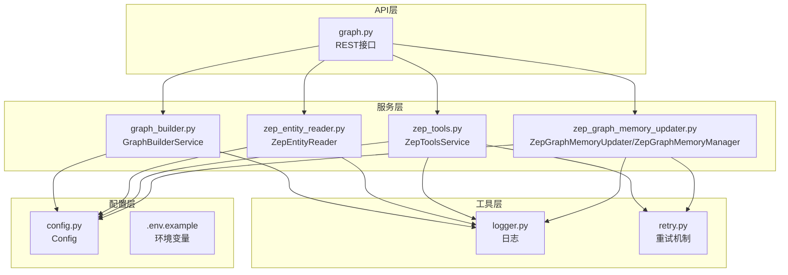
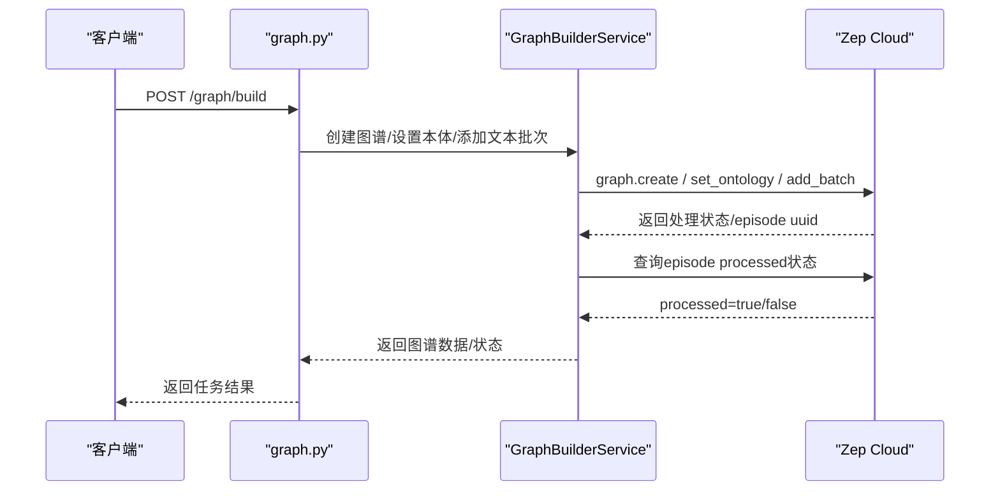
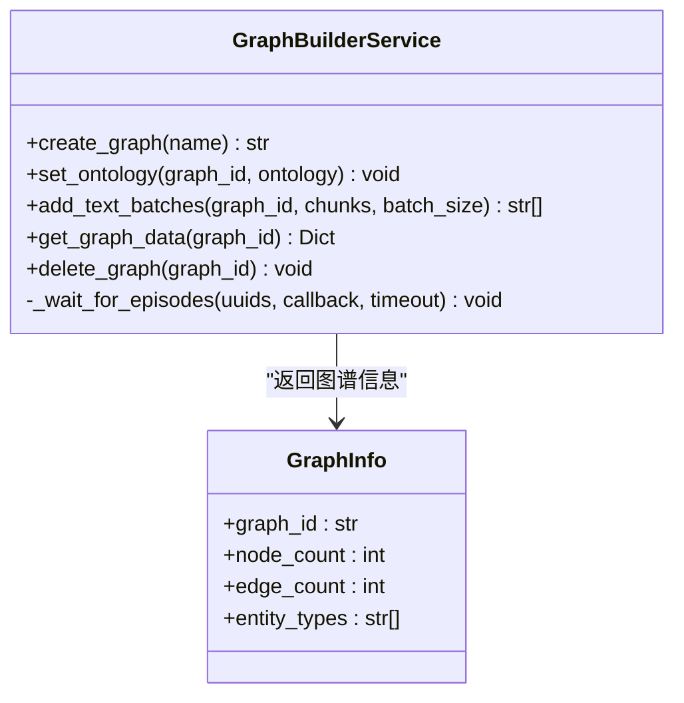
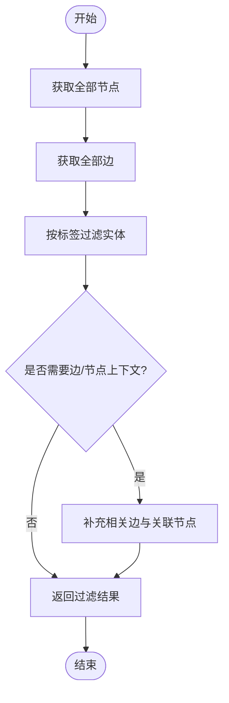
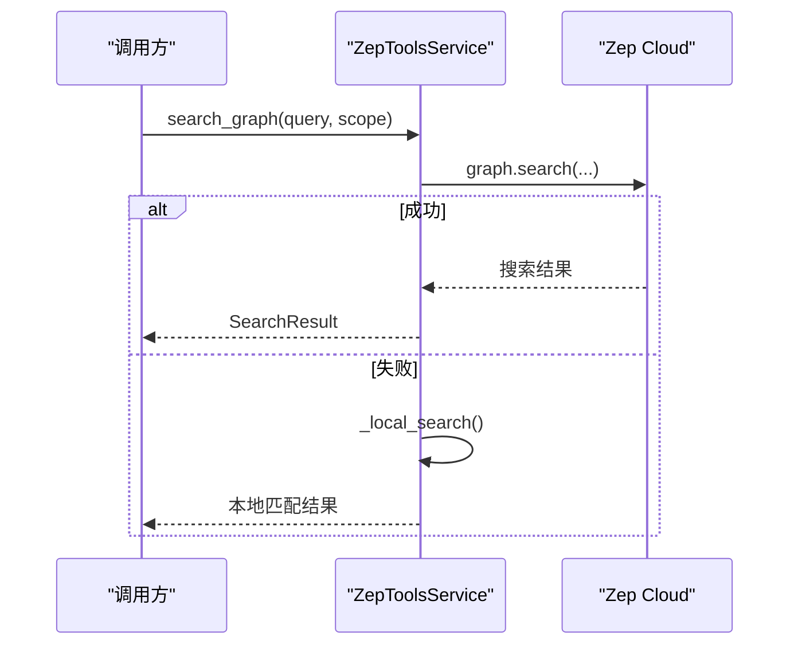
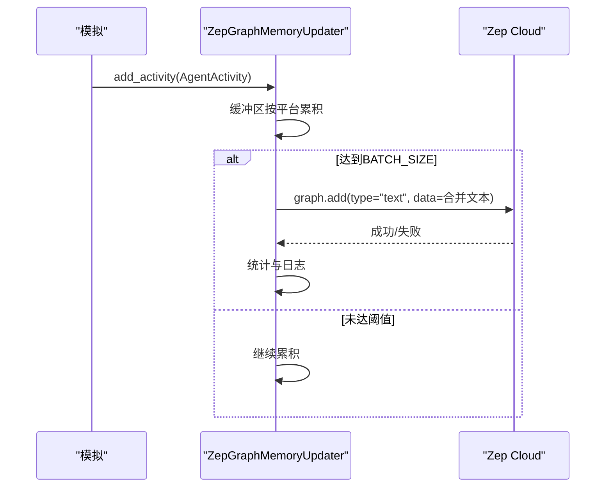
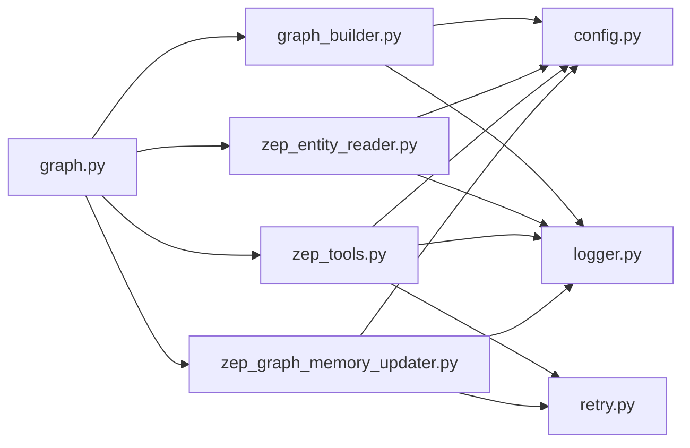
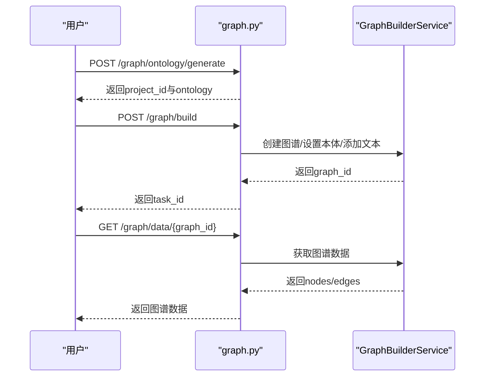

# Zep图谱集成

<cite>
**本文档引用的文件**
- [zep_tools.py](file://backend/app/services/zep_tools.py)
- [zep_graph_memory_updater.py](file://backend/app/services/zep_graph_memory_updater.py)
- [zep_entity_reader.py](file://backend/app/services/zep_entity_reader.py)
- [graph_builder.py](file://backend/app/services/graph_builder.py)
- [graph.py](file://backend/app/api/graph.py)
- [config.py](file://backend/app/config.py)
- [logger.py](file://backend/app/utils/logger.py)
- [retry.py](file://backend/app/utils/retry.py)
- [.env.example](file://.env.example)
</cite>

## 目录
1. [简介](#简介)
2. [项目结构](#项目结构)
3. [核心组件](#核心组件)
4. [架构总览](#架构总览)
5. [详细组件分析](#详细组件分析)
6. [依赖关系分析](#依赖关系分析)
7. [性能考量](#性能考量)
8. [故障排除指南](#故障排除指南)
9. [结论](#结论)
10. [附录](#附录)

## 简介
本文件面向MiroFish项目中的Zep图谱集成，系统性阐述Zep Cloud API的集成架构与实现细节，涵盖客户端初始化、认证机制、连接管理与错误处理；动态本体设置的实现原理（实体类动态创建、属性映射、关系定义与保留名称处理）；Zep图谱操作的核心能力（图谱创建、数据添加、查询获取与清理删除）；并提供从本体定义到图谱数据的完整操作示例流程。此外，文档还包含API限制处理、重试机制、性能优化与监控策略，以及最佳实践与故障排除建议。

## 项目结构
Zep图谱集成主要分布在以下模块：
- 服务层：图谱构建、实体读取、检索工具、记忆更新器
- API层：对外提供本体生成与图谱构建、数据查询、删除等REST接口
- 工具层：日志、重试机制
- 配置层：环境变量与密钥管理

**图表来源**
- [graph.py](file://backend/app/api/graph.py#L1-L618)
- [graph_builder.py](file://backend/app/services/graph_builder.py#L1-L500)
- [zep_entity_reader.py](file://backend/app/services/zep_entity_reader.py#L1-L445)
- [zep_tools.py](file://backend/app/services/zep_tools.py#L1-L800)
- [zep_graph_memory_updater.py](file://backend/app/services/zep_graph_memory_updater.py#L1-L549)
- [config.py](file://backend/app/config.py#L1-L76)
- [logger.py](file://backend/app/utils/logger.py#L1-L127)
- [retry.py](file://backend/app/utils/retry.py#L1-L239)
- [.env.example](file://.env.example#L1-L16)

**章节来源**
- [graph.py](file://backend/app/api/graph.py#L1-L618)
- [config.py](file://backend/app/config.py#L1-L76)

## 核心组件
- GraphBuilderService：负责创建图谱、设置动态本体、分批添加文本、等待处理完成、获取图谱数据与删除图谱。
- ZepEntityReader：从Zep读取节点、边，按预定义实体类型过滤，补充边与关联节点信息。
- ZepToolsService：提供图谱搜索、节点/边查询、实体类型筛选、实体摘要等检索工具，内置重试与降级策略。
- ZepGraphMemoryUpdater：监控模拟活动，按平台分组批量写入Zep图谱，具备后台线程与统计信息。
- ZepGraphMemoryManager：管理多个模拟的图谱记忆更新器实例。
- 配置与日志：统一从.env加载Zep API Key，提供日志与重试机制。

**章节来源**
- [graph_builder.py](file://backend/app/services/graph_builder.py#L38-L500)
- [zep_entity_reader.py](file://backend/app/services/zep_entity_reader.py#L70-L445)
- [zep_tools.py](file://backend/app/services/zep_tools.py#L377-L800)
- [zep_graph_memory_updater.py](file://backend/app/services/zep_graph_memory_updater.py#L201-L549)
- [config.py](file://backend/app/config.py#L20-L76)
- [logger.py](file://backend/app/utils/logger.py#L1-L127)
- [retry.py](file://backend/app/utils/retry.py#L1-L239)

## 架构总览
Zep集成采用“API层-服务层-工具层-配置层”的分层设计。API层接收请求并调度服务层；服务层通过Zep SDK与云服务交互；工具层提供日志与重试保障；配置层集中管理密钥与参数。

**图表来源**
- [graph.py](file://backend/app/api/graph.py#L259-L524)
- [graph_builder.py](file://backend/app/services/graph_builder.py#L186-L494)

## 详细组件分析

### 图谱构建服务（GraphBuilderService）
- 初始化与认证：从配置读取ZEP_API_KEY并创建Zep客户端。
- 创建图谱：生成唯一graph_id并创建图谱。
- 动态本体设置：
  - 识别Zep保留名称并进行安全转换。
  - 动态创建实体类与边类，映射属性与类型注解。
  - 设置实体与关系的source/target组合。
- 数据添加：将文本分块，构造EpisodeData，批量发送至Zep。
- 状态等待：轮询每个episode的processed状态，直至完成。
- 数据获取与删除：获取节点/边详情，删除图谱。

**图表来源**
- [graph_builder.py](file://backend/app/services/graph_builder.py#L38-L500)

**章节来源**
- [graph_builder.py](file://backend/app/services/graph_builder.py#L186-L494)
- [graph.py](file://backend/app/api/graph.py#L259-L524)

### 实体读取与过滤（ZepEntityReader）
- 获取节点/边：带重试机制读取全部节点与边。
- 实体过滤：仅保留labels中除“Entity”“Node”之外的自定义标签。
- 上下文增强：为每个实体补充相关边与关联节点信息。
- 按类型获取：支持按实体类型筛选。

**图表来源**
- [zep_entity_reader.py](file://backend/app/services/zep_entity_reader.py#L222-L338)

**章节来源**
- [zep_entity_reader.py](file://backend/app/services/zep_entity_reader.py#L70-L445)

### 检索工具（ZepToolsService）
- 搜索：优先使用Zep Cloud Search API，失败时降级为本地关键词匹配。
- 节点/边查询：获取全部节点、全部边、节点详情、节点相关边。
- 实体筛选：按类型获取实体，生成实体摘要。
- 重试机制：统一的带指数退避与抖动的重试策略。

**图表来源**
- [zep_tools.py](file://backend/app/services/zep_tools.py#L441-L625)

**章节来源**
- [zep_tools.py](file://backend/app/services/zep_tools.py#L377-L800)

### 记忆更新器（ZepGraphMemoryUpdater）
- 活动采集：从模拟actions日志解析Agent活动，过滤无效事件。
- 批量写入：按平台分组累积到BATCH_SIZE后合并为一条文本发送。
- 后台线程：独立线程持续消费队列，避免阻塞主流程。
- 统计与监控：记录总活动数、发送批次数、失败次数、跳过次数等。

**图表来源**
- [zep_graph_memory_updater.py](file://backend/app/services/zep_graph_memory_updater.py#L305-L453)

**章节来源**
- [zep_graph_memory_updater.py](file://backend/app/services/zep_graph_memory_updater.py#L201-L549)

### 记忆管理器（ZepGraphMemoryManager）
- 多模拟实例管理：为每个simulation_id创建独立更新器实例。
- 生命周期管理：创建、获取、停止、批量停止。
- 统计汇总：聚合所有更新器的运行状态与统计数据。

**章节来源**
- [zep_graph_memory_updater.py](file://backend/app/services/zep_graph_memory_updater.py#L473-L549)

## 依赖关系分析
- 组件耦合：服务层依赖配置与工具层；API层编排服务层；服务层之间低耦合，通过Zep SDK交互。
- 外部依赖：Zep Cloud SDK、OpenAI SDK（用于LLM辅助）、Flask蓝图。
- 潜在风险：重试与退避策略需结合Zep速率限制；批量写入需控制频率以避免限流。

**图表来源**
- [graph.py](file://backend/app/api/graph.py#L1-L618)
- [graph_builder.py](file://backend/app/services/graph_builder.py#L1-L500)
- [zep_entity_reader.py](file://backend/app/services/zep_entity_reader.py#L1-L445)
- [zep_tools.py](file://backend/app/services/zep_tools.py#L1-L800)
- [zep_graph_memory_updater.py](file://backend/app/services/zep_graph_memory_updater.py#L1-L549)
- [config.py](file://backend/app/config.py#L1-L76)
- [logger.py](file://backend/app/utils/logger.py#L1-L127)
- [retry.py](file://backend/app/utils/retry.py#L1-L239)

**章节来源**
- [graph.py](file://backend/app/api/graph.py#L1-L618)
- [config.py](file://backend/app/config.py#L1-L76)

## 性能考量
- 批量写入与节流：图谱构建与记忆更新均采用批量发送与固定间隔，避免请求过快导致限流。
- 重试与退避：统一的指数退避与抖动策略，降低并发峰值与抖动影响。
- 本地降级：Search API失败时自动切换本地关键词匹配，保证基本可用性。
- 异步与后台线程：构建任务与记忆更新器使用线程池与后台线程，提升吞吐与响应性。
- 监控与日志：详细日志记录与统计指标，便于定位瓶颈与评估性能。

[本节为通用性能讨论，无需特定文件引用]

## 故障排除指南
- 配置缺失
  - 现象：初始化时报错提示未配置ZEP_API_KEY。
  - 处理：在.env中设置ZEP_API_KEY，或通过环境变量注入。
- API调用失败
  - 现象：Search/Node/Edge等API调用抛出异常。
  - 处理：检查网络连通性与配额；查看日志中的重试记录；必要时启用本地降级。
- 写入限流
  - 现象：批量写入频繁失败或延迟增大。
  - 处理：调整BATCH_SIZE与SEND_INTERVAL；观察Zep返回状态并适当增加退避时间。
- 本体设置异常
  - 现象：动态本体设置报错或字段冲突。
  - 处理：确认属性名未使用Zep保留名称；确保属性类型注解正确。
- 记忆更新器异常
  - 现象：后台线程卡住或统计异常。
  - 处理：检查队列与缓冲区状态；查看失败批次数与跳过事件；重启更新器实例。

**章节来源**
- [config.py](file://backend/app/config.py#L66-L76)
- [zep_tools.py](file://backend/app/services/zep_tools.py#L418-L440)
- [zep_graph_memory_updater.py](file://backend/app/services/zep_graph_memory_updater.py#L390-L428)
- [graph_builder.py](file://backend/app/services/graph_builder.py#L209-L216)

## 结论
MiroFish的Zep图谱集成通过清晰的分层架构与完善的工具链，实现了从本体定义到图谱构建、数据添加、查询检索与动态记忆更新的全链路能力。动态本体设置确保了实体与关系的灵活扩展；重试与降级策略提升了系统鲁棒性；后台线程与批量写入兼顾了性能与稳定性。建议在生产环境中结合监控指标与限流策略，持续优化批处理大小与退避参数，以获得更佳的吞吐与可靠性。

[本节为总结性内容，无需特定文件引用]

## 附录

### API限制与重试策略
- 速率限制：通过批量大小与发送间隔控制请求频率；遇到429/5xx时启用指数退避。
- 重试参数：最大重试次数、初始延迟、最大延迟、退避因子与抖动开关。
- 降级策略：Search API失败时切换本地关键词匹配；节点/边查询失败时记录告警并返回空结果。

**章节来源**
- [zep_tools.py](file://backend/app/services/zep_tools.py#L418-L440)
- [zep_tools.py](file://backend/app/services/zep_tools.py#L523-L625)
- [retry.py](file://backend/app/utils/retry.py#L15-L77)

### 动态本体设置实现要点
- 保留名称处理：将与Zep保留字段同名的属性名转换为安全形式。
- 属性映射：实体属性使用EntityText类型，边属性使用字符串类型。
- 关系定义：支持source/target组合约束，确保关系方向与类型一致。

**章节来源**
- [graph_builder.py](file://backend/app/services/graph_builder.py#L209-L285)

### 完整操作示例流程（从本体到数据）
- 步骤1：上传文档并生成本体
  - 调用接口：POST /graph/ontology/generate
  - 输出：project_id、ontology、analysis_summary
- 步骤2：构建图谱
  - 调用接口：POST /graph/build
  - 输出：task_id、graph_id
- 步骤3：查询图谱数据
  - 调用接口：GET /graph/data/{graph_id}
  - 输出：nodes、edges、统计信息
- 步骤4：清理图谱
  - 调用接口：DELETE /graph/delete/{graph_id}

**图表来源**
- [graph.py](file://backend/app/api/graph.py#L121-L524)

**章节来源**
- [graph.py](file://backend/app/api/graph.py#L121-L524)

### 最佳实践
- 配置管理：集中使用.env管理密钥与参数，避免硬编码。
- 错误处理：统一使用重试与降级策略，记录详细日志。
- 性能优化：合理设置批量大小与发送间隔，避免触发限流。
- 监控策略：收集统计指标（发送批次数、失败次数、队列长度），定期巡检。

**章节来源**
- [.env.example](file://.env.example#L1-L16)
- [logger.py](file://backend/app/utils/logger.py#L1-L127)
- [retry.py](file://backend/app/utils/retry.py#L1-L239)
- [zep_graph_memory_updater.py](file://backend/app/services/zep_graph_memory_updater.py#L215-L230)