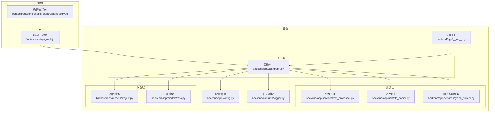
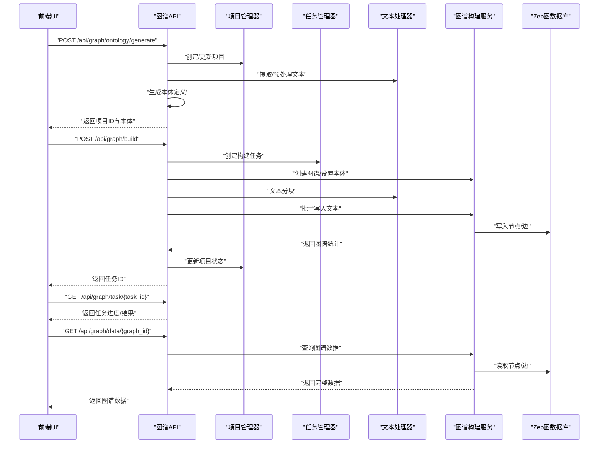
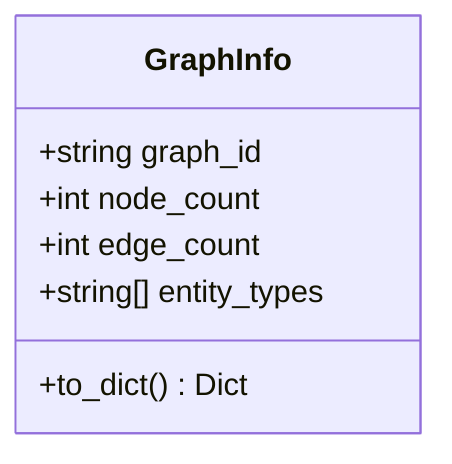
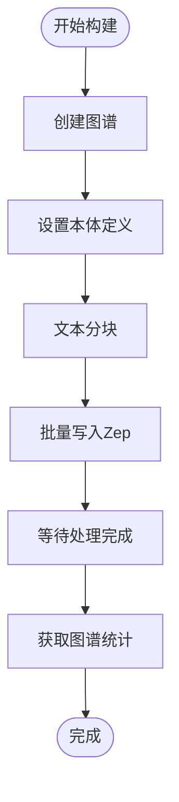
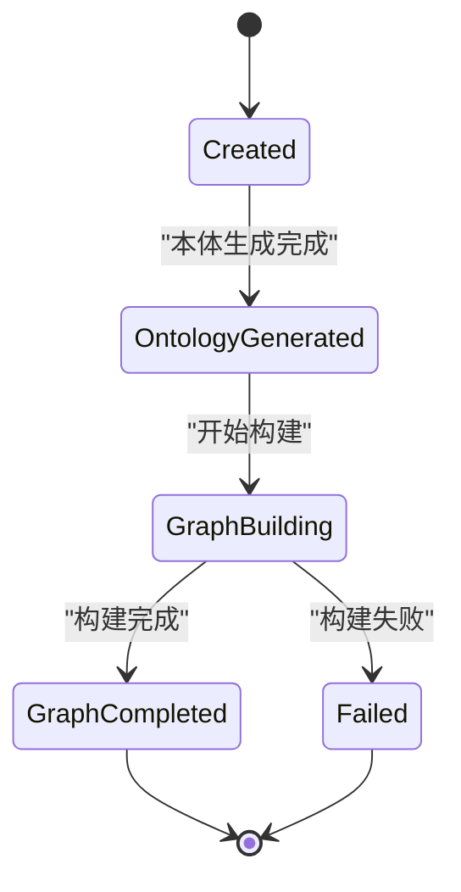
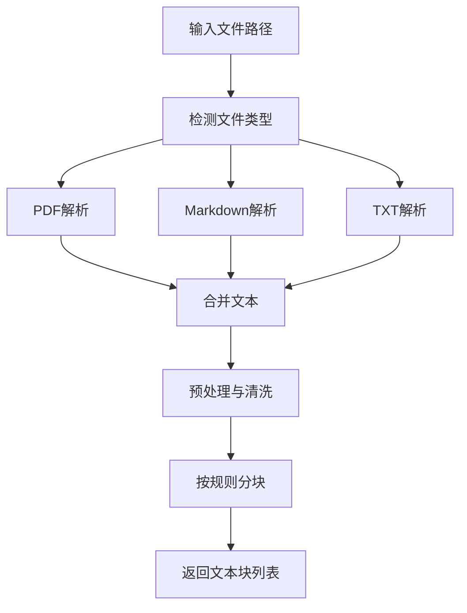
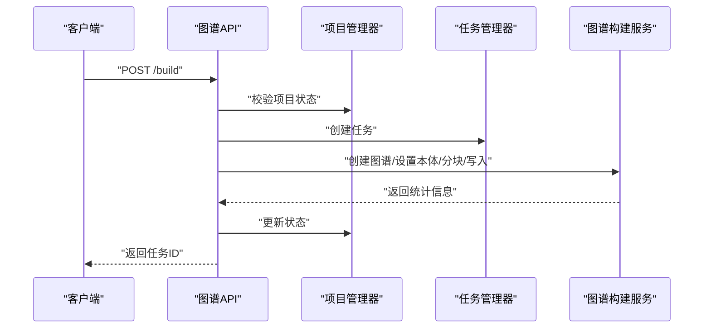
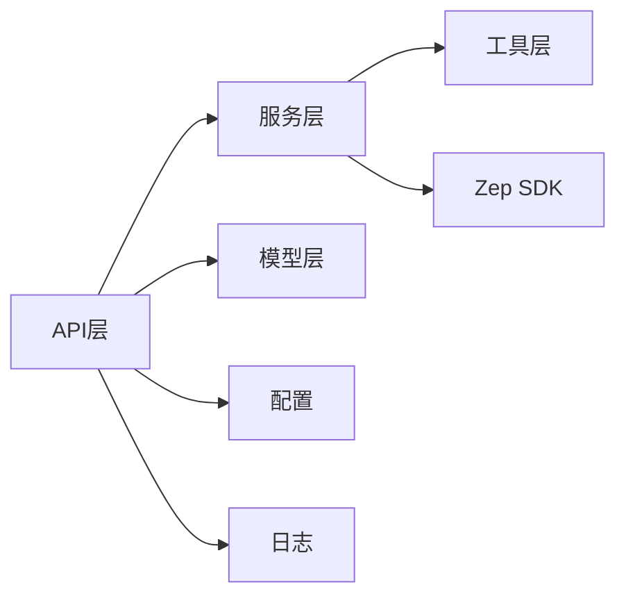

# 图谱数据管理

<cite>
**本文引用的文件**
- [backend/app/services/graph_builder.py](file://backend/app/services/graph_builder.py)
- [backend/app/models/project.py](file://backend/app/models/project.py)
- [backend/app/models/task.py](file://backend/app/models/task.py)
- [backend/app/api/graph.py](file://backend/app/api/graph.py)
- [backend/app/utils/file_parser.py](file://backend/app/utils/file_parser.py)
- [backend/app/services/text_processor.py](file://backend/app/services/text_processor.py)
- [backend/app/config.py](file://backend/app/config.py)
- [backend/app/utils/logger.py](file://backend/app/utils/logger.py)
- [backend/run.py](file://backend/run.py)
- [backend/app/__init__.py](file://backend/app/__init__.py)
- [frontend/src/api/graph.js](file://frontend/src/api/graph.js)
- [frontend/src/components/Step1GraphBuild.vue](file://frontend/src/components/Step1GraphBuild.vue)
- [README.md](file://README.md)
</cite>

## 目录
1. [简介](#简介)
2. [项目结构](#项目结构)
3. [核心组件](#核心组件)
4. [架构总览](#架构总览)
5. [组件详解](#组件详解)
6. [依赖关系分析](#依赖关系分析)
7. [性能考量](#性能考量)
8. [故障排查指南](#故障排查指南)
9. [结论](#结论)
10. [附录](#附录)

## 简介
本文件面向开发者与运维人员，系统性梳理 MiroFish 图谱数据管理子系统的实现与最佳实践。重点覆盖以下方面：
- 图谱数据的存储与管理策略：项目上下文、任务状态、本地持久化与外部图数据库集成
- 数据结构设计：GraphInfo 的封装、节点/边统计、实体类型汇总与元数据管理
- 查询与导出能力：完整数据提取、增量更新、格式转换与性能优化
- 并发与一致性：任务状态机、线程安全与幂等设计
- 可靠性与可观测性：日志体系、错误处理与健康检查
- 前后端协作：API 流程、前端可视化准备与用户交互

## 项目结构
后端采用 Flask 应用工厂模式，按领域拆分模块：
- API 层：对外暴露图谱构建、任务查询、数据获取等接口
- 服务层：负责业务编排，如图谱构建、文本处理、本体设置等
- 模型层：项目上下文与任务状态的持久化与内存管理
- 工具层：文件解析、文本处理、日志与配置
- 前端：与后端 API 协作，驱动构建流程与可视化

**图表来源**
- [backend/app/__init__.py](file://backend/app/__init__.py#L19-L81)
- [backend/app/api/graph.py](file://backend/app/api/graph.py#L1-L618)
- [backend/app/services/graph_builder.py](file://backend/app/services/graph_builder.py#L1-L500)
- [backend/app/services/text_processor.py](file://backend/app/services/text_processor.py#L1-L72)
- [backend/app/utils/file_parser.py](file://backend/app/utils/file_parser.py#L1-L190)
- [backend/app/models/project.py](file://backend/app/models/project.py#L1-L306)
- [backend/app/models/task.py](file://backend/app/models/task.py#L1-L185)
- [backend/app/config.py](file://backend/app/config.py#L1-L76)
- [backend/app/utils/logger.py](file://backend/app/utils/logger.py#L1-L127)
- [frontend/src/api/graph.js](file://frontend/src/api/graph.js#L1-L71)
- [frontend/src/components/Step1GraphBuild.vue](file://frontend/src/components/Step1GraphBuild.vue#L1-L699)

**章节来源**
- [backend/app/__init__.py](file://backend/app/__init__.py#L19-L81)
- [backend/app/api/graph.py](file://backend/app/api/graph.py#L1-L618)
- [backend/app/services/graph_builder.py](file://backend/app/services/graph_builder.py#L1-L500)
- [backend/app/services/text_processor.py](file://backend/app/services/text_processor.py#L1-L72)
- [backend/app/utils/file_parser.py](file://backend/app/utils/file_parser.py#L1-L190)
- [backend/app/models/project.py](file://backend/app/models/project.py#L1-L306)
- [backend/app/models/task.py](file://backend/app/models/task.py#L1-L185)
- [backend/app/config.py](file://backend/app/config.py#L1-L76)
- [backend/app/utils/logger.py](file://backend/app/utils/logger.py#L1-L127)
- [frontend/src/api/graph.js](file://frontend/src/api/graph.js#L1-L71)
- [frontend/src/components/Step1GraphBuild.vue](file://frontend/src/components/Step1GraphBuild.vue#L1-L699)

## 核心组件
- GraphInfo：封装图谱统计信息（节点数、边数、实体类型集合），用于快速概览与导出
- GraphBuilderService：协调 Zep 图谱创建、本体设置、文本分块与批量写入、进度回调与最终统计
- Project 与 ProjectManager：项目生命周期管理、文件与文本持久化、状态机推进
- Task 与 TaskManager：长任务状态管理（线程安全）、进度与结果记录、清理策略
- FileParser 与 TextProcessor：多格式文件解析、文本预处理与分块策略
- API 层：统一对外接口，串联服务与模型，提供任务查询、图谱数据获取与删除

**章节来源**
- [backend/app/services/graph_builder.py](file://backend/app/services/graph_builder.py#L21-L36)
- [backend/app/services/graph_builder.py](file://backend/app/services/graph_builder.py#L38-L500)
- [backend/app/models/project.py](file://backend/app/models/project.py#L26-L98)
- [backend/app/models/project.py](file://backend/app/models/project.py#L101-L306)
- [backend/app/models/task.py](file://backend/app/models/task.py#L22-L52)
- [backend/app/models/task.py](file://backend/app/models/task.py#L54-L185)
- [backend/app/utils/file_parser.py](file://backend/app/utils/file_parser.py#L61-L190)
- [backend/app/services/text_processor.py](file://backend/app/services/text_processor.py#L9-L72)
- [backend/app/api/graph.py](file://backend/app/api/graph.py#L1-L618)

## 架构总览
后端以 Flask 蓝图组织 API，围绕“项目上下文 + 任务状态 + 服务编排”的模式运行。前端通过封装的 API 与后端交互，驱动本体生成、图谱构建与数据获取。

**图表来源**
- [backend/app/api/graph.py](file://backend/app/api/graph.py#L121-L518)
- [backend/app/services/graph_builder.py](file://backend/app/services/graph_builder.py#L52-L185)
- [backend/app/services/text_processor.py](file://backend/app/services/text_processor.py#L18-L34)
- [backend/app/models/project.py](file://backend/app/models/project.py#L133-L166)
- [backend/app/models/task.py](file://backend/app/models/task.py#L73-L99)

**章节来源**
- [backend/app/api/graph.py](file://backend/app/api/graph.py#L121-L518)
- [backend/app/services/graph_builder.py](file://backend/app/services/graph_builder.py#L52-L185)
- [backend/app/services/text_processor.py](file://backend/app/services/text_processor.py#L18-L34)
- [backend/app/models/project.py](file://backend/app/models/project.py#L133-L166)
- [backend/app/models/task.py](file://backend/app/models/task.py#L73-L99)

## 组件详解

### GraphInfo 数据封装
- 字段：graph_id、node_count、edge_count、entity_types
- 用途：快速获取图谱规模与实体类型分布；用于导出与前端展示
- 输出：to_dict 便于序列化与 API 返回

**图表来源**
- [backend/app/services/graph_builder.py](file://backend/app/services/graph_builder.py#L21-L36)

**章节来源**
- [backend/app/services/graph_builder.py](file://backend/app/services/graph_builder.py#L21-L36)

### 图谱构建服务（GraphBuilderService）
- 异步构建：创建任务、后台线程执行、进度回调
- 本体设置：动态构造实体/边类型，兼容 Zep 的字段约束
- 文本分块与批量写入：按批处理，避免请求过快
- 等待与统计：轮询 episode 处理状态，最终统计节点/边与实体类型

**图表来源**
- [backend/app/services/graph_builder.py](file://backend/app/services/graph_builder.py#L95-L185)
- [backend/app/services/graph_builder.py](file://backend/app/services/graph_builder.py#L287-L339)
- [backend/app/services/graph_builder.py](file://backend/app/services/graph_builder.py#L340-L395)
- [backend/app/services/graph_builder.py](file://backend/app/services/graph_builder.py#L396-L418)

**章节来源**
- [backend/app/services/graph_builder.py](file://backend/app/services/graph_builder.py#L38-L500)

### 项目上下文与任务管理
- Project/ProjectManager：项目生命周期（创建、保存、列举、删除、文件与文本持久化）
- Task/TaskManager：任务状态机（PENDING/PROCESSING/COMPLETED/FAILED）、线程安全、清理策略

**图表来源**
- [backend/app/models/project.py](file://backend/app/models/project.py#L17-L24)
- [backend/app/models/project.py](file://backend/app/models/project.py#L101-L306)
- [backend/app/models/task.py](file://backend/app/models/task.py#L14-L20)
- [backend/app/models/task.py](file://backend/app/models/task.py#L54-L185)

**章节来源**
- [backend/app/models/project.py](file://backend/app/models/project.py#L26-L98)
- [backend/app/models/project.py](file://backend/app/models/project.py#L101-L306)
- [backend/app/models/task.py](file://backend/app/models/task.py#L22-L52)
- [backend/app/models/task.py](file://backend/app/models/task.py#L54-L185)

### 文件解析与文本处理
- FileParser：PDF/Markdown/TXT 多格式解析，自动编码检测与回退
- TextProcessor：文本预处理、分块策略（句号/换行等边界）

**图表来源**
- [backend/app/utils/file_parser.py](file://backend/app/utils/file_parser.py#L61-L190)
- [backend/app/services/text_processor.py](file://backend/app/services/text_processor.py#L18-L34)

**章节来源**
- [backend/app/utils/file_parser.py](file://backend/app/utils/file_parser.py#L61-L190)
- [backend/app/services/text_processor.py](file://backend/app/services/text_processor.py#L9-L72)

### API 接口与流程
- 本体生成：上传文件与需求，提取文本，调用 LLM 生成本体，保存项目状态
- 图谱构建：校验项目状态，创建任务，后台执行构建，更新项目与任务状态
- 任务查询：返回任务进度、消息、结果或错误
- 数据获取：从 Zep 读取节点/边，补充名称与时间戳，返回完整数据

**图表来源**
- [backend/app/api/graph.py](file://backend/app/api/graph.py#L259-L518)
- [backend/app/models/project.py](file://backend/app/models/project.py#L315-L372)
- [backend/app/models/task.py](file://backend/app/models/task.py#L73-L99)
- [backend/app/services/graph_builder.py](file://backend/app/services/graph_builder.py#L52-L185)

**章节来源**
- [backend/app/api/graph.py](file://backend/app/api/graph.py#L121-L518)

## 依赖关系分析
- 外部依赖：Zep Cloud SDK 用于图谱创建、本体设置与数据读写
- 内部耦合：API 层依赖服务层与模型层；服务层依赖工具层；应用工厂统一注册蓝图与中间件
- 配置与日志：集中于 Config 与 Logger，贯穿各模块

**图表来源**
- [backend/app/api/graph.py](file://backend/app/api/graph.py#L1-L618)
- [backend/app/services/graph_builder.py](file://backend/app/services/graph_builder.py#L13-L50)
- [backend/app/config.py](file://backend/app/config.py#L20-L76)
- [backend/app/utils/logger.py](file://backend/app/utils/logger.py#L30-L88)

**章节来源**
- [backend/app/api/graph.py](file://backend/app/api/graph.py#L1-L618)
- [backend/app/services/graph_builder.py](file://backend/app/services/graph_builder.py#L13-L50)
- [backend/app/config.py](file://backend/app/config.py#L20-L76)
- [backend/app/utils/logger.py](file://backend/app/utils/logger.py#L30-L88)

## 性能考量
- 文本分块与批处理：合理设置 chunk_size 与 batch_size，平衡吞吐与延迟
- 轮询节流：批量写入后适度 sleep，避免请求过快导致限流
- 进度回调：将耗时步骤映射到 0-100 的进度区间，提升用户体验
- 日志与监控：统一日志格式与级别，结合任务状态输出关键指标

[本节为通用指导，无需具体文件分析]

## 故障排查指南
- 配置校验：启动前验证 LLM/Zep 等关键配置是否存在
- 任务失败：检查任务管理器中的错误信息与堆栈，定位具体阶段
- 文件解析：确认文件格式与编码，必要时启用回退策略
- 健康检查：通过 /health 接口确认服务可用性

**章节来源**
- [backend/run.py](file://backend/run.py#L25-L45)
- [backend/app/config.py](file://backend/app/config.py#L67-L75)
- [backend/app/models/task.py](file://backend/app/models/task.py#L172-L184)
- [backend/app/utils/file_parser.py](file://backend/app/utils/file_parser.py#L11-L58)
- [backend/app/__init__.py](file://backend/app/__init__.py#L72-L78)

## 结论
本系统通过清晰的模块划分与任务驱动的异步流程，实现了从文档到图谱的自动化构建与管理。GraphInfo 与 Project/Task 模型提供了良好的可观测性与可维护性，配合 FileParser 与 TextProcessor 的稳健实现，能够满足多样化的图谱数据管理需求。建议在生产环境中进一步完善缓存策略、并发控制与备份恢复方案，以提升整体可靠性与性能。

[本节为总结性内容，无需具体文件分析]

## 附录

### 数据完整性与一致性
- 项目状态机：严格的状态流转确保数据一致性
- 任务幂等：任务管理器提供线程安全与清理策略
- 失败回滚：构建失败时回写错误信息并更新项目状态

**章节来源**
- [backend/app/models/project.py](file://backend/app/models/project.py#L17-L24)
- [backend/app/models/task.py](file://backend/app/models/task.py#L115-L163)
- [backend/app/api/graph.py](file://backend/app/api/graph.py#L490-L505)

### 并发访问控制
- 任务管理器采用锁保护共享状态
- Flask 应用工厂启用 CORS 与请求/响应日志中间件

**章节来源**
- [backend/app/models/task.py](file://backend/app/models/task.py#L60-L71)
- [backend/app/__init__.py](file://backend/app/__init__.py#L42-L63)

### 备份与恢复策略
- 项目元数据与文件存储在本地目录，定期备份该目录
- 图谱数据存储于 Zep，遵循其备份与导出能力

**章节来源**
- [backend/app/models/project.py](file://backend/app/models/project.py#L104-L131)
- [backend/app/api/graph.py](file://backend/app/api/graph.py#L592-L618)

### 前后端协作示例
- 前端通过封装的 API 调用后端接口，驱动构建流程与任务查询
- UI 组件展示本体生成、构建进度与图谱统计，支持查看详情弹窗

**章节来源**
- [frontend/src/api/graph.js](file://frontend/src/api/graph.js#L8-L71)
- [frontend/src/components/Step1GraphBuild.vue](file://frontend/src/components/Step1GraphBuild.vue#L1-L699)

### 快速开始与部署参考
- 环境变量配置、依赖安装与启动命令详见项目说明

**章节来源**
- [README.md](file://README.md#L110-L158)