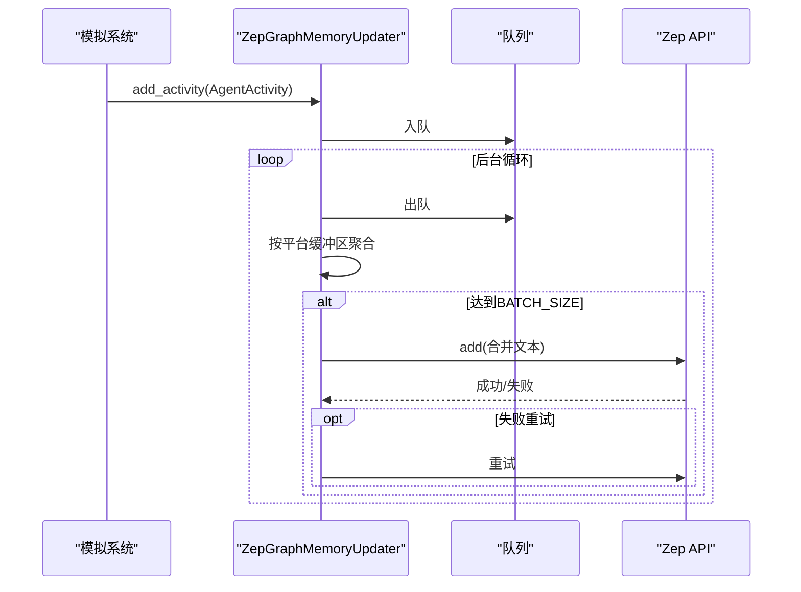

# 图谱构建系统

<cite>
**本文档引用的文件**
- [graph_builder.py](file://backend/app/services/graph_builder.py)
- [text_processor.py](file://backend/app/services/text_processor.py)
- [zep_graph_memory_updater.py](file://backend/app/services/zep_graph_memory_updater.py)
- [graph.py](file://backend/app/api/graph.py)
- [task.py](file://backend/app/models/task.py)
- [project.py](file://backend/app/models/project.py)
- [file_parser.py](file://backend/app/utils/file_parser.py)
- [config.py](file://backend/app/config.py)
- [graph.js](file://frontend/src/api/graph.js)
- [Step1GraphBuild.vue](file://frontend/src/components/Step1GraphBuild.vue)
- [Step2EnvSetup.vue](file://frontend/src/components/Step2EnvSetup.vue)
- [README.md](file://README.md)
</cite>

## 目录
1. [引言](#引言)
2. [项目结构](#项目结构)
3. [核心组件](#核心组件)
4. [架构总览](#架构总览)
5. [详细组件分析](#详细组件分析)
6. [依赖关系分析](#依赖关系分析)
7. [性能考量](#性能考量)
8. [故障排除指南](#故障排除指南)
9. [结论](#结论)
10. [附录](#附录)

## 引言
本文件面向开发者与集成人员，系统性阐述 MiroFish 图谱构建系统的设计与实现。文档聚焦以下目标：
- 深入解释图谱构建的完整流程：本体生成、文本预处理、异步图谱构建、Zep 图谱集成
- 详解 GraphBuilderService 类的设计架构、异步任务管理机制、文本分块策略与批量处理优化
- 阐述本体定义的数据结构、实体类型与关系类型的动态生成过程
- 提供 API 调用示例、错误处理机制与性能优化策略
- 给出最佳实践、常见问题解决方案与扩展性考虑

## 项目结构
后端采用 Flask + Python 的服务端架构，前端使用 Vue3 + Vite。核心模块围绕“项目上下文管理”“任务状态管理”“图谱构建服务”“Zep 图谱更新器”展开；前端通过 API 层与后端交互，提供可视化的工作流与状态展示。

图表来源
- [graph.py](file://backend/app/api/graph.py#L1-L618)
- [task.py](file://backend/app/models/task.py#L54-L185)
- [project.py](file://backend/app/models/project.py#L101-L306)
- [config.py](file://backend/app/config.py#L20-L76)
- [text_processor.py](file://backend/app/services/text_processor.py#L9-L72)
- [file_parser.py](file://backend/app/utils/file_parser.py#L61-L190)
- [graph_builder.py](file://backend/app/services/graph_builder.py#L38-L500)
- [zep_graph_memory_updater.py](file://backend/app/services/zep_graph_memory_updater.py#L201-L549)

章节来源
- [README.md](file://README.md#L81-L88)

## 核心组件
- 项目上下文管理（ProjectManager）：负责项目生命周期的状态持久化与元数据管理，包括文件、提取文本、本体、图谱ID、任务ID等。
- 任务状态管理（TaskManager）：提供线程安全的任务创建、更新、完成与失败标记，支持进度与结果回传。
- 文本处理（TextProcessor/FileParser）：提供文件解析、文本预处理、分块策略与统计信息。
- 图谱构建服务（GraphBuilderService）：封装 Zep API 调用，负责创建图谱、设置本体、分批添加文本、等待处理完成、获取图谱数据。
- Zep 图谱记忆更新器（ZepGraphMemoryUpdater）：在模拟运行期间，将 Agent 活动实时写入 Zep 图谱，支持批量发送与重试。
- API 路由（graph.py）：对外暴露本体生成与图谱构建接口，协调项目状态、任务进度与服务调用。

章节来源
- [project.py](file://backend/app/models/project.py#L101-L306)
- [task.py](file://backend/app/models/task.py#L54-L185)
- [text_processor.py](file://backend/app/services/text_processor.py#L9-L72)
- [file_parser.py](file://backend/app/utils/file_parser.py#L61-L190)
- [graph_builder.py](file://backend/app/services/graph_builder.py#L38-L500)
- [zep_graph_memory_updater.py](file://backend/app/services/zep_graph_memory_updater.py#L201-L549)
- [graph.py](file://backend/app/api/graph.py#L1-L618)

## 架构总览
系统采用“前端可视化 + 后端服务 + Zep 图谱”的三层架构。前端通过 API 层发起本体生成与图谱构建请求，后端以项目上下文与任务状态为载体，驱动服务层完成图谱构建与数据获取；同时，Zep 图谱记忆更新器在模拟运行期持续将 Agent 活动写入图谱，形成时序记忆。

图表来源
- [graph.py](file://backend/app/api/graph.py#L121-L524)
- [graph_builder.py](file://backend/app/services/graph_builder.py#L52-L185)

## 详细组件分析

### GraphBuilderService 设计与实现
GraphBuilderService 是图谱构建的核心服务，负责：
- 创建 Zep 图谱
- 动态设置本体（实体类型、关系类型、属性、连接）
- 文本分块与批量发送
- 等待处理完成与获取图谱信息
- 提供图谱数据导出与删除能力

图表来源
- [graph_builder.py](file://backend/app/services/graph_builder.py#L21-L500)

章节来源
- [graph_builder.py](file://backend/app/services/graph_builder.py#L38-L500)

#### 异步任务管理机制
- 任务创建：通过 TaskManager.create_task 生成任务ID与元数据。
- 进度回调：在构建流程中分阶段更新任务进度与消息，支持外部轮询查询。
- 完成/失败：成功时写入结果，失败时记录错误堆栈并标记失败状态。

章节来源
- [task.py](file://backend/app/models/task.py#L54-L185)
- [graph.py](file://backend/app/api/graph.py#L364-L505)

#### 文本分块策略与批量处理优化
- 分块策略：基于字符数与重叠长度进行切分，优先在句号、感叹号、问号或段落边界处切分，保证语义完整性。
- 批量发送：按 batch_size 分批发送到 Zep，避免请求过快；每批之间加入短暂休眠。
- 进度反馈：通过回调函数向任务管理器上报进度，前端可实时展示。

章节来源
- [text_processor.py](file://backend/app/services/text_processor.py#L18-L34)
- [file_parser.py](file://backend/app/utils/file_parser.py#L147-L189)
- [graph_builder.py](file://backend/app/services/graph_builder.py#L287-L338)

#### 本体动态生成与 Zep 集成
- 实体类型：动态创建实体类，属性使用 Pydantic v2 Field 注解，保留名称冲突处理。
- 关系类型：动态创建边类，支持 source/target 连接定义。
- Zep 集成：调用 set_ontology 接口，将实体与关系注册到图谱。

章节来源
- [graph_builder.py](file://backend/app/services/graph_builder.py#L198-L286)

### 本体定义的数据结构与生成流程
- 实体类型（entity_types）：包含名称、描述、属性列表（名称、类型、描述）。
- 关系类型（edge_types）：包含名称、描述、属性列表、source/target 连接定义。
- 生成来源：接口1（/api/graph/ontology/generate）通过 LLM 分析文档与模拟需求生成本体，保存到项目上下文中。

章节来源
- [graph.py](file://backend/app/api/graph.py#L119-L255)
- [project.py](file://backend/app/models/project.py#L26-L99)

### Zep 图谱记忆更新器
- AgentActivity：将 Agent 的动作转化为自然语言描述，便于 Zep 抽取实体与关系。
- 批量更新：按平台分组，累积到 BATCH_SIZE 后批量发送，带重试与发送间隔控制。
- 统计与监控：记录总活动数、成功发送批次数、失败次数、跳过次数等。

图表来源
- [zep_graph_memory_updater.py](file://backend/app/services/zep_graph_memory_updater.py#L359-L428)

章节来源
- [zep_graph_memory_updater.py](file://backend/app/services/zep_graph_memory_updater.py#L201-L549)

### API 调用示例与错误处理
- 本体生成接口：POST /api/graph/ontology/generate，支持多文件上传与模拟需求描述。
- 图谱构建接口：POST /api/graph/build，异步启动构建任务，前端轮询 /api/graph/task/{task_id} 查询进度。
- 错误处理：后端捕获异常并记录堆栈，任务状态标记失败，前端可展示错误信息。

章节来源
- [graph.py](file://backend/app/api/graph.py#L119-L524)

## 依赖关系分析
- 服务层依赖：GraphBuilderService 依赖 TaskManager、TextProcessor、Zep 客户端；ZepGraphMemoryUpdater 依赖 Zep 客户端与日志器。
- 数据层依赖：ProjectManager 与 TaskManager 提供持久化与状态管理。
- 配置层依赖：Config 统一加载 .env，提供 LLM/Zep/上传等配置项。

图表来源
- [config.py](file://backend/app/config.py#L20-L76)
- [graph.py](file://backend/app/api/graph.py#L1-L618)
- [graph_builder.py](file://backend/app/services/graph_builder.py#L13-L49)
- [zep_graph_memory_updater.py](file://backend/app/services/zep_graph_memory_updater.py#L15-L20)

章节来源
- [config.py](file://backend/app/config.py#L20-L76)
- [graph.py](file://backend/app/api/graph.py#L1-L618)

## 性能考量
- 文本分块与重叠：合理设置 chunk_size 与 chunk_overlap，在吞吐与语义完整性间平衡。
- 批量发送与限速：batch_size 与发送间隔控制请求速率，避免 Zep 限流。
- 任务进度细粒度：将构建流程拆分为多个阶段，提升用户体验与可观测性。
- 内存与磁盘：项目上下文持久化在本地文件系统，注意上传目录容量与清理策略。
- 并发与线程：后台线程执行构建，避免阻塞 API 响应；任务管理器为线程安全。

[本节为通用指导，不直接分析具体文件]

## 故障排除指南
- 配置缺失：检查 .env 中 LLM_API_KEY 与 ZEP_API_KEY 是否正确配置。
- 文件格式不支持：仅支持 PDF/MD/TXT，确保上传文件扩展名合法。
- 任务失败：查看任务详情中的错误堆栈，定位具体异常点（如网络、Zep API、本体格式等）。
- 图谱构建卡住：确认 Zep API 可达，检查批量发送与等待处理的回调是否正常推进。
- 模拟运行期间图谱更新失败：检查 ZepGraphMemoryUpdater 的重试与发送间隔配置，关注日志输出。

章节来源
- [config.py](file://backend/app/config.py#L67-L75)
- [graph.py](file://backend/app/api/graph.py#L282-L524)
- [zep_graph_memory_updater.py](file://backend/app/services/zep_graph_memory_updater.py#L274-L304)

## 结论
MiroFish 图谱构建系统通过清晰的模块划分与异步任务管理，实现了从本体生成到图谱构建再到模拟运行期记忆更新的完整闭环。GraphBuilderService 以 Zep 为核心，结合动态本体生成与批量处理策略，提供了可扩展、可观测、易维护的图谱构建能力。配合前端可视化与任务进度反馈，开发者与用户可以高效地完成从种子材料到高保真数字世界的构建。

[本节为总结性内容，不直接分析具体文件]

## 附录

### API 规范与调用示例
- 本体生成
  - 方法：POST /api/graph/ontology/generate
  - 参数：files（多文件）、simulation_requirement（必填）、project_name、additional_context
  - 返回：project_id、ontology、files、total_text_length
- 图谱构建
  - 方法：POST /api/graph/build
  - 参数：project_id（必填）、graph_name、chunk_size、chunk_overlap
  - 返回：task_id、message
- 任务查询
  - 方法：GET /api/graph/task/{task_id}
  - 返回：任务状态、进度、结果或错误信息
- 图谱数据
  - 方法：GET /api/graph/data/{graph_id}
  - 返回：nodes、edges、node_count、edge_count

章节来源
- [graph.py](file://backend/app/api/graph.py#L119-L618)
- [graph.js](file://frontend/src/api/graph.js#L8-L71)

### 前端组件与工作流
- 步骤1：本体生成（Step1GraphBuild.vue）展示生成的实体与关系类型，支持查看详情与进度展示。
- 步骤2：环境搭建（Step2EnvSetup.vue）展示 Agent 人设、模拟配置与初始激活编排，支持轮数自定义与开始模拟。

章节来源
- [Step1GraphBuild.vue](file://frontend/src/components/Step1GraphBuild.vue#L1-L699)
- [Step2EnvSetup.vue](file://frontend/src/components/Step2EnvSetup.vue#L1-L800)

### 最佳实践
- 本体生成：提供清晰的模拟需求描述与高质量文档，有助于 LLM 生成更准确的本体。
- 文本分块：根据文档复杂度调整 chunk_size 与 chunk_overlap，避免过短导致语义碎片化。
- 批量发送：根据 Zep 速率限制适当调整 batch_size 与发送间隔。
- 任务监控：前端轮询任务状态，及时展示进度与错误，便于用户感知系统状态。
- 模拟运行：启用 ZepGraphMemoryUpdater，按平台分组批量更新，确保图谱时序一致性。

[本节为通用指导，不直接分析具体文件]