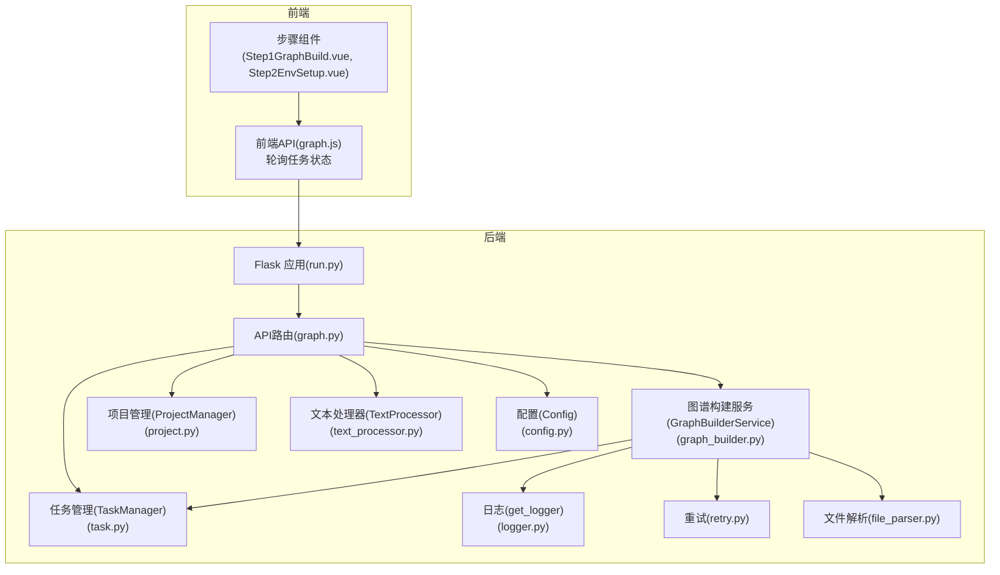
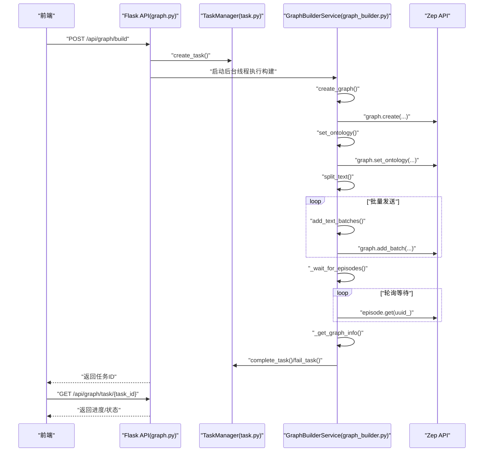
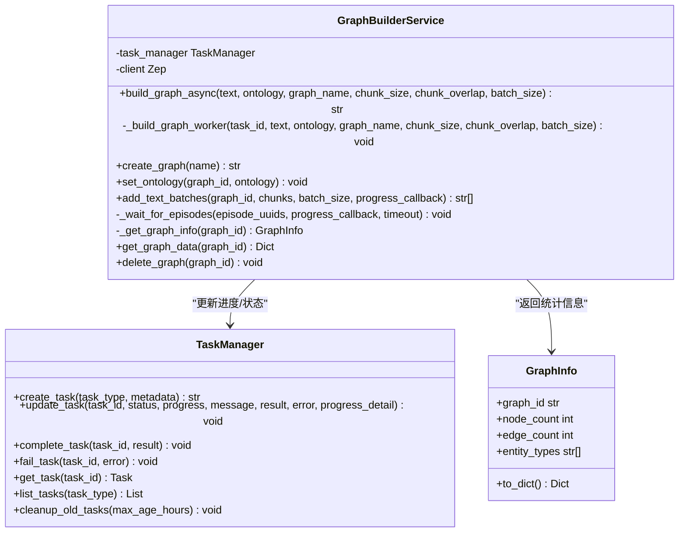
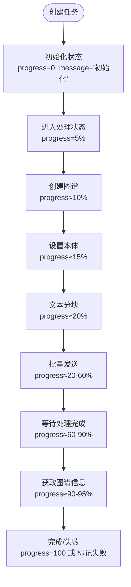
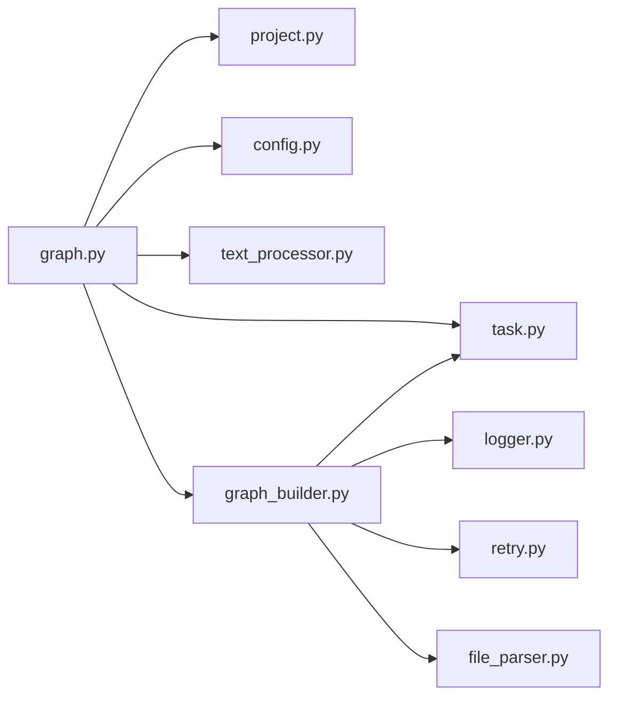

# 异步图谱构建

<cite>
**本文引用的文件**
- [graph_builder.py](file://backend/app/services/graph_builder.py)
- [graph.py](file://backend/app/api/graph.py)
- [task.py](file://backend/app/models/task.py)
- [text_processor.py](file://backend/app/services/text_processor.py)
- [project.py](file://backend/app/models/project.py)
- [config.py](file://backend/app/config.py)
- [logger.py](file://backend/app/utils/logger.py)
- [retry.py](file://backend/app/utils/retry.py)
- [file_parser.py](file://backend/app/utils/file_parser.py)
- [run.py](file://backend/run.py)
- [graph.js](file://frontend/src/api/graph.js)
- [index.js](file://frontend/src/api/index.js)
- [Step1GraphBuild.vue](file://frontend/src/components/Step1GraphBuild.vue)
- [Step2EnvSetup.vue](file://frontend/src/components/Step2EnvSetup.vue)
</cite>

## 目录
1. [引言](#引言)
2. [项目结构](#项目结构)
3. [核心组件](#核心组件)
4. [架构总览](#架构总览)
5. [详细组件分析](#详细组件分析)
6. [依赖分析](#依赖分析)
7. [性能考虑](#性能考虑)
8. [故障排查指南](#故障排查指南)
9. [结论](#结论)
10. [附录](#附录)

## 引言
本文件面向开发者与运维人员，系统化阐述 MiroFish 的异步图谱构建系统。该系统以“接口1生成本体 + 接口2异步构建图谱”为核心流程，采用线程池与任务状态机实现后台异步执行、进度跟踪与状态同步，结合前端轮询与日志面板，提供完整的可视化反馈。本文将深入解析 GraphBuilderService 的设计与实现、任务管理与状态同步机制、并发控制与资源管理策略，并给出最佳实践与性能调优建议。

## 项目结构
后端采用 Flask 应用，核心模块分布如下：
- API 层：负责请求接入、参数校验、状态流转与任务调度
- 服务层：封装图谱构建业务逻辑（GraphBuilderService）
- 模型层：任务与项目状态持久化与内存缓存
- 工具层：日志、重试、文件解析与文本处理
- 前端：通过 API 与后端交互，轮询任务状态并展示进度

图表来源
- [graph.py](file://backend/app/api/graph.py#L1-L618)
- [graph_builder.py](file://backend/app/services/graph_builder.py#L1-L500)
- [task.py](file://backend/app/models/task.py#L1-L185)
- [project.py](file://backend/app/models/project.py#L1-L306)
- [text_processor.py](file://backend/app/services/text_processor.py#L1-L72)
- [config.py](file://backend/app/config.py#L1-L76)
- [logger.py](file://backend/app/utils/logger.py#L1-L127)
- [retry.py](file://backend/app/utils/retry.py#L1-L239)
- [file_parser.py](file://backend/app/utils/file_parser.py#L1-L190)
- [run.py](file://backend/run.py#L1-L51)
- [graph.js](file://frontend/src/api/graph.js#L1-L71)
- [index.js](file://frontend/src/api/index.js#L1-L68)
- [Step1GraphBuild.vue](file://frontend/src/components/Step1GraphBuild.vue#L1-L699)
- [Step2EnvSetup.vue](file://frontend/src/components/Step2EnvSetup.vue#L1-L800)

章节来源
- [graph.py](file://backend/app/api/graph.py#L1-L618)
- [graph_builder.py](file://backend/app/services/graph_builder.py#L1-L500)
- [task.py](file://backend/app/models/task.py#L1-L185)
- [project.py](file://backend/app/models/project.py#L1-L306)
- [text_processor.py](file://backend/app/services/text_processor.py#L1-L72)
- [config.py](file://backend/app/config.py#L1-L76)
- [logger.py](file://backend/app/utils/logger.py#L1-L127)
- [retry.py](file://backend/app/utils/retry.py#L1-L239)
- [file_parser.py](file://backend/app/utils/file_parser.py#L1-L190)
- [run.py](file://backend/run.py#L1-L51)
- [graph.js](file://frontend/src/api/graph.js#L1-L71)
- [index.js](file://frontend/src/api/index.js#L1-L68)
- [Step1GraphBuild.vue](file://frontend/src/components/Step1GraphBuild.vue#L1-L699)
- [Step2EnvSetup.vue](file://frontend/src/components/Step2EnvSetup.vue#L1-L800)

## 核心组件
- GraphBuilderService：封装图谱构建全流程，包括创建图谱、设置本体、文本分块、批量发送、等待处理完成与获取图谱信息。
- TaskManager：线程安全的任务状态管理器，提供任务创建、更新、完成与失败标记。
- ProjectManager：项目上下文持久化，保存文件、提取文本、本体与图谱元数据。
- TextProcessor：文本预处理与分块。
- 配置与日志：统一配置加载与日志输出。
- 前端 API：封装请求与重试，轮询任务状态并渲染进度。

章节来源
- [graph_builder.py](file://backend/app/services/graph_builder.py#L38-L185)
- [task.py](file://backend/app/models/task.py#L54-L185)
- [project.py](file://backend/app/models/project.py#L101-L306)
- [text_processor.py](file://backend/app/services/text_processor.py#L9-L72)
- [config.py](file://backend/app/config.py#L20-L76)
- [logger.py](file://backend/app/utils/logger.py#L30-L127)
- [graph.js](file://frontend/src/api/graph.js#L1-L71)
- [index.js](file://frontend/src/api/index.js#L1-L68)

## 架构总览
异步构建采用“接口2触发 + 后台线程执行 + 任务状态机 + 前端轮询”的模式：
- 接口2接收 project_id 与构建参数，创建任务并启动后台线程。
- 后台线程执行 GraphBuilderService 的构建流程，期间通过 TaskManager 更新进度与消息。
- 前端通过 /api/graph/task/{task_id} 轮询任务状态，实时更新 UI。
- 构建完成后，前端可调用 /api/graph/data/{graph_id} 获取图谱数据。

图表来源
- [graph.py](file://backend/app/api/graph.py#L259-L525)
- [graph_builder.py](file://backend/app/services/graph_builder.py#L52-L185)
- [task.py](file://backend/app/models/task.py#L73-L163)

章节来源
- [graph.py](file://backend/app/api/graph.py#L259-L525)
- [graph_builder.py](file://backend/app/services/graph_builder.py#L52-L185)
- [task.py](file://backend/app/models/task.py#L73-L163)

## 详细组件分析

### GraphBuilderService 类详解
- 职责边界
  - 负责与 Zep API 交互，完成图谱创建、本体设置、文本分块与批量发送、等待处理完成、获取图谱信息。
  - 通过 TaskManager 实现进度与状态上报。
- 关键方法
  - build_graph_async：创建任务并启动后台线程执行构建。
  - _build_graph_worker：构建工作线程，串联各步骤并更新进度。
  - create_graph / set_ontology：调用 Zep API 完成本体定义与图谱创建。
  - add_text_batches：按 batch_size 分批发送文本，回调进度。
  - _wait_for_episodes：轮询每个 episode 的 processed 状态，控制超时与回调。
  - _get_graph_info / get_graph_data：统计节点/边与导出完整图谱数据。
- 进度与回调
  - 通过 progress_callback 与 TaskManager.update_task 实现细粒度进度上报。
  - 进度区间分配：创建图谱(10%)、设置本体(5%)、分块(5%)、发送(40%)、等待(35%)、统计(5%)、完成(100%)。
- 错误处理
  - try/catch 包裹整个构建流程，失败时调用 fail_task 并记录堆栈。
  - add_text_batches 对单批次异常进行捕获并向上抛出，保证任务失败状态。

图表来源
- [graph_builder.py](file://backend/app/services/graph_builder.py#L38-L499)
- [task.py](file://backend/app/models/task.py#L54-L185)

章节来源
- [graph_builder.py](file://backend/app/services/graph_builder.py#L38-L185)
- [task.py](file://backend/app/models/task.py#L54-L185)

### 任务管理与状态同步
- TaskManager
  - 单例模式 + 线程锁，保证并发安全。
  - 提供 create_task、update_task、complete_task、fail_task 等方法。
  - 支持清理旧任务，避免内存膨胀。
- API 层任务集成
  - 接口2在创建任务后，立即启动后台线程执行构建。
  - 构建过程中通过 progress_callback 与 TaskManager.update_task 更新状态。
  - 前端通过 /api/graph/task/{task_id} 查询任务状态，实现 UI 同步。

图表来源
- [graph_builder.py](file://backend/app/services/graph_builder.py#L95-L185)
- [task.py](file://backend/app/models/task.py#L106-L163)

章节来源
- [task.py](file://backend/app/models/task.py#L54-L185)
- [graph.py](file://backend/app/api/graph.py#L364-L505)

### 文本处理与分块
- TextProcessor
  - split_text：基于 chunk_size 与 overlap 进行分块，尽量在句号、换行等处断句，提升语义完整性。
  - preprocess_text：标准化换行、去除多余空白、压缩空行。
- file_parser
  - 支持 PDF、Markdown、TXT 的文本提取，内置多级编码回退策略，提升兼容性。

章节来源
- [text_processor.py](file://backend/app/services/text_processor.py#L18-L72)
- [file_parser.py](file://backend/app/utils/file_parser.py#L147-L190)

### 前端交互与轮询
- 前端 API
  - graph.js 封装了生成本体、构建图谱、查询任务状态、获取图谱数据等接口。
  - index.js 提供带指数退避的重试机制，增强网络波动下的稳定性。
- 步骤组件
  - Step1GraphBuild.vue：展示本体生成进度与图谱统计卡片。
  - Step2EnvSetup.vue：展示构建进度与系统日志，支持轮询与日志滚动。

章节来源
- [graph.js](file://frontend/src/api/graph.js#L1-L71)
- [index.js](file://frontend/src/api/index.js#L54-L68)
- [Step1GraphBuild.vue](file://frontend/src/components/Step1GraphBuild.vue#L1-L699)
- [Step2EnvSetup.vue](file://frontend/src/components/Step2EnvSetup.vue#L1-L800)

## 依赖分析
- 组件耦合
  - GraphBuilderService 依赖 TaskManager、Zep SDK、TextProcessor、Logger、Retry 工具。
  - API 层依赖 ProjectManager、TaskManager、GraphBuilderService。
- 外部依赖
  - Zep Cloud SDK：图谱创建、本体设置、批量添加、查询 episode 状态。
  - 日志与重试：统一日志输出与 API 调用重试策略。
- 潜在循环依赖
  - 当前模块间为单向依赖，未发现循环导入。

图表来源
- [graph.py](file://backend/app/api/graph.py#L1-L618)
- [graph_builder.py](file://backend/app/services/graph_builder.py#L1-L500)
- [task.py](file://backend/app/models/task.py#L1-L185)
- [project.py](file://backend/app/models/project.py#L1-L306)
- [text_processor.py](file://backend/app/services/text_processor.py#L1-L72)
- [config.py](file://backend/app/config.py#L1-L76)
- [logger.py](file://backend/app/utils/logger.py#L1-L127)
- [retry.py](file://backend/app/utils/retry.py#L1-L239)
- [file_parser.py](file://backend/app/utils/file_parser.py#L1-L190)

章节来源
- [graph.py](file://backend/app/api/graph.py#L1-L618)
- [graph_builder.py](file://backend/app/services/graph_builder.py#L1-L500)
- [task.py](file://backend/app/models/task.py#L1-L185)
- [project.py](file://backend/app/models/project.py#L1-L306)
- [text_processor.py](file://backend/app/services/text_processor.py#L1-L72)
- [config.py](file://backend/app/config.py#L1-L76)
- [logger.py](file://backend/app/utils/logger.py#L1-L127)
- [retry.py](file://backend/app/utils/retry.py#L1-L239)
- [file_parser.py](file://backend/app/utils/file_parser.py#L1-L190)

## 性能考虑
- 并发与线程池
  - 当前实现使用守护线程执行构建，适合短到中等规模任务；对于高并发场景，建议引入线程池或进程池，限制同时执行的任务数，避免资源争用。
- 批量发送与速率控制
  - add_text_batches 中内置 1 秒休眠，避免请求过快被限流；可根据 Zep 速率限制动态调整。
- 等待策略
  - _wait_for_episodes 以 3 秒为间隔轮询，可在大规模数据下引入指数退避或并发查询以缩短等待时间。
- 内存与存储
  - 任务状态仅驻留内存，建议在生产环境增加持久化或缓存（如 Redis）以支持重启后状态恢复。
- 日志与可观测性
  - 统一日志格式与级别，建议结合链路追踪与指标采集，定位慢点与异常。

## 故障排查指南
- 常见错误与定位
  - ZEP_API_KEY 未配置：启动时会校验配置，接口2也会检查 ZEP_API_KEY。
  - 任务失败：查看 /api/graph/task/{task_id} 的 error 字段与后端日志。
  - 文本分块异常：确认 chunk_size 与 overlap 合理，避免过大导致内存压力。
- 前端轮询
  - 若任务长时间无进度，检查 /api/graph/task/{task_id} 是否返回 pending，确认后端线程是否正常启动。
- 日志与重试
  - 后端日志输出到文件与控制台，便于定位异常；前端请求具备指数退避重试，网络波动下更稳健。

章节来源
- [config.py](file://backend/app/config.py#L67-L76)
- [graph.py](file://backend/app/api/graph.py#L282-L295)
- [graph_builder.py](file://backend/app/services/graph_builder.py#L181-L185)
- [logger.py](file://backend/app/utils/logger.py#L30-L127)
- [index.js](file://frontend/src/api/index.js#L54-L68)

## 结论
MiroFish 的异步图谱构建系统以清晰的职责划分与任务状态机为核心，结合前后端协同实现了可靠的异步执行与进度可视化。通过 GraphBuilderService 的模块化设计与 TaskManager 的线程安全状态管理，系统在可维护性与扩展性方面具有良好基础。建议在高并发场景引入线程池与持久化状态存储，并结合指标监控与告警体系，进一步提升稳定性与可观测性。

## 附录
- 异步构建示例（步骤说明）
  1) 上传文档与模拟需求 → 接口1 生成本体并保存项目上下文。
  2) 调用接口2，传入 project_id 与构建参数，后端创建任务并启动后台线程。
  3) 前端轮询 /api/graph/task/{task_id}，实时更新 UI 进度。
  4) 构建完成后，调用 /api/graph/data/{graph_id} 获取图谱数据。
- 并发控制与资源管理
  - 线程池：限制并发任务数，避免 CPU/IO 抢占。
  - 速率控制：根据外部 API 限流策略动态调整批量大小与休眠时间。
  - 资源回收：定期清理旧任务，避免内存泄漏。
- 故障恢复
  - 任务失败时记录堆栈，前端可提示用户重试或清理失败任务。
  - 重启后恢复：将任务状态迁移到持久化存储，支持状态恢复。