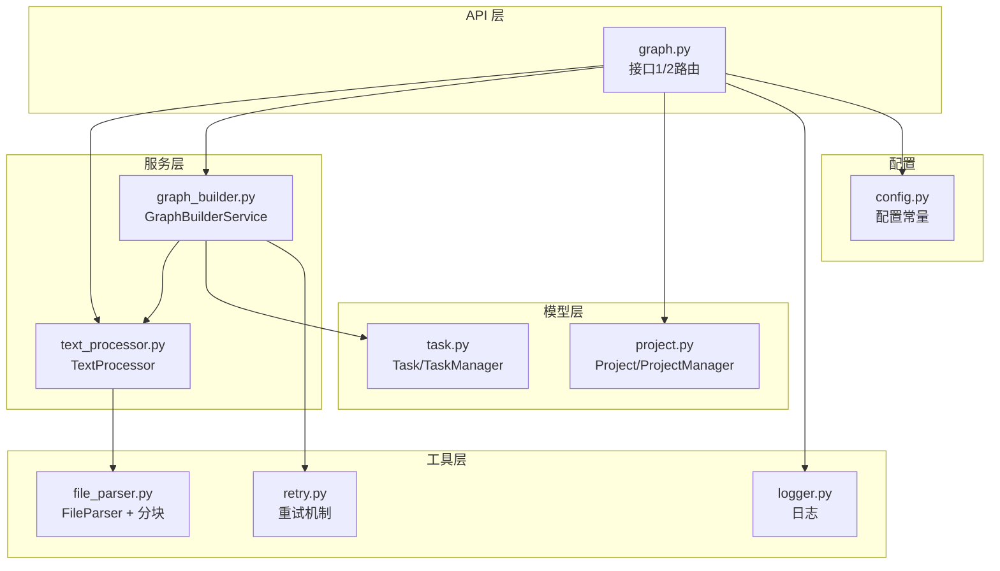
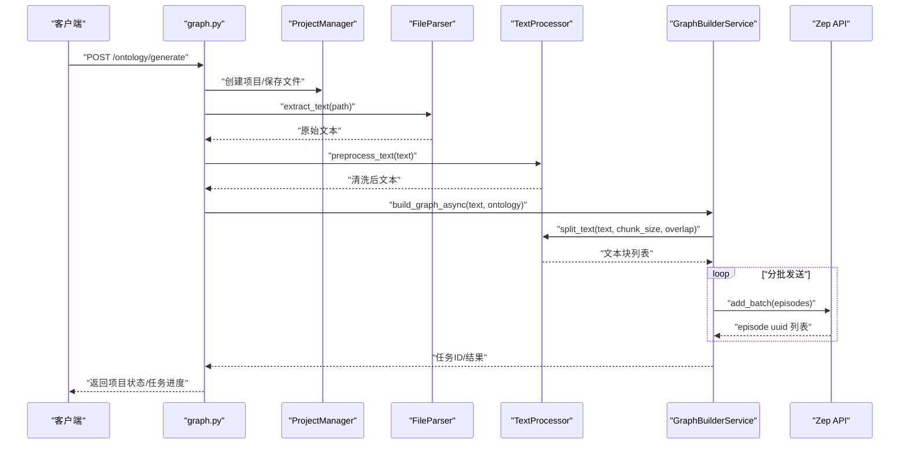
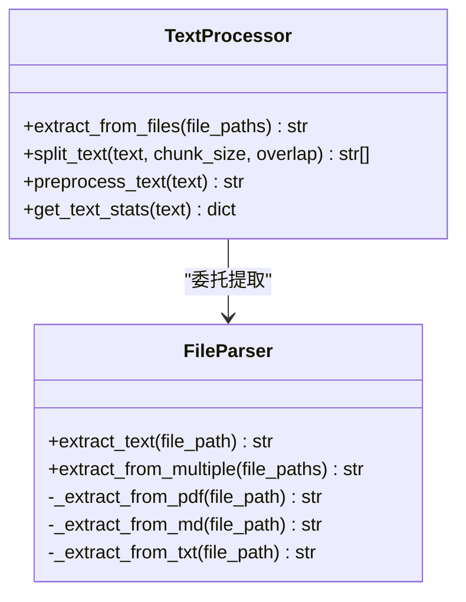
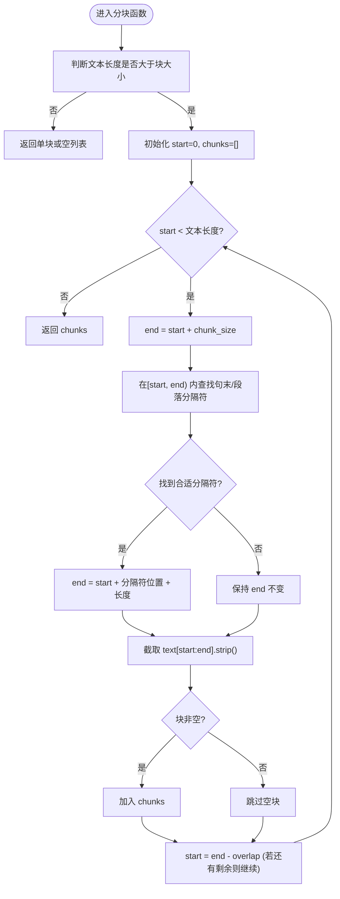
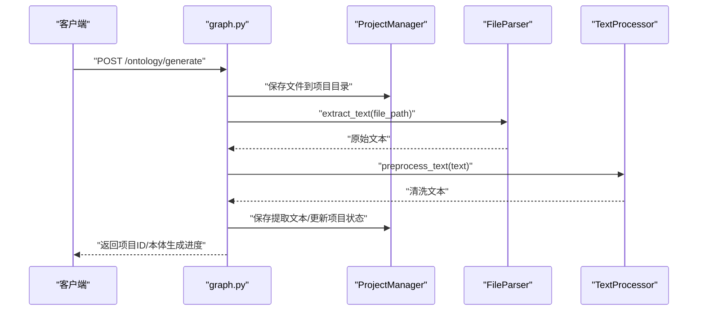
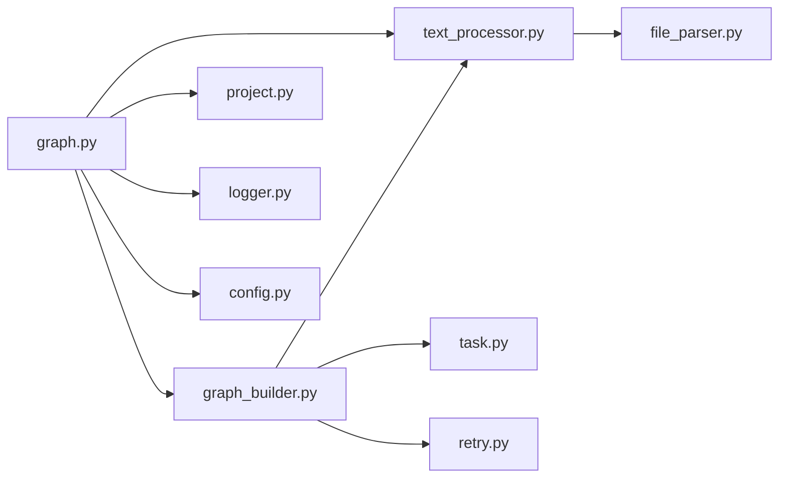

# 文本处理系统

<cite>
**本文引用的文件**
- [backend/app/services/text_processor.py](file://backend/app/services/text_processor.py)
- [backend/app/utils/file_parser.py](file://backend/app/utils/file_parser.py)
- [backend/app/utils/logger.py](file://backend/app/utils/logger.py)
- [backend/app/utils/retry.py](file://backend/app/utils/retry.py)
- [backend/app/models/project.py](file://backend/app/models/project.py)
- [backend/app/models/task.py](file://backend/app/models/task.py)
- [backend/app/services/graph_builder.py](file://backend/app/services/graph_builder.py)
- [backend/app/config.py](file://backend/app/config.py)
- [backend/app/api/graph.py](file://backend/app/api/graph.py)
</cite>

## 目录
1. [简介](#简介)
2. [项目结构](#项目结构)
3. [核心组件](#核心组件)
4. [架构总览](#架构总览)
5. [详细组件分析](#详细组件分析)
6. [依赖分析](#依赖分析)
7. [性能考虑](#性能考虑)
8. [故障排查指南](#故障排查指南)
9. [结论](#结论)
10. [附录](#附录)

## 简介
本技术文档围绕 MiroFish 的文本处理系统展开，重点阐述从“文件解析 → 文本清洗 → 分块策略 → 批量处理优化”的完整流程。文档详细说明 TextProcessor 类的设计与实现，包括智能分块算法、重叠处理机制、长度控制与边界处理；并总结当前支持的文件格式（PDF、Markdown、TXT）及解析策略。最后提供性能优化建议、内存管理策略、错误恢复机制以及最佳实践与扩展指南。

## 项目结构
后端采用分层设计：API 层负责请求接入与状态管理，服务层负责业务流程编排（如图谱构建、文本处理），工具层提供通用能力（文件解析、日志、重试），模型层负责项目上下文与任务状态持久化。

图表来源
- [backend/app/api/graph.py](file://backend/app/api/graph.py#L1-L200)
- [backend/app/services/text_processor.py](file://backend/app/services/text_processor.py#L1-L72)
- [backend/app/utils/file_parser.py](file://backend/app/utils/file_parser.py#L1-L190)
- [backend/app/utils/logger.py](file://backend/app/utils/logger.py#L1-L127)
- [backend/app/utils/retry.py](file://backend/app/utils/retry.py#L1-L239)
- [backend/app/models/project.py](file://backend/app/models/project.py#L1-L306)
- [backend/app/models/task.py](file://backend/app/models/task.py#L1-L185)
- [backend/app/config.py](file://backend/app/config.py#L1-L76)

章节来源
- [backend/app/api/graph.py](file://backend/app/api/graph.py#L1-L200)
- [backend/app/services/text_processor.py](file://backend/app/services/text_processor.py#L1-L72)
- [backend/app/utils/file_parser.py](file://backend/app/utils/file_parser.py#L1-L190)
- [backend/app/models/project.py](file://backend/app/models/project.py#L1-L306)
- [backend/app/models/task.py](file://backend/app/models/task.py#L1-L185)
- [backend/app/config.py](file://backend/app/config.py#L1-L76)

## 核心组件
- TextProcessor：提供文件提取、文本清洗、智能分块与统计功能，是文本预处理的核心入口。
- FileParser：负责多格式文件的文本提取与编码回退策略，支持 PDF、Markdown、TXT。
- GraphBuilderService：在图谱构建阶段调用 TextProcessor 对文本进行分块与批量发送。
- Project/ProjectManager：项目上下文持久化，保存文件、提取文本、本体与图谱信息。
- Task/TaskManager：任务状态管理，用于长耗时流程的进度跟踪。
- Logger/Retry：统一日志与重试机制，保障稳定性与可观测性。
- Config：集中配置，包括默认分块参数、上传限制、第三方密钥等。

章节来源
- [backend/app/services/text_processor.py](file://backend/app/services/text_processor.py#L1-L72)
- [backend/app/utils/file_parser.py](file://backend/app/utils/file_parser.py#L1-L190)
- [backend/app/models/project.py](file://backend/app/models/project.py#L1-L306)
- [backend/app/models/task.py](file://backend/app/models/task.py#L1-L185)
- [backend/app/utils/logger.py](file://backend/app/utils/logger.py#L1-L127)
- [backend/app/utils/retry.py](file://backend/app/utils/retry.py#L1-L239)
- [backend/app/config.py](file://backend/app/config.py#L1-L76)

## 架构总览
下图展示了从上传文件到图谱构建的端到端流程，突出文本处理的关键节点与组件交互。

图表来源
- [backend/app/api/graph.py](file://backend/app/api/graph.py#L121-L232)
- [backend/app/models/project.py](file://backend/app/models/project.py#L133-L304)
- [backend/app/utils/file_parser.py](file://backend/app/utils/file_parser.py#L67-L144)
- [backend/app/services/text_processor.py](file://backend/app/services/text_processor.py#L13-L70)
- [backend/app/services/graph_builder.py](file://backend/app/services/graph_builder.py#L52-L185)

## 详细组件分析

### TextProcessor 设计与实现
TextProcessor 是文本处理的核心类，提供以下能力：
- 文件批量提取：委托 FileParser 从多个文件提取文本并合并。
- 文本清洗：标准化换行、压缩空行、去除行首行尾空白。
- 智能分块：按设定的 chunk_size 和 overlap 进行分块，优先在句末或段落边界处切分。
- 统计信息：提供字符数、行数、词数等基础统计。

图表来源
- [backend/app/services/text_processor.py](file://backend/app/services/text_processor.py#L9-L71)
- [backend/app/utils/file_parser.py](file://backend/app/utils/file_parser.py#L61-L144)

章节来源
- [backend/app/services/text_processor.py](file://backend/app/services/text_processor.py#L1-L72)

#### 智能分块算法与重叠处理机制
- 边界策略：在句末或段落边界处切分，优先匹配中文句号、感叹号、问号以及英文句末换行/空格等常见分隔符。
- 长度控制：若切分点靠前（小于阈值比例），会向后寻找更合适的分隔符以保证每块的完整性。
- 重叠处理：下一块从上一块的 end - overlap 位置开始，确保语义连贯。
- 边界处理：当剩余文本不足 chunk_size 时，直接返回该块；空块会被过滤。

图表来源
- [backend/app/utils/file_parser.py](file://backend/app/utils/file_parser.py#L147-L188)

章节来源
- [backend/app/utils/file_parser.py](file://backend/app/utils/file_parser.py#L147-L188)

#### 文本清洗策略
- 换行标准化：统一替换为 LF。
- 空行压缩：将连续三个以上换行压缩为两个。
- 行首行尾去空白：逐行 strip，再拼接。

章节来源
- [backend/app/services/text_processor.py](file://backend/app/services/text_processor.py#L37-L61)

### 文件解析与格式支持
- 支持格式：PDF、Markdown（含 .markdown）、TXT。
- 解析策略：
  - PDF：使用 PyMuPDF 逐页提取文本并拼接。
  - Markdown/TXT：采用多级编码回退策略（UTF-8 → charset_normalizer → chardet → UTF-8 + replace）。
- 批量解析：支持多文件合并，并在失败时记录错误而不中断整体流程。

章节来源
- [backend/app/utils/file_parser.py](file://backend/app/utils/file_parser.py#L61-L144)

### 项目上下文与持久化
- Project：承载项目元数据、文件列表、本体、图谱 ID、分块参数与错误信息。
- ProjectManager：负责项目创建、保存、读取、文件保存、提取文本存取与项目文件列表。
- 配置：默认分块大小与重叠大小由 Config 提供，可在接口中覆盖。

章节来源
- [backend/app/models/project.py](file://backend/app/models/project.py#L26-L98)
- [backend/app/models/project.py](file://backend/app/models/project.py#L101-L304)
- [backend/app/config.py](file://backend/app/config.py#L43-L45)

### 任务状态与进度跟踪
- Task/TaskManager：提供任务生命周期管理（创建、更新、完成、失败），支持并发安全与定时清理。
- GraphBuilderService：在构建过程中分阶段更新进度与消息，便于前端轮询。

章节来源
- [backend/app/models/task.py](file://backend/app/models/task.py#L14-L185)
- [backend/app/services/graph_builder.py](file://backend/app/services/graph_builder.py#L52-L185)

### 日志与重试机制
- Logger：统一输出到控制台与滚动文件，确保 Windows 下 UTF-8 输出正常。
- Retry：提供同步/异步重试装饰器与可重试 API 客户端，支持指数退避、抖动与单项失败继续处理。

章节来源
- [backend/app/utils/logger.py](file://backend/app/utils/logger.py#L1-L127)
- [backend/app/utils/retry.py](file://backend/app/utils/retry.py#L1-L239)

### API 端点与使用示例
- 接口1：上传文件并生成本体，内部完成文件保存、文本提取与清洗、统计与持久化。
- 接口2：基于本体与文本异步构建图谱，调用 TextProcessor 进行分块与批量发送。

图表来源
- [backend/app/api/graph.py](file://backend/app/api/graph.py#L121-L232)
- [backend/app/models/project.py](file://backend/app/models/project.py#L133-L304)
- [backend/app/utils/file_parser.py](file://backend/app/utils/file_parser.py#L67-L144)
- [backend/app/services/text_processor.py](file://backend/app/services/text_processor.py#L13-L70)

章节来源
- [backend/app/api/graph.py](file://backend/app/api/graph.py#L121-L232)

## 依赖分析
- 组件耦合：
  - API 层依赖服务层与模型层；服务层依赖工具层与配置层。
  - TextProcessor 依赖 FileParser 的分块函数；GraphBuilderService 依赖 TextProcessor 的分块能力。
- 外部依赖：
  - PDF 解析依赖 PyMuPDF；编码探测依赖 charset_normalizer 或 chardet。
  - 图谱构建依赖 Zep API；重试机制用于外部 API 调用容错。

图表来源
- [backend/app/api/graph.py](file://backend/app/api/graph.py#L1-L200)
- [backend/app/services/text_processor.py](file://backend/app/services/text_processor.py#L1-L72)
- [backend/app/utils/file_parser.py](file://backend/app/utils/file_parser.py#L1-L190)
- [backend/app/services/graph_builder.py](file://backend/app/services/graph_builder.py#L1-L500)
- [backend/app/models/project.py](file://backend/app/models/project.py#L1-L306)
- [backend/app/models/task.py](file://backend/app/models/task.py#L1-L185)
- [backend/app/utils/logger.py](file://backend/app/utils/logger.py#L1-L127)
- [backend/app/utils/retry.py](file://backend/app/utils/retry.py#L1-L239)
- [backend/app/config.py](file://backend/app/config.py#L1-L76)

## 性能考虑
- 分块参数选择
  - 默认分块大小与重叠大小由配置提供，可根据下游模型上下文窗口与语义完整性要求调整。
- 编码探测成本
  - 多级回退策略在编码未知时会增加 CPU 与 I/O 成本，建议在已知编码的场景下尽量减少回退路径。
- 批量发送与限速
  - 图谱构建阶段对批量发送设置了间隔，避免触发外部服务限流。
- 内存管理
  - 文本清洗与分块均为就地字符串操作，建议在大规模文本处理时分段处理或流式读取，避免一次性加载过大文本。
- 并发与线程
  - 图谱构建使用后台线程执行，避免阻塞 API 主流程；任务状态管理采用线程锁保证并发安全。

章节来源
- [backend/app/config.py](file://backend/app/config.py#L43-L45)
- [backend/app/utils/file_parser.py](file://backend/app/utils/file_parser.py#L11-L58)
- [backend/app/services/graph_builder.py](file://backend/app/services/graph_builder.py#L287-L338)
- [backend/app/models/task.py](file://backend/app/models/task.py#L60-L71)

## 故障排查指南
- 常见错误与定位
  - 文件格式不支持：检查文件扩展名是否在支持集合内。
  - PDF 解析失败：确认已安装 PyMuPDF；查看导入异常提示。
  - 编码问题：启用多级回退策略，观察最终兜底行为。
  - 外部 API 调用失败：利用重试机制与日志定位具体失败步骤。
- 日志与监控
  - 使用统一日志器输出到文件与控制台，Windows 下确保 UTF-8 输出。
  - 任务状态管理器提供进度与错误信息，便于前端轮询与用户反馈。
- 错误恢复
  - 批量解析时单文件失败不会中断整体流程，记录失败原因以便后续重试或人工干预。
  - 图谱构建阶段对批次发送失败进行记录与可选继续处理策略。

章节来源
- [backend/app/utils/file_parser.py](file://backend/app/utils/file_parser.py#L84-L94)
- [backend/app/utils/file_parser.py](file://backend/app/utils/file_parser.py#L97-L102)
- [backend/app/utils/logger.py](file://backend/app/utils/logger.py#L66-L88)
- [backend/app/utils/retry.py](file://backend/app/utils/retry.py#L132-L238)
- [backend/app/models/task.py](file://backend/app/models/task.py#L106-L162)

## 结论
MiroFish 的文本处理系统以清晰的分层架构实现了从多格式文件解析到智能分块与批量发送的完整链路。TextProcessor 提供了稳健的文本清洗与分块能力，配合 Project/Task 的持久化与状态管理，以及 Logger/Retry 的可观测与容错机制，能够支撑大规模文档的高效处理与图谱构建。未来可进一步扩展对 Word、Excel、CSV 等格式的支持，并引入流式处理与缓存策略以提升性能与稳定性。

## 附录

### 当前支持的文件格式与解析策略
- PDF：使用 PyMuPDF 逐页提取文本。
- Markdown：多级编码回退策略，兼容多种编码。
- TXT：多级编码回退策略，兼容多种编码。

章节来源
- [backend/app/utils/file_parser.py](file://backend/app/utils/file_parser.py#L64-L94)

### 文本处理示例（从原始文件到文本块）
- 步骤概览
  - 上传文件 → 保存到项目目录 → 提取原始文本 → 清洗文本 → 分块 → 统计信息
- 关键调用路径
  - 接口1：graph.py 中完成文件保存与文本提取、清洗与统计。
  - 分块：graph_builder.py 中调用 TextProcessor.split_text 进行分块。
  - 批量发送：graph_builder.py 中按批次发送至 Zep。

章节来源
- [backend/app/api/graph.py](file://backend/app/api/graph.py#L121-L232)
- [backend/app/services/text_processor.py](file://backend/app/services/text_processor.py#L18-L34)
- [backend/app/services/graph_builder.py](file://backend/app/services/graph_builder.py#L130-L147)

### 最佳实践与扩展指南
- 自定义扩展
  - 新增文件格式：在 FileParser 中新增解析方法与支持集合，并在批量解析中处理异常。
  - 自定义分块策略：在 TextProcessor 中扩展分块算法，或提供多策略切换。
  - 外部服务集成：通过 RetryableAPIClient 或装饰器包装外部调用，统一退避与抖动策略。
- 性能优化
  - 合理设置 chunk_size 与 overlap，平衡上下文完整性与吞吐量。
  - 对超大文本采用流式处理或分段处理，避免内存峰值过高。
  - 使用后台线程与任务状态管理，提升用户体验与系统吞吐。
- 错误恢复
  - 对单文件解析失败进行记录与跳过，保证整体流程继续执行。
  - 对外部 API 调用使用指数退避与抖动，降低瞬时压力。

章节来源
- [backend/app/utils/file_parser.py](file://backend/app/utils/file_parser.py#L61-L144)
- [backend/app/utils/retry.py](file://backend/app/utils/retry.py#L15-L129)
- [backend/app/models/task.py](file://backend/app/models/task.py#L106-L162)