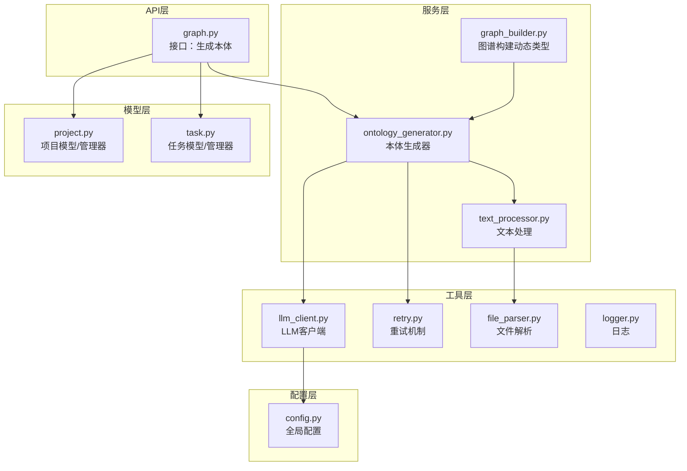
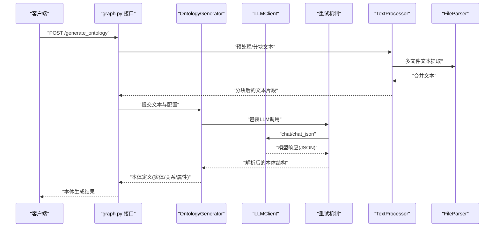
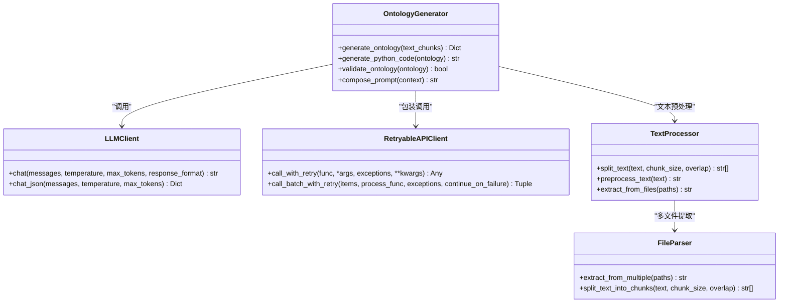
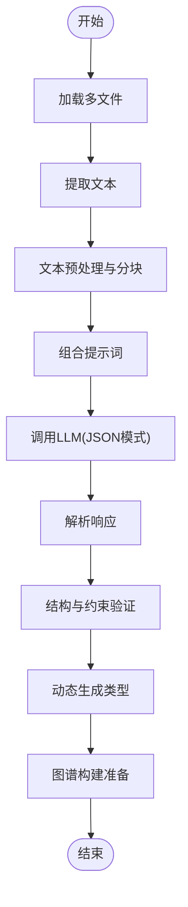
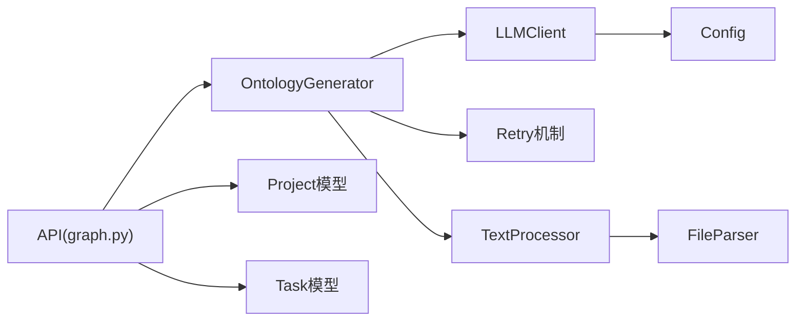

# 本体生成系统

<cite>
**本文引用的文件**
- [backend/app/services/ontology_generator.py](file://backend/app/services/ontology_generator.py)
- [backend/app/utils/llm_client.py](file://backend/app/utils/llm_client.py)
- [backend/app/utils/retry.py](file://backend/app/utils/retry.py)
- [backend/app/utils/file_parser.py](file://backend/app/utils/file_parser.py)
- [backend/app/services/text_processor.py](file://backend/app/services/text_processor.py)
- [backend/app/models/project.py](file://backend/app/models/project.py)
- [backend/app/models/task.py](file://backend/app/models/task.py)
- [backend/app/config.py](file://backend/app/config.py)
- [backend/run.py](file://backend/run.py)
- [backend/app/api/graph.py](file://backend/app/api/graph.py)
</cite>

## 目录
1. [简介](#简介)
2. [项目结构](#项目结构)
3. [核心组件](#核心组件)
4. [架构总览](#架构总览)
5. [详细组件分析](#详细组件分析)
6. [依赖分析](#依赖分析)
7. [性能考虑](#性能考虑)
8. [故障排查指南](#故障排查指南)
9. [结论](#结论)
10. [附录](#附录)

## 简介
本文件面向MiroFish的“本体生成系统”，聚焦于从原始文本到结构化本体的完整转换流程，深入解析OntologyGenerator类的工作原理与实现细节，涵盖实体类型识别、关系类型定义、属性提取与本体结构设计；同时给出数据结构设计理念、优化策略、错误处理机制与最佳实践，帮助开发者高效扩展与维护系统。

## 项目结构
后端采用分层架构：API层负责对外接口与路由，服务层承载业务逻辑（含本体生成），工具层提供通用能力（LLM、重试、文件解析、日志等），模型层管理项目与任务状态，配置层集中管理运行参数。

图表来源
- [backend/app/api/graph.py](file://backend/app/api/graph.py#L1-L200)
- [backend/app/services/ontology_generator.py](file://backend/app/services/ontology_generator.py#L1-L400)
- [backend/app/services/graph_builder.py](file://backend/app/services/graph_builder.py#L1-L300)
- [backend/app/utils/llm_client.py](file://backend/app/utils/llm_client.py#L1-L92)
- [backend/app/utils/retry.py](file://backend/app/utils/retry.py#L1-L239)
- [backend/app/utils/file_parser.py](file://backend/app/utils/file_parser.py#L1-L190)
- [backend/app/services/text_processor.py](file://backend/app/services/text_processor.py#L1-L72)
- [backend/app/models/project.py](file://backend/app/models/project.py#L1-L306)
- [backend/app/models/task.py](file://backend/app/models/task.py#L1-L185)
- [backend/app/config.py](file://backend/app/config.py#L1-L76)

章节来源
- [backend/app/api/graph.py](file://backend/app/api/graph.py#L1-L200)
- [backend/app/services/ontology_generator.py](file://backend/app/services/ontology_generator.py#L1-L400)
- [backend/app/utils/llm_client.py](file://backend/app/utils/llm_client.py#L1-L92)
- [backend/app/utils/retry.py](file://backend/app/utils/retry.py#L1-L239)
- [backend/app/utils/file_parser.py](file://backend/app/utils/file_parser.py#L1-L190)
- [backend/app/services/text_processor.py](file://backend/app/services/text_processor.py#L1-L72)
- [backend/app/models/project.py](file://backend/app/models/project.py#L1-L306)
- [backend/app/models/task.py](file://backend/app/models/task.py#L1-L185)
- [backend/app/config.py](file://backend/app/config.py#L1-L76)

## 核心组件
- OntologyGenerator：本体生成核心，负责提示工程、模板驱动的结构化解析、动态类型生成与验证。
- LLMClient：统一的LLM客户端，封装OpenAI格式调用，支持JSON模式响应。
- Retry机制：指数退避+抖动的重试策略，提升外部API调用稳定性。
- FileParser/TextProcessor：多格式文本提取与分块，保障输入质量。
- Project/Task模型：项目与任务状态持久化与并发安全管理。
- 配置中心：集中管理LLM、上传、模拟等运行参数。

章节来源
- [backend/app/services/ontology_generator.py](file://backend/app/services/ontology_generator.py#L150-L420)
- [backend/app/utils/llm_client.py](file://backend/app/utils/llm_client.py#L13-L92)
- [backend/app/utils/retry.py](file://backend/app/utils/retry.py#L15-L129)
- [backend/app/utils/file_parser.py](file://backend/app/utils/file_parser.py#L61-L190)
- [backend/app/services/text_processor.py](file://backend/app/services/text_processor.py#L9-L72)
- [backend/app/models/project.py](file://backend/app/models/project.py#L26-L100)
- [backend/app/models/task.py](file://backend/app/models/task.py#L22-L185)
- [backend/app/config.py](file://backend/app/config.py#L20-L76)

## 架构总览
本体生成流程自上而下：API接收请求，服务层调用LLM进行结构化解析，结合文本分块与重试机制，最终生成可动态构建图谱的本体结构。

图表来源
- [backend/app/api/graph.py](file://backend/app/api/graph.py#L100-L180)
- [backend/app/services/ontology_generator.py](file://backend/app/services/ontology_generator.py#L157-L360)
- [backend/app/utils/llm_client.py](file://backend/app/utils/llm_client.py#L34-L92)
- [backend/app/utils/retry.py](file://backend/app/utils/retry.py#L15-L78)
- [backend/app/services/text_processor.py](file://backend/app/services/text_processor.py#L12-L35)
- [backend/app/utils/file_parser.py](file://backend/app/utils/file_parser.py#L124-L145)

## 详细组件分析

### OntologyGenerator：本体生成器
- 角色定位：将自然语言文本转化为结构化本体，包含实体类型、关系类型与属性定义；支持动态类型生成与验证。
- 关键职责
  - 提示工程：构造高质量提示词，引导LLM输出符合模板的JSON结构。
  - 模板设计：定义实体/关系/属性的字段规范与约束，保证输出一致性。
  - 动态类型生成：基于本体定义动态创建Python类，便于后续图谱构建。
  - 验证机制：对LLM输出进行结构校验与类型约束检查。
- 输入输出
  - 输入：文本块列表、项目配置、任务上下文。
  - 输出：本体结构（实体类型、关系类型、属性约束）。
- 与图谱构建的关系：生成的本体被graph_builder.py用于动态创建实体类与边类，支撑后续知识图谱构建。

图表来源
- [backend/app/services/ontology_generator.py](file://backend/app/services/ontology_generator.py#L157-L360)
- [backend/app/utils/llm_client.py](file://backend/app/utils/llm_client.py#L13-L92)
- [backend/app/utils/retry.py](file://backend/app/utils/retry.py#L132-L239)
- [backend/app/services/text_processor.py](file://backend/app/services/text_processor.py#L9-L72)
- [backend/app/utils/file_parser.py](file://backend/app/utils/file_parser.py#L61-L190)

章节来源
- [backend/app/services/ontology_generator.py](file://backend/app/services/ontology_generator.py#L157-L360)
- [backend/app/utils/llm_client.py](file://backend/app/utils/llm_client.py#L13-L92)
- [backend/app/utils/retry.py](file://backend/app/utils/retry.py#L132-L239)
- [backend/app/services/text_processor.py](file://backend/app/services/text_processor.py#L9-L72)
- [backend/app/utils/file_parser.py](file://backend/app/utils/file_parser.py#L61-L190)

### LLM提示工程与响应解析
- 提示工程要点
  - 明确角色与任务边界，限定输出格式（JSON模式）。
  - 给定清晰的模板字段与约束，减少歧义。
  - 对复杂场景分步提示，逐步细化实体与关系。
- 响应解析
  - 使用JSON模式确保结构化输出，便于后续严格校验。
  - 对异常响应进行兜底与重试，避免单次失败阻塞流程。

章节来源
- [backend/app/utils/llm_client.py](file://backend/app/utils/llm_client.py#L34-L92)
- [backend/app/utils/retry.py](file://backend/app/utils/retry.py#L15-L78)

### 文本预处理与分块
- FileParser：支持PDF、Markdown、TXT多格式提取，具备编码自动检测与回退策略。
- TextProcessor：提供文本标准化、分块与统计功能，确保LLM输入质量与可控长度。

章节来源
- [backend/app/utils/file_parser.py](file://backend/app/utils/file_parser.py#L61-L190)
- [backend/app/services/text_processor.py](file://backend/app/services/text_processor.py#L9-L72)

### 项目与任务状态管理
- Project：封装项目元数据、本体与图谱状态、配置与错误信息，提供持久化与检索。
- Task：线程安全的任务状态管理，支持进度、消息、结果与错误记录。

章节来源
- [backend/app/models/project.py](file://backend/app/models/project.py#L26-L306)
- [backend/app/models/task.py](file://backend/app/models/task.py#L22-L185)

### 本体数据结构设计
- 实体定义
  - 字段：名称、描述、属性列表（含类型、可选性、默认值等）。
  - 设计理念：以“最小必要”原则定义属性，避免过度泛化；通过描述性字段增强语义表达。
- 关系定义
  - 字段：名称、描述、方向性、基数约束、属性集合。
  - 设计理念：区分强弱关系，明确方向与多重性，便于后续图谱查询与推理。
- 属性约束
  - 类型约束：字符串、数值、布尔、枚举等。
  - 可选性与默认值：明确缺失值处理策略。
- 继承关系
  - 通过“父类型”或“标签体系”表达泛化层次，支持动态类型生成时的类型映射。

章节来源
- [backend/app/services/ontology_generator.py](file://backend/app/services/ontology_generator.py#L300-L360)
- [backend/app/services/graph_builder.py](file://backend/app/services/graph_builder.py#L232-L261)

### 本体生成示例（从原始文本到结构化本体）
- 输入阶段
  - 多文件上传 → FileParser提取 → TextProcessor分块与预处理。
- 生成阶段
  - OntologyGenerator组合提示词 → LLMClient调用 → Retry机制兜底 → 验证与规范化。
- 输出阶段
  - 本体结构（实体/关系/属性） → 动态类型生成 → 图谱构建。

图表来源
- [backend/app/utils/file_parser.py](file://backend/app/utils/file_parser.py#L124-L145)
- [backend/app/services/text_processor.py](file://backend/app/services/text_processor.py#L18-L35)
- [backend/app/services/ontology_generator.py](file://backend/app/services/ontology_generator.py#L300-L360)
- [backend/app/utils/llm_client.py](file://backend/app/utils/llm_client.py#L66-L92)
- [backend/app/utils/retry.py](file://backend/app/utils/retry.py#L15-L78)

## 依赖分析
- 组件耦合
  - OntologyGenerator高度依赖LLMClient与Retry机制，确保稳定性与一致性。
  - TextProcessor与FileParser为纯数据处理层，耦合度低，易于替换。
  - Project/Task模型为基础设施，被API与服务层广泛依赖。
- 外部依赖
  - LLM服务（OpenAI兼容）、文件解析库（PyMuPDF、chardet等）。
- 循环依赖
  - 当前结构无明显循环依赖，模块职责清晰。

图表来源
- [backend/app/services/ontology_generator.py](file://backend/app/services/ontology_generator.py#L157-L360)
- [backend/app/utils/llm_client.py](file://backend/app/utils/llm_client.py#L13-L92)
- [backend/app/utils/retry.py](file://backend/app/utils/retry.py#L132-L239)
- [backend/app/services/text_processor.py](file://backend/app/services/text_processor.py#L9-L72)
- [backend/app/utils/file_parser.py](file://backend/app/utils/file_parser.py#L61-L190)
- [backend/app/models/project.py](file://backend/app/models/project.py#L101-L306)
- [backend/app/models/task.py](file://backend/app/models/task.py#L54-L185)
- [backend/app/api/graph.py](file://backend/app/api/graph.py#L1-L200)
- [backend/app/config.py](file://backend/app/config.py#L20-L76)

章节来源
- [backend/app/services/ontology_generator.py](file://backend/app/services/ontology_generator.py#L157-L360)
- [backend/app/utils/llm_client.py](file://backend/app/utils/llm_client.py#L13-L92)
- [backend/app/utils/retry.py](file://backend/app/utils/retry.py#L132-L239)
- [backend/app/services/text_processor.py](file://backend/app/services/text_processor.py#L9-L72)
- [backend/app/utils/file_parser.py](file://backend/app/utils/file_parser.py#L61-L190)
- [backend/app/models/project.py](file://backend/app/models/project.py#L101-L306)
- [backend/app/models/task.py](file://backend/app/models/task.py#L54-L185)
- [backend/app/api/graph.py](file://backend/app/api/graph.py#L1-L200)
- [backend/app/config.py](file://backend/app/config.py#L20-L76)

## 性能考虑
- 文本分块策略
  - 合理设置分块大小与重叠，平衡LLM上下文窗口与语义完整性。
  - 在中文场景优先按句号、感叹号、问号等标点进行句子边界切割。
- LLM调用优化
  - 使用JSON模式减少后处理成本；批量调用时采用指数退避+抖动降低限流风险。
  - 对长文本分块并行处理，结合任务管理器追踪进度。
- 存储与I/O
  - 项目元数据与抽取文本采用本地文件存储，注意磁盘空间与清理策略。
- 并发与线程安全
  - 任务管理器采用锁保护，避免竞态；API层建议引入队列与异步处理。

章节来源
- [backend/app/utils/file_parser.py](file://backend/app/utils/file_parser.py#L147-L190)
- [backend/app/utils/retry.py](file://backend/app/utils/retry.py#L15-L129)
- [backend/app/models/task.py](file://backend/app/models/task.py#L54-L185)
- [backend/app/models/project.py](file://backend/app/models/project.py#L101-L306)

## 故障排查指南
- LLM配置错误
  - 现象：初始化失败或调用报错。
  - 排查：确认LLM_API_KEY、LLM_BASE_URL、LLM_MODEL_NAME配置正确。
- 文件解析异常
  - 现象：PDF/MKD/TXT解析失败或乱码。
  - 排查：检查文件格式、编码检测库是否安装，确认fallback策略生效。
- 重试耗尽
  - 现象：多次重试后仍失败。
  - 排查：查看日志中的异常堆栈，调整退避参数或切换模型。
- 本体结构校验失败
  - 现象：输出不符合模板或字段缺失。
  - 排查：检查提示词是否清晰、字段约束是否合理；必要时放宽约束或增加示例。

章节来源
- [backend/app/config.py](file://backend/app/config.py#L66-L76)
- [backend/app/utils/file_parser.py](file://backend/app/utils/file_parser.py#L11-L58)
- [backend/app/utils/retry.py](file://backend/app/utils/retry.py#L15-L78)
- [backend/app/services/ontology_generator.py](file://backend/app/services/ontology_generator.py#L300-L360)

## 结论
本体生成系统以OntologyGenerator为核心，结合LLM提示工程、稳健的重试机制与严谨的数据预处理，实现了从原始文本到结构化本体的自动化流程。通过动态类型生成与严格的验证机制，系统既保证了输出质量，又为后续图谱构建提供了坚实基础。建议在实际部署中关注配置管理、分块策略与并发控制，持续优化提示词与约束规则，以适配更复杂的领域本体。

## 附录
- 开发者最佳实践
  - 提示词迭代：以“示例+约束”的方式引导LLM输出稳定结构。
  - 字段设计：遵循“最小必要+可扩展”原则，预留未来演化空间。
  - 错误处理：对LLM异常、文件解析异常与网络波动分别制定策略。
  - 性能优化：分块大小与重叠比例需结合具体模型上下文窗口调优。
- 扩展指南
  - 支持更多文件格式：在FileParser中新增解析器。
  - 多模态输入：在TextProcessor中接入OCR或音频转写。
  - 自动化评估：引入指标对生成本体的覆盖率与一致性进行评估。